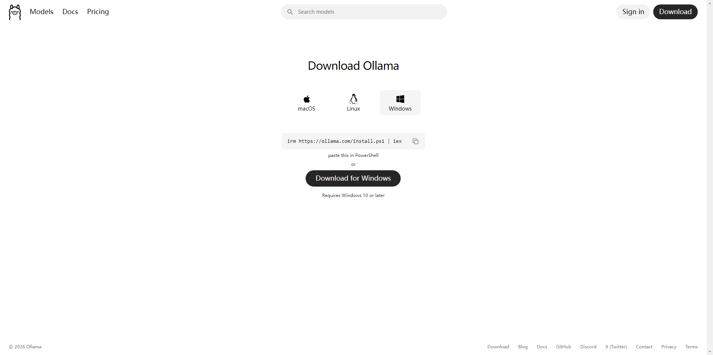
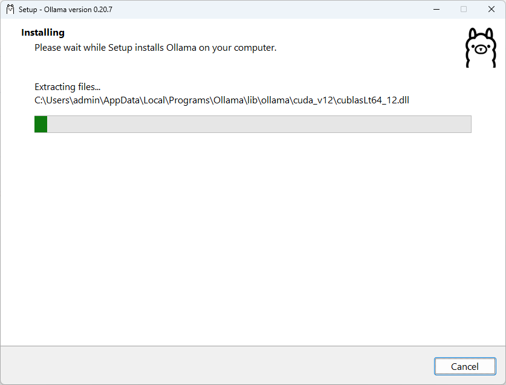

# Ollama

Ollama 是一款用于在本地运行大语言模型（LLM）的轻量级工具，定位类似“本地版推理引擎”。它支持在个人电脑上快速部署和管理模型，如 LLaMA、Mistral 等，无需依赖云服务即可完成推理任务。

其核心特点包括：一是通过简单命令（如 `ollama run`）即可拉取并运行模型，降低使用门槛；二是支持模型版本管理和自定义 Modelfile，便于构建私有模型；三是提供本地 API 服务，可与后端系统（如 Java/Spring Boot）集成；四是数据完全本地化，适用于对隐私和数据安全要求较高的场景。

总体来看，Ollama 更偏向工程化落地，适合开发者在本地进行 AI 能力集成与测试。

- [官网地址](https://ollama.com/)


**按能力类型分类**

1. 通用对话模型（Chat LLM）
    用于多轮对话、问答、代码生成等，是最常见类型。代表如 GPT-4、LLaMA、Mistral。
2. 代码模型（Code LLM）
    针对编程场景优化，擅长补全、生成、解释代码。例如 Code Llama、StarCoder。
3. 多模态模型（Multimodal）
    支持文本 + 图像（甚至语音、视频）输入输出。例如 GPT-4V、Gemini。
4. 嵌入模型（Embedding Model）
    将文本转为向量，用于语义检索、RAG、推荐系统。例如 text-embedding-3-large。
5. 推理/数学模型（Reasoning LLM）
    强化逻辑推理、复杂问题求解能力，适合算法、数学场景（部分新模型专门优化此能力）。
6. 轻量/边缘模型（Small / Edge LLM）
    参数规模较小，可本地运行，适合 Ollama 这类环境部署，如 7B、13B 模型


## 安装 Ollama

**下载**




**安装**



**查看版本**

```
C:\Users\admin>ollama --version
ollama version is 0.20.7
```


## 使用嵌入模型

### qwen3-embedding

Qwen3 Embedding 是基于 Qwen3 基础模型构建的新一代文本向量模型，主要用于语义检索、RAG 和重排序任务。该系列支持多语言（100+）与代码检索，在 MTEB 等基准上达到 SOTA 表现，并提供 0.6B～8B 多种规模以适配不同算力场景。模型支持指令增强与可变向量维度（Matryoshka），在效果与效率之间具备较强灵活性。 

**拉取模型**

根据本地主机资源大小自行选择模型版本

拉取指定版本查看官网 tags：[链接](https://ollama.com/library/qwen3-embedding)

```
ollama pull qwen3-embedding:4b
```

**查看模型信息**

```
ollama show qwen3-embedding:4b
```

输出

```
  Model
    architecture        qwen3
    parameters          4.0B
    context length      40960
    embedding length    2560
    quantization        Q4_K_M

  Capabilities
    embedding
```

**调用本地接口获取向量数据**

```
curl http://localhost:11434/api/embeddings -d '{
  "model": "qwen3-embedding:4b",
  "prompt": "这是一个用于测试 embedding 的文本"
}'
```

返回

> embedding数组长度2560，取决于嵌入模型的embedding length

```
{"embedding":[0.012325936928391457,0.00027471117209643126,...]}
```


### nomic-embed-text-v2-moe

nomic-embed-text-v2-moe 是基于 MoE（专家混合）架构的多语言 embedding 模型，支持约 100 种语言，训练数据超过 16 亿文本对，具备较强跨语言检索能力。支持 Matryoshka 降维，可在降低存储成本的同时保持性能。需要使用 query/document 前缀才能达到最佳效果，更适合实际业务中的多语言 RAG 场景。

**拉取模型**

拉取指定版本查看官网 tags：[链接](https://ollama.com/library/nomic-embed-text-v2-moe/tags)

```
ollama pull nomic-embed-text-v2-moe:latest
```

**查看模型信息**

```
ollama show nomic-embed-text-v2-moe:latest
```

输出

```
  Model
    architecture        nomic-bert-moe
    parameters          475.29M
    context length      512
    embedding length    768
    quantization        F16

  Capabilities
    embedding
```

**调用本地接口获取向量数据**

```
curl http://localhost:11434/api/embeddings -d '{
  "model": "mxbai-embed-large",
  "prompt": "这是一个用于测试 embedding 的文本"
}'
```

返回

> embedding数组长度768，取决于嵌入模型的embedding length

```
{"embedding":[0.012325936928391457,0.00027471117209643126,...]}
```


### mxbai-embed-large

mxbai-embed-large 是一款以英文语义检索为核心优化的 dense embedding 模型，参数规模约 3 亿级，在 MTEB 等英文基准任务中表现较强。其特点是结构简单、无需特殊前缀即可使用，适合快速接入 RAG 系统。但多语言能力较弱，中文或混合语料场景下效果会明显下降，更适合纯英文知识库。

**拉取模型**

拉取指定版本查看官网 tags：[链接](https://ollama.com/library/mxbai-embed-large/tags)

```
ollama pull mxbai-embed-large:335m
```

**查看模型信息**

```
ollama show mxbai-embed-large:335m
```

输出

```
  Model
    architecture        bert
    parameters          334M
    context length      512
    embedding length    1024
    quantization        F16

  Capabilities
    embedding

  Parameters
    num_ctx    512

  License
    Apache License
    Version 2.0, January 2004
    ...
```

**调用本地接口获取向量数据**

```
curl http://localhost:11434/api/embeddings -d '{
  "model": "mxbai-embed-large",
  "prompt": "这是一个用于测试 embedding 的文本"
}'
```

返回

> embedding数组长度1024，取决于嵌入模型的embedding length

```
{"embedding":[0.012325936928391457,0.00027471117209643126,...]}
```


## 使用通用对话模型

### qwen3.5

Qwen3.5 是阿里推出的新一代大语言模型系列，覆盖 4B～72B 多种参数规模，支持指令跟随、代码生成与复杂推理任务。相比 2.5 版本，在长上下文、多轮对话和工具调用能力上进一步增强，并优化了推理效率，适合本地部署与企业级应用场景，兼顾性能与成本。

**拉取模型**

根据本地主机资源大小自行选择模型版本

拉取指定版本查看官网 tags：[链接](https://ollama.com/library/qwen3.5)

```
ollama pull qwen3.5:2b
```

**查看模型信息**

```
ollama show qwen3.5:2b
```

输出

```
  Model
    architecture        qwen35
    parameters          2.3B
    context length      262144
    embedding length    2048
    quantization        Q8_0
    requires            0.17.1

  Capabilities
    completion
    vision
    tools
    thinking

  Parameters
    top_k               20
    top_p               0.95
    presence_penalty    1.5
    temperature         1

  License
    Apache License
    Version 2.0, January 2004
    ...
```

**运行模型（本地对话）**

```
ollama run qwen3.5:2b
```

进入交互模式后可直接输入：

```
你好，帮我解释一下什么是RAG？
```

------

**调用本地接口（对话生成）**

```
curl http://localhost:11434/api/generate -d '{
  "model": "qwen3.5:2b",
  "prompt": "用简单的话解释一下什么是向量数据库",
  "stream": false
}'
```

返回示例：

```
{
	"model": "qwen3.5:2b",
	"created_at": "2026-04-15T05:52:01.1131663Z",
	"response": "简单地说，**向量数据库就是专门用来...",
	"done": true,
	"done_reason": "stop",
	"context": [
		248045,
		846,
		...,
		1710
	],
	"total_duration": 599675020600,
	"load_duration": 7978060200,
	"prompt_eval_count": 18,
	"prompt_eval_duration": 913166400,
	"eval_count": 2195,
	"eval_duration": 457556088900
}
```

------

**调用 Chat 接口（推荐）**

```
curl http://localhost:11434/api/chat -d '{
  "model": "qwen3.5:2b",
  "messages": [
    {"role": "user", "content": "介绍一下RAG架构"}
  ]
}'
```

返回示例：

```
{"model":"qwen3.5:2b","created_at":"2026-04-15T05:56:23.7917567Z","message":{"role":"assistant","content":"","thinking":"好 的"},"done":false}
{"model":"qwen3.5:2b","created_at":"2026-04-15T05:56:23.9329142Z","message":{"role":"assistant","content":"","thinking":"，"},"done":false}
...
```


### qwen2.5

Qwen2.5 是一代成熟的通用大语言模型系列，支持多轮对话、代码生成与指令执行任务。该版本在中文理解和生成方面表现稳定，提供 3B、7B、14B 等多种参数规模，兼顾性能与资源消耗，适合本地部署与工程化应用。在长上下文和响应一致性方面表现可靠，是当前开源生态中较为稳健的选择之一。

**拉取模型**

根据本地主机资源大小自行选择模型版本

拉取指定版本查看官网 tags：[链接](https://ollama.com/library/qwen2.5)

```
ollama pull qwen2.5:3b
```

**查看模型信息**

```
ollama show qwen2.5:3b
```

输出

```
  Model
    architecture        qwen2
    parameters          3.1B
    context length      32768
    embedding length    2048
    quantization        Q4_K_M

  Capabilities
    completion
    tools

  System
    You are Qwen, created by Alibaba Cloud. You are a helpful assistant.

  License
    Qwen RESEARCH LICENSE AGREEMENT
    Qwen RESEARCH LICENSE AGREEMENT Release Date: September 19, 2024
    ...
```

**运行模型（本地对话）**

```
ollama run qwen2.5:3b
```

进入交互模式后可直接输入：

```
你好，帮我解释一下什么是RAG？
```

------

**调用本地接口（对话生成）**

```
curl http://localhost:11434/api/generate -d '{
  "model": "qwen2.5:3b",
  "prompt": "用简单的话解释一下什么是向量数据库",
  "stream": false
}'
```

返回示例：

```
{
	"model": "qwen2.5:3b",
	"created_at": "2026-04-15T04:15:04.0574695Z",
	"response": "向量数据库是用来存储和处理“向量”的数据库。向量...",
	"done": true,
	"done_reason": "stop",
	"context": [
		151644,
		8948,
		...,
		1773
	],
	"total_duration": 14974498600,
	"load_duration": 293003500,
	"prompt_eval_count": 38,
	"prompt_eval_duration": 445681100,
	"eval_count": 118,
	"eval_duration": 14006723500
}
```

------

**调用 Chat 接口（推荐）**

```
curl http://localhost:11434/api/chat -d '{
  "model": "qwen2.5:3b",
  "messages": [
    {"role": "user", "content": "介绍一下RAG架构"}
  ]
}'
```

返回示例：

```
{"model":"qwen2.5:3b","created_at":"2026-04-15T04:13:16.636584Z","message":{"role":"assistant","content":"R"},"done":false}
{"model":"qwen2.5:3b","created_at":"2026-04-15T04:13:16.7404825Z","message":{"role":"assistant","content":"AG"},"done":false}
...
```


## 模型管理

查看已下载模型

```
ollama list
```

------

删除模型

```
ollama rm qwen2.5:3b
```

------

手动运行（调试）

```
ollama run qwen2.5:3b
```

关闭

```
ollama stop qwen2.5:3b
```

------

查看运行状态

```
ollama ps
```