# Spring AI

## 版本信息

| 组件       | 版本                                     |
| ---------- | ---------------------------------------- |
| JDK        | 21                                       |
| Maven      | 3.9.12                                   |
| SpringBoot | 3.5.13                                   |
| SpringAI   | 1.1.4                                    |
| Model      | OpenAI（DeepSeek、Qwen 兼容 OpenAI API） |


------

## 基础配置

**添加依赖**

```xml
<properties>
    <spring-ai.version>1.1.4</spring-ai.version>
</properties>
<dependencies>
    <!-- Spring AI - OpenAI 依赖 -->
    <dependency>
        <groupId>org.springframework.ai</groupId>
        <artifactId>spring-ai-starter-model-openai</artifactId>
    </dependency>
</dependencies>
<dependencyManagement>
    <dependencies>
        <dependency>
            <groupId>org.springframework.ai</groupId>
            <artifactId>spring-ai-bom</artifactId>
            <version>${spring-ai.version}</version>
            <type>pom</type>
            <scope>import</scope>
        </dependency>
    </dependencies>
</dependencyManagement>
```

**编辑配置**

免费使用 API Key：[GPT_API_free](https://github.com/chatanywhere/GPT_API_free)

```yaml
---
# Spring AI 配置
spring:
  ai:
    openai:
      base-url: https://api.chatanywhere.tech
      api-key: ${OPENAI_API_KEY}
      chat:
        options:
          model: gpt-4o-mini
```


## 模型配置

### OpenAI

添加依赖

```xml
<!-- Spring AI - OpenAI 依赖 -->
<dependency>
    <groupId>org.springframework.ai</groupId>
    <artifactId>spring-ai-starter-model-openai</artifactId>
</dependency>
```

编辑 `application.yml`

```yaml
---
# Spring AI 配置
spring:
  ai:
    openai:
      api-key: ${OPENAI_API_KEY}
      base-url: https://api.openai.com
      chat:
        options:
          model: gpt-4o-mini
          temperature: 0.7
          max-tokens: 2048
          top-p: 1.0
      embedding:
        options:
          model: text-embedding-3-small
```


### DeepSeek

> DeepSeek 的 API 在协议层“兼容 OpenAI”，因此这里选择使用 spring-ai-starter-model-openai 依赖
>
> DeepSeek 没有 embedding 模型，这里配置的是 Ollama 开源 embedding 

添加依赖

```xml
<!-- Spring AI - OpenAI 依赖 -->
<dependency>
    <groupId>org.springframework.ai</groupId>
    <artifactId>spring-ai-starter-model-openai</artifactId>
</dependency>
```

编辑 `application.yml`

```yaml
---
# Spring AI 配置
spring:
  ai:
    openai:
      api-key: ${DEEPSEEK_API_KEY}
      base-url: https://api.deepseek.com
      chat:
        options:
          model: deepseek-chat
          temperature: 0.7
          max-tokens: 4096
          top-p: 0.9
      embedding:
        base-url: http://localhost:11434
        api-key:
        embeddings-path: /v1/embeddings
        options:
          model: qwen3-embedding:4b
```


### Qwen

> Qwen 的 API 在协议层“兼容 OpenAI”（DashScope 提供兼容层），因此这里选择使用 spring-ai-starter-model-openai 依赖
>

添加依赖

```xml
<!-- Spring AI - OpenAI 依赖 -->
<dependency>
    <groupId>org.springframework.ai</groupId>
    <artifactId>spring-ai-starter-model-openai</artifactId>
</dependency>
```

编辑 `application.yml`

> 注意这里 base-url 不是 https://dashscope.aliyuncs.com/compatible-mode/v1

```yaml
---
# Spring AI 配置
spring:
  ai:
    openai:
      api-key: ${DASHSCOPE_API_KEY}
      base-url: https://dashscope.aliyuncs.com/compatible-mode
      chat:
        options:
          model: qwen3.6-plus
          temperature: 0.7
          max-tokens: 4096
          top-p: 0.9
      embedding:
        options:
          model: text-embedding-v4
```


### Ollama

添加依赖

```xml
<!-- Spring AI - Ollama 依赖 -->
<dependency>
    <groupId>org.springframework.ai</groupId>
    <artifactId>spring-ai-starter-model-ollama</artifactId>
</dependency>
```

编辑 `application.yml` 

```yaml
---
# Spring AI 配置
spring:
  ai:
    ollama:
      base-url: http://localhost:11434
      chat:
        options:
          model: qwen2.5:0.5b
          temperature: 0.7
          max-tokens: 2048
          top-p: 1.0
      embedding:
        options:
          model: qwen3-embedding:0.6b
```


## 基础使用

**controller创建**

```java
package io.github.atengk.ai.controller;

import org.springframework.ai.chat.client.ChatClient;
import org.springframework.web.bind.annotation.GetMapping;
import org.springframework.web.bind.annotation.RequestMapping;
import org.springframework.web.bind.annotation.RequestParam;
import org.springframework.web.bind.annotation.RestController;
import reactor.core.publisher.Flux;

@RestController
@RequestMapping("/api/ai")
public class BaseChatController {

    private final ChatClient chatClient;

    public BaseChatController(ChatClient.Builder chatClientBuilder) {
        this.chatClient = chatClientBuilder.build();
    }

}
```

### 最基础的同步对话

```java
/**
 * 最基础的同步对话
 */
@GetMapping("/chat")
public String chat(@RequestParam String message) {
    return chatClient
            .prompt()
            .user(message)
            .call()
            .content();
}
```

GET /api/ai/chat?message=SpringAI是什么？

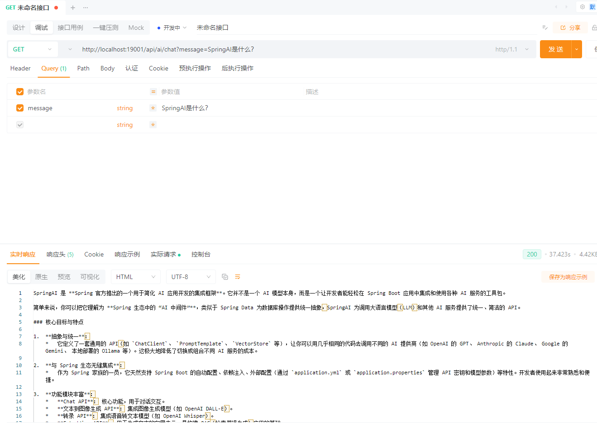

### 流式对话（SSE / WebFlux 场景）

```java
/**
 * 流式对话（SSE / WebFlux 场景）
 */
@GetMapping("/chat/stream")
public Flux<String> stream(@RequestParam String message) {
    return chatClient
            .prompt()
            .user(message)
            .stream()
            .content();
}
```

GET /api/ai/chat/stream?message=SpringAI是什么？

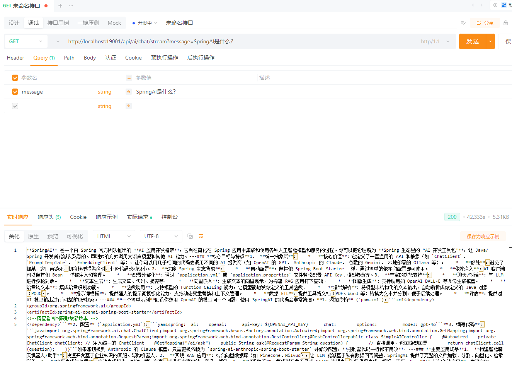

### 带 System Prompt 的基础用法

```java
/**
 * 带 System Prompt 的基础用法
 */
@GetMapping("/chat/system")
public String chatWithSystem(
        @RequestParam String system,
        @RequestParam String message) {

    return chatClient
            .prompt()
            .system(system)
            .user(message)
            .call()
            .content();
}
```

GET /api/ai/chat/system?system=你是一个Java专家&message=什么是SpringAI


### 使用 Prompt Template 的基础示例

```java
/**
 * 使用 Prompt Template 的基础示例
 */
@GetMapping("/chat/template")
public String chatWithTemplate(
        @RequestParam String topic,
        @RequestParam(defaultValue = "Java") String language) {

    return chatClient
            .prompt()
            .user(u -> u.text("""
                    请用 {language} 的视角，
                    解释一下 {topic}，
                    并给出一个简单示例
                    """)
                    .param("topic", topic)
                    .param("language", language)
            )
            .call()
            .content();
}
```

GET /api/ai/chat/template?topic=SpringAI是什么？

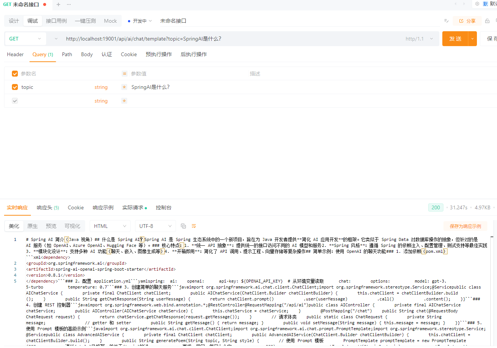


## Prompt 与模型参数管理

在实际项目中，Prompt 和模型参数如果缺乏统一管理，往往会出现**难以维护、行为不可控、无法复用**等问题。本章节从工程实践角度，介绍如何对 Prompt 与模型参数进行系统化管理。

---

### 为什么需要 Prompt 管理

在简单示例中，将 Prompt 直接写在 Controller 或 Service 中是可以接受的，但在真实项目中会逐渐暴露问题：

* Prompt 分散在各个类中，难以统一修改
* 相同的 System Prompt 被多次复制
* Prompt 的职责与业务逻辑耦合，降低可读性
* Prompt 无法版本化，模型行为不可追溯

因此，在工程实践中应当将 Prompt 视为**一种配置资源**，而不是普通字符串。

**核心目标：**

* Prompt 可集中定义
* Prompt 可复用、可演进
* Prompt 与业务逻辑解耦

---

### System Prompt 的集中定义

System Prompt 用于定义模型的角色、边界和回答风格，通常在多个接口或业务场景中复用。

推荐将 System Prompt 统一集中管理，例如：

```java
package io.github.atengk.ai.prompt;

/**
 * 系统级 Prompt 定义
 */
public final class SystemPrompts {

    private SystemPrompts() {
    }

    /**
     * Java 专家角色
     */
    public static final String JAVA_EXPERT = """
            你是一名资深 Java 架构师，
            回答应遵循最佳实践，
            代码示例需清晰、简洁、易于理解。
            """;

    /**
     * 技术文档编写专家
     */
    public static final String TECH_WRITER = """
            你是一名技术文档专家，
            请用清晰、严谨且通俗的语言解释概念，
            避免不必要的营销化表达。
            """;
}
```

在使用时，仅引用对应的 Prompt，而不是直接编写字符串：

```java
chatClient
        .prompt()
        .system(SystemPrompts.JAVA_EXPERT)
        .user(message)
        .call()
        .content();
```

这样可以保证 System Prompt 的**一致性和可维护性**。

---

### Prompt Template 的工程化使用

当 Prompt 中包含动态变量时，推荐使用 Prompt Template，并将其进行统一管理。

示例：定义 Prompt 模板枚举

```java
package io.github.atengk.ai.prompt;

/**
 * Prompt 模板定义
 */
public enum PromptTemplates {

    EXPLAIN_TOPIC("""
            请用 {language} 的视角，
            解释 {topic}，
            并给出一个简单示例。
            """),

    CODE_REVIEW("""
            请对以下代码进行审查，
            指出潜在问题并给出改进建议：
            {code}
            """);

    private final String template;

    PromptTemplates(String template) {
        this.template = template;
    }

    public String template() {
        return template;
    }
}
```

使用时只需关注参数填充，而无需关心 Prompt 的具体内容：

```java
chatClient
        .prompt()
        .user(u -> u.text(PromptTemplates.EXPLAIN_TOPIC.template())
                .param("topic", topic)
                .param("language", language)
        )
        .call()
        .content();
```

这种方式可以显著提升 Prompt 的**复用性和可读性**。

---

### 模型参数（temperature / top_p）的场景化配置

模型参数直接影响 AI 的回答风格，例如：

* `temperature`：控制随机性
* `top_p`：控制输出多样性
* `max_tokens`：限制响应长度

不建议在代码中随意硬编码这些参数，而应根据**业务场景**进行抽象。

示例：定义模型参数配置

```java
package io.github.atengk.ai.model;

import org.springframework.ai.chat.ChatOptions;
import org.springframework.ai.openai.OpenAiChatOptions;

/**
 * 模型参数配置
 */
public enum ModelProfiles {

    DEFAULT(OpenAiChatOptions.builder().build()),

    PRECISE(OpenAiChatOptions.builder()
            .temperature(0.1)
            .build()),

    CREATIVE(OpenAiChatOptions.builder()
            .temperature(0.9)
            .topP(0.95)
            .build());

    private final ChatOptions options;

    ModelProfiles(ChatOptions options) {
        this.options = options;
    }

    public ChatOptions options() {
        return options;
    }
}
```

在调用时根据业务需求选择合适的参数配置：

```java
chatClient
        .prompt()
        .options(ModelProfiles.PRECISE.options())
        .user(message)
        .call()
        .content();
```

这样可以避免“凭感觉调参数”的问题，使模型行为更加稳定可控。

---

### Prompt、模型参数与对话记忆的关系

在 Spring AI 中，这三者的职责应当明确区分：

* **System Prompt**：定义模型角色和行为边界
* **Prompt Template**：定义一次请求的输入结构
* **模型参数**：控制模型输出风格与稳定性
* **对话记忆（Chat Memory）**：维持上下文连续性

需要注意的是：

> **对话记忆不应承担规则或角色定义，规则应由 System Prompt 负责。**

一个推荐的组合方式是：

* System Prompt：固定角色
* Prompt Template：当前问题结构
* Model Profile：场景化参数
* Chat Memory：上下文连续对话

这一设计为下一章节的**对话记忆机制**提供了清晰的职责边界。

---


## 对话记忆

**添加依赖**

```xml
<!-- Spring AI JDBC Chat Memory -->
<dependency>
    <groupId>org.springframework.ai</groupId>
    <artifactId>spring-ai-starter-model-chat-memory-repository-jdbc</artifactId>
</dependency>

<!-- HikariCP 数据源 依赖 -->
<dependency>
    <groupId>com.zaxxer</groupId>
    <artifactId>HikariCP</artifactId>
</dependency>

<!-- MySQL数据库驱动 -->
<dependency>
    <groupId>com.mysql</groupId>
    <artifactId>mysql-connector-j</artifactId>
</dependency>
```

**编辑配置**

初始化表结构

```java
spring:
  ai:
    chat:
      memory:
        repository:
          jdbc:
            initialize-schema: always
```

**配置 ChatClientConfig**

```java
package io.github.atengk.ai.config;

import org.springframework.ai.chat.client.ChatClient;
import org.springframework.ai.chat.client.advisor.MessageChatMemoryAdvisor;
import org.springframework.ai.chat.memory.ChatMemory;
import org.springframework.context.annotation.Bean;
import org.springframework.context.annotation.Configuration;

@Configuration
public class ChatClientConfig {

    @Bean
    public ChatClient chatClient(
            ChatClient.Builder builder,
            ChatMemory chatMemory) {

        return builder
                .defaultAdvisors(
                        MessageChatMemoryAdvisor
                                .builder(chatMemory)
                                .build()
                )
                .build();
    }

}
```

**创建接口**

```java
package io.github.atengk.ai.controller;

import lombok.RequiredArgsConstructor;
import org.springframework.ai.chat.client.ChatClient;
import org.springframework.ai.chat.memory.ChatMemory;
import org.springframework.web.bind.annotation.GetMapping;
import org.springframework.web.bind.annotation.RequestMapping;
import org.springframework.web.bind.annotation.RequestParam;
import org.springframework.web.bind.annotation.RestController;

@RestController
@RequestMapping("/api/ai/memory")
@RequiredArgsConstructor
public class MemoryChatController {

    private final ChatClient chatClient;

    @GetMapping("/chat")
    public String chat(
            @RequestParam String conversationId,
            @RequestParam String message) {

        return chatClient
                .prompt()
                .user(message)
                .advisors(a ->
                        a.param(ChatMemory.CONVERSATION_ID, conversationId)
                )
                .call()
                .content();
    }

}
```

**使用接口**

```
GET /api/ai/memory/chat?conversationId=001&message=我叫阿腾
GET /api/ai/memory/chat?conversationId=001&message=我叫什么？
```

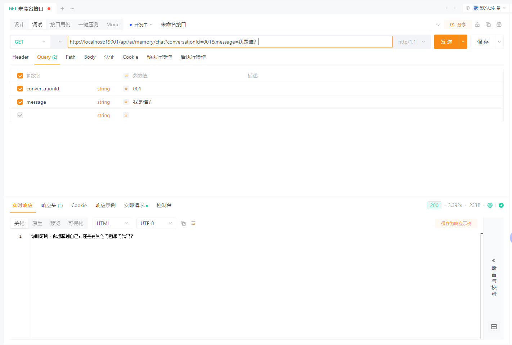

查看MySQL数据

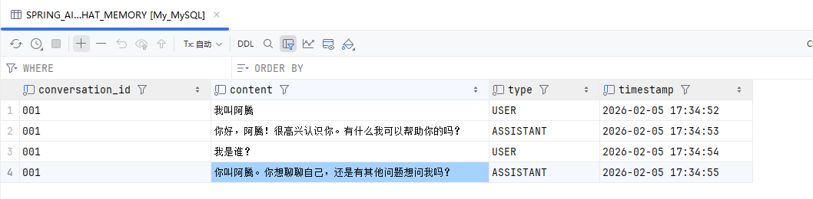


## Tool Calling：让 AI 调用代码

Tool Calling（工具调用）允许 AI 在对话过程中，根据上下文**主动调用后端方法**，从而将自然语言请求转化为真实的业务操作。这一机制非常适合用于查询、计算、规则判断等场景。

------

**为什么需要 Tool Calling**

在没有 Tool Calling 的情况下，AI 只能“回答问题”，却无法参与真实业务流程，例如：

- 查询数据库中的用户信息
- 计算订单金额
- 获取当前时间或系统状态
- 执行业务规则校验

Tool Calling 的目标是：

> **让 AI 决定“要不要调用代码”，而不是“直接生成结果”。**

### 创建 Tools 

```java
package io.github.atengk.ai.tool;

import lombok.extern.slf4j.Slf4j;
import org.springframework.ai.tool.annotation.Tool;
import org.springframework.stereotype.Component;

import java.time.LocalDateTime;

/**
 * 通用工具
 */
@Component
@Slf4j
public class CommonTools {

    @Tool(description = "获取当前系统时间")
    public String currentTime() {
        log.info("调用了 [{}] 的方法", "获取当前系统时间");
        return LocalDateTime.now().toString();
    }

    @Tool(description = "计算两个整数的和")
    public int sum(int a, int b) {
        log.info("调用了 [{}] 的方法", "计算两个整数的和");
        return a + b;
    }

    @Tool(description = "根据用户ID查询用户名称")
    public String findUserName(Long userId) {
        log.info("调用了 [{}] 的方法", "根据用户ID查询用户名称");
        return "ateng";
    }

    @Tool(description = "判断用户是否成年")
    public boolean isAdult(int age) {
        log.info("调用了 [{}] 的方法", "判断用户是否成年");
        return age >= 18;
    }

}
```

### 注册 Tools

#### 全局注册

```java
package io.github.atengk.ai.config;

import io.github.atengk.ai.tool.CommonTools;
import lombok.RequiredArgsConstructor;
import org.springframework.ai.chat.client.ChatClient;
import org.springframework.ai.chat.client.advisor.MessageChatMemoryAdvisor;
import org.springframework.ai.chat.memory.ChatMemory;
import org.springframework.context.annotation.Bean;
import org.springframework.context.annotation.Configuration;

@Configuration
@RequiredArgsConstructor
public class ChatClientConfig {

    private final CommonTools commonTools;

    @Bean
    public ChatClient chatClient(
            ChatClient.Builder builder,
            ChatMemory chatMemory) {

        return builder
                .defaultTools(commonTools)
                .defaultAdvisors(
                        MessageChatMemoryAdvisor
                                .builder(chatMemory)
                                .build()
                )
                .build();
    }

}
```

#### 局部注册

```java
package io.github.atengk.ai.controller;

import io.github.atengk.ai.tool.CommonTools;
import lombok.RequiredArgsConstructor;
import org.springframework.ai.chat.client.ChatClient;
import org.springframework.web.bind.annotation.GetMapping;
import org.springframework.web.bind.annotation.RequestMapping;
import org.springframework.web.bind.annotation.RequestParam;
import org.springframework.web.bind.annotation.RestController;

@RestController
@RequiredArgsConstructor
@RequestMapping("/api/ai/tool")
public class ToolChatController {

    private final ChatClient chatClient;
    private final CommonTools commonTools;

    /**
     * 最基础的同步对话
     */
    @GetMapping("/chat")
    public String chat(@RequestParam String message) {
        return chatClient
                .prompt()
                .tools(commonTools)
                .system("""
                        你可以在必要时调用系统提供的工具，
                        工具的返回结果是可信的，
                        不要自行编造结果。
                        """)
                .user(message)
                .call()
                .content();
    }

}
```

### 使用 Tool

```
GET /api/ai/tool/chat?message=现在的时间是？
```

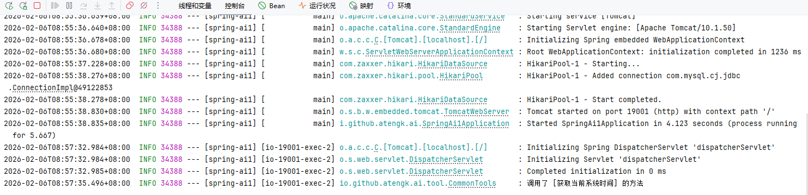

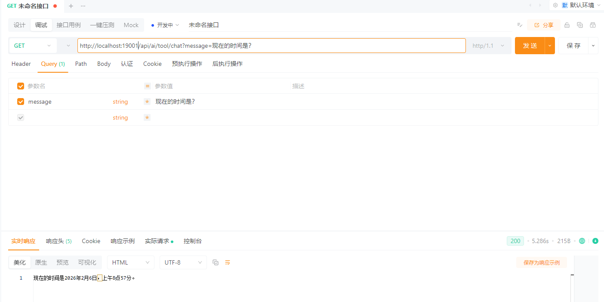

```
GET /api/ai/tool/chat?message=1加1等于几？
```

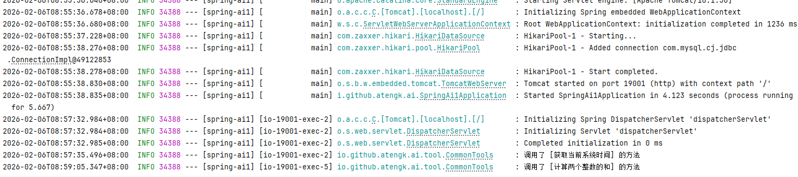


```
GET /api/ai/tool/chat?message=我的ID是10010，我的用户名称是什么？
```

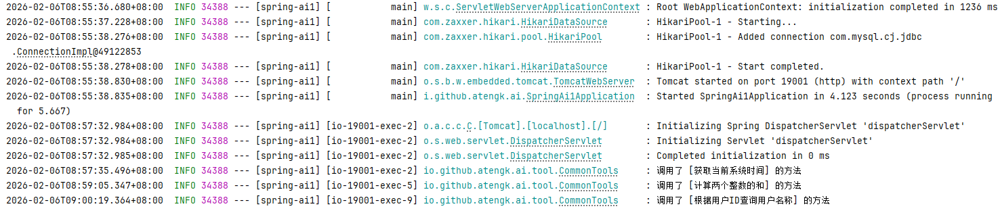

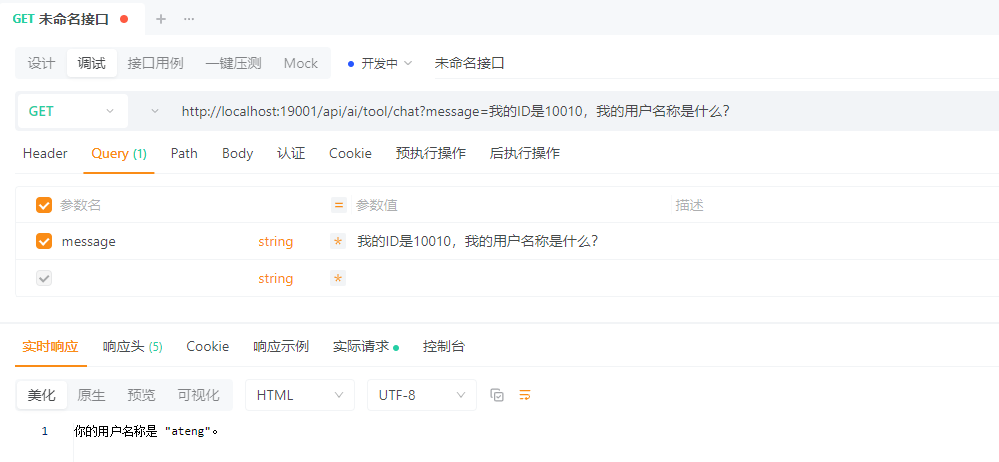

```
GET /api/ai/tool/chat?message=我的年龄是25岁，请问是是否成年了？
```

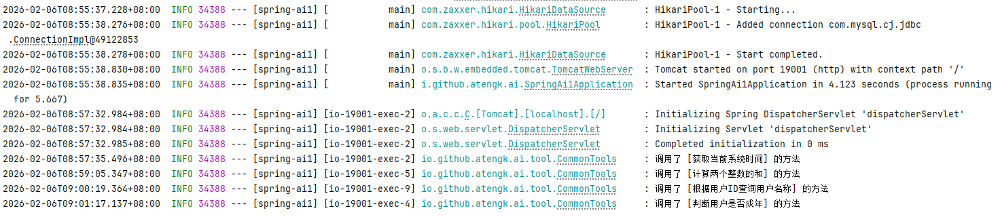

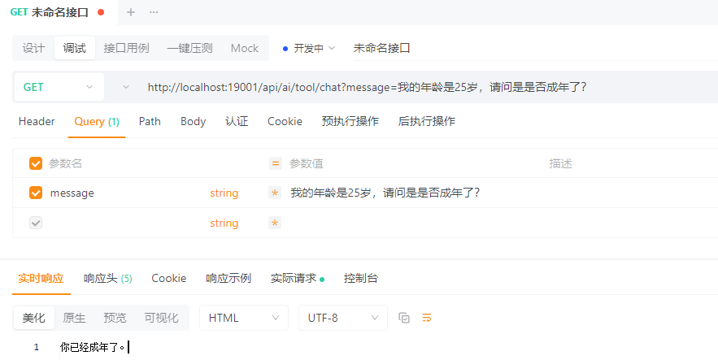

---


## 接入 MCP Server

MCP Server 开发参考：[链接](/ai/spring-ai1-mcp-server/README.md)

在 MCP Client 中，三种能力的使用方式完全不同：

| 类型     | 用途        | 使用方式                            |
| -------- | ----------- | ----------------------------------- |
| Tool     | 可执行能力  | 自动注册到 ChatClient（模型可调用） |
| Resource | 只读数据    | Client 主动读取 → 注入 Prompt       |
| Prompt   | Prompt 模板 | Client 获取模板 → 组装对话          |

### 基础配置

**添加依赖**

```xml
<!-- Spring AI MCP Client 依赖 -->
<dependency>
    <groupId>org.springframework.ai</groupId>
    <artifactId>spring-ai-starter-mcp-client</artifactId>
</dependency>
```

**添加配置**

```yaml
---
# Spring AI MCP Client 配置
spring:
  ai:
    mcp:
      client:
        streamable-http:
          connections:
            local-mcp:
              url: http://localhost:19002
              endpoint: /mcp
        name: ateng-mcp-client
        version: 1.0.0
```

**MCP Client 配置**

```java
package io.github.atengk.ai.config;

import io.modelcontextprotocol.client.McpSyncClient;
import lombok.RequiredArgsConstructor;
import org.springframework.ai.chat.client.ChatClient;
import org.springframework.ai.tool.ToolCallbackProvider;
import org.springframework.context.annotation.Bean;
import org.springframework.context.annotation.Configuration;

import java.util.List;

/**
 * MCP Client 配置
 *
 * @author Ateng
 * @since 2026-04-22
 */
@Configuration
@RequiredArgsConstructor
public class McpClientConfig {

    /**
     * 构建 ChatClient，并接入 MCP Tool（支持模型自动调用）
     *
     * @param builder              ChatClient 构建器
     * @param toolCallbackProvider 工具提供者（包含 MCP Tool / 本地 Tool）
     * @return ChatClient
     */
    @Bean
    public ChatClient mcpChatClient(
            ChatClient.Builder builder,
            ToolCallbackProvider toolCallbackProvider) {

        return builder
                .defaultToolCallbacks(toolCallbackProvider)
                .build();
    }

    /**
     * 提供默认 McpSyncClient（用于手动调用 Resource / Prompt / Tool）
     *
     * @param mcpSyncClients Spring 自动注入的 MCP Client 列表
     * @return 默认 McpSyncClient
     */
    @Bean
    public McpSyncClient defaultMcpSyncClient(List<McpSyncClient> mcpSyncClients) {
        if (mcpSyncClients == null || mcpSyncClients.isEmpty()) {
            throw new IllegalStateException("未找到可用的 MCP Sync Client");
        }
        return mcpSyncClients.get(0);
    }

}
```

---

### MCP Tool 使用

```java
mcpServerChatClient
    .prompt()
    .system("""
            你可以在必要时调用系统提供的工具，
            工具的返回结果是可信的，
            不要自行编造结果。
            """)
    .user(message)
    .call()
    .content()
```

---

### MCP Client 路由器

**创建 Client 路由层**

```java
package io.github.atengk.ai.service;

import io.modelcontextprotocol.client.McpSyncClient;
import org.springframework.stereotype.Component;

import java.util.List;

/**
 * MCP Client 路由器
 * <p>
 * 用于管理 Spring AI 自动注入的多个 McpSyncClient，
 * 提供默认获取、按索引选择、批量访问等能力。
 * <p>
 * 说明：
 * - Spring AI 会为每个 MCP Server 连接创建一个 McpSyncClient
 * - 当前未提供 connectionName -> client 的直接映射
 *
 * @author Ateng
 * @since 2026-04-22
 */
@Component
public class McpClientRouter {

    private final List<McpSyncClient> clients;

    public McpClientRouter(List<McpSyncClient> clients) {
        this.clients = clients;
    }

    /**
     * 获取默认 Client（适用于单 MCP Server 场景）
     *
     * @return 默认 McpSyncClient（列表第一个）
     */
    public McpSyncClient getDefaultClient() {
        if (clients == null || clients.isEmpty()) {
            throw new IllegalStateException("未获取到任何 MCP Client");
        }
        return clients.get(0);
    }

    /**
     * 按索引获取指定 Client
     * <p>
     * 注意：
     * - index 与 spring.ai.mcp.client.sse.connections 的配置顺序一致
     * - 多 Server 场景建议避免硬编码 index
     *
     * @param index MCP Server 索引（从 0 开始）
     * @return 对应的 McpSyncClient
     */
    public McpSyncClient getByIndex(int index) {
        if (clients == null || clients.size() <= index) {
            throw new IllegalArgumentException("MCP Client 不存在, index=" + index);
        }
        return clients.get(index);
    }

    /**
     * 获取全部 Client（用于聚合调用或广播）
     *
     * @return MCP Client 列表
     */
    public List<McpSyncClient> getAll() {
        return clients;
    }
}
```

---

### MCP Resource 客户端服务

**核心理解**

> Resource 不是让模型调用的，而是：
>
> 👉 **Client 主动读取 → 注入到 Prompt 中**

```java
package io.github.atengk.ai.service;

import io.modelcontextprotocol.client.McpSyncClient;
import io.modelcontextprotocol.spec.McpSchema;
import org.slf4j.Logger;
import org.slf4j.LoggerFactory;
import org.springframework.stereotype.Service;

import java.util.ArrayList;
import java.util.List;

/**
 * MCP Resource 客户端服务
 * <p>
 * 提供 MCP Resource 的查询与读取能力：
 * - 支持多 Server 资源聚合
 * - 支持按指定 Client 精确读取
 *
 * @author Ateng
 * @since 2026-04-22
 */
@Service
public class McpResourceService {

    private static final Logger log = LoggerFactory.getLogger(McpResourceService.class);

    private final McpClientRouter router;

    public McpResourceService(McpClientRouter router) {
        this.router = router;
    }

    /**
     * 获取所有 MCP Server 的资源（聚合）
     *
     * @return Resource 列表
     */
    public List<McpSchema.Resource> listAllResources() {
        List<McpSchema.Resource> result = new ArrayList<>();

        for (McpSyncClient client : router.getAll()) {
            McpSchema.ListResourcesResult response = client.listResources();
            if (response != null && response.resources() != null) {
                result.addAll(response.resources());
            }
        }

        log.info("聚合 Resource 数量: {}", result.size());
        return result;
    }

    /**
     * 读取指定 Resource（默认 Client）
     *
     * @param uri Resource 唯一标识（如：system://runtime/info）
     * @return Resource 内容
     */
    public McpSchema.ReadResourceResult read(String uri) {
        log.info("读取 Resource, uri={}", uri);
        return router.getDefaultClient()
                .readResource(new McpSchema.ReadResourceRequest(uri));
    }

    /**
     * 读取指定 Resource（指定 Client）
     *
     * @param uri         Resource 唯一标识
     * @param clientIndex MCP Client 索引（对应 connections 顺序）
     * @return Resource 内容
     */
    public McpSchema.ReadResourceResult read(String uri, int clientIndex) {
        log.info("读取 Resource, uri={}, clientIndex={}", uri, clientIndex);
        return router.getByIndex(clientIndex)
                .readResource(new McpSchema.ReadResourceRequest(uri));
    }
}
```

------

### MCP Prompt 客户端服务

**核心理解**

> Prompt 是“远程模板”，不是直接执行的

👉 你需要：

1. 获取 Prompt
2. 填充参数
3. 再调用 ChatClient

```java
package io.github.atengk.ai.service;

import io.modelcontextprotocol.client.McpSyncClient;
import io.modelcontextprotocol.spec.McpSchema;
import org.slf4j.Logger;
import org.slf4j.LoggerFactory;
import org.springframework.stereotype.Service;

import java.util.ArrayList;
import java.util.List;
import java.util.Map;

/**
 * MCP Prompt 客户端服务
 * <p>
 * 提供 MCP Prompt 的查询与获取能力：
 * - 支持多 Server Prompt 聚合
 * - 支持按指定 Client 获取 Prompt 模板
 *
 * @author Ateng
 * @since 2026-04-22
 */
@Service
public class McpPromptService {

    private static final Logger log = LoggerFactory.getLogger(McpPromptService.class);

    private final McpClientRouter router;

    public McpPromptService(McpClientRouter router) {
        this.router = router;
    }

    /**
     * 获取所有 Prompt（聚合）
     *
     * @return Prompt 列表
     */
    public List<McpSchema.Prompt> listAllPrompts() {
        List<McpSchema.Prompt> result = new ArrayList<>();

        for (McpSyncClient client : router.getAll()) {
            McpSchema.ListPromptsResult response = client.listPrompts();
            if (response != null && response.prompts() != null) {
                result.addAll(response.prompts());
            }
        }

        log.info("聚合 Prompt 数量: {}", result.size());
        return result;
    }

    /**
     * 获取 Prompt 内容（默认 Client）
     *
     * @param name Prompt 名称（如：greeting）
     * @param args Prompt 参数（与服务端定义一致）
     * @return Prompt 内容结果
     */
    public McpSchema.GetPromptResult getPrompt(String name, Map<String, Object> args) {
        log.info("获取 Prompt, name={}, args={}", name, args);

        return router.getDefaultClient()
                .getPrompt(new McpSchema.GetPromptRequest(name, args));
    }

    /**
     * 获取 Prompt 内容（指定 Client）
     *
     * @param name        Prompt 名称
     * @param args        Prompt 参数
     * @param clientIndex MCP Client 索引（对应 connections 顺序）
     * @return Prompt 内容结果
     */
    public McpSchema.GetPromptResult getPrompt(String name, Map<String, Object> args, int clientIndex) {
        log.info("获取 Prompt, name={}, clientIndex={}", name, clientIndex);

        return router.getByIndex(clientIndex)
                .getPrompt(new McpSchema.GetPromptRequest(name, args));
    }
}
```

------

### MCP Client 测试接口

```java
package io.github.atengk.ai.controller;

import io.github.atengk.ai.service.McpPromptService;
import io.github.atengk.ai.service.McpResourceService;
import io.modelcontextprotocol.spec.McpSchema;
import lombok.RequiredArgsConstructor;
import org.springframework.ai.chat.client.ChatClient;
import org.springframework.web.bind.annotation.GetMapping;
import org.springframework.web.bind.annotation.RequestMapping;
import org.springframework.web.bind.annotation.RequestParam;
import org.springframework.web.bind.annotation.RestController;

import java.util.List;
import java.util.Map;

/**
 * MCP Client 测试接口
 * <p>
 * 提供 MCP Tool / Resource / Prompt 的调用示例接口
 *
 * @author Ateng
 * @since 2026-04-22
 */
@RestController
@RequestMapping("/mcp")
@RequiredArgsConstructor
public class McpClientController {

    private final ChatClient mcpServerChatClient;
    private final McpResourceService resourceService;
    private final McpPromptService promptService;

    /**
     * 对话接口（支持 MCP Tool 自动调用）
     * <p>
     * 示例：
     * curl "http://localhost:19001/mcp/chat?message=计算 1+2"
     * curl "http://localhost:19001/mcp/chat?message=获取北京天气"
     *
     * @param message 用户输入
     * @return 模型回复
     */
    @GetMapping("/chat")
    public String chat(@RequestParam String message) {
        return mcpServerChatClient
                .prompt()
                .system("""
                        你可以在必要时调用系统提供的工具，
                        工具的返回结果是可信的，
                        不要自行编造结果。
                        """)
                .user(message)
                .call()
                .content();
    }

    /**
     * 获取所有 Resource（聚合）
     * <p>
     * 示例：
     * curl "http://localhost:19001/mcp/resources"
     *
     * @return Resource 列表
     */
    @GetMapping("/resources")
    public List<McpSchema.Resource> resources() {
        return resourceService.listAllResources();
    }

    /**
     * 读取指定 Resource
     * <p>
     * 示例：
     * curl "http://localhost:19001/mcp/resource?uri=system://runtime/info"
     *
     * @param uri Resource 唯一标识
     * @return Resource 内容
     */
    @GetMapping("/resource")
    public McpSchema.ReadResourceResult read(@RequestParam String uri) {
        return resourceService.read(uri);
    }

    /**
     * 获取所有 Prompt（聚合）
     * <p>
     * 示例：
     * curl "http://localhost:19001/mcp/prompts"
     *
     * @return Prompt 列表
     */
    @GetMapping("/prompts")
    public List<McpSchema.Prompt> prompts() {
        return promptService.listAllPrompts();
    }

    /**
     * 获取指定 Prompt
     * <p>
     * 示例：
     * curl "http://localhost:19001/mcp/prompt?name=greeting&userName=Ateng"
     *
     * @param name     Prompt 名称
     * @param userName Prompt 参数（对应服务端定义）
     * @return Prompt 内容
     */
    @GetMapping("/prompt")
    public McpSchema.GetPromptResult prompt(@RequestParam String name,
                                            @RequestParam String userName) {
        return promptService.getPrompt(name, Map.of("name", userName));
    }
}
```

### 调用接口使用

#### MCP Tool 整数加法

调用接口

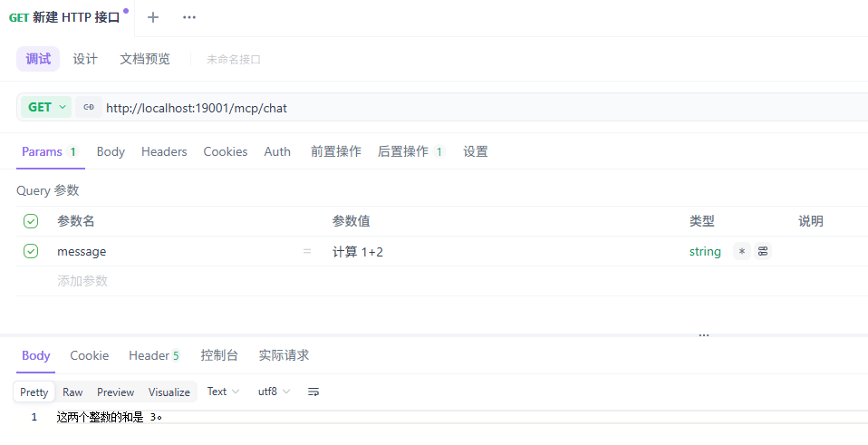

MCP Server 日志

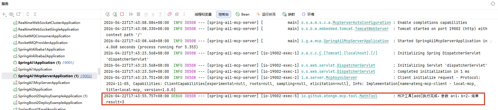


#### MCP Tool 获取城市气温

调用接口

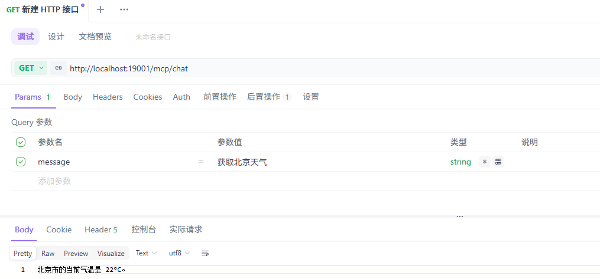

MCP Server 日志

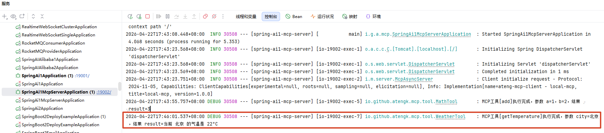


#### 获取所有 Resource（聚合）

调用接口

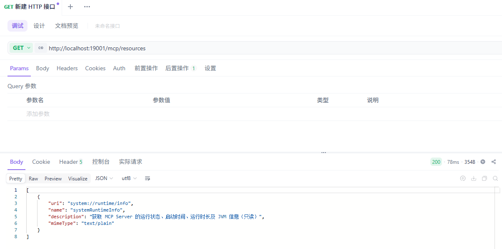

响应内容

```json
[
    {
        "uri": "system://runtime/info",
        "name": "systemRuntimeInfo",
        "description": "获取 MCP Server 的运行状态、启动时间、运行时长及 JVM 信息（只读）",
        "mimeType": "text/plain"
    }
]
```


#### 读取指定 Resource

调用接口

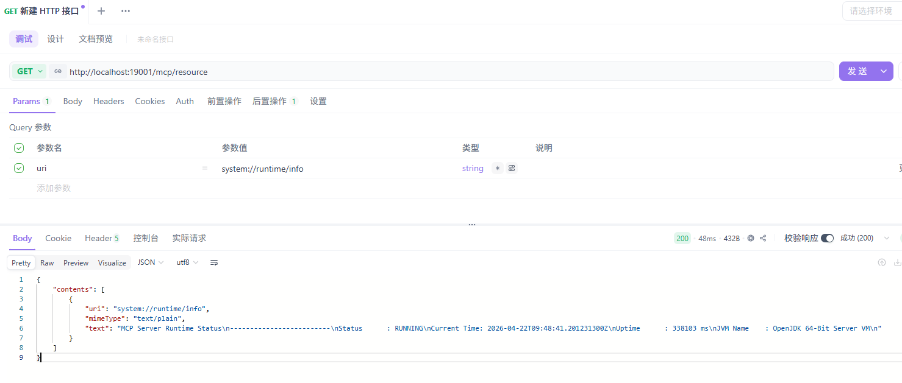

响应内容

```json
{
    "contents": [
        {
            "uri": "system://runtime/info",
            "mimeType": "text/plain",
            "text": "MCP Server Runtime Status\n-------------------------\nStatus      : RUNNING\nCurrent Time: 2026-04-22T09:48:41.201231300Z\nUptime      : 338103 ms\nJVM Name    : OpenJDK 64-Bit Server VM\n"
        }
    ]
}
```

MCP Server 日志

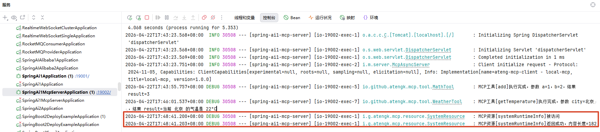


#### 获取所有 Prompt（聚合）

调用接口

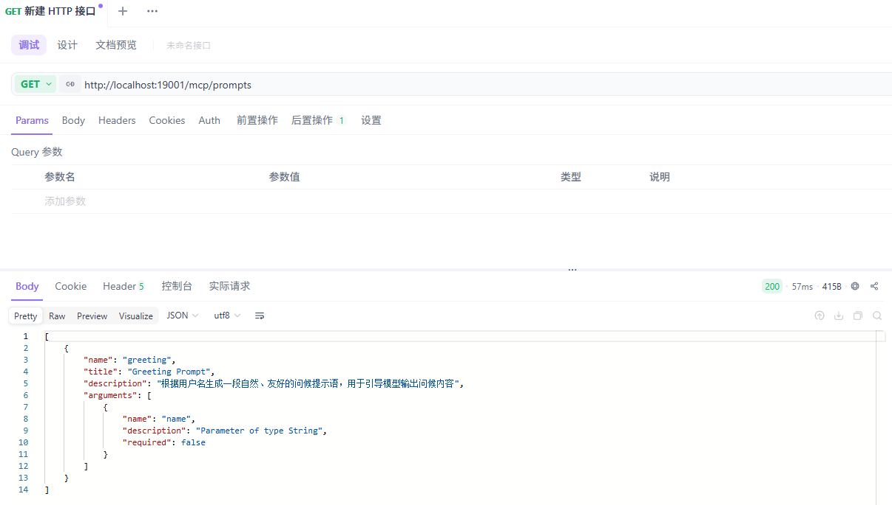

响应内容

```json
[
    {
        "name": "greeting",
        "title": "Greeting Prompt",
        "description": "根据用户名生成一段自然、友好的问候提示语，用于引导模型输出问候内容",
        "arguments": [
            {
                "name": "name",
                "description": "Parameter of type String",
                "required": false
            }
        ]
    }
]
```


#### 获取指定 Prompt

调用接口

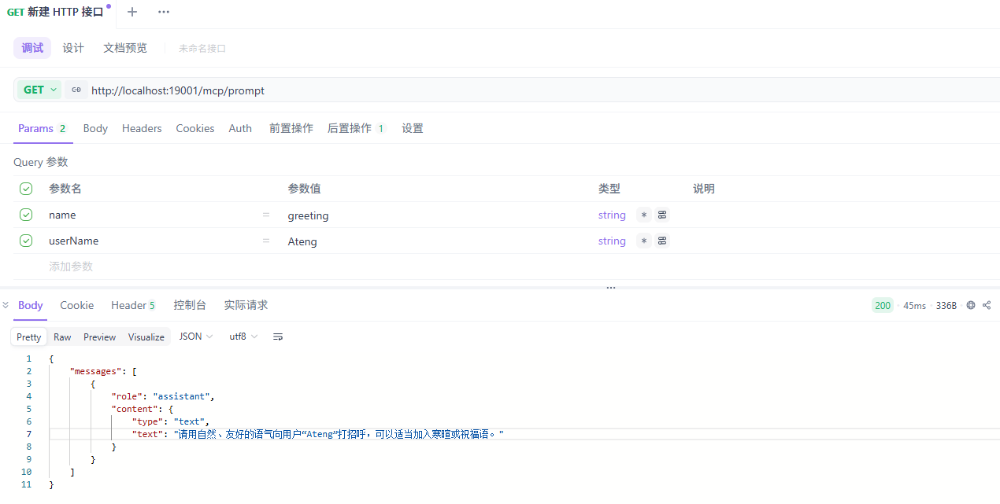

响应内容

```json
{
    "messages": [
        {
            "role": "assistant",
            "content": {
                "type": "text",
                "text": "请用自然、友好的语气向用户“Ateng”打招呼，可以适当加入寒暄或祝福语。"
            }
        }
    ]
}
```

MCP Server 日志

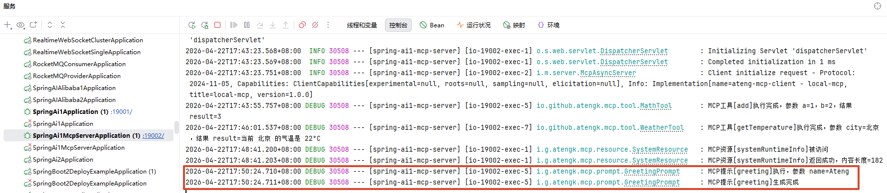


---

## 嵌入模型（Embedding）

用于将文本转换为向量（vector），常见应用：

- 语义搜索（Semantic Search）
- RAG（检索增强生成）
- 相似度计算（文本去重 / 推荐）
- 分类与聚类

---

### 基础示例

控制器示例：支持单条/批量输入，并返回结构化结果

```java
package io.github.atengk.ai.controller;

import lombok.extern.slf4j.Slf4j;
import org.springframework.ai.embedding.EmbeddingModel;
import org.springframework.ai.embedding.EmbeddingResponse;
import org.springframework.ai.embedding.Embedding;
import org.springframework.beans.factory.annotation.Autowired;
import org.springframework.web.bind.annotation.*;

import java.util.*;
import java.util.stream.Collectors;

/**
 * 向量嵌入接口
 *
 * @author Ateng
 * @since 2026-04-21
 */
@Slf4j
@RestController
@RequestMapping("/api/ai")
public class EmbeddingController {

    private final EmbeddingModel embeddingModel;

    @Autowired
    public EmbeddingController(EmbeddingModel embeddingModel) {
        this.embeddingModel = embeddingModel;
    }

    /**
     * 单条文本向量化
     */
    @GetMapping("/embedding")
    public Map<String, Object> embed(@RequestParam("text") String text) {
        try {
            EmbeddingResponse response = embeddingModel.embedForResponse(Collections.singletonList(text));

            List<float[]> vectors = response.getResults()
                    .stream()
                    .map(Embedding::getOutput)
                    .collect(Collectors.toList());

            return buildResult(vectors);
        } catch (Exception e) {
            log.error("embedding 失败，text={}", text, e);
            return error("embedding 失败");
        }
    }

    /**
     * 批量文本向量化
     */
    @PostMapping("/embedding/batch")
    public Map<String, Object> embedBatch(@RequestBody List<String> texts) {
        try {
            EmbeddingResponse response = embeddingModel.embedForResponse(texts);

            List<float[]> vectors = response.getResults()
                    .stream()
                    .map(Embedding::getOutput)
                    .collect(Collectors.toList());

            return buildResult(vectors);
        } catch (Exception e) {
            log.error("embedding 批量失败，texts={}", texts, e);
            return error("embedding 批量失败");
        }
    }

    /**
     * 构建统一返回结构
     */
    private Map<String, Object> buildResult(List<float[]> vectors) {
        Map<String, Object> result = new HashMap<>();
        result.put("vectors", vectors);
        result.put("dimension", vectors.isEmpty() ? 0 : vectors.get(0).length);
        result.put("count", vectors.size());
        return result;
    }

    private Map<String, Object> error(String msg) {
        return Map.of("success", false, "message", msg);
    }
}
```

返回结构说明

```
{
  "vectors": [[0.123, 0.456, ...]],
  "dimension": 1024,
  "count": 1
}
```

字段说明：

- `vectors`：向量结果（二维数组，支持批量）
- `dimension`：向量维度（必须统一）
- `count`：输入文本数量


## RAG：接入企业知识库

RAG（Retrieval-Augmented Generation，检索增强生成）用于在模型回答问题前，引入**外部知识内容**，从而避免模型“凭空回答”或依赖过期知识。

在 Spring AI 中，RAG 的核心思想是：

> **先检索，再生成，而不是直接让模型回答。**

------

**RAG 的基本组成**

一个最小可用的 RAG 流程包含三个部分：

- **文档（Document）**：知识的基本载体
- **向量存储（VectorStore）**：用于相似度检索
- **检索增强 Advisor**：将检索结果注入 Prompt

**相关链接**

- 官网：[https://milvus.io](https://milvus.io)

- Milvus服务安装文档：[链接](https://atengk.github.io/Ateng-Linux/work/docker/service/milvus/README)


### 基础配置

**添加依赖**

```xml
<!-- Spring AI Milvus Vector Store -->
<dependency>
    <groupId>org.springframework.ai</groupId>
    <artifactId>spring-ai-starter-vector-store-milvus</artifactId>
</dependency>

<!-- Spring AI RAG Advisor -->
<dependency>
    <groupId>org.springframework.ai</groupId>
    <artifactId>spring-ai-rag</artifactId>
</dependency>

<!-- 文档解析（Tika Reader 依赖） -->
<dependency>
    <groupId>org.springframework.ai</groupId>
    <artifactId>spring-ai-tika-document-reader</artifactId>
</dependency>
```

**编辑配置**

```yaml
---
# Spring AI RAG 配置
spring:
  ai:
    vectorstore:
      milvus:
        initialize-schema: true
        database-name: default
        collection-name: spring_ai_knowledge_ateng
        embedding-dimension: 1024
        metric-type: COSINE
        index-type: IVF_FLAT
        index-parameters: '{"nlist":1024}'

        id-field-name: id
        content-field-name: content
        metadata-field-name: metadata
        embedding-field-name: embedding

        auto-id: false

        client:
          host: 192.168.1.12
          port: 40140
          username: root
          password: Milvus
          secure: false

```

### 快速开始

创建 controller

```java
package io.github.atengk.ai.controller;

import cn.hutool.core.util.StrUtil;
import lombok.extern.slf4j.Slf4j;
import org.springframework.ai.document.Document;
import org.springframework.ai.reader.tika.TikaDocumentReader;
import org.springframework.ai.transformer.splitter.TokenTextSplitter;
import org.springframework.ai.vectorstore.SearchRequest;
import org.springframework.ai.vectorstore.VectorStore;
import org.springframework.core.io.InputStreamResource;
import org.springframework.web.bind.annotation.*;
import org.springframework.web.multipart.MultipartFile;

import java.io.IOException;
import java.time.LocalDateTime;
import java.util.*;
import java.util.stream.Collectors;

/**
 * 向量库操作接口
 *
 * @author Ateng
 * @since 2026-04-21
 */
@Slf4j
@RestController
@RequestMapping("/api/ai/vector")
public class VectorStoreController {

    private final VectorStore vectorStore;

    public VectorStoreController(VectorStore vectorStore) {
        this.vectorStore = vectorStore;
    }

    /**
     * 上传文档并向量化入库（带完整分片控制）
     */
    @PostMapping("/upload")
    public Map<String, Object> uploadDocument(@RequestParam("file") MultipartFile file) {

        String fileName = file.getOriginalFilename();

        if (file == null || file.isEmpty()) {
            return fail("文件不能为空");
        }

        log.info("开始处理文件: {}", fileName);

        try {
            // ================== 1. 文档解析 ==================
            TikaDocumentReader reader = new TikaDocumentReader(new InputStreamResource(file.getInputStream()));
            List<Document> documents = reader.get();

            if (documents.isEmpty()) {
                return fail("文档解析失败或内容为空");
            }

            // ================== 2. 分片参数（重点） ==================

            /**
             * chunkSize
             * 每个分片的“目标 token 数”
             * - 太小：语义断裂
             * - 太大：embedding 质量下降 + 成本上升
             * 推荐：
             * - 中文：300 ~ 600
             */
            int chunkSize = 500;

            /**
             * minChunkSizeChars
             * 最小字符数阈值（低于这个值的分片会被丢弃或合并）
             * 作用：
             * - 防止出现无意义碎片（如几个字）
             */
            int minChunkSizeChars = 200;

            /**
             * minChunkLengthToEmbed
             * 最小允许参与 embedding 的长度
             * 小于该值的 chunk 不会被 embedding
             * 作用：
             * - 避免 embedding 噪声数据
             */
            int minChunkLengthToEmbed = 100;

            /**
             * maxNumChunks
             * 单个文档最多分片数量
             * 防止：
             * - 超大文件导致 OOM
             * - 向量库爆炸
             */
            int maxNumChunks = 1000;

            /**
             * keepSeparator
             * 是否保留分隔符（标点）
             * 中文建议 true，否则语义会断
             */
            boolean keepSeparator = true;

            /**
             * punctuationMarks
             * 分割依据的标点
             * ⚠️ 默认是英文标点，不适合中文
             * 这里手动补充中文标点（非常关键）
             */
            List<Character> punctuationMarks = Arrays.asList(
                    '。', '！', '？', '；', '，', '\n',
                    '.', '!', '?', ';', ','
            );

            // ================== 3. 构建分片器 ==================
            TokenTextSplitter splitter = new TokenTextSplitter(
                    chunkSize,
                    minChunkSizeChars,
                    minChunkLengthToEmbed,
                    maxNumChunks,
                    keepSeparator,
                    punctuationMarks
            );

            List<Document> chunks = splitter.apply(documents);

            if (chunks.isEmpty()) {
                return fail("分片结果为空，请检查参数");
            }

            // ================== 4. 元数据增强 ==================
            chunks.forEach((doc) -> {
                doc.getMetadata().put("source", file.getOriginalFilename());
                doc.getMetadata().put("filename", fileName);
                doc.getMetadata().put("uploadTime", System.currentTimeMillis());
                doc.getMetadata().put("length", doc.getText().length());
            });

            // ================== 5. 入库（自动 embedding） ==================
            vectorStore.add(chunks);

            log.info("文件处理完成: {}, 原始文档={}, 分片数={}", fileName, documents.size(), chunks.size());

            return success(Map.of(
                    "fileName", fileName,
                    "docCount", documents.size(),
                    "chunkCount", chunks.size()
            ));

        } catch (IOException e) {
            log.error("文件读取失败: {}", fileName, e);
            return fail("文件读取失败");
        } catch (Exception e) {
            log.error("向量化失败: {}", fileName, e);
            return fail("向量化失败");
        }
    }

    /**
     * 文本直接向量化入库（不走 Tika）
     */
    @PostMapping("/ingest/text")
    public Map<String, Object> ingestText(@RequestParam("text") String text,
                                          @RequestParam(value = "source", required = false) String source) {

        if (StrUtil.isBlank(text)) {
            return fail("text 不能为空");
        }

        // 默认 source（避免为空）
        if (StrUtil.isBlank(source)) {
            source = "text_input_" + System.currentTimeMillis();
        }

        log.info("文本入库开始，source={}", source);

        try {
            // ================== 1. 构建 Document ==================
            Document document = new Document(text);

            // 元数据（统一规范）
            document.getMetadata().put("source", source);
            document.getMetadata().put("type", "text");
            document.getMetadata().put("length", text.length());
            document.getMetadata().put("uploadTime", System.currentTimeMillis());

            List<Document> documents = Collections.singletonList(document);

            // ================== 2. 分片参数（同文件一致） ==================
            int chunkSize = 500;
            int minChunkSizeChars = 200;
            int minChunkLengthToEmbed = 100;
            int maxNumChunks = 1000;
            boolean keepSeparator = true;

            List<Character> punctuationMarks = Arrays.asList(
                    '。', '！', '？', '；', '，', '\n',
                    '.', '!', '?', ';', ','
            );

            TokenTextSplitter splitter = new TokenTextSplitter(
                    chunkSize,
                    minChunkSizeChars,
                    minChunkLengthToEmbed,
                    maxNumChunks,
                    keepSeparator,
                    punctuationMarks
            );

            List<Document> chunks = splitter.apply(documents);

            if (chunks.isEmpty()) {
                return fail("分片结果为空");
            }

            // ================== 3. 补充分片级 metadata ==================
            int total = chunks.size();
            for (int i = 0; i < total; i++) {
                Document doc = chunks.get(i);
                doc.getMetadata().put("chunk_index", i);
                doc.getMetadata().put("total_chunks", total);
            }

            // ================== 4. 入库 ==================
            vectorStore.add(chunks);

            log.info("文本入库完成，source={}, chunk数量={}", source, total);

            return success(Map.of(
                    "source", source,
                    "chunkCount", total
            ));

        } catch (Exception e) {
            log.error("文本入库失败，source={}", source, e);
            return fail("文本入库失败");
        }
    }

    /**
     * 向量检索
     */
    @GetMapping("/search")
    public Map<String, Object> search(@RequestParam("query") String query,
                                      @RequestParam(value = "topK", defaultValue = "5") int topK) {

        if (StrUtil.isBlank(query)) {
            return fail("query 不能为空");
        }

        log.info("向量检索: query={}, topK={}", query, topK);

        try {
            SearchRequest request = SearchRequest.builder()
                    .query(query)
                    .topK(topK)
                    .build();

            List<Document> results = vectorStore.similaritySearch(request);

            List<Map<String, Object>> data = results.stream()
                    .map(doc -> {
                        String text = doc.getText();
                        // 截断，避免返回超大文本
                        if (StrUtil.length(text) > 300) {
                            text = StrUtil.sub(text, 0, 300) + "...";
                        }

                        return Map.of(
                                "content", text,
                                "metadata", doc.getMetadata()
                        );
                    })
                    .collect(Collectors.toList());

            return success(data);

        } catch (Exception e) {
            log.error("检索失败: query={}", query, e);
            return fail("检索失败");
        }
    }

    // ================== 统一返回 ==================

    private Map<String, Object> success(Object data) {
        return Map.of(
                "success", true,
                "data", data
        );
    }

    private Map<String, Object> fail(String msg) {
        return Map.of(
                "success", false,
                "message", msg
        );
    }
}
```

### 知识库管理

#### ResourceUtil 工具类

用于处理文件使用

```java
package io.github.atengk.ai.util;

import org.slf4j.Logger;
import org.slf4j.LoggerFactory;
import org.springframework.core.io.*;
import org.springframework.core.io.support.PathMatchingResourcePatternResolver;
import org.springframework.util.ResourceUtils;

import java.io.*;
import java.net.URI;
import java.net.URL;
import java.net.URLConnection;
import java.nio.charset.Charset;
import java.nio.charset.StandardCharsets;
import java.nio.file.Files;
import java.nio.file.Path;
import java.nio.file.StandardCopyOption;
import java.util.ArrayList;
import java.util.List;
import java.util.Properties;

/**
 * Spring Resource 通用工具类。
 * <p>
 * 适用于项目中对 {@link Resource} 的加载、读取、转换、复制、扫描、落地等常见场景。
 *
 * @author Ateng
 * @since 2026-04-22
 */
public final class ResourceUtil {

    private static final Logger log = LoggerFactory.getLogger(ResourceUtil.class);

    private static final int DEFAULT_BUFFER_SIZE = 8 * 1024;

    /**
     * 单资源加载器：支持 classpath:、file:、http: 等常见协议。
     */
    private static final DefaultResourceLoader DEFAULT_RESOURCE_LOADER = new DefaultResourceLoader();

    /**
     * 通配符资源解析器：支持 classpath*:、classpath*:/xxx/*.xml 等扫描场景。
     */
    private static final PathMatchingResourcePatternResolver RESOURCE_PATTERN_RESOLVER =
            new PathMatchingResourcePatternResolver(DEFAULT_RESOURCE_LOADER);

    /**
     * 禁止实例化工具类。
     */
    private ResourceUtil() {
        throw new UnsupportedOperationException("工具类不可实例化");
    }


    /**
     * 获取单个资源。
     * <p>
     * 适合加载非通配符资源，例如：
     * classpath:application.yml
     * file:/data/test.txt
     * /opt/logs/a.log
     * https://example.com/demo.txt
     *
     * @param location 资源位置
     * @return Resource
     */
    public static Resource getResource(String location) {
        assertText(location, "资源位置不能为空");

        if (isPatternLocation(location)) {
            Resource[] resources = getResources(location);
            if (resources.length == 0) {
                throw new ResourceUtilException("未找到匹配的资源：" + location);
            }
            if (resources.length > 1) {
                log.warn("资源位置包含通配符且匹配到了多个资源，已返回第一个，location={}", location);
            }
            return resources[0];
        }

        return DEFAULT_RESOURCE_LOADER.getResource(location);
    }

    /**
     * 扫描并获取多个资源。
     * <p>
     * 支持：
     * classpath*:mapper/*&#47;.xml
     * classpath*:com/example/**&#47;*.yml
     * file:/opt/app/config/*&#47;.properties
     *
     * @param locationPattern 资源模式
     * @return Resource 数组，未命中时返回空数组
     */
    public static Resource[] getResources(String locationPattern) {
        if (!hasText(locationPattern)) {
            return new Resource[0];
        }
        try {
            Resource[] resources = RESOURCE_PATTERN_RESOLVER.getResources(locationPattern);
            return resources == null ? new Resource[0] : resources;
        } catch (IOException e) {
            throw new ResourceUtilException("扫描资源失败，pattern=" + locationPattern, e);
        }
    }

    /**
     * 获取 ClassPath 资源。
     *
     * @param path classpath 路径
     * @return Resource
     */
    public static Resource getClassPathResource(String path) {
        assertText(path, "Classpath 路径不能为空");
        return new ClassPathResource(normalizeClassPath(path));
    }

    /**
     * 获取文件系统资源。
     *
     * @param path 文件路径
     * @return Resource
     */
    public static Resource getFileSystemResource(String path) {
        assertText(path, "文件路径不能为空");
        return new FileSystemResource(path);
    }

    /**
     * 获取 URL 资源。
     *
     * @param url URL
     * @return Resource
     */
    public static Resource getUrlResource(String url) {
        assertText(url, "URL 不能为空");
        try {
            return new UrlResource(url);
        } catch (Exception e) {
            throw new ResourceUtilException("创建 UrlResource 失败，url=" + url, e);
        }
    }

    /**
     * 获取 URL 资源。
     *
     * @param url URL
     * @return Resource
     */
    public static Resource getUrlResource(URL url) {
        if (url == null) {
            throw new ResourceUtilException("URL 不能为空");
        }
        try {
            return new UrlResource(url);
        } catch (Exception e) {
            throw new ResourceUtilException("创建 UrlResource 失败，url=" + url, e);
        }
    }

    /**
     * 获取 URI 资源。
     *
     * @param uri URI
     * @return Resource
     */
    public static Resource getUrlResource(URI uri) {
        if (uri == null) {
            throw new ResourceUtilException("URI 不能为空");
        }
        try {
            return new UrlResource(uri);
        } catch (Exception e) {
            throw new ResourceUtilException("创建 UrlResource 失败，uri=" + uri, e);
        }
    }

    /**
     * 获取字节数组资源。
     *
     * @param bytes 字节数组
     * @return Resource
     */
    public static Resource getByteArrayResource(byte[] bytes) {
        return getByteArrayResource(bytes, null);
    }

    /**
     * 获取字节数组资源，并可指定文件名。
     *
     * @param bytes    字节数组
     * @param filename 文件名
     * @return Resource
     */
    public static Resource getByteArrayResource(byte[] bytes, String filename) {
        if (bytes == null) {
            throw new ResourceUtilException("字节数组不能为空");
        }

        final byte[] copy = bytes.clone();
        if (!hasText(filename)) {
            return new ByteArrayResource(copy);
        }

        return new ByteArrayResource(copy) {
            @Override
            public String getFilename() {
                return filename;
            }
        };
    }

    /**
     * 获取输入流资源。
     * <p>
     * 注意：InputStreamResource 通常只能读取一次。
     *
     * @param inputStream 输入流
     * @return Resource
     */
    public static Resource getInputStreamResource(InputStream inputStream) {
        return getInputStreamResource(inputStream, null);
    }

    /**
     * 获取输入流资源，并可指定文件名。
     * <p>
     * 注意：InputStreamResource 通常只能读取一次。
     *
     * @param inputStream 输入流
     * @param filename    文件名
     * @return Resource
     */
    public static Resource getInputStreamResource(InputStream inputStream, String filename) {
        if (inputStream == null) {
            throw new ResourceUtilException("输入流不能为空");
        }

        InputStreamResource resource = new InputStreamResource(inputStream) {
            @Override
            public String getFilename() {
                return filename;
            }
        };
        return resource;
    }

    /**
     * 将字符串内容转为资源，默认使用 UTF-8。
     *
     * @param content 字符串内容
     * @return Resource
     */
    public static Resource fromString(String content) {
        return fromString(content, StandardCharsets.UTF_8);
    }

    /**
     * 将字符串内容转为资源。
     *
     * @param content 字符串内容
     * @param charset 字符集
     * @return Resource
     */
    public static Resource fromString(String content, Charset charset) {
        if (content == null) {
            throw new ResourceUtilException("字符串内容不能为空");
        }
        Charset useCharset = getCharset(charset);
        return new ByteArrayResource(content.getBytes(useCharset));
    }

    /**
     * 将字符串内容转为带文件名的资源。
     *
     * @param content  字符串内容
     * @param filename 文件名
     * @param charset  字符集
     * @return Resource
     */
    public static Resource fromString(String content, String filename, Charset charset) {
        if (content == null) {
            throw new ResourceUtilException("字符串内容不能为空");
        }
        Charset useCharset = getCharset(charset);
        byte[] bytes = content.getBytes(useCharset);
        return getByteArrayResource(bytes, filename);
    }

    /**
     * 读取资源为字节数组。
     *
     * @param resource 资源
     * @return 字节数组
     */
    public static byte[] readBytes(Resource resource) {
        assertResource(resource);
        try (InputStream inputStream = resource.getInputStream()) {
            return toByteArray(inputStream);
        } catch (IOException e) {
            throw new ResourceUtilException("读取资源字节失败，resource=" + getDescription(resource), e);
        }
    }

    /**
     * 读取资源为字符串，默认使用 UTF-8。
     *
     * @param resource 资源
     * @return 字符串内容
     */
    public static String readString(Resource resource) {
        return readString(resource, StandardCharsets.UTF_8);
    }

    /**
     * 读取资源为字符串。
     *
     * @param resource 资源
     * @param charset  字符集
     * @return 字符串内容
     */
    public static String readString(Resource resource, Charset charset) {
        assertResource(resource);
        Charset useCharset = getCharset(charset);
        try (InputStream inputStream = resource.getInputStream()) {
            return toString(inputStream, useCharset);
        } catch (IOException e) {
            throw new ResourceUtilException("读取资源文本失败，resource=" + getDescription(resource), e);
        }
    }

    /**
     * 读取资源为字符串列表，默认使用 UTF-8。
     *
     * @param resource 资源
     * @return 行列表
     */
    public static List<String> readLines(Resource resource) {
        return readLines(resource, StandardCharsets.UTF_8);
    }

    /**
     * 读取资源为字符串列表。
     *
     * @param resource 资源
     * @param charset  字符集
     * @return 行列表
     */
    public static List<String> readLines(Resource resource, Charset charset) {
        assertResource(resource);
        Charset useCharset = getCharset(charset);
        try (BufferedReader reader = new BufferedReader(new InputStreamReader(resource.getInputStream(), useCharset))) {
            List<String> lines = new ArrayList<String>();
            String line;
            while ((line = reader.readLine()) != null) {
                lines.add(line);
            }
            return lines;
        } catch (IOException e) {
            throw new ResourceUtilException("读取资源行失败，resource=" + getDescription(resource), e);
        }
    }

    /**
     * 读取资源为 Properties，默认使用 ISO-8859-1 兼容原生 Properties 规范。
     * <p>
     * 如果项目中的 properties 文件明确是 UTF-8，可使用 {@link #loadProperties(Resource, Charset)}。
     *
     * @param resource 资源
     * @return Properties
     */
    public static Properties loadProperties(Resource resource) {
        assertResource(resource);
        Properties properties = new Properties();
        try (InputStream inputStream = resource.getInputStream()) {
            properties.load(inputStream);
            return properties;
        } catch (IOException e) {
            throw new ResourceUtilException("读取 Properties 失败，resource=" + getDescription(resource), e);
        }
    }

    /**
     * 读取资源为 Properties，使用指定字符集。
     *
     * @param resource 资源
     * @param charset  字符集
     * @return Properties
     */
    public static Properties loadProperties(Resource resource, Charset charset) {
        assertResource(resource);
        Charset useCharset = getCharset(charset);
        Properties properties = new Properties();
        try (Reader reader = new BufferedReader(new InputStreamReader(resource.getInputStream(), useCharset))) {
            properties.load(reader);
            return properties;
        } catch (IOException e) {
            throw new ResourceUtilException("读取 Properties 失败，resource=" + getDescription(resource), e);
        }
    }

    /**
     * 将资源复制到输出流。
     *
     * @param resource     资源
     * @param outputStream 输出流
     */
    public static void copy(Resource resource, OutputStream outputStream) {
        assertResource(resource);
        if (outputStream == null) {
            throw new ResourceUtilException("输出流不能为空");
        }

        try (InputStream inputStream = resource.getInputStream()) {
            copy(inputStream, outputStream);
        } catch (IOException e) {
            throw new ResourceUtilException("复制资源到输出流失败，resource=" + getDescription(resource), e);
        }
    }

    /**
     * 将资源复制到文件。
     *
     * @param resource 资源
     * @param file     文件
     * @return 目标文件
     */
    public static File copyToFile(Resource resource, File file) {
        assertResource(resource);
        if (file == null) {
            throw new ResourceUtilException("目标文件不能为空");
        }

        ensureParentDir(file);
        try (InputStream inputStream = resource.getInputStream();
             OutputStream outputStream = new FileOutputStream(file)) {
            copy(inputStream, outputStream);
            return file;
        } catch (IOException e) {
            throw new ResourceUtilException("复制资源到文件失败，target=" + file.getAbsolutePath(), e);
        }
    }

    /**
     * 将资源复制到文件。
     *
     * @param resource 资源
     * @param path     文件路径
     * @return 目标 Path
     */
    public static Path copyToFile(Resource resource, Path path) {
        assertResource(resource);
        if (path == null) {
            throw new ResourceUtilException("目标路径不能为空");
        }
        try {
            Path parent = path.getParent();
            if (parent != null) {
                Files.createDirectories(parent);
            }
            try (InputStream inputStream = resource.getInputStream()) {
                Files.copy(inputStream, path, StandardCopyOption.REPLACE_EXISTING);
            }
            return path;
        } catch (IOException e) {
            throw new ResourceUtilException("复制资源到文件失败，target=" + path, e);
        }
    }

    /**
     * 将资源复制到临时文件。
     *
     * @param resource 资源
     * @param prefix   文件前缀
     * @param suffix   文件后缀
     * @return 临时文件
     */
    public static File copyToTempFile(Resource resource, String prefix, String suffix) {
        assertResource(resource);
        String usePrefix = hasText(prefix) ? prefix : "resource-";
        String useSuffix = hasText(suffix) ? suffix : ".tmp";
        try {
            File tempFile = File.createTempFile(usePrefix, useSuffix);
            tempFile.deleteOnExit();
            return copyToFile(resource, tempFile);
        } catch (IOException e) {
            throw new ResourceUtilException("复制资源到临时文件失败，resource=" + getDescription(resource), e);
        }
    }

    /**
     * 将 Resource 尽量转换为 File。
     * <p>
     * 仅适用于真正的文件型资源，例如 FileSystemResource、ClassPathResource(文件模式) 等。
     * 如果资源不在文件系统中，会抛出异常。
     *
     * @param resource 资源
     * @return File
     */
    public static File toFile(Resource resource) {
        assertResource(resource);
        try {
            return resource.getFile();
        } catch (IOException e) {
            throw new ResourceUtilException("当前资源不能直接转换为 File，resource=" + getDescription(resource), e);
        }
    }

    /**
     * 将 Resource 尽量转换为 Path。
     *
     * @param resource 资源
     * @return Path
     */
    public static Path toPath(Resource resource) {
        assertResource(resource);
        try {
            return resource.getFile().toPath();
        } catch (IOException e) {
            throw new ResourceUtilException("资源无法转换为 Path，resource=" + getDescription(resource), e);
        }
    }

    /**
     * 获取资源的 URL。
     *
     * @param resource 资源
     * @return URL
     */
    public static URL toUrl(Resource resource) {
        assertResource(resource);
        try {
            return resource.getURL();
        } catch (IOException e) {
            throw new ResourceUtilException("获取资源 URL 失败，resource=" + getDescription(resource), e);
        }
    }

    /**
     * 获取资源的 URI。
     *
     * @param resource 资源
     * @return URI
     */
    public static URI toUri(Resource resource) {
        assertResource(resource);
        try {
            return resource.getURI();
        } catch (IOException e) {
            throw new ResourceUtilException("获取资源 URI 失败，resource=" + getDescription(resource), e);
        }
    }

    /**
     * 获取资源描述信息。
     *
     * @param resource 资源
     * @return 描述
     */
    public static String getDescription(Resource resource) {
        if (resource == null) {
            return "null";
        }
        try {
            return resource.getDescription();
        } catch (Exception e) {
            return resource.getClass().getName();
        }
    }

    /**
     * 获取资源文件名。
     *
     * @param resource 资源
     * @return 文件名
     */
    public static String getFilename(Resource resource) {
        assertResource(resource);
        return resource.getFilename();
    }

    /**
     * 获取资源扩展名。
     *
     * @param resource 资源
     * @return 扩展名，未获取到时返回空字符串
     */
    public static String getExtension(Resource resource) {
        String filename = getFilename(resource);
        return getExtension(filename);
    }

    /**
     * 获取文件名的扩展名。
     *
     * @param filename 文件名
     * @return 扩展名，未获取到时返回空字符串
     */
    public static String getExtension(String filename) {
        if (!hasText(filename)) {
            return "";
        }
        int index = filename.lastIndexOf('.');
        if (index < 0 || index >= filename.length() - 1) {
            return "";
        }
        return filename.substring(index + 1);
    }

    /**
     * 获取不带扩展名的文件名。
     *
     * @param filename 文件名
     * @return 不带扩展名的文件名
     */
    public static String getFilenameWithoutExtension(String filename) {
        if (!hasText(filename)) {
            return filename;
        }
        int index = filename.lastIndexOf('.');
        if (index <= 0) {
            return filename;
        }
        return filename.substring(0, index);
    }

    /**
     * 判断资源是否存在。
     *
     * @param resource 资源
     * @return 是否存在
     */
    public static boolean exists(Resource resource) {
        return resource != null && resource.exists();
    }

    /**
     * 判断资源是否可读。
     *
     * @param resource 资源
     * @return 是否可读
     */
    public static boolean isReadable(Resource resource) {
        return resource != null && resource.isReadable();
    }

    /**
     * 判断资源是否打开状态。
     *
     * @param resource 资源
     * @return 是否打开
     */
    public static boolean isOpen(Resource resource) {
        return resource != null && resource.isOpen();
    }

    /**
     * 判断资源是否是文件型资源。
     *
     * @param resource 资源
     * @return 是否为文件
     */
    public static boolean isFile(Resource resource) {
        if (resource == null) {
            return false;
        }
        try {
            return resource.isFile();
        } catch (Exception e) {
            return false;
        }
    }

    /**
     * 判断资源是否为 ClassPath 资源。
     *
     * @param resource 资源
     * @return 是否为 ClassPathResource
     */
    public static boolean isClassPathResource(Resource resource) {
        return resource instanceof ClassPathResource;
    }

    /**
     * 判断资源是否为 FileSystemResource。
     *
     * @param resource 资源
     * @return 是否为 FileSystemResource
     */
    public static boolean isFileSystemResource(Resource resource) {
        return resource instanceof FileSystemResource;
    }

    /**
     * 判断资源是否为 UrlResource。
     *
     * @param resource 资源
     * @return 是否为 UrlResource
     */
    public static boolean isUrlResource(Resource resource) {
        return resource instanceof UrlResource;
    }

    /**
     * 判断资源是否为空。
     *
     * @param resource 资源
     * @return true：为空
     */
    public static boolean isEmpty(Resource resource) {
        return resource == null || !resource.exists();
    }

    /**
     * 获取资源内容长度。
     *
     * @param resource 资源
     * @return 内容长度
     */
    public static long contentLength(Resource resource) {
        assertResource(resource);
        try {
            return resource.contentLength();
        } catch (IOException e) {
            throw new ResourceUtilException("获取资源长度失败，resource=" + getDescription(resource), e);
        }
    }

    /**
     * 获取资源最后修改时间。
     *
     * @param resource 资源
     * @return 最后修改时间
     */
    public static long lastModified(Resource resource) {
        assertResource(resource);
        try {
            return resource.lastModified();
        } catch (IOException e) {
            throw new ResourceUtilException("获取资源最后修改时间失败，resource=" + getDescription(resource), e);
        }
    }

    /**
     * 通过相对路径解析资源。
     *
     * @param resource     基础资源
     * @param relativePath 相对路径
     * @return 解析后的资源
     */
    public static Resource createRelative(Resource resource, String relativePath) {
        assertResource(resource);
        assertText(relativePath, "相对路径不能为空");
        try {
            return resource.createRelative(relativePath);
        } catch (IOException e) {
            throw new ResourceUtilException("创建相对资源失败，base=" + getDescription(resource) + ", relativePath=" + relativePath, e);
        }
    }

    /**
     * 将资源转换为可重复读取的字节数组资源。
     *
     * @param resource 资源
     * @return ByteArrayResource
     */
    public static Resource toRepeatableResource(Resource resource) {
        return getByteArrayResource(readBytes(resource), getFilename(resource));
    }

    /**
     * 将资源复制到字符串资源，默认 UTF-8。
     *
     * @param resource 资源
     * @return String 内容
     */
    public static String readText(Resource resource) {
        return readString(resource, StandardCharsets.UTF_8);
    }

    /**
     * 将资源转换为临时文件并返回文件对象。
     * <p>
     * 适合在需要 File 的第三方 API 中临时使用。
     *
     * @param resource 资源
     * @param prefix   临时文件前缀
     * @param suffix   临时文件后缀
     * @return 临时文件
     */
    public static File toTempFile(Resource resource, String prefix, String suffix) {
        return copyToTempFile(resource, prefix, suffix);
    }

    /**
     * 直接打开资源输入流。
     *
     * @param resource 资源
     * @return 输入流
     */
    public static InputStream getInputStream(Resource resource) {
        assertResource(resource);
        try {
            return resource.getInputStream();
        } catch (IOException e) {
            throw new ResourceUtilException("打开资源输入流失败，resource=" + getDescription(resource), e);
        }
    }

    /**
     * 计算资源是否可以安全转换为文件路径。
     *
     * @param resource 资源
     * @return true：可转为文件
     */
    public static boolean canConvertToFile(Resource resource) {
        if (resource == null) {
            return false;
        }
        try {
            resource.getFile();
            return true;
        } catch (IOException e) {
            return false;
        }
    }

    /**
     * 资源是否包含通配符。
     *
     * @param location 资源位置
     * @return true：包含通配符
     */
    public static boolean isPatternLocation(String location) {
        if (!hasText(location)) {
            return false;
        }
        return location.startsWith("classpath*:") || location.indexOf('*') >= 0 || location.indexOf('?') >= 0;
    }

    /**
     * 将输入流转换为字节数组。
     *
     * @param inputStream 输入流
     * @return 字节数组
     */
    public static byte[] toByteArray(InputStream inputStream) {
        if (inputStream == null) {
            throw new ResourceUtilException("输入流不能为空");
        }
        ByteArrayOutputStream outputStream = new ByteArrayOutputStream();
        try {
            copy(inputStream, outputStream);
            return outputStream.toByteArray();
        } catch (Exception e) {
            throw new ResourceUtilException("输入流转字节数组失败", e);
        } finally {
            closeQuietly(outputStream);
        }
    }

    /**
     * 将字节数组转为字符串，默认 UTF-8。
     *
     * @param bytes 字节数组
     * @return 字符串
     */
    public static String toString(byte[] bytes) {
        return toString(bytes, StandardCharsets.UTF_8);
    }

    /**
     * 将字节数组转为字符串。
     *
     * @param bytes   字节数组
     * @param charset 字符集
     * @return 字符串
     */
    public static String toString(byte[] bytes, Charset charset) {
        if (bytes == null) {
            return null;
        }
        Charset useCharset = getCharset(charset);
        return new String(bytes, useCharset);
    }

    /**
     * 将输入流转为字符串，默认 UTF-8。
     *
     * @param inputStream 输入流
     * @return 字符串
     */
    public static String toString(InputStream inputStream) {
        return toString(inputStream, StandardCharsets.UTF_8);
    }

    /**
     * 将输入流转为字符串。
     *
     * @param inputStream 输入流
     * @param charset     字符集
     * @return 字符串
     */
    public static String toString(InputStream inputStream, Charset charset) {
        if (inputStream == null) {
            throw new ResourceUtilException("输入流不能为空");
        }
        Charset useCharset = getCharset(charset);
        try (Reader reader = new InputStreamReader(new BufferedInputStream(inputStream), useCharset);
             BufferedReader bufferedReader = new BufferedReader(reader);
             ByteArrayOutputStream outputStream = new ByteArrayOutputStream()) {

            char[] buffer = new char[DEFAULT_BUFFER_SIZE];
            int len;
            StringBuilder sb = new StringBuilder();
            while ((len = bufferedReader.read(buffer)) != -1) {
                sb.append(buffer, 0, len);
            }
            return sb.toString();
        } catch (IOException e) {
            throw new ResourceUtilException("输入流转字符串失败", e);
        }
    }

    /**
     * 将输入流复制到输出流。
     *
     * @param inputStream  输入流
     * @param outputStream 输出流
     */
    public static void copy(InputStream inputStream, OutputStream outputStream) {
        if (inputStream == null) {
            throw new ResourceUtilException("输入流不能为空");
        }
        if (outputStream == null) {
            throw new ResourceUtilException("输出流不能为空");
        }

        byte[] buffer = new byte[DEFAULT_BUFFER_SIZE];
        int len;
        try {
            while ((len = inputStream.read(buffer)) != -1) {
                outputStream.write(buffer, 0, len);
            }
            outputStream.flush();
        } catch (IOException e) {
            throw new ResourceUtilException("流复制失败", e);
        }
    }

    /**
     * 将 Reader 复制到 Writer。
     *
     * @param reader Reader
     * @param writer Writer
     */
    public static void copy(Reader reader, Writer writer) {
        if (reader == null) {
            throw new ResourceUtilException("Reader 不能为空");
        }
        if (writer == null) {
            throw new ResourceUtilException("Writer 不能为空");
        }

        char[] buffer = new char[DEFAULT_BUFFER_SIZE];
        int len;
        try {
            while ((len = reader.read(buffer)) != -1) {
                writer.write(buffer, 0, len);
            }
            writer.flush();
        } catch (IOException e) {
            throw new ResourceUtilException("字符流复制失败", e);
        }
    }

    /**
     * 读取资源并猜测内容类型。
     *
     * @param resource 资源
     * @return 内容类型，获取失败返回 null
     */
    public static String guessContentType(Resource resource) {
        if (resource == null) {
            return null;
        }

        String filename = resource.getFilename();
        if (hasText(filename)) {
            String contentType = URLConnection.guessContentTypeFromName(filename);
            if (hasText(contentType)) {
                return contentType;
            }
        }

        try (InputStream inputStream = resource.getInputStream()) {
            return URLConnection.guessContentTypeFromStream(inputStream);
        } catch (IOException e) {
            return null;
        }
    }

    /**
     * 资源是否为可直接读取的普通文件。
     *
     * @param resource 资源
     * @return true：可作为普通文件读取
     */
    public static boolean isRegularFile(Resource resource) {
        if (resource == null) {
            return false;
        }
        if (!exists(resource)) {
            return false;
        }
        try {
            File file = resource.getFile();
            return file.exists() && file.isFile();
        } catch (Exception e) {
            return false;
        }
    }

    /**
     * 资源转换为绝对文件路径字符串。
     *
     * @param resource 资源
     * @return 文件绝对路径
     */
    public static String toAbsolutePath(Resource resource) {
        return toFile(resource).getAbsolutePath();
    }

    /**
     * 资源转换为绝对 URI 字符串。
     *
     * @param resource 资源
     * @return URI 字符串
     */
    public static String toUriString(Resource resource) {
        return toUri(resource).toString();
    }

    /**
     * 将资源保存到指定目录，文件名默认取资源原始文件名。
     *
     * @param resource 资源
     * @param dir      目标目录
     * @return 保存后的文件
     */
    public static File saveToDirectory(Resource resource, File dir) {
        assertResource(resource);
        if (dir == null) {
            throw new ResourceUtilException("目标目录不能为空");
        }
        if (!dir.exists() && !dir.mkdirs()) {
            throw new ResourceUtilException("创建目标目录失败，dir=" + dir.getAbsolutePath());
        }
        if (!dir.isDirectory()) {
            throw new ResourceUtilException("目标不是目录，dir=" + dir.getAbsolutePath());
        }

        String filename = getFilename(resource);
        if (!hasText(filename)) {
            filename = "resource-" + System.currentTimeMillis();
        }

        File target = new File(dir, filename);
        return copyToFile(resource, target);
    }

    /**
     * 将资源复制到指定目录，文件名默认取资源原始文件名。
     *
     * @param resource 资源
     * @param dir      目标目录
     * @return 保存后的 Path
     */
    public static Path saveToDirectory(Resource resource, Path dir) {
        assertResource(resource);
        if (dir == null) {
            throw new ResourceUtilException("目标目录不能为空");
        }
        try {
            Files.createDirectories(dir);
        } catch (IOException e) {
            throw new ResourceUtilException("创建目标目录失败，dir=" + dir, e);
        }

        String filename = getFilename(resource);
        if (!hasText(filename)) {
            filename = "resource-" + System.currentTimeMillis();
        }

        return copyToFile(resource, dir.resolve(filename));
    }

    /**
     * 安全获取资源内容长度，失败返回 -1。
     *
     * @param resource 资源
     * @return 长度
     */
    public static long safeContentLength(Resource resource) {
        try {
            return contentLength(resource);
        } catch (Exception e) {
            return -1L;
        }
    }

    /**
     * 安全获取资源最后修改时间，失败返回 -1。
     *
     * @param resource 资源
     * @return 最后修改时间
     */
    public static long safeLastModified(Resource resource) {
        try {
            return lastModified(resource);
        } catch (Exception e) {
            return -1L;
        }
    }

    /**
     * 关闭资源。
     *
     * @param closeable 关闭对象
     */
    public static void closeQuietly(Closeable closeable) {
        if (closeable == null) {
            return;
        }
        try {
            closeable.close();
        } catch (IOException e) {
            log.debug("关闭资源失败，忽略，type={}", closeable.getClass().getName(), e);
        }
    }

    /**
     * 兼容性地将资源转为原始 Resource 类型。
     *
     * @param resource 资源
     * @return 资源本身
     */
    public static Resource identity(Resource resource) {
        return resource;
    }

    /**
     * 校验资源不能为空且必须存在。
     *
     * @param resource 资源
     */
    public static void assertExists(Resource resource) {
        assertResource(resource);
        if (!resource.exists()) {
            throw new ResourceUtilException("资源不存在，resource=" + getDescription(resource));
        }
    }

    /**
     * 获取资源内容类型，若无法判断则返回默认值。
     *
     * @param resource     资源
     * @param defaultValue 默认值
     * @return 内容类型
     */
    public static String getContentType(Resource resource, String defaultValue) {
        String contentType = guessContentType(resource);
        if (hasText(contentType)) {
            return contentType;
        }
        return defaultValue;
    }

    /**
     * 判断字符串是否有内容。
     *
     * @param text 文本
     * @return true：有内容
     */
    private static boolean hasText(String text) {
        return text != null && text.trim().length() > 0;
    }

    /**
     * 校验字符串不能为空。
     *
     * @param text    文本
     * @param message 异常信息
     */
    private static void assertText(String text, String message) {
        if (!hasText(text)) {
            throw new ResourceUtilException(message);
        }
    }

    /**
     * 校验资源对象不能为空。
     *
     * @param resource 资源
     */
    private static void assertResource(Resource resource) {
        if (resource == null) {
            throw new ResourceUtilException("资源不能为空");
        }
    }

    /**
     * 规范化字符集，避免外部传入 null。
     *
     * @param charset 字符集
     * @return 可用字符集
     */
    private static Charset getCharset(Charset charset) {
        return charset == null ? StandardCharsets.UTF_8 : charset;
    }

    /**
     * 确保父目录存在。
     *
     * @param file 文件
     */
    private static void ensureParentDir(File file) {
        File parent = file.getAbsoluteFile().getParentFile();
        if (parent != null && !parent.exists() && !parent.mkdirs()) {
            throw new ResourceUtilException("创建父目录失败，parent=" + parent.getAbsolutePath());
        }
    }

    /**
     * 去除 classpath: 前缀并规范化路径。
     *
     * @param path 路径
     * @return 规范化后的路径
     */
    private static String normalizeClassPath(String path) {
        String result = path.trim();
        if (result.startsWith(ResourceUtils.CLASSPATH_URL_PREFIX)) {
            result = result.substring(ResourceUtils.CLASSPATH_URL_PREFIX.length());
        }
        while (result.startsWith("/")) {
            result = result.substring(1);
        }
        return result;
    }

    /**
     * 判断是否是通配符路径。
     *
     * @param location 资源位置
     * @return true：包含通配符
     */
    private static boolean isPatternLocationInternal(String location) {
        return location != null && (location.startsWith("classpath*:") || location.indexOf('*') >= 0 || location.indexOf('?') >= 0);
    }

    /**
     * 自定义运行时异常，统一资源操作失败的异常包装。
     */
    public static class ResourceUtilException extends RuntimeException {

        public ResourceUtilException(String message) {
            super(message);
        }

        public ResourceUtilException(String message, Throwable cause) {
            super(message, cause);
        }
    }
}
```


#### RAG 摄取与切分常量

```java
package io.github.atengk.ai.constant;

import java.util.List;

/**
 * RAG 摄取相关常量
 *
 * <p>统一管理：
 * 1. 文本切分配置
 * 2. 元数据字段
 * 3. 默认值与模式
 * <p>
 * 避免业务代码中出现魔法值
 *
 * @author Ateng
 * @since 2026-04-21
 */
public final class RagIngestConstants {

    // =========================
    // 文本切分配置
    // =========================

    /**
     * 默认分块大小（token 粒度）
     */
    public static final int DEFAULT_CHUNK_SIZE = 800;

    /**
     * 最小分块字符数（避免切太碎）
     */
    public static final int MIN_CHUNK_SIZE_CHARS = 350;

    /**
     * 最小可嵌入长度（太短的不参与向量化）
     */
    public static final int MIN_CHUNK_LENGTH_TO_EMBED = 5;

    /**
     * 最大分块数量（防止异常数据）
     */
    public static final int MAX_NUM_CHUNKS = 10000;

    /**
     * 是否保留分隔符
     */
    public static final boolean KEEP_SEPARATOR = true;

    /**
     * 默认切分标点（中英文 + 换行）
     */
    public static final List<Character> DEFAULT_PUNCTUATION_MARKS = List.of(
            '.', '?', '!',
            '。', '？', '！',
            ';', '；',
            '\n'
    );


    // =========================
    // Metadata 字段定义
    // =========================

    /**
     * 数据源信息
     */
    public static final String METADATA_SOURCE_ID = "source.id";
    public static final String METADATA_SOURCE_TYPE = "source.type";
    public static final String METADATA_SOURCE_URI = "source.uri";
    public static final String METADATA_SOURCE_NAME = "source.name";

    /**
     * 租户信息（多租户场景）
     */
    public static final String METADATA_TENANT_ID = "tenant.id";

    /**
     * 文档信息（逻辑文档）
     */
    public static final String METADATA_DOC_ID = "document.id";
    public static final String METADATA_DOCUMENT_VERSION = "document.version";

    /**
     * 内容信息
     */
    public static final String METADATA_CONTENT_HASH = "content.hash";
    public static final String METADATA_CONTENT_LANGUAGE = "content.language";

    /**
     * 文件信息
     */
    public static final String METADATA_FILE_NAME = "file.name";
    public static final String METADATA_FILE_SIZE = "file.size";
    public static final String METADATA_FILE_TYPE = "file.type";
    public static final String METADATA_FILE_EXTENSION = "file.extension";

    /**
     * 权限与业务标签
     */
    public static final String METADATA_SECURITY_ACL = "security.acl";
    public static final String METADATA_BUSINESS_TAGS = "biz.tags";

    /**
     * 分块信息（chunk 级别）
     */
    public static final String METADATA_CHUNK_INDEX = "chunk.index";
    public static final String METADATA_CHUNK_COUNT = "chunk.count";
    public static final String METADATA_CHUNK_HASH = "chunk.hash";

    /**
     * 摄取信息
     */
    public static final String METADATA_INGEST_BATCH_ID = "ingest.batch.id";
    public static final String METADATA_INGEST_MODE = "ingest.mode";

    /**
     * 元数据版本
     */
    public static final String METADATA_SCHEMA_VERSION = "schema.version";

    /**
     * 时间字段
     */
    public static final String METADATA_CREATED_AT = "createdAt";
    public static final String METADATA_UPDATED_AT = "updatedAt";


    // =========================
    // 摄取模式
    // =========================

    /**
     * 全量摄取（直接覆盖）
     */
    public static final String INGEST_MODE_FULL = "full";

    /**
     * 增量摄取（基于 hash 判断）
     */
    public static final String INGEST_MODE_INCREMENTAL = "incremental";

    /**
     * 重建（先删后写）
     */
    public static final String INGEST_MODE_REBUILD = "rebuild";

    /**
     * 预览（不入库）
     */
    public static final String INGEST_MODE_PREVIEW = "preview";


    // =========================
    // 默认值
    // =========================

    /**
     * 默认数据源类型
     */
    public static final String DEFAULT_SOURCE_TYPE = "RESOURCE";

    /**
     * 默认 schema 版本
     */
    public static final String DEFAULT_SCHEMA_VERSION = "1";

    /**
     * 默认文档版本
     */
    public static final String DEFAULT_DOCUMENT_VERSION = "1";

    /**
     * sourceId 前缀
     */
    public static final String DEFAULT_SOURCE_ID_PREFIX = "src_";

    /**
     * 常见资源类型
     */
    public static final String DEFAULT_SOURCE_TYPE_CLASSPATH = "CLASSPATH";
    public static final String DEFAULT_SOURCE_TYPE_FILE = "FILE";
    public static final String DEFAULT_SOURCE_TYPE_URL = "URL";
    public static final String DEFAULT_SOURCE_TYPE_STREAM = "STREAM";

    /**
     * 未知资源名称
     */
    public static final String DEFAULT_UNKNOWN_RESOURCE_NAME = "unknown-resource";


    private RagIngestConstants() {
    }
}
```


#### RAG 文档摄取服务

```java
package io.github.atengk.ai.service;

import org.springframework.ai.document.Document;
import org.springframework.ai.vectorstore.filter.Filter;
import org.springframework.core.io.Resource;

import java.util.List;
import java.util.Map;

/**
 * RAG 文档摄取服务
 *
 * <p>负责将 Resource 解析为 Document，并完成资源元数据抽取、元数据标准化、内容清洗、切分、幂等控制与向量库写入。</p>
 *
 * @author Ateng
 * @since 2026-04-21
 */
public interface RagIngestService {

    /**
     * 摄取单个资源，执行完整流程：读取、解析、清洗、切分、写入。
     *
     * @param resource 数据源
     * @param metadata 资源元数据
     * @return 写入的文档数量
     */
    int ingest(Resource resource, Map<String, Object> metadata);

    /**
     * 批量摄取资源。
     *
     * @param resources 资源列表
     * @param metadata  统一元数据
     * @return 写入的文档总数
     */
    int ingest(List<Resource> resources, Map<String, Object> metadata);

    /**
     * 解析资源为 Document，不执行写入。
     *
     * @param resource 数据源
     * @param metadata 资源元数据
     * @return 解析后的文档列表
     */
    List<Document> parse(Resource resource, Map<String, Object> metadata);

    /**
     * 预处理文档，例如清洗、去噪、规范化和元数据补全。
     *
     * @param documents 原始文档
     * @param metadata  资源元数据
     * @return 处理后的文档列表
     */
    List<Document> preprocess(List<Document> documents, Map<String, Object> metadata);

    /**
     * 对多个文档执行分块。
     *
     * @param documentList 原始文档列表
     * @param chunkSize    分块大小
     * @return 分块后的文档列表
     */
    List<Document> split(List<Document> documentList, int chunkSize);

    /**
     * 写入向量库。
     *
     * @param documents 已处理好的文档列表
     */
    void write(List<Document> documents);

    /**
     * 增量摄取，通常基于 source.id + content.hash 做幂等控制。
     *
     * @param resource 数据源
     * @param metadata 资源元数据
     * @return 写入的文档数量
     */
    int ingestIncremental(Resource resource, Map<String, Object> metadata);

    /**
     * 全量重建，通常用于版本变更、切分策略变更或内容整体失效。
     *
     * @param resource 数据源
     * @param metadata 资源元数据
     */
    void rebuild(Resource resource, Map<String, Object> metadata);

    /**
     * 根据过滤表达式判断向量库中是否存在匹配的文档
     *
     * <p>通常用于幂等控制、数据存在性校验等场景。内部一般通过向量检索结合过滤条件实现，
     * 仅判断是否存在至少一条满足条件的数据，不保证返回完整结果。</p>
     *
     * @param expression 过滤表达式
     * @return true 表示存在，false 表示不存在
     */
    boolean exists(Filter.Expression expression);

    /**
     * 根据 sourceId 和 contentHash 判断文档是否已存在
     *
     * <p>用于 RAG 增量摄取场景的幂等控制。只有当 sourceId 与 contentHash 同时匹配时，
     * 才认为当前数据已存在（即内容未发生变化）。</p>
     *
     * @param sourceId    数据源唯一标识
     * @param contentHash 内容哈希值（通常为文档内容的摘要）
     * @return true 表示已存在，false 表示不存在或内容已变化
     */
    boolean exists(String sourceId, String contentHash);

    /**
     * 根据过滤表达式查询文档列表
     *
     * <p>用于按条件获取向量库中的文档数据，支持结合元数据进行过滤。
     * 返回结果数量由 topK 控制，不保证返回全部匹配数据。</p>
     *
     * @param expression 过滤表达式
     * @param topK       最大返回数量
     * @return 文档列表
     */
    List<Document> list(Filter.Expression expression, int topK);

    /**
     * 基于相似度查询文档
     *
     * @param query 查询文本
     * @param topK  返回结果数量
     * @return 相似文档列表
     */
    List<Document> search(String query, int topK);

    /**
     * 基于相似度查询文档
     *
     * <p>通过向量检索返回与 query 语义最相似的文档列表，
     * 支持结合过滤条件进行元数据约束。</p>
     *
     * @param query      查询文本
     * @param topK       返回结果数量
     * @param expression 过滤表达式（可为空）
     * @return 相似文档列表
     */
    List<Document> similaritySearch(String query, int topK, Filter.Expression expression);

    /**
     * 删除匹配过滤条件的文档。
     *
     * @param filterExpression 过滤表达式
     */
    void delete(Filter.Expression filterExpression);

    /**
     * 按文档 ID 删除。
     *
     * @param documentIds 文档 ID 列表
     */
    void deleteByDocumentIds(List<String> documentIds);

    /**
     * 按来源 ID 删除。
     *
     * @param sourceId 来源 ID
     */
    void deleteBySourceId(String sourceId);

    /**
     * 按租户 ID 删除。
     *
     * @param tenantId 租户 ID
     */
    void deleteByTenantId(String tenantId);

    /**
     * 标准化元数据，补齐默认字段并统一命名。
     *
     * @param metadata 原始元数据
     * @return 标准化后的元数据
     */
    Map<String, Object> normalizeMetadata(Map<String, Object> metadata);

    /**
     * 校验元数据是否满足入库要求。
     *
     * @param metadata 元数据
     */
    void validateMetadata(Map<String, Object> metadata);

    /**
     * 合并基础元数据与附加元数据。
     *
     * @param baseMetadata  基础元数据
     * @param extraMetadata 附加元数据
     * @return 合并后的元数据
     */
    Map<String, Object> mergeMetadata(Map<String, Object> baseMetadata, Map<String, Object> extraMetadata);

    /**
     * 仅用于预览，不入库。
     *
     * @param resource 数据源
     * @param metadata 资源元数据
     * @return 预览文档列表
     */
    List<Document> preview(Resource resource, Map<String, Object> metadata);
}
```


#### RAG 文档摄取服务实现

```java
package io.github.atengk.ai.service.impl;

import cn.hutool.core.collection.CollUtil;
import cn.hutool.core.date.DateUtil;
import cn.hutool.core.io.FileUtil;
import cn.hutool.core.map.MapUtil;
import cn.hutool.core.util.IdUtil;
import cn.hutool.core.util.ObjectUtil;
import cn.hutool.core.util.StrUtil;
import cn.hutool.crypto.digest.DigestUtil;
import io.github.atengk.ai.constant.RagIngestConstants;
import io.github.atengk.ai.service.RagIngestService;
import org.apache.tika.Tika;
import org.apache.tika.io.TikaInputStream;
import org.slf4j.Logger;
import org.slf4j.LoggerFactory;
import org.springframework.ai.document.Document;
import org.springframework.ai.reader.tika.TikaDocumentReader;
import org.springframework.ai.transformer.splitter.TokenTextSplitter;
import org.springframework.ai.vectorstore.SearchRequest;
import org.springframework.ai.vectorstore.VectorStore;
import org.springframework.ai.vectorstore.filter.Filter;
import org.springframework.ai.vectorstore.filter.FilterExpressionBuilder;
import org.springframework.core.io.*;
import org.springframework.stereotype.Service;

import java.io.IOException;
import java.io.InputStream;
import java.net.URI;
import java.time.temporal.TemporalAccessor;
import java.util.*;

/**
 * RAG 文档摄取服务实现
 *
 * <p>负责将 Resource 解析为 Document，并完成资源元数据抽取、元数据标准化、内容清洗、切分、幂等控制与向量库写入。</p>
 *
 * @author Ateng
 * @since 2026-04-21
 */
@Service
public class RagIngestServiceImpl implements RagIngestService {

    private static final Logger log = LoggerFactory.getLogger(RagIngestServiceImpl.class);

    private static final Tika TIKA = new Tika();

    private final VectorStore vectorStore;

    public RagIngestServiceImpl(VectorStore vectorStore) {
        this.vectorStore = vectorStore;
    }

    @Override
    public int ingest(Resource resource, Map<String, Object> metadata) {
        Map<String, Object> normalizedMetadata = buildResourceMetadata(resource, metadata, RagIngestConstants.INGEST_MODE_FULL);
        List<Document> parsedDocuments = parse(resource, normalizedMetadata);
        if (CollUtil.isEmpty(parsedDocuments)) {
            return 0;
        }

        List<Document> processedDocuments = preprocess(parsedDocuments, normalizedMetadata);
        List<Document> chunkDocuments = split(processedDocuments, RagIngestConstants.DEFAULT_CHUNK_SIZE);
        write(chunkDocuments);
        return chunkDocuments.size();
    }

    @Override
    public int ingest(List<Resource> resources, Map<String, Object> metadata) {
        if (CollUtil.isEmpty(resources)) {
            return 0;
        }

        int total = 0;
        for (Resource resource : resources) {
            total += ingest(resource, metadata);
        }
        return total;
    }

    @Override
    public List<Document> parse(Resource resource, Map<String, Object> metadata) {
        if (resource == null) {
            return Collections.emptyList();
        }

        validateMetadata(metadata);

        TikaDocumentReader reader = new TikaDocumentReader(resource);
        List<Document> rawDocuments = safeRead(reader);
        if (CollUtil.isEmpty(rawDocuments)) {
            log.warn("RAG 文档解析结果为空，resource={}", safeResourceName(resource));
            return Collections.emptyList();
        }

        String contentHash = calculateContentHash(rawDocuments);
        String now = now();

        Map<String, Object> baseMetadata = new LinkedHashMap<>(normalizeMetadata(metadata));
        baseMetadata.put(RagIngestConstants.METADATA_CONTENT_HASH, contentHash);
        baseMetadata.put(RagIngestConstants.METADATA_DOCUMENT_VERSION, ObjectUtil.defaultIfNull(
                baseMetadata.get(RagIngestConstants.METADATA_DOCUMENT_VERSION),
                RagIngestConstants.DEFAULT_DOCUMENT_VERSION
        ));
        baseMetadata.put(RagIngestConstants.METADATA_SCHEMA_VERSION, RagIngestConstants.DEFAULT_SCHEMA_VERSION);
        baseMetadata.put(RagIngestConstants.METADATA_UPDATED_AT, now);
        baseMetadata.putIfAbsent(RagIngestConstants.METADATA_CREATED_AT, now);
        baseMetadata.putIfAbsent(RagIngestConstants.METADATA_SOURCE_ID, deriveSourceId(resource));
        baseMetadata.putIfAbsent(RagIngestConstants.METADATA_SOURCE_TYPE, resolveSourceType(resource));
        baseMetadata.putIfAbsent(RagIngestConstants.METADATA_SOURCE_URI, resolveSourceUri(resource));
        baseMetadata.putIfAbsent(RagIngestConstants.METADATA_SOURCE_NAME, resolveSourceName(resource));
        baseMetadata.putIfAbsent(RagIngestConstants.METADATA_INGEST_MODE, RagIngestConstants.INGEST_MODE_FULL);

        List<Document> parsedDocuments = new ArrayList<>(rawDocuments.size());
        for (int i = 0; i < rawDocuments.size(); i++) {
            Document rawDocument = rawDocuments.get(i);
            String text = rawDocument == null ? null : rawDocument.getText();
            String documentId = buildDocumentId(baseMetadata, i, contentHash);

            Map<String, Object> currentMetadata = new LinkedHashMap<>();
            if (rawDocument != null && MapUtil.isNotEmpty(rawDocument.getMetadata())) {
                currentMetadata.putAll(rawDocument.getMetadata());
            }

            currentMetadata.putAll(baseMetadata);
            currentMetadata.put(RagIngestConstants.METADATA_DOC_ID, documentId);
            currentMetadata.put(RagIngestConstants.METADATA_CONTENT_HASH, contentHash);
            currentMetadata.put(RagIngestConstants.METADATA_UPDATED_AT, now);

            parsedDocuments.add(new Document(documentId, StrUtil.nullToEmpty(text), normalizeMetadata(currentMetadata)));
        }

        return parsedDocuments;
    }

    @Override
    public List<Document> preprocess(List<Document> documents, Map<String, Object> metadata) {
        if (CollUtil.isEmpty(documents)) {
            return Collections.emptyList();
        }

        Map<String, Object> normalizedMetadata = normalizeMetadata(metadata);
        List<Document> processed = new ArrayList<>(documents.size());

        for (Document document : documents) {
            if (document == null) {
                continue;
            }

            String cleanedText = normalizeContent(document.getText());
            if (StrUtil.isBlank(cleanedText)) {
                continue;
            }

            Map<String, Object> currentMetadata = new LinkedHashMap<>();
            if (MapUtil.isNotEmpty(document.getMetadata())) {
                currentMetadata.putAll(document.getMetadata());
            }
            currentMetadata.putAll(normalizedMetadata);
            currentMetadata.put(RagIngestConstants.METADATA_UPDATED_AT, now());

            processed.add(new Document(document.getId(), cleanedText, normalizeMetadata(currentMetadata)));
        }

        return processed;
    }

    @Override
    public List<Document> split(List<Document> documentList, int chunkSize) {
        if (CollUtil.isEmpty(documentList)) {
            return Collections.emptyList();
        }

        if (chunkSize <= 0) {
            chunkSize = RagIngestConstants.DEFAULT_CHUNK_SIZE;
        }

        TokenTextSplitter splitter = TokenTextSplitter.builder()
                .withChunkSize(chunkSize)
                .withMinChunkSizeChars(RagIngestConstants.MIN_CHUNK_SIZE_CHARS)
                .withMinChunkLengthToEmbed(RagIngestConstants.MIN_CHUNK_LENGTH_TO_EMBED)
                .withMaxNumChunks(RagIngestConstants.MAX_NUM_CHUNKS)
                .withKeepSeparator(RagIngestConstants.KEEP_SEPARATOR)
                .withPunctuationMarks(RagIngestConstants.DEFAULT_PUNCTUATION_MARKS)
                .build();

        List<Document> splitDocs = splitter.apply(documentList);
        if (CollUtil.isEmpty(splitDocs)) {
            return Collections.emptyList();
        }

        List<Document> validChunks = new ArrayList<>(splitDocs.size());
        for (Document chunk : splitDocs) {
            if (chunk == null || StrUtil.isBlank(chunk.getText())) {
                continue;
            }
            validChunks.add(chunk);
        }

        if (CollUtil.isEmpty(validChunks)) {
            return Collections.emptyList();
        }

        List<Document> result = new ArrayList<>(validChunks.size());
        int totalCount = validChunks.size();

        for (int i = 0; i < totalCount; i++) {
            Document chunk = validChunks.get(i);

            Map<String, Object> metadata = new LinkedHashMap<>();
            if (MapUtil.isNotEmpty(chunk.getMetadata())) {
                metadata.putAll(chunk.getMetadata());
            }

            metadata.put(RagIngestConstants.METADATA_CHUNK_INDEX, i);
            metadata.put(RagIngestConstants.METADATA_CHUNK_COUNT, totalCount);
            metadata.put(RagIngestConstants.METADATA_CHUNK_HASH, DigestUtil.sha256Hex(chunk.getText()));
            metadata.put(RagIngestConstants.METADATA_UPDATED_AT, now());

            String chunkId = StrUtil.blankToDefault(chunk.getId(), IdUtil.fastSimpleUUID());
            result.add(new Document(chunkId, chunk.getText(), normalizeMetadata(metadata)));
        }

        return result;
    }

    @Override
    public void write(List<Document> documents) {
        if (CollUtil.isEmpty(documents)) {
            return;
        }

        List<Document> safeDocuments = deduplicateAndNormalize(documents);
        if (CollUtil.isEmpty(safeDocuments)) {
            return;
        }

        Map<String, Object> metadata = safeDocuments.get(0).getMetadata();
        String sourceId = metadata == null ? null : String.valueOf(metadata.get(RagIngestConstants.METADATA_SOURCE_ID));
        String sourceName = metadata == null ? null : String.valueOf(metadata.get(RagIngestConstants.METADATA_SOURCE_NAME));

        try {
            vectorStore.add(safeDocuments);
            log.info("RAG 文档写入成功，数量={}，sourceId={}, sourceName={}", safeDocuments.size(), sourceId, sourceName);
        } catch (Exception ex) {
            log.error("RAG 文档写入失败，数量={}，sourceId={}, sourceName={}", safeDocuments.size(), sourceId, sourceName, ex);
            throw ex;
        }
    }

    @Override
    public int ingestIncremental(Resource resource, Map<String, Object> metadata) {
        Map<String, Object> normalizedMetadata = buildResourceMetadata(resource, metadata, RagIngestConstants.INGEST_MODE_INCREMENTAL);
        List<Document> parsedDocuments = parse(resource, normalizedMetadata);
        if (CollUtil.isEmpty(parsedDocuments)) {
            return 0;
        }

        Map<String, Object> firstMetadata = parsedDocuments.get(0).getMetadata();
        String sourceId = getMetadataString(firstMetadata, RagIngestConstants.METADATA_SOURCE_ID);
        String contentHash = getMetadataString(firstMetadata, RagIngestConstants.METADATA_CONTENT_HASH);

        if (exists(sourceId, contentHash)) {
            log.info("RAG 增量摄取跳过（内容未变化），sourceId={}, contentHash={}", sourceId, contentHash);
            return 0;
        }

        deleteBySourceId(sourceId);

        List<Document> processedDocuments = preprocess(parsedDocuments, normalizedMetadata);
        List<Document> chunkDocuments = split(processedDocuments, RagIngestConstants.DEFAULT_CHUNK_SIZE);
        write(chunkDocuments);

        return chunkDocuments.size();
    }

    @Override
    public void rebuild(Resource resource, Map<String, Object> metadata) {
        Map<String, Object> normalizedMetadata = buildResourceMetadata(resource, metadata, RagIngestConstants.INGEST_MODE_REBUILD);
        List<Document> parsedDocuments = parse(resource, normalizedMetadata);
        if (CollUtil.isEmpty(parsedDocuments)) {
            return;
        }

        Map<String, Object> firstMetadata = parsedDocuments.get(0).getMetadata();
        String sourceId = getMetadataString(firstMetadata, RagIngestConstants.METADATA_SOURCE_ID);

        deleteBySourceId(sourceId);

        List<Document> processedDocuments = preprocess(parsedDocuments, normalizedMetadata);
        List<Document> chunkDocuments = split(processedDocuments, RagIngestConstants.DEFAULT_CHUNK_SIZE);
        write(chunkDocuments);
    }

    @Override
    public boolean exists(Filter.Expression expression) {
        if (expression == null) {
            return false;
        }
        SearchRequest request = SearchRequest.builder()
                .query("exist-check")
                .topK(1)
                .filterExpression(expression)
                .build();
        return CollUtil.isNotEmpty(vectorStore.similaritySearch(request));
    }

    @Override
    public boolean exists(String sourceId, String contentHash) {
        if (StrUtil.isBlank(sourceId) || StrUtil.isBlank(contentHash)) {
            return false;
        }

        Filter.Expression expression = new FilterExpressionBuilder()
                .and(
                        new FilterExpressionBuilder().eq(RagIngestConstants.METADATA_SOURCE_ID, sourceId),
                        new FilterExpressionBuilder().eq(RagIngestConstants.METADATA_CONTENT_HASH, contentHash)
                )
                .build();

        SearchRequest request = SearchRequest.builder()
                .query("exist-check")
                .topK(1)
                .filterExpression(expression)
                .build();

        return CollUtil.isNotEmpty(vectorStore.similaritySearch(request));
    }

    @Override
    public List<Document> list(Filter.Expression expression, int topK) {
        if (expression == null) {
            return Collections.emptyList();
        }
        SearchRequest request = SearchRequest.builder()
                .query("list-check")
                .topK(topK)
                .filterExpression(expression)
                .build();
        return vectorStore.similaritySearch(request);
    }

    @Override
    public List<Document> search(String query, int topK) {
        return similaritySearch(query, topK, null);
    }

    @Override
    public List<Document> similaritySearch(String query, int topK, Filter.Expression expression) {

        if (StrUtil.isBlank(query)) {
            return Collections.emptyList();
        }

        if (topK <= 0) {
            topK = 5;
        }

        try {

            SearchRequest.Builder builder = SearchRequest.builder()
                    .query(query)
                    .topK(topK);

            if (expression != null) {
                builder.filterExpression(expression);
            }

            List<Document> results = vectorStore.similaritySearch(builder.build());

            log.info("RAG 相似度查询完成，query={}, topK={}, 返回数量={}",
                    query, topK, CollUtil.size(results));

            return CollUtil.isEmpty(results) ? Collections.emptyList() : results;

        } catch (Exception ex) {
            log.error("RAG 相似度查询失败，query={}", query, ex);
            throw ex;
        }
    }

    @Override
    public void delete(Filter.Expression filterExpression) {
        if (filterExpression == null) {
            return;
        }

        vectorStore.delete(filterExpression);
        log.info("RAG 文档已按过滤条件删除");
    }

    @Override
    public void deleteByDocumentIds(List<String> documentIds) {
        if (CollUtil.isEmpty(documentIds)) {
            return;
        }

        vectorStore.delete(documentIds);
        log.info("RAG 文档已按 documentIds 删除，数量={}", documentIds.size());
    }

    @Override
    public void deleteBySourceId(String sourceId) {
        if (StrUtil.isBlank(sourceId)) {
            return;
        }

        Filter.Expression expression = new FilterExpressionBuilder()
                .eq(RagIngestConstants.METADATA_SOURCE_ID, sourceId)
                .build();

        vectorStore.delete(expression);
        log.info("RAG 文档已按 sourceId 删除，sourceId={}", sourceId);
    }

    @Override
    public void deleteByTenantId(String tenantId) {
        if (StrUtil.isBlank(tenantId)) {
            return;
        }

        Filter.Expression expression = new FilterExpressionBuilder()
                .eq(RagIngestConstants.METADATA_TENANT_ID, tenantId)
                .build();

        vectorStore.delete(expression);
        log.info("RAG 文档已按 tenantId 删除，tenantId={}", tenantId);
    }

    @Override
    public Map<String, Object> normalizeMetadata(Map<String, Object> metadata) {
        String now = now();

        if (MapUtil.isEmpty(metadata)) {
            Map<String, Object> result = new LinkedHashMap<>();
            result.put(RagIngestConstants.METADATA_SCHEMA_VERSION, RagIngestConstants.DEFAULT_SCHEMA_VERSION);
            result.put(RagIngestConstants.METADATA_CREATED_AT, now);
            result.put(RagIngestConstants.METADATA_UPDATED_AT, now);
            return result;
        }

        Map<String, Object> normalized = new LinkedHashMap<>();
        metadata.forEach((key, value) -> {
            if (StrUtil.isBlank(key) || value == null) {
                return;
            }

            String normalizedKey = StrUtil.trim(key);
            Object normalizedValue = normalizeMetadataValue(value);
            if (normalizedValue != null) {
                normalized.put(normalizedKey, normalizedValue);
            }
        });

        normalized.putIfAbsent(RagIngestConstants.METADATA_SCHEMA_VERSION, RagIngestConstants.DEFAULT_SCHEMA_VERSION);
        normalized.putIfAbsent(RagIngestConstants.METADATA_CREATED_AT, now);
        normalized.put(RagIngestConstants.METADATA_UPDATED_AT, now);
        return normalized;
    }

    @Override
    public void validateMetadata(Map<String, Object> metadata) {
        if (MapUtil.isEmpty(metadata)) {
            return;
        }

        for (Map.Entry<String, Object> entry : metadata.entrySet()) {
            if (StrUtil.isBlank(entry.getKey())) {
                throw new IllegalArgumentException("元数据 key 不能为空");
            }
            if (entry.getValue() == null) {
                continue;
            }
            if (!isSupportedMetadataValue(entry.getValue())) {
                throw new IllegalArgumentException("不支持的元数据值类型，key=" + entry.getKey());
            }
        }
    }

    @Override
    public Map<String, Object> mergeMetadata(Map<String, Object> baseMetadata, Map<String, Object> extraMetadata) {
        Map<String, Object> merged = new LinkedHashMap<>();
        if (MapUtil.isNotEmpty(baseMetadata)) {
            merged.putAll(baseMetadata);
        }
        if (MapUtil.isNotEmpty(extraMetadata)) {
            merged.putAll(extraMetadata);
        }
        return normalizeMetadata(merged);
    }

    @Override
    public List<Document> preview(Resource resource, Map<String, Object> metadata) {
        Map<String, Object> normalizedMetadata = buildResourceMetadata(resource, metadata, RagIngestConstants.INGEST_MODE_PREVIEW);
        List<Document> parsedDocuments = parse(resource, normalizedMetadata);
        List<Document> processedDocuments = preprocess(parsedDocuments, normalizedMetadata);
        return split(processedDocuments, RagIngestConstants.DEFAULT_CHUNK_SIZE);
    }

    private Map<String, Object> buildResourceMetadata(Resource resource, Map<String, Object> metadata, String ingestMode) {
        Map<String, Object> merged = new LinkedHashMap<>();
        if (MapUtil.isNotEmpty(metadata)) {
            merged.putAll(metadata);
        }

        String now = now();

        merged.putIfAbsent(RagIngestConstants.METADATA_SOURCE_ID, deriveSourceId(resource));
        merged.putIfAbsent(RagIngestConstants.METADATA_SOURCE_TYPE, resolveSourceType(resource));
        merged.putIfAbsent(RagIngestConstants.METADATA_SOURCE_NAME, resolveSourceName(resource));
        merged.putIfAbsent(RagIngestConstants.METADATA_SOURCE_URI, resolveSourceUri(resource));
        merged.putIfAbsent(RagIngestConstants.METADATA_DOCUMENT_VERSION, RagIngestConstants.DEFAULT_DOCUMENT_VERSION);
        merged.put(RagIngestConstants.METADATA_INGEST_MODE, ingestMode);
        merged.put(RagIngestConstants.METADATA_SCHEMA_VERSION, RagIngestConstants.DEFAULT_SCHEMA_VERSION);
        merged.put(RagIngestConstants.METADATA_UPDATED_AT, now);
        merged.putIfAbsent(RagIngestConstants.METADATA_CREATED_AT, now);

        addFileMetadata(resource, merged);

        validateMetadata(merged);
        return normalizeMetadata(merged);
    }

    private void addFileMetadata(Resource resource, Map<String, Object> merged) {
        if (resource == null || !resource.exists()) {
            return;
        }

        String fileName = safeResourceName(resource);
        if (StrUtil.isNotBlank(fileName)) {
            merged.putIfAbsent(RagIngestConstants.METADATA_FILE_NAME, fileName);
        }

        Long fileSize = safeContentLength(resource);
        if (fileSize != null && fileSize > 0) {
            merged.putIfAbsent(RagIngestConstants.METADATA_FILE_SIZE, fileSize);
        }

        String fileExtension = safeFileExtension(resource);
        if (StrUtil.isNotBlank(fileExtension)) {
            merged.putIfAbsent(RagIngestConstants.METADATA_FILE_EXTENSION, fileExtension);
        }

        String fileType = safeMimeType(resource);
        if (StrUtil.isNotBlank(fileType)) {
            merged.putIfAbsent(RagIngestConstants.METADATA_FILE_TYPE, fileType);
        }
    }

    private Long safeContentLength(Resource resource) {
        if (resource == null || resource instanceof InputStreamResource) {
            return null;
        }

        try {
            long contentLength = resource.contentLength();
            return contentLength > 0 ? contentLength : null;
        } catch (Exception ex) {
            log.debug("获取文件大小失败，resource={}", safeResourceName(resource), ex);
            return null;
        }
    }

    private String safeFileExtension(Resource resource) {
        if (resource == null) {
            return null;
        }

        String filename = resource.getFilename();
        if (StrUtil.isBlank(filename)) {
            return null;
        }

        String extName = FileUtil.extName(filename);
        return StrUtil.isBlank(extName) ? null : extName.toLowerCase(Locale.ROOT);
    }

    private String safeMimeType(Resource resource) {
        if (resource == null || resource instanceof InputStreamResource) {
            return null;
        }

        try (InputStream inputStream = resource.getInputStream();
             TikaInputStream tikaInputStream = TikaInputStream.get(inputStream)) {

            return TIKA.detect(tikaInputStream);

        } catch (Exception ex) {
            log.debug("检测文件类型失败，resource={}", safeResourceName(resource), ex);
            return null;
        }
    }

    private List<Document> safeRead(TikaDocumentReader reader) {
        try {
            return reader.get();
        } catch (Exception ex) {
            throw new IllegalStateException("使用 TikaDocumentReader 读取资源失败", ex);
        }
    }

    private String calculateContentHash(List<Document> documents) {
        if (CollUtil.isEmpty(documents)) {
            return DigestUtil.sha256Hex("");
        }

        StringBuilder builder = new StringBuilder();
        for (Document document : documents) {
            if (document == null || StrUtil.isBlank(document.getText())) {
                continue;
            }
            builder.append(document.getText()).append('\n');
        }
        return DigestUtil.sha256Hex(builder.toString());
    }

    private String buildDocumentId(Map<String, Object> metadata, int index, String contentHash) {
        String sourceId = getMetadataString(metadata, RagIngestConstants.METADATA_SOURCE_ID);
        if (StrUtil.isBlank(sourceId)) {
            sourceId = IdUtil.fastSimpleUUID();
        }
        return DigestUtil.sha256Hex(sourceId + ':' + contentHash + ':' + index);
    }

    private String deriveSourceId(Resource resource) {
        String sourceKey = resolveSourceUri(resource);
        if (StrUtil.isBlank(sourceKey)) {
            sourceKey = safeResourceName(resource);
        }
        if (StrUtil.isBlank(sourceKey)) {
            sourceKey = IdUtil.fastSimpleUUID();
        }
        return RagIngestConstants.DEFAULT_SOURCE_ID_PREFIX + DigestUtil.sha256Hex(sourceKey);
    }

    private String resolveSourceType(Resource resource) {
        if (resource == null) {
            return RagIngestConstants.DEFAULT_SOURCE_TYPE;
        }
        if (resource instanceof ClassPathResource) {
            return RagIngestConstants.DEFAULT_SOURCE_TYPE_CLASSPATH;
        }
        if (resource instanceof FileSystemResource) {
            return RagIngestConstants.DEFAULT_SOURCE_TYPE_FILE;
        }
        if (resource instanceof UrlResource) {
            return RagIngestConstants.DEFAULT_SOURCE_TYPE_URL;
        }
        if (resource instanceof InputStreamResource) {
            return RagIngestConstants.DEFAULT_SOURCE_TYPE_STREAM;
        }
        return RagIngestConstants.DEFAULT_SOURCE_TYPE;
    }

    private String resolveSourceUri(Resource resource) {
        if (resource == null) {
            return null;
        }

        try {
            URI uri = resource.getURI();
            return uri == null ? null : uri.toString();
        } catch (IOException ex) {
            return resource.getDescription();
        }
    }

    private String resolveSourceName(Resource resource) {
        if (resource == null) {
            return null;
        }

        String fileName = resource.getFilename();
        if (StrUtil.isNotBlank(fileName)) {
            return fileName;
        }

        String description = resource.getDescription();
        if (StrUtil.isNotBlank(description)) {
            return description;
        }

        return RagIngestConstants.DEFAULT_UNKNOWN_RESOURCE_NAME;
    }

    private String safeResourceName(Resource resource) {
        if (resource == null) {
            return RagIngestConstants.DEFAULT_UNKNOWN_RESOURCE_NAME;
        }

        String name = resource.getFilename();
        if (StrUtil.isBlank(name)) {
            name = resource.getDescription();
        }

        return StrUtil.blankToDefault(name, RagIngestConstants.DEFAULT_UNKNOWN_RESOURCE_NAME);
    }

    private String normalizeContent(String content) {
        if (StrUtil.isBlank(content)) {
            return null;
        }

        String normalized = content
                .replace("\u0000", "")
                .replace("\r\n", "\n")
                .replace('\r', '\n')
                .replace('\t', ' ');

        normalized = normalized.replaceAll("[ ]{2,}", " ");
        normalized = normalized.replaceAll("\\n{3,}", "\n\n");
        normalized = normalized.trim();

        return StrUtil.isBlank(normalized) ? null : normalized;
    }

    private Object normalizeMetadataValue(Object value) {
        if (value == null) {
            return null;
        }

        if (value instanceof String
                || value instanceof Integer
                || value instanceof Long
                || value instanceof Double
                || value instanceof Float
                || value instanceof Boolean) {
            return value;
        }

        if (value instanceof Enum<?>) {
            return ((Enum<?>) value).name();
        }

        if (value instanceof Number) {
            return String.valueOf(value);
        }

        if (value instanceof Collection<?>) {
            return value.toString();
        }

        if (value instanceof Map<?, ?>) {
            return value.toString();
        }

        if (value.getClass().isArray()) {
            if (value instanceof Object[]) {
                return java.util.Arrays.deepToString((Object[]) value);
            }
            if (value instanceof int[]) {
                return java.util.Arrays.toString((int[]) value);
            }
            if (value instanceof long[]) {
                return java.util.Arrays.toString((long[]) value);
            }
            if (value instanceof double[]) {
                return java.util.Arrays.toString((double[]) value);
            }
            if (value instanceof float[]) {
                return java.util.Arrays.toString((float[]) value);
            }
            if (value instanceof boolean[]) {
                return java.util.Arrays.toString((boolean[]) value);
            }
            if (value instanceof byte[]) {
                return java.util.Arrays.toString((byte[]) value);
            }
            if (value instanceof short[]) {
                return java.util.Arrays.toString((short[]) value);
            }
            if (value instanceof char[]) {
                return java.util.Arrays.toString((char[]) value);
            }
        }

        if (value instanceof Date) {
            return DateUtil.format((Date) value, "yyyy-MM-dd HH:mm:ss");
        }

        if (value instanceof TemporalAccessor) {
            return value.toString();
        }

        return value.toString();
    }

    private boolean isSupportedMetadataValue(Object value) {
        return value instanceof String
                || value instanceof Integer
                || value instanceof Long
                || value instanceof Double
                || value instanceof Float
                || value instanceof Boolean
                || value instanceof Enum<?>
                || value instanceof Number
                || value instanceof Collection<?>
                || value instanceof Map<?, ?>
                || value.getClass().isArray()
                || value instanceof Date
                || value instanceof TemporalAccessor;
    }

    private List<Document> deduplicateAndNormalize(List<Document> documents) {
        if (CollUtil.isEmpty(documents)) {
            return Collections.emptyList();
        }

        Map<String, Document> ordered = new LinkedHashMap<>();
        for (Document document : documents) {
            if (document == null || StrUtil.isBlank(document.getText())) {
                continue;
            }

            Map<String, Object> mergedMetadata = normalizeMetadata(document.getMetadata());
            String id = StrUtil.blankToDefault(document.getId(), IdUtil.fastSimpleUUID());
            ordered.put(id, new Document(id, document.getText(), mergedMetadata));
        }

        return new ArrayList<>(ordered.values());
    }

    private String getMetadataString(Map<String, Object> metadata, String key) {
        if (MapUtil.isEmpty(metadata) || StrUtil.isBlank(key)) {
            return null;
        }

        Object value = metadata.get(key);
        return value == null ? null : String.valueOf(value);
    }

    private String now() {
        return DateUtil.now();
    }
}
```


#### RAG 文档摄取控制器

```java
package io.github.atengk.ai.controller;

import cn.hutool.core.collection.CollUtil;
import cn.hutool.core.util.StrUtil;
import io.github.atengk.ai.constant.RagIngestConstants;
import io.github.atengk.ai.service.RagIngestService;
import io.github.atengk.ai.util.ResourceUtil;
import lombok.RequiredArgsConstructor;
import org.slf4j.Logger;
import org.slf4j.LoggerFactory;
import org.springframework.ai.document.Document;
import org.springframework.ai.vectorstore.filter.Filter;
import org.springframework.ai.vectorstore.filter.FilterExpressionBuilder;
import org.springframework.core.io.Resource;
import org.springframework.http.MediaType;
import org.springframework.web.bind.annotation.*;
import org.springframework.web.multipart.MultipartFile;

import java.nio.charset.StandardCharsets;
import java.util.List;
import java.util.Map;

/**
 * RAG 文档摄取控制器
 *
 * @author Ateng
 * @since 2026-04-21
 */
@RestController
@RequestMapping("/api/rag")
@RequiredArgsConstructor
public class RagIngestController {

    private static final Logger log = LoggerFactory.getLogger(RagIngestController.class);

    private final RagIngestService ragIngestService;

    // =========================
    // ingest
    // =========================

    /**
     * 单文件摄取（全流程 RAG ingest）
     * <p>
     * HTTP Method: POST
     * URL: /rag/ingest
     * Content-Type: multipart/form-data
     * <p>
     * Request:
     * - file: MultipartFile（待解析文件，如 pdf/docx/txt/html）
     * - metadata: form-data key-value（RAG 元数据）
     * <p>
     * metadata 示例：
     * {
     * "source.id": "file-001",
     * "tenant.id": "t1",
     * "biz.tags": "ai,rag,test",
     * "security.acl": "public"
     * }
     * <p>
     * Processing:
     * file -> Resource -> Tika解析 -> Document -> chunk -> VectorStore(Milvus)
     * <p>
     * Response:
     * - int：写入向量库的 chunk 数量
     */
    @PostMapping(value = "/ingest", consumes = MediaType.MULTIPART_FORM_DATA_VALUE)
    public int ingest(@RequestPart("file") MultipartFile file,
                      @RequestParam Map<String, Object> metadata) throws Exception {

        Resource resource = file.getResource();

        log.info("RAG ingest start, file={}", file.getOriginalFilename());

        return ragIngestService.ingest(resource, metadata);
    }

    /**
     * 字符串内容摄取
     */
    @PostMapping("/ingest/text")
    public int ingestText(@RequestParam String content,
                          @RequestParam Map<String, Object> metadata) {

        if (StrUtil.isBlank(content)) {
            return 0;
        }

        // 构造 Resource
        Resource resource = ResourceUtil.fromString(content, "default.txt", StandardCharsets.UTF_8);

        log.info("RAG ingest start, textLength={}", content.length());

        return ragIngestService.ingest(resource, metadata);
    }

    /**
     * URL 摄取
     */
    @PostMapping("/ingest/url")
    public int ingestUrl(@RequestParam String url,
                         @RequestParam Map<String, Object> metadata) throws Exception {

        if (StrUtil.isBlank(url)) {
            return 0;
        }

        Resource resource = ResourceUtil.getResource(url);

        log.info("RAG ingest start, url={}", url);

        return ragIngestService.ingest(resource, metadata);
    }

    /**
     * 批量文件摄取（多文件 RAG ingest）
     * <p>
     * HTTP Method: POST
     * URL: /rag/ingest/batch
     * Content-Type: multipart/form-data
     * <p>
     * Request:
     * - files: MultipartFile[]（多个文件）
     * - metadata: 全局元数据（会应用到所有文件）
     * <p>
     * Processing:
     * files -> Resource List -> parse -> preprocess -> split -> vector store
     * <p>
     * Response:
     * - int：总写入 chunk 数
     */
    @PostMapping(value = "/ingest/batch", consumes = MediaType.MULTIPART_FORM_DATA_VALUE)
    public int ingestBatch(@RequestPart("files") List<MultipartFile> files,
                           @RequestParam Map<String, Object> metadata) {

        List<Resource> resources = files.stream()
                .map(MultipartFile::getResource)
                .toList();

        return ragIngestService.ingest(resources, metadata);
    }

    // =========================
    // incremental / rebuild
    // =========================

    /**
     * 增量摄取（幂等写入）
     * <p>
     * HTTP Method: POST
     * URL: /rag/ingest/incremental
     * Content-Type: multipart/form-data
     * <p>
     * 特性：
     * - 基于 source.id + content.hash 去重
     * - 内容未变化则跳过写入
     * <p>
     * Request:
     * - file: 文件资源
     * - metadata: RAG 元数据（必须包含 source.id）
     * <p>
     * Response:
     * - int：新增 chunk 数
     */
    @PostMapping(value = "/ingest/incremental", consumes = MediaType.MULTIPART_FORM_DATA_VALUE)
    public int ingestIncremental(@RequestPart("file") MultipartFile file,
                                 @RequestParam Map<String, Object> metadata) throws Exception {

        return ragIngestService.ingestIncremental(file.getResource(), metadata);
    }

    /**
     * 重建索引（全量删除 + 重建）
     * <p>
     * HTTP Method: POST
     * URL: /rag/rebuild
     * Content-Type: multipart/form-data
     * <p>
     * 使用场景：
     * - chunk策略变更
     * - embedding模型变更
     * - 数据结构变更
     * <p>
     * Request:
     * - file: 数据源
     * - metadata: RAG上下文（tenant/source等）
     * <p>
     * Response:
     * - String: 执行结果
     */
    @PostMapping(value = "/rebuild", consumes = MediaType.MULTIPART_FORM_DATA_VALUE)
    public String rebuild(@RequestPart("file") MultipartFile file,
                          @RequestParam Map<String, Object> metadata) throws Exception {

        ragIngestService.rebuild(file.getResource(), metadata);

        return "rebuild success";
    }

    // =========================
    // parse / preview
    // =========================

    /**
     * 文档解析（不写入向量库）
     * <p>
     * HTTP Method: POST
     * URL: /rag/parse
     * <p>
     * Request:
     * - file: 文件资源
     * - metadata: 元数据（用于解析上下文）
     * <p>
     * Response:
     * - List<Document>: 原始解析结果（未chunk）
     * <p>
     * 用途：
     * - 调试 Tika 解析结果
     * - 验证文本抽取效果
     */
    @PostMapping(value = "/parse", consumes = MediaType.MULTIPART_FORM_DATA_VALUE)
    public List<Document> parse(@RequestPart("file") MultipartFile file,
                                @RequestParam Map<String, Object> metadata) throws Exception {

        return ragIngestService.parse(file.getResource(), metadata);
    }

    /**
     * RAG chunk预览（调试用）
     * <p>
     * HTTP Method: POST
     * URL: /rag/preview
     * <p>
     * 返回：
     * - chunk后的 Document 列表（但不入库）
     * <p>
     * 用途：
     * - chunk效果评估
     * - embedding前内容验证
     */
    @PostMapping(value = "/preview", consumes = MediaType.MULTIPART_FORM_DATA_VALUE)
    public List<Document> preview(@RequestPart("file") MultipartFile file,
                                  @RequestParam Map<String, Object> metadata) throws Exception {

        return ragIngestService.preview(file.getResource(), metadata);
    }

    // =========================
    // query
    // =========================

    /**
     * 判断指定 sourceId + contentHash 是否存在（幂等校验）
     */
    @GetMapping("/exists/hash")
    public boolean existsByHash(@RequestParam String sourceId,
                                @RequestParam String contentHash) {

        boolean exists = ragIngestService.exists(sourceId, contentHash);

        log.info("RAG 存在性校验（hash），sourceId={}, contentHash={}, exists={}",
                sourceId, contentHash, exists);

        return exists;
    }

    /**
     * 根据 sourceId 判断是否存在数据（通用 exists）
     */
    @GetMapping("/exists/source")
    public boolean existsBySource(@RequestParam String sourceId) {

        Filter.Expression expression = new FilterExpressionBuilder()
                .eq(RagIngestConstants.METADATA_SOURCE_ID, sourceId)
                .build();

        boolean exists = ragIngestService.exists(expression);

        log.info("RAG 存在性校验（sourceId），sourceId={}, exists={}", sourceId, exists);

        return exists;
    }

    /**
     * 根据 sourceId 查询文档列表
     */
    @GetMapping("/list/source")
    public List<Document> listBySource(@RequestParam String sourceId,
                                       @RequestParam(defaultValue = "10") int topK) {

        Filter.Expression expression = new FilterExpressionBuilder()
                .eq(RagIngestConstants.METADATA_SOURCE_ID, sourceId)
                .build();

        List<Document> documents = ragIngestService.list(expression, topK);

        log.info("RAG 文档查询，sourceId={}, 返回数量={}",
                sourceId, CollUtil.size(documents));

        return documents;
    }

    /**
     * 复杂条件查询（sourceId + tenantId + 时间范围）
     */
    @GetMapping("/list/complex")
    public List<Document> listByComplex(@RequestParam String sourceId,
                                        @RequestParam String tenantId,
                                        @RequestParam(required = false) String startTime,
                                        @RequestParam(required = false) String endTime,
                                        @RequestParam(defaultValue = "10") int topK) {
        FilterExpressionBuilder builder = new FilterExpressionBuilder();

        // 基础条件
        FilterExpressionBuilder.Op op = builder.and(
                builder.eq(RagIngestConstants.METADATA_SOURCE_ID, sourceId),
                builder.eq(RagIngestConstants.METADATA_TENANT_ID, tenantId)
        );

        // 时间范围
        if (StrUtil.isNotBlank(startTime)) {
            op = builder.and(
                    op,
                    builder.gte(RagIngestConstants.METADATA_UPDATED_AT, startTime)
            );
        }

        if (StrUtil.isNotBlank(endTime)) {
            op = builder.and(
                    op,
                    builder.lte(RagIngestConstants.METADATA_UPDATED_AT, endTime)
            );
        }

        // 最后 build
        Filter.Expression expression = op.build();

        List<Document> documents = ragIngestService.list(expression, topK);

        log.info("RAG 复杂查询，sourceId={}, tenantId={}, startTime={}, endTime={}, 返回数量={}",
                sourceId, tenantId, startTime, endTime, CollUtil.size(documents));

        return documents;
    }

    /**
     * 相似度查询（基础）
     */
    @GetMapping("/search")
    public List<Document> search(@RequestParam String query,
                                 @RequestParam(defaultValue = "5") int topK) {

        return ragIngestService.similaritySearch(query, topK, null);
    }

    /**
     * 相似度查询（带 sourceId 过滤）
     */
    @GetMapping("/search/bySource")
    public List<Document> searchBySource(@RequestParam String query,
                                         @RequestParam String sourceId,
                                         @RequestParam(defaultValue = "5") int topK) {

        Filter.Expression expression = new FilterExpressionBuilder()
                .eq(RagIngestConstants.METADATA_SOURCE_ID, sourceId)
                .build();

        return ragIngestService.similaritySearch(query, topK, expression);
    }

    // =========================
    // delete
    // =========================

    /**
     * 按 sourceId 删除向量数据
     * <p>
     * HTTP Method: DELETE
     * URL: /rag/source/{sourceId}
     * <p>
     * Path Param:
     * - sourceId: 数据源唯一标识
     * <p>
     * Effect:
     * - 删除 Milvus 中对应 metadata.source.id 的所有 chunk
     */
    @DeleteMapping("/source/{sourceId}")
    public String deleteBySource(@PathVariable String sourceId) {

        if (StrUtil.isBlank(sourceId)) {
            return "sourceId is blank";
        }

        ragIngestService.deleteBySourceId(sourceId);

        return "delete success";
    }

    /**
     * 按 tenantId 删除向量数据（多租户隔离）
     * <p>
     * HTTP Method: DELETE
     * URL: /rag/tenant/{tenantId}
     * <p>
     * Path Param:
     * - tenantId: 租户标识
     * <p>
     * Effect:
     * - 删除该租户下所有 RAG 数据
     */
    @DeleteMapping("/tenant/{tenantId}")
    public String deleteByTenant(@PathVariable String tenantId) {

        if (StrUtil.isBlank(tenantId)) {
            return "tenantId is blank";
        }

        ragIngestService.deleteByTenantId(tenantId);

        return "delete success";
    }

    /**
     * 全量删除（谨慎使用）
     * <p>
     * HTTP Method: DELETE
     * URL: /rag/all
     * <p>
     * Effect:
     * - 删除所有 RAG 向量数据（通常用于测试环境）
     */
    @DeleteMapping("/all")
    public String deleteAll() {

        ragIngestService.delete(null);

        return "delete all success";
    }
}
```


### RAG 对话接口

#### 手写方案

**创建接口**

```java
package io.github.atengk.ai.controller;

import io.github.atengk.ai.service.RagIngestService;
import lombok.RequiredArgsConstructor;
import lombok.extern.slf4j.Slf4j;
import org.springframework.ai.chat.client.ChatClient;
import org.springframework.ai.document.Document;
import org.springframework.web.bind.annotation.*;

import java.util.List;

/**
 * RAG 对话接口
 */
@RestController
@RequiredArgsConstructor
@RequestMapping("/api/ai/rag")
@Slf4j
public class RagChatController {

    private final ChatClient chatClient;
    private final RagIngestService ragIngestService;

    @GetMapping("/chat")
    public String chat(@RequestParam String question) {

        // 从 Milvus 检索
        List<Document> documents = ragIngestService.search(question, 5);

        // 拼上下文
        String context = buildContext(documents);


        // 构建 Prompt
        String prompt = """
                你是一个专业助手，请基于以下已知内容回答问题。
                如果无法从内容中得到答案，请明确说明不知道。

                【已知内容】
                %s

                【用户问题】
                %s
                """.formatted(context, question);

        // 调用模型
        log.info(prompt);
        return chatClient.prompt(prompt).call().content();
    }

    private String buildContext(List<Document> documents) {
        StringBuilder builder = new StringBuilder();
        for (int i = 0; i < documents.size(); i++) {
            builder.append("[").append(i + 1).append("] ")
                    .append(documents.get(i).getText())
                    .append("\n");
        }
        return builder.toString();
    }

}
```

**调用接口**

```
POST /api/ai/rag/chat?question=Spring AI 支持哪些核心能力？
```

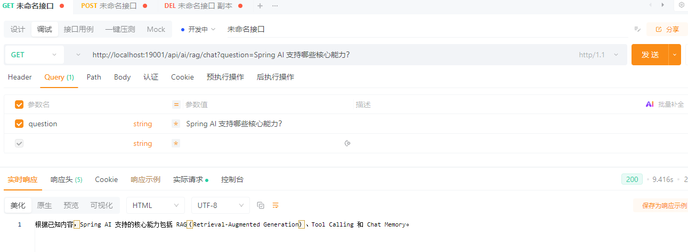

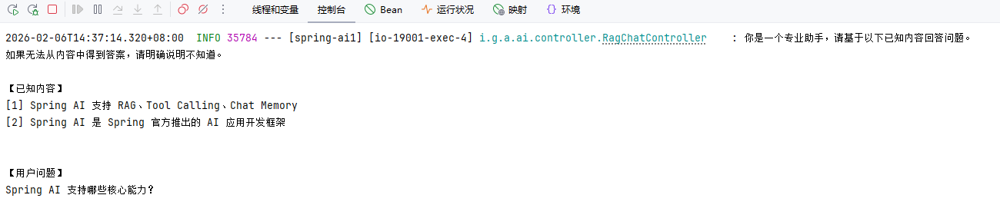

#### Advisor 方案

**创建接口**

```java
package io.github.atengk.ai.controller;

import io.github.atengk.ai.service.RagIngestService;
import lombok.RequiredArgsConstructor;
import lombok.extern.slf4j.Slf4j;
import org.springframework.ai.chat.client.ChatClient;
import org.springframework.ai.document.Document;
import org.springframework.ai.rag.advisor.RetrievalAugmentationAdvisor;
import org.springframework.ai.rag.retrieval.search.VectorStoreDocumentRetriever;
import org.springframework.ai.vectorstore.VectorStore;
import org.springframework.web.bind.annotation.*;

import java.util.List;

/**
 * RAG 对话接口
 */
@RestController
@RequiredArgsConstructor
@RequestMapping("/api/ai/rag")
@Slf4j
public class RagChatController {

    private final ChatClient chatClient;
    private final VectorStore vectorStore;

    @GetMapping("/chat")
    public String chat(@RequestParam String message) {

        // 构建 RAG 增强器：在模型回答前，先根据用户问题去向量库检索相关文档
        RetrievalAugmentationAdvisor advisor = RetrievalAugmentationAdvisor
                .builder()
                // 使用向量检索器，从 VectorStore（如 Milvus）中查找相似文档
                .documentRetriever(
                        VectorStoreDocumentRetriever
                                .builder()
                                // 指定实际使用的向量存储实现
                                .vectorStore(vectorStore)
                                .build()
                )
                .build();

        // 发送用户问题，并在推理前自动注入检索到的文档上下文
        return chatClient
                .prompt()
                .user(message)
                .advisors(advisor)
                .call()
                .content();
    }

}
```

**调用接口**

```
POST /api/ai/rag/chat?message=Spring AI 支持哪些核心能力？
返回：Spring AI 支持 RAG、Tool Calling 和 Chat Memory。
```


## 多模型使用

### 基础配置

**添加依赖**

```xml
<!-- Spring AI - OpenAI 依赖 -->
<dependency>
    <groupId>org.springframework.ai</groupId>
    <artifactId>spring-ai-starter-model-openai</artifactId>
</dependency>

<!-- Spring AI - DeepSeek 依赖 -->
<dependency>
    <groupId>org.springframework.ai</groupId>
    <artifactId>spring-ai-starter-model-deepseek</artifactId>
</dependency>
```

**编辑配置**

```yaml
---
# Spring AI 配置
spring:
  ai:
    openai:
      base-url: https://api.chatanywhere.tech
      api-key: ${OPENAI_API_KEY}
      chat:
        options:
          model: gpt-4o-mini
    deepseek:
      base-url: https://api.chatanywhere.tech
      api-key: ${DEEPSEEK_API_KEY}
      chat:
        options:
          model: deepseek-v3.2
```

**创建配置类**

```java
package io.github.atengk.ai.config;

import lombok.RequiredArgsConstructor;
import org.springframework.ai.chat.client.ChatClient;
import org.springframework.ai.deepseek.DeepSeekChatModel;
import org.springframework.ai.openai.OpenAiChatModel;
import org.springframework.context.annotation.Bean;
import org.springframework.context.annotation.Configuration;
import org.springframework.context.annotation.Primary;

@Configuration
public class ChatClientConfig {

    @Bean("openAiChatClient")
    @Primary
    public ChatClient openAiChatClient(OpenAiChatModel model) {
        return ChatClient.builder(model).build();
    }

    @Bean("deepSeekChatClient")
    public ChatClient deepSeekChatClient(DeepSeekChatModel model) {
        return ChatClient.builder(model).build();
    }

}
```

### 创建策略和工厂

#### 创建枚举

```java
package io.github.atengk.ai.enums;

public enum AiModelType {

    OPENAI("openAiChatClient"),
    DEEPSEEK("deepSeekChatClient");

    private final String chatClientBeanName;

    AiModelType(String chatClientBeanName) {
        this.chatClientBeanName = chatClientBeanName;
    }

    public String getBeanName() {
        return chatClientBeanName;
    }
}
```

#### 创建策略

```java
package io.github.atengk.ai.service;

import io.github.atengk.ai.enums.AiModelType;
import org.springframework.ai.chat.client.ChatClient;

public interface ChatClientStrategy {

    /**
     * 当前策略支持的模型类型
     *
     * @return AiModelType
     */
    AiModelType getModelType();

    /**
     * 返回对应的 ChatClient
     *
     * @return ChatClient
     */
    ChatClient getChatClient();
}

```

#### 策略实现 OpenAi

```java
package io.github.atengk.ai.service.strategy;

import io.github.atengk.ai.enums.AiModelType;
import io.github.atengk.ai.service.ChatClientStrategy;
import org.springframework.ai.chat.client.ChatClient;
import org.springframework.beans.factory.annotation.Qualifier;
import org.springframework.stereotype.Component;

@Component
public class OpenAiChatClientStrategy implements ChatClientStrategy {

    private final ChatClient chatClient;

    public OpenAiChatClientStrategy(
            @Qualifier("openAiChatClient") ChatClient chatClient) {
        this.chatClient = chatClient;
    }

    @Override
    public AiModelType getModelType() {
        return AiModelType.OPENAI;
    }

    @Override
    public ChatClient getChatClient() {
        return chatClient;
    }
}


```

#### 策略实现 DeepSeek

```java
package io.github.atengk.ai.service.strategy;

import io.github.atengk.ai.enums.AiModelType;
import io.github.atengk.ai.service.ChatClientStrategy;
import org.springframework.ai.chat.client.ChatClient;
import org.springframework.beans.factory.annotation.Qualifier;
import org.springframework.stereotype.Component;

@Component
public class DeepSeekChatClientStrategy implements ChatClientStrategy {

    private final ChatClient chatClient;

    public DeepSeekChatClientStrategy(
            @Qualifier("deepSeekChatClient") ChatClient chatClient) {
        this.chatClient = chatClient;
    }

    @Override
    public AiModelType getModelType() {
        return AiModelType.DEEPSEEK;
    }

    @Override
    public ChatClient getChatClient() {
        return chatClient;
    }
}


```

#### 创建工厂

```java
package io.github.atengk.ai.service;

import io.github.atengk.ai.enums.AiModelType;
import org.springframework.ai.chat.client.ChatClient;
import org.springframework.stereotype.Component;

import java.util.Map;

@Component
public class ChatClientFactory {

    private final Map<String, ChatClient> chatClientMap;

    public ChatClientFactory(Map<String, ChatClient> chatClientMap) {
        this.chatClientMap = chatClientMap;
    }

    public ChatClient getClient(AiModelType modelType) {
        ChatClient client = chatClientMap.get(modelType.getBeanName());
        if (client == null) {
            throw new IllegalArgumentException(
                    "No ChatClient bean named: " + modelType.getBeanName());
        }
        return client;
    }

}

```

### 使用多模型

#### 创建服务

```java
package io.github.atengk.ai.service;

import io.github.atengk.ai.enums.AiModelType;
import org.springframework.stereotype.Service;

@Service
public class ChatClientService {

    private final ChatClientFactory factory;

    public ChatClientService(ChatClientFactory factory) {
        this.factory = factory;
    }

    public String chat(AiModelType modelType, String prompt) {
        return factory.getClient(modelType)
                .prompt(prompt)
                .call()
                .content();
    }
}
```

#### 创建接口

```java
package io.github.atengk.ai.controller;

import io.github.atengk.ai.enums.AiModelType;
import io.github.atengk.ai.service.ChatClientService;
import org.springframework.web.bind.annotation.GetMapping;
import org.springframework.web.bind.annotation.RequestMapping;
import org.springframework.web.bind.annotation.RequestParam;
import org.springframework.web.bind.annotation.RestController;

@RestController
@RequestMapping("/api/ai")
public class ChatClientController {

    private final ChatClientService chatClientService;

    public ChatClientController(ChatClientService chatClientService) {
        this.chatClientService = chatClientService;
    }

    @GetMapping("/chat")
    public String chat(
            @RequestParam(defaultValue = "OPENAI") AiModelType model,
            @RequestParam String prompt) {

        return chatClientService.chat(model, prompt);
    }
}

```

#### 使用接口

```java
GET /api/ai/chat?model=DEEPSEEK&prompt=SpringAI是什么？
GET /api/ai/chat?model=OPENAI&prompt=SpringAI是什么？
```

