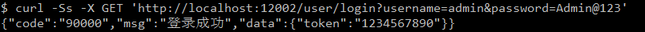
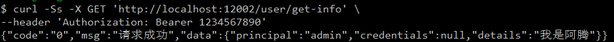
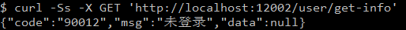
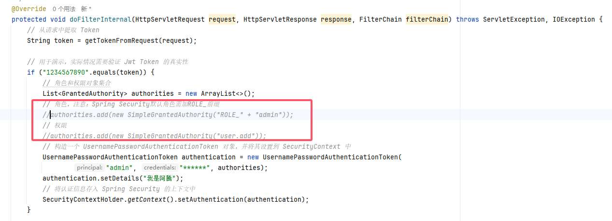
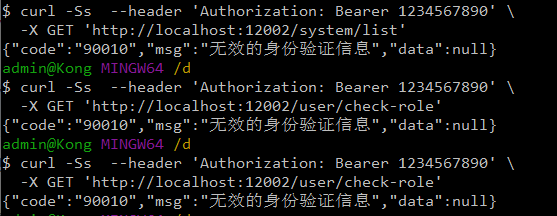

# Spring Security6

Spring Security 6与Spring Boot 3无缝集成，提供强大的认证和授权机制。通过灵活配置，它支持多种认证方式（如JWT、OAuth2）以及细粒度的权限控制。Spring Security 6的更新增强了安全性并简化了配置，使开发者可以更容易地保护Web应用程序。

SpringSecurity6通过集成JWT实现无状态认证。用户登录成功后，系统生成一个JWT令牌，该令牌包含用户信息和权限数据，并设置过期时间。客户端在后续请求中携带此Token，服务端通过过滤器解析和验证Token，确认其有效性后，将认证信息存入安全上下文，从而完成权限校验。这种机制无需在服务器端保存会话数据，提升了系统的扩展性和性能。


## 基础配置

基于 [异常处理](/work/Ateng-Java/springboot3/exception/) 模块做开发演示

### 添加依赖

```xml
<!-- Spring Security 依赖 -->
<dependency>
    <groupId>org.springframework.boot</groupId>
    <artifactId>spring-boot-starter-security</artifactId>
</dependency>
```


## 基本使用

### 创建过滤器

```java
package local.ateng.java.auth.filter;

import jakarta.servlet.FilterChain;
import jakarta.servlet.ServletException;
import jakarta.servlet.http.HttpServletRequest;
import jakarta.servlet.http.HttpServletResponse;
import org.springframework.security.authentication.UsernamePasswordAuthenticationToken;
import org.springframework.security.core.context.SecurityContextHolder;
import org.springframework.web.filter.OncePerRequestFilter;

import java.io.IOException;
import java.util.ArrayList;

/**
 * 自定义的 JwtAuthenticationFilter 过滤器，用于从请求中提取 JWT Token 并进行认证。
 * 该过滤器会在每次请求时执行一次，验证请求中的 Token 是否有效，并将认证信息存储到 SecurityContext 中。
 *
 * @author 孔余
 * @email 2385569970@qq.com
 * @since 2025-02-26
 */
public class JwtAuthenticationFilter extends OncePerRequestFilter {

    /**
     * 过滤器的核心逻辑，处理每个请求并进行身份验证。
     *
     * @param request     请求对象
     * @param response    响应对象
     * @param filterChain 过滤器链，用于调用下一个过滤器
     * @throws ServletException 如果发生 Servlet 异常
     * @throws IOException      如果发生 I/O 异常
     */
    @Override
    protected void doFilterInternal(HttpServletRequest request, HttpServletResponse response, FilterChain filterChain) throws ServletException, IOException {
        // 从请求中提取 Token
        String token = getTokenFromRequest(request);

        // 用于演示，实际情况需要验证 Jwt Token 的真实性
        if ("1234567890".equals(token)) {
            // 构造一个 UsernamePasswordAuthenticationToken 对象，并将其设置到 SecurityContext 中
            UsernamePasswordAuthenticationToken authentication = new UsernamePasswordAuthenticationToken(
                    "admin", "******", new ArrayList<>());
            authentication.setDetails("我是阿腾");
            // 将认证信息存入 Spring Security 的上下文中
            SecurityContextHolder.getContext().setAuthentication(authentication);
        }

        // 继续执行过滤器链，传递请求和响应
        filterChain.doFilter(request, response);
    }

    /**
     * 从请求头中提取 Token，通常是 Bearer Token。
     *
     * @param request 请求对象
     * @return 提取到的 Token，如果没有则返回 null
     */
    private String getTokenFromRequest(HttpServletRequest request) {
        // 从请求头中获取 "Authorization" 字段
        String header = request.getHeader("Authorization");

        // 检查 Authorization 头部是否包含 Bearer Token
        if (header != null && header.startsWith("Bearer ")) {
            // 提取 Token 部分
            return header.substring(7);  // 去掉 "Bearer " 前缀
        }

        // 如果没有找到 Token，则返回 null
        return null;
    }
}
```

### 创建配置

```java
package local.ateng.java.auth.config;

import jakarta.servlet.http.HttpServletResponse;
import local.ateng.java.auth.constant.AppCodeEnum;
import local.ateng.java.auth.filter.JwtAuthenticationFilter;
import local.ateng.java.auth.utils.Result;
import org.springframework.context.annotation.Bean;
import org.springframework.context.annotation.Configuration;
import org.springframework.security.config.annotation.web.builders.HttpSecurity;
import org.springframework.security.config.http.SessionCreationPolicy;
import org.springframework.security.core.userdetails.UserDetailsService;
import org.springframework.security.web.AuthenticationEntryPoint;
import org.springframework.security.web.SecurityFilterChain;
import org.springframework.security.web.access.AccessDeniedHandler;
import org.springframework.security.web.authentication.UsernamePasswordAuthenticationFilter;

import java.io.PrintWriter;

/**
 * SpringSecurity 配置
 *
 * @author 孔余
 * @email 2385569970@qq.com
 * @since 2025-02-26
 */
@Configuration
public class SecurityConfig {

    /**
     * 配置 Spring Security 的过滤链，定义各种安全策略和规则。
     *
     * @param httpSecurity HttpSecurity 对象，用于配置安全相关的选项
     * @return 配置好的 SecurityFilterChain
     * @throws Exception 可能抛出的异常
     */
    @Bean
    public SecurityFilterChain securityFilterChain(HttpSecurity httpSecurity) throws Exception {
        httpSecurity
                // 配置 URL 路径的权限控制
                .authorizeHttpRequests(router -> {
                    // 开放登录和 actuator 端点
                    router.requestMatchers("/user/login", "/actuator/**").permitAll()
                            // 限制 /system/** 只能被拥有 "admin" 角色的用户访问
                            .requestMatchers("/system/**").hasRole("admin")
                            // 限制 /user/add 只能被拥有 "user:add" 权限的用户访问
                            .requestMatchers("/user/add").hasAuthority("user.add")
                            // 其他请求需要认证
                            .anyRequest().authenticated();
                })
                // 禁用表单登录
                .formLogin(form -> form.disable())
                // 禁用默认登出功能
                .logout(config -> config.disable())
                // 禁用默认的 HTTP Basic 认证
                .httpBasic(httpBasic -> httpBasic.disable())
                // 设置 session 管理为无状态（适用于 JWT）
                .sessionManagement(session -> session.sessionCreationPolicy(SessionCreationPolicy.STATELESS))
                // 添加自定义 JWT 认证过滤器
                .addFilterBefore(new JwtAuthenticationFilter(), UsernamePasswordAuthenticationFilter.class)
                // 禁用 CORS 和 CSRF（通常用于无状态认证）
                .cors(cors -> cors.disable())
                .csrf(csrf -> csrf.disable())
                // 配置异常处理，未授权和权限不足时的处理
                .exceptionHandling(exceptionHandling -> {
                    exceptionHandling.accessDeniedHandler(accessDeniedHandler());  // 权限不足时调用
                    exceptionHandling.authenticationEntryPoint(authenticationEntryPoint());  // 未认证时调用
                });

        return httpSecurity.build();  // 返回配置好的过滤链
    }


    /**
     * 不使用SpringSecurity的账号密码验证，而是自定义验证账号密码信息
     */
    @Bean
    public UserDetailsService userDetailsService() {
        return username -> null;
    }

    /**
     * 创建自定义的 AuthenticationEntryPoint，用于处理未登录（401）状态下的请求。
     * 当用户未登录时，返回一个 JSON 格式的错误信息，提示未登录。
     *
     * @return 返回一个实现了 AuthenticationEntryPoint 接口的 Bean，处理未登录的异常。
     */
    @Bean
    public AuthenticationEntryPoint authenticationEntryPoint() {
        return (request, response, authException) -> {
            response.setStatus(HttpServletResponse.SC_UNAUTHORIZED);
            response.setCharacterEncoding("UTF-8");
            response.setContentType("application/json; charset=utf-8");
            PrintWriter printWriter = response.getWriter();
            printWriter.write(Result.error(AppCodeEnum.AUTH_USER_NOT_LOGIN.getCode(), AppCodeEnum.AUTH_USER_NOT_LOGIN.getDescription()).toString());
            printWriter.flush();
        };
    }

    /**
     * 创建自定义的 AccessDeniedHandler，用于处理权限不足（403）状态下的请求。
     * 当用户在登录后，但没有足够权限时，返回一个 JSON 格式的错误信息，提示权限不足。
     *
     * @return 返回一个实现了 AccessDeniedHandler 接口的 Bean，处理权限不足的异常。
     */
    @Bean
    public AccessDeniedHandler accessDeniedHandler() {
        return (request, response, authException) -> {
            response.setStatus(HttpServletResponse.SC_FORBIDDEN);
            response.setCharacterEncoding("UTF-8");
            response.setContentType("application/json; charset=utf-8");
            PrintWriter printWriter = response.getWriter();
            printWriter.write(Result.error(AppCodeEnum.AUTH_INVALID_AUTHENTICATION.getCode(), AppCodeEnum.AUTH_INVALID_AUTHENTICATION.getDescription()).toString());
            printWriter.flush();
        };
    }

}
```

### 创建接口

```java
package local.ateng.java.auth.controller;

import com.alibaba.fastjson2.JSONObject;
import jakarta.servlet.http.HttpServletRequest;
import local.ateng.java.auth.constant.AppCodeEnum;
import local.ateng.java.auth.utils.Result;
import org.springframework.security.authentication.UsernamePasswordAuthenticationToken;
import org.springframework.security.core.Authentication;
import org.springframework.security.core.context.SecurityContextHolder;
import org.springframework.security.web.context.HttpSessionSecurityContextRepository;
import org.springframework.web.bind.annotation.GetMapping;
import org.springframework.web.bind.annotation.RequestMapping;
import org.springframework.web.bind.annotation.RestController;

import java.util.ArrayList;
import java.util.Arrays;

@RestController
@RequestMapping("/user")
public class UserController {


    @GetMapping("/login")
    public Result login(String username, String password, HttpServletRequest request) {
        // 自定义验证用户的账号和密码（这里只是示例，实际应该去数据库或其他存储验证）
        if (!"admin".equals(username)) {
            return Result.error(AppCodeEnum.AUTH_USER_NOT_FOUND.getCode(), AppCodeEnum.AUTH_USER_NOT_FOUND.getDescription());
        }
        if (!"Admin@123".equals(password)) {
            return Result.error(AppCodeEnum.AUTH_PASSWORD_INCORRECT.getCode(), AppCodeEnum.AUTH_PASSWORD_INCORRECT.getDescription());
        }

        // 验证账号密码
        UsernamePasswordAuthenticationToken token = new UsernamePasswordAuthenticationToken(username, null, new ArrayList<>());
        token.setDetails("我是阿腾");
        // 存入上下文
        SecurityContextHolder.getContext().setAuthentication(token);
        request.getSession().setAttribute(HttpSessionSecurityContextRepository.SPRING_SECURITY_CONTEXT_KEY, SecurityContextHolder.getContext());

        // 返回成功
        return Result.success(AppCodeEnum.AUTH_USER_LOGIN_SUCCESS.getCode(), AppCodeEnum.AUTH_USER_LOGIN_SUCCESS.getDescription()).setData(JSONObject.of("token", "1234567890"));
    }


    // 查询用户信息
    @GetMapping("/get-info")
    public Result getInfo() {
        Authentication authentication = SecurityContextHolder.getContext().getAuthentication();
        Object principal = authentication.getPrincipal();
        Object credentials = authentication.getCredentials();
        Object details = authentication.getDetails();
        Collection<? extends GrantedAuthority> authorities = authentication.getAuthorities();
        return Result.success(JSONObject.of(
                "principal", principal,
                "credentials", credentials,
                "details", details,
                "authorities", authorities
        ));
    }

    // 获取数据
    @GetMapping("/list")
    public Result list() {
        return Result.success(Arrays.asList(1, 2, 3, 4, 5));
    }

}
```

### 使用接口

调用登录接口，返回Jwt Token信息，后续访问其他接口将该Token信息放入Header中Authorization=Bearer ${Token}

#### 登录

```bash
curl -Ss -X GET 'http://localhost:12002/user/login?username=admin&password=Admin@123'
```



#### 访问其他接口

```bash
curl -Ss -X GET 'http://localhost:12002/user/get-info' \
--header 'Authorization: Bearer 1234567890'
```



如果访问不加Token就会提示错误




## 权限认证

### 启用方法注解

在SecurityConfig文件中使用@EnableMethodSecurity(securedEnabled = true, prePostEnabled = true)启用方法注解

 *   @EnableMethodSecurity：确保在配置类中启用方法级安全，其中 prePostEnabled = true 用于启用 @PreAuthorize 注解的支持。
 *   securedEnabled = true：如果需要支持 @Secured 注解，确保此选项启用。

```java
@Configuration
@EnableMethodSecurity(securedEnabled = true, prePostEnabled = true)
public class SecurityConfig {
    // ...
}
```

### 配置过滤器

修改JwtAuthenticationFilter过滤器，给 `UsernamePasswordAuthenticationToken` 中添加角色（角色需加ROLE_前缀）和权限

```java
    @Override
    protected void doFilterInternal(HttpServletRequest request, HttpServletResponse response, FilterChain filterChain) throws ServletException, IOException {
        // 从请求中提取 Token
        String token = getTokenFromRequest(request);

        // 用于演示，实际情况需要验证 Jwt Token 的真实性
        if ("1234567890".equals(token)) {
            // 角色和权限对象集合
            List<GrantedAuthority> authorities = new ArrayList<>();
            // 角色，注意：Spring Security默认角色需加ROLE_前缀
            authorities.add(new SimpleGrantedAuthority("ROLE_" + "admin"));
            // 权限
            authorities.add(new SimpleGrantedAuthority("user.add"));
            // 构造一个 UsernamePasswordAuthenticationToken 对象，并将其设置到 SecurityContext 中
            UsernamePasswordAuthenticationToken authentication = new UsernamePasswordAuthenticationToken(
                    "admin", "******", authorities);
            authentication.setDetails("我是阿腾");
            // 将认证信息存入 Spring Security 的上下文中
            SecurityContextHolder.getContext().setAuthentication(authentication);
        }

        // 继续执行过滤器链，传递请求和响应
        filterChain.doFilter(request, response);
    }
```

### 配置全局异常

对于注解效验 `@PreAuthorize()` 失败抛出的异常会先被全局异常拦截，所以这样在全局异常里面被拦截了然后再抛出去，从而使SpringSecurity的自定义异常处理器public AccessDeniedHandler accessDeniedHandler() {}方法捕获

```java
@RestControllerAdvice
@Slf4j
public class GlobalExceptionHandler {
    
    // ...
    
    // 将 Spring Security 异常处理
    @ExceptionHandler({AuthorizationDeniedException.class})
    public void handleException(Exception e) throws Exception{
        // 将 Spring Security 异常继续抛出，以便交给自定义处理器处理
        if (e instanceof AuthorizationDeniedException) {
            throw e;
        }
    }

}
```

### 创建接口

**创建接口，验证权限**

system接口

```java
@RestController
@RequestMapping("/system")
public class SystemController {

    // 获取数据
    @GetMapping("/list")
    public Result list() {
        return Result.success(Arrays.asList(1, 2, 3, 4, 5));
    }

}
```

user接口，新增的2个

```java
@RestController
@RequestMapping("/user")
public class UserController {

    // ...
	
    // 注解角色测试
    @GetMapping("/check-role")
    @PreAuthorize("hasRole('admin')")
    public Result checkRole() {
        return Result.success();
    }
    // 注解权限测试
    @PreAuthorize("hasAuthority('user.*')")
    @GetMapping("/check-permission")
    public Result checkPermission() {
        return Result.success();
    }

}
```

### 访问接口

依次访问这三个接口

```bash
curl -Ss  --header 'Authorization: Bearer 1234567890' \
  -X GET 'http://localhost:12002/system/list'

curl -Ss  --header 'Authorization: Bearer 1234567890' \
  -X GET 'http://localhost:12002/user/check-role'

curl -Ss  --header 'Authorization: Bearer 1234567890' \
  -X GET 'http://localhost:12002/user/check-role'
```

将过滤器JwtAuthenticationFilter的角色和权限注释了，再来测试这三个接口



出现权限效验失败就进入异常处理器AccessDeniedHandler accessDeniedHandler() {}方法中了



## 使用JWT

JWT（JSON Web Token）是一种开放标准（RFC 7519），用于在网络应用环境间安全地传递声明（Claims）。JWT 由三部分组成：头部（Header）、载荷（Payload）和签名（Signature）。头部通常指定签名算法，载荷包含声明信息，签名用来验证消息的完整性和认证信息。JWT 常用于身份验证和信息交换，因其自包含性（无需存储会话信息）和跨平台支持而广泛应用于 Web 和移动应用中的身份验证机制。

参考：

- [Hutool-jwt](https://doc.hutool.cn/pages/jwt)

