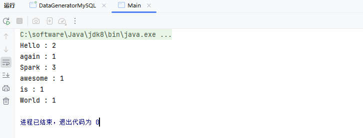

# Spark开发文档

Apache Spark 是一个开源的大数据处理框架，旨在快速处理大规模数据集。它提供了分布式计算能力，支持批处理和流处理。Spark 提供了丰富的API，支持多种编程语言（如Java、Scala、Python、R），并且能在不同的集群管理器（如Hadoop YARN、Kubernetes）上运行。Spark 通过内存计算和高度优化的执行引擎，显著提高了数据处理速度，广泛应用于数据分析、机器学习和图计算等领域。

- [官网链接](https://spark.apache.org/)

## 基础配置

### 创建项目

创建Maven项目，IDEA配置该项目SDK为JDK8、Maven的JRE也配置文JDK8、应用程序配置需要设置 `provided` 作用域


### 配置pom.xml

```xml
<?xml version="1.0" encoding="UTF-8"?>
<project xmlns="http://maven.apache.org/POM/4.0.0"
         xmlns:xsi="http://www.w3.org/2001/XMLSchema-instance"
         xsi:schemaLocation="http://maven.apache.org/POM/4.0.0 http://maven.apache.org/xsd/maven-4.0.0.xsd">
    <!-- 项目模型版本 -->
    <modelVersion>4.0.0</modelVersion>

    <!-- 项目坐标 -->
    <groupId>local.ateng.java.spark</groupId>
    <artifactId>spark-examples</artifactId>
    <version>v1.0</version>
    <name>spark-examples</name>
    <description>
        Maven项目使用Java8对的Spark使用
    </description>

    <!-- 项目属性 -->
    <properties>
        <!-- 默认主程序 -->
        <start-class>local.ateng.java.spark.Main</start-class>
        <java.version>8</java.version>
        <project.build.sourceEncoding>UTF-8</project.build.sourceEncoding>
        <project.reporting.outputEncoding>UTF-8</project.reporting.outputEncoding>
        <maven-compiler.version>3.12.1</maven-compiler.version>
        <maven-shade.version>3.5.1</maven-shade.version>
        <lombok.version>1.18.36</lombok.version>
        <fastjson2.version>2.0.53</fastjson2.version>
        <hutool.version>5.8.35</hutool.version>
        <spark.version>3.5.4</spark.version>
        <hadoop.version>3.3.6</hadoop.version>
    </properties>

    <!-- 项目依赖 -->
    <dependencies>
        <!-- Hutool: Java工具库，提供了许多实用的工具方法 -->
        <dependency>
            <groupId>cn.hutool</groupId>
            <artifactId>hutool-all</artifactId>
            <version>${hutool.version}</version>
        </dependency>

        <!-- Lombok: 简化Java代码编写的依赖项 -->
        <!-- https://mvnrepository.com/artifact/org.projectlombok/lombok -->
        <dependency>
            <groupId>org.projectlombok</groupId>
            <artifactId>lombok</artifactId>
            <version>${lombok.version}</version>
            <scope>provided</scope>
        </dependency>

        <!-- 高性能的JSON库 -->
        <!-- https://github.com/alibaba/fastjson2/wiki/fastjson2_intro_cn#0-fastjson-20%E4%BB%8B%E7%BB%8D -->
        <dependency>
            <groupId>com.alibaba.fastjson2</groupId>
            <artifactId>fastjson2</artifactId>
            <version>${fastjson2.version}</version>
        </dependency>

        <!-- SLF4J API -->
        <dependency>
            <groupId>org.slf4j</groupId>
            <artifactId>slf4j-api</artifactId>
            <version>1.7.36</version>
            <scope>provided</scope>
        </dependency>
        <!-- Log4j 2.x API -->
        <dependency>
            <groupId>org.apache.logging.log4j</groupId>
            <artifactId>log4j-api</artifactId>
            <version>2.19.0</version>
            <scope>provided</scope>
        </dependency>
        <!-- Log4j 2.x 实现 -->
        <dependency>
            <groupId>org.apache.logging.log4j</groupId>
            <artifactId>log4j-core</artifactId>
            <version>2.19.0</version>
            <scope>provided</scope>
        </dependency>
        <!-- SLF4J 和 Log4j 2.x 绑定 -->
        <dependency>
            <groupId>org.apache.logging.log4j</groupId>
            <artifactId>log4j-slf4j-impl</artifactId>
            <version>2.19.0</version>
            <scope>provided</scope>
        </dependency>

        <!-- Spark Core -->
        <dependency>
            <groupId>org.apache.spark</groupId>
            <artifactId>spark-core_2.12</artifactId>
            <version>${spark.version}</version>
            <scope>provided</scope>
        </dependency>

    </dependencies>

    <!-- 插件仓库配置 -->
    <repositories>
        <!-- Central Repository -->
        <repository>
            <id>central</id>
            <name>阿里云中央仓库</name>
            <url>https://maven.aliyun.com/repository/central</url>
            <!--<name>Maven官方中央仓库</name>
            <url>https://repo.maven.apache.org/maven2/</url>-->
        </repository>
    </repositories>

    <!-- 构建配置 -->
    <build>
        <finalName>${project.name}-${project.version}</finalName>
        <plugins>
            <!-- Maven 编译插件 -->
            <plugin>
                <groupId>org.apache.maven.plugins</groupId>
                <artifactId>maven-compiler-plugin</artifactId>
                <version>${maven-compiler.version}</version>
                <configuration>
                    <source>${java.version}</source>
                    <target>${java.version}</target>
                    <encoding>${project.build.sourceEncoding}</encoding>
                </configuration>
            </plugin>
            <!-- Maven Shade 打包插件 -->
            <!-- https://maven.apache.org/plugins/maven-shade-plugin/shade-mojo.html -->
            <plugin>
                <groupId>org.apache.maven.plugins</groupId>
                <artifactId>maven-shade-plugin</artifactId>
                <version>${maven-shade.version}</version>
                <executions>
                    <execution>
                        <phase>package</phase>
                        <goals>
                            <goal>shade</goal>
                        </goals>
                        <configuration>
                            <!-- 禁用生成 dependency-reduced-pom.xml 文件 -->
                            <createDependencyReducedPom>false</createDependencyReducedPom>
                            <!-- 附加shaded工件时使用的分类器的名称 -->
                            <shadedClassifierName>shaded</shadedClassifierName>
                            <transformers>
                                <transformer implementation="org.apache.maven.plugins.shade.resource.ManifestResourceTransformer">
                                    <mainClass>${start-class}</mainClass> <!-- 指定默认主程序 -->
                                </transformer>
                            </transformers>
                            <artifactSet>
                                <!-- 排除依赖项 -->
                                <excludes>
                                    <exclude>org.apache.logging.log4j:*</exclude>
                                    <exclude>org.slf4j:*</exclude>
                                    <exclude>ch.qos.logback:*</exclude>
                                </excludes>
                            </artifactSet>
                            <filters>
                                <filter>
                                    <!-- 不复制 META-INF 下的签名文件 -->
                                    <artifact>*:*</artifact>
                                    <excludes>
                                        <exclude>META-INF/*.SF</exclude>
                                        <exclude>META-INF/*.MF</exclude>
                                        <exclude>META-INF/*.DSA</exclude>
                                        <exclude>META-INF/*.RSA</exclude>
                                        <exclude>META-INF/services/java.sql.Driver</exclude>
                                    </excludes>
                                </filter>
                            </filters>
                        </configuration>
                    </execution>
                </executions>
            </plugin>
        </plugins>
    </build>
</project>
```

### 配置log4j2.properties

在**resources**目录下创建log4j2的日志配置文件

```properties
# 配置日志格式
appender.console.name = ConsoleAppender
appender.console.type = CONSOLE
appender.console.layout.type = PatternLayout
appender.console.layout.pattern = %d{ISO8601} [%t] %-5level %logger{36} - %msg%n

# 定义根日志级别
rootLogger.level = INFO
rootLogger.appenderRefs = console
rootLogger.appenderRef.console.ref = ConsoleAppender

# Spark
logger.spark.name = org.apache.spark
logger.spark.level = WARN
logger.spark.appenderRefs = console
logger.spark.appenderRef.console.ref = ConsoleAppender
logger.sparkproject.name = org.sparkproject
logger.sparkproject.level = WARN
logger.sparkproject.appenderRefs = console
logger.sparkproject.appenderRef.console.ref = ConsoleAppender

# Hadoop
logger.flink.name = org.apache.hadoop
logger.flink.level = WARN
logger.flink.appenderRefs = console
logger.flink.appenderRef.console.ref = ConsoleAppender
```

### 使用WordCount

创建第一个Spark程序WordCount

```java
package local.ateng.java.spark;

import org.apache.spark.SparkConf;
import org.apache.spark.api.java.JavaPairRDD;
import org.apache.spark.api.java.JavaRDD;
import org.apache.spark.api.java.JavaSparkContext;
import scala.Tuple2;

import java.util.Arrays;

public class Main {
    public static void main(String[] args) {
        // 创建Spark配置
        SparkConf conf = new SparkConf();
        conf.setAppName("RDD Example");
        // 设置运行环境
        String masterValue = conf.get("spark.master", "local[*]");
        conf.setMaster(masterValue);
        // 创建Spark上下文
        JavaSparkContext sc = new JavaSparkContext(conf);

        // 自定义一组数据
        String[] data = {
                "Hello Spark World",
                "Spark is awesome",
                "Hello again Spark"
        };

        // 将数据并行化为RDD
        JavaRDD<String> inputData = sc.parallelize(Arrays.asList(data));

        // 1. 将每行数据拆分为单词
        JavaRDD<String> words = inputData.flatMap(line -> Arrays.asList(line.split(" ")).iterator());

        // 2. 转换为键值对 (word, 1)
        JavaPairRDD<String, Integer> wordPairs = words.mapToPair(word -> new Tuple2<>(word, 1));

        // 3. 按键聚合，计算每个单词的出现次数
        JavaPairRDD<String, Integer> wordCounts = wordPairs.reduceByKey(Integer::sum);

        // 4. 打印结果
        wordCounts.collect().forEach(result -> {
            System.out.println(result._1 + " : " + result._2);
        });

        // 停止Spark上下文
        sc.stop();
    }
}
```



## RDD

RDD（Resilient Distributed Dataset 弹性分布式数据集）是 Spark 的核心抽象，表示不可变的分布式数据集合，支持惰性求值、分区存储和容错性。通过转换（如 `map`、`filter`）生成新 RDD，通过动作（如 `collect`、`count`）触发计算。RDD 可从集合、文件等创建，适合灵活数据处理，但性能不如 DataFrame 和 Dataset，高级开发中使用逐渐减少，但理解其概念有助于掌握 Spark 内部机制。

- [官方文档](https://spark.apache.org/docs/latest/rdd-programming-guide.html)

### 数据源

#### 本地文件

```java
package local.ateng.java.spark.rdd.read;

import org.apache.spark.SparkConf;
import org.apache.spark.api.java.JavaRDD;
import org.apache.spark.api.java.JavaSparkContext;

/**
 * 读取本地文件
 *
 * @author 孔余
 * @email 2385569970@qq.com
 * @since 2025-01-24
 */
public class ReadLocalFile {
    public static void main(String[] args) {
        // 创建Spark配置
        SparkConf conf = new SparkConf();
        conf.setAppName("读取本地文件");
        // 设置运行环境
        String masterValue = conf.get("spark.master", "local[*]");
        conf.setMaster(masterValue);
        // 创建Spark上下文
        JavaSparkContext sc = new JavaSparkContext(conf);

        // 将数据并行化为RDD
        JavaRDD<String> textFileRDD = sc.textFile("file:///D:/Temp/2025/202501/20250121/my_user.csv");

        // 输出文件内容
        textFileRDD.foreach(line -> System.out.println(line));

        // 关闭Spark上下文
        sc.close();

    }
}
```

#### HDFS文件

**配置HDFS**

Windows操作系统配置Hadoop

- 参考：[地址](https://github.com/cdarlint/winutils/tree/master)

操作系统设置环境变量

```
HADOOP_GROUP_NAME=ateng
HADOOP_USER_NAME=admin
```

创建目录并设置权限

```
hadoop fs -mkdir -p /data
hadoop fs -chown admin:ateng /data
```

**添加依赖**

```xml
<!-- Hadoop HDFS客户端 -->
<dependency>
    <groupId>org.apache.hadoop</groupId>
    <artifactId>hadoop-client</artifactId>
    <version>${hadoop.version}</version>
    <scope>provided</scope>
    <exclusions>
        <exclusion>
            <groupId>org.slf4j</groupId>
            <artifactId>slf4j-reload4j</artifactId>
        </exclusion>
        <exclusion>
            <groupId>ch.qos.logback</groupId>
            <artifactId>logback-classic</artifactId>
        </exclusion>
        <exclusion>
            <artifactId>gson</artifactId>
            <groupId>com.google.code.gson</groupId>
        </exclusion>
    </exclusions>
</dependency>
```

**代码如下**

```java
package local.ateng.java.spark.rdd.read;

import org.apache.spark.SparkConf;
import org.apache.spark.api.java.JavaRDD;
import org.apache.spark.api.java.JavaSparkContext;

/**
 * 读取HDFS文件
 *
 * @author 孔余
 * @email 2385569970@qq.com
 * @since 2025-01-24
 */
public class ReadHDFSFile {
    public static void main(String[] args) {
        // 创建Spark配置
        SparkConf conf = new SparkConf();
        conf.setAppName("读取HDFS文件");
        // 设置运行环境
        String masterValue = conf.get("spark.master", "local[*]");
        conf.setMaster(masterValue);
        // 创建Spark上下文
        JavaSparkContext sc = new JavaSparkContext(conf);

        // 将数据并行化为RDD
        JavaRDD<String> textFileRDD = sc.textFile("hdfs://server01:8020/data/my_user.csv");

        // 输出文件内容
        textFileRDD.foreach(line -> System.out.println(line));

        // 关闭Spark上下文
        sc.close();

    }
}
```

#### 递归读取HDFS文件

Spark 支持递归读取子目录中的所有文件。

```java
package local.ateng.java.spark.rdd.read;

import org.apache.spark.SparkConf;
import org.apache.spark.api.java.JavaRDD;
import org.apache.spark.api.java.JavaSparkContext;

/**
 * 递归读取HDFS文件
 *
 * @author 孔余
 * @email 2385569970@qq.com
 * @since 2025-01-24
 */
public class ReadHDFSRecursiveFile {
    public static void main(String[] args) {
        // 创建Spark配置
        SparkConf conf = new SparkConf();
        conf.setAppName("读取HDFS文件");
        // 启用递归读取
        conf.set("spark.hadoop.mapreduce.input.fileinputformat.input.dir.recursive", "true");
        // 设置运行环境
        String masterValue = conf.get("spark.master", "local[*]");
        conf.setMaster(masterValue);
        // 创建Spark上下文
        JavaSparkContext sc = new JavaSparkContext(conf);

        // 将数据并行化为RDD
        JavaRDD<String> textFileRDD = sc.textFile("hdfs://server01:8020/data/flink/sink");

        // 输出文件内容
        long count = textFileRDD.count();
        System.out.println(count);
        //textFileRDD.foreach(line -> System.out.println(line));

        // 关闭Spark上下文
        sc.close();

    }
}
```

### 算子

参考：[官方文档](https://spark.apache.org/docs/latest/rdd-programming-guide.html#passing-functions-to-spark)

#### Filter

```java
package local.ateng.java.spark.rdd.operator;

import org.apache.spark.SparkConf;
import org.apache.spark.api.java.JavaRDD;
import org.apache.spark.api.java.JavaSparkContext;

/**
 * 读取HDFS文件并过滤内容
 *
 * @author 孔余
 * @email 2385569970@qq.com
 * @since 2025-01-24
 */
public class OperatorFilter {
    public static void main(String[] args) {
        // 创建Spark配置
        SparkConf conf = new SparkConf();
        conf.setAppName("读取HDFS文件并过滤内容");
        // 设置运行环境
        String masterValue = conf.get("spark.master", "local[*]");
        conf.setMaster(masterValue);
        // 创建Spark上下文
        JavaSparkContext sc = new JavaSparkContext(conf);

        // 将数据并行化为RDD
        JavaRDD<String> textFileRDD = sc.textFile("hdfs://server01:8020/data/my_user.csv");

        // 使用filter操作，筛选出满足特定条件的数据。例如，只保留包含特定关键词的行。
        JavaRDD<String> filteredRDD = textFileRDD.filter(line -> line.contains("重庆"));

        // 输出文件内容
        filteredRDD.foreach(line -> System.out.println(line));

        // 关闭Spark上下文
        sc.close();

    }
}
```

#### Map

```java
package local.ateng.java.spark.rdd.operator;

import org.apache.spark.SparkConf;
import org.apache.spark.api.java.JavaRDD;
import org.apache.spark.api.java.JavaSparkContext;

/**
 * 读取HDFS文件并数据转换
 *
 * @author 孔余
 * @email 2385569970@qq.com
 * @since 2025-01-24
 */
public class OperatorMap {
    public static void main(String[] args) {
        // 创建Spark配置
        SparkConf conf = new SparkConf();
        conf.setAppName("读取HDFS文件并数据转换");
        // 设置运行环境
        String masterValue = conf.get("spark.master", "local[*]");
        conf.setMaster(masterValue);
        // 创建Spark上下文
        JavaSparkContext sc = new JavaSparkContext(conf);

        // 将数据并行化为RDD
        JavaRDD<String> textFileRDD = sc.textFile("hdfs://server01:8020/data/my_user.csv");

        // 使用map操作，对每一行数据进行转换，创建新的RDD。例如，将每一行数据按逗号分割并获取特定列的值。
        JavaRDD<String> transformedRDD = textFileRDD.map(line -> line.split(",")[1]);

        // 输出文件内容
        transformedRDD.foreach(line -> System.out.println(line));

        // 关闭Spark上下文
        sc.close();

    }
}
```

#### MapEntity

转换成实体类

**创建实体类**

```java
package local.ateng.java.spark.entity;

import lombok.AllArgsConstructor;
import lombok.Builder;
import lombok.Data;
import lombok.NoArgsConstructor;

import java.io.Serializable;
import java.math.BigDecimal;
import java.time.LocalDate;
import java.time.LocalDateTime;
import java.util.Date;

/**
 * 用户实体类
 *
 * @author 孔余
 * @email 2385569970@qq.com
 * @since 2025-01-24
 */
@Data
@NoArgsConstructor
@AllArgsConstructor
@Builder
public class MyUser implements Serializable {
    private static final long serialVersionUID = 1L;

    /**
     * 用户ID
     */
    private Long id;

    /**
     * 用户姓名
     */
    private String name;

    /**
     * 用户年龄
     * 注意：这里使用Integer类型，表示年龄是一个整数值。
     */
    private Integer age;

    /**
     * 分数
     */
    private BigDecimal score;

    /**
     * 用户生日
     * 注意：这里使用Date类型，表示用户的生日。
     */
    private LocalDate birthday;

    /**
     * 用户所在省份
     */
    private String province;

    /**
     * 用户所在城市
     */
    private String city;

    /**
     * 创建时间
     */
    private LocalDateTime createTime;
}
```

创建MapEntity代码

```java
package local.ateng.java.spark.rdd.operator;

import cn.hutool.core.date.LocalDateTimeUtil;
import local.ateng.java.spark.entity.MyUser;
import org.apache.spark.SparkConf;
import org.apache.spark.api.java.JavaRDD;
import org.apache.spark.api.java.JavaSparkContext;

import java.math.BigDecimal;
import java.time.LocalDate;

/**
 * 读取HDFS文件并数据转换
 *
 * @author 孔余
 * @email 2385569970@qq.com
 * @since 2025-01-24
 */
public class OperatorMapEntity {
    public static void main(String[] args) {
        // 创建Spark配置
        SparkConf conf = new SparkConf();
        conf.setAppName("读取HDFS文件并数据转换");
        // 设置运行环境
        String masterValue = conf.get("spark.master", "local[*]");
        conf.setMaster(masterValue);
        // 创建Spark上下文
        JavaSparkContext sc = new JavaSparkContext(conf);

        // 将数据并行化为RDD
        JavaRDD<String> textFileRDD = sc.textFile("hdfs://server01:8020/data/my_user.csv");

        // 使用map操作，对每一行数据进行转换，创建新的RDD。例如，将每一行数据按逗号分割并获取特定列的值。
        JavaRDD<MyUser> myUserRDD = textFileRDD
                .filter(line -> !"id,name,age,score,birthday,province,city,create_time".equals(line))
                .map(line -> {
                    String[] split = line.split(",");
                    return MyUser.builder()
                            .id(Long.parseLong(split[0]))
                            .name(split[1])
                            .age(Integer.parseInt(split[2]))
                            .score(new BigDecimal(split[3]))
                            .birthday(LocalDateTimeUtil.parseDate(split[4], "yyyy-MM-dd"))
                            .province(split[5])
                            .city(split[6])
                            .createTime(LocalDateTimeUtil.parse(split[7], "yyyy-MM-dd HH:mm:ss.SSS"))
                            .build();
                });

        // 输出文件内容
        myUserRDD.foreach(line -> System.out.println(line));

        // 关闭Spark上下文
        sc.close();

    }
}
```

#### FlatMap

```java
package local.ateng.java.spark.rdd.operator;

import org.apache.spark.SparkConf;
import org.apache.spark.api.java.JavaRDD;
import org.apache.spark.api.java.JavaSparkContext;

import java.util.Arrays;

/**
 * 读取HDFS文件并数据转换
 *
 * @author 孔余
 * @email 2385569970@qq.com
 * @since 2025-01-24
 */
public class OperatorFlatMap {
    public static void main(String[] args) {
        // 创建Spark配置
        SparkConf conf = new SparkConf();
        conf.setAppName("读取HDFS文件并数据转换");
        // 设置运行环境
        String masterValue = conf.get("spark.master", "local[*]");
        conf.setMaster(masterValue);
        // 创建Spark上下文
        JavaSparkContext sc = new JavaSparkContext(conf);

        // 将数据并行化为RDD
        JavaRDD<String> textFileRDD = sc.textFile("hdfs://server01:8020/data/my_user.csv");

        // 使用map操作，对每一行数据进行转换，创建新的RDD。例如，将每一行数据按逗号分割并获取特定列的值。
        JavaRDD<String> flatMapRDD = textFileRDD.flatMap(line -> {
            String[] fields = line.split(",");
            return Arrays.asList(fields[1] + "-" + fields[5]).iterator();
        });

        // 输出文件内容
        flatMapRDD.foreach(line -> System.out.println(line));

        // 关闭Spark上下文
        sc.close();

    }
}
```

#### Checkpoint&cache

```java
package local.ateng.java.spark.rdd.operator;

import org.apache.spark.SparkConf;
import org.apache.spark.api.java.JavaRDD;
import org.apache.spark.api.java.JavaSparkContext;

/**
 * 读取HDFS文件，缓存数据和数据检查点
 *
 * @author 孔余
 * @email 2385569970@qq.com
 * @since 2025-01-24
 */
public class OperatorCheckpoint {
    public static void main(String[] args) {
        // 创建Spark配置
        SparkConf conf = new SparkConf();
        conf.setAppName("读取HDFS文件，缓存数据和数据检查点");
        // 设置运行环境
        String masterValue = conf.get("spark.master", "local[*]");
        conf.setMaster(masterValue);
        // 创建Spark上下文
        JavaSparkContext sc = new JavaSparkContext(conf);

        // 将数据并行化为RDD
        JavaRDD<String> textFileRDD = sc.textFile("hdfs://server01:8020/data/my_user.csv");

        // 使用cache或persist操作，将 textFileRDD 缓存到内存中，确保 Spark 在后续操作中不会重新计算该 RDD，而是直接从缓存中读取。
        textFileRDD.cache(); // 或 textFileRDD.persist(StorageLevel.MEMORY_ONLY());
        // 数据检查点：针对 textFileRDD 做检查点计算
        sc.setCheckpointDir("hdfs://server01:8020/spark/checkpoint");
        textFileRDD.checkpoint();

        // 输出文件内容
        textFileRDD.foreach(line -> System.out.println(line));

        // 关闭Spark上下文
        sc.close();

    }
}
```

#### Count

```java
package local.ateng.java.spark.rdd.operator;

import org.apache.spark.SparkConf;
import org.apache.spark.api.java.JavaRDD;
import org.apache.spark.api.java.JavaSparkContext;

/**
 * 读取HDFS文件并计算行数
 *
 * @author 孔余
 * @email 2385569970@qq.com
 * @since 2025-01-24
 */
public class OperatorCount {
    public static void main(String[] args) {
        // 创建Spark配置
        SparkConf conf = new SparkConf();
        conf.setAppName("读取HDFS文件并计算行数");
        // 设置运行环境
        String masterValue = conf.get("spark.master", "local[*]");
        conf.setMaster(masterValue);
        // 创建Spark上下文
        JavaSparkContext sc = new JavaSparkContext(conf);

        // 将数据并行化为RDD
        JavaRDD<String> textFileRDD = sc.textFile("hdfs://server01:8020/data/my_user.csv");

        // 使用count操作，获取RDD中行数。
        long count = textFileRDD.count();

        // 打印结果
        System.out.println("Total lines: " + count);

        // 关闭Spark上下文
        sc.close();

    }
}
```

#### SaveAsTextFile

```java
package local.ateng.java.spark.rdd.operator;

import org.apache.hadoop.io.compress.CompressionCodec;
import org.apache.spark.SparkConf;
import org.apache.spark.api.java.JavaRDD;
import org.apache.spark.api.java.JavaSparkContext;

/**
 * 读取HDFS文件，保存结果数据到HDFS
 *
 * @author 孔余
 * @email 2385569970@qq.com
 * @since 2025-01-24
 */
public class OperatorSaveTo {
    public static void main(String[] args) {
        // 创建Spark配置
        SparkConf conf = new SparkConf();
        conf.setAppName("读取HDFS文件，保存结果数据到HDFS");
        // 设置运行环境
        String masterValue = conf.get("spark.master", "local[*]");
        conf.setMaster(masterValue);
        // 创建Spark上下文
        JavaSparkContext sc = new JavaSparkContext(conf);

        // 将数据并行化为RDD
        JavaRDD<String> textFileRDD = sc.textFile("hdfs://server01:8020/data/my_user.csv");

        // 使用filter操作，筛选出满足特定条件的数据。例如，只保留包含特定关键词的行。
        JavaRDD<String> filteredRDD = textFileRDD.filter(line -> line.contains("重庆"));

        // 使用saveAsTextFile方法，将RDD保存到文本文件或其他输出格式中。
        filteredRDD.saveAsTextFile("hdfs://server01:8020/data/output/my_user_cq");

        // 关闭Spark上下文
        sc.close();

    }
}
```

#### Union

```java
package local.ateng.java.spark.rdd.operator;

import org.apache.spark.SparkConf;
import org.apache.spark.api.java.JavaRDD;
import org.apache.spark.api.java.JavaSparkContext;

/**
 * 读取HDFS文件，合并数据
 *
 * @author 孔余
 * @email 2385569970@qq.com
 * @since 2025-01-24
 */
public class OperatorUnion {
    public static void main(String[] args) {
        // 创建Spark配置
        SparkConf conf = new SparkConf();
        conf.setAppName("读取HDFS文件，合并数据");
        // 设置运行环境
        String masterValue = conf.get("spark.master", "local[*]");
        conf.setMaster(masterValue);
        // 创建Spark上下文
        JavaSparkContext sc = new JavaSparkContext(conf);

        // 将数据并行化为RDD
        JavaRDD<String> textFileRDD = sc.textFile("hdfs://server01:8020/data/my_user.csv");
        textFileRDD.cache();

        // 使用filter操作，筛选出满足特定条件的数据。例如，只保留包含特定关键词的行。
        JavaRDD<String> filtered1RDD = textFileRDD.filter(line -> line.contains("重庆"));
        JavaRDD<String> filtered2RDD = textFileRDD.filter(line -> line.contains("成都"));

        // 使用union操作，将两个RDD合并为一个。
        JavaRDD<String> combinedRDD = filtered1RDD.union(filtered2RDD);

        // 打印RDD中的内容
        combinedRDD.foreach(line -> System.out.println(line));

        // 关闭Spark上下文
        sc.close();

    }
}
```

#### GroupBy

```java
package local.ateng.java.spark.rdd.operator;

import org.apache.spark.SparkConf;
import org.apache.spark.api.java.JavaPairRDD;
import org.apache.spark.api.java.JavaRDD;
import org.apache.spark.api.java.JavaSparkContext;
import scala.Tuple2;

/**
 * 读取HDFS文件，分组聚合
 *
 * @author 孔余
 * @email 2385569970@qq.com
 * @since 2025-01-24
 */
public class OperatorGroupBy {
    public static void main(String[] args) {
        // 创建Spark配置
        SparkConf conf = new SparkConf();
        conf.setAppName("读取HDFS文件，分组聚合");
        // 设置运行环境
        String masterValue = conf.get("spark.master", "local[*]");
        conf.setMaster(masterValue);
        // 创建Spark上下文
        JavaSparkContext sc = new JavaSparkContext(conf);

        // 将数据并行化为RDD
        JavaRDD<String> textFileRDD = sc.textFile("hdfs://server01:8020/data/my_user.csv");

        // 分组聚合
        JavaPairRDD<String, Long> rdd = textFileRDD
                .groupBy(line -> line.split(",")[5])
                .mapValues(value -> value.spliterator().estimateSize());

        // 输出文件内容
        rdd.foreach(line -> System.out.println(line));

        // 关闭Spark上下文
        sc.close();

    }
}
```

#### ReduceByKey

```java
package local.ateng.java.spark.rdd.operator;

import org.apache.spark.SparkConf;
import org.apache.spark.api.java.JavaPairRDD;
import org.apache.spark.api.java.JavaRDD;
import org.apache.spark.api.java.JavaSparkContext;
import scala.Tuple2;

/**
 * 读取HDFS文件，分组操作
 *
 * @author 孔余
 * @email 2385569970@qq.com
 * @since 2025-01-24
 */
public class OperatorReduceByKey {
    public static void main(String[] args) {
        // 创建Spark配置
        SparkConf conf = new SparkConf();
        conf.setAppName("读取HDFS文件，分组操作");
        // 设置运行环境
        String masterValue = conf.get("spark.master", "local[*]");
        conf.setMaster(masterValue);
        // 创建Spark上下文
        JavaSparkContext sc = new JavaSparkContext(conf);

        // 将数据并行化为RDD
        JavaRDD<String> textFileRDD = sc.textFile("hdfs://server01:8020/data/my_user.csv");

        // 聚合
        JavaPairRDD<String, Long> rdd = textFileRDD
                .mapToPair(line -> {
                    String[] fields = line.split(",");
                    return new Tuple2<>(fields[5], 1L);
                })
                .reduceByKey((line1, line2) -> line1 + line2);

        // 输出文件内容
        rdd.foreach(line -> System.out.println(line));

        // 关闭Spark上下文
        sc.close();

    }
}
```

#### CombineByKey

```java
package local.ateng.java.spark.rdd.operator;

import org.apache.spark.SparkConf;
import org.apache.spark.api.java.JavaPairRDD;
import org.apache.spark.api.java.JavaRDD;
import org.apache.spark.api.java.JavaSparkContext;
import org.apache.spark.api.java.function.Function;
import scala.Tuple2;

/**
 * 读取HDFS文件，复杂聚合
 *
 * @author 孔余
 * @email 2385569970@qq.com
 * @since 2025-01-24
 */
public class OperatorCombineByKey {
    public static void main(String[] args) {
        // 创建Spark配置
        SparkConf conf = new SparkConf();
        conf.setAppName("读取HDFS文件，复杂聚合");
        // 设置运行环境
        String masterValue = conf.get("spark.master", "local[*]");
        conf.setMaster(masterValue);
        // 创建Spark上下文
        JavaSparkContext sc = new JavaSparkContext(conf);

        // 将数据并行化为RDD
        JavaRDD<String> textFileRDD = sc.textFile("hdfs://server01:8020/data/my_user.csv");

        // 复杂聚合
        JavaPairRDD<String, Long> rdd = textFileRDD
                .mapToPair(line -> {
                    String[] fields = line.split(",");
                    return new Tuple2<>(fields[5], 1L);
                })
                .combineByKey(
                        // createCombiner: 初始化累加器 (score, 1)
                        count -> new Tuple2<>(count, 1),
                        // mergeValue: 合并新值到当前累加器 (累加分数, 累加数量)
                        (acc, count) -> new Tuple2<>(acc._1 + count, acc._2 + 1),
                        // mergeCombiners: 合并分区的累加器
                        (acc1, acc2) -> new Tuple2<>(acc1._1 + acc2._1, acc1._2 + acc2._2)
                ).mapValues(value -> value._1 + value._2);

        // 输出文件内容
        rdd.foreach(line -> System.out.println(line));

        // 关闭Spark上下文
        sc.close();

    }
}
```


## SQL

Spark SQL 的一种用途是执行 SQL 查询。 Spark SQL 还可用于从现有 Hive 安装读取数据。有关如何配置此功能的更多信息，请参阅Hive 表部分。当从另一种编程语言中运行 SQL 时，结果将作为Dataset/DataFrame返回。您还可以使用命令行 或通过JDBC/ODBC与 SQL 接口进行交互。

- [官方文档](https://spark.apache.org/docs/latest/sql-programming-guide.html)


### 基础配置

#### 添加依赖

```xml
<!-- Spark SQL -->
<dependency>
    <groupId>org.apache.spark</groupId>
    <artifactId>spark-sql_2.12</artifactId>
    <version>${spark.version}</version>
    <scope>provided</scope>
</dependency>
<!-- Spark Hive -->
<dependency>
    <groupId>org.apache.spark</groupId>
    <artifactId>spark-hive_2.12</artifactId>
    <version>${spark.version}</version>
    <scope>provided</scope>
</dependency>
```

