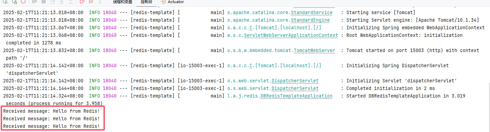

# Spring Data Redis

RedisTemplate 是 Spring Data Redis 提供的一个核心类，用于操作 Redis 数据库，支持对 Redis 各种数据结构的访问，例如字符串（String）、哈希（Hash）、列表（List）、集合（Set）、有序集合（Sorted Set）等。

**主要特点**
通用性强：支持 Redis 的所有数据结构和命令。
扩展性好：可以通过自定义序列化器来适配不同的数据格式。
线程安全：可以在多个线程中安全使用。


## 基础配置

### 添加依赖

添加Spring Boot Redis和Lettuce

```xml
<!-- Spring Boot Redis 数据库集成，支持多种 Redis 数据结构和操作 -->
<dependency>
    <groupId>org.springframework.boot</groupId>
    <artifactId>spring-boot-starter-data-redis</artifactId>
</dependency>

<!-- Lettuce 客户端连接池实现，基于 Apache Commons Pool2 -->
<dependency>
    <groupId>org.apache.commons</groupId>
    <artifactId>commons-pool2</artifactId>
</dependency>
```

### 编辑配置

编辑配置文件 `application.yml`

```yaml
---
# Redis的相关配置
spring:
  data:
    redis:
      host: 192.168.1.10 # Redis服务器地址
      database: 102 # Redis数据库索引（默认为0）
      port: 42784 # Redis服务器连接端口
      password: Admin@123 # Redis服务器连接密码（默认为空）
      client-type: lettuce  # 默认使用Lettuce作为Redis客户端
      lettuce:
        pool:
          max-active: 100 # 连接池最大连接数（使用负值表示没有限制）
          max-wait: -1s # 连接池最大阻塞等待时间（使用负值表示没有限制）
          max-idle: 100 # 连接池中的最大空闲连接
          min-idle: 0 # 连接池最小空闲连接数
          time-between-eviction-runs: 1s # 空闲对象逐出器线程的运行间隔时间.空闲连接线程释放周期时间
      timeout: 5000ms # 连接超时时间（毫秒）
```


## 序列化（可选）

如果不配置序列化在使用 `RedisTemplate` 时记得指定泛型，例如：RedisTemplate<String, MyUser>，不然使用的是Java序列化（二进制）。

如果需要配置序列化，以下方式任选一种，实现序列化后就可以直接使用RedisTemplate redisTemplate

### 使用 Jackson 序列化

Spring Boot 默认集成的 Jackson 序列化库也可以用来做 Redis 序列化。具体来说，就是可以通过 `Jackson2JsonRedisSerializer` 来进行对象的 JSON 序列化和反序列化。

#### ObjectMapper 构建工厂

```java
package local.ateng.java.redis.config;

import com.fasterxml.jackson.annotation.*;
import com.fasterxml.jackson.core.JsonGenerator;
import com.fasterxml.jackson.core.JsonParser;
import com.fasterxml.jackson.databind.*;
import com.fasterxml.jackson.databind.jsontype.BasicPolymorphicTypeValidator;
import com.fasterxml.jackson.databind.jsontype.PolymorphicTypeValidator;
import com.fasterxml.jackson.databind.module.SimpleModule;
import com.fasterxml.jackson.databind.ser.std.ToStringSerializer;
import com.fasterxml.jackson.datatype.jdk8.Jdk8Module;
import com.fasterxml.jackson.datatype.jsr310.JavaTimeModule;
import com.fasterxml.jackson.datatype.jsr310.deser.LocalDateDeserializer;
import com.fasterxml.jackson.datatype.jsr310.deser.LocalDateTimeDeserializer;
import com.fasterxml.jackson.datatype.jsr310.deser.LocalTimeDeserializer;
import com.fasterxml.jackson.datatype.jsr310.ser.LocalDateSerializer;
import com.fasterxml.jackson.datatype.jsr310.ser.LocalDateTimeSerializer;
import com.fasterxml.jackson.datatype.jsr310.ser.LocalTimeSerializer;
import com.fasterxml.jackson.module.paramnames.ParameterNamesModule;

import java.io.IOException;
import java.math.BigInteger;
import java.text.SimpleDateFormat;
import java.time.*;
import java.time.format.DateTimeFormatter;
import java.util.TimeZone;

/**
 * Jackson ObjectMapper 统一构建工厂。
 *
 * <p>
 * 该工厂用于集中管理 JSON 序列化与反序列化策略，避免项目中分散配置导致行为不一致。
 * 当前提供三类构建能力：
 * </p>
 * <ul>
 *     <li>默认配置：适用于通用 JSON 处理场景</li>
 *     <li>存储配置：适用于 Redis、数据库 JSON 字段等持久化场景</li>
 *     <li>Web 配置：适用于 Spring Web 接口入参与返回值场景</li>
 * </ul>
 *
 * @author Ateng
 * @since 2026-04-13
 */
public final class JacksonObjectMapperFactory {

    /**
     * 默认信任的业务包前缀。
     */
    private static final String[] TRUSTED_BASE_PACKAGES = {
            "io.github.atengk",
            "local.ateng.java",
    };

    /**
     * 默认时区标识。
     */
    private static final String DEFAULT_TIME_ZONE_ID = "Asia/Shanghai";

    /**
     * 定义日期时间格式（精确到秒）
     */
    private static final String DATE_TIME_PATTERN = "yyyy-MM-dd HH:mm:ss";

    /**
     * 定义日期格式（不包含时间）
     */
    private static final String DATE_PATTERN = "yyyy-MM-dd";

    /**
     * 定义时间格式（仅时间部分）
     */
    private static final String TIME_PATTERN = "HH:mm:ss";

    /**
     * 禁止实例化。
     */
    private JacksonObjectMapperFactory() {
    }

    /**
     * 构建默认 ObjectMapper。
     *
     * <p>
     * 默认配置仅保留所有场景都需要的公共能力，适合通用 JSON 处理。
     * </p>
     *
     * @return 默认 ObjectMapper
     */
    public static ObjectMapper buildDefaultObjectMapper() {
        ObjectMapper objectMapper = baseObjectMapper();
        registerDefaultJavaTimeModule(objectMapper);
        return objectMapper;
    }

    /**
     * 构建用于 Redis / 数据库存储的 ObjectMapper。
     *
     * <p>
     * 该配置优先保证序列化结果稳定、类型信息完整、BigDecimal 精度不丢失，并支持异常对象与复杂对象结构。
     * </p>
     *
     * @return 存储场景专用 ObjectMapper
     */
    public static ObjectMapper buildStorageObjectMapper() {
        ObjectMapper objectMapper = baseObjectMapper();
        applyVisibility(
                objectMapper,
                JsonAutoDetect.Visibility.ANY,
                JsonAutoDetect.Visibility.NONE,
                JsonAutoDetect.Visibility.NONE,
                JsonAutoDetect.Visibility.NONE,
                JsonAutoDetect.Visibility.NONE
        );
        applyStableSerialization(objectMapper);
        registerDefaultJavaTimeModule(objectMapper);
        applyDefaultTyping(objectMapper);
        applyThrowableMixIn(objectMapper);
        return objectMapper;
    }

    /**
     * 构建用于 Spring Web（前后端交互）的 ObjectMapper。
     *
     * <p>
     * 该配置优先保证接口输出可读、输入兼容、反序列化安全边界清晰，适合 Controller 层统一使用。
     * </p>
     *
     * @return Web 场景专用 ObjectMapper
     */
    public static ObjectMapper buildWebObjectMapper() {
        ObjectMapper objectMapper = baseObjectMapper();
        applyVisibility(
                objectMapper,
                JsonAutoDetect.Visibility.PUBLIC_ONLY,
                JsonAutoDetect.Visibility.PUBLIC_ONLY,
                JsonAutoDetect.Visibility.PUBLIC_ONLY,
                JsonAutoDetect.Visibility.PUBLIC_ONLY,
                JsonAutoDetect.Visibility.DEFAULT
        );
        registerUnifiedDateTimeModule(objectMapper);
        configureLegacyDateFormat(objectMapper);
        applyEnumStrategy(objectMapper);
        applyLenientDeserialization(objectMapper);
        applyJsonReadFeature(objectMapper);
        applyNumberSerialization(objectMapper);
        disableStableSerializationOptions(objectMapper);
        return objectMapper;
    }

    /**
     * 构建用于审计日志（Audit Log）的 ObjectMapper。
     *
     * <p>
     * 该配置用于日志落库、操作审计、数据变更记录等场景，
     * 重点保证序列化结果具备“稳定性、完整性、可追溯性”：
     * </p>
     *
     * @return 审计日志专用 ObjectMapper
     */
    public static ObjectMapper buildAuditObjectMapper() {
        ObjectMapper objectMapper = baseObjectMapper();
        // 可见性：字段优先（保证完整数据输出）
        applyVisibility(
                objectMapper,
                JsonAutoDetect.Visibility.ANY,
                JsonAutoDetect.Visibility.NONE,
                JsonAutoDetect.Visibility.NONE,
                JsonAutoDetect.Visibility.NONE,
                JsonAutoDetect.Visibility.NONE
        );
        applyStableSerialization(objectMapper);
        registerDefaultJavaTimeModule(objectMapper);
        configureLegacyDateFormat(objectMapper);
        applyEnumStrategy(objectMapper);
        applyNumberSerialization(objectMapper);
        applyDefaultTyping(objectMapper);
        return objectMapper;
    }

    /**
     * 构建基础 ObjectMapper。
     *
     * <p>
     * 该方法只负责装载所有场景都需要的公共能力，包括时区、时间模块、空值策略和未知字段处理策略。
     * 具体差异化能力由上层构建方法按场景追加。
     * </p>
     *
     * @return 基础 ObjectMapper
     */
    private static ObjectMapper baseObjectMapper() {

        // 创建 ObjectMapper 实例，用于统一 JSON 序列化与反序列化配置
        ObjectMapper objectMapper = new ObjectMapper();

        // 设置全局默认时区，确保时间序列化与反序列化行为一致
        objectMapper.setTimeZone(TimeZone.getTimeZone(DEFAULT_TIME_ZONE_ID));

        // 注册 JDK8 模块，支持 Optional 等类型
        objectMapper.registerModule(new Jdk8Module());

        // 注册构造参数名模块，支持基于构造方法参数名进行反序列化（需开启 -parameters 编译参数）
        objectMapper.registerModule(new ParameterNamesModule());

        // 禁用时间戳格式输出，统一使用字符串格式，提升可读性
        objectMapper.disable(SerializationFeature.WRITE_DATES_AS_TIMESTAMPS);

        // 禁用空 Bean 序列化失败，避免无属性对象导致异常
        objectMapper.disable(SerializationFeature.FAIL_ON_EMPTY_BEANS);

        // 序列化时忽略值为 null 的字段，减少无效数据输出
        //objectMapper.setSerializationInclusion(JsonInclude.Include.NON_NULL);

        // 保留 null 字段
        objectMapper.setSerializationInclusion(JsonInclude.Include.ALWAYS);

        // 反序列化时忽略未知字段，增强兼容性，避免字段扩展导致失败
        objectMapper.configure(DeserializationFeature.FAIL_ON_UNKNOWN_PROPERTIES, false);

        // 禁用反序列化自动时区调整，避免时间偏移
        objectMapper.configure(DeserializationFeature.ADJUST_DATES_TO_CONTEXT_TIME_ZONE, false);

        // 返回基础配置完成的 ObjectMapper
        return objectMapper;
    }

    /**
     * 统一设置对象可见性策略。
     *
     * @param objectMapper       ObjectMapper 实例
     * @param fieldVisibility    字段可见性
     * @param getterVisibility   getter 可见性
     * @param setterVisibility   setter 可见性
     * @param isGetterVisibility isGetter 可见性
     * @param creatorVisibility  构造器可见性
     */
    private static void applyVisibility(ObjectMapper objectMapper,
                                        JsonAutoDetect.Visibility fieldVisibility,
                                        JsonAutoDetect.Visibility getterVisibility,
                                        JsonAutoDetect.Visibility setterVisibility,
                                        JsonAutoDetect.Visibility isGetterVisibility,
                                        JsonAutoDetect.Visibility creatorVisibility) {
        objectMapper.setVisibility(
                objectMapper.getSerializationConfig()
                        .getDefaultVisibilityChecker()
                        .withFieldVisibility(fieldVisibility)
                        .withGetterVisibility(getterVisibility)
                        .withSetterVisibility(setterVisibility)
                        .withIsGetterVisibility(isGetterVisibility)
                        .withCreatorVisibility(creatorVisibility)
        );
    }

    /**
     * 启用存储场景所需的稳定序列化能力。
     *
     * <p>
     * 该配置用于保证序列化结果具备较强可比性和可读性，同时避免 BigDecimal 精度问题。
     * </p>
     *
     * @param objectMapper ObjectMapper 实例
     */
    private static void applyStableSerialization(ObjectMapper objectMapper) {

        // 启用 BigDecimal 按原始字符串输出，避免科学计数法导致精度或格式问题
        objectMapper.enable(JsonGenerator.Feature.WRITE_BIGDECIMAL_AS_PLAIN);

        // 启用属性按字母排序，保证序列化结果稳定，便于缓存比对与签名计算
        objectMapper.enable(MapperFeature.SORT_PROPERTIES_ALPHABETICALLY);

        // 启用 Map 按 key 排序，确保输出顺序一致
        objectMapper.enable(SerializationFeature.ORDER_MAP_ENTRIES_BY_KEYS);
    }

    /**
     * 注册默认 Java 8 时间模块。
     *
     * <p>
     * 仅用于启用 java.time 类型的基础支持，例如 LocalDate、LocalDateTime、LocalTime 等。
     * 具体的日期时间格式由后续的统一时间模块单独配置。
     * </p>
     *
     * @param objectMapper ObjectMapper 实例
     */
    private static void registerDefaultJavaTimeModule(ObjectMapper objectMapper) {
        objectMapper.registerModule(new JavaTimeModule());
    }

    /**
     * 注册统一日期时间模块。
     *
     * <p>
     * 用于统一 java.time 各类型的序列化与反序列化策略，
     * 明确区分“展示格式”和“时间语义格式”，避免时区信息丢失问题。
     * </p>
     *
     * @param objectMapper ObjectMapper 实例
     */
    private static void registerUnifiedDateTimeModule(ObjectMapper objectMapper) {

        // 构建统一时区（用于默认时间处理）
        ZoneId zoneId = ZoneId.of(DEFAULT_TIME_ZONE_ID);

        // 构建日期时间格式化器（精确到秒）
        DateTimeFormatter dateTimeFormatter = DateTimeFormatter.ofPattern(DATE_TIME_PATTERN);

        // 构建日期格式化器
        DateTimeFormatter dateFormatter = DateTimeFormatter.ofPattern(DATE_PATTERN);

        // 构建时间格式化器
        DateTimeFormatter timeFormatter = DateTimeFormatter.ofPattern(TIME_PATTERN);

        // 创建 JavaTimeModule，用于统一管理时间序列化规则
        JavaTimeModule module = new JavaTimeModule();

        // 注册 LocalDateTime 序列化器
        module.addSerializer(LocalDateTime.class, new LocalDateTimeSerializer(dateTimeFormatter));

        // 注册 LocalDateTime 反序列化器
        module.addDeserializer(LocalDateTime.class, new LocalDateTimeDeserializer(dateTimeFormatter));

        // 注册 LocalDate 序列化器
        module.addSerializer(LocalDate.class, new LocalDateSerializer(dateFormatter));

        // 注册 LocalDate 反序列化器
        module.addDeserializer(LocalDate.class, new LocalDateDeserializer(dateFormatter));

        // 注册 LocalTime 序列化器
        module.addSerializer(LocalTime.class, new LocalTimeSerializer(timeFormatter));

        // 注册 LocalTime 反序列化器
        module.addDeserializer(LocalTime.class, new LocalTimeDeserializer(timeFormatter));

        // 注册 Instant 序列化器（统一输出为 UTC 标准时间）
        module.addSerializer(Instant.class, new JsonSerializer<Instant>() {

            @Override
            public void serialize(Instant value, JsonGenerator gen, SerializerProvider serializers) throws IOException {

                // 空值直接写 null
                if (value == null) {
                    gen.writeNull();
                    return;
                }

                // 使用 ISO_INSTANT 格式输出（带 Z 标识）
                gen.writeString(DateTimeFormatter.ISO_INSTANT.format(value));
            }
        });

        // 注册 Instant 反序列化器（基于 ISO_INSTANT 解析）
        module.addDeserializer(Instant.class, new JsonDeserializer<Instant>() {

            @Override
            public Instant deserialize(JsonParser p, DeserializationContext ctxt) throws IOException {

                // 获取文本值
                String text = p.getText();

                // 空字符串返回 null
                if (text == null || text.trim().isEmpty()) {
                    return null;
                }

                // 按 ISO_INSTANT 解析为 Instant
                return Instant.parse(text);
            }
        });

        // 注册 OffsetDateTime 序列化器（保留 offset 信息）
        module.addSerializer(OffsetDateTime.class, new JsonSerializer<OffsetDateTime>() {

            @Override
            public void serialize(OffsetDateTime value, JsonGenerator gen, SerializerProvider serializers) throws IOException {

                // 空值直接写 null
                if (value == null) {
                    gen.writeNull();
                    return;
                }

                // 使用 ISO_OFFSET_DATE_TIME 输出（包含偏移量）
                gen.writeString(DateTimeFormatter.ISO_OFFSET_DATE_TIME.format(value));
            }
        });

        // 注册 OffsetDateTime 反序列化器
        module.addDeserializer(OffsetDateTime.class, new JsonDeserializer<OffsetDateTime>() {

            @Override
            public OffsetDateTime deserialize(JsonParser p, DeserializationContext ctxt) throws IOException {

                // 获取文本值
                String text = p.getText();

                // 空字符串返回 null
                if (text == null || text.trim().isEmpty()) {
                    return null;
                }

                // 按 ISO_OFFSET_DATE_TIME 解析
                return OffsetDateTime.parse(text, DateTimeFormatter.ISO_OFFSET_DATE_TIME);
            }
        });

        // 注册 ZonedDateTime 序列化器（保留完整时区信息）
        module.addSerializer(ZonedDateTime.class, new JsonSerializer<ZonedDateTime>() {

            @Override
            public void serialize(ZonedDateTime value, JsonGenerator gen, SerializerProvider serializers) throws IOException {

                // 空值直接写 null
                if (value == null) {
                    gen.writeNull();
                    return;
                }

                // 使用 ISO_ZONED_DATE_TIME 输出（包含 ZoneId）
                gen.writeString(DateTimeFormatter.ISO_ZONED_DATE_TIME.format(value));
            }
        });

        // 注册 ZonedDateTime 反序列化器
        module.addDeserializer(ZonedDateTime.class, new JsonDeserializer<ZonedDateTime>() {

            @Override
            public ZonedDateTime deserialize(JsonParser p, DeserializationContext ctxt) throws IOException {

                // 获取文本值
                String text = p.getText();

                // 空字符串返回 null
                if (text == null || text.trim().isEmpty()) {
                    return null;
                }

                // 按 ISO_ZONED_DATE_TIME 解析
                return ZonedDateTime.parse(text, DateTimeFormatter.ISO_ZONED_DATE_TIME);
            }
        });

        // 注册时间模块
        objectMapper.registerModule(module);

        // 设置全局时区
        objectMapper.setTimeZone(TimeZone.getTimeZone(zoneId));

        // 禁用时间戳输出（统一为字符串格式）
        objectMapper.disable(SerializationFeature.WRITE_DATES_AS_TIMESTAMPS);

        // 禁用反序列化自动时区调整，避免时间偏移
        objectMapper.disable(DeserializationFeature.ADJUST_DATES_TO_CONTEXT_TIME_ZONE);
    }


    /**
     * 配置传统 Date 类型的全局格式。
     *
     * <p>
     * 用于统一 java.util.Date 的序列化与反序列化行为，
     * 避免与 java.time 类型出现格式不一致问题。
     * </p>
     *
     * @param objectMapper ObjectMapper 实例
     */
    private static void configureLegacyDateFormat(ObjectMapper objectMapper) {

        // 创建日期格式化对象（非线程安全，但 ObjectMapper 内部会安全使用）
        SimpleDateFormat dateFormat = new SimpleDateFormat(DATE_TIME_PATTERN);

        // 设置统一时区
        dateFormat.setTimeZone(TimeZone.getTimeZone(DEFAULT_TIME_ZONE_ID));

        // 应用到 ObjectMapper
        objectMapper.setDateFormat(dateFormat);
    }


    /**
     * 应用枚举序列化与反序列化策略。
     *
     * <p>
     * 默认情况下，Jackson 使用 Enum.name() 进行序列化，
     * 当枚举名称变更时容易导致反序列化失败。
     * </p>
     *
     * @param objectMapper ObjectMapper 实例
     */
    private static void applyEnumStrategy(ObjectMapper objectMapper) {

        // 使用 toString() 进行序列化（而不是 name）
        objectMapper.enable(SerializationFeature.WRITE_ENUMS_USING_TO_STRING);

        // 反序列化也基于 toString
        objectMapper.enable(DeserializationFeature.READ_ENUMS_USING_TO_STRING);
    }


    /**
     * 应用宽松反序列化策略。
     *
     * <p>
     * 用于增强接口输入的容错能力，适用于 Web 场景，
     * 避免因前端类型不规范导致反序列化失败。
     * </p>
     *
     * @param objectMapper ObjectMapper 实例
     */
    private static void applyLenientDeserialization(ObjectMapper objectMapper) {

        // 允许字符串转数字（"1" -> 1）
        objectMapper.enable(MapperFeature.ALLOW_COERCION_OF_SCALARS);

        // 允许单值当数组使用（"a" -> ["a"]）
        objectMapper.enable(DeserializationFeature.ACCEPT_SINGLE_VALUE_AS_ARRAY);

        // 允许空字符串当 null
        //objectMapper.enable(DeserializationFeature.ACCEPT_EMPTY_STRING_AS_NULL_OBJECT);

        // 允许空数组当 null
        //objectMapper.enable(DeserializationFeature.ACCEPT_EMPTY_ARRAY_AS_NULL_OBJECT);

        // 忽略枚举非法值（避免直接报错）
        objectMapper.enable(DeserializationFeature.READ_UNKNOWN_ENUM_VALUES_AS_NULL);
    }


    /**
     * 应用 JSON 读取容错特性。
     *
     * <p>
     * 用于兼容非标准 JSON 输入（常见于前端或第三方系统），
     * 提升系统整体兼容性。
     * </p>
     *
     * @param objectMapper ObjectMapper 实例
     */
    private static void applyJsonReadFeature(ObjectMapper objectMapper) {

        // 允许 JSON 末尾存在多余逗号
        objectMapper.enable(JsonParser.Feature.ALLOW_TRAILING_COMMA);

        // 允许 JSON 中带注释，方便开发阶段使用
        objectMapper.configure(JsonParser.Feature.ALLOW_COMMENTS, true);

        // 允许字段名不带引号（可处理某些特殊格式的 JSON）
        objectMapper.configure(JsonParser.Feature.ALLOW_UNQUOTED_FIELD_NAMES, true);

        // 允许单引号作为 JSON 字符串的定界符（适用于某些特殊格式）
        objectMapper.configure(JsonParser.Feature.ALLOW_SINGLE_QUOTES, true);

        // 允许控制字符的转义（例如，`\n` 或 `\t`）
        objectMapper.configure(JsonParser.Feature.ALLOW_UNQUOTED_CONTROL_CHARS, true);

        // 允许反斜杠转义任何字符（如：`\\`）
        objectMapper.configure(JsonParser.Feature.ALLOW_BACKSLASH_ESCAPING_ANY_CHARACTER, true);

        // 允许无效的 UTF-8 字符（如果 JSON 编码不完全符合标准）
        objectMapper.configure(JsonParser.Feature.IGNORE_UNDEFINED, true);

        // 允许 JSON 中无序字段（通常是为了性能优化）
        objectMapper.configure(JsonParser.Feature.ALLOW_NON_NUMERIC_NUMBERS, true);

    }

    /**
     * 统一数值序列化策略（安全 + 前端兼容）
     *
     * <p>
     * 解决 Java Long / BigInteger 在前端 JS 精度丢失问题，
     * </p>
     */
    private static void applyNumberSerialization(ObjectMapper objectMapper) {

        // 创建自定义模块，用于扩展数值序列化策略
        SimpleModule module = new SimpleModule();

        // 使用 ToStringSerializer，将数值序列化为字符串
        ToStringSerializer stringSerializer = ToStringSerializer.instance;

        // 注册 Long 包装类型序列化器
        module.addSerializer(Long.class, stringSerializer);

        // 注册 long 基本类型序列化器
        module.addSerializer(Long.TYPE, stringSerializer);

        // 注册 BigInteger 序列化器，避免精度丢失
        module.addSerializer(BigInteger.class, stringSerializer);

        // 防止 float/double 精度问题
        objectMapper.enable(DeserializationFeature.USE_BIG_DECIMAL_FOR_FLOATS);

        // 防止 int 溢出
        objectMapper.enable(DeserializationFeature.USE_BIG_INTEGER_FOR_INTS);

        // 将模块注册到 ObjectMapper
        objectMapper.registerModule(module);
    }

    /**
     * 关闭 Web 场景不需要的稳定排序能力。
     *
     * <p>
     * Web 层更关注接口可读性与自然输出顺序，因此不强制属性和 Map 键排序。
     * </p>
     *
     * @param objectMapper ObjectMapper 实例
     */
    private static void disableStableSerializationOptions(ObjectMapper objectMapper) {

        // 关闭属性字母排序，保留原始定义顺序，提高可读性
        objectMapper.disable(MapperFeature.SORT_PROPERTIES_ALPHABETICALLY);

        // 关闭 Map key 排序，避免影响前端展示顺序
        objectMapper.disable(SerializationFeature.ORDER_MAP_ENTRIES_BY_KEYS);
    }

    /**
     * 启用默认多态能力，并限制反序列化来源类型范围。
     *
     * <p>
     * 仅允许业务包前缀和常用 JDK 容器类型参与 default typing，用于收敛反序列化攻击面。
     * </p>
     *
     * @param objectMapper ObjectMapper 实例
     */
    private static void applyDefaultTyping(ObjectMapper objectMapper) {

        // 反序列化时遇到非法或未被允许的子类型直接失败（配合 PolymorphicTypeValidator 使用，增强多态反序列化安全性）
        objectMapper.enable(DeserializationFeature.FAIL_ON_INVALID_SUBTYPE);

        // 启用默认多态机制，用于保留对象类型信息（适用于 Object 或抽象类型）
        objectMapper.activateDefaultTyping(

                // 使用受限的多态校验器，控制可反序列化的类型范围
                buildPolymorphicTypeValidator(),

                // 仅对非 final 类启用类型信息
                ObjectMapper.DefaultTyping.NON_FINAL,

                // 以 JSON 属性形式写入类型信息（默认字段为 @class）
                JsonTypeInfo.As.PROPERTY
        );
    }

    /**
     * 为异常类型挂载混入配置。
     *
     * <p>
     * 该配置用于增强 Throwable 的序列化兼容性，并降低 cause 链和对象引用环路带来的问题。
     * </p>
     *
     * @param objectMapper ObjectMapper 实例
     */
    private static void applyThrowableMixIn(ObjectMapper objectMapper) {

        // 为 Throwable 类型绑定混入类，增强异常对象序列化能力
        objectMapper.addMixIn(Throwable.class, ThrowableMixIn.class);
    }

    /**
     * 构建默认多态类型校验器。
     *
     * <p>
     * 只允许受信任业务包及常用 JDK 容器类型参与多态反序列化，避免宽松校验带来的安全风险。
     * </p>
     *
     * @return 多态类型校验器
     */
    private static PolymorphicTypeValidator buildPolymorphicTypeValidator() {

        // 创建多态类型校验器构建器
        BasicPolymorphicTypeValidator.Builder builder = BasicPolymorphicTypeValidator.builder();

        // 遍历受信任的业务包前缀
        for (String basePackage : TRUSTED_BASE_PACKAGES) {

            // 允许该包路径下的所有子类型参与多态反序列化
            builder.allowIfSubType(basePackage);
        }

        // 基础类型
        builder.allowIfSubType("java.lang");

        // 集合类型
        builder.allowIfSubType("java.util");

        // 时间类型
        builder.allowIfSubType("java.time");

        // 数值类型（BigDecimal / BigInteger）
        builder.allowIfSubType("java.math");

        // 构建并返回多态类型校验器
        return builder.build();
    }

    /**
     * 异常对象序列化混入配置。
     *
     * <p>
     * 该混入仅用于补充 Throwable 的序列化视图，不修改业务异常本身的代码结构。
     * </p>
     *
     * @author Ateng
     * @since 2026-04-13
     */
    @JsonAutoDetect(
            fieldVisibility = JsonAutoDetect.Visibility.ANY,
            getterVisibility = JsonAutoDetect.Visibility.PUBLIC_ONLY,
            setterVisibility = JsonAutoDetect.Visibility.NONE,
            isGetterVisibility = JsonAutoDetect.Visibility.NONE,
            creatorVisibility = JsonAutoDetect.Visibility.NONE
    )
    @JsonTypeInfo(use = JsonTypeInfo.Id.CLASS, include = JsonTypeInfo.As.PROPERTY, property = "@class")
    @JsonIdentityInfo(generator = ObjectIdGenerators.IntSequenceGenerator.class, property = "@id")
    public static class ThrowableMixIn {
    }
}
```

#### 配置序列化和反序列化（最小化版）

最小化配置序列化， 如需详细的自定义配置序列化参考下面的步骤。

```java
package local.ateng.java.redis.config;

import com.fasterxml.jackson.databind.ObjectMapper;
import org.springframework.context.annotation.Bean;
import org.springframework.context.annotation.Configuration;
import org.springframework.data.redis.connection.RedisConnectionFactory;
import org.springframework.data.redis.core.RedisTemplate;
import org.springframework.data.redis.serializer.GenericJackson2JsonRedisSerializer;
import org.springframework.data.redis.serializer.StringRedisSerializer;

@Configuration
public class RedisTemplateConfig {

    @Bean
    public RedisTemplate<String, Object> jacksonRedisTemplate(RedisConnectionFactory connectionFactory) {
        RedisTemplate<String, Object> template = new RedisTemplate<>();
        template.setConnectionFactory(connectionFactory);

        // 设置 Key 序列化器
        StringRedisSerializer keySerializer = new StringRedisSerializer();
        template.setKeySerializer(keySerializer);
        template.setHashKeySerializer(keySerializer);

        // 创建 ObjectMapper 实例，用于 JSON 序列化和反序列化
        ObjectMapper objectMapper = JacksonObjectMapperFactory.buildStorageObjectMapper();

        // 设置 Value 序列化器
        GenericJackson2JsonRedisSerializer valueSerializer = new GenericJackson2JsonRedisSerializer(objectMapper);
        template.setValueSerializer(valueSerializer);
        template.setHashValueSerializer(valueSerializer);

        template.afterPropertiesSet();
        return template;
    }
}
```

#### 配置序列化和反序列化

```java
package local.ateng.java.redis.config;

import com.fasterxml.jackson.databind.ObjectMapper;
import org.springframework.context.annotation.Bean;
import org.springframework.context.annotation.Configuration;
import org.springframework.data.redis.connection.RedisConnectionFactory;
import org.springframework.data.redis.core.RedisTemplate;
import org.springframework.data.redis.serializer.Jackson2JsonRedisSerializer;
import org.springframework.data.redis.serializer.StringRedisSerializer;

/**
 * RedisTemplate 配置类
 * <p>
 * 该类负责配置 RedisTemplate，允许对象进行序列化和反序列化。
 * 在这里，我们使用了 StringRedisSerializer 来序列化和反序列化 Redis 键，
 * 使用 Jackson2JsonRedisSerializer 来序列化和反序列化 Redis 值，确保 Redis 能够存储 Java 对象。
 * 另外，ObjectMapper 的配置确保 JSON 的格式和解析行为符合预期。
 * </p>
 *
 * @author 孔余
 * @email 2385569970@qq.com
 * @since 2025-03-06
 */
@Configuration
public class RedisTemplateConfig {

    @Bean
    public RedisTemplate<String, Object> redisTemplate(RedisConnectionFactory redisConnectionFactory) {
        RedisTemplate redisTemplate = new RedisTemplate();
        redisTemplate.setConnectionFactory(redisConnectionFactory);

        /**
         * 使用StringRedisSerializer来序列化和反序列化redis的key值
         */
        StringRedisSerializer stringRedisSerializer = new StringRedisSerializer();
        redisTemplate.setKeySerializer(stringRedisSerializer);
        redisTemplate.setHashKeySerializer(stringRedisSerializer);

        /**
         * 创建 ObjectMapper 实例，用于配置 Jackson 的序列化和反序列化行为
         */
        ObjectMapper objectMapper = JacksonObjectMapperFactory.buildStorageObjectMapper();

        // 创建 Jackson2JsonRedisSerializer，用于序列化和反序列化值
        // 该序列化器使用配置好的 ObjectMapper
        Jackson2JsonRedisSerializer<Object> jackson2JsonRedisSerializer =
                new Jackson2JsonRedisSerializer<>(objectMapper, Object.class);

        // 设置 RedisTemplate 的值的序列化器
        redisTemplate.setValueSerializer(jackson2JsonRedisSerializer);
        redisTemplate.setHashValueSerializer(jackson2JsonRedisSerializer);  // 设置哈希值的序列化器

        // 返回redisTemplate
        redisTemplate.afterPropertiesSet();
        return redisTemplate;
    }

}
```


### 使用 Fastjson2 序列化

参考官方文档：[地址](https://github.com/alibaba/fastjson2/blob/main/docs/spring_support_cn.md#4-%E5%9C%A8-spring-data-redis-%E4%B8%AD%E9%9B%86%E6%88%90-fastjson2)

#### 添加依赖

```xml
<!-- 高性能的JSON库 -->
<!-- https://github.com/alibaba/fastjson2/wiki/fastjson2_intro_cn#0-fastjson-20%E4%BB%8B%E7%BB%8D -->
<dependency>
    <groupId>com.alibaba.fastjson2</groupId>
    <artifactId>fastjson2</artifactId>
    <version>${fastjson2.version}</version>
</dependency>
<!-- Spring 中集成 Fastjson2 -->
<dependency>
    <groupId>com.alibaba.fastjson2</groupId>
    <artifactId>fastjson2-extension-spring6</artifactId>
    <version>${fastjson2.version}</version>
</dependency>
```

#### 配置序列化和反序列化（最小化版）

最小化配置序列化， 如需详细的自定义配置序列化参考下面的步骤。

```java
package local.ateng.java.redis.config;

import com.alibaba.fastjson2.support.spring6.data.redis.GenericFastJsonRedisSerializer;
import org.springframework.context.annotation.Bean;
import org.springframework.context.annotation.Configuration;
import org.springframework.data.redis.connection.RedisConnectionFactory;
import org.springframework.data.redis.core.RedisTemplate;
import org.springframework.data.redis.serializer.StringRedisSerializer;

/**
 * RedisTemplate 配置类
 *
 * <p>
 * 该类负责配置 RedisTemplate，允许对象进行序列化和反序列化。
 * 在这里，我们使用了 StringRedisSerializer 来序列化和反序列化 Redis 键，
 * 使用 GenericFastJsonRedisSerializer 来序列化和反序列化 Redis 值，确保 Redis 能够存储 Java 对象。
 * </p>
 *
 * @author 孔余
 * @email 2385569970@qq.com
 * @since 2025-03-06
 */
@Configuration
public class RedisTemplateConfig {

    @Bean
    public RedisTemplate<String, Object> fastjson2RedisTemplate(RedisConnectionFactory connectionFactory) {
        RedisTemplate<String, Object> template = new RedisTemplate<>();
        template.setConnectionFactory(connectionFactory);

        // 设置 Key 序列化器
        StringRedisSerializer keySerializer = new StringRedisSerializer();
        template.setKeySerializer(keySerializer);
        template.setHashKeySerializer(keySerializer);

        // 设置 Value 序列化器
        GenericFastJsonRedisSerializer valueSerializer = new GenericFastJsonRedisSerializer();
        template.setValueSerializer(valueSerializer);
        template.setHashValueSerializer(valueSerializer);

        template.afterPropertiesSet();
        return template;
    }


}
```


#### 配置序列化器

注意修改为自己的包名：`config.setReaderFilters(JSONReader.autoTypeFilter("local.ateng.java."));`

```java
package local.ateng.java.redis.config;

import com.alibaba.fastjson2.JSON;
import com.alibaba.fastjson2.JSONB;
import com.alibaba.fastjson2.JSONReader;
import com.alibaba.fastjson2.JSONWriter;
import com.alibaba.fastjson2.filter.Filter;
import com.alibaba.fastjson2.support.config.FastJsonConfig;
import org.slf4j.Logger;
import org.slf4j.LoggerFactory;
import org.springframework.data.redis.serializer.RedisSerializer;
import org.springframework.data.redis.serializer.SerializationException;

import java.nio.charset.StandardCharsets;
import java.util.Objects;

/**
 * FastJson2 Redis序列化器
 * <p>
 * 功能：
 * 1. 支持JSON与JSONB序列化
 * 2. 支持自动类型（白名单控制）
 * 3. 提供日志输出便于问题排查
 *
 * @param <T> 序列化类型
 * @author Ateng
 * @since 2026-04-11
 */
public class FastJson2RedisSerializer<T> implements RedisSerializer<T> {

    private static final Logger log = LoggerFactory.getLogger(FastJson2RedisSerializer.class);

    /**
     * 空字节数组常量
     */
    private static final byte[] EMPTY_BYTES = new byte[0];

    /**
     * 目标类型
     */
    private final Class<T> type;

    /**
     * FastJson配置
     */
    private final FastJsonConfig config;

    /**
     * 是否使用JSONB
     */
    private final boolean jsonb;

    /**
     * 构造方法（默认JSON模式）
     */
    public FastJson2RedisSerializer(Class<T> type) {
        this(type, buildDefaultConfig(), false);
    }

    /**
     * 构造方法（自定义配置）
     */
    public FastJson2RedisSerializer(Class<T> type, FastJsonConfig config, boolean jsonb) {
        this.type = Objects.requireNonNull(type, "type不能为空");
        this.config = Objects.requireNonNull(config, "config不能为空");
        this.jsonb = jsonb;
    }

    /**
     * 构建默认配置
     */
    private static FastJsonConfig buildDefaultConfig() {
        FastJsonConfig config = new FastJsonConfig();

        // 基础配置
        config.setCharset(StandardCharsets.UTF_8);

        // 序列化特性
        config.setWriterFeatures(
                // 序列化时输出类型信息
                JSONWriter.Feature.WriteClassName,
                // 不输出数字类型的类名
                JSONWriter.Feature.NotWriteNumberClassName,
                // 不输出 Set 类型的类名
                JSONWriter.Feature.NotWriteSetClassName,
                // 不输出 Map 类型的类名
                JSONWriter.Feature.NotWriteHashMapArrayListClassName,
                // 序列化输出空值字段
                JSONWriter.Feature.WriteNulls,
                // 基于字段反序列化
                JSONWriter.Feature.FieldBased
        );

        // 反序列化特性
        config.setReaderFeatures(
                // 默认下是camel case精确匹配，打开这个后，能够智能识别camel/upper/pascal/snake/Kebab五中case
                JSONReader.Feature.SupportSmartMatch,
                // 允许字段名不带引号
                JSONReader.Feature.AllowUnQuotedFieldNames,
                // 忽略无法序列化的字段
                JSONReader.Feature.IgnoreNoneSerializable
        );

        // 自动类型白名单（建议尽量收敛）
        config.setReaderFilters(
                JSONReader.autoTypeFilter(
                        "local.ateng.",
                        "io.github.atengk."
                )
        );

        return config;
    }

    /**
     * 序列化
     */
    @Override
    public byte[] serialize(T value) throws SerializationException {
        if (value == null) {
            return EMPTY_BYTES;
        }

        try {
            byte[] result = jsonb
                    ? JSONB.toBytes(value, config.getSymbolTable(), getWriterFilters(), config.getWriterFeatures())
                    : JSON.toJSONBytes(value, config.getDateFormat(), getWriterFilters(), config.getWriterFeatures());

            if (log.isDebugEnabled()) {
                log.debug("Redis序列化成功，类型：{}，字节大小：{}", type.getName(), result.length);
            }

            return result;
        } catch (Exception e) {
            log.error("Redis序列化失败，类型：{}，对象：{}", type.getName(), value, e);
            throw new SerializationException(buildSerializeError(value), e);
        }
    }

    /**
     * 反序列化
     */
    @Override
    public T deserialize(byte[] bytes) throws SerializationException {
        if (bytes == null || bytes.length == 0) {
            return null;
        }

        try {
            T result = jsonb
                    ? JSONB.parseObject(bytes, type, config.getSymbolTable(), config.getReaderFilters(), config.getReaderFeatures())
                    : JSON.parseObject(bytes, type, config.getDateFormat(), config.getReaderFilters(), config.getReaderFeatures());

            if (log.isDebugEnabled()) {
                log.debug("Redis反序列化成功，类型：{}，字节大小：{}", type.getName(), bytes.length);
            }

            return result;
        } catch (Exception e) {
            log.error("Redis反序列化失败，类型：{}，字节长度：{}", type.getName(), bytes.length, e);
            throw new SerializationException(buildDeserializeError(bytes), e);
        }
    }

    /**
     * 获取WriterFilters，避免空指针
     */
    private Filter[] getWriterFilters() {
        Filter[] filters = config.getWriterFilters();
        return filters == null ? new Filter[0] : filters;
    }

    /**
     * 构建序列化异常信息
     */
    private String buildSerializeError(T value) {
        return "FastJson2序列化失败，type=" + type.getName()
                + ", valueClass=" + (value == null ? "null" : value.getClass().getName());
    }

    /**
     * 构建反序列化异常信息
     */
    private String buildDeserializeError(byte[] bytes) {
        return "FastJson2反序列化失败，type=" + type.getName()
                + ", bytesLength=" + (bytes == null ? 0 : bytes.length);
    }
}
```

#### 配置序列化和反序列化

```java
package local.ateng.java.redis.config;

import org.springframework.context.annotation.Bean;
import org.springframework.context.annotation.Configuration;
import org.springframework.data.redis.connection.RedisConnectionFactory;
import org.springframework.data.redis.core.RedisTemplate;
import org.springframework.data.redis.serializer.StringRedisSerializer;

/**
 * RedisTemplate 配置类
 *
 * <p>
 * 该类负责配置 RedisTemplate，允许对象进行序列化和反序列化。
 * 在这里，我们使用了 StringRedisSerializer 来序列化和反序列化 Redis 键，
 * 使用 FastJsonRedisSerializer 来序列化和反序列化 Redis 值，确保 Redis 能够存储 Java 对象。
 * </p>
 *
 * @author 孔余
 * @email 2385569970@qq.com
 * @since 2025-03-06
 */
@Configuration
public class RedisTemplateConfig {

    @Bean
    public RedisTemplate<String, Object> redisTemplate(RedisConnectionFactory redisConnectionFactory) {
        RedisTemplate redisTemplate = new RedisTemplate();
        redisTemplate.setConnectionFactory(redisConnectionFactory);

        /**
         * 使用StringRedisSerializer来序列化和反序列化redis的key值
         */
        StringRedisSerializer stringRedisSerializer = new StringRedisSerializer();
        redisTemplate.setKeySerializer(stringRedisSerializer);
        redisTemplate.setHashKeySerializer(stringRedisSerializer);

        /**
         * 使用自定义的Fastjson2的Serializer来序列化和反序列化redis的value值
         */
        FastJson2RedisSerializer fastJson2RedisSerializer = new FastJson2RedisSerializer(Object.class);
        redisTemplate.setValueSerializer(fastJson2RedisSerializer);
        redisTemplate.setHashValueSerializer(fastJson2RedisSerializer);

        // 返回redisTemplate
        redisTemplate.afterPropertiesSet();
        return redisTemplate;
    }

}
```


## 添加多个Redis（可选）

### 添加配置文件

```yaml
---
# Redis的相关配置
spring:
  data:
    # ...
    redis-dev:
      host: 192.168.1.10 # Redis服务器地址
      database: 101 # Redis数据库索引（默认为0）
      port: 42784 # Redis服务器连接端口
      password: Admin@123 # Redis服务器连接密码（默认为空）
      client-type: lettuce  # 默认使用Lettuce作为Redis客户端
      lettuce:
        pool:
          max-active: 100 # 连接池最大连接数（使用负值表示没有限制）
          max-wait: -1s # 连接池最大阻塞等待时间（使用负值表示没有限制）
          max-idle: 100 # 连接池中的最大空闲连接
          min-idle: 0 # 连接池最小空闲连接数
          time-between-eviction-runs: 1s # 空闲对象逐出器线程的运行间隔时间.空闲连接线程释放周期时间
      timeout: 10000ms # 连接超时时间（毫秒）
```

### 添加配置属性

```java
/**
 * 自定义Redis配置文件
 *
 * @author 孔余
 * @since 2024-01-18 11:02
 */
@ConfigurationProperties(prefix = "spring.data")
@Configuration
@Data
public class MyRedisProperties {
    private RedisProperties redisDev;
    // private RedisProperties redisTest;
}
```

### 添加连接工厂

在 RedisTemplateConfig 文件中添加连接工厂信息

```java
    /**
     * Lettuce的Redis连接工厂
     *
     * @param redisProperties Redis服务的参数
     * @return Lettuce连接工厂
     */
    private LettuceConnectionFactory createLettuceConnectionFactory(RedisProperties redisProperties) {
        RedisProperties.Pool pool = redisProperties.getLettuce().getPool();
        // 设置Redis的服务参数
        RedisStandaloneConfiguration redisConfig = new RedisStandaloneConfiguration();
        redisConfig.setHostName(redisProperties.getHost());
        redisConfig.setDatabase(redisProperties.getDatabase());
        redisConfig.setPort(redisProperties.getPort());
        redisConfig.setPassword(redisProperties.getPassword());
        // 设置连接池属性
        GenericObjectPoolConfig<Object> poolConfig = new GenericObjectPoolConfig();
        poolConfig.setMaxTotal(pool.getMaxActive());
        poolConfig.setMaxIdle(pool.getMaxIdle());
        poolConfig.setMinIdle(pool.getMinIdle());
        poolConfig.setMaxWait(pool.getMaxWait());
        poolConfig.setTimeBetweenEvictionRuns(pool.getTimeBetweenEvictionRuns());
        LettucePoolingClientConfiguration clientConfig = LettucePoolingClientConfiguration
                .builder()
                .commandTimeout(redisProperties.getTimeout())
                .poolConfig(poolConfig)
                .build();
        // 返回Lettuce的Redis连接工厂
        LettuceConnectionFactory factory = new LettuceConnectionFactory(redisConfig, clientConfig);
        factory.afterPropertiesSet();
        return factory;
    }
```

### 创建Bean

在 RedisTemplateConfig 文件中添加连接工厂信息

#### 注入Properties

```java
private final MyRedisProperties myRedisProperties;

public RedisTemplateConfig(MyRedisProperties myRedisProperties) {
    this.myRedisProperties = myRedisProperties;
}
```

#### 创建Bean

```java
/**
 * 自定义Redis配置，从MyRedisProperties获取redis-dev的配置，redisTemplateDev
 * 使用：
 *
 * @return
 * @Qualifier("redisTemplateDev") private final RedisTemplate redisTemplateDev;
 */
@Bean
public RedisTemplate<String, Object> redisTemplateDev() {
    // 连接Redis
    LettuceConnectionFactory factory = this.createLettuceConnectionFactory(myRedisProperties.getRedisDev());
    RedisTemplate redisTemplate = new RedisTemplate();
    redisTemplate.setConnectionFactory(factory);

    /**
     * 使用StringRedisSerializer来序列化和反序列化redis的key值
     */
    StringRedisSerializer stringRedisSerializer = new StringRedisSerializer();
    redisTemplate.setKeySerializer(stringRedisSerializer);
    redisTemplate.setHashKeySerializer(stringRedisSerializer);
    
    // 值序列化，使用Jackson或者Fastjson2...

    // 返回redisTemplate
    redisTemplate.afterPropertiesSet();
    return redisTemplate;
}
```

### 使用新Redis

```java
    @Qualifier("redisTemplateDev") 
    private final RedisTemplate redisTemplateDev;

    @Test
    void test05() {
        UserInfoEntity user = UserInfoEntity.builder()
                .id(100L)
                .name("John Doe")
                .age(25)
                .score(85.5)
                .birthday(new Date())
                .province("")
                .city("Example City")
                .build();
        redisTemplateDev.opsForValue().set("test:user", user);
    }

    @Test
    void test05_1() {
        UserInfoEntity user = (UserInfoEntity) redisTemplateDev.opsForValue().get("test:user");
        System.out.println(user);
        System.out.println(user.getName());
    }
```


## 注入使用

### 不写泛型

注入RedisTemplate

```
private final RedisTemplate redisTemplate;
```

写入数据

```
redisTemplate.opsForValue().set("myUser", myUser);
```

读取数据

```
MyUser myUser = (MyUser) redisTemplate.opsForValue().get("myUser");
```


### 写入泛型

注入RedisTemplate

```
private final RedisTemplate<String, Object> redisTemplate;
```

写入数据

```
redisTemplate.opsForValue().set("myUser", myUser);
```

读取数据

```
MyUser myUser = (MyUser) redisTemplate.opsForValue().get("myUser");
```


## 数据准备

### 添加依赖

```xml
        <!-- Hutool: Java工具库，提供了许多实用的工具方法 -->
        <dependency>
            <groupId>cn.hutool</groupId>
            <artifactId>hutool-all</artifactId>
            <version>${hutool.version}</version>
        </dependency>

        <!-- JavaFaker: 用于生成虚假数据的Java库 -->
        <dependency>
            <groupId>com.github.javafaker</groupId>
            <artifactId>javafaker</artifactId>
            <version>1.0.2</version>
        </dependency>
```

### 创建实体类

```java
package local.kongyu.redisTemplate.entity;

import lombok.AllArgsConstructor;
import lombok.Builder;
import lombok.Data;
import lombok.NoArgsConstructor;

import java.io.Serializable;
import java.time.LocalDateTime;
import java.util.Date;

/**
 * 用户信息实体类
 * 用于表示系统中的用户信息。
 *
 * @author 孔余
 * @since 2024-01-10 15:51
 */
@Data
@Builder
@AllArgsConstructor
@NoArgsConstructor
public class UserInfoEntity implements Serializable {
    private static final long serialVersionUID = 1L;

    /**
     * 用户ID
     */
    private Long id;

    /**
     * 用户姓名
     */
    private String name;

    /**
     * 用户年龄
     * 注意：这里使用Integer类型，表示年龄是一个整数值。
     */
    private Integer age;

    /**
     * 分数
     */
    private Double score;

    /**
     * 用户生日
     * 注意：这里使用Date类型，表示用户的生日。
     */
    private Date birthday;

    /**
     * 用户所在省份
     */
    private String province;

    /**
     * 用户所在城市
     */
    private String city;

    /**
     * 创建时间
     */
    private LocalDateTime createTime;
}
```

### 创建初始数据

```java
package local.kongyu.redisTemplate.init;

import com.github.javafaker.Faker;
import local.kongyu.redisTemplate.entity.UserInfoEntity;
import lombok.Getter;

import java.time.LocalDateTime;
import java.util.ArrayList;
import java.util.List;
import java.util.Locale;

/**
 * 初始化数据
 *
 * @author 孔余
 * @since 2024-01-18 14:17
 */
@Getter
public class InitData {
    List<UserInfoEntity> list;
    List<UserInfoEntity> list2;

    public InitData() {
        //生成测试数据
        // 创建一个Java Faker实例，指定Locale为中文
        Faker faker = new Faker(new Locale("zh-CN"));
        // 创建一个包含不少于100条JSON数据的列表
        List<UserInfoEntity> userList = new ArrayList();
        for (int i = 1; i <= 10; i++) {
            UserInfoEntity user = new UserInfoEntity();
            user.setId((long) i);
            user.setName(faker.name().fullName());
            user.setBirthday(faker.date().birthday());
            user.setAge(faker.number().numberBetween(0, 100));
            user.setProvince(faker.address().state());
            user.setCity(faker.address().cityName());
            user.setScore(faker.number().randomDouble(3, 1, 100));
            user.setCreateTime(LocalDateTime.now());
            userList.add(user);
        }
        list = userList;
        for (int i = 1; i <= 20; i++) {
            UserInfoEntity user = new UserInfoEntity();
            user.setId((long) i);
            user.setName(faker.name().fullName());
            user.setBirthday(faker.date().birthday());
            user.setAge(faker.number().numberBetween(0, 100));
            user.setProvince(faker.address().state());
            user.setCity(faker.address().cityName());
            user.setScore(faker.number().randomDouble(3, 1, 100));
            user.setCreateTime(LocalDateTime.now());
            userList.add(user);
        }
        list2 = userList;
    }

}
```


## 使用String

### 创建测试类

```java
/**
 * Redis String相关的操作
 *
 * @author 孔余
 * @since 2024-02-22 14:40
 */
@SpringBootTest
@RequiredArgsConstructor(onConstructor = @__(@Autowired))
public class RedisStringTests {
    private final RedisTemplate redisTemplate;
    
}
```

### 写入对象

```java
    //设置key对应的值
    @Test
    void set() {
        String key = "my:user";
        UserInfoEntity user = new InitData().getList().get(0);
        redisTemplate.opsForValue().set(key, user);
        // 并设置过期时间
        redisTemplate.opsForValue().set(key + ":expire", user, Duration.ofHours(1));
    }

    @Test
    void setMany() {
        String key = "my:user:data";
        List<UserInfoEntity> list = new InitData().getList();
        list.forEach(user -> redisTemplate.opsForValue().set(key + ":" + user.getId(), user));
    }

    @Test
    void setList() {
        String key = "my:userList";
        List<UserInfoEntity> list = new InitData().getList();
        redisTemplate.opsForValue().set(key, list);
    }
```

### 读取对象

```java
    //取出key值所对应的值
    @Test
    void get() {
        UserInfoEntity user = (UserInfoEntity) redisTemplate.opsForValue().get("my:user");
        System.out.println(user);
        System.out.println(user.getName());
    }

    @Test
    void getList() {
        List<UserInfoEntity> userList = (List<UserInfoEntity>) redisTemplate.opsForValue().get("my:userList");
        System.out.println(userList);
        System.out.println(userList.get(0).getName());
    }
```

### 判断key是否存在

```java
    //判断是否有key所对应的值，有则返回true，没有则返回false
    @Test
    void hashKey() {
        String key = "my:user";
        Boolean result = redisTemplate.hasKey(key);
        System.out.println(result);
    }
```

### 删除key

```java
    //删除单个key值
    @Test
    void delete() {
        String key = "my:user";
        Boolean result = redisTemplate.delete(key);
        System.out.println(result);
    }

    //删除多个key值
    @Test
    void deletes() {
        List<String> keys = new ArrayList<>();
        keys.add("my:user");
        keys.add("my:userList");
        Long result = redisTemplate.delete(keys);
        System.out.println(result);
    }
```

### 设置过期时间

```java
    //设置过期时间
    @Test
    void expire() {
        String key = "my:user";
        long timeout = 1;
        Boolean result = redisTemplate.expire(key, timeout, TimeUnit.HOURS);
        System.out.println(result);
    }

    // 设置指定时间过期
    // 如果超过当前时间则key会被清除
    @Test
    void expireAt() {
        String key = "my:user";
        String dateTime = "2025-12-12 22:22:22";
        Boolean result = redisTemplate.expireAt(key, DateUtil.parse(dateTime));
        System.out.println(result);
    }

    //返回剩余过期时间并且指定时间单位
    @Test
    void getExpire() {
        String key = "my:user";
        Long expire = redisTemplate.getExpire(key, TimeUnit.SECONDS);
        System.out.println(expire);
    }
```

### 查找匹配的key值

```java
    // 查找匹配的key值，返回一个Set集合类型
    @Test
    void keysAndValues() {
        // 返回所有key，保证这些key的值的数据类型一致
        String pattern = "my:user:data:*";
        Set<String> keys = redisTemplate.keys(pattern);
        keys.forEach(System.out::println);
        System.out.println(keys.size());
        // 返回所有value
        List<UserInfoEntity> values = (List<UserInfoEntity>) redisTemplate.opsForValue().multiGet(keys);
        values.forEach(value-> System.out.println(value.getName()));
    }
```

### 自增值increment

```java
    //以增量的方式将double值存储在变量中
    @Test
    void incrementDouble() {
        String key = "my:double";
        double delta = 0.1;
        Double result = redisTemplate.opsForValue().increment(key, delta);
        System.out.println(result);
    }
    //通过increment(K key, long delta)方法以增量方式存储long值（正值则自增，负值则自减）
    @Test
    void incrementLong() {
        String key = "my:long";
        long delta = 1;
        Long result = redisTemplate.opsForValue().increment(key, delta);
        System.out.println(result);
    }
```


## 使用List

### 创建测试类

```java
/**
 * Redis List相关的操作
 *
 * @author 孔余
 * @since 2024-02-22 14:40
 */
@SpringBootTest
@RequiredArgsConstructor(onConstructor = @__(@Autowired))
public class RedisListTests {
    private final RedisTemplate redisTemplate;
    
}
```

### rightPush 队列 先进先出

```java
    /**
     * 功能: 将指定的值 value 添加到列表 key 的 右端（尾部）。
     * 使用场景: 通常用于像队列一样的操作，先进先出（FIFO）。例如，添加数据到消息队列的末尾，等待后续的消费
     */
    @Test
    void rightPush() {
        String key = "my:list:user";
        UserInfoEntity user = new InitData().getList().get(0);
        redisTemplate.opsForList().rightPush(key, user);
    }

    @Test
    void rightPushAll() {
        String key = "my:list:userList";
        List<UserInfoEntity> list = new InitData().getList();
        redisTemplate.opsForList().rightPushAll(key, list);
    }

    /**
     * 用于从Redis的列表中 弹出并移除 右端（尾部）的元素。这个操作类似于从队列的尾部取出元素。
     */
    @Test
    void rightPop() {
        String key = "my:list:userList";
        UserInfoEntity userInfoEntity = (UserInfoEntity) redisTemplate.opsForList().rightPop(key);
        System.out.println(userInfoEntity.getId());
    }
```

### leftPush 栈 先进后出

```java
    /**
     * 功能: 将指定的值 value 添加到列表 key 的 左端（头部）。
     * 使用场景: 通常用于像栈一样的操作，后进先出（LIFO）。例如，添加数据到列表的开头。
     */
    @Test
    void leftPush() {
        String key = "my:list:user";
        UserInfoEntity user = new InitData().getList().get(0);
        redisTemplate.opsForList().leftPush(key, user);
    }

    @Test
    void leftPushAll() {
        String key = "my:list:userList";
        List<UserInfoEntity> list = new InitData().getList();
        redisTemplate.opsForList().leftPushAll(key, list);
    }

    /**
     * 用于从 Redis 列表中 弹出并移除 左端（头部）元素的方法。这个操作类似于从队列的头部取出元素。
     */
    @Test
    void leftPop() {
        String key = "my:list:userList";
        UserInfoEntity userInfoEntity = (UserInfoEntity) redisTemplate.opsForList().leftPop(key);
        System.out.println(userInfoEntity.getId());
    }
```

### 获取列表元素

```java
    // 获取列表指定范围内的元素(start开始位置, 0是开始位置，end 结束位置, -1返回所有)
    @Test
    void range() {
        String key = "my:list:userList";
        long start = 0;
        long end = -1;
        List<UserInfoEntity> result = redisTemplate.opsForList().range(key, start, end);
        System.out.println(result);
    }
```


## 使用Hash

### 创建测试类

```java
/**
 * Redis HashMap相关的操作
 *
 * @author 孔余
 * @since 2024-02-22 14:40
 */
@SpringBootTest
@RequiredArgsConstructor(onConstructor = @__(@Autowired))
public class RedisHashMapTests {
    private final RedisTemplate redisTemplate;
    
}
```

### 新增数据

```java
    // 新增hashMap值
    @Test
    void put() {
        String key = "my:hashmap:user";
        String hashKey = "user1";
        UserInfoEntity user = new InitData().getList().get(0);
        redisTemplate.opsForHash().put(key, hashKey, user);
    }

    @Test
    void putAll() {
        Map<String, Object> map = new HashMap<>();
        List<UserInfoEntity> list = new InitData().getList();
        list.forEach(user -> map.put("user" + user.getId(), user));
        redisTemplate.opsForHash().putAll("my:hashmap:userList", map);
    }
```

### 获取数据

```java
    // 获取hashMap值，不存在为null
    @Test
    void get() {
        String key = "my:hashmap:user";
        String hashKey = "user1";
        UserInfoEntity result = (UserInfoEntity) redisTemplate.opsForHash().get(key, hashKey);
        System.out.println(result);
        System.out.println(result.getName());
    }

    // 获取Key
    @Test
    void getKey() {
        String key = "my:hashmap:user";
        Set keys = redisTemplate.opsForHash().keys(key);
        String next = (String) keys.iterator().next();
        System.out.println(next);
    }

    // 获取多个hashMap的值
    @Test
    void multiGet() {
        String key = "my:hashmap:userList";
        List<UserInfoEntity> list = (List<UserInfoEntity>) redisTemplate.opsForHash().multiGet(key, Arrays.asList("user1", "user2"));
        System.out.println(list);
        list.forEach(user -> System.out.println(user.getName()));
    }

    // 获取所有hashMap的值
    @Test
    void getAll() {
        String key = "my:hashmap:userList";
        Map<String, UserInfoEntity> entries = (Map<String, UserInfoEntity>) redisTemplate.opsForHash().entries(key);
        System.out.println(entries);
        entries.values().forEach(value-> System.out.println(value.getName()));
    }

    // 获取所有hashMap的key值
    @Test
    void keys() {
        String key = "my:hashmap:userList";
        Set<String> keys = (Set<String>) redisTemplate.opsForHash().keys(key);
        System.out.println(keys);
    }

    // 获取所有hashMap的key值
    @Test
    void values() {
        String key = "my:hashmap:userList";
        List<UserInfoEntity> values = (List<UserInfoEntity>) redisTemplate.opsForHash().values(key);
        System.out.println(values);
        values.forEach(user -> System.out.println(user.getName()));
    }
```

### 删除数据

```java
    // 删除一个或者多个hash表字段
    @Test
    void delete() {
        String key = "my:hashmap:userList";
        String hashKey1 = "user1";
        String hashKey2 = "user2";
        Long result = redisTemplate.opsForHash().delete(key, hashKey1, hashKey2);
        System.out.println(result);
    }
```

### 匹配获取键值对

```java
    // 匹配获取键值对
    @Test
    void scan() {
        String key = "my:hashmap:userList";
        // 模糊匹配
        ScanOptions scanOptions = ScanOptions.scanOptions()
                .match("user1*")
                .build();
        Cursor<Map.Entry<Object, Object>> result = redisTemplate.opsForHash().scan(key, scanOptions);
        while (result.hasNext()) {
            Map.Entry<Object, Object> entry = result.next();
            System.out.println(entry.getKey() + "：" + entry.getValue());
        }
    }
```

## 使用Set

### 创建测试类

```java
/**
 * Redis Set集合相关的操作
 *
 * @author 孔余
 * @since 2024-02-22 14:40
 */
@SpringBootTest
@RequiredArgsConstructor(onConstructor = @__(@Autowired))
public class RedisSetTests {
    private final RedisTemplate redisTemplate;
    
}
```

### 新增数据

```java
    // 添加数据
    @Test
    void add() {
        String key = "my:set:number";
        List<Integer> list = new ArrayList<>();
        for (int i = 0; i < 100; i++) {
            list.add(RandomUtil.randomInt(1, 100));
        }
        redisTemplate.opsForSet().add(key, list.toArray(new Integer[0]));
    }
```

### 获取数据

```java
    // 获取集合中的所有数据
    @Test
    void members() {
        String key = "my:set:number";
        Set<Integer> members = (LinkedHashSet<Integer>) redisTemplate.opsForSet().members(key);
        System.out.println(members);
    }
```

### 删除数据

```java
    // 删除数据
    @Test
    void remove() {
        String key = "my:set:number";
        List<Integer> list = new ArrayList<>();
        for (int i = 0; i < 100; i++) {
            list.add(RandomUtil.randomInt(1, 1000));
        }
        redisTemplate.opsForSet().remove(key, list.toArray(new Integer[0]));
    }

    // 删除并且返回一个随机的元素
    @Test
    void pop() {
        String key = "my:set:number";
        Integer result1 = (Integer) redisTemplate.opsForSet().pop(key);
        List<Integer> result2 = (ArrayList<Integer>) redisTemplate.opsForSet().pop(key, 2); // pop多个
        System.out.println(result1);
        System.out.println(result2);
    }
```

### 查询数据

```java
    // 判断集合是否包含value
    @Test
    void isMember() {
        String key = "my:set:number";
        String value = "60";
        Boolean result = redisTemplate.opsForSet().isMember(key, value);
        System.out.println(result);
    }

    // 获取两个集合的交集
    @Test
    void intersect() {
        String key1 = "my:set:number1";
        String key2 = "my:set:number2";
        Set<Integer> result = (LinkedHashSet<Integer>) redisTemplate.opsForSet().intersect(key1, key2);
        System.out.println(result);
    }

    // 获取两个集合的交集，并将结果存储到新的key
    @Test
    void intersectAndStore() {
        String key1 = "my:set:number1";
        String key2 = "my:set:number2";
        String destKey = "my:set:intersect";
        redisTemplate.opsForSet().intersectAndStore(key1, key2, destKey);
    }

    // 获取两个集合的并集
    @Test
    void union() {
        String key1 = "my:set:number1";
        String key2 = "my:set:number2";
        Set<Integer> result = (LinkedHashSet<Integer>) redisTemplate.opsForSet().union(key1, key2);
        System.out.println(result);
    }

    // 获取两个集合的并集，并将结果存储到新的key
    @Test
    void unionAndStore() {
        String key1 = "my:set:number1";
        String key2 = "my:set:number2";
        String destKey = "my:set:union";
        redisTemplate.opsForSet().unionAndStore(key1, key2, destKey);
    }

    // 获取两个集合的差集
    @Test
    void difference() {
        String key1 = "my:set:number1";
        String key2 = "my:set:number2";
        Set<Integer> result = (LinkedHashSet<Integer>) redisTemplate.opsForSet().difference(key1, key2);
        System.out.println(result);
    }

    // 获取两个集合的并集，并将结果存储到新的key
    @Test
    void differenceAndStore() {
        String key1 = "my:set:number1";
        String key2 = "my:set:number2";
        String destKey = "my:set:difference";
        redisTemplate.opsForSet().differenceAndStore(key1, key2, destKey);
    }

    // 随机获取集合中的一个元素
    @Test
    void randomMember() {
        String key = "my:set:number";
        Integer result = (Integer) redisTemplate.opsForSet().randomMember(key);
        System.out.println(result);
    }

    // 随机获取集合中count个元素
    @Test
    void randomMembers() {
        String key = "my:set:number";
        List<Integer> strings = (ArrayList<Integer>) redisTemplate.opsForSet().randomMembers(key, 2);
        System.out.println(strings);
    }

    // 模糊匹配数据
    @Test
    void scan() {
        String key = "my:set:number";
        // 模糊匹配
        ScanOptions scanOptions = ScanOptions.scanOptions()
                .match("2*")
                .build();
        Cursor result1 = redisTemplate.opsForSet().scan(key, scanOptions);
        while (result1.hasNext()) {
            Object next = result1.next();
            System.out.println(next);
        }
    }
```

## 使用ZSet

### 创建测试类

```java
/**
 * Redis ZSet集合相关的操作
 *
 * @author 孔余
 * @since 2024-02-22 14:40
 */
@SpringBootTest
@RequiredArgsConstructor(onConstructor = @__(@Autowired))
public class RedisZSetTests {
    private final RedisTemplate redisTemplate;
    
}
```

### 新增数据

```java
    // 添加元素(有序集合是按照元素的score值由小到大进行排列)
    @Test
    void add() {
        String key = "my:zset:number";
        String value = "value";
        double score = 1.1;
        Boolean result = redisTemplate.opsForZSet().add(key, value, score);
        System.out.println(result);
    }
    @Test
    void addMany() {
        String key = "my:zset:number";
        for (int i = 0; i < 30; i++) {
            String value = "value" + i;
            double score = RandomUtil.randomDouble(0,1,2, RoundingMode.UP);
            Boolean result = redisTemplate.opsForZSet().add(key, value, score);
            System.out.println(result);
        }
    }
```

### 删除数据

```java
    // 删除元素
    @Test
    void remove() {
        String key = "my:zset:number";
        String value1 = "value1";
        String value2 = "value2";
        Long result = redisTemplate.opsForZSet().remove(key, value1, value2);
        System.out.println(result);
    }

    // 移除指定索引位置处的成员
    @Test
    void removeRange() {
        String key = "my:zset:number";
        long start = 1;
        long end = 3;
        Long result = redisTemplate.opsForZSet().removeRange(key, start, end);
        System.out.println(result);
    }

    // 移除指定score范围的集合成员
    @Test
    void removeRangeByScore() {
        String key = "my:zset:number";
        double min = 0.8;
        double max = 3.0;
        Long result = redisTemplate.opsForZSet().removeRangeByScore(key, min, max);
        System.out.println(result);
    }
```

### 查询数据

```java
    // 返回元素在集合的排名,有序集合是按照元素的score值由小到大排列
    @Test
    void rank() {
        String key = "my:zset:number";
        String value = "value10";
        Long result = redisTemplate.opsForZSet().rank(key, value);
        System.out.println(result);
    }

    // 返回元素在集合的排名,按元素的score值由大到小排列
    @Test
    void reverseRank() {
        String key = "my:zset:number";
        String value = "value10";
        Long result = redisTemplate.opsForZSet().reverseRank(key, value);
        System.out.println(result);
    }

    // 获取集合中给定区间的元素(start 开始位置，end 结束位置, -1查询所有)
    @Test
    void reverseRangeWithScores() {
        String key = "my:zset:number";
        long start = 1;
        long end = 4;
        Set<ZSetOperations.TypedTuple<String>> typedTuples = redisTemplate.opsForZSet().reverseRangeWithScores(key, start, end);
        List<ZSetOperations.TypedTuple<String>> list = new ArrayList<>(typedTuples);
        list.forEach(data -> System.out.println("value=" + data.getValue() + ", score=" + data.getScore()));
    }

    // 按照Score值查询集合中的元素，结果从小到大排序
    @Test
    void reverseRangeByScore() {
        String key = "my:zset:number";
        double min = 0.8;
        double max = 3.0;
        Set<String> result = redisTemplate.opsForZSet().reverseRangeByScore(key, min, max);
        System.out.println(result);
    }

    // 按照Score值查询集合中的元素，结果从小到大排序
    @Test
    void reverseRangeByScoreWithScores() {
        String key = "my:zset:number";
        double min = 0.8;
        double max = 3.0;
        Set<ZSetOperations.TypedTuple<String>> typedTuples = redisTemplate.opsForZSet().reverseRangeByScoreWithScores(key, min, max);
        List<ZSetOperations.TypedTuple<String>> list = new ArrayList<>(typedTuples);
        list.forEach(data -> System.out.println("value=" + data.getValue() + ", score=" + data.getScore()));
    }

    // 从高到低的排序集中获取分数在最小和最大值之间的元素
    @Test
    void reverseRangeByScoreOffset() {
        String key = "my:zset:number";
        double min = 0.8;
        double max = 3.0;
        long offset = 1;
        long count = 3;
        Set<String> result = redisTemplate.opsForZSet().reverseRangeByScore(key, min, max, offset, count);
        System.out.println(result);
    }

    // 根据score值获取集合元素数量
    @Test
    void count() {
        String key = "my:zset:number";
        double min = 0.8;
        double max = 3.0;
        Long count = redisTemplate.opsForZSet().count(key, min, max);
        System.out.println(count);
    }

    // 获取集合的大小
    @Test
    void size() {
        String key = "my:zset:number";
        Long size = redisTemplate.opsForZSet().size(key);
        Long zCard = redisTemplate.opsForZSet().zCard(key);
        System.out.println(size);
        System.out.println(zCard);
    }

    // 获取集合中key、value元素对应的score值
    @Test
    void score() {
        String key = "my:zset:number";
        String value = "value";
        Double score = redisTemplate.opsForZSet().score(key, value);
        System.out.println(score);
    }

    // 获取所有元素
    @Test
    void scan() {
        String key = "my:zset:number";
        Cursor<ZSetOperations.TypedTuple<String>> scan = redisTemplate.opsForZSet().scan(key, ScanOptions.NONE);
        while (scan.hasNext()) {
            ZSetOperations.TypedTuple<String> item = scan.next();
            System.out.println(item.getValue() + ":" + item.getScore());
        }
    }
```

### 查询并存储数据

```java
    // 获取key和otherKey的并集并存储在destKey中（其中otherKeys可以为单个字符串或者字符串集合）
    @Test
    void unionAndStore() {
        String key = "my:zset:number";
        String otherKey = "my:zset:number2";
        String destKey = "my:zset:number3";
        Long result = redisTemplate.opsForZSet().unionAndStore(key, otherKey, destKey);
        System.out.println(result);
    }

    // 获取key和otherKey的交集并存储在destKey中（其中otherKeys可以为单个字符串或者字符串集合）
    @Test
    void intersectAndStore() {
        String key = "my:zset:number";
        String otherKey = "my:zset:number2";
        String destKey = "my:zset:number4";
        Long result = redisTemplate.opsForZSet().intersectAndStore(key, otherKey, destKey);
        System.out.println(result);
    }
```

## 发布与订阅

### 创建Listener

```java
package local.ateng.java.redis.listener;

import org.springframework.data.redis.connection.Message;
import org.springframework.data.redis.connection.MessageListener;
import org.springframework.stereotype.Component;

/**
 * RedisMessageListener 类用于监听来自 Redis 频道的消息。
 * 它实现了 Spring Data Redis 提供的 MessageListener 接口，
 * 并且作为一个 Spring Bean 被自动注册，可以用于接收发布/订阅（Pub/Sub）模式下的消息。
 * <p>
 * 该类将会监听一个指定的 Redis 频道，并处理接收到的消息。
 */
@Component  // 注解表明这是一个 Spring 管理的组件，将自动被注册为 Bean
public class RedisMessageListener implements MessageListener {

    /**
     * 当 Redis 频道接收到消息时，调用此方法。
     * 该方法由 Spring Data Redis 自动触发，当 Redis 发布消息到指定频道时会被调用。
     *
     * @param message Redis 消息对象，包含了消息的具体内容
     * @param pattern 可选的消息模式，通常为空，但如果使用了模式匹配订阅（如 PSUBSCRIBE），此参数表示匹配的模式
     */
    @Override
    public void onMessage(Message message, byte[] pattern) {
        // 获取消息的内容，将其从字节数组转换为字符串
        String msg = new String(message.getBody());

        // 打印接收到的消息内容
        // 这里可以根据需求做进一步的消息处理，如日志记录、存储等
        System.out.println("Received message: " + msg);
    }
}
```

### 创建Config

```java
package local.ateng.java.redis.config;

import local.ateng.java.redis.listener.RedisMessageListener;
import org.springframework.context.annotation.Bean;
import org.springframework.context.annotation.Configuration;
import org.springframework.data.redis.connection.MessageListener;
import org.springframework.data.redis.connection.RedisConnectionFactory;
import org.springframework.data.redis.listener.RedisMessageListenerContainer;
import org.springframework.data.redis.listener.Topic;
import org.springframework.data.redis.listener.adapter.MessageListenerAdapter;

/**
 * RedisConfig 类是一个 Spring 配置类，用于配置 Redis 的消息监听器容器。
 * 该配置类定义了 Redis 消息的订阅和处理机制，允许应用监听指定的 Redis 频道，接收并处理消息。
 */
@Configuration  // 注解标识此类是一个配置类，Spring 将在启动时加载该配置
public class RedisConfig {

    /**
     * 创建一个 RedisMessageListenerContainer，用于监听 Redis 频道中的消息。
     * 它会管理消息监听器的生命周期，确保可以接收来自 Redis 发布/订阅模式的消息。
     *
     * @param factory         Redis 连接工厂，用于创建 Redis 连接
     * @param messageListener 消息监听器，接收到消息时会执行处理逻辑
     * @param topic           订阅的 Redis 频道
     * @return RedisMessageListenerContainer 实例
     */
    @Bean
    public RedisMessageListenerContainer redisMessageListenerContainer(RedisConnectionFactory factory,
                                                                       MessageListener messageListener,
                                                                       Topic topic) {
        // 创建一个 Redis 消息监听容器
        RedisMessageListenerContainer container = new RedisMessageListenerContainer();

        // 设置 Redis 连接工厂，确保 Redis 连接的正确配置
        container.setConnectionFactory(factory);

        // 添加消息监听器和订阅的 Redis 频道
        container.addMessageListener(messageListener, topic);

        // 返回 Redis 消息监听容器
        return container;
    }

    /**
     * 创建一个 Topic 对象，用于指定订阅的 Redis 频道。
     * 此处使用的是 PatternTopic，表示订阅一个具体的频道名称。
     *
     * @return Topic 对象，表示一个 Redis 频道
     */
    @Bean
    public Topic topic() {
        // 返回一个新的 PatternTopic，表示订阅名为 "myChannel" 的 Redis 频道
        return new org.springframework.data.redis.listener.PatternTopic("myChannel");
    }

    /**
     * 创建一个消息监听器，用于接收来自 Redis 频道的消息。
     * 该监听器将处理接收到的消息，并触发相应的回调方法。
     *
     * @return MessageListener 实例，处理来自 Redis 的消息
     */
    @Bean
    public MessageListener messageListener() {
        // 使用 MessageListenerAdapter 封装 RedisMessageListener，确保消息传递和处理逻辑的适配
        return new MessageListenerAdapter(new RedisMessageListener());
    }

}
```

### 发送消息

创建接口发送消息测试。

这里使用了StringRedisTemplate而不是RedisTemplate，是因为做了Fastjson2序列化会导致序列化机制不一致，消息会变得不可读。

```java
package local.ateng.java.redis.controller;

import lombok.RequiredArgsConstructor;
import org.springframework.beans.factory.annotation.Autowired;
import org.springframework.data.redis.core.StringRedisTemplate;
import org.springframework.web.bind.annotation.GetMapping;
import org.springframework.web.bind.annotation.RequestMapping;
import org.springframework.web.bind.annotation.RestController;

@RestController
@RequestMapping("/redis")
@RequiredArgsConstructor(onConstructor = @__(@Autowired))
public class RedisController {
    private final StringRedisTemplate stringRedisTemplate;

    @GetMapping("/send")
    public String sendMessage() {
        stringRedisTemplate.convertAndSend("myChannel", "Hello from Redis!");
        return "Message Sent!";
    }
}
```




## Lua脚本

### 使用示例

```java
@SpringBootTest
@RequiredArgsConstructor(onConstructor = @__(@Autowired))
public class RedisScript {
    private final RedisTemplate redisTemplate;

    @Test
    public void test() {
        boolean success = setIfAbsentWithExpire("myKey", "someValue", 60);
        System.out.println("是否设置成功: " + success);
    }

    /**
     * 尝试设置一个键值对到 Redis 中，只有当该 key 不存在时才设置，并带有过期时间。
     *
     * @param key           要设置的 Redis key
     * @param value         要设置的值
     * @param expireSeconds 过期时间（单位：秒）
     * @return 如果设置成功（即 key 原本不存在），返回 true；否则返回 false
     */
    public boolean setIfAbsentWithExpire(String key, String value, int expireSeconds) {
        // Lua 脚本：如果 key 不存在，则 setex 设置键值并设置过期时间，否则不做任何操作
        String script = "" +
                // 判断 key 是否存在（返回 0 表示不存在）
                "if redis.call('exists', KEYS[1]) == 0 then " +
                // 如果不存在，则 setex 设置 key，ARGV[2] 是过期时间
                "   redis.call('setex', KEYS[1], ARGV[2], ARGV[1]); " +
                // 设置成功，返回 1
                "   return 1; " +
                "else " +
                // 如果已存在，返回 0
                "   return 0; " +
                "end";

        // 构造 RedisScript 对象，指定返回类型为 Long（Lua 返回 1 或 0）
        DefaultRedisScript<Long> redisScript = new DefaultRedisScript<>();
        redisScript.setScriptText(script);
        redisScript.setResultType(Long.class);

        // 执行脚本：传入 key（作为 KEYS[1]），value 和 expireSeconds（作为 ARGV[1] 和 ARGV[2]）
        Long result = (Long) redisTemplate.execute(
                redisScript,
                Collections.singletonList(key),  // 只有一个 key
                value,                           // ARGV[1]：要设置的值
                expireSeconds                    // ARGV[2]：过期时间
        );

        // 返回脚本执行结果（1 表示设置成功，0 表示 key 已存在）
        return result != null && result == 1;
    }
}
```

在项目中使用 Redis Lua 脚本主要是为了**原子性操作**和**提高性能**。以下是一些常见场景及对应的 Redis Lua 脚本：

------

### 1. **分布式锁（简单实现）**

```lua
-- 尝试设置锁
-- KEYS[1]: 锁的key
-- ARGV[1]: 锁的值（通常是UUID）
-- ARGV[2]: 过期时间（单位：秒）

if redis.call('SETNX', KEYS[1], ARGV[1]) == 1 then
    redis.call('EXPIRE', KEYS[1], ARGV[2])
    return 1
else
    return 0
end
```

------

### 2. **分布式锁释放（避免误删）**

```lua
-- 安全释放锁
-- KEYS[1]: 锁的key
-- ARGV[1]: 请求者设置的值（必须匹配才能删除）

if redis.call('GET', KEYS[1]) == ARGV[1] then
    return redis.call('DEL', KEYS[1])
else
    return 0
end
```

------

### 3. **限流器（令牌桶/漏斗）**

```lua
-- 固定窗口限流（每分钟允许访问N次）
-- KEYS[1]: 计数器key
-- ARGV[1]: 限流阈值
-- ARGV[2]: 过期时间（单位：秒）

local current = redis.call('INCR', KEYS[1])
if current == 1 then
    redis.call('EXPIRE', KEYS[1], ARGV[2])
end

if current > tonumber(ARGV[1]) then
    return 0 -- 拒绝
else
    return 1 -- 允许
end
```

------

### 4. **队列的原子弹出多个元素**

```lua
-- 从列表中原子弹出N个元素（例如实现批处理）
-- KEYS[1]: 列表key
-- ARGV[1]: 弹出的数量N

local result = {}
for i = 1, tonumber(ARGV[1]) do
    local item = redis.call('LPOP', KEYS[1])
    if not item then
        break
    end
    table.insert(result, item)
end
return result
```

------

### 5. **库存扣减（防止超卖）**

```lua
-- KEYS[1]: 商品库存key
-- ARGV[1]: 扣减的数量

local stock = tonumber(redis.call('GET', KEYS[1]))
local reduce = tonumber(ARGV[1])
if stock >= reduce then
    return redis.call('DECRBY', KEYS[1], reduce)
else
    return -1
end
```

------

### 6. **Set 集合的幂等写入 + 限长**

```lua
-- KEYS[1]: Set 集合key
-- ARGV[1]: 要加入的元素
-- ARGV[2]: 最大长度

local added = redis.call('SADD', KEYS[1], ARGV[1])
if redis.call('SCARD', KEYS[1]) > tonumber(ARGV[2]) then
    redis.call('SPOP', KEYS[1])  -- 随机踢出一个
end
return added
```


## RedisService

提供了常用的服务类，详情见代码：

```
RedisService：local.ateng.java.redisjdk8.service.RedisService
RedisServiceImpl:local.ateng.java.redisjdk8.service.impl.RedisServiceImpl
```


## 签到功能 BitMap

### 创建功能接口

```java
package local.ateng.java.redis.controller;

import cn.hutool.core.util.ObjectUtil;
import lombok.RequiredArgsConstructor;
import org.springframework.data.redis.connection.BitFieldSubCommands;
import org.springframework.data.redis.core.RedisCallback;
import org.springframework.data.redis.core.RedisTemplate;
import org.springframework.web.bind.annotation.*;

import java.util.ArrayList;
import java.util.List;

/**
 * Bitmap 控制器
 *
 * @author Ateng
 * @since 2026-04-09
 */
@RestController
@RequestMapping("/bitmap")
@RequiredArgsConstructor
public class BitmapController {

    private final RedisTemplate<String, Object> redisTemplate;

    /**
     * 设置某一位为 true（签到）
     *
     * @param key    Redis Key
     * @param offset 偏移量（从0开始）
     * @return 是否成功
     */
    @PostMapping("/set")
    public Boolean setBit(@RequestParam String key,
                          @RequestParam Long offset) {
        if (ObjectUtil.hasEmpty(key, offset)) {
            return false;
        }
        return redisTemplate.opsForValue().setBit(key, offset, true);
    }

    /**
     * 获取某一位的值
     *
     * @param key    Redis Key
     * @param offset 偏移量
     * @return true/false
     */
    @GetMapping("/get")
    public Boolean getBit(@RequestParam String key,
                          @RequestParam Long offset) {
        if (ObjectUtil.hasEmpty(key, offset)) {
            return false;
        }
        return redisTemplate.opsForValue().getBit(key, offset);
    }

    /**
     * 统计 Bitmap 中 1 的个数（签到总天数）
     *
     * @param key Redis Key
     * @return 数量
     */
    @GetMapping("/count")
    public Long bitCount(@RequestParam String key) {
        if (ObjectUtil.isEmpty(key)) {
            return 0L;
        }
        return redisTemplate.execute((RedisCallback<Long>) connection ->
                connection.bitCount(key.getBytes())
        );
    }

    /**
     * 获取某一段 Bitmap（用于分析）
     *
     * @param key   Redis Key
     * @param start 开始位
     * @param end   结束位
     * @return bit 列表
     */
    @GetMapping("/range")
    public List<Integer> getBitRange(@RequestParam String key,
                                     @RequestParam Integer start,
                                     @RequestParam Integer end) {
        if (ObjectUtil.hasEmpty(key, start, end)) {
            return new ArrayList<>();
        }

        return redisTemplate.execute((RedisCallback<List<Integer>>) connection -> {
            List<Integer> result = new ArrayList<>();
            for (int i = start; i <= end; i++) {
                Boolean bit = connection.getBit(key.getBytes(), i);
                result.add(Boolean.TRUE.equals(bit) ? 1 : 0);
            }
            return result;
        });
    }

    /**
     * 计算连续签到天数（从当前 offset 往前统计）
     *
     * @param key    Redis Key
     * @param offset 当前天（例如：今天是第几天 - 1）
     * @return 连续签到天数
     */
    @GetMapping("/continuous")
    public Integer getContinuousSignCount(@RequestParam String key,
                                          @RequestParam Integer offset) {
        if (ObjectUtil.hasEmpty(key, offset)) {
            return 0;
        }

        return redisTemplate.execute((RedisCallback<Integer>) connection -> {
            int count = 0;

            for (int i = offset; i >= 0; i--) {
                Boolean bit = connection.getBit(key.getBytes(), i);
                if (Boolean.TRUE.equals(bit)) {
                    count++;
                } else {
                    break;
                }
            }
            return count;
        });
    }

    /**
     * 使用 BITFIELD 获取连续签到天数（优化连续签到性能）
     *
     * @param key    Redis Key
     * @param offset 今天是第几天（day-1）
     * @param limit  最大回溯天数（建议 7 / 16 / 32 / 64）
     * @return long 值（二进制表示）
     */
    @GetMapping("/bitfield")
    public Integer getContinuousByBitField(@RequestParam String key,
                                           @RequestParam Integer offset,
                                           @RequestParam(defaultValue = "64") Integer limit) {

        if (ObjectUtil.hasEmpty(key, offset, limit)) {
            return 0;
        }

        return redisTemplate.execute((RedisCallback<Integer>) connection -> {

            /**
             * 计算起始位置（防止负数）
             */
            int start = offset - limit + 1;
            if (start < 0) {
                start = 0;
            }

            /**
             * 实际读取长度
             */
            int realLimit = offset - start + 1;

            List<Long> result = connection.bitField(
                    redisTemplate.getStringSerializer().serialize(key),
                    BitFieldSubCommands.create()
                            .get(BitFieldSubCommands.BitFieldType.unsigned(realLimit))
                            .valueAt(start)
            );

            if (ObjectUtil.isEmpty(result)) {
                return 0;
            }

            Long num = result.get(0);
            if (num == null || num == 0) {
                return 0;
            }

            /**
             * 位运算：计算连续签到天数（从最低位开始）
             */
            int count = 0;
            while ((num & 1) == 1) {
                count++;
                num >>= 1;
            }

            return count;
        });
    }

    /**
     * 清空 Bitmap
     *
     * @param key Redis Key
     * @return 是否删除成功
     */
    @DeleteMapping("/clear")
    public Boolean clear(@RequestParam String key) {
        if (ObjectUtil.isEmpty(key)) {
            return false;
        }
        return redisTemplate.delete(key);
    }
}
```

### 调用接口功能

设置签到（setBit）

```
POST /bitmap/set?key=sign:1001:202604&offset=8
```

查询是否签到（getBit）

```
GET /bitmap/get?key=sign:1001:202604&offset=8
```

统计签到总天数（bitCount）

```
GET /bitmap/count?key=sign:1001:202604
```

获取签到区间（range）

```
GET /bitmap/range?key=sign:1001:202604&start=0&end=8
```

连续签到天数（continuous）

```
GET /bitmap/continuous?key=sign:1001:202604&offset=8
```

使用 BITFIELD 获取连续签到天数（优化连续签到性能）

```
GET /bitmap/bitfield?key=sign:1001:202604&offset=8&limit=16
```

清空数据（clear）

```
DELETE /bitmap/clear?key=sign:1001:202604
```


## RedisTemplate 封装使用

### 服务接口

```java
package local.ateng.java.redis.service;

import com.fasterxml.jackson.core.type.TypeReference;
import org.springframework.data.redis.core.ZSetOperations;

import java.time.Duration;
import java.time.Instant;
import java.util.*;
import java.util.function.Supplier;

/**
 * RedisTemplate 通用操作服务接口。
 *
 * @author Ateng
 * @since 2026-04-28
 */
public interface RedisTemplateService {

    // ==============================
    // 类型转换
    // ==============================

    /**
     * 将 Redis 中读取到的原始值转换为指定类型。
     *
     * @param value 原始值，通常来自 Redis 反序列化结果
     * @param clazz 目标类型
     * @param <T>   目标泛型类型
     * @return 转换后的对象；参数为空或转换失败时返回 null
     */
    <T> T convertValue(Object value, Class<T> clazz);

    /**
     * 将 Redis 中读取到的原始值转换为指定泛型类型。
     *
     * @param value         原始值，通常来自 Redis 反序列化结果
     * @param typeReference 目标泛型类型引用，例如 List<User>、Map<String, User>
     * @param <T>           目标泛型类型
     * @return 转换后的对象；参数为空或转换失败时返回 null
     */
    <T> T convertValue(Object value, TypeReference<T> typeReference);


    // ==============================
    // Key 通用操作
    // ==============================

    /**
     * 判断指定 Key 是否存在。
     *
     * @param key Redis Key
     * @return true 表示存在，false 表示不存在或参数无效
     */
    boolean hasKey(String key);

    /**
     * 删除指定 Key。
     *
     * @param key Redis Key
     * @return true 表示删除成功，false 表示 Key 不存在或参数无效
     */
    boolean delete(String key);

    /**
     * 批量删除指定 Key。
     *
     * @param keys Redis Key 集合
     * @return 成功删除的 Key 数量
     */
    long delete(Collection<String> keys);

    /**
     * 设置指定 Key 的过期时间。
     *
     * @param key     Redis Key
     * @param timeout 过期时间
     * @return true 表示设置成功，false 表示设置失败或参数无效
     */
    boolean expire(String key, Duration timeout);

    /**
     * 设置指定 Key 在指定时间点过期。
     *
     * @param key      Redis Key
     * @param expireAt 过期时间点
     * @return true 表示设置成功，false 表示设置失败或参数无效
     */
    boolean expireAt(String key, Instant expireAt);

    /**
     * 移除指定 Key 的过期时间，使其永久有效。
     *
     * @param key Redis Key
     * @return true 表示移除成功，false 表示 Key 不存在、无过期时间或参数无效
     */
    boolean persist(String key);

    /**
     * 获取指定 Key 的剩余过期时间。
     *
     * @param key Redis Key
     * @return 剩余过期时间；-1 表示永久有效，-2 表示 Key 不存在
     */
    Duration getExpire(String key);

    /**
     * 按匹配规则扫描 Redis Key。
     *
     * @param pattern Key 匹配表达式，例如 user:*、order:2026:*
     * @return 匹配到的 Key 集合
     */
    Set<String> scanKeys(String pattern);

    /**
     * 按匹配规则和扫描数量扫描 Redis Key。
     *
     * @param pattern Key 匹配表达式，例如 user:*、order:2026:*
     * @param count   每批扫描数量，数值越大单次扫描量越多
     * @return 匹配到的 Key 集合
     */
    Set<String> scanKeys(String pattern, long count);


    // ==============================
    // Value 操作
    // ==============================

    /**
     * 设置指定 Key 的缓存值。
     *
     * @param key   Redis Key
     * @param value 缓存值
     */
    void set(String key, Object value);

    /**
     * 设置指定 Key 的缓存值，并指定过期时间。
     *
     * @param key     Redis Key
     * @param value   缓存值
     * @param timeout 过期时间
     */
    void set(String key, Object value, Duration timeout);

    /**
     * 当指定 Key 不存在时设置缓存值。
     *
     * @param key   Redis Key
     * @param value 缓存值
     * @return true 表示设置成功，false 表示 Key 已存在或参数无效
     */
    boolean setIfAbsent(String key, Object value);

    /**
     * 当指定 Key 不存在时设置缓存值，并指定过期时间。
     *
     * @param key     Redis Key
     * @param value   缓存值
     * @param timeout 过期时间
     * @return true 表示设置成功，false 表示 Key 已存在或参数无效
     */
    boolean setIfAbsent(String key, Object value, Duration timeout);

    /**
     * 当指定 Key 已存在时设置缓存值。
     *
     * @param key   Redis Key
     * @param value 缓存值
     * @return true 表示设置成功，false 表示 Key 不存在或参数无效
     */
    boolean setIfPresent(String key, Object value);

    /**
     * 当指定 Key 已存在时设置缓存值，并指定过期时间。
     *
     * @param key     Redis Key
     * @param value   缓存值
     * @param timeout 过期时间
     * @return true 表示设置成功，false 表示 Key 不存在或参数无效
     */
    boolean setIfPresent(String key, Object value, Duration timeout);

    /**
     * 获取指定 Key 的缓存值。
     *
     * @param key Redis Key
     * @return 缓存值；Key 不存在或参数无效时返回 null
     */
    Object get(String key);

    /**
     * 获取指定 Key 的缓存值，并转换为指定类型。
     *
     * @param key   Redis Key
     * @param clazz 目标类型
     * @param <T>   目标泛型类型
     * @return 转换后的缓存值；Key 不存在、参数无效或转换失败时返回 null
     */
    <T> T get(String key, Class<T> clazz);

    /**
     * 获取指定 Key 的缓存值，并转换为指定泛型类型。
     *
     * @param key           Redis Key
     * @param typeReference 目标泛型类型引用，例如 List<User>、Map<String, User>
     * @param <T>           目标泛型类型
     * @return 转换后的缓存值；Key 不存在、参数无效或转换失败时返回 null
     */
    <T> T get(String key, TypeReference<T> typeReference);

    /**
     * 获取指定 Key 的旧值，并设置新值。
     *
     * @param key   Redis Key
     * @param value 新缓存值
     * @return 旧缓存值；Key 不存在或参数无效时返回 null
     */
    Object getAndSet(String key, Object value);

    /**
     * 获取指定 Key 的旧值并转换为指定类型，同时设置新值。
     *
     * @param key   Redis Key
     * @param value 新缓存值
     * @param clazz 旧值目标类型
     * @param <T>   目标泛型类型
     * @return 转换后的旧缓存值；Key 不存在、参数无效或转换失败时返回 null
     */
    <T> T getAndSet(String key, Object value, Class<T> clazz);

    /**
     * 获取指定 Key 的旧值并转换为指定泛型类型，同时设置新值。
     *
     * @param key           Redis Key
     * @param value         新缓存值
     * @param typeReference 旧值目标泛型类型引用
     * @param <T>           目标泛型类型
     * @return 转换后的旧缓存值；Key 不存在、参数无效或转换失败时返回 null
     */
    <T> T getAndSet(String key, Object value, TypeReference<T> typeReference);

    /**
     * 批量获取多个 Key 的缓存值。
     *
     * @param keys Redis Key 集合
     * @return 缓存值列表，返回顺序与 Key 集合顺序一致
     */
    List<Object> multiGet(Collection<String> keys);

    /**
     * 批量获取多个 Key 的缓存值，并逐个转换为指定类型。
     *
     * @param keys  Redis Key 集合
     * @param clazz 目标类型
     * @param <T>   目标泛型类型
     * @return 转换后的缓存值列表，返回顺序与 Key 集合顺序一致
     */
    <T> List<T> multiGet(Collection<String> keys, Class<T> clazz);

    /**
     * 批量获取多个 Key 的缓存值，并逐个转换为指定泛型类型。
     *
     * @param keys          Redis Key 集合
     * @param typeReference 目标泛型类型引用
     * @param <T>           目标泛型类型
     * @return 转换后的缓存值列表，返回顺序与 Key 集合顺序一致
     */
    <T> List<T> multiGet(Collection<String> keys, TypeReference<T> typeReference);

    /**
     * 批量获取多个 Key 的缓存值，并按 Key 组装为 Map。
     *
     * @param keys Redis Key 集合
     * @return Key 与缓存值的映射关系
     */
    Map<String, Object> multiGetAsMap(Collection<String> keys);

    /**
     * 批量获取多个 Key 的缓存值，并转换为指定类型后按 Key 组装为 Map。
     *
     * @param keys  Redis Key 集合
     * @param clazz 目标类型
     * @param <T>   目标泛型类型
     * @return Key 与转换后缓存值的映射关系
     */
    <T> Map<String, T> multiGetAsMap(Collection<String> keys, Class<T> clazz);

    /**
     * 批量获取多个 Key 的缓存值，并转换为指定泛型类型后按 Key 组装为 Map。
     *
     * @param keys          Redis Key 集合
     * @param typeReference 目标泛型类型引用
     * @param <T>           目标泛型类型
     * @return Key 与转换后缓存值的映射关系
     */
    <T> Map<String, T> multiGetAsMap(Collection<String> keys, TypeReference<T> typeReference);

    /**
     * 将指定 Key 的整数值自增 1。
     *
     * @param key Redis Key
     * @return 自增后的值；参数无效时返回 0
     */
    long increment(String key);

    /**
     * 将指定 Key 的整数值按指定步长自增。
     *
     * @param key   Redis Key
     * @param delta 自增步长
     * @return 自增后的值；参数无效时返回 0
     */
    long increment(String key, long delta);

    /**
     * 将指定 Key 的浮点数值按指定步长自增。
     *
     * @param key   Redis Key
     * @param delta 自增步长
     * @return 自增后的值；参数无效时返回 0
     */
    double increment(String key, double delta);

    /**
     * 将指定 Key 的整数值自减 1。
     *
     * @param key Redis Key
     * @return 自减后的值；参数无效时返回 0
     */
    long decrement(String key);

    /**
     * 将指定 Key 的整数值按指定步长自减。
     *
     * @param key   Redis Key
     * @param delta 自减步长
     * @return 自减后的值；参数无效时返回 0
     */
    long decrement(String key, long delta);

    /**
     * 获取缓存值；缓存不存在时通过 Supplier 加载数据并写入缓存。
     *
     * @param key      Redis Key
     * @param clazz    目标类型
     * @param supplier 数据加载函数
     * @param <T>      目标泛型类型
     * @return 缓存值或加载后的数据；参数无效或加载结果为空时返回 null
     */
    <T> T getOrLoad(String key, Class<T> clazz, Supplier<T> supplier);

    /**
     * 获取缓存值；缓存不存在时通过 Supplier 加载数据并写入缓存，同时设置过期时间。
     *
     * @param key      Redis Key
     * @param clazz    目标类型
     * @param supplier 数据加载函数
     * @param timeout  缓存过期时间
     * @param <T>      目标泛型类型
     * @return 缓存值或加载后的数据；参数无效或加载结果为空时返回 null
     */
    <T> T getOrLoad(String key, Class<T> clazz, Supplier<T> supplier, Duration timeout);

    /**
     * 获取缓存值并转换为指定泛型类型；缓存不存在时通过 Supplier 加载数据并写入缓存。
     *
     * @param key           Redis Key
     * @param typeReference 目标泛型类型引用
     * @param supplier      数据加载函数
     * @param <T>           目标泛型类型
     * @return 缓存值或加载后的数据；参数无效或加载结果为空时返回 null
     */
    <T> T getOrLoad(String key, TypeReference<T> typeReference, Supplier<T> supplier);

    /**
     * 获取缓存值并转换为指定泛型类型；缓存不存在时通过 Supplier 加载数据并写入缓存，同时设置过期时间。
     *
     * @param key           Redis Key
     * @param typeReference 目标泛型类型引用
     * @param supplier      数据加载函数
     * @param timeout       缓存过期时间
     * @param <T>           目标泛型类型
     * @return 缓存值或加载后的数据；参数无效或加载结果为空时返回 null
     */
    <T> T getOrLoad(String key, TypeReference<T> typeReference, Supplier<T> supplier, Duration timeout);

    /**
     * 获取缓存值；缓存不存在时加锁后通过 Supplier 加载数据并写入缓存。
     *
     * @param key           Redis Key
     * @param lockKey       分布式锁 Key
     * @param clazz         目标类型
     * @param supplier      数据加载函数
     * @param cacheTimeout  缓存过期时间
     * @param lockWaitTime  获取锁最大等待时间
     * @param lockLeaseTime 锁自动释放时间
     * @param <T>           目标泛型类型
     * @return 缓存值或加载后的数据；参数无效、获取锁失败或加载结果为空时返回 null
     */
    <T> T getOrLoadWithLock(String key, String lockKey, Class<T> clazz, Supplier<T> supplier, Duration cacheTimeout, Duration lockWaitTime, Duration lockLeaseTime);

    /**
     * 获取缓存值并转换为指定泛型类型；缓存不存在时加锁后通过 Supplier 加载数据并写入缓存。
     *
     * @param key           Redis Key
     * @param lockKey       分布式锁 Key
     * @param typeReference 目标泛型类型引用
     * @param supplier      数据加载函数
     * @param cacheTimeout  缓存过期时间
     * @param lockWaitTime  获取锁最大等待时间
     * @param lockLeaseTime 锁自动释放时间
     * @param <T>           目标泛型类型
     * @return 缓存值或加载后的数据；参数无效、获取锁失败或加载结果为空时返回 null
     */
    <T> T getOrLoadWithLock(String key, String lockKey, TypeReference<T> typeReference, Supplier<T> supplier, Duration cacheTimeout, Duration lockWaitTime, Duration lockLeaseTime);

    // ==============================
    // Hash 操作
    // ==============================

    /**
     * 设置 Hash 中指定字段的值。
     *
     * @param key     Redis Key
     * @param hashKey Hash 字段 Key
     * @param value   Hash 字段值
     */
    void hPut(String key, Object hashKey, Object value);

    /**
     * 批量设置 Hash 字段和值。
     *
     * @param key Redis Key
     * @param map Hash 字段和值映射
     */
    void hPutAll(String key, Map<?, ?> map);

    /**
     * 当 Hash 字段不存在时设置字段值。
     *
     * @param key     Redis Key
     * @param hashKey Hash 字段 Key
     * @param value   Hash 字段值
     * @return true 表示设置成功，false 表示字段已存在或参数无效
     */
    boolean hPutIfAbsent(String key, Object hashKey, Object value);

    /**
     * 获取 Hash 中指定字段的值。
     *
     * @param key     Redis Key
     * @param hashKey Hash 字段 Key
     * @return Hash 字段值；Key 或字段不存在时返回 null
     */
    Object hGet(String key, Object hashKey);

    /**
     * 获取 Hash 中指定字段的值，并转换为指定类型。
     *
     * @param key     Redis Key
     * @param hashKey Hash 字段 Key
     * @param clazz   目标类型
     * @param <T>     目标泛型类型
     * @return 转换后的字段值；Key 或字段不存在、参数无效或转换失败时返回 null
     */
    <T> T hGet(String key, Object hashKey, Class<T> clazz);

    /**
     * 获取 Hash 中指定字段的值，并转换为指定泛型类型。
     *
     * @param key           Redis Key
     * @param hashKey       Hash 字段 Key
     * @param typeReference 目标泛型类型引用，例如 List<User>、Map<String, User>
     * @param <T>           目标泛型类型
     * @return 转换后的字段值；Key 或字段不存在、参数无效或转换失败时返回 null
     */
    <T> T hGet(String key, Object hashKey, TypeReference<T> typeReference);

    /**
     * 批量获取 Hash 中多个字段的值。
     *
     * @param key      Redis Key
     * @param hashKeys Hash 字段 Key 集合
     * @return Hash 字段值列表，返回顺序与 hashKeys 顺序一致
     */
    List<Object> hMultiGet(String key, Collection<?> hashKeys);

    /**
     * 批量获取 Hash 中多个字段的值，并逐个转换为指定类型。
     *
     * @param key      Redis Key
     * @param hashKeys Hash 字段 Key 集合
     * @param clazz    目标类型
     * @param <T>      目标泛型类型
     * @return 转换后的字段值列表，返回顺序与 hashKeys 顺序一致
     */
    <T> List<T> hMultiGet(String key, Collection<?> hashKeys, Class<T> clazz);

    /**
     * 批量获取 Hash 中多个字段的值，并逐个转换为指定泛型类型。
     *
     * @param key           Redis Key
     * @param hashKeys      Hash 字段 Key 集合
     * @param typeReference 目标泛型类型引用
     * @param <T>           目标泛型类型
     * @return 转换后的字段值列表，返回顺序与 hashKeys 顺序一致
     */
    <T> List<T> hMultiGet(String key, Collection<?> hashKeys, TypeReference<T> typeReference);

    /**
     * 获取 Hash 中所有字段和值。
     *
     * @param key Redis Key
     * @return Hash 字段和值映射；Key 不存在或参数无效时返回空 Map
     */
    Map<Object, Object> hGetAll(String key);

    /**
     * 获取 Hash 中所有字段和值，并将字段值转换为指定类型。
     *
     * @param key   Redis Key
     * @param clazz 字段值目标类型
     * @param <T>   字段值目标泛型类型
     * @return Hash 字段与转换后字段值的映射
     */
    <T> Map<Object, T> hGetAll(String key, Class<T> clazz);

    /**
     * 获取 Hash 中所有字段和值，并将字段值转换为指定泛型类型。
     *
     * @param key           Redis Key
     * @param typeReference 字段值目标泛型类型引用
     * @param <T>           字段值目标泛型类型
     * @return Hash 字段与转换后字段值的映射
     */
    <T> Map<Object, T> hGetAll(String key, TypeReference<T> typeReference);

    /**
     * 判断 Hash 中指定字段是否存在。
     *
     * @param key     Redis Key
     * @param hashKey Hash 字段 Key
     * @return true 表示存在，false 表示不存在或参数无效
     */
    boolean hHasKey(String key, Object hashKey);

    /**
     * 删除 Hash 中一个或多个字段。
     *
     * @param key      Redis Key
     * @param hashKeys Hash 字段 Key 数组
     * @return 成功删除的字段数量
     */
    long hDelete(String key, Object... hashKeys);

    /**
     * 获取 Hash 字段数量。
     *
     * @param key Redis Key
     * @return Hash 字段数量；Key 不存在或参数无效时返回 0
     */
    long hSize(String key);

    /**
     * 获取 Hash 中所有字段 Key。
     *
     * @param key Redis Key
     * @return Hash 字段 Key 集合；Key 不存在或参数无效时返回空 Set
     */
    Set<Object> hKeys(String key);

    /**
     * 获取 Hash 中所有字段值。
     *
     * @param key Redis Key
     * @return Hash 字段值列表；Key 不存在或参数无效时返回空 List
     */
    List<Object> hValues(String key);

    /**
     * 获取 Hash 中所有字段值，并逐个转换为指定类型。
     *
     * @param key   Redis Key
     * @param clazz 字段值目标类型
     * @param <T>   字段值目标泛型类型
     * @return 转换后的 Hash 字段值列表
     */
    <T> List<T> hValues(String key, Class<T> clazz);

    /**
     * 获取 Hash 中所有字段值，并逐个转换为指定泛型类型。
     *
     * @param key           Redis Key
     * @param typeReference 字段值目标泛型类型引用
     * @param <T>           字段值目标泛型类型
     * @return 转换后的 Hash 字段值列表
     */
    <T> List<T> hValues(String key, TypeReference<T> typeReference);

    /**
     * 将 Hash 中指定字段的整数值按指定步长递增。
     *
     * @param key     Redis Key
     * @param hashKey Hash 字段 Key
     * @param delta   递增步长
     * @return 递增后的字段值；参数无效时返回 0
     */
    long hIncrement(String key, Object hashKey, long delta);

    /**
     * 将 Hash 中指定字段的浮点数值按指定步长递增。
     *
     * @param key     Redis Key
     * @param hashKey Hash 字段 Key
     * @param delta   递增步长
     * @return 递增后的字段值；参数无效时返回 0
     */
    double hIncrement(String key, Object hashKey, double delta);


    // ==============================
    // List 操作
    // ==============================

    /**
     * 从 List 左侧插入一个元素。
     *
     * @param key   Redis Key
     * @param value 元素值
     * @return 插入后 List 的长度；参数无效时返回 0
     */
    long lLeftPush(String key, Object value);

    /**
     * 从 List 左侧批量插入元素。
     *
     * @param key    Redis Key
     * @param values 元素值集合
     * @return 插入后 List 的长度；参数无效时返回 0
     */
    long lLeftPushAll(String key, Collection<?> values);

    /**
     * 从 List 右侧插入一个元素。
     *
     * @param key   Redis Key
     * @param value 元素值
     * @return 插入后 List 的长度；参数无效时返回 0
     */
    long lRightPush(String key, Object value);

    /**
     * 从 List 右侧批量插入元素。
     *
     * @param key    Redis Key
     * @param values 元素值集合
     * @return 插入后 List 的长度；参数无效时返回 0
     */
    long lRightPushAll(String key, Collection<?> values);

    /**
     * 从 List 左侧弹出一个元素。
     *
     * @param key Redis Key
     * @return 弹出的元素；Key 不存在、List 为空或参数无效时返回 null
     */
    Object lLeftPop(String key);

    /**
     * 从 List 左侧阻塞弹出一个元素。
     *
     * @param key     Redis Key
     * @param timeout 阻塞等待时间
     * @return 弹出的元素；超时、Key 不存在、List 为空或参数无效时返回 null
     */
    Object lLeftPop(String key, Duration timeout);

    /**
     * 从 List 左侧弹出一个元素，并转换为指定类型。
     *
     * @param key   Redis Key
     * @param clazz 目标类型
     * @param <T>   目标泛型类型
     * @return 转换后的元素；弹出为空、参数无效或转换失败时返回 null
     */
    <T> T lLeftPop(String key, Class<T> clazz);

    /**
     * 从 List 左侧弹出一个元素，并转换为指定泛型类型。
     *
     * @param key           Redis Key
     * @param typeReference 目标泛型类型引用
     * @param <T>           目标泛型类型
     * @return 转换后的元素；弹出为空、参数无效或转换失败时返回 null
     */
    <T> T lLeftPop(String key, TypeReference<T> typeReference);

    /**
     * 从 List 右侧弹出一个元素。
     *
     * @param key Redis Key
     * @return 弹出的元素；Key 不存在、List 为空或参数无效时返回 null
     */
    Object lRightPop(String key);

    /**
     * 从 List 右侧阻塞弹出一个元素。
     *
     * @param key     Redis Key
     * @param timeout 阻塞等待时间
     * @return 弹出的元素；超时、Key 不存在、List 为空或参数无效时返回 null
     */
    Object lRightPop(String key, Duration timeout);

    /**
     * 从 List 右侧弹出一个元素，并转换为指定类型。
     *
     * @param key   Redis Key
     * @param clazz 目标类型
     * @param <T>   目标泛型类型
     * @return 转换后的元素；弹出为空、参数无效或转换失败时返回 null
     */
    <T> T lRightPop(String key, Class<T> clazz);

    /**
     * 从 List 右侧弹出一个元素，并转换为指定泛型类型。
     *
     * @param key           Redis Key
     * @param typeReference 目标泛型类型引用
     * @param <T>           目标泛型类型
     * @return 转换后的元素；弹出为空、参数无效或转换失败时返回 null
     */
    <T> T lRightPop(String key, TypeReference<T> typeReference);

    /**
     * 根据索引获取 List 中的元素。
     *
     * @param key   Redis Key
     * @param index 元素索引，支持负数索引
     * @return 指定索引位置的元素；索引不存在、Key 不存在或参数无效时返回 null
     */
    Object lIndex(String key, long index);

    /**
     * 根据索引获取 List 中的元素，并转换为指定类型。
     *
     * @param key   Redis Key
     * @param index 元素索引，支持负数索引
     * @param clazz 目标类型
     * @param <T>   目标泛型类型
     * @return 转换后的元素；索引不存在、参数无效或转换失败时返回 null
     */
    <T> T lIndex(String key, long index, Class<T> clazz);

    /**
     * 根据索引获取 List 中的元素，并转换为指定泛型类型。
     *
     * @param key           Redis Key
     * @param index         元素索引，支持负数索引
     * @param typeReference 目标泛型类型引用
     * @param <T>           目标泛型类型
     * @return 转换后的元素；索引不存在、参数无效或转换失败时返回 null
     */
    <T> T lIndex(String key, long index, TypeReference<T> typeReference);

    /**
     * 获取 List 指定范围内的元素。
     *
     * @param key   Redis Key
     * @param start 开始索引，支持负数索引
     * @param end   结束索引，支持负数索引
     * @return 指定范围内的元素列表；Key 不存在或参数无效时返回空 List
     */
    List<Object> lRange(String key, long start, long end);

    /**
     * 获取 List 指定范围内的元素，并逐个转换为指定类型。
     *
     * @param key   Redis Key
     * @param start 开始索引，支持负数索引
     * @param end   结束索引，支持负数索引
     * @param clazz 目标类型
     * @param <T>   目标泛型类型
     * @return 转换后的元素列表；Key 不存在、参数无效或转换失败时返回空 List
     */
    <T> List<T> lRange(String key, long start, long end, Class<T> clazz);

    /**
     * 获取 List 指定范围内的元素，并逐个转换为指定泛型类型。
     *
     * @param key           Redis Key
     * @param start         开始索引，支持负数索引
     * @param end           结束索引，支持负数索引
     * @param typeReference 目标泛型类型引用
     * @param <T>           目标泛型类型
     * @return 转换后的元素列表；Key 不存在、参数无效或转换失败时返回空 List
     */
    <T> List<T> lRange(String key, long start, long end, TypeReference<T> typeReference);

    /**
     * 根据索引设置 List 中的元素值。
     *
     * @param key   Redis Key
     * @param index 元素索引
     * @param value 新元素值
     */
    void lSet(String key, long index, Object value);

    /**
     * 裁剪 List，只保留指定范围内的元素。
     *
     * @param key   Redis Key
     * @param start 开始索引，支持负数索引
     * @param end   结束索引，支持负数索引
     */
    void lTrim(String key, long start, long end);

    /**
     * 删除 List 中指定数量的匹配元素。
     *
     * @param key   Redis Key
     * @param count 删除数量；大于 0 从左到右删除，小于 0 从右到左删除，等于 0 删除全部匹配元素
     * @param value 要删除的元素值
     * @return 成功删除的元素数量；参数无效时返回 0
     */
    long lRemove(String key, long count, Object value);

    /**
     * 获取 List 长度。
     *
     * @param key Redis Key
     * @return List 长度；Key 不存在或参数无效时返回 0
     */
    long lSize(String key);


    // ==============================
    // Set 操作
    // ==============================

    /**
     * 向 Set 中添加一个或多个元素。
     *
     * @param key    Redis Key
     * @param values 元素值数组
     * @return 成功添加的元素数量；参数无效时返回 0
     */
    long sAdd(String key, Object... values);

    /**
     * 从 Set 中移除一个或多个元素。
     *
     * @param key    Redis Key
     * @param values 元素值数组
     * @return 成功移除的元素数量；参数无效时返回 0
     */
    long sRemove(String key, Object... values);

    /**
     * 判断指定元素是否为 Set 成员。
     *
     * @param key   Redis Key
     * @param value 元素值
     * @return true 表示元素存在，false 表示元素不存在或参数无效
     */
    boolean sIsMember(String key, Object value);

    /**
     * 获取 Set 中所有元素。
     *
     * @param key Redis Key
     * @return Set 元素集合；Key 不存在或参数无效时返回空 Set
     */
    Set<Object> sMembers(String key);

    /**
     * 获取 Set 中所有元素，并逐个转换为指定类型。
     *
     * @param key   Redis Key
     * @param clazz 目标类型
     * @param <T>   目标泛型类型
     * @return 转换后的 Set 元素集合；Key 不存在、参数无效或转换失败时返回空 Set
     */
    <T> Set<T> sMembers(String key, Class<T> clazz);

    /**
     * 获取 Set 中所有元素，并逐个转换为指定泛型类型。
     *
     * @param key           Redis Key
     * @param typeReference 目标泛型类型引用
     * @param <T>           目标泛型类型
     * @return 转换后的 Set 元素集合；Key 不存在、参数无效或转换失败时返回空 Set
     */
    <T> Set<T> sMembers(String key, TypeReference<T> typeReference);

    /**
     * 从 Set 中随机弹出一个元素。
     *
     * @param key Redis Key
     * @return 弹出的元素；Key 不存在、Set 为空或参数无效时返回 null
     */
    Object sPop(String key);

    /**
     * 从 Set 中随机弹出一个元素，并转换为指定类型。
     *
     * @param key   Redis Key
     * @param clazz 目标类型
     * @param <T>   目标泛型类型
     * @return 转换后的元素；弹出为空、参数无效或转换失败时返回 null
     */
    <T> T sPop(String key, Class<T> clazz);

    /**
     * 从 Set 中随机弹出一个元素，并转换为指定泛型类型。
     *
     * @param key           Redis Key
     * @param typeReference 目标泛型类型引用
     * @param <T>           目标泛型类型
     * @return 转换后的元素；弹出为空、参数无效或转换失败时返回 null
     */
    <T> T sPop(String key, TypeReference<T> typeReference);

    /**
     * 从 Set 中随机弹出指定数量的元素。
     *
     * @param key   Redis Key
     * @param count 弹出数量
     * @return 弹出的元素列表；Key 不存在、Set 为空或参数无效时返回空 List
     */
    List<Object> sPop(String key, long count);

    /**
     * 从 Set 中随机弹出指定数量的元素，并逐个转换为指定类型。
     *
     * @param key   Redis Key
     * @param count 弹出数量
     * @param clazz 目标类型
     * @param <T>   目标泛型类型
     * @return 转换后的元素列表；Key 不存在、Set 为空、参数无效或转换失败时返回空 List
     */
    <T> List<T> sPop(String key, long count, Class<T> clazz);

    /**
     * 从 Set 中随机弹出指定数量的元素，并逐个转换为指定泛型类型。
     *
     * @param key           Redis Key
     * @param count         弹出数量
     * @param typeReference 目标泛型类型引用
     * @param <T>           目标泛型类型
     * @return 转换后的元素列表；Key 不存在、Set 为空、参数无效或转换失败时返回空 List
     */
    <T> List<T> sPop(String key, long count, TypeReference<T> typeReference);

    /**
     * 获取 Set 元素数量。
     *
     * @param key Redis Key
     * @return Set 元素数量；Key 不存在或参数无效时返回 0
     */
    long sSize(String key);

    /**
     * 获取两个 Set 的交集。
     *
     * @param key      Redis Key
     * @param otherKey 另一个 Redis Key
     * @return 交集元素集合；Key 不存在或参数无效时返回空 Set
     */
    Set<Object> sIntersect(String key, String otherKey);

    /**
     * 获取两个 Set 的交集，并逐个转换为指定类型。
     *
     * @param key      Redis Key
     * @param otherKey 另一个 Redis Key
     * @param clazz    目标类型
     * @param <T>      目标泛型类型
     * @return 转换后的交集元素集合；Key 不存在、参数无效或转换失败时返回空 Set
     */
    <T> Set<T> sIntersect(String key, String otherKey, Class<T> clazz);

    /**
     * 获取两个 Set 的交集，并逐个转换为指定泛型类型。
     *
     * @param key           Redis Key
     * @param otherKey      另一个 Redis Key
     * @param typeReference 目标泛型类型引用
     * @param <T>           目标泛型类型
     * @return 转换后的交集元素集合；Key 不存在、参数无效或转换失败时返回空 Set
     */
    <T> Set<T> sIntersect(String key, String otherKey, TypeReference<T> typeReference);

    /**
     * 获取两个 Set 的并集。
     *
     * @param key      Redis Key
     * @param otherKey 另一个 Redis Key
     * @return 并集元素集合；Key 不存在或参数无效时返回空 Set
     */
    Set<Object> sUnion(String key, String otherKey);

    /**
     * 获取两个 Set 的并集，并逐个转换为指定类型。
     *
     * @param key      Redis Key
     * @param otherKey 另一个 Redis Key
     * @param clazz    目标类型
     * @param <T>      目标泛型类型
     * @return 转换后的并集元素集合；Key 不存在、参数无效或转换失败时返回空 Set
     */
    <T> Set<T> sUnion(String key, String otherKey, Class<T> clazz);

    /**
     * 获取两个 Set 的并集，并逐个转换为指定泛型类型。
     *
     * @param key           Redis Key
     * @param otherKey      另一个 Redis Key
     * @param typeReference 目标泛型类型引用
     * @param <T>           目标泛型类型
     * @return 转换后的并集元素集合；Key 不存在、参数无效或转换失败时返回空 Set
     */
    <T> Set<T> sUnion(String key, String otherKey, TypeReference<T> typeReference);

    /**
     * 获取两个 Set 的差集。
     *
     * @param key      Redis Key
     * @param otherKey 另一个 Redis Key
     * @return 差集元素集合，即 key 中存在但 otherKey 中不存在的元素；Key 不存在或参数无效时返回空 Set
     */
    Set<Object> sDifference(String key, String otherKey);

    /**
     * 获取两个 Set 的差集，并逐个转换为指定类型。
     *
     * @param key      Redis Key
     * @param otherKey 另一个 Redis Key
     * @param clazz    目标类型
     * @param <T>      目标泛型类型
     * @return 转换后的差集元素集合；Key 不存在、参数无效或转换失败时返回空 Set
     */
    <T> Set<T> sDifference(String key, String otherKey, Class<T> clazz);

    /**
     * 获取两个 Set 的差集，并逐个转换为指定泛型类型。
     *
     * @param key           Redis Key
     * @param otherKey      另一个 Redis Key
     * @param typeReference 目标泛型类型引用
     * @param <T>           目标泛型类型
     * @return 转换后的差集元素集合；Key 不存在、参数无效或转换失败时返回空 Set
     */
    <T> Set<T> sDifference(String key, String otherKey, TypeReference<T> typeReference);


    // ==============================
    // ZSet 操作
    // ==============================

    /**
     * 向 ZSet 中添加元素及其分数。
     *
     * @param key   Redis Key
     * @param value 元素值
     * @param score 元素分数
     * @return true 表示添加成功，false 表示添加失败或参数无效
     */
    boolean zAdd(String key, Object value, double score);

    /**
     * 从 ZSet 中移除一个或多个元素。
     *
     * @param key    Redis Key
     * @param values 元素值数组
     * @return 成功移除的元素数量；参数无效时返回 0
     */
    long zRemove(String key, Object... values);

    /**
     * 获取 ZSet 中指定元素的分数。
     *
     * @param key   Redis Key
     * @param value 元素值
     * @return 元素分数；元素不存在、Key 不存在或参数无效时返回 null
     */
    Double zScore(String key, Object value);

    /**
     * 获取 ZSet 中指定元素的正序排名。
     *
     * @param key   Redis Key
     * @param value 元素值
     * @return 元素排名，排名从 0 开始；元素不存在、Key 不存在或参数无效时返回 null
     */
    Long zRank(String key, Object value);

    /**
     * 获取 ZSet 中指定元素的倒序排名。
     *
     * @param key   Redis Key
     * @param value 元素值
     * @return 元素倒序排名，排名从 0 开始；元素不存在、Key 不存在或参数无效时返回 null
     */
    Long zReverseRank(String key, Object value);

    /**
     * 获取 ZSet 元素数量。
     *
     * @param key Redis Key
     * @return ZSet 元素数量；Key 不存在或参数无效时返回 0
     */
    long zSize(String key);

    /**
     * 获取 ZSet 中指定分数区间内的元素数量。
     *
     * @param key Redis Key
     * @param min 最小分数
     * @param max 最大分数
     * @return 指定分数区间内的元素数量；Key 不存在或参数无效时返回 0
     */
    long zCount(String key, double min, double max);

    /**
     * 按正序排名范围获取 ZSet 元素。
     *
     * @param key   Redis Key
     * @param start 开始排名，支持负数索引
     * @param end   结束排名，支持负数索引
     * @return 指定排名范围内的元素集合；Key 不存在或参数无效时返回空 Set
     */
    Set<Object> zRange(String key, long start, long end);

    /**
     * 按正序排名范围获取 ZSet 元素，并逐个转换为指定类型。
     *
     * @param key   Redis Key
     * @param start 开始排名，支持负数索引
     * @param end   结束排名，支持负数索引
     * @param clazz 目标类型
     * @param <T>   目标泛型类型
     * @return 转换后的元素集合；Key 不存在、参数无效或转换失败时返回空 Set
     */
    <T> Set<T> zRange(String key, long start, long end, Class<T> clazz);

    /**
     * 按正序排名范围获取 ZSet 元素，并逐个转换为指定泛型类型。
     *
     * @param key           Redis Key
     * @param start         开始排名，支持负数索引
     * @param end           结束排名，支持负数索引
     * @param typeReference 目标泛型类型引用
     * @param <T>           目标泛型类型
     * @return 转换后的元素集合；Key 不存在、参数无效或转换失败时返回空 Set
     */
    <T> Set<T> zRange(String key, long start, long end, TypeReference<T> typeReference);

    /**
     * 按倒序排名范围获取 ZSet 元素。
     *
     * @param key   Redis Key
     * @param start 开始排名，支持负数索引
     * @param end   结束排名，支持负数索引
     * @return 指定倒序排名范围内的元素集合；Key 不存在或参数无效时返回空 Set
     */
    Set<Object> zReverseRange(String key, long start, long end);

    /**
     * 按倒序排名范围获取 ZSet 元素，并逐个转换为指定类型。
     *
     * @param key   Redis Key
     * @param start 开始排名，支持负数索引
     * @param end   结束排名，支持负数索引
     * @param clazz 目标类型
     * @param <T>   目标泛型类型
     * @return 转换后的元素集合；Key 不存在、参数无效或转换失败时返回空 Set
     */
    <T> Set<T> zReverseRange(String key, long start, long end, Class<T> clazz);

    /**
     * 按倒序排名范围获取 ZSet 元素，并逐个转换为指定泛型类型。
     *
     * @param key           Redis Key
     * @param start         开始排名，支持负数索引
     * @param end           结束排名，支持负数索引
     * @param typeReference 目标泛型类型引用
     * @param <T>           目标泛型类型
     * @return 转换后的元素集合；Key 不存在、参数无效或转换失败时返回空 Set
     */
    <T> Set<T> zReverseRange(String key, long start, long end, TypeReference<T> typeReference);

    /**
     * 按分数区间获取 ZSet 元素。
     *
     * @param key Redis Key
     * @param min 最小分数
     * @param max 最大分数
     * @return 指定分数区间内的元素集合；Key 不存在或参数无效时返回空 Set
     */
    Set<Object> zRangeByScore(String key, double min, double max);

    /**
     * 按分数区间获取 ZSet 元素，并逐个转换为指定类型。
     *
     * @param key   Redis Key
     * @param min   最小分数
     * @param max   最大分数
     * @param clazz 目标类型
     * @param <T>   目标泛型类型
     * @return 转换后的元素集合；Key 不存在、参数无效或转换失败时返回空 Set
     */
    <T> Set<T> zRangeByScore(String key, double min, double max, Class<T> clazz);

    /**
     * 按分数区间获取 ZSet 元素，并逐个转换为指定泛型类型。
     *
     * @param key           Redis Key
     * @param min           最小分数
     * @param max           最大分数
     * @param typeReference 目标泛型类型引用
     * @param <T>           目标泛型类型
     * @return 转换后的元素集合；Key 不存在、参数无效或转换失败时返回空 Set
     */
    <T> Set<T> zRangeByScore(String key, double min, double max, TypeReference<T> typeReference);

    /**
     * 按分数区间分页获取 ZSet 元素。
     *
     * @param key    Redis Key
     * @param min    最小分数
     * @param max    最大分数
     * @param offset 偏移量，从 0 开始
     * @param count  返回数量
     * @return 指定分数区间内分页后的元素集合；Key 不存在或参数无效时返回空 Set
     */
    Set<Object> zRangeByScore(String key, double min, double max, long offset, long count);

    /**
     * 按分数区间分页获取 ZSet 元素，并逐个转换为指定类型。
     *
     * @param key    Redis Key
     * @param min    最小分数
     * @param max    最大分数
     * @param offset 偏移量，从 0 开始
     * @param count  返回数量
     * @param clazz  目标类型
     * @param <T>    目标泛型类型
     * @return 转换后的元素集合；Key 不存在、参数无效或转换失败时返回空 Set
     */
    <T> Set<T> zRangeByScore(String key, double min, double max, long offset, long count, Class<T> clazz);

    /**
     * 按分数区间分页获取 ZSet 元素，并逐个转换为指定泛型类型。
     *
     * @param key           Redis Key
     * @param min           最小分数
     * @param max           最大分数
     * @param offset        偏移量，从 0 开始
     * @param count         返回数量
     * @param typeReference 目标泛型类型引用
     * @param <T>           目标泛型类型
     * @return 转换后的元素集合；Key 不存在、参数无效或转换失败时返回空 Set
     */
    <T> Set<T> zRangeByScore(String key, double min, double max, long offset, long count, TypeReference<T> typeReference);

    /**
     * 按正序排名范围获取 ZSet 元素及其分数。
     *
     * @param key   Redis Key
     * @param start 开始排名，支持负数索引
     * @param end   结束排名，支持负数索引
     * @return 元素和值分数元组集合；Key 不存在或参数无效时返回空 Set
     */
    Set<ZSetOperations.TypedTuple<Object>> zRangeWithScores(String key, long start, long end);

    /**
     * 按正序排名范围获取 ZSet 元素及其分数，并将元素值转换为指定类型。
     *
     * @param key   Redis Key
     * @param start 开始排名，支持负数索引
     * @param end   结束排名，支持负数索引
     * @param clazz 元素值目标类型
     * @param <T>   元素值目标泛型类型
     * @return 转换后的元素和值分数元组集合；Key 不存在、参数无效或转换失败时返回空 Set
     */
    <T> Set<ZSetOperations.TypedTuple<T>> zRangeWithScores(String key, long start, long end, Class<T> clazz);

    /**
     * 按正序排名范围获取 ZSet 元素及其分数，并将元素值转换为指定泛型类型。
     *
     * @param key           Redis Key
     * @param start         开始排名，支持负数索引
     * @param end           结束排名，支持负数索引
     * @param typeReference 元素值目标泛型类型引用
     * @param <T>           元素值目标泛型类型
     * @return 转换后的元素和值分数元组集合；Key 不存在、参数无效或转换失败时返回空 Set
     */
    <T> Set<ZSetOperations.TypedTuple<T>> zRangeWithScores(String key, long start, long end, TypeReference<T> typeReference);

    /**
     * 按排名范围删除 ZSet 元素。
     *
     * @param key   Redis Key
     * @param start 开始排名，支持负数索引
     * @param end   结束排名，支持负数索引
     * @return 成功删除的元素数量；参数无效时返回 0
     */
    long zRemoveRange(String key, long start, long end);

    /**
     * 按分数区间删除 ZSet 元素。
     *
     * @param key Redis Key
     * @param min 最小分数
     * @param max 最大分数
     * @return 成功删除的元素数量；参数无效时返回 0
     */
    long zRemoveRangeByScore(String key, double min, double max);

    /**
     * 将 ZSet 中指定元素的分数按指定步长递增。
     *
     * @param key   Redis Key
     * @param value 元素值
     * @param delta 递增步长
     * @return 递增后的分数；参数无效时返回 null
     */
    Double zIncrementScore(String key, Object value, double delta);

    // ==============================
    // 分布式锁
    // ==============================

    /**
     * 尝试获取分布式锁。
     *
     * @param lockKey   锁 Key
     * @param lockValue 锁值，通常使用唯一标识
     * @param leaseTime 锁自动释放时间
     * @return true 表示获取锁成功，false 表示获取锁失败或参数无效
     */
    boolean tryLock(String lockKey, String lockValue, Duration leaseTime);

    /**
     * 在指定等待时间内尝试获取分布式锁。
     *
     * @param lockKey   锁 Key
     * @param lockValue 锁值，通常使用唯一标识
     * @param waitTime  获取锁最大等待时间
     * @param leaseTime 锁自动释放时间
     * @return true 表示获取锁成功，false 表示等待超时、获取锁失败或参数无效
     */
    boolean tryLock(String lockKey, String lockValue, Duration waitTime, Duration leaseTime);

    /**
     * 释放分布式锁。
     *
     * @param lockKey   锁 Key
     * @param lockValue 锁值，必须与加锁时的锁值一致
     * @return true 表示释放成功，false 表示锁不存在、锁值不匹配或参数无效
     */
    boolean unlock(String lockKey, String lockValue);

    /**
     * 尝试获取分布式锁并执行无返回值任务。
     *
     * @param lockKey   锁 Key
     * @param leaseTime 锁自动释放时间
     * @param task      加锁成功后执行的任务
     * @return true 表示获取锁并执行任务成功，false 表示获取锁失败或参数无效
     */
    boolean tryExecuteWithLock(String lockKey, Duration leaseTime, Runnable task);

    /**
     * 在指定等待时间内尝试获取分布式锁并执行无返回值任务。
     *
     * @param lockKey   锁 Key
     * @param waitTime  获取锁最大等待时间
     * @param leaseTime 锁自动释放时间
     * @param task      加锁成功后执行的任务
     * @return true 表示获取锁并执行任务成功，false 表示等待超时、获取锁失败或参数无效
     */
    boolean tryExecuteWithLock(String lockKey, Duration waitTime, Duration leaseTime, Runnable task);

    /**
     * 尝试获取分布式锁并执行有返回值任务。
     *
     * @param lockKey   锁 Key
     * @param leaseTime 锁自动释放时间
     * @param supplier  加锁成功后执行的数据提供函数
     * @param <T>       返回值泛型类型
     * @return Optional 包装的任务结果；获取锁失败、参数无效或任务返回 null 时返回 Optional.empty()
     */
    <T> Optional<T> tryExecuteWithLock(String lockKey, Duration leaseTime, Supplier<T> supplier);

    /**
     * 在指定等待时间内尝试获取分布式锁并执行有返回值任务。
     *
     * @param lockKey   锁 Key
     * @param waitTime  获取锁最大等待时间
     * @param leaseTime 锁自动释放时间
     * @param supplier  加锁成功后执行的数据提供函数
     * @param <T>       返回值泛型类型
     * @return Optional 包装的任务结果；等待超时、获取锁失败、参数无效或任务返回 null 时返回 Optional.empty()
     */
    <T> Optional<T> tryExecuteWithLock(String lockKey, Duration waitTime, Duration leaseTime, Supplier<T> supplier);

    /**
     * 获取分布式锁并执行无返回值任务。
     *
     * @param lockKey   锁 Key
     * @param leaseTime 锁自动释放时间
     * @param task      加锁成功后执行的任务
     */
    void executeWithLock(String lockKey, Duration leaseTime, Runnable task);

    /**
     * 在指定等待时间内获取分布式锁并执行无返回值任务。
     *
     * @param lockKey   锁 Key
     * @param waitTime  获取锁最大等待时间
     * @param leaseTime 锁自动释放时间
     * @param task      加锁成功后执行的任务
     */
    void executeWithLock(String lockKey, Duration waitTime, Duration leaseTime, Runnable task);

    /**
     * 获取分布式锁并执行有返回值任务。
     *
     * @param lockKey   锁 Key
     * @param leaseTime 锁自动释放时间
     * @param supplier  加锁成功后执行的数据提供函数
     * @param <T>       返回值泛型类型
     * @return 任务执行结果
     */
    <T> T executeWithLock(String lockKey, Duration leaseTime, Supplier<T> supplier);

    /**
     * 在指定等待时间内获取分布式锁并执行有返回值任务。
     *
     * @param lockKey   锁 Key
     * @param waitTime  获取锁最大等待时间
     * @param leaseTime 锁自动释放时间
     * @param supplier  加锁成功后执行的数据提供函数
     * @param <T>       返回值泛型类型
     * @return 任务执行结果
     */
    <T> T executeWithLock(String lockKey, Duration waitTime, Duration leaseTime, Supplier<T> supplier);

    // ==============================
    // Lua 脚本操作
    // ==============================

    /**
     * 执行 Lua 脚本并返回原始结果。
     *
     * @param script Lua 脚本文本
     * @param keys   Redis Key 列表，对应 Lua 脚本中的 KEYS
     * @param args   脚本参数数组，对应 Lua 脚本中的 ARGV
     * @return Lua 脚本执行结果；参数无效或执行失败时返回 null
     */
    Object executeLua(String script, List<String> keys, Object... args);

    /**
     * 执行 Lua 脚本，并将结果转换为指定类型。
     *
     * @param script Lua 脚本文本
     * @param clazz  目标返回类型
     * @param keys   Redis Key 列表，对应 Lua 脚本中的 KEYS
     * @param args   脚本参数数组，对应 Lua 脚本中的 ARGV
     * @param <T>    返回值泛型类型
     * @return 转换后的 Lua 脚本执行结果；参数无效、执行失败或转换失败时返回 null
     */
    <T> T executeLua(String script, Class<T> clazz, List<String> keys, Object... args);

    /**
     * 执行 Lua 脚本，并将结果转换为指定泛型类型。
     *
     * @param script        Lua 脚本文本
     * @param typeReference 目标返回泛型类型引用
     * @param keys          Redis Key 列表，对应 Lua 脚本中的 KEYS
     * @param args          脚本参数数组，对应 Lua 脚本中的 ARGV
     * @param <T>           返回值泛型类型
     * @return 转换后的 Lua 脚本执行结果；参数无效、执行失败或转换失败时返回 null
     */
    <T> T executeLua(String script, TypeReference<T> typeReference, List<String> keys, Object... args);

    /**
     * 从资源文件读取 Lua 脚本并执行，返回原始结果。
     *
     * @param resourceLocation Lua 脚本资源路径，例如 lua/stock_decrease.lua 或 classpath:lua/stock_decrease.lua
     * @param keys             Redis Key 列表，对应 Lua 脚本中的 KEYS
     * @param args             脚本参数数组，对应 Lua 脚本中的 ARGV
     * @return Lua 脚本执行结果；资源不存在、参数无效或执行失败时返回 null
     */
    Object executeLuaFromResource(String resourceLocation, List<String> keys, Object... args);

    /**
     * 从资源文件读取 Lua 脚本并执行，将结果转换为指定类型。
     *
     * @param resourceLocation Lua 脚本资源路径，例如 lua/stock_decrease.lua 或 classpath:lua/stock_decrease.lua
     * @param clazz            目标返回类型
     * @param keys             Redis Key 列表，对应 Lua 脚本中的 KEYS
     * @param args             脚本参数数组，对应 Lua 脚本中的 ARGV
     * @param <T>              返回值泛型类型
     * @return 转换后的 Lua 脚本执行结果；资源不存在、参数无效、执行失败或转换失败时返回 null
     */
    <T> T executeLuaFromResource(String resourceLocation, Class<T> clazz, List<String> keys, Object... args);

    /**
     * 从资源文件读取 Lua 脚本并执行，将结果转换为指定泛型类型。
     *
     * @param resourceLocation Lua 脚本资源路径，例如 lua/stock_decrease.lua 或 classpath:lua/stock_decrease.lua
     * @param typeReference    目标返回泛型类型引用
     * @param keys             Redis Key 列表，对应 Lua 脚本中的 KEYS
     * @param args             脚本参数数组，对应 Lua 脚本中的 ARGV
     * @param <T>              返回值泛型类型
     * @return 转换后的 Lua 脚本执行结果；资源不存在、参数无效、执行失败或转换失败时返回 null
     */
    <T> T executeLuaFromResource(String resourceLocation, TypeReference<T> typeReference, List<String> keys, Object... args);

    /**
     * 执行 Lua 脚本并按 Boolean 结果返回。
     *
     * @param script Lua 脚本文本
     * @param keys   Redis Key 列表，对应 Lua 脚本中的 KEYS
     * @param args   脚本参数数组，对应 Lua 脚本中的 ARGV
     * @return true 表示脚本返回 true，false 表示脚本返回 false、参数无效或执行失败
     */
    boolean executeLuaAsBoolean(String script, List<String> keys, Object... args);

    /**
     * 执行 Lua 脚本并按 Long 结果返回。
     *
     * @param script Lua 脚本文本
     * @param keys   Redis Key 列表，对应 Lua 脚本中的 KEYS
     * @param args   脚本参数数组，对应 Lua 脚本中的 ARGV
     * @return Lua 脚本返回的 Long 值；参数无效或执行失败时返回 0
     */
    long executeLuaAsLong(String script, List<String> keys, Object... args);

    /**
     * 执行 Lua 脚本并按 String 结果返回。
     *
     * @param script Lua 脚本文本
     * @param keys   Redis Key 列表，对应 Lua 脚本中的 KEYS
     * @param args   脚本参数数组，对应 Lua 脚本中的 ARGV
     * @return Lua 脚本返回的字符串；参数无效或执行失败时返回 null
     */
    String executeLuaAsString(String script, List<String> keys, Object... args);

    /**
     * 执行 Lua 脚本并按 List 结果返回。
     *
     * @param script Lua 脚本文本
     * @param keys   Redis Key 列表，对应 Lua 脚本中的 KEYS
     * @param args   脚本参数数组，对应 Lua 脚本中的 ARGV
     * @return Lua 脚本返回的列表；参数无效、执行失败或结果为空时返回空 List
     */
    List<Object> executeLuaAsList(String script, List<String> keys, Object... args);

    /**
     * 使用 Lua 脚本比较并删除指定 Key。
     *
     * @param key           Redis Key
     * @param expectedValue 期望值，只有当前值与期望值一致时才删除
     * @return true 表示删除成功，false 表示 Key 不存在、值不匹配或参数无效
     */
    boolean compareAndDeleteByLua(String key, Object expectedValue);

    /**
     * 使用 Lua 脚本比较并设置指定 Key 的新值。
     *
     * @param key           Redis Key
     * @param expectedValue 期望值，只有当前值与期望值一致时才设置新值
     * @param newValue      新值
     * @return true 表示设置成功，false 表示 Key 不存在、值不匹配或参数无效
     */
    boolean compareAndSetByLua(String key, Object expectedValue, Object newValue);

    /**
     * 使用 Lua 脚本比较并设置指定 Key 的新值，同时设置过期时间。
     *
     * @param key           Redis Key
     * @param expectedValue 期望值，只有当前值与期望值一致时才设置新值
     * @param newValue      新值
     * @param timeout       过期时间
     * @return true 表示设置成功，false 表示 Key 不存在、值不匹配或参数无效
     */
    boolean compareAndSetByLua(String key, Object expectedValue, Object newValue, Duration timeout);

    /**
     * 使用 Lua 脚本对指定 Key 执行自增并设置过期时间。
     *
     * @param key     Redis Key
     * @param delta   自增步长
     * @param timeout 过期时间
     * @return 自增后的值；参数无效或执行失败时返回 0
     */
    long incrementAndExpireByLua(String key, long delta, Duration timeout);
}
```

### 服务实现

```java
package local.ateng.java.redis.service.impl;

import cn.hutool.core.collection.CollUtil;
import cn.hutool.core.io.resource.ResourceUtil;
import cn.hutool.core.util.IdUtil;
import cn.hutool.core.util.ObjectUtil;
import cn.hutool.core.util.StrUtil;
import com.fasterxml.jackson.core.JsonProcessingException;
import com.fasterxml.jackson.core.type.TypeReference;
import com.fasterxml.jackson.databind.JavaType;
import com.fasterxml.jackson.databind.ObjectMapper;
import local.ateng.java.redis.service.RedisTemplateService;
import lombok.RequiredArgsConstructor;
import lombok.extern.slf4j.Slf4j;
import org.springframework.data.redis.core.*;
import org.springframework.data.redis.core.script.RedisScript;
import org.springframework.data.redis.serializer.RedisSerializer;
import org.springframework.stereotype.Service;

import java.nio.charset.StandardCharsets;
import java.time.Duration;
import java.time.Instant;
import java.util.*;
import java.util.concurrent.TimeUnit;
import java.util.function.Supplier;

/**
 * RedisTemplate 通用操作服务实现类。
 *
 * @author Ateng
 * @since 2026-04-28
 */
@Slf4j
@Service
@RequiredArgsConstructor
public class RedisTemplateServiceImpl implements RedisTemplateService {

    private final RedisTemplate<String, Object> redisTemplate;

    private final ObjectMapper objectMapper;

    private static final long DEFAULT_LOCK_RETRY_INTERVAL_MILLIS = 100L;

    private static final String COMPARE_AND_DELETE_LUA_SCRIPT = """
            if redis.call('get', KEYS[1]) == ARGV[1] then
                return redis.call('del', KEYS[1])
            else
                return 0
            end
            """;

    private static final String COMPARE_AND_SET_LUA_SCRIPT = """
            if redis.call('get', KEYS[1]) == ARGV[1] then
                redis.call('set', KEYS[1], ARGV[2])
                local ttl = tonumber(ARGV[3])
                if ttl ~= nil and ttl > 0 then
                    redis.call('expire', KEYS[1], ttl)
                end
                return 1
            else
                return 0
            end
            """;

    private static final String INCREMENT_AND_EXPIRE_LUA_SCRIPT = """
            local value = redis.call('incrby', KEYS[1], ARGV[1])
            local ttl = tonumber(ARGV[2])
            if ttl ~= nil and ttl > 0 then
                redis.call('expire', KEYS[1], ttl)
            end
            return value
            """;

    @Override
    public <T> T convertValue(Object value, Class<T> clazz) {
        if (ObjectUtil.isNull(value) || ObjectUtil.isNull(clazz)) {
            return null;
        }

        if (clazz.isInstance(value)) {
            return clazz.cast(value);
        }

        try {
            if (value instanceof String text) {
                if (String.class.equals(clazz)) {
                    return clazz.cast(text);
                }

                // Redis 中常见字符串值通常是 JSON，这里优先按 JSON 反序列化
                return objectMapper.readValue(text, clazz);
            }

            // 非字符串对象通常来自 Jackson 反序列化后的 Map/List 结构，使用 convertValue 进行二次转换
            return objectMapper.convertValue(value, clazz);
        } catch (IllegalArgumentException | JsonProcessingException e) {
            log.warn("Redis 值类型转换失败，targetType={}，valueType={}",
                    clazz.getName(), value.getClass().getName(), e);
            return null;
        }
    }

    @Override
    public <T> T convertValue(Object value, TypeReference<T> typeReference) {
        if (ObjectUtil.isNull(value) || ObjectUtil.isNull(typeReference)) {
            return null;
        }

        try {
            if (value instanceof String text) {
                try {
                    // 泛型类型优先按 JSON 字符串解析，适用于 List<User>、Map<String, User> 等结构
                    return objectMapper.readValue(text, typeReference);
                } catch (JsonProcessingException ignored) {
                    // 字符串不是合法 JSON 时，回退到 Jackson convertValue，兼容 String/Object 等简单接收类型
                    return objectMapper.convertValue(value, typeReference);
                }
            }

            // 非字符串对象直接交给 Jackson 转换，适用于 LinkedHashMap -> DTO、List<Map> -> List<DTO>
            return objectMapper.convertValue(value, typeReference);
        } catch (IllegalArgumentException e) {
            log.warn("Redis 值泛型转换失败，targetType={}，valueType={}",
                    typeReference.getType(), value.getClass().getName(), e);
            return null;
        }
    }

    @Override
    public boolean hasKey(String key) {
        if (StrUtil.isBlank(key)) {
            return false;
        }
        return Boolean.TRUE.equals(redisTemplate.hasKey(key));
    }

    @Override
    public boolean delete(String key) {
        if (StrUtil.isBlank(key)) {
            return false;
        }
        return Boolean.TRUE.equals(redisTemplate.delete(key));
    }

    @Override
    public long delete(Collection<String> keys) {
        if (CollUtil.isEmpty(keys)) {
            return 0L;
        }

        List<String> validKeys = keys.stream()
                .filter(StrUtil::isNotBlank)
                .toList();

        if (CollUtil.isEmpty(validKeys)) {
            return 0L;
        }

        Long count = redisTemplate.delete(validKeys);
        return ObjectUtil.defaultIfNull(count, 0L);
    }

    @Override
    public boolean expire(String key, Duration timeout) {
        if (StrUtil.isBlank(key) || ObjectUtil.isNull(timeout) || timeout.isNegative() || timeout.isZero()) {
            return false;
        }
        return Boolean.TRUE.equals(redisTemplate.expire(key, timeout));
    }

    @Override
    public boolean expireAt(String key, Instant expireAt) {
        if (StrUtil.isBlank(key) || ObjectUtil.isNull(expireAt)) {
            return false;
        }
        return Boolean.TRUE.equals(redisTemplate.expireAt(key, expireAt));
    }

    @Override
    public boolean persist(String key) {
        if (StrUtil.isBlank(key)) {
            return false;
        }
        return Boolean.TRUE.equals(redisTemplate.persist(key));
    }

    @Override
    public Duration getExpire(String key) {
        if (StrUtil.isBlank(key)) {
            return Duration.ofMillis(-2);
        }

        Long millis = redisTemplate.getExpire(key, TimeUnit.MILLISECONDS);

        // Redis TTL 语义：-1 表示永久有效，-2 表示 Key 不存在
        if (ObjectUtil.isNull(millis)) {
            return Duration.ofMillis(-2);
        }

        return Duration.ofMillis(millis);
    }

    @Override
    public Set<String> scanKeys(String pattern) {
        return scanKeys(pattern, 1000);
    }

    @Override
    public Set<String> scanKeys(String pattern, long count) {
        if (StrUtil.isBlank(pattern)) {
            return Set.of();
        }

        long scanCount = count > 0 ? count : 1000;

        Set<String> keys = redisTemplate.execute((RedisCallback<Set<String>>) connection -> {
            Set<String> result = new LinkedHashSet<>();

            ScanOptions options = ScanOptions.scanOptions()
                    .match(pattern)
                    .count(scanCount)
                    .build();

            // 使用 SCAN 分批扫描，避免 Redis KEYS 命令在大 Key 空间下阻塞服务
            try (Cursor<byte[]> cursor = connection.scan(options)) {
                while (cursor.hasNext()) {
                    String key = deserializeKey(cursor.next());
                    if (StrUtil.isNotBlank(key)) {
                        result.add(key);
                    }
                }
            } catch (Exception e) {
                log.warn("Redis Key 扫描失败，pattern={}，count={}", pattern, scanCount, e);
            }

            return result;
        });

        return ObjectUtil.defaultIfNull(keys, Set.of());
    }

    private String deserializeKey(byte[] keyBytes) {
        if (ObjectUtil.isNull(keyBytes)) {
            return null;
        }

        try {
            RedisSerializer<?> keySerializer = redisTemplate.getKeySerializer();
            if (ObjectUtil.isNotNull(keySerializer)) {
                Object key = keySerializer.deserialize(keyBytes);
                return ObjectUtil.isNull(key) ? null : key.toString();
            }
        } catch (Exception e) {
            log.warn("Redis Key 反序列化失败，使用 UTF-8 字符串兜底", e);
        }

        return new String(keyBytes, StandardCharsets.UTF_8);
    }

    @Override
    public void set(String key, Object value) {
        if (StrUtil.isBlank(key) || ObjectUtil.isNull(value)) {
            return;
        }
        redisTemplate.opsForValue().set(key, value);
    }

    @Override
    public void set(String key, Object value, Duration timeout) {
        if (StrUtil.isBlank(key) || ObjectUtil.isNull(value)) {
            return;
        }

        if (ObjectUtil.isNull(timeout) || timeout.isNegative() || timeout.isZero()) {
            set(key, value);
            return;
        }

        redisTemplate.opsForValue().set(key, value, timeout);
    }

    @Override
    public boolean setIfAbsent(String key, Object value) {
        if (StrUtil.isBlank(key) || ObjectUtil.isNull(value)) {
            return false;
        }
        return Boolean.TRUE.equals(redisTemplate.opsForValue().setIfAbsent(key, value));
    }

    @Override
    public boolean setIfAbsent(String key, Object value, Duration timeout) {
        if (StrUtil.isBlank(key) || ObjectUtil.isNull(value)) {
            return false;
        }

        if (ObjectUtil.isNull(timeout) || timeout.isNegative() || timeout.isZero()) {
            return setIfAbsent(key, value);
        }

        return Boolean.TRUE.equals(redisTemplate.opsForValue().setIfAbsent(key, value, timeout));
    }

    @Override
    public boolean setIfPresent(String key, Object value) {
        if (StrUtil.isBlank(key) || ObjectUtil.isNull(value)) {
            return false;
        }
        return Boolean.TRUE.equals(redisTemplate.opsForValue().setIfPresent(key, value));
    }

    @Override
    public boolean setIfPresent(String key, Object value, Duration timeout) {
        if (StrUtil.isBlank(key) || ObjectUtil.isNull(value)) {
            return false;
        }

        if (ObjectUtil.isNull(timeout) || timeout.isNegative() || timeout.isZero()) {
            return setIfPresent(key, value);
        }

        return Boolean.TRUE.equals(redisTemplate.opsForValue().setIfPresent(key, value, timeout));
    }

    @Override
    public Object get(String key) {
        if (StrUtil.isBlank(key)) {
            return null;
        }
        return redisTemplate.opsForValue().get(key);
    }

    @Override
    public <T> T get(String key, Class<T> clazz) {
        Object value = get(key);
        return convertValue(value, clazz);
    }

    @Override
    public <T> T get(String key, TypeReference<T> typeReference) {
        Object value = get(key);
        return convertValue(value, typeReference);
    }

    @Override
    public Object getAndSet(String key, Object value) {
        if (StrUtil.isBlank(key) || ObjectUtil.isNull(value)) {
            return null;
        }
        return redisTemplate.opsForValue().getAndSet(key, value);
    }

    @Override
    public <T> T getAndSet(String key, Object value, Class<T> clazz) {
        Object oldValue = getAndSet(key, value);
        return convertValue(oldValue, clazz);
    }

    @Override
    public <T> T getAndSet(String key, Object value, TypeReference<T> typeReference) {
        Object oldValue = getAndSet(key, value);
        return convertValue(oldValue, typeReference);
    }

    @Override
    public List<Object> multiGet(Collection<String> keys) {
        if (CollUtil.isEmpty(keys)) {
            return List.of();
        }

        List<String> validKeys = keys.stream()
                .filter(StrUtil::isNotBlank)
                .toList();

        if (CollUtil.isEmpty(validKeys)) {
            return List.of();
        }

        List<Object> values = redisTemplate.opsForValue().multiGet(validKeys);
        return ObjectUtil.defaultIfNull(values, List.of());
    }

    @Override
    public <T> List<T> multiGet(Collection<String> keys, Class<T> clazz) {
        List<Object> values = multiGet(keys);
        if (CollUtil.isEmpty(values)) {
            return List.of();
        }

        return values.stream()
                .map(value -> convertValue(value, clazz))
                .toList();
    }

    @Override
    public <T> List<T> multiGet(Collection<String> keys, TypeReference<T> typeReference) {
        List<Object> values = multiGet(keys);
        if (CollUtil.isEmpty(values)) {
            return List.of();
        }

        return values.stream()
                .map(value -> convertValue(value, typeReference))
                .toList();
    }

    @Override
    public Map<String, Object> multiGetAsMap(Collection<String> keys) {
        if (CollUtil.isEmpty(keys)) {
            return Map.of();
        }

        List<String> validKeys = keys.stream()
                .filter(StrUtil::isNotBlank)
                .toList();

        if (CollUtil.isEmpty(validKeys)) {
            return Map.of();
        }

        List<Object> values = redisTemplate.opsForValue().multiGet(validKeys);
        if (CollUtil.isEmpty(values)) {
            return Map.of();
        }

        Map<String, Object> result = new LinkedHashMap<>(validKeys.size());

        // multiGet 返回值顺序与请求 Key 顺序一致，这里按下标组装为 Map
        for (int i = 0; i < validKeys.size(); i++) {
            Object value = i < values.size() ? values.get(i) : null;
            result.put(validKeys.get(i), value);
        }

        return result;
    }

    @Override
    public <T> Map<String, T> multiGetAsMap(Collection<String> keys, Class<T> clazz) {
        Map<String, Object> valueMap = multiGetAsMap(keys);
        if (CollUtil.isEmpty(valueMap)) {
            return Map.of();
        }

        Map<String, T> result = new LinkedHashMap<>(valueMap.size());
        valueMap.forEach((key, value) -> result.put(key, convertValue(value, clazz)));
        return result;
    }

    @Override
    public <T> Map<String, T> multiGetAsMap(Collection<String> keys, TypeReference<T> typeReference) {
        Map<String, Object> valueMap = multiGetAsMap(keys);
        if (CollUtil.isEmpty(valueMap)) {
            return Map.of();
        }

        Map<String, T> result = new LinkedHashMap<>(valueMap.size());
        valueMap.forEach((key, value) -> result.put(key, convertValue(value, typeReference)));
        return result;
    }

    @Override
    public long increment(String key) {
        if (StrUtil.isBlank(key)) {
            return 0L;
        }

        Long value = redisTemplate.opsForValue().increment(key);
        return ObjectUtil.defaultIfNull(value, 0L);
    }

    @Override
    public long increment(String key, long delta) {
        if (StrUtil.isBlank(key)) {
            return 0L;
        }

        Long value = redisTemplate.opsForValue().increment(key, delta);
        return ObjectUtil.defaultIfNull(value, 0L);
    }

    @Override
    public double increment(String key, double delta) {
        if (StrUtil.isBlank(key)) {
            return 0D;
        }

        Double value = redisTemplate.opsForValue().increment(key, delta);
        return ObjectUtil.defaultIfNull(value, 0D);
    }

    @Override
    public long decrement(String key) {
        if (StrUtil.isBlank(key)) {
            return 0L;
        }

        Long value = redisTemplate.opsForValue().decrement(key);
        return ObjectUtil.defaultIfNull(value, 0L);
    }

    @Override
    public long decrement(String key, long delta) {
        if (StrUtil.isBlank(key)) {
            return 0L;
        }

        Long value = redisTemplate.opsForValue().decrement(key, delta);
        return ObjectUtil.defaultIfNull(value, 0L);
    }

    @Override
    public <T> T getOrLoad(String key, Class<T> clazz, Supplier<T> supplier) {
        return getOrLoad(key, clazz, supplier, null);
    }

    @Override
    public <T> T getOrLoad(String key, Class<T> clazz, Supplier<T> supplier, Duration timeout) {
        if (StrUtil.isBlank(key) || ObjectUtil.isNull(clazz) || ObjectUtil.isNull(supplier)) {
            return null;
        }

        T cacheValue = get(key, clazz);
        if (ObjectUtil.isNotNull(cacheValue)) {
            return cacheValue;
        }

        T loadedValue = supplier.get();
        if (ObjectUtil.isNull(loadedValue)) {
            return null;
        }

        // 数据源加载成功后再写入缓存，避免空值污染缓存
        set(key, loadedValue, timeout);
        return loadedValue;
    }

    @Override
    public <T> T getOrLoad(String key, TypeReference<T> typeReference, Supplier<T> supplier) {
        return getOrLoad(key, typeReference, supplier, null);
    }

    @Override
    public <T> T getOrLoad(String key, TypeReference<T> typeReference, Supplier<T> supplier, Duration timeout) {
        if (StrUtil.isBlank(key) || ObjectUtil.isNull(typeReference) || ObjectUtil.isNull(supplier)) {
            return null;
        }

        T cacheValue = get(key, typeReference);
        if (ObjectUtil.isNotNull(cacheValue)) {
            return cacheValue;
        }

        T loadedValue = supplier.get();
        if (ObjectUtil.isNull(loadedValue)) {
            return null;
        }

        // 支持 List<User>、Map<String, User> 等复杂泛型结果的缓存回填
        set(key, loadedValue, timeout);
        return loadedValue;
    }

    @Override
    public <T> T getOrLoadWithLock(String key, String lockKey, Class<T> clazz, Supplier<T> supplier,
                                   Duration cacheTimeout, Duration lockWaitTime, Duration lockLeaseTime) {
        if (StrUtil.isBlank(key) || StrUtil.isBlank(lockKey) || ObjectUtil.isNull(clazz) || ObjectUtil.isNull(supplier)) {
            return null;
        }

        T cacheValue = get(key, clazz);
        if (ObjectUtil.isNotNull(cacheValue)) {
            return cacheValue;
        }

        return executeWithLock(lockKey, lockWaitTime, lockLeaseTime, () -> {
            // 获得锁后再次读取缓存，避免并发场景下重复加载数据源
            T lockedCacheValue = get(key, clazz);
            if (ObjectUtil.isNotNull(lockedCacheValue)) {
                return lockedCacheValue;
            }

            T loadedValue = supplier.get();
            if (ObjectUtil.isNotNull(loadedValue)) {
                set(key, loadedValue, cacheTimeout);
            }
            return loadedValue;
        });
    }

    @Override
    public <T> T getOrLoadWithLock(String key, String lockKey, TypeReference<T> typeReference, Supplier<T> supplier,
                                   Duration cacheTimeout, Duration lockWaitTime, Duration lockLeaseTime) {
        if (StrUtil.isBlank(key) || StrUtil.isBlank(lockKey) || ObjectUtil.isNull(typeReference) || ObjectUtil.isNull(supplier)) {
            return null;
        }

        T cacheValue = get(key, typeReference);
        if (ObjectUtil.isNotNull(cacheValue)) {
            return cacheValue;
        }

        return executeWithLock(lockKey, lockWaitTime, lockLeaseTime, () -> {
            // 获得锁后进行二次检查，降低缓存击穿时的数据源压力
            T lockedCacheValue = get(key, typeReference);
            if (ObjectUtil.isNotNull(lockedCacheValue)) {
                return lockedCacheValue;
            }

            T loadedValue = supplier.get();
            if (ObjectUtil.isNotNull(loadedValue)) {
                set(key, loadedValue, cacheTimeout);
            }
            return loadedValue;
        });
    }

    @Override
    public void hPut(String key, Object hashKey, Object value) {
        if (StrUtil.isBlank(key) || ObjectUtil.isNull(hashKey) || ObjectUtil.isNull(value)) {
            return;
        }
        redisTemplate.opsForHash().put(key, hashKey, value);
    }

    @Override
    public void hPutAll(String key, Map<?, ?> map) {
        if (StrUtil.isBlank(key) || CollUtil.isEmpty(map)) {
            return;
        }
        redisTemplate.opsForHash().putAll(key, map);
    }

    @Override
    public boolean hPutIfAbsent(String key, Object hashKey, Object value) {
        if (StrUtil.isBlank(key) || ObjectUtil.isNull(hashKey) || ObjectUtil.isNull(value)) {
            return false;
        }
        return Boolean.TRUE.equals(redisTemplate.opsForHash().putIfAbsent(key, hashKey, value));
    }

    @Override
    public Object hGet(String key, Object hashKey) {
        if (StrUtil.isBlank(key) || ObjectUtil.isNull(hashKey)) {
            return null;
        }
        return redisTemplate.opsForHash().get(key, hashKey);
    }

    @Override
    public <T> T hGet(String key, Object hashKey, Class<T> clazz) {
        Object value = hGet(key, hashKey);
        return convertValue(value, clazz);
    }

    @Override
    public <T> T hGet(String key, Object hashKey, TypeReference<T> typeReference) {
        Object value = hGet(key, hashKey);
        return convertValue(value, typeReference);
    }

    @Override
    public List<Object> hMultiGet(String key, Collection<?> hashKeys) {
        if (StrUtil.isBlank(key) || CollUtil.isEmpty(hashKeys)) {
            return List.of();
        }

        List<Object> validHashKeys = hashKeys.stream()
                .filter(ObjectUtil::isNotNull)
                .map(Object.class::cast)
                .toList();

        if (CollUtil.isEmpty(validHashKeys)) {
            return List.of();
        }

        List<Object> values = redisTemplate.opsForHash().multiGet(key, validHashKeys);
        return ObjectUtil.defaultIfNull(values, List.of());
    }

    @Override
    public <T> List<T> hMultiGet(String key, Collection<?> hashKeys, Class<T> clazz) {
        List<Object> values = hMultiGet(key, hashKeys);
        if (CollUtil.isEmpty(values)) {
            return List.of();
        }

        return values.stream()
                .map(value -> convertValue(value, clazz))
                .toList();
    }

    @Override
    public <T> List<T> hMultiGet(String key, Collection<?> hashKeys, TypeReference<T> typeReference) {
        List<Object> values = hMultiGet(key, hashKeys);
        if (CollUtil.isEmpty(values)) {
            return List.of();
        }

        return values.stream()
                .map(value -> convertValue(value, typeReference))
                .toList();
    }

    @Override
    public Map<Object, Object> hGetAll(String key) {
        if (StrUtil.isBlank(key)) {
            return Map.of();
        }

        Map<Object, Object> entries = redisTemplate.opsForHash().entries(key);
        return ObjectUtil.defaultIfNull(entries, Map.of());
    }

    @Override
    public <T> Map<Object, T> hGetAll(String key, Class<T> clazz) {
        Map<Object, Object> entries = hGetAll(key);
        if (CollUtil.isEmpty(entries)) {
            return Map.of();
        }

        Map<Object, T> result = new LinkedHashMap<>(entries.size());

        // Hash Value 逐个转换，保留原始 HashKey 类型
        entries.forEach((hashKey, value) -> result.put(hashKey, convertValue(value, clazz)));

        return result;
    }

    @Override
    public <T> Map<Object, T> hGetAll(String key, TypeReference<T> typeReference) {
        Map<Object, Object> entries = hGetAll(key);
        if (CollUtil.isEmpty(entries)) {
            return Map.of();
        }

        Map<Object, T> result = new LinkedHashMap<>(entries.size());

        // 支持 Hash Value 为复杂泛型结构，例如 List<User>、Map<String, User>
        entries.forEach((hashKey, value) -> result.put(hashKey, convertValue(value, typeReference)));

        return result;
    }

    @Override
    public boolean hHasKey(String key, Object hashKey) {
        if (StrUtil.isBlank(key) || ObjectUtil.isNull(hashKey)) {
            return false;
        }
        return Boolean.TRUE.equals(redisTemplate.opsForHash().hasKey(key, hashKey));
    }

    @Override
    public long hDelete(String key, Object... hashKeys) {
        if (StrUtil.isBlank(key) || ObjectUtil.isEmpty(hashKeys)) {
            return 0L;
        }

        Long count = redisTemplate.opsForHash().delete(key, hashKeys);
        return ObjectUtil.defaultIfNull(count, 0L);
    }

    @Override
    public long hSize(String key) {
        if (StrUtil.isBlank(key)) {
            return 0L;
        }

        Long size = redisTemplate.opsForHash().size(key);
        return ObjectUtil.defaultIfNull(size, 0L);
    }

    @Override
    public Set<Object> hKeys(String key) {
        if (StrUtil.isBlank(key)) {
            return Set.of();
        }

        Set<Object> keys = redisTemplate.opsForHash().keys(key);
        return ObjectUtil.defaultIfNull(keys, Set.of());
    }

    @Override
    public List<Object> hValues(String key) {
        if (StrUtil.isBlank(key)) {
            return List.of();
        }

        List<Object> values = redisTemplate.opsForHash().values(key);
        return ObjectUtil.defaultIfNull(values, List.of());
    }

    @Override
    public <T> List<T> hValues(String key, Class<T> clazz) {
        List<Object> values = hValues(key);
        if (CollUtil.isEmpty(values)) {
            return List.of();
        }

        return values.stream()
                .map(value -> convertValue(value, clazz))
                .toList();
    }

    @Override
    public <T> List<T> hValues(String key, TypeReference<T> typeReference) {
        List<Object> values = hValues(key);
        if (CollUtil.isEmpty(values)) {
            return List.of();
        }

        return values.stream()
                .map(value -> convertValue(value, typeReference))
                .toList();
    }

    @Override
    public long hIncrement(String key, Object hashKey, long delta) {
        if (StrUtil.isBlank(key) || ObjectUtil.isNull(hashKey)) {
            return 0L;
        }
        return redisTemplate.opsForHash().increment(key, hashKey, delta);
    }

    @Override
    public double hIncrement(String key, Object hashKey, double delta) {
        if (StrUtil.isBlank(key) || ObjectUtil.isNull(hashKey)) {
            return 0D;
        }
        return redisTemplate.opsForHash().increment(key, hashKey, delta);
    }

    @Override
    public long lLeftPush(String key, Object value) {
        if (StrUtil.isBlank(key) || ObjectUtil.isNull(value)) {
            return 0L;
        }

        Long size = redisTemplate.opsForList().leftPush(key, value);
        return ObjectUtil.defaultIfNull(size, 0L);
    }

    @Override
    public long lLeftPushAll(String key, Collection<?> values) {
        if (StrUtil.isBlank(key) || CollUtil.isEmpty(values)) {
            return 0L;
        }

        List<Object> validValues = values.stream()
                .filter(ObjectUtil::isNotNull)
                .map(Object.class::cast)
                .toList();

        if (CollUtil.isEmpty(validValues)) {
            return 0L;
        }

        Long size = redisTemplate.opsForList().leftPushAll(key, validValues);
        return ObjectUtil.defaultIfNull(size, 0L);
    }

    @Override
    public long lRightPush(String key, Object value) {
        if (StrUtil.isBlank(key) || ObjectUtil.isNull(value)) {
            return 0L;
        }

        Long size = redisTemplate.opsForList().rightPush(key, value);
        return ObjectUtil.defaultIfNull(size, 0L);
    }

    @Override
    public long lRightPushAll(String key, Collection<?> values) {
        if (StrUtil.isBlank(key) || CollUtil.isEmpty(values)) {
            return 0L;
        }

        List<Object> validValues = values.stream()
                .filter(ObjectUtil::isNotNull)
                .map(Object.class::cast)
                .toList();

        if (CollUtil.isEmpty(validValues)) {
            return 0L;
        }

        Long size = redisTemplate.opsForList().rightPushAll(key, validValues);
        return ObjectUtil.defaultIfNull(size, 0L);
    }

    @Override
    public Object lLeftPop(String key) {
        if (StrUtil.isBlank(key)) {
            return null;
        }
        return redisTemplate.opsForList().leftPop(key);
    }

    @Override
    public Object lLeftPop(String key, Duration timeout) {
        if (StrUtil.isBlank(key)) {
            return null;
        }

        if (ObjectUtil.isNull(timeout) || timeout.isNegative() || timeout.isZero()) {
            return lLeftPop(key);
        }

        return redisTemplate.opsForList().leftPop(key, timeout);
    }

    @Override
    public <T> T lLeftPop(String key, Class<T> clazz) {
        Object value = lLeftPop(key);
        return convertValue(value, clazz);
    }

    @Override
    public <T> T lLeftPop(String key, TypeReference<T> typeReference) {
        Object value = lLeftPop(key);
        return convertValue(value, typeReference);
    }

    @Override
    public Object lRightPop(String key) {
        if (StrUtil.isBlank(key)) {
            return null;
        }
        return redisTemplate.opsForList().rightPop(key);
    }

    @Override
    public Object lRightPop(String key, Duration timeout) {
        if (StrUtil.isBlank(key)) {
            return null;
        }

        if (ObjectUtil.isNull(timeout) || timeout.isNegative() || timeout.isZero()) {
            return lRightPop(key);
        }

        return redisTemplate.opsForList().rightPop(key, timeout);
    }

    @Override
    public <T> T lRightPop(String key, Class<T> clazz) {
        Object value = lRightPop(key);
        return convertValue(value, clazz);
    }

    @Override
    public <T> T lRightPop(String key, TypeReference<T> typeReference) {
        Object value = lRightPop(key);
        return convertValue(value, typeReference);
    }

    @Override
    public Object lIndex(String key, long index) {
        if (StrUtil.isBlank(key)) {
            return null;
        }
        return redisTemplate.opsForList().index(key, index);
    }

    @Override
    public <T> T lIndex(String key, long index, Class<T> clazz) {
        Object value = lIndex(key, index);
        return convertValue(value, clazz);
    }

    @Override
    public <T> T lIndex(String key, long index, TypeReference<T> typeReference) {
        Object value = lIndex(key, index);
        return convertValue(value, typeReference);
    }

    @Override
    public List<Object> lRange(String key, long start, long end) {
        if (StrUtil.isBlank(key)) {
            return List.of();
        }

        List<Object> values = redisTemplate.opsForList().range(key, start, end);
        return ObjectUtil.defaultIfNull(values, List.of());
    }

    @Override
    public <T> List<T> lRange(String key, long start, long end, Class<T> clazz) {
        List<Object> values = lRange(key, start, end);
        if (CollUtil.isEmpty(values)) {
            return List.of();
        }

        return values.stream()
                .map(value -> convertValue(value, clazz))
                .toList();
    }

    @Override
    public <T> List<T> lRange(String key, long start, long end, TypeReference<T> typeReference) {
        List<Object> values = lRange(key, start, end);
        if (CollUtil.isEmpty(values)) {
            return List.of();
        }

        return values.stream()
                .map(value -> convertValue(value, typeReference))
                .toList();
    }

    @Override
    public void lSet(String key, long index, Object value) {
        if (StrUtil.isBlank(key) || ObjectUtil.isNull(value)) {
            return;
        }
        redisTemplate.opsForList().set(key, index, value);
    }

    @Override
    public void lTrim(String key, long start, long end) {
        if (StrUtil.isBlank(key)) {
            return;
        }

        // Redis LTRIM 会只保留指定区间内的元素，常用于限制队列长度
        redisTemplate.opsForList().trim(key, start, end);
    }

    @Override
    public long lRemove(String key, long count, Object value) {
        if (StrUtil.isBlank(key) || ObjectUtil.isNull(value)) {
            return 0L;
        }

        Long removeCount = redisTemplate.opsForList().remove(key, count, value);
        return ObjectUtil.defaultIfNull(removeCount, 0L);
    }

    @Override
    public long lSize(String key) {
        if (StrUtil.isBlank(key)) {
            return 0L;
        }

        Long size = redisTemplate.opsForList().size(key);
        return ObjectUtil.defaultIfNull(size, 0L);
    }

    @Override
    public long sAdd(String key, Object... values) {
        if (StrUtil.isBlank(key) || ObjectUtil.isEmpty(values)) {
            return 0L;
        }

        Object[] validValues = List.of(values).stream()
                .filter(ObjectUtil::isNotNull)
                .toArray();

        if (ObjectUtil.isEmpty(validValues)) {
            return 0L;
        }

        Long count = redisTemplate.opsForSet().add(key, validValues);
        return ObjectUtil.defaultIfNull(count, 0L);
    }

    @Override
    public long sRemove(String key, Object... values) {
        if (StrUtil.isBlank(key) || ObjectUtil.isEmpty(values)) {
            return 0L;
        }

        Object[] validValues = List.of(values).stream()
                .filter(ObjectUtil::isNotNull)
                .toArray();

        if (ObjectUtil.isEmpty(validValues)) {
            return 0L;
        }

        Long count = redisTemplate.opsForSet().remove(key, validValues);
        return ObjectUtil.defaultIfNull(count, 0L);
    }

    @Override
    public boolean sIsMember(String key, Object value) {
        if (StrUtil.isBlank(key) || ObjectUtil.isNull(value)) {
            return false;
        }
        return Boolean.TRUE.equals(redisTemplate.opsForSet().isMember(key, value));
    }

    @Override
    public Set<Object> sMembers(String key) {
        if (StrUtil.isBlank(key)) {
            return Set.of();
        }

        Set<Object> members = redisTemplate.opsForSet().members(key);
        return ObjectUtil.defaultIfNull(members, Set.of());
    }

    @Override
    public <T> Set<T> sMembers(String key, Class<T> clazz) {
        Set<Object> members = sMembers(key);
        if (CollUtil.isEmpty(members)) {
            return Set.of();
        }

        return members.stream()
                .map(member -> convertValue(member, clazz))
                .collect(java.util.stream.Collectors.toSet());
    }

    @Override
    public <T> Set<T> sMembers(String key, TypeReference<T> typeReference) {
        Set<Object> members = sMembers(key);
        if (CollUtil.isEmpty(members)) {
            return Set.of();
        }

        return members.stream()
                .map(member -> convertValue(member, typeReference))
                .collect(java.util.stream.Collectors.toSet());
    }

    @Override
    public Object sPop(String key) {
        if (StrUtil.isBlank(key)) {
            return null;
        }
        return redisTemplate.opsForSet().pop(key);
    }

    @Override
    public <T> T sPop(String key, Class<T> clazz) {
        Object value = sPop(key);
        return convertValue(value, clazz);
    }

    @Override
    public <T> T sPop(String key, TypeReference<T> typeReference) {
        Object value = sPop(key);
        return convertValue(value, typeReference);
    }

    @Override
    public List<Object> sPop(String key, long count) {
        if (StrUtil.isBlank(key) || count <= 0) {
            return List.of();
        }

        List<Object> values = redisTemplate.opsForSet().pop(key, count);
        return ObjectUtil.defaultIfNull(values, List.of());
    }

    @Override
    public <T> List<T> sPop(String key, long count, Class<T> clazz) {
        List<Object> values = sPop(key, count);
        if (CollUtil.isEmpty(values)) {
            return List.of();
        }

        return values.stream()
                .map(value -> convertValue(value, clazz))
                .toList();
    }

    @Override
    public <T> List<T> sPop(String key, long count, TypeReference<T> typeReference) {
        List<Object> values = sPop(key, count);
        if (CollUtil.isEmpty(values)) {
            return List.of();
        }

        return values.stream()
                .map(value -> convertValue(value, typeReference))
                .toList();
    }

    @Override
    public long sSize(String key) {
        if (StrUtil.isBlank(key)) {
            return 0L;
        }

        Long size = redisTemplate.opsForSet().size(key);
        return ObjectUtil.defaultIfNull(size, 0L);
    }

    @Override
    public Set<Object> sIntersect(String key, String otherKey) {
        if (StrUtil.isBlank(key) || StrUtil.isBlank(otherKey)) {
            return Set.of();
        }

        Set<Object> values = redisTemplate.opsForSet().intersect(key, otherKey);
        return ObjectUtil.defaultIfNull(values, Set.of());
    }

    @Override
    public <T> Set<T> sIntersect(String key, String otherKey, Class<T> clazz) {
        Set<Object> values = sIntersect(key, otherKey);
        if (CollUtil.isEmpty(values)) {
            return Set.of();
        }

        return values.stream()
                .map(value -> convertValue(value, clazz))
                .collect(java.util.stream.Collectors.toSet());
    }

    @Override
    public <T> Set<T> sIntersect(String key, String otherKey, TypeReference<T> typeReference) {
        Set<Object> values = sIntersect(key, otherKey);
        if (CollUtil.isEmpty(values)) {
            return Set.of();
        }

        return values.stream()
                .map(value -> convertValue(value, typeReference))
                .collect(java.util.stream.Collectors.toSet());
    }

    @Override
    public Set<Object> sUnion(String key, String otherKey) {
        if (StrUtil.isBlank(key) || StrUtil.isBlank(otherKey)) {
            return Set.of();
        }

        Set<Object> values = redisTemplate.opsForSet().union(key, otherKey);
        return ObjectUtil.defaultIfNull(values, Set.of());
    }

    @Override
    public <T> Set<T> sUnion(String key, String otherKey, Class<T> clazz) {
        Set<Object> values = sUnion(key, otherKey);
        if (CollUtil.isEmpty(values)) {
            return Set.of();
        }

        return values.stream()
                .map(value -> convertValue(value, clazz))
                .collect(java.util.stream.Collectors.toSet());
    }

    @Override
    public <T> Set<T> sUnion(String key, String otherKey, TypeReference<T> typeReference) {
        Set<Object> values = sUnion(key, otherKey);
        if (CollUtil.isEmpty(values)) {
            return Set.of();
        }

        return values.stream()
                .map(value -> convertValue(value, typeReference))
                .collect(java.util.stream.Collectors.toSet());
    }

    @Override
    public Set<Object> sDifference(String key, String otherKey) {
        if (StrUtil.isBlank(key) || StrUtil.isBlank(otherKey)) {
            return Set.of();
        }

        Set<Object> values = redisTemplate.opsForSet().difference(key, otherKey);
        return ObjectUtil.defaultIfNull(values, Set.of());
    }

    @Override
    public <T> Set<T> sDifference(String key, String otherKey, Class<T> clazz) {
        Set<Object> values = sDifference(key, otherKey);
        if (CollUtil.isEmpty(values)) {
            return Set.of();
        }

        return values.stream()
                .map(value -> convertValue(value, clazz))
                .collect(java.util.stream.Collectors.toSet());
    }

    @Override
    public <T> Set<T> sDifference(String key, String otherKey, TypeReference<T> typeReference) {
        Set<Object> values = sDifference(key, otherKey);
        if (CollUtil.isEmpty(values)) {
            return Set.of();
        }

        return values.stream()
                .map(value -> convertValue(value, typeReference))
                .collect(java.util.stream.Collectors.toSet());
    }

    @Override
    public boolean zAdd(String key, Object value, double score) {
        if (StrUtil.isBlank(key) || ObjectUtil.isNull(value)) {
            return false;
        }
        return Boolean.TRUE.equals(redisTemplate.opsForZSet().add(key, value, score));
    }

    @Override
    public long zRemove(String key, Object... values) {
        if (StrUtil.isBlank(key) || ObjectUtil.isEmpty(values)) {
            return 0L;
        }

        Object[] validValues = List.of(values).stream()
                .filter(ObjectUtil::isNotNull)
                .toArray();

        if (ObjectUtil.isEmpty(validValues)) {
            return 0L;
        }

        Long count = redisTemplate.opsForZSet().remove(key, validValues);
        return ObjectUtil.defaultIfNull(count, 0L);
    }

    @Override
    public Double zScore(String key, Object value) {
        if (StrUtil.isBlank(key) || ObjectUtil.isNull(value)) {
            return null;
        }
        return redisTemplate.opsForZSet().score(key, value);
    }

    @Override
    public Long zRank(String key, Object value) {
        if (StrUtil.isBlank(key) || ObjectUtil.isNull(value)) {
            return null;
        }
        return redisTemplate.opsForZSet().rank(key, value);
    }

    @Override
    public Long zReverseRank(String key, Object value) {
        if (StrUtil.isBlank(key) || ObjectUtil.isNull(value)) {
            return null;
        }
        return redisTemplate.opsForZSet().reverseRank(key, value);
    }

    @Override
    public long zSize(String key) {
        if (StrUtil.isBlank(key)) {
            return 0L;
        }

        Long size = redisTemplate.opsForZSet().size(key);
        return ObjectUtil.defaultIfNull(size, 0L);
    }

    @Override
    public long zCount(String key, double min, double max) {
        if (StrUtil.isBlank(key)) {
            return 0L;
        }

        Long count = redisTemplate.opsForZSet().count(key, min, max);
        return ObjectUtil.defaultIfNull(count, 0L);
    }

    @Override
    public Set<Object> zRange(String key, long start, long end) {
        if (StrUtil.isBlank(key)) {
            return Set.of();
        }

        Set<Object> values = redisTemplate.opsForZSet().range(key, start, end);
        return ObjectUtil.defaultIfNull(values, Set.of());
    }

    @Override
    public <T> Set<T> zRange(String key, long start, long end, Class<T> clazz) {
        Set<Object> values = zRange(key, start, end);
        if (CollUtil.isEmpty(values)) {
            return Set.of();
        }

        Set<T> result = new LinkedHashSet<>(values.size());

        // ZSet 查询结果有顺序，使用 LinkedHashSet 保留 Redis 返回顺序
        values.forEach(value -> result.add(convertValue(value, clazz)));

        return result;
    }

    @Override
    public <T> Set<T> zRange(String key, long start, long end, TypeReference<T> typeReference) {
        Set<Object> values = zRange(key, start, end);
        if (CollUtil.isEmpty(values)) {
            return Set.of();
        }

        Set<T> result = new LinkedHashSet<>(values.size());

        // 支持 ZSet 成员为复杂对象或泛型结构的场景
        values.forEach(value -> result.add(convertValue(value, typeReference)));

        return result;
    }

    @Override
    public Set<Object> zReverseRange(String key, long start, long end) {
        if (StrUtil.isBlank(key)) {
            return Set.of();
        }

        Set<Object> values = redisTemplate.opsForZSet().reverseRange(key, start, end);
        return ObjectUtil.defaultIfNull(values, Set.of());
    }

    @Override
    public <T> Set<T> zReverseRange(String key, long start, long end, Class<T> clazz) {
        Set<Object> values = zReverseRange(key, start, end);
        if (CollUtil.isEmpty(values)) {
            return Set.of();
        }

        Set<T> result = new LinkedHashSet<>(values.size());

        // 反向排名结果同样需要保留 Redis 返回顺序
        values.forEach(value -> result.add(convertValue(value, clazz)));

        return result;
    }

    @Override
    public <T> Set<T> zReverseRange(String key, long start, long end, TypeReference<T> typeReference) {
        Set<Object> values = zReverseRange(key, start, end);
        if (CollUtil.isEmpty(values)) {
            return Set.of();
        }

        Set<T> result = new LinkedHashSet<>(values.size());

        // 反向范围查询结果逐个转换为指定泛型类型
        values.forEach(value -> result.add(convertValue(value, typeReference)));

        return result;
    }

    @Override
    public Set<Object> zRangeByScore(String key, double min, double max) {
        if (StrUtil.isBlank(key)) {
            return Set.of();
        }

        Set<Object> values = redisTemplate.opsForZSet().rangeByScore(key, min, max);
        return ObjectUtil.defaultIfNull(values, Set.of());
    }

    @Override
    public <T> Set<T> zRangeByScore(String key, double min, double max, Class<T> clazz) {
        Set<Object> values = zRangeByScore(key, min, max);
        if (CollUtil.isEmpty(values)) {
            return Set.of();
        }

        Set<T> result = new LinkedHashSet<>(values.size());

        // 按分数区间查询时，Redis 返回结果默认按 score 升序排列
        values.forEach(value -> result.add(convertValue(value, clazz)));

        return result;
    }

    @Override
    public <T> Set<T> zRangeByScore(String key, double min, double max, TypeReference<T> typeReference) {
        Set<Object> values = zRangeByScore(key, min, max);
        if (CollUtil.isEmpty(values)) {
            return Set.of();
        }

        Set<T> result = new LinkedHashSet<>(values.size());

        // 分数区间查询结果转换为指定泛型结构
        values.forEach(value -> result.add(convertValue(value, typeReference)));

        return result;
    }

    @Override
    public Set<Object> zRangeByScore(String key, double min, double max, long offset, long count) {
        if (StrUtil.isBlank(key) || offset < 0 || count <= 0) {
            return Set.of();
        }

        Set<Object> values = redisTemplate.opsForZSet().rangeByScore(key, min, max, offset, count);
        return ObjectUtil.defaultIfNull(values, Set.of());
    }

    @Override
    public <T> Set<T> zRangeByScore(String key, double min, double max, long offset, long count, Class<T> clazz) {
        Set<Object> values = zRangeByScore(key, min, max, offset, count);
        if (CollUtil.isEmpty(values)) {
            return Set.of();
        }

        Set<T> result = new LinkedHashSet<>(values.size());

        // 分页区间查询结果需要保留原始顺序，便于排行榜、时间线等场景使用
        values.forEach(value -> result.add(convertValue(value, clazz)));

        return result;
    }

    @Override
    public <T> Set<T> zRangeByScore(String key, double min, double max, long offset, long count, TypeReference<T> typeReference) {
        Set<Object> values = zRangeByScore(key, min, max, offset, count);
        if (CollUtil.isEmpty(values)) {
            return Set.of();
        }

        Set<T> result = new LinkedHashSet<>(values.size());

        // 分页区间查询结果逐个转换为指定泛型类型
        values.forEach(value -> result.add(convertValue(value, typeReference)));

        return result;
    }

    @Override
    public Set<ZSetOperations.TypedTuple<Object>> zRangeWithScores(String key, long start, long end) {
        if (StrUtil.isBlank(key)) {
            return Set.of();
        }

        Set<ZSetOperations.TypedTuple<Object>> values = redisTemplate.opsForZSet().rangeWithScores(key, start, end);
        return ObjectUtil.defaultIfNull(values, Set.of());
    }

    @Override
    public <T> Set<ZSetOperations.TypedTuple<T>> zRangeWithScores(String key, long start, long end, Class<T> clazz) {
        Set<ZSetOperations.TypedTuple<Object>> tuples = zRangeWithScores(key, start, end);
        if (CollUtil.isEmpty(tuples)) {
            return Set.of();
        }

        Set<ZSetOperations.TypedTuple<T>> result = new LinkedHashSet<>(tuples.size());

        for (ZSetOperations.TypedTuple<Object> tuple : tuples) {
            if (ObjectUtil.isNull(tuple)) {
                continue;
            }

            T value = convertValue(tuple.getValue(), clazz);
            Double score = tuple.getScore();

            // 重新构造 TypedTuple，保留原始 score，并只转换 value 类型
            result.add(new DefaultTypedTuple<>(value, score));
        }

        return result;
    }

    @Override
    public <T> Set<ZSetOperations.TypedTuple<T>> zRangeWithScores(String key, long start, long end, TypeReference<T> typeReference) {
        Set<ZSetOperations.TypedTuple<Object>> tuples = zRangeWithScores(key, start, end);
        if (CollUtil.isEmpty(tuples)) {
            return Set.of();
        }

        Set<ZSetOperations.TypedTuple<T>> result = new LinkedHashSet<>(tuples.size());

        for (ZSetOperations.TypedTuple<Object> tuple : tuples) {
            if (ObjectUtil.isNull(tuple)) {
                continue;
            }

            T value = convertValue(tuple.getValue(), typeReference);
            Double score = tuple.getScore();

            // 泛型转换只处理成员值，score 原样保留
            result.add(new DefaultTypedTuple<>(value, score));
        }

        return result;
    }

    @Override
    public long zRemoveRange(String key, long start, long end) {
        if (StrUtil.isBlank(key)) {
            return 0L;
        }

        Long count = redisTemplate.opsForZSet().removeRange(key, start, end);
        return ObjectUtil.defaultIfNull(count, 0L);
    }

    @Override
    public long zRemoveRangeByScore(String key, double min, double max) {
        if (StrUtil.isBlank(key)) {
            return 0L;
        }

        Long count = redisTemplate.opsForZSet().removeRangeByScore(key, min, max);
        return ObjectUtil.defaultIfNull(count, 0L);
    }

    @Override
    public Double zIncrementScore(String key, Object value, double delta) {
        if (StrUtil.isBlank(key) || ObjectUtil.isNull(value)) {
            return null;
        }
        return redisTemplate.opsForZSet().incrementScore(key, value, delta);
    }

    @Override
    public boolean tryLock(String lockKey, String lockValue, Duration leaseTime) {
        if (StrUtil.isBlank(lockKey) || StrUtil.isBlank(lockValue)
                || ObjectUtil.isNull(leaseTime) || leaseTime.isNegative() || leaseTime.isZero()) {
            return false;
        }

        // 使用 Redis SET NX + 过期时间实现互斥锁，避免进程异常退出后锁永久不释放
        return Boolean.TRUE.equals(redisTemplate.opsForValue().setIfAbsent(lockKey, lockValue, leaseTime));
    }

    @Override
    public boolean tryLock(String lockKey, String lockValue, Duration waitTime, Duration leaseTime) {
        if (StrUtil.isBlank(lockKey) || StrUtil.isBlank(lockValue)
                || ObjectUtil.isNull(leaseTime) || leaseTime.isNegative() || leaseTime.isZero()) {
            return false;
        }

        if (ObjectUtil.isNull(waitTime) || waitTime.isNegative() || waitTime.isZero()) {
            return tryLock(lockKey, lockValue, leaseTime);
        }

        long deadline = System.nanoTime() + waitTime.toNanos();

        while (System.nanoTime() <= deadline) {
            if (tryLock(lockKey, lockValue, leaseTime)) {
                return true;
            }

            // 未获取到锁时短暂休眠，避免高频自旋压垮 Redis
            sleepBeforeRetry(deadline);
        }

        return false;
    }

    @Override
    public boolean unlock(String lockKey, String lockValue) {
        if (StrUtil.isBlank(lockKey) || StrUtil.isBlank(lockValue)) {
            return false;
        }

        boolean unlocked = compareAndDeleteByLua(lockKey, lockValue);
        if (!unlocked) {
            log.warn("Redis 分布式锁未释放或已过期，lockKey={}", lockKey);
        }

        return unlocked;
    }

    @Override
    public boolean tryExecuteWithLock(String lockKey, Duration leaseTime, Runnable task) {
        return tryExecuteWithLock(lockKey, null, leaseTime, task);
    }

    @Override
    public boolean tryExecuteWithLock(String lockKey, Duration waitTime, Duration leaseTime, Runnable task) {
        if (StrUtil.isBlank(lockKey) || ObjectUtil.isNull(task)) {
            return false;
        }

        String lockValue = generateLockValue();
        boolean locked = tryLock(lockKey, lockValue, waitTime, leaseTime);
        if (!locked) {
            log.warn("Redis 分布式锁获取失败，lockKey={}", lockKey);
            return false;
        }

        try {
            task.run();
            return true;
        } finally {
            boolean unlocked = unlock(lockKey, lockValue);
            if (!unlocked) {
                log.warn("Redis 分布式锁未释放或已过期，lockKey={}", lockKey);
            }
        }
    }

    @Override
    public <T> Optional<T> tryExecuteWithLock(String lockKey, Duration leaseTime, Supplier<T> supplier) {
        return tryExecuteWithLock(lockKey, null, leaseTime, supplier);
    }

    @Override
    public <T> Optional<T> tryExecuteWithLock(String lockKey, Duration waitTime, Duration leaseTime, Supplier<T> supplier) {
        if (StrUtil.isBlank(lockKey) || ObjectUtil.isNull(supplier)) {
            return Optional.empty();
        }

        String lockValue = generateLockValue();
        boolean locked = tryLock(lockKey, lockValue, waitTime, leaseTime);
        if (!locked) {
            log.warn("Redis 分布式锁获取失败，lockKey={}", lockKey);
            return Optional.empty();
        }

        try {
            return Optional.ofNullable(supplier.get());
        } finally {
            boolean unlocked = unlock(lockKey, lockValue);
            if (!unlocked) {
                log.warn("Redis 分布式锁未释放或已过期，lockKey={}", lockKey);
            }
        }
    }

    @Override
    public void executeWithLock(String lockKey, Duration leaseTime, Runnable task) {
        executeWithLock(lockKey, null, leaseTime, task);
    }

    @Override
    public void executeWithLock(String lockKey, Duration waitTime, Duration leaseTime, Runnable task) {
        boolean executed = tryExecuteWithLock(lockKey, waitTime, leaseTime, task);
        if (!executed) {
            throw new IllegalStateException("Redis 分布式锁获取失败，lockKey=" + lockKey);
        }
    }

    @Override
    public <T> T executeWithLock(String lockKey, Duration leaseTime, Supplier<T> supplier) {
        return executeWithLock(lockKey, null, leaseTime, supplier);
    }

    @Override
    public <T> T executeWithLock(String lockKey, Duration waitTime, Duration leaseTime, Supplier<T> supplier) {
        Optional<T> result = tryExecuteWithLock(lockKey, waitTime, leaseTime, supplier);
        if (result.isEmpty()) {
            throw new IllegalStateException("Redis 分布式锁获取失败，lockKey=" + lockKey);
        }
        return result.get();
    }

    private String generateLockValue() {
        return IdUtil.fastSimpleUUID();
    }

    private void sleepBeforeRetry(long deadline) {
        long remainingNanos = deadline - System.nanoTime();
        if (remainingNanos <= 0) {
            return;
        }

        long sleepMillis = Math.min(DEFAULT_LOCK_RETRY_INTERVAL_MILLIS, TimeUnit.NANOSECONDS.toMillis(remainingNanos));
        if (sleepMillis <= 0) {
            sleepMillis = 1L;
        }

        try {
            Thread.sleep(sleepMillis);
        } catch (InterruptedException e) {
            Thread.currentThread().interrupt();
            log.warn("Redis 分布式锁等待被中断", e);
        }
    }

    @Override
    public Object executeLua(String script, List<String> keys, Object... args) {
        return executeLua(script, Object.class, keys, args);
    }

    @Override
    public <T> T executeLua(String script, Class<T> clazz, List<String> keys, Object... args) {
        if (StrUtil.isBlank(script) || ObjectUtil.isNull(clazz)) {
            return null;
        }

        List<String> validKeys = buildLuaKeys(keys);

        try {
            RedisScript<T> redisScript = RedisScript.of(script, clazz);

            // RedisScript 的 resultType 会影响 Redis 返回值解析方式，例如 Long、Boolean、List、String
            T result = redisTemplate.execute(redisScript, validKeys, args);

            return convertValue(result, clazz);
        } catch (Exception e) {
            log.warn("Redis Lua 脚本执行失败，resultType={}，keyCount={}，argCount={}",
                    clazz.getName(), validKeys.size(), ObjectUtil.isNull(args) ? 0 : args.length, e);
            return null;
        }
    }

    @Override
    public <T> T executeLua(String script, TypeReference<T> typeReference, List<String> keys, Object... args) {
        if (StrUtil.isBlank(script) || ObjectUtil.isNull(typeReference)) {
            return null;
        }

        Class<?> resultClass = resolveLuaResultClass(typeReference);
        Object result = executeLua(script, resultClass, keys, args);

        return convertValue(result, typeReference);
    }

    @Override
    public Object executeLuaFromResource(String resourceLocation, List<String> keys, Object... args) {
        return executeLuaFromResource(resourceLocation, Object.class, keys, args);
    }

    @Override
    public <T> T executeLuaFromResource(String resourceLocation, Class<T> clazz, List<String> keys, Object... args) {
        if (StrUtil.isBlank(resourceLocation) || ObjectUtil.isNull(clazz)) {
            return null;
        }

        String script = readLuaScriptFromResource(resourceLocation);
        if (StrUtil.isBlank(script)) {
            return null;
        }

        return executeLua(script, clazz, keys, args);
    }

    @Override
    public <T> T executeLuaFromResource(String resourceLocation, TypeReference<T> typeReference, List<String> keys, Object... args) {
        if (StrUtil.isBlank(resourceLocation) || ObjectUtil.isNull(typeReference)) {
            return null;
        }

        String script = readLuaScriptFromResource(resourceLocation);
        if (StrUtil.isBlank(script)) {
            return null;
        }

        return executeLua(script, typeReference, keys, args);
    }

    @Override
    public boolean executeLuaAsBoolean(String script, List<String> keys, Object... args) {
        Boolean result = executeLua(script, Boolean.class, keys, args);
        return Boolean.TRUE.equals(result);
    }

    @Override
    public long executeLuaAsLong(String script, List<String> keys, Object... args) {
        Long result = executeLua(script, Long.class, keys, args);
        return ObjectUtil.defaultIfNull(result, 0L);
    }

    @Override
    public String executeLuaAsString(String script, List<String> keys, Object... args) {
        return executeLua(script, String.class, keys, args);
    }

    @Override
    public List<Object> executeLuaAsList(String script, List<String> keys, Object... args) {
        List<?> result = executeLua(script, List.class, keys, args);
        if (CollUtil.isEmpty(result)) {
            return List.of();
        }

        return result.stream()
                .map(Object.class::cast)
                .toList();
    }

    @Override
    public boolean compareAndDeleteByLua(String key, Object expectedValue) {
        if (StrUtil.isBlank(key) || ObjectUtil.isNull(expectedValue)) {
            return false;
        }

        Long result = executeLua(
                COMPARE_AND_DELETE_LUA_SCRIPT,
                Long.class,
                List.of(key),
                expectedValue
        );

        return ObjectUtil.defaultIfNull(result, 0L) > 0;
    }

    @Override
    public boolean compareAndSetByLua(String key, Object expectedValue, Object newValue) {
        return compareAndSetByLua(key, expectedValue, newValue, null);
    }

    @Override
    public boolean compareAndSetByLua(String key, Object expectedValue, Object newValue, Duration timeout) {
        if (StrUtil.isBlank(key) || ObjectUtil.isNull(expectedValue) || ObjectUtil.isNull(newValue)) {
            return false;
        }

        long ttlSeconds = ObjectUtil.isNotNull(timeout) && !timeout.isNegative() && !timeout.isZero()
                ? timeout.toSeconds()
                : 0L;

        Long result = executeLua(
                COMPARE_AND_SET_LUA_SCRIPT,
                Long.class,
                List.of(key),
                expectedValue,
                newValue,
                ttlSeconds
        );

        return ObjectUtil.defaultIfNull(result, 0L) > 0;
    }

    @Override
    public long incrementAndExpireByLua(String key, long delta, Duration timeout) {
        if (StrUtil.isBlank(key)) {
            return 0L;
        }

        long ttlSeconds = ObjectUtil.isNotNull(timeout) && !timeout.isNegative() && !timeout.isZero()
                ? timeout.toSeconds()
                : 0L;

        Long result = executeLua(
                INCREMENT_AND_EXPIRE_LUA_SCRIPT,
                Long.class,
                List.of(key),
                delta,
                ttlSeconds
        );

        return ObjectUtil.defaultIfNull(result, 0L);
    }

    private List<String> buildLuaKeys(List<String> keys) {
        if (CollUtil.isEmpty(keys)) {
            return List.of();
        }

        return keys.stream()
                .filter(StrUtil::isNotBlank)
                .toList();
    }

    private String readLuaScriptFromResource(String resourceLocation) {
        if (StrUtil.isBlank(resourceLocation)) {
            return null;
        }

        try {
            String location = StrUtil.removePrefix(resourceLocation, "classpath:");

            // 支持读取 resources 目录下的 Lua 文件，例如 lua/stock_decrease.lua
            return ResourceUtil.readUtf8Str(location);
        } catch (Exception e) {
            log.warn("读取 Redis Lua 脚本资源失败，resourceLocation={}", resourceLocation, e);
            return null;
        }
    }

    private Class<?> resolveLuaResultClass(TypeReference<?> typeReference) {
        JavaType javaType = objectMapper.getTypeFactory().constructType(typeReference);
        Class<?> rawClass = javaType.getRawClass();

        if (Boolean.class.equals(rawClass) || boolean.class.equals(rawClass)) {
            return Boolean.class;
        }

        if (Long.class.equals(rawClass)
                || long.class.equals(rawClass)
                || Integer.class.equals(rawClass)
                || int.class.equals(rawClass)
                || Number.class.equals(rawClass)) {
            return Long.class;
        }

        if (String.class.equals(rawClass)) {
            return String.class;
        }

        if (List.class.isAssignableFrom(rawClass)
                || Collection.class.isAssignableFrom(rawClass)
                || Set.class.isAssignableFrom(rawClass)) {
            return List.class;
        }

        return Object.class;
    }
}
```

### 控制器使用示例

#### Key 通用操作

```java
package local.ateng.java.redis.controller;

import cn.hutool.core.collection.CollUtil;
import cn.hutool.core.util.ObjectUtil;
import cn.hutool.core.util.StrUtil;
import local.ateng.java.redis.service.RedisTemplateService;
import lombok.RequiredArgsConstructor;
import lombok.extern.slf4j.Slf4j;
import org.springframework.web.bind.annotation.*;

import java.time.Duration;
import java.time.Instant;
import java.util.List;
import java.util.Set;

/**
 * Redis Key 通用操作控制器。
 *
 * @author Ateng
 * @since 2026-04-28
 */
@Slf4j
@RestController
@RequiredArgsConstructor
@RequestMapping("/api/redis/key")
public class RedisKeyController {

    private final RedisTemplateService redisTemplateService;

    /**
     * 判断指定 Redis Key 是否存在。
     *
     * <pre>{@code
     * curl -X GET "http://localhost:8080/api/redis/key/has-key?key=user:1"
     * }</pre>
     *
     * @param key Redis Key
     * @return true 表示存在，false 表示不存在
     */
    @GetMapping("/has-key")
    public ApiResult<Boolean> hasKey(@RequestParam String key) {
        if (StrUtil.isBlank(key)) {
            return ApiResult.fail("key 不能为空");
        }

        boolean exists = redisTemplateService.hasKey(key);
        return ApiResult.ok(exists);
    }

    /**
     * 删除指定 Redis Key。
     *
     * <pre>{@code
     * curl -X DELETE "http://localhost:8080/api/redis/key?key=user:1"
     * }</pre>
     *
     * @param key Redis Key
     * @return true 表示删除成功，false 表示 Key 不存在或删除失败
     */
    @DeleteMapping
    public ApiResult<Boolean> delete(@RequestParam String key) {
        if (StrUtil.isBlank(key)) {
            return ApiResult.fail("key 不能为空");
        }

        boolean deleted = redisTemplateService.delete(key);
        log.info("删除 Redis Key，key={}，deleted={}", key, deleted);

        return ApiResult.ok(deleted);
    }

    /**
     * 批量删除多个 Redis Key。
     *
     * <pre>{@code
     * curl -X DELETE "http://localhost:8080/api/redis/key/batch" \
     *   -H "Content-Type: application/json" \
     *   -d '{"keys":["user:1","user:2","order:1"]}'
     * }</pre>
     *
     * @param request 批量删除请求参数
     * @return 成功删除的 Key 数量
     */
    @DeleteMapping("/batch")
    public ApiResult<Long> deleteBatch(@RequestBody BatchDeleteRequest request) {
        if (ObjectUtil.isNull(request) || CollUtil.isEmpty(request.keys())) {
            return ApiResult.fail("keys 不能为空");
        }

        long count = redisTemplateService.delete(request.keys());
        log.info("批量删除 Redis Key，keyCount={}，deleteCount={}", request.keys().size(), count);

        return ApiResult.ok(count);
    }

    /**
     * 设置指定 Redis Key 的过期时间。
     *
     * <pre>{@code
     * curl -X PUT "http://localhost:8080/api/redis/key/expire?key=user:1&timeoutSeconds=3600"
     * }</pre>
     *
     * @param key            Redis Key
     * @param timeoutSeconds 过期时间，单位：秒
     * @return true 表示设置成功，false 表示设置失败
     */
    @PutMapping("/expire")
    public ApiResult<Boolean> expire(@RequestParam String key, @RequestParam Long timeoutSeconds) {
        if (StrUtil.isBlank(key)) {
            return ApiResult.fail("key 不能为空");
        }
        if (ObjectUtil.isNull(timeoutSeconds) || timeoutSeconds <= 0) {
            return ApiResult.fail("timeoutSeconds 必须大于 0");
        }

        boolean result = redisTemplateService.expire(key, Duration.ofSeconds(timeoutSeconds));
        log.info("设置 Redis Key 过期时间，key={}，timeoutSeconds={}，result={}", key, timeoutSeconds, result);

        return ApiResult.ok(result);
    }

    /**
     * 设置指定 Redis Key 在指定时间点过期。
     *
     * <pre>{@code
     * curl -X PUT "http://localhost:8080/api/redis/key/expire-at?key=user:1&expireAt=2026-04-28T10:00:00Z"
     * }</pre>
     *
     * @param key      Redis Key
     * @param expireAt 过期时间点，ISO-8601 格式，例如：2026-04-28T10:00:00Z
     * @return true 表示设置成功，false 表示设置失败
     */
    @PutMapping("/expire-at")
    public ApiResult<Boolean> expireAt(@RequestParam String key, @RequestParam String expireAt) {
        if (StrUtil.isBlank(key)) {
            return ApiResult.fail("key 不能为空");
        }
        if (StrUtil.isBlank(expireAt)) {
            return ApiResult.fail("expireAt 不能为空");
        }

        Instant expireInstant;
        try {
            expireInstant = Instant.parse(expireAt);
        } catch (Exception e) {
            log.warn("Redis Key 过期时间格式错误，key={}，expireAt={}", key, expireAt, e);
            return ApiResult.fail("expireAt 格式错误，请使用 ISO-8601 格式，例如：2026-04-28T10:00:00Z");
        }

        boolean result = redisTemplateService.expireAt(key, expireInstant);
        log.info("设置 Redis Key 指定时间过期，key={}，expireAt={}，result={}", key, expireAt, result);

        return ApiResult.ok(result);
    }

    /**
     * 移除指定 Redis Key 的过期时间，使其永久有效。
     *
     * <pre>{@code
     * curl -X PUT "http://localhost:8080/api/redis/key/persist?key=user:1"
     * }</pre>
     *
     * @param key Redis Key
     * @return true 表示移除成功，false 表示 Key 不存在、无过期时间或移除失败
     */
    @PutMapping("/persist")
    public ApiResult<Boolean> persist(@RequestParam String key) {
        if (StrUtil.isBlank(key)) {
            return ApiResult.fail("key 不能为空");
        }

        boolean result = redisTemplateService.persist(key);
        log.info("移除 Redis Key 过期时间，key={}，result={}", key, result);

        return ApiResult.ok(result);
    }

    /**
     * 获取指定 Redis Key 的剩余过期时间。
     *
     * <pre>{@code
     * curl -X GET "http://localhost:8080/api/redis/key/expire?key=user:1"
     * }</pre>
     *
     * @param key Redis Key
     * @return Key 剩余过期时间信息；-1 表示永久有效，-2 表示 Key 不存在
     */
    @GetMapping("/expire")
    public ApiResult<ExpireResponse> getExpire(@RequestParam String key) {
        if (StrUtil.isBlank(key)) {
            return ApiResult.fail("key 不能为空");
        }

        Duration expire = redisTemplateService.getExpire(key);
        ExpireResponse response = buildExpireResponse(expire);

        return ApiResult.ok(response);
    }

    /**
     * 使用 SCAN 按匹配规则扫描 Redis Key。
     *
     * <pre>{@code
     * curl -G "http://localhost:8080/api/redis/key/scan" \
     *   --data-urlencode "pattern=user:*" \
     *   --data-urlencode "count=1000"
     * }</pre>
     *
     * @param pattern Key 匹配表达式，例如 user:*、order:*
     * @param count   每批扫描数量
     * @return 匹配到的 Redis Key 集合
     */
    @GetMapping("/scan")
    public ApiResult<Set<String>> scanKeys(@RequestParam String pattern,
                                           @RequestParam(defaultValue = "1000") Long count) {
        if (StrUtil.isBlank(pattern)) {
            return ApiResult.fail("pattern 不能为空");
        }

        long scanCount = ObjectUtil.defaultIfNull(count, 1000L);
        if (scanCount <= 0) {
            return ApiResult.fail("count 必须大于 0");
        }

        // 使用 service 内部的 SCAN 实现，避免直接调用 Redis KEYS 命令造成阻塞
        Set<String> keys = redisTemplateService.scanKeys(pattern, scanCount);

        log.info("扫描 Redis Key，pattern={}，count={}，resultSize={}", pattern, scanCount, keys.size());

        return ApiResult.ok(keys);
    }

    private ExpireResponse buildExpireResponse(Duration expire) {
        if (ObjectUtil.isNull(expire)) {
            return new ExpireResponse(-2L, -2L, "Key 不存在");
        }

        long millis = expire.toMillis();
        long seconds = expire.toSeconds();

        if (millis == -1L) {
            return new ExpireResponse(-1L, -1L, "Key 永久有效");
        }
        if (millis == -2L) {
            return new ExpireResponse(-2L, -2L, "Key 不存在");
        }

        return new ExpireResponse(seconds, millis, "Key 存在且已设置过期时间");
    }

    public record BatchDeleteRequest(List<String> keys) {
    }

    public record ExpireResponse(Long seconds, Long millis, String description) {
    }

    public record ApiResult<T>(Integer code, String message, T data) {

        public static <T> ApiResult<T> ok(T data) {
            return new ApiResult<>(200, "操作成功", data);
        }

        public static <T> ApiResult<T> fail(String message) {
            return new ApiResult<>(500, message, null);
        }

    }

}
```

#### Value 操作

```java
package local.ateng.java.redis.controller;

import cn.hutool.core.collection.CollUtil;
import cn.hutool.core.util.ObjectUtil;
import cn.hutool.core.util.StrUtil;
import local.ateng.java.redis.service.RedisTemplateService;
import lombok.RequiredArgsConstructor;
import lombok.extern.slf4j.Slf4j;
import org.springframework.web.bind.annotation.*;

import java.time.Duration;
import java.util.List;
import java.util.Map;

/**
 * Redis Value 操作控制器。
 *
 * @author Ateng
 * @since 2026-04-28
 */
@Slf4j
@RestController
@RequiredArgsConstructor
@RequestMapping("/api/redis/value")
public class RedisValueController {

    private final RedisTemplateService redisTemplateService;

    /**
     * 设置 Redis String 类型缓存值。
     *
     * <pre>{@code
     * curl -X POST "http://localhost:8080/api/redis/value/set" \
     *   -H "Content-Type: application/json" \
     *   -d '{"key":"user:1","value":{"id":1,"name":"Ateng"},"timeoutSeconds":3600}'
     * }</pre>
     *
     * @param request 设置缓存请求参数
     * @return true 表示设置成功
     */
    @PostMapping("/set")
    public ApiResult<Boolean> set(@RequestBody SetValueRequest request) {
        ApiResult<Boolean> validateResult = validateSetValueRequest(request);
        if (ObjectUtil.isNotNull(validateResult)) {
            return validateResult;
        }

        if (ObjectUtil.isNull(request.timeoutSeconds())) {
            redisTemplateService.set(request.key(), request.value());
        } else {
            redisTemplateService.set(request.key(), request.value(), Duration.ofSeconds(request.timeoutSeconds()));
        }

        log.info("设置 Redis Value，key={}，hasTimeout={}", request.key(), ObjectUtil.isNotNull(request.timeoutSeconds()));
        return ApiResult.ok(true);
    }

    /**
     * 当 Redis Key 不存在时设置缓存值。
     *
     * <pre>{@code
     * curl -X POST "http://localhost:8080/api/redis/value/set-if-absent" \
     *   -H "Content-Type: application/json" \
     *   -d '{"key":"lock:user:1","value":"request-001","timeoutSeconds":30}'
     * }</pre>
     *
     * @param request 设置缓存请求参数
     * @return true 表示设置成功，false 表示 Key 已存在
     */
    @PostMapping("/set-if-absent")
    public ApiResult<Boolean> setIfAbsent(@RequestBody SetValueRequest request) {
        ApiResult<Boolean> validateResult = validateSetValueRequest(request);
        if (ObjectUtil.isNotNull(validateResult)) {
            return validateResult;
        }

        boolean result;
        if (ObjectUtil.isNull(request.timeoutSeconds())) {
            result = redisTemplateService.setIfAbsent(request.key(), request.value());
        } else {
            result = redisTemplateService.setIfAbsent(request.key(), request.value(), Duration.ofSeconds(request.timeoutSeconds()));
        }

        log.info("仅不存在时设置 Redis Value，key={}，result={}", request.key(), result);
        return ApiResult.ok(result);
    }

    /**
     * 当 Redis Key 已存在时设置缓存值。
     *
     * <pre>{@code
     * curl -X POST "http://localhost:8080/api/redis/value/set-if-present" \
     *   -H "Content-Type: application/json" \
     *   -d '{"key":"user:1","value":{"id":1,"name":"Ateng-Updated"},"timeoutSeconds":3600}'
     * }</pre>
     *
     * @param request 设置缓存请求参数
     * @return true 表示设置成功，false 表示 Key 不存在
     */
    @PostMapping("/set-if-present")
    public ApiResult<Boolean> setIfPresent(@RequestBody SetValueRequest request) {
        ApiResult<Boolean> validateResult = validateSetValueRequest(request);
        if (ObjectUtil.isNotNull(validateResult)) {
            return validateResult;
        }

        boolean result;
        if (ObjectUtil.isNull(request.timeoutSeconds())) {
            result = redisTemplateService.setIfPresent(request.key(), request.value());
        } else {
            result = redisTemplateService.setIfPresent(request.key(), request.value(), Duration.ofSeconds(request.timeoutSeconds()));
        }

        log.info("仅存在时设置 Redis Value，key={}，result={}", request.key(), result);
        return ApiResult.ok(result);
    }

    /**
     * 获取指定 Redis Key 的缓存值。
     *
     * <pre>{@code
     * curl -X GET "http://localhost:8080/api/redis/value/get?key=user:1"
     * }</pre>
     *
     * @param key Redis Key
     * @return 缓存值；Key 不存在时返回 null
     */
    @GetMapping("/get")
    public ApiResult<Object> get(@RequestParam String key) {
        if (StrUtil.isBlank(key)) {
            return ApiResult.fail("key 不能为空");
        }

        Object value = redisTemplateService.get(key);
        return ApiResult.ok(value);
    }

    /**
     * 获取指定 Redis Key 的旧值，并设置新值。
     *
     * <pre>{@code
     * curl -X POST "http://localhost:8080/api/redis/value/get-and-set" \
     *   -H "Content-Type: application/json" \
     *   -d '{"key":"user:1","value":{"id":1,"name":"Ateng-New"}}'
     * }</pre>
     *
     * @param request 获取并替换缓存请求参数
     * @return 替换前的旧值；Key 不存在时返回 null
     */
    @PostMapping("/get-and-set")
    public ApiResult<Object> getAndSet(@RequestBody GetAndSetRequest request) {
        if (ObjectUtil.isNull(request)) {
            return ApiResult.fail("请求参数不能为空");
        }
        if (StrUtil.isBlank(request.key())) {
            return ApiResult.fail("key 不能为空");
        }
        if (ObjectUtil.isNull(request.value())) {
            return ApiResult.fail("value 不能为空");
        }

        Object oldValue = redisTemplateService.getAndSet(request.key(), request.value());

        log.info("获取并替换 Redis Value，key={}", request.key());
        return ApiResult.ok(oldValue);
    }

    /**
     * 批量获取多个 Redis Key 的缓存值。
     *
     * <pre>{@code
     * curl -X POST "http://localhost:8080/api/redis/value/multi-get" \
     *   -H "Content-Type: application/json" \
     *   -d '{"keys":["user:1","user:2","user:3"]}'
     * }</pre>
     *
     * @param request 多 Key 查询请求参数
     * @return 缓存值列表，返回顺序与请求 Key 顺序一致
     */
    @PostMapping("/multi-get")
    public ApiResult<List<Object>> multiGet(@RequestBody MultiKeyRequest request) {
        if (ObjectUtil.isNull(request) || CollUtil.isEmpty(request.keys())) {
            return ApiResult.fail("keys 不能为空");
        }

        List<Object> values = redisTemplateService.multiGet(request.keys());
        return ApiResult.ok(values);
    }

    /**
     * 批量获取多个 Redis Key 的缓存值，并按 Key 组装为 Map。
     *
     * <pre>{@code
     * curl -X POST "http://localhost:8080/api/redis/value/multi-get-map" \
     *   -H "Content-Type: application/json" \
     *   -d '{"keys":["user:1","user:2","user:3"]}'
     * }</pre>
     *
     * @param request 多 Key 查询请求参数
     * @return Key 与缓存值的映射关系
     */
    @PostMapping("/multi-get-map")
    public ApiResult<Map<String, Object>> multiGetAsMap(@RequestBody MultiKeyRequest request) {
        if (ObjectUtil.isNull(request) || CollUtil.isEmpty(request.keys())) {
            return ApiResult.fail("keys 不能为空");
        }

        // 按请求 Key 顺序组装 Map，便于调用方定位每个 Key 对应的缓存值
        Map<String, Object> valueMap = redisTemplateService.multiGetAsMap(request.keys());
        return ApiResult.ok(valueMap);
    }

    /**
     * 对指定 Redis Key 执行整数自增。
     *
     * <pre>{@code
     * curl -X POST "http://localhost:8080/api/redis/value/increment" \
     *   -H "Content-Type: application/json" \
     *   -d '{"key":"counter:user:1","delta":1}'
     * }</pre>
     *
     * @param request 计数器请求参数；delta 为空时默认自增 1
     * @return 自增后的值
     */
    @PostMapping("/increment")
    public ApiResult<Long> increment(@RequestBody CounterRequest request) {
        if (ObjectUtil.isNull(request)) {
            return ApiResult.fail("请求参数不能为空");
        }
        if (StrUtil.isBlank(request.key())) {
            return ApiResult.fail("key 不能为空");
        }
        if (ObjectUtil.isNotNull(request.delta()) && request.delta() <= 0) {
            return ApiResult.fail("delta 必须大于 0");
        }

        long value = ObjectUtil.isNull(request.delta())
                ? redisTemplateService.increment(request.key())
                : redisTemplateService.increment(request.key(), request.delta());

        log.info("Redis Value 自增，key={}，delta={}，value={}", request.key(), request.delta(), value);
        return ApiResult.ok(value);
    }

    /**
     * 对指定 Redis Key 执行浮点数自增。
     *
     * <pre>{@code
     * curl -X POST "http://localhost:8080/api/redis/value/increment-double" \
     *   -H "Content-Type: application/json" \
     *   -d '{"key":"score:user:1","delta":1.5}'
     * }</pre>
     *
     * @param request 浮点计数器请求参数
     * @return 自增后的值
     */
    @PostMapping("/increment-double")
    public ApiResult<Double> incrementDouble(@RequestBody DoubleCounterRequest request) {
        if (ObjectUtil.isNull(request)) {
            return ApiResult.fail("请求参数不能为空");
        }
        if (StrUtil.isBlank(request.key())) {
            return ApiResult.fail("key 不能为空");
        }
        if (ObjectUtil.isNull(request.delta()) || request.delta() <= 0) {
            return ApiResult.fail("delta 必须大于 0");
        }

        double value = redisTemplateService.increment(request.key(), request.delta());

        log.info("Redis Value 浮点自增，key={}，delta={}，value={}", request.key(), request.delta(), value);
        return ApiResult.ok(value);
    }

    /**
     * 对指定 Redis Key 执行整数自减。
     *
     * <pre>{@code
     * curl -X POST "http://localhost:8080/api/redis/value/decrement" \
     *   -H "Content-Type: application/json" \
     *   -d '{"key":"counter:user:1","delta":1}'
     * }</pre>
     *
     * @param request 计数器请求参数；delta 为空时默认自减 1
     * @return 自减后的值
     */
    @PostMapping("/decrement")
    public ApiResult<Long> decrement(@RequestBody CounterRequest request) {
        if (ObjectUtil.isNull(request)) {
            return ApiResult.fail("请求参数不能为空");
        }
        if (StrUtil.isBlank(request.key())) {
            return ApiResult.fail("key 不能为空");
        }
        if (ObjectUtil.isNotNull(request.delta()) && request.delta() <= 0) {
            return ApiResult.fail("delta 必须大于 0");
        }

        long value = ObjectUtil.isNull(request.delta())
                ? redisTemplateService.decrement(request.key())
                : redisTemplateService.decrement(request.key(), request.delta());

        log.info("Redis Value 自减，key={}，delta={}，value={}", request.key(), request.delta(), value);
        return ApiResult.ok(value);
    }

    private ApiResult<Boolean> validateSetValueRequest(SetValueRequest request) {
        if (ObjectUtil.isNull(request)) {
            return ApiResult.fail("请求参数不能为空");
        }
        if (StrUtil.isBlank(request.key())) {
            return ApiResult.fail("key 不能为空");
        }
        if (ObjectUtil.isNull(request.value())) {
            return ApiResult.fail("value 不能为空");
        }
        if (ObjectUtil.isNotNull(request.timeoutSeconds()) && request.timeoutSeconds() <= 0) {
            return ApiResult.fail("timeoutSeconds 必须大于 0");
        }
        return null;
    }

    public record SetValueRequest(String key, Object value, Long timeoutSeconds) {
    }

    public record GetAndSetRequest(String key, Object value) {
    }

    public record MultiKeyRequest(List<String> keys) {
    }

    public record CounterRequest(String key, Long delta) {
    }

    public record DoubleCounterRequest(String key, Double delta) {
    }

    public record ApiResult<T>(Integer code, String message, T data) {

        public static <T> ApiResult<T> ok(T data) {
            return new ApiResult<>(200, "操作成功", data);
        }

        public static <T> ApiResult<T> fail(String message) {
            return new ApiResult<>(500, message, null);
        }

    }

}
```

#### Hash 操作

```java
package local.ateng.java.redis.controller;


import cn.hutool.core.collection.CollUtil;
import cn.hutool.core.util.ObjectUtil;
import cn.hutool.core.util.StrUtil;
import local.ateng.java.redis.service.RedisTemplateService;
import lombok.RequiredArgsConstructor;
import lombok.extern.slf4j.Slf4j;
import org.springframework.web.bind.annotation.*;

import java.util.List;
import java.util.Map;
import java.util.Set;

/**
 * Redis Hash 操作控制器。
 *
 * @author Ateng
 * @since 2026-04-28
 */
@Slf4j
@RestController
@RequiredArgsConstructor
@RequestMapping("/api/redis/hash")
public class RedisHashController {

    private final RedisTemplateService redisTemplateService;

    @PostMapping("/put")
    public ApiResult<Boolean> hPut(@RequestBody HashPutRequest request) {
        ApiResult<Boolean> validateResult = validateHashPutRequest(request);
        if (ObjectUtil.isNotNull(validateResult)) {
            return validateResult;
        }

        redisTemplateService.hPut(request.key(), request.hashKey(), request.value());

        log.info("设置 Redis Hash，key={}，hashKey={}", request.key(), request.hashKey());
        return ApiResult.ok(true);
    }

    @PostMapping("/put-all")
    public ApiResult<Boolean> hPutAll(@RequestBody HashPutAllRequest request) {
        if (ObjectUtil.isNull(request)) {
            return ApiResult.fail("请求参数不能为空");
        }
        if (StrUtil.isBlank(request.key())) {
            return ApiResult.fail("key 不能为空");
        }
        if (CollUtil.isEmpty(request.map())) {
            return ApiResult.fail("map 不能为空");
        }

        redisTemplateService.hPutAll(request.key(), request.map());

        log.info("批量设置 Redis Hash，key={}，fieldCount={}", request.key(), request.map().size());
        return ApiResult.ok(true);
    }

    @PostMapping("/put-if-absent")
    public ApiResult<Boolean> hPutIfAbsent(@RequestBody HashPutRequest request) {
        ApiResult<Boolean> validateResult = validateHashPutRequest(request);
        if (ObjectUtil.isNotNull(validateResult)) {
            return validateResult;
        }

        boolean result = redisTemplateService.hPutIfAbsent(request.key(), request.hashKey(), request.value());

        log.info("仅不存在时设置 Redis Hash，key={}，hashKey={}，result={}", request.key(), request.hashKey(), result);
        return ApiResult.ok(result);
    }

    @GetMapping("/get")
    public ApiResult<Object> hGet(@RequestParam String key, @RequestParam String hashKey) {
        if (StrUtil.isBlank(key)) {
            return ApiResult.fail("key 不能为空");
        }
        if (StrUtil.isBlank(hashKey)) {
            return ApiResult.fail("hashKey 不能为空");
        }

        Object value = redisTemplateService.hGet(key, hashKey);
        return ApiResult.ok(value);
    }

    @PostMapping("/multi-get")
    public ApiResult<List<Object>> hMultiGet(@RequestBody HashMultiGetRequest request) {
        if (ObjectUtil.isNull(request)) {
            return ApiResult.fail("请求参数不能为空");
        }
        if (StrUtil.isBlank(request.key())) {
            return ApiResult.fail("key 不能为空");
        }
        if (CollUtil.isEmpty(request.hashKeys())) {
            return ApiResult.fail("hashKeys 不能为空");
        }

        List<Object> values = redisTemplateService.hMultiGet(request.key(), request.hashKeys());
        return ApiResult.ok(values);
    }

    @GetMapping("/get-all")
    public ApiResult<Map<Object, Object>> hGetAll(@RequestParam String key) {
        if (StrUtil.isBlank(key)) {
            return ApiResult.fail("key 不能为空");
        }

        Map<Object, Object> values = redisTemplateService.hGetAll(key);
        return ApiResult.ok(values);
    }

    @GetMapping("/has-key")
    public ApiResult<Boolean> hHasKey(@RequestParam String key, @RequestParam String hashKey) {
        if (StrUtil.isBlank(key)) {
            return ApiResult.fail("key 不能为空");
        }
        if (StrUtil.isBlank(hashKey)) {
            return ApiResult.fail("hashKey 不能为空");
        }

        boolean exists = redisTemplateService.hHasKey(key, hashKey);
        return ApiResult.ok(exists);
    }

    @DeleteMapping
    public ApiResult<Long> hDelete(@RequestBody HashDeleteRequest request) {
        if (ObjectUtil.isNull(request)) {
            return ApiResult.fail("请求参数不能为空");
        }
        if (StrUtil.isBlank(request.key())) {
            return ApiResult.fail("key 不能为空");
        }
        if (CollUtil.isEmpty(request.hashKeys())) {
            return ApiResult.fail("hashKeys 不能为空");
        }

        // RedisTemplate Hash delete 接收 Object...，这里将请求集合转换为可变参数数组
        long count = redisTemplateService.hDelete(request.key(), request.hashKeys().toArray());

        log.info("删除 Redis Hash 字段，key={}，fieldCount={}，deleteCount={}",
                request.key(), request.hashKeys().size(), count);

        return ApiResult.ok(count);
    }

    @GetMapping("/size")
    public ApiResult<Long> hSize(@RequestParam String key) {
        if (StrUtil.isBlank(key)) {
            return ApiResult.fail("key 不能为空");
        }

        long size = redisTemplateService.hSize(key);
        return ApiResult.ok(size);
    }

    @GetMapping("/keys")
    public ApiResult<Set<Object>> hKeys(@RequestParam String key) {
        if (StrUtil.isBlank(key)) {
            return ApiResult.fail("key 不能为空");
        }

        Set<Object> hashKeys = redisTemplateService.hKeys(key);
        return ApiResult.ok(hashKeys);
    }

    @GetMapping("/values")
    public ApiResult<List<Object>> hValues(@RequestParam String key) {
        if (StrUtil.isBlank(key)) {
            return ApiResult.fail("key 不能为空");
        }

        List<Object> values = redisTemplateService.hValues(key);
        return ApiResult.ok(values);
    }

    @PostMapping("/increment")
    public ApiResult<Long> hIncrement(@RequestBody HashCounterRequest request) {
        if (ObjectUtil.isNull(request)) {
            return ApiResult.fail("请求参数不能为空");
        }
        if (StrUtil.isBlank(request.key())) {
            return ApiResult.fail("key 不能为空");
        }
        if (ObjectUtil.isNull(request.hashKey())) {
            return ApiResult.fail("hashKey 不能为空");
        }
        if (ObjectUtil.isNull(request.delta()) || request.delta() == 0) {
            return ApiResult.fail("delta 不能为 0");
        }

        long value = redisTemplateService.hIncrement(request.key(), request.hashKey(), request.delta());

        log.info("Redis Hash 整数递增，key={}，hashKey={}，delta={}，value={}",
                request.key(), request.hashKey(), request.delta(), value);

        return ApiResult.ok(value);
    }

    @PostMapping("/increment-double")
    public ApiResult<Double> hIncrementDouble(@RequestBody HashDoubleCounterRequest request) {
        if (ObjectUtil.isNull(request)) {
            return ApiResult.fail("请求参数不能为空");
        }
        if (StrUtil.isBlank(request.key())) {
            return ApiResult.fail("key 不能为空");
        }
        if (ObjectUtil.isNull(request.hashKey())) {
            return ApiResult.fail("hashKey 不能为空");
        }
        if (ObjectUtil.isNull(request.delta()) || request.delta() == 0D) {
            return ApiResult.fail("delta 不能为 0");
        }

        double value = redisTemplateService.hIncrement(request.key(), request.hashKey(), request.delta());

        log.info("Redis Hash 浮点递增，key={}，hashKey={}，delta={}，value={}",
                request.key(), request.hashKey(), request.delta(), value);

        return ApiResult.ok(value);
    }

    private ApiResult<Boolean> validateHashPutRequest(HashPutRequest request) {
        if (ObjectUtil.isNull(request)) {
            return ApiResult.fail("请求参数不能为空");
        }
        if (StrUtil.isBlank(request.key())) {
            return ApiResult.fail("key 不能为空");
        }
        if (ObjectUtil.isNull(request.hashKey())) {
            return ApiResult.fail("hashKey 不能为空");
        }
        if (ObjectUtil.isNull(request.value())) {
            return ApiResult.fail("value 不能为空");
        }
        return null;
    }

    public record HashPutRequest(String key, Object hashKey, Object value) {
    }

    public record HashPutAllRequest(String key, Map<Object, Object> map) {
    }

    public record HashMultiGetRequest(String key, List<Object> hashKeys) {
    }

    public record HashDeleteRequest(String key, List<Object> hashKeys) {
    }

    public record HashCounterRequest(String key, Object hashKey, Long delta) {
    }

    public record HashDoubleCounterRequest(String key, Object hashKey, Double delta) {
    }

    public record ApiResult<T>(Integer code, String message, T data) {

        public static <T> ApiResult<T> ok(T data) {
            return new ApiResult<>(200, "操作成功", data);
        }

        public static <T> ApiResult<T> fail(String message) {
            return new ApiResult<>(500, message, null);
        }

    }

}

```

#### List 操作

```java
package local.ateng.java.redis.controller;

import cn.hutool.core.collection.CollUtil;
import cn.hutool.core.util.ObjectUtil;
import cn.hutool.core.util.StrUtil;
import local.ateng.java.redis.service.RedisTemplateService;
import lombok.RequiredArgsConstructor;
import lombok.extern.slf4j.Slf4j;
import org.springframework.web.bind.annotation.*;

import java.time.Duration;
import java.util.List;

/**
 * Redis List 操作控制器。
 *
 * @author Ateng
 * @since 2026-04-28
 */
@Slf4j
@RestController
@RequiredArgsConstructor
@RequestMapping("/api/redis/list")
public class RedisListController {

    private final RedisTemplateService redisTemplateService;

    /**
     * 从 Redis List 左侧插入一个元素。
     *
     * <pre>{@code
     * curl -X POST "http://localhost:8080/api/redis/list/left-push" \
     *   -H "Content-Type: application/json" \
     *   -d '{"key":"queue:message","value":{"id":1,"content":"hello"}}'
     * }</pre>
     *
     * @param request List 插入请求参数
     * @return 插入后 List 的长度
     */
    @PostMapping("/left-push")
    public ApiResult<Long> lLeftPush(@RequestBody ListPushRequest request) {
        ApiResult<Long> validateResult = validateListPushRequest(request);
        if (ObjectUtil.isNotNull(validateResult)) {
            return validateResult;
        }

        long size = redisTemplateService.lLeftPush(request.key(), request.value());

        log.info("Redis List 左侧插入元素，key={}，size={}", request.key(), size);
        return ApiResult.ok(size);
    }

    /**
     * 从 Redis List 左侧批量插入元素。
     *
     * <pre>{@code
     * curl -X POST "http://localhost:8080/api/redis/list/left-push-all" \
     *   -H "Content-Type: application/json" \
     *   -d '{"key":"queue:message","values":[{"id":1,"content":"a"},{"id":2,"content":"b"}]}'
     * }</pre>
     *
     * @param request List 批量插入请求参数
     * @return 插入后 List 的长度
     */
    @PostMapping("/left-push-all")
    public ApiResult<Long> lLeftPushAll(@RequestBody ListPushAllRequest request) {
        ApiResult<Long> validateResult = validateListPushAllRequest(request);
        if (ObjectUtil.isNotNull(validateResult)) {
            return validateResult;
        }

        long size = redisTemplateService.lLeftPushAll(request.key(), request.values());

        log.info("Redis List 左侧批量插入元素，key={}，valueCount={}，size={}",
                request.key(), request.values().size(), size);

        return ApiResult.ok(size);
    }

    /**
     * 从 Redis List 右侧插入一个元素。
     *
     * <pre>{@code
     * curl -X POST "http://localhost:8080/api/redis/list/right-push" \
     *   -H "Content-Type: application/json" \
     *   -d '{"key":"queue:message","value":{"id":3,"content":"hello"}}'
     * }</pre>
     *
     * @param request List 插入请求参数
     * @return 插入后 List 的长度
     */
    @PostMapping("/right-push")
    public ApiResult<Long> lRightPush(@RequestBody ListPushRequest request) {
        ApiResult<Long> validateResult = validateListPushRequest(request);
        if (ObjectUtil.isNotNull(validateResult)) {
            return validateResult;
        }

        long size = redisTemplateService.lRightPush(request.key(), request.value());

        log.info("Redis List 右侧插入元素，key={}，size={}", request.key(), size);
        return ApiResult.ok(size);
    }

    /**
     * 从 Redis List 右侧批量插入元素。
     *
     * <pre>{@code
     * curl -X POST "http://localhost:8080/api/redis/list/right-push-all" \
     *   -H "Content-Type: application/json" \
     *   -d '{"key":"queue:message","values":[{"id":3,"content":"c"},{"id":4,"content":"d"}]}'
     * }</pre>
     *
     * @param request List 批量插入请求参数
     * @return 插入后 List 的长度
     */
    @PostMapping("/right-push-all")
    public ApiResult<Long> lRightPushAll(@RequestBody ListPushAllRequest request) {
        ApiResult<Long> validateResult = validateListPushAllRequest(request);
        if (ObjectUtil.isNotNull(validateResult)) {
            return validateResult;
        }

        long size = redisTemplateService.lRightPushAll(request.key(), request.values());

        log.info("Redis List 右侧批量插入元素，key={}，valueCount={}，size={}",
                request.key(), request.values().size(), size);

        return ApiResult.ok(size);
    }

    /**
     * 从 Redis List 左侧弹出一个元素。
     *
     * <pre>{@code
     * curl -X POST "http://localhost:8080/api/redis/list/left-pop" \
     *   -H "Content-Type: application/json" \
     *   -d '{"key":"queue:message"}'
     * }</pre>
     *
     * 阻塞弹出示例：
     *
     * <pre>{@code
     * curl -X POST "http://localhost:8080/api/redis/list/left-pop" \
     *   -H "Content-Type: application/json" \
     *   -d '{"key":"queue:message","timeoutSeconds":5}'
     * }</pre>
     *
     * @param request List 弹出请求参数
     * @return 弹出的元素；List 为空或超时时返回 null
     */
    @PostMapping("/left-pop")
    public ApiResult<Object> lLeftPop(@RequestBody ListPopRequest request) {
        ApiResult<Object> validateResult = validateListPopRequest(request);
        if (ObjectUtil.isNotNull(validateResult)) {
            return validateResult;
        }

        Object value;
        if (ObjectUtil.isNull(request.timeoutSeconds())) {
            value = redisTemplateService.lLeftPop(request.key());
        } else {
            // timeoutSeconds 存在时使用阻塞弹出，适合简单消费队列场景
            value = redisTemplateService.lLeftPop(request.key(), Duration.ofSeconds(request.timeoutSeconds()));
        }

        log.info("Redis List 左侧弹出元素，key={}，hasTimeout={}",
                request.key(), ObjectUtil.isNotNull(request.timeoutSeconds()));

        return ApiResult.ok(value);
    }

    /**
     * 从 Redis List 右侧弹出一个元素。
     *
     * <pre>{@code
     * curl -X POST "http://localhost:8080/api/redis/list/right-pop" \
     *   -H "Content-Type: application/json" \
     *   -d '{"key":"queue:message"}'
     * }</pre>
     *
     * 阻塞弹出示例：
     *
     * <pre>{@code
     * curl -X POST "http://localhost:8080/api/redis/list/right-pop" \
     *   -H "Content-Type: application/json" \
     *   -d '{"key":"queue:message","timeoutSeconds":5}'
     * }</pre>
     *
     * @param request List 弹出请求参数
     * @return 弹出的元素；List 为空或超时时返回 null
     */
    @PostMapping("/right-pop")
    public ApiResult<Object> lRightPop(@RequestBody ListPopRequest request) {
        ApiResult<Object> validateResult = validateListPopRequest(request);
        if (ObjectUtil.isNotNull(validateResult)) {
            return validateResult;
        }

        Object value;
        if (ObjectUtil.isNull(request.timeoutSeconds())) {
            value = redisTemplateService.lRightPop(request.key());
        } else {
            // timeoutSeconds 存在时使用阻塞弹出，避免调用方频繁轮询 Redis
            value = redisTemplateService.lRightPop(request.key(), Duration.ofSeconds(request.timeoutSeconds()));
        }

        log.info("Redis List 右侧弹出元素，key={}，hasTimeout={}",
                request.key(), ObjectUtil.isNotNull(request.timeoutSeconds()));

        return ApiResult.ok(value);
    }

    /**
     * 根据索引获取 Redis List 中的元素。
     *
     * <pre>{@code
     * curl -X GET "http://localhost:8080/api/redis/list/index?key=queue:message&index=0"
     * }</pre>
     *
     * 获取最后一个元素示例：
     *
     * <pre>{@code
     * curl -X GET "http://localhost:8080/api/redis/list/index?key=queue:message&index=-1"
     * }</pre>
     *
     * @param key   Redis Key
     * @param index 元素索引，支持负数索引
     * @return 指定索引位置的元素；索引不存在时返回 null
     */
    @GetMapping("/index")
    public ApiResult<Object> lIndex(@RequestParam String key, @RequestParam Long index) {
        if (StrUtil.isBlank(key)) {
            return ApiResult.fail("key 不能为空");
        }
        if (ObjectUtil.isNull(index)) {
            return ApiResult.fail("index 不能为空");
        }

        Object value = redisTemplateService.lIndex(key, index);
        return ApiResult.ok(value);
    }

    /**
     * 获取 Redis List 指定范围内的元素。
     *
     * <pre>{@code
     * curl -X GET "http://localhost:8080/api/redis/list/range?key=queue:message&start=0&end=9"
     * }</pre>
     *
     * 获取全部元素示例：
     *
     * <pre>{@code
     * curl -X GET "http://localhost:8080/api/redis/list/range?key=queue:message&start=0&end=-1"
     * }</pre>
     *
     * @param key   Redis Key
     * @param start 开始索引，支持负数索引
     * @param end   结束索引，支持负数索引
     * @return 指定范围内的元素列表
     */
    @GetMapping("/range")
    public ApiResult<List<Object>> lRange(@RequestParam String key,
                                          @RequestParam Long start,
                                          @RequestParam Long end) {
        if (StrUtil.isBlank(key)) {
            return ApiResult.fail("key 不能为空");
        }
        if (ObjectUtil.isNull(start)) {
            return ApiResult.fail("start 不能为空");
        }
        if (ObjectUtil.isNull(end)) {
            return ApiResult.fail("end 不能为空");
        }

        List<Object> values = redisTemplateService.lRange(key, start, end);
        return ApiResult.ok(values);
    }

    /**
     * 根据索引设置 Redis List 中的元素值。
     *
     * <pre>{@code
     * curl -X PUT "http://localhost:8080/api/redis/list/set" \
     *   -H "Content-Type: application/json" \
     *   -d '{"key":"queue:message","index":0,"value":{"id":1,"content":"updated"}}'
     * }</pre>
     *
     * @param request List 索引设置请求参数
     * @return true 表示设置成功
     */
    @PutMapping("/set")
    public ApiResult<Boolean> lSet(@RequestBody ListSetRequest request) {
        if (ObjectUtil.isNull(request)) {
            return ApiResult.fail("请求参数不能为空");
        }
        if (StrUtil.isBlank(request.key())) {
            return ApiResult.fail("key 不能为空");
        }
        if (ObjectUtil.isNull(request.index())) {
            return ApiResult.fail("index 不能为空");
        }
        if (ObjectUtil.isNull(request.value())) {
            return ApiResult.fail("value 不能为空");
        }

        redisTemplateService.lSet(request.key(), request.index(), request.value());

        log.info("Redis List 按索引设置元素，key={}，index={}", request.key(), request.index());
        return ApiResult.ok(true);
    }

    /**
     * 裁剪 Redis List，只保留指定范围内的元素。
     *
     * <pre>{@code
     * curl -X POST "http://localhost:8080/api/redis/list/trim" \
     *   -H "Content-Type: application/json" \
     *   -d '{"key":"queue:message","start":0,"end":99}'
     * }</pre>
     *
     * @param request List 范围请求参数
     * @return true 表示裁剪成功
     */
    @PostMapping("/trim")
    public ApiResult<Boolean> lTrim(@RequestBody ListRangeRequest request) {
        if (ObjectUtil.isNull(request)) {
            return ApiResult.fail("请求参数不能为空");
        }
        if (StrUtil.isBlank(request.key())) {
            return ApiResult.fail("key 不能为空");
        }
        if (ObjectUtil.isNull(request.start())) {
            return ApiResult.fail("start 不能为空");
        }
        if (ObjectUtil.isNull(request.end())) {
            return ApiResult.fail("end 不能为空");
        }

        // LTRIM 会保留指定区间元素，常用于固定长度队列或时间线裁剪
        redisTemplateService.lTrim(request.key(), request.start(), request.end());

        log.info("Redis List 裁剪元素，key={}，start={}，end={}",
                request.key(), request.start(), request.end());

        return ApiResult.ok(true);
    }

    /**
     * 删除 Redis List 中指定数量的匹配元素。
     *
     * <pre>{@code
     * curl -X POST "http://localhost:8080/api/redis/list/remove" \
     *   -H "Content-Type: application/json" \
     *   -d '{"key":"queue:message","count":1,"value":{"id":1,"content":"hello"}}'
     * }</pre>
     *
     * 删除全部匹配元素示例：
     *
     * <pre>{@code
     * curl -X POST "http://localhost:8080/api/redis/list/remove" \
     *   -H "Content-Type: application/json" \
     *   -d '{"key":"queue:message","count":0,"value":"hello"}'
     * }</pre>
     *
     * @param request List 删除元素请求参数；count 大于 0 从左到右删除，小于 0 从右到左删除，等于 0 删除全部匹配元素
     * @return 成功删除的元素数量
     */
    @PostMapping("/remove")
    public ApiResult<Long> lRemove(@RequestBody ListRemoveRequest request) {
        if (ObjectUtil.isNull(request)) {
            return ApiResult.fail("请求参数不能为空");
        }
        if (StrUtil.isBlank(request.key())) {
            return ApiResult.fail("key 不能为空");
        }
        if (ObjectUtil.isNull(request.count())) {
            return ApiResult.fail("count 不能为空");
        }
        if (ObjectUtil.isNull(request.value())) {
            return ApiResult.fail("value 不能为空");
        }

        long removeCount = redisTemplateService.lRemove(request.key(), request.count(), request.value());

        log.info("Redis List 删除指定元素，key={}，count={}，removeCount={}",
                request.key(), request.count(), removeCount);

        return ApiResult.ok(removeCount);
    }

    /**
     * 获取 Redis List 的长度。
     *
     * <pre>{@code
     * curl -X GET "http://localhost:8080/api/redis/list/size?key=queue:message"
     * }</pre>
     *
     * @param key Redis Key
     * @return List 长度；Key 不存在时返回 0
     */
    @GetMapping("/size")
    public ApiResult<Long> lSize(@RequestParam String key) {
        if (StrUtil.isBlank(key)) {
            return ApiResult.fail("key 不能为空");
        }

        long size = redisTemplateService.lSize(key);
        return ApiResult.ok(size);
    }

    private ApiResult<Long> validateListPushRequest(ListPushRequest request) {
        if (ObjectUtil.isNull(request)) {
            return ApiResult.fail("请求参数不能为空");
        }
        if (StrUtil.isBlank(request.key())) {
            return ApiResult.fail("key 不能为空");
        }
        if (ObjectUtil.isNull(request.value())) {
            return ApiResult.fail("value 不能为空");
        }
        return null;
    }

    private ApiResult<Long> validateListPushAllRequest(ListPushAllRequest request) {
        if (ObjectUtil.isNull(request)) {
            return ApiResult.fail("请求参数不能为空");
        }
        if (StrUtil.isBlank(request.key())) {
            return ApiResult.fail("key 不能为空");
        }
        if (CollUtil.isEmpty(request.values())) {
            return ApiResult.fail("values 不能为空");
        }
        return null;
    }

    private ApiResult<Object> validateListPopRequest(ListPopRequest request) {
        if (ObjectUtil.isNull(request)) {
            return ApiResult.fail("请求参数不能为空");
        }
        if (StrUtil.isBlank(request.key())) {
            return ApiResult.fail("key 不能为空");
        }
        if (ObjectUtil.isNotNull(request.timeoutSeconds()) && request.timeoutSeconds() <= 0) {
            return ApiResult.fail("timeoutSeconds 必须大于 0");
        }
        return null;
    }

    public record ListPushRequest(String key, Object value) {
    }

    public record ListPushAllRequest(String key, List<Object> values) {
    }

    public record ListPopRequest(String key, Long timeoutSeconds) {
    }

    public record ListSetRequest(String key, Long index, Object value) {
    }

    public record ListRangeRequest(String key, Long start, Long end) {
    }

    public record ListRemoveRequest(String key, Long count, Object value) {
    }

    public record ApiResult<T>(Integer code, String message, T data) {

        public static <T> ApiResult<T> ok(T data) {
            return new ApiResult<>(200, "操作成功", data);
        }

        public static <T> ApiResult<T> fail(String message) {
            return new ApiResult<>(500, message, null);
        }

    }

}
```

#### Set 操作

```java
package local.ateng.java.redis.controller;

import cn.hutool.core.collection.CollUtil;
import cn.hutool.core.util.ObjectUtil;
import cn.hutool.core.util.StrUtil;
import local.ateng.java.redis.service.RedisTemplateService;
import lombok.RequiredArgsConstructor;
import lombok.extern.slf4j.Slf4j;
import org.springframework.web.bind.annotation.*;

import java.util.List;
import java.util.Set;

/**
 * Redis Set 操作控制器。
 *
 * @author Ateng
 * @since 2026-04-28
 */
@Slf4j
@RestController
@RequiredArgsConstructor
@RequestMapping("/api/redis/set")
public class RedisSetController {

    private final RedisTemplateService redisTemplateService;

    /**
     * 向 Redis Set 中添加一个或多个元素。
     *
     * <pre>{@code
     * curl -X POST "http://localhost:8080/api/redis/set/add" \
     *   -H "Content-Type: application/json" \
     *   -d '{"key":"user:tags:1","values":["java","redis","springboot"]}'
     * }</pre>
     *
     * 添加对象元素示例：
     *
     * <pre>{@code
     * curl -X POST "http://localhost:8080/api/redis/set/add" \
     *   -H "Content-Type: application/json" \
     *   -d '{"key":"user:favorites:1","values":[{"id":1,"name":"Redis"},{"id":2,"name":"SpringBoot"}]}'
     * }</pre>
     *
     * @param request Set 批量元素请求参数
     * @return 成功添加的元素数量
     */
    @PostMapping("/add")
    public ApiResult<Long> sAdd(@RequestBody SetValuesRequest request) {
        ApiResult<Long> validateResult = validateSetValuesRequest(request);
        if (ObjectUtil.isNotNull(validateResult)) {
            return validateResult;
        }

        long count = redisTemplateService.sAdd(request.key(), request.values().toArray());

        log.info("Redis Set 添加元素，key={}，valueCount={}，addCount={}",
                request.key(), request.values().size(), count);

        return ApiResult.ok(count);
    }

    /**
     * 从 Redis Set 中删除一个或多个元素。
     *
     * <pre>{@code
     * curl -X POST "http://localhost:8080/api/redis/set/remove" \
     *   -H "Content-Type: application/json" \
     *   -d '{"key":"user:tags:1","values":["redis","springboot"]}'
     * }</pre>
     *
     * @param request Set 批量元素请求参数
     * @return 成功删除的元素数量
     */
    @PostMapping("/remove")
    public ApiResult<Long> sRemove(@RequestBody SetValuesRequest request) {
        ApiResult<Long> validateResult = validateSetValuesRequest(request);
        if (ObjectUtil.isNotNull(validateResult)) {
            return validateResult;
        }

        long count = redisTemplateService.sRemove(request.key(), request.values().toArray());

        log.info("Redis Set 删除元素，key={}，valueCount={}，removeCount={}",
                request.key(), request.values().size(), count);

        return ApiResult.ok(count);
    }

    /**
     * 判断指定元素是否为 Redis Set 的成员。
     *
     * <pre>{@code
     * curl -X POST "http://localhost:8080/api/redis/set/is-member" \
     *   -H "Content-Type: application/json" \
     *   -d '{"key":"user:tags:1","value":"java"}'
     * }</pre>
     *
     * @param request Set 单元素请求参数
     * @return true 表示元素存在，false 表示元素不存在
     */
    @PostMapping("/is-member")
    public ApiResult<Boolean> sIsMember(@RequestBody SetValueRequest request) {
        if (ObjectUtil.isNull(request)) {
            return ApiResult.fail("请求参数不能为空");
        }
        if (StrUtil.isBlank(request.key())) {
            return ApiResult.fail("key 不能为空");
        }
        if (ObjectUtil.isNull(request.value())) {
            return ApiResult.fail("value 不能为空");
        }

        boolean result = redisTemplateService.sIsMember(request.key(), request.value());
        return ApiResult.ok(result);
    }

    /**
     * 获取 Redis Set 中的所有元素。
     *
     * <pre>{@code
     * curl -X GET "http://localhost:8080/api/redis/set/members?key=user:tags:1"
     * }</pre>
     *
     * @param key Redis Key
     * @return Set 元素集合；Key 不存在时返回空集合
     */
    @GetMapping("/members")
    public ApiResult<Set<Object>> sMembers(@RequestParam String key) {
        if (StrUtil.isBlank(key)) {
            return ApiResult.fail("key 不能为空");
        }

        Set<Object> members = redisTemplateService.sMembers(key);
        return ApiResult.ok(members);
    }

    /**
     * 从 Redis Set 中随机弹出一个元素。
     *
     * <pre>{@code
     * curl -X POST "http://localhost:8080/api/redis/set/pop" \
     *   -H "Content-Type: application/json" \
     *   -d '{"key":"lottery:pool"}'
     * }</pre>
     *
     * @param request Set 随机弹出请求参数
     * @return 随机弹出的元素；Set 为空时返回 null
     */
    @PostMapping("/pop")
    public ApiResult<Object> sPop(@RequestBody SetPopRequest request) {
        if (ObjectUtil.isNull(request)) {
            return ApiResult.fail("请求参数不能为空");
        }
        if (StrUtil.isBlank(request.key())) {
            return ApiResult.fail("key 不能为空");
        }

        Object value = redisTemplateService.sPop(request.key());

        log.info("Redis Set 随机弹出单个元素，key={}", request.key());
        return ApiResult.ok(value);
    }

    /**
     * 从 Redis Set 中随机弹出指定数量的元素。
     *
     * <pre>{@code
     * curl -X POST "http://localhost:8080/api/redis/set/pop-count" \
     *   -H "Content-Type: application/json" \
     *   -d '{"key":"lottery:pool","count":3}'
     * }</pre>
     *
     * @param request Set 随机弹出请求参数
     * @return 随机弹出的元素列表；Set 为空时返回空列表
     */
    @PostMapping("/pop-count")
    public ApiResult<List<Object>> sPopCount(@RequestBody SetPopRequest request) {
        if (ObjectUtil.isNull(request)) {
            return ApiResult.fail("请求参数不能为空");
        }
        if (StrUtil.isBlank(request.key())) {
            return ApiResult.fail("key 不能为空");
        }
        if (ObjectUtil.isNull(request.count()) || request.count() <= 0) {
            return ApiResult.fail("count 必须大于 0");
        }

        // SPOP 会从集合中移除并返回随机元素，适合抽奖、任务随机领取等场景
        List<Object> values = redisTemplateService.sPop(request.key(), request.count());

        log.info("Redis Set 随机弹出多个元素，key={}，count={}，resultSize={}",
                request.key(), request.count(), values.size());

        return ApiResult.ok(values);
    }

    /**
     * 获取 Redis Set 的元素数量。
     *
     * <pre>{@code
     * curl -X GET "http://localhost:8080/api/redis/set/size?key=user:tags:1"
     * }</pre>
     *
     * @param key Redis Key
     * @return Set 元素数量；Key 不存在时返回 0
     */
    @GetMapping("/size")
    public ApiResult<Long> sSize(@RequestParam String key) {
        if (StrUtil.isBlank(key)) {
            return ApiResult.fail("key 不能为空");
        }

        long size = redisTemplateService.sSize(key);
        return ApiResult.ok(size);
    }

    /**
     * 获取两个 Redis Set 的交集。
     *
     * <pre>{@code
     * curl -X POST "http://localhost:8080/api/redis/set/intersect" \
     *   -H "Content-Type: application/json" \
     *   -d '{"key":"user:tags:1","otherKey":"user:tags:2"}'
     * }</pre>
     *
     * @param request Set 集合运算请求参数
     * @return 两个 Set 的交集元素集合
     */
    @PostMapping("/intersect")
    public ApiResult<Set<Object>> sIntersect(@RequestBody SetOperationRequest request) {
        ApiResult<Set<Object>> validateResult = validateSetOperationRequest(request);
        if (ObjectUtil.isNotNull(validateResult)) {
            return validateResult;
        }

        Set<Object> values = redisTemplateService.sIntersect(request.key(), request.otherKey());
        return ApiResult.ok(values);
    }

    /**
     * 获取两个 Redis Set 的并集。
     *
     * <pre>{@code
     * curl -X POST "http://localhost:8080/api/redis/set/union" \
     *   -H "Content-Type: application/json" \
     *   -d '{"key":"user:tags:1","otherKey":"user:tags:2"}'
     * }</pre>
     *
     * @param request Set 集合运算请求参数
     * @return 两个 Set 的并集元素集合
     */
    @PostMapping("/union")
    public ApiResult<Set<Object>> sUnion(@RequestBody SetOperationRequest request) {
        ApiResult<Set<Object>> validateResult = validateSetOperationRequest(request);
        if (ObjectUtil.isNotNull(validateResult)) {
            return validateResult;
        }

        Set<Object> values = redisTemplateService.sUnion(request.key(), request.otherKey());
        return ApiResult.ok(values);
    }

    /**
     * 获取两个 Redis Set 的差集。
     *
     * <pre>{@code
     * curl -X POST "http://localhost:8080/api/redis/set/difference" \
     *   -H "Content-Type: application/json" \
     *   -d '{"key":"user:tags:1","otherKey":"user:tags:2"}'
     * }</pre>
     *
     * @param request Set 集合运算请求参数
     * @return 差集元素集合，即 key 中存在但 otherKey 中不存在的元素
     */
    @PostMapping("/difference")
    public ApiResult<Set<Object>> sDifference(@RequestBody SetOperationRequest request) {
        ApiResult<Set<Object>> validateResult = validateSetOperationRequest(request);
        if (ObjectUtil.isNotNull(validateResult)) {
            return validateResult;
        }

        // 差集结果为 key 中存在但 otherKey 中不存在的元素
        Set<Object> values = redisTemplateService.sDifference(request.key(), request.otherKey());
        return ApiResult.ok(values);
    }

    private ApiResult<Long> validateSetValuesRequest(SetValuesRequest request) {
        if (ObjectUtil.isNull(request)) {
            return ApiResult.fail("请求参数不能为空");
        }
        if (StrUtil.isBlank(request.key())) {
            return ApiResult.fail("key 不能为空");
        }
        if (CollUtil.isEmpty(request.values())) {
            return ApiResult.fail("values 不能为空");
        }
        return null;
    }

    private ApiResult<Set<Object>> validateSetOperationRequest(SetOperationRequest request) {
        if (ObjectUtil.isNull(request)) {
            return ApiResult.fail("请求参数不能为空");
        }
        if (StrUtil.isBlank(request.key())) {
            return ApiResult.fail("key 不能为空");
        }
        if (StrUtil.isBlank(request.otherKey())) {
            return ApiResult.fail("otherKey 不能为空");
        }
        return null;
    }

    public record SetValueRequest(String key, Object value) {
    }

    public record SetValuesRequest(String key, List<Object> values) {
    }

    public record SetPopRequest(String key, Long count) {
    }

    public record SetOperationRequest(String key, String otherKey) {
    }

    public record ApiResult<T>(Integer code, String message, T data) {

        public static <T> ApiResult<T> ok(T data) {
            return new ApiResult<>(200, "操作成功", data);
        }

        public static <T> ApiResult<T> fail(String message) {
            return new ApiResult<>(500, message, null);
        }

    }

}
```

#### ZSet 操作

```java
package local.ateng.java.redis.controller;

import cn.hutool.core.collection.CollUtil;
import cn.hutool.core.util.ObjectUtil;
import cn.hutool.core.util.StrUtil;
import local.ateng.java.redis.service.RedisTemplateService;
import lombok.RequiredArgsConstructor;
import lombok.extern.slf4j.Slf4j;
import org.springframework.data.redis.core.ZSetOperations;
import org.springframework.web.bind.annotation.*;

import java.util.List;
import java.util.Set;

/**
 * Redis ZSet 操作控制器。
 *
 * @author Ateng
 * @since 2026-04-28
 */
@Slf4j
@RestController
@RequiredArgsConstructor
@RequestMapping("/api/redis/zset")
public class RedisZSetController {

    private final RedisTemplateService redisTemplateService;

    /**
     * 向 Redis ZSet 中添加一个元素及其分数。
     *
     * <pre>{@code
     * curl -X POST "http://localhost:8080/api/redis/zset/add" \
     *   -H "Content-Type: application/json" \
     *   -d '{"key":"rank:user:score","value":{"userId":1,"name":"Ateng"},"score":98.5}'
     * }</pre>
     *
     * 添加字符串元素示例：
     *
     * <pre>{@code
     * curl -X POST "http://localhost:8080/api/redis/zset/add" \
     *   -H "Content-Type: application/json" \
     *   -d '{"key":"rank:user:score","value":"user:1","score":98.5}'
     * }</pre>
     *
     * @param request ZSet 添加元素请求参数
     * @return true 表示添加成功，false 表示添加失败
     */
    @PostMapping("/add")
    public ApiResult<Boolean> zAdd(@RequestBody ZSetAddRequest request) {
        String errorMessage = validateZSetAddRequest(request);
        if (StrUtil.isNotBlank(errorMessage)) {
            return ApiResult.fail(errorMessage);
        }

        boolean result = redisTemplateService.zAdd(request.key(), request.value(), request.score());

        log.info("Redis ZSet 添加元素，key={}，score={}，result={}", request.key(), request.score(), result);
        return ApiResult.ok(result);
    }

    /**
     * 从 Redis ZSet 中删除一个或多个元素。
     *
     * <pre>{@code
     * curl -X POST "http://localhost:8080/api/redis/zset/remove" \
     *   -H "Content-Type: application/json" \
     *   -d '{"key":"rank:user:score","values":["user:1","user:2"]}'
     * }</pre>
     *
     * @param request ZSet 批量元素请求参数
     * @return 成功删除的元素数量
     */
    @PostMapping("/remove")
    public ApiResult<Long> zRemove(@RequestBody ZSetValuesRequest request) {
        String errorMessage = validateZSetValuesRequest(request);
        if (StrUtil.isNotBlank(errorMessage)) {
            return ApiResult.fail(errorMessage);
        }

        long count = redisTemplateService.zRemove(request.key(), request.values().toArray());

        log.info("Redis ZSet 删除元素，key={}，valueCount={}，removeCount={}",
                request.key(), request.values().size(), count);

        return ApiResult.ok(count);
    }

    /**
     * 获取 Redis ZSet 中指定元素的分数。
     *
     * <pre>{@code
     * curl -X POST "http://localhost:8080/api/redis/zset/score" \
     *   -H "Content-Type: application/json" \
     *   -d '{"key":"rank:user:score","value":"user:1"}'
     * }</pre>
     *
     * @param request ZSet 单元素请求参数
     * @return 元素分数；元素不存在时返回 null
     */
    @PostMapping("/score")
    public ApiResult<Double> zScore(@RequestBody ZSetValueRequest request) {
        String errorMessage = validateZSetValueRequest(request);
        if (StrUtil.isNotBlank(errorMessage)) {
            return ApiResult.fail(errorMessage);
        }

        Double score = redisTemplateService.zScore(request.key(), request.value());
        return ApiResult.ok(score);
    }

    /**
     * 获取 Redis ZSet 中指定元素的正序排名。
     *
     * <pre>{@code
     * curl -X POST "http://localhost:8080/api/redis/zset/rank" \
     *   -H "Content-Type: application/json" \
     *   -d '{"key":"rank:user:score","value":"user:1"}'
     * }</pre>
     *
     * @param request ZSet 单元素请求参数
     * @return 元素正序排名，排名从 0 开始；元素不存在时返回 null
     */
    @PostMapping("/rank")
    public ApiResult<Long> zRank(@RequestBody ZSetValueRequest request) {
        String errorMessage = validateZSetValueRequest(request);
        if (StrUtil.isNotBlank(errorMessage)) {
            return ApiResult.fail(errorMessage);
        }

        Long rank = redisTemplateService.zRank(request.key(), request.value());
        return ApiResult.ok(rank);
    }

    /**
     * 获取 Redis ZSet 中指定元素的倒序排名。
     *
     * <pre>{@code
     * curl -X POST "http://localhost:8080/api/redis/zset/reverse-rank" \
     *   -H "Content-Type: application/json" \
     *   -d '{"key":"rank:user:score","value":"user:1"}'
     * }</pre>
     *
     * @param request ZSet 单元素请求参数
     * @return 元素倒序排名，排名从 0 开始；元素不存在时返回 null
     */
    @PostMapping("/reverse-rank")
    public ApiResult<Long> zReverseRank(@RequestBody ZSetValueRequest request) {
        String errorMessage = validateZSetValueRequest(request);
        if (StrUtil.isNotBlank(errorMessage)) {
            return ApiResult.fail(errorMessage);
        }

        Long rank = redisTemplateService.zReverseRank(request.key(), request.value());
        return ApiResult.ok(rank);
    }

    /**
     * 获取 Redis ZSet 的元素数量。
     *
     * <pre>{@code
     * curl -X GET "http://localhost:8080/api/redis/zset/size?key=rank:user:score"
     * }</pre>
     *
     * @param key Redis Key
     * @return ZSet 元素数量；Key 不存在时返回 0
     */
    @GetMapping("/size")
    public ApiResult<Long> zSize(@RequestParam String key) {
        if (StrUtil.isBlank(key)) {
            return ApiResult.fail("key 不能为空");
        }

        long size = redisTemplateService.zSize(key);
        return ApiResult.ok(size);
    }

    /**
     * 获取 Redis ZSet 中指定分数区间内的元素数量。
     *
     * <pre>{@code
     * curl -X POST "http://localhost:8080/api/redis/zset/count" \
     *   -H "Content-Type: application/json" \
     *   -d '{"key":"rank:user:score","min":60,"max":100}'
     * }</pre>
     *
     * @param request ZSet 分数区间请求参数
     * @return 指定分数区间内的元素数量
     */
    @PostMapping("/count")
    public ApiResult<Long> zCount(@RequestBody ZSetScoreRangeRequest request) {
        String errorMessage = validateScoreRangeRequest(request);
        if (StrUtil.isNotBlank(errorMessage)) {
            return ApiResult.fail(errorMessage);
        }

        long count = redisTemplateService.zCount(request.key(), request.min(), request.max());
        return ApiResult.ok(count);
    }

    /**
     * 按正序排名范围获取 Redis ZSet 元素。
     *
     * <pre>{@code
     * curl -X POST "http://localhost:8080/api/redis/zset/range" \
     *   -H "Content-Type: application/json" \
     *   -d '{"key":"rank:user:score","start":0,"end":9}'
     * }</pre>
     *
     * 获取全部元素示例：
     *
     * <pre>{@code
     * curl -X POST "http://localhost:8080/api/redis/zset/range" \
     *   -H "Content-Type: application/json" \
     *   -d '{"key":"rank:user:score","start":0,"end":-1}'
     * }</pre>
     *
     * @param request ZSet 排名范围请求参数
     * @return 指定排名范围内的元素集合
     */
    @PostMapping("/range")
    public ApiResult<Set<Object>> zRange(@RequestBody ZSetRangeRequest request) {
        String errorMessage = validateRangeRequest(request);
        if (StrUtil.isNotBlank(errorMessage)) {
            return ApiResult.fail(errorMessage);
        }

        Set<Object> values = redisTemplateService.zRange(request.key(), request.start(), request.end());
        return ApiResult.ok(values);
    }

    /**
     * 按倒序排名范围获取 Redis ZSet 元素。
     *
     * <pre>{@code
     * curl -X POST "http://localhost:8080/api/redis/zset/reverse-range" \
     *   -H "Content-Type: application/json" \
     *   -d '{"key":"rank:user:score","start":0,"end":9}'
     * }</pre>
     *
     * @param request ZSet 排名范围请求参数
     * @return 指定倒序排名范围内的元素集合
     */
    @PostMapping("/reverse-range")
    public ApiResult<Set<Object>> zReverseRange(@RequestBody ZSetRangeRequest request) {
        String errorMessage = validateRangeRequest(request);
        if (StrUtil.isNotBlank(errorMessage)) {
            return ApiResult.fail(errorMessage);
        }

        Set<Object> values = redisTemplateService.zReverseRange(request.key(), request.start(), request.end());
        return ApiResult.ok(values);
    }

    /**
     * 按分数区间获取 Redis ZSet 元素。
     *
     * <pre>{@code
     * curl -X POST "http://localhost:8080/api/redis/zset/range-by-score" \
     *   -H "Content-Type: application/json" \
     *   -d '{"key":"rank:user:score","min":60,"max":100}'
     * }</pre>
     *
     * @param request ZSet 分数区间请求参数
     * @return 指定分数区间内的元素集合
     */
    @PostMapping("/range-by-score")
    public ApiResult<Set<Object>> zRangeByScore(@RequestBody ZSetScoreRangeRequest request) {
        String errorMessage = validateScoreRangeRequest(request);
        if (StrUtil.isNotBlank(errorMessage)) {
            return ApiResult.fail(errorMessage);
        }

        Set<Object> values = redisTemplateService.zRangeByScore(request.key(), request.min(), request.max());
        return ApiResult.ok(values);
    }

    /**
     * 按分数区间分页获取 Redis ZSet 元素。
     *
     * <pre>{@code
     * curl -X POST "http://localhost:8080/api/redis/zset/range-by-score-page" \
     *   -H "Content-Type: application/json" \
     *   -d '{"key":"rank:user:score","min":60,"max":100,"offset":0,"count":10}'
     * }</pre>
     *
     * @param request ZSet 分数区间分页请求参数
     * @return 指定分数区间内分页后的元素集合
     */
    @PostMapping("/range-by-score-page")
    public ApiResult<Set<Object>> zRangeByScorePage(@RequestBody ZSetScorePageRequest request) {
        String errorMessage = validateScorePageRequest(request);
        if (StrUtil.isNotBlank(errorMessage)) {
            return ApiResult.fail(errorMessage);
        }

        // 按 score 区间分页查询，适合排行榜、时间线、延迟队列分页查看等场景
        Set<Object> values = redisTemplateService.zRangeByScore(
                request.key(),
                request.min(),
                request.max(),
                request.offset(),
                request.count()
        );

        return ApiResult.ok(values);
    }

    /**
     * 按正序排名范围获取 Redis ZSet 元素及其分数。
     *
     * <pre>{@code
     * curl -X POST "http://localhost:8080/api/redis/zset/range-with-scores" \
     *   -H "Content-Type: application/json" \
     *   -d '{"key":"rank:user:score","start":0,"end":9}'
     * }</pre>
     *
     * @param request ZSet 排名范围请求参数
     * @return 元素和分数列表
     */
    @PostMapping("/range-with-scores")
    public ApiResult<List<ZSetTupleResponse>> zRangeWithScores(@RequestBody ZSetRangeRequest request) {
        String errorMessage = validateRangeRequest(request);
        if (StrUtil.isNotBlank(errorMessage)) {
            return ApiResult.fail(errorMessage);
        }

        Set<ZSetOperations.TypedTuple<Object>> tuples = redisTemplateService.zRangeWithScores(
                request.key(),
                request.start(),
                request.end()
        );

        // TypedTuple 直接返回给前端可读性较差，这里转换为 value + score 的稳定结构
        List<ZSetTupleResponse> values = tuples.stream()
                .filter(ObjectUtil::isNotNull)
                .map(tuple -> new ZSetTupleResponse(tuple.getValue(), tuple.getScore()))
                .toList();

        return ApiResult.ok(values);
    }

    /**
     * 按排名范围删除 Redis ZSet 元素。
     *
     * <pre>{@code
     * curl -X POST "http://localhost:8080/api/redis/zset/remove-range" \
     *   -H "Content-Type: application/json" \
     *   -d '{"key":"rank:user:score","start":100,"end":-1}'
     * }</pre>
     *
     * 删除前 10 名示例：
     *
     * <pre>{@code
     * curl -X POST "http://localhost:8080/api/redis/zset/remove-range" \
     *   -H "Content-Type: application/json" \
     *   -d '{"key":"rank:user:score","start":0,"end":9}'
     * }</pre>
     *
     * @param request ZSet 排名范围请求参数
     * @return 成功删除的元素数量
     */
    @PostMapping("/remove-range")
    public ApiResult<Long> zRemoveRange(@RequestBody ZSetRangeRequest request) {
        String errorMessage = validateRangeRequest(request);
        if (StrUtil.isNotBlank(errorMessage)) {
            return ApiResult.fail(errorMessage);
        }

        long count = redisTemplateService.zRemoveRange(request.key(), request.start(), request.end());

        log.info("Redis ZSet 按排名区间删除元素，key={}，start={}，end={}，removeCount={}",
                request.key(), request.start(), request.end(), count);

        return ApiResult.ok(count);
    }

    /**
     * 按分数区间删除 Redis ZSet 元素。
     *
     * <pre>{@code
     * curl -X POST "http://localhost:8080/api/redis/zset/remove-range-by-score" \
     *   -H "Content-Type: application/json" \
     *   -d '{"key":"rank:user:score","min":0,"max":59}'
     * }</pre>
     *
     * @param request ZSet 分数区间请求参数
     * @return 成功删除的元素数量
     */
    @PostMapping("/remove-range-by-score")
    public ApiResult<Long> zRemoveRangeByScore(@RequestBody ZSetScoreRangeRequest request) {
        String errorMessage = validateScoreRangeRequest(request);
        if (StrUtil.isNotBlank(errorMessage)) {
            return ApiResult.fail(errorMessage);
        }

        long count = redisTemplateService.zRemoveRangeByScore(request.key(), request.min(), request.max());

        log.info("Redis ZSet 按分数区间删除元素，key={}，min={}，max={}，removeCount={}",
                request.key(), request.min(), request.max(), count);

        return ApiResult.ok(count);
    }

    /**
     * 对 Redis ZSet 中指定元素的分数执行递增。
     *
     * <pre>{@code
     * curl -X POST "http://localhost:8080/api/redis/zset/increment-score" \
     *   -H "Content-Type: application/json" \
     *   -d '{"key":"rank:user:score","value":"user:1","delta":5.5}'
     * }</pre>
     *
     * 递减分数示例：
     *
     * <pre>{@code
     * curl -X POST "http://localhost:8080/api/redis/zset/increment-score" \
     *   -H "Content-Type: application/json" \
     *   -d '{"key":"rank:user:score","value":"user:1","delta":-2}'
     * }</pre>
     *
     * @param request ZSet 分数递增请求参数
     * @return 递增后的元素分数
     */
    @PostMapping("/increment-score")
    public ApiResult<Double> zIncrementScore(@RequestBody ZSetIncrementScoreRequest request) {
        if (ObjectUtil.isNull(request)) {
            return ApiResult.fail("请求参数不能为空");
        }
        if (StrUtil.isBlank(request.key())) {
            return ApiResult.fail("key 不能为空");
        }
        if (ObjectUtil.isNull(request.value())) {
            return ApiResult.fail("value 不能为空");
        }
        if (ObjectUtil.isNull(request.delta()) || request.delta() == 0D) {
            return ApiResult.fail("delta 不能为 0");
        }

        Double score = redisTemplateService.zIncrementScore(request.key(), request.value(), request.delta());

        log.info("Redis ZSet 分数递增，key={}，delta={}，score={}", request.key(), request.delta(), score);
        return ApiResult.ok(score);
    }

    private String validateZSetAddRequest(ZSetAddRequest request) {
        if (ObjectUtil.isNull(request)) {
            return "请求参数不能为空";
        }
        if (StrUtil.isBlank(request.key())) {
            return "key 不能为空";
        }
        if (ObjectUtil.isNull(request.value())) {
            return "value 不能为空";
        }
        if (ObjectUtil.isNull(request.score())) {
            return "score 不能为空";
        }
        return null;
    }

    private String validateZSetValueRequest(ZSetValueRequest request) {
        if (ObjectUtil.isNull(request)) {
            return "请求参数不能为空";
        }
        if (StrUtil.isBlank(request.key())) {
            return "key 不能为空";
        }
        if (ObjectUtil.isNull(request.value())) {
            return "value 不能为空";
        }
        return null;
    }

    private String validateZSetValuesRequest(ZSetValuesRequest request) {
        if (ObjectUtil.isNull(request)) {
            return "请求参数不能为空";
        }
        if (StrUtil.isBlank(request.key())) {
            return "key 不能为空";
        }
        if (CollUtil.isEmpty(request.values())) {
            return "values 不能为空";
        }
        return null;
    }

    private String validateRangeRequest(ZSetRangeRequest request) {
        if (ObjectUtil.isNull(request)) {
            return "请求参数不能为空";
        }
        if (StrUtil.isBlank(request.key())) {
            return "key 不能为空";
        }
        if (ObjectUtil.isNull(request.start())) {
            return "start 不能为空";
        }
        if (ObjectUtil.isNull(request.end())) {
            return "end 不能为空";
        }
        return null;
    }

    private String validateScoreRangeRequest(ZSetScoreRangeRequest request) {
        if (ObjectUtil.isNull(request)) {
            return "请求参数不能为空";
        }
        if (StrUtil.isBlank(request.key())) {
            return "key 不能为空";
        }
        if (ObjectUtil.isNull(request.min())) {
            return "min 不能为空";
        }
        if (ObjectUtil.isNull(request.max())) {
            return "max 不能为空";
        }
        if (request.min() > request.max()) {
            return "min 不能大于 max";
        }
        return null;
    }

    private String validateScorePageRequest(ZSetScorePageRequest request) {
        if (ObjectUtil.isNull(request)) {
            return "请求参数不能为空";
        }
        if (StrUtil.isBlank(request.key())) {
            return "key 不能为空";
        }
        if (ObjectUtil.isNull(request.min())) {
            return "min 不能为空";
        }
        if (ObjectUtil.isNull(request.max())) {
            return "max 不能为空";
        }
        if (request.min() > request.max()) {
            return "min 不能大于 max";
        }
        if (ObjectUtil.isNull(request.offset()) || request.offset() < 0) {
            return "offset 必须大于等于 0";
        }
        if (ObjectUtil.isNull(request.count()) || request.count() <= 0) {
            return "count 必须大于 0";
        }
        return null;
    }

    public record ZSetAddRequest(String key, Object value, Double score) {
    }

    public record ZSetValueRequest(String key, Object value) {
    }

    public record ZSetValuesRequest(String key, List<Object> values) {
    }

    public record ZSetRangeRequest(String key, Long start, Long end) {
    }

    public record ZSetScoreRangeRequest(String key, Double min, Double max) {
    }

    public record ZSetScorePageRequest(String key, Double min, Double max, Long offset, Long count) {
    }

    public record ZSetIncrementScoreRequest(String key, Object value, Double delta) {
    }

    public record ZSetTupleResponse(Object value, Double score) {
    }

    public record ApiResult<T>(Integer code, String message, T data) {

        public static <T> ApiResult<T> ok(T data) {
            return new ApiResult<>(200, "操作成功", data);
        }

        public static <T> ApiResult<T> fail(String message) {
            return new ApiResult<>(500, message, null);
        }

    }

}
```

#### 分布式锁

```java
package local.ateng.java.redis.controller;

import cn.hutool.core.util.ObjectUtil;
import cn.hutool.core.util.StrUtil;
import local.ateng.java.redis.service.RedisTemplateService;
import lombok.RequiredArgsConstructor;
import lombok.extern.slf4j.Slf4j;
import org.springframework.web.bind.annotation.PostMapping;
import org.springframework.web.bind.annotation.RequestBody;
import org.springframework.web.bind.annotation.RequestMapping;
import org.springframework.web.bind.annotation.RestController;

import java.time.Duration;
import java.util.Optional;

/**
 * Redis 分布式锁操作控制器。
 *
 * @author Ateng
 * @since 2026-04-28
 */
@Slf4j
@RestController
@RequiredArgsConstructor
@RequestMapping("/api/redis/lock")
public class RedisLockController {

    private final RedisTemplateService redisTemplateService;

    /**
     * 尝试获取 Redis 分布式锁，不等待锁释放。
     *
     * <pre>{@code
     * curl -X POST "http://localhost:8080/api/redis/lock/try-lock" \
     *   -H "Content-Type: application/json" \
     *   -d '{"lockKey":"lock:order:1001","lockValue":"request-001","leaseSeconds":30}'
     * }</pre>
     *
     * @param request 加锁请求参数
     * @return true 表示获取锁成功，false 表示锁已存在或获取失败
     */
    @PostMapping("/try-lock")
    public ApiResult<Boolean> tryLock(@RequestBody LockRequest request) {
        String errorMessage = validateLockRequest(request);
        if (StrUtil.isNotBlank(errorMessage)) {
            return ApiResult.fail(errorMessage);
        }

        boolean locked = redisTemplateService.tryLock(
                request.lockKey(),
                request.lockValue(),
                Duration.ofSeconds(request.leaseSeconds())
        );

        log.info("尝试获取 Redis 分布式锁，lockKey={}，locked={}", request.lockKey(), locked);
        return ApiResult.ok(locked);
    }

    /**
     * 在指定等待时间内尝试获取 Redis 分布式锁。
     *
     * <pre>{@code
     * curl -X POST "http://localhost:8080/api/redis/lock/try-lock-wait" \
     *   -H "Content-Type: application/json" \
     *   -d '{"lockKey":"lock:order:1001","lockValue":"request-002","waitSeconds":5,"leaseSeconds":30}'
     * }</pre>
     *
     * @param request 等待加锁请求参数
     * @return true 表示获取锁成功，false 表示等待超时或获取失败
     */
    @PostMapping("/try-lock-wait")
    public ApiResult<Boolean> tryLockWithWait(@RequestBody WaitLockRequest request) {
        String errorMessage = validateWaitLockRequest(request);
        if (StrUtil.isNotBlank(errorMessage)) {
            return ApiResult.fail(errorMessage);
        }

        boolean locked = redisTemplateService.tryLock(
                request.lockKey(),
                request.lockValue(),
                Duration.ofSeconds(request.waitSeconds()),
                Duration.ofSeconds(request.leaseSeconds())
        );

        log.info("等待获取 Redis 分布式锁，lockKey={}，waitSeconds={}，locked={}",
                request.lockKey(), request.waitSeconds(), locked);

        return ApiResult.ok(locked);
    }

    /**
     * 释放 Redis 分布式锁。
     *
     * <pre>{@code
     * curl -X POST "http://localhost:8080/api/redis/lock/unlock" \
     *   -H "Content-Type: application/json" \
     *   -d '{"lockKey":"lock:order:1001","lockValue":"request-001"}'
     * }</pre>
     *
     * @param request 解锁请求参数，lockValue 必须与加锁时一致
     * @return true 表示释放成功，false 表示锁不存在、锁值不一致或释放失败
     */
    @PostMapping("/unlock")
    public ApiResult<Boolean> unlock(@RequestBody UnlockRequest request) {
        if (ObjectUtil.isNull(request)) {
            return ApiResult.fail("请求参数不能为空");
        }
        if (StrUtil.isBlank(request.lockKey())) {
            return ApiResult.fail("lockKey 不能为空");
        }
        if (StrUtil.isBlank(request.lockValue())) {
            return ApiResult.fail("lockValue 不能为空");
        }

        boolean unlocked = redisTemplateService.unlock(request.lockKey(), request.lockValue());

        log.info("释放 Redis 分布式锁，lockKey={}，unlocked={}", request.lockKey(), unlocked);
        return ApiResult.ok(unlocked);
    }

    /**
     * 尝试获取 Redis 分布式锁并执行无返回值任务，获取锁失败时不抛出异常。
     *
     * <pre>{@code
     * curl -X POST "http://localhost:8080/api/redis/lock/try-execute" \
     *   -H "Content-Type: application/json" \
     *   -d '{"lockKey":"lock:task:sync-order","leaseSeconds":30,"taskName":"同步订单任务","sleepMillis":1000}'
     * }</pre>
     *
     * 带等待时间示例：
     *
     * <pre>{@code
     * curl -X POST "http://localhost:8080/api/redis/lock/try-execute" \
     *   -H "Content-Type: application/json" \
     *   -d '{"lockKey":"lock:task:sync-order","waitSeconds":5,"leaseSeconds":30,"taskName":"同步订单任务","sleepMillis":1000}'
     * }</pre>
     *
     * @param request 带锁执行任务请求参数
     * @return true 表示获取锁并执行任务成功，false 表示获取锁失败或执行失败
     */
    @PostMapping("/try-execute")
    public ApiResult<Boolean> tryExecuteWithLock(@RequestBody LockTaskRequest request) {
        String errorMessage = validateLockTaskRequest(request);
        if (StrUtil.isNotBlank(errorMessage)) {
            return ApiResult.fail(errorMessage);
        }

        boolean executed;
        if (ObjectUtil.isNull(request.waitSeconds())) {
            executed = redisTemplateService.tryExecuteWithLock(
                    request.lockKey(),
                    Duration.ofSeconds(request.leaseSeconds()),
                    () -> runMockTask(request)
            );
        } else {
            executed = redisTemplateService.tryExecuteWithLock(
                    request.lockKey(),
                    Duration.ofSeconds(request.waitSeconds()),
                    Duration.ofSeconds(request.leaseSeconds()),
                    () -> runMockTask(request)
            );
        }

        log.info("尝试带锁执行 Runnable 任务，lockKey={}，taskName={}，executed={}",
                request.lockKey(), request.taskName(), executed);

        return ApiResult.ok(executed);
    }

    /**
     * 尝试获取 Redis 分布式锁并执行有返回值任务，获取锁失败时返回未执行状态。
     *
     * <pre>{@code
     * curl -X POST "http://localhost:8080/api/redis/lock/try-execute-supplier" \
     *   -H "Content-Type: application/json" \
     *   -d '{"lockKey":"lock:task:calculate","leaseSeconds":30,"taskName":"计算任务","sleepMillis":1000,"result":{"success":true,"count":10}}'
     * }</pre>
     *
     * 带等待时间示例：
     *
     * <pre>{@code
     * curl -X POST "http://localhost:8080/api/redis/lock/try-execute-supplier" \
     *   -H "Content-Type: application/json" \
     *   -d '{"lockKey":"lock:task:calculate","waitSeconds":5,"leaseSeconds":30,"taskName":"计算任务","sleepMillis":1000,"result":"OK"}'
     * }</pre>
     *
     * @param request 带锁执行 Supplier 任务请求参数
     * @return 任务执行状态和任务返回值
     */
    @PostMapping("/try-execute-supplier")
    public ApiResult<LockTaskResponse> tryExecuteSupplierWithLock(@RequestBody LockSupplierTaskRequest request) {
        String errorMessage = validateLockSupplierTaskRequest(request);
        if (StrUtil.isNotBlank(errorMessage)) {
            return ApiResult.fail(errorMessage);
        }

        Optional<Object> optionalResult;
        if (ObjectUtil.isNull(request.waitSeconds())) {
            optionalResult = redisTemplateService.tryExecuteWithLock(
                    request.lockKey(),
                    Duration.ofSeconds(request.leaseSeconds()),
                    () -> runMockSupplierTask(request)
            );
        } else {
            optionalResult = redisTemplateService.tryExecuteWithLock(
                    request.lockKey(),
                    Duration.ofSeconds(request.waitSeconds()),
                    Duration.ofSeconds(request.leaseSeconds()),
                    () -> runMockSupplierTask(request)
            );
        }

        LockTaskResponse response = new LockTaskResponse(optionalResult.isPresent(), optionalResult.orElse(null));

        log.info("尝试带锁执行 Supplier 任务，lockKey={}，taskName={}，executed={}",
                request.lockKey(), request.taskName(), response.executed());

        return ApiResult.ok(response);
    }

    /**
     * 获取 Redis 分布式锁并执行无返回值任务，获取锁失败时返回失败信息。
     *
     * <pre>{@code
     * curl -X POST "http://localhost:8080/api/redis/lock/execute" \
     *   -H "Content-Type: application/json" \
     *   -d '{"lockKey":"lock:task:stock-deduct","leaseSeconds":30,"taskName":"库存扣减任务","sleepMillis":1000}'
     * }</pre>
     *
     * 带等待时间示例：
     *
     * <pre>{@code
     * curl -X POST "http://localhost:8080/api/redis/lock/execute" \
     *   -H "Content-Type: application/json" \
     *   -d '{"lockKey":"lock:task:stock-deduct","waitSeconds":5,"leaseSeconds":30,"taskName":"库存扣减任务","sleepMillis":1000}'
     * }</pre>
     *
     * @param request 带锁执行任务请求参数
     * @return true 表示任务执行成功；获取锁失败时返回失败信息
     */
    @PostMapping("/execute")
    public ApiResult<Boolean> executeWithLock(@RequestBody LockTaskRequest request) {
        String errorMessage = validateLockTaskRequest(request);
        if (StrUtil.isNotBlank(errorMessage)) {
            return ApiResult.fail(errorMessage);
        }

        try {
            if (ObjectUtil.isNull(request.waitSeconds())) {
                redisTemplateService.executeWithLock(
                        request.lockKey(),
                        Duration.ofSeconds(request.leaseSeconds()),
                        () -> runMockTask(request)
                );
            } else {
                redisTemplateService.executeWithLock(
                        request.lockKey(),
                        Duration.ofSeconds(request.waitSeconds()),
                        Duration.ofSeconds(request.leaseSeconds()),
                        () -> runMockTask(request)
                );
            }

            log.info("带锁执行 Runnable 任务成功，lockKey={}，taskName={}", request.lockKey(), request.taskName());
            return ApiResult.ok(true);
        } catch (IllegalStateException e) {
            log.warn("带锁执行 Runnable 任务失败，lockKey={}，taskName={}", request.lockKey(), request.taskName(), e);
            return ApiResult.fail(e.getMessage());
        }
    }

    /**
     * 获取 Redis 分布式锁并执行有返回值任务，获取锁失败时返回失败信息。
     *
     * <pre>{@code
     * curl -X POST "http://localhost:8080/api/redis/lock/execute-supplier" \
     *   -H "Content-Type: application/json" \
     *   -d '{"lockKey":"lock:task:query-report","leaseSeconds":30,"taskName":"报表查询任务","sleepMillis":1000,"result":{"total":100,"status":"DONE"}}'
     * }</pre>
     *
     * 带等待时间示例：
     *
     * <pre>{@code
     * curl -X POST "http://localhost:8080/api/redis/lock/execute-supplier" \
     *   -H "Content-Type: application/json" \
     *   -d '{"lockKey":"lock:task:query-report","waitSeconds":5,"leaseSeconds":30,"taskName":"报表查询任务","sleepMillis":1000,"result":"SUCCESS"}'
     * }</pre>
     *
     * @param request 带锁执行 Supplier 任务请求参数
     * @return 任务返回值；获取锁失败时返回失败信息
     */
    @PostMapping("/execute-supplier")
    public ApiResult<Object> executeSupplierWithLock(@RequestBody LockSupplierTaskRequest request) {
        String errorMessage = validateLockSupplierTaskRequest(request);
        if (StrUtil.isNotBlank(errorMessage)) {
            return ApiResult.fail(errorMessage);
        }

        try {
            Object result;
            if (ObjectUtil.isNull(request.waitSeconds())) {
                result = redisTemplateService.executeWithLock(
                        request.lockKey(),
                        Duration.ofSeconds(request.leaseSeconds()),
                        () -> runMockSupplierTask(request)
                );
            } else {
                result = redisTemplateService.executeWithLock(
                        request.lockKey(),
                        Duration.ofSeconds(request.waitSeconds()),
                        Duration.ofSeconds(request.leaseSeconds()),
                        () -> runMockSupplierTask(request)
                );
            }

            log.info("带锁执行 Supplier 任务成功，lockKey={}，taskName={}", request.lockKey(), request.taskName());
            return ApiResult.ok(result);
        } catch (IllegalStateException e) {
            log.warn("带锁执行 Supplier 任务失败，lockKey={}，taskName={}", request.lockKey(), request.taskName(), e);
            return ApiResult.fail(e.getMessage());
        }
    }

    private void runMockTask(LockTaskRequest request) {
        // 这里模拟 Runnable 任务执行，实际业务中可以替换为订单处理、库存扣减、定时补偿等逻辑
        log.info("开始执行 Redis 分布式锁 Runnable 任务，taskName={}，sleepMillis={}",
                request.taskName(), request.sleepMillis());

        sleepQuietly(request.sleepMillis());

        log.info("完成执行 Redis 分布式锁 Runnable 任务，taskName={}", request.taskName());
    }

    private Object runMockSupplierTask(LockSupplierTaskRequest request) {
        // 这里模拟 Supplier 任务执行，实际业务中可以替换为查询、计算、生成结果等逻辑
        log.info("开始执行 Redis 分布式锁 Supplier 任务，taskName={}，sleepMillis={}",
                request.taskName(), request.sleepMillis());

        sleepQuietly(request.sleepMillis());

        log.info("完成执行 Redis 分布式锁 Supplier 任务，taskName={}，result={}",
                request.taskName(), request.result());

        return request.result();
    }

    private void sleepQuietly(Long sleepMillis) {
        if (ObjectUtil.isNull(sleepMillis) || sleepMillis <= 0) {
            return;
        }

        try {
            Thread.sleep(sleepMillis);
        } catch (InterruptedException e) {
            Thread.currentThread().interrupt();
            log.warn("Redis 分布式锁模拟任务被中断", e);
        }
    }

    private String validateLockRequest(LockRequest request) {
        if (ObjectUtil.isNull(request)) {
            return "请求参数不能为空";
        }
        if (StrUtil.isBlank(request.lockKey())) {
            return "lockKey 不能为空";
        }
        if (StrUtil.isBlank(request.lockValue())) {
            return "lockValue 不能为空";
        }
        if (ObjectUtil.isNull(request.leaseSeconds()) || request.leaseSeconds() <= 0) {
            return "leaseSeconds 必须大于 0";
        }
        return null;
    }

    private String validateWaitLockRequest(WaitLockRequest request) {
        if (ObjectUtil.isNull(request)) {
            return "请求参数不能为空";
        }
        if (StrUtil.isBlank(request.lockKey())) {
            return "lockKey 不能为空";
        }
        if (StrUtil.isBlank(request.lockValue())) {
            return "lockValue 不能为空";
        }
        if (ObjectUtil.isNull(request.waitSeconds()) || request.waitSeconds() <= 0) {
            return "waitSeconds 必须大于 0";
        }
        if (ObjectUtil.isNull(request.leaseSeconds()) || request.leaseSeconds() <= 0) {
            return "leaseSeconds 必须大于 0";
        }
        return null;
    }

    private String validateLockTaskRequest(LockTaskRequest request) {
        if (ObjectUtil.isNull(request)) {
            return "请求参数不能为空";
        }
        if (StrUtil.isBlank(request.lockKey())) {
            return "lockKey 不能为空";
        }
        if (ObjectUtil.isNull(request.leaseSeconds()) || request.leaseSeconds() <= 0) {
            return "leaseSeconds 必须大于 0";
        }
        if (ObjectUtil.isNotNull(request.waitSeconds()) && request.waitSeconds() <= 0) {
            return "waitSeconds 必须大于 0";
        }
        if (ObjectUtil.isNotNull(request.sleepMillis()) && request.sleepMillis() < 0) {
            return "sleepMillis 不能小于 0";
        }
        return null;
    }

    private String validateLockSupplierTaskRequest(LockSupplierTaskRequest request) {
        if (ObjectUtil.isNull(request)) {
            return "请求参数不能为空";
        }
        if (StrUtil.isBlank(request.lockKey())) {
            return "lockKey 不能为空";
        }
        if (ObjectUtil.isNull(request.leaseSeconds()) || request.leaseSeconds() <= 0) {
            return "leaseSeconds 必须大于 0";
        }
        if (ObjectUtil.isNotNull(request.waitSeconds()) && request.waitSeconds() <= 0) {
            return "waitSeconds 必须大于 0";
        }
        if (ObjectUtil.isNotNull(request.sleepMillis()) && request.sleepMillis() < 0) {
            return "sleepMillis 不能小于 0";
        }
        return null;
    }

    public record LockRequest(String lockKey, String lockValue, Long leaseSeconds) {
    }

    public record WaitLockRequest(String lockKey, String lockValue, Long waitSeconds, Long leaseSeconds) {
    }

    public record UnlockRequest(String lockKey, String lockValue) {
    }

    public record LockTaskRequest(String lockKey, Long waitSeconds, Long leaseSeconds, String taskName,
                                  Long sleepMillis) {
    }

    public record LockSupplierTaskRequest(String lockKey, Long waitSeconds, Long leaseSeconds, String taskName,
                                          Long sleepMillis, Object result) {
    }

    public record LockTaskResponse(Boolean executed, Object result) {
    }

    public record ApiResult<T>(Integer code, String message, T data) {

        public static <T> ApiResult<T> ok(T data) {
            return new ApiResult<>(200, "操作成功", data);
        }

        public static <T> ApiResult<T> fail(String message) {
            return new ApiResult<>(500, message, null);
        }

    }

}
```

#### Lua 脚本操作

```java
package local.ateng.java.redis.controller;

import cn.hutool.core.collection.CollUtil;
import cn.hutool.core.util.ObjectUtil;
import cn.hutool.core.util.StrUtil;
import local.ateng.java.redis.service.RedisTemplateService;
import lombok.RequiredArgsConstructor;
import lombok.extern.slf4j.Slf4j;
import org.springframework.web.bind.annotation.PostMapping;
import org.springframework.web.bind.annotation.RequestBody;
import org.springframework.web.bind.annotation.RequestMapping;
import org.springframework.web.bind.annotation.RestController;

import java.time.Duration;
import java.util.List;

/**
 * Redis Lua 脚本操作控制器。
 *
 * @author Ateng
 * @since 2026-04-28
 */
@Slf4j
@RestController
@RequiredArgsConstructor
@RequestMapping("/api/redis/lua")
public class RedisLuaController {

    private final RedisTemplateService redisTemplateService;

    /**
     * 执行 Redis Lua 脚本并返回原始结果。
     *
     * <pre>{@code
     * curl -X POST "http://localhost:8080/api/redis/lua/execute" \
     *   -H "Content-Type: application/json" \
     *   -d '{
     *     "script":"return redis.call('get', KEYS[1])",
     *     "keys":["user:1"],
     *     "args":[]
     *   }'
     * }</pre>
     *
     * @param request Lua 脚本执行请求参数
     * @return Lua 脚本执行结果
     */
    @PostMapping("/execute")
    public ApiResult<Object> executeLua(@RequestBody LuaExecuteRequest request) {
        String errorMessage = validateLuaExecuteRequest(request);
        if (StrUtil.isNotBlank(errorMessage)) {
            return ApiResult.fail(errorMessage);
        }

        Object result = redisTemplateService.executeLua(
                request.script(),
                buildKeys(request.keys()),
                buildArgs(request.args())
        );

        log.info("执行 Redis Lua 脚本，keyCount={}，argCount={}",
                getSize(request.keys()), getSize(request.args()));

        return ApiResult.ok(result);
    }

    /**
     * 执行 Redis Lua 脚本并按 Boolean 结果返回。
     *
     * <pre>{@code
     * curl -X POST "http://localhost:8080/api/redis/lua/execute-boolean" \
     *   -H "Content-Type: application/json" \
     *   -d '{
     *     "script":"return redis.call('exists', KEYS[1]) == 1",
     *     "keys":["user:1"],
     *     "args":[]
     *   }'
     * }</pre>
     *
     * @param request Lua 脚本执行请求参数
     * @return true 表示脚本执行结果为 true
     */
    @PostMapping("/execute-boolean")
    public ApiResult<Boolean> executeLuaAsBoolean(@RequestBody LuaExecuteRequest request) {
        String errorMessage = validateLuaExecuteRequest(request);
        if (StrUtil.isNotBlank(errorMessage)) {
            return ApiResult.fail(errorMessage);
        }

        boolean result = redisTemplateService.executeLuaAsBoolean(
                request.script(),
                buildKeys(request.keys()),
                buildArgs(request.args())
        );

        log.info("执行 Redis Lua 脚本并返回 Boolean，keyCount={}，argCount={}",
                getSize(request.keys()), getSize(request.args()));

        return ApiResult.ok(result);
    }

    /**
     * 执行 Redis Lua 脚本并按 Long 结果返回。
     *
     * <pre>{@code
     * curl -X POST "http://localhost:8080/api/redis/lua/execute-long" \
     *   -H "Content-Type: application/json" \
     *   -d '{
     *     "script":"return redis.call('incrby', KEYS[1], ARGV[1])",
     *     "keys":["counter:order"],
     *     "args":[1]
     *   }'
     * }</pre>
     *
     * @param request Lua 脚本执行请求参数
     * @return Lua 脚本返回的 Long 值
     */
    @PostMapping("/execute-long")
    public ApiResult<Long> executeLuaAsLong(@RequestBody LuaExecuteRequest request) {
        String errorMessage = validateLuaExecuteRequest(request);
        if (StrUtil.isNotBlank(errorMessage)) {
            return ApiResult.fail(errorMessage);
        }

        long result = redisTemplateService.executeLuaAsLong(
                request.script(),
                buildKeys(request.keys()),
                buildArgs(request.args())
        );

        log.info("执行 Redis Lua 脚本并返回 Long，keyCount={}，argCount={}",
                getSize(request.keys()), getSize(request.args()));

        return ApiResult.ok(result);
    }

    /**
     * 执行 Redis Lua 脚本并按 String 结果返回。
     *
     * <pre>{@code
     * curl -X POST "http://localhost:8080/api/redis/lua/execute-string" \
     *   -H "Content-Type: application/json" \
     *   -d '{
     *     "script":"return redis.call('get', KEYS[1])",
     *     "keys":["user:name:1"],
     *     "args":[]
     *   }'
     * }</pre>
     *
     * @param request Lua 脚本执行请求参数
     * @return Lua 脚本返回的字符串
     */
    @PostMapping("/execute-string")
    public ApiResult<String> executeLuaAsString(@RequestBody LuaExecuteRequest request) {
        String errorMessage = validateLuaExecuteRequest(request);
        if (StrUtil.isNotBlank(errorMessage)) {
            return ApiResult.fail(errorMessage);
        }

        String result = redisTemplateService.executeLuaAsString(
                request.script(),
                buildKeys(request.keys()),
                buildArgs(request.args())
        );

        log.info("执行 Redis Lua 脚本并返回 String，keyCount={}，argCount={}",
                getSize(request.keys()), getSize(request.args()));

        return ApiResult.ok(result);
    }

    /**
     * 执行 Redis Lua 脚本并按 List 结果返回。
     *
     * <pre>{@code
     * curl -X POST "http://localhost:8080/api/redis/lua/execute-list" \
     *   -H "Content-Type: application/json" \
     *   -d '{
     *     "script":"return redis.call('mget', KEYS[1], KEYS[2], KEYS[3])",
     *     "keys":["user:1","user:2","user:3"],
     *     "args":[]
     *   }'
     * }</pre>
     *
     * @param request Lua 脚本执行请求参数
     * @return Lua 脚本返回的列表
     */
    @PostMapping("/execute-list")
    public ApiResult<List<Object>> executeLuaAsList(@RequestBody LuaExecuteRequest request) {
        String errorMessage = validateLuaExecuteRequest(request);
        if (StrUtil.isNotBlank(errorMessage)) {
            return ApiResult.fail(errorMessage);
        }

        List<Object> result = redisTemplateService.executeLuaAsList(
                request.script(),
                buildKeys(request.keys()),
                buildArgs(request.args())
        );

        log.info("执行 Redis Lua 脚本并返回 List，keyCount={}，argCount={}，resultSize={}",
                getSize(request.keys()), getSize(request.args()), result.size());

        return ApiResult.ok(result);
    }

    /**
     * 从 classpath 资源文件读取 Redis Lua 脚本并执行，返回原始结果。
     *
     * <pre>{@code
     * curl -X POST "http://localhost:8080/api/redis/lua/execute-resource" \
     *   -H "Content-Type: application/json" \
     *   -d '{
     *     "resourceLocation":"lua/stock_decrease.lua",
     *     "keys":["stock:product:1001"],
     *     "args":[1]
     *   }'
     * }</pre>
     *
     * @param request Lua 资源脚本执行请求参数
     * @return Lua 脚本执行结果
     */
    @PostMapping("/execute-resource")
    public ApiResult<Object> executeLuaFromResource(@RequestBody LuaResourceExecuteRequest request) {
        String errorMessage = validateLuaResourceExecuteRequest(request);
        if (StrUtil.isNotBlank(errorMessage)) {
            return ApiResult.fail(errorMessage);
        }

        Object result = redisTemplateService.executeLuaFromResource(
                request.resourceLocation(),
                buildKeys(request.keys()),
                buildArgs(request.args())
        );

        log.info("执行 Redis Lua 资源脚本，resourceLocation={}，keyCount={}，argCount={}",
                request.resourceLocation(), getSize(request.keys()), getSize(request.args()));

        return ApiResult.ok(result);
    }

    /**
     * 从 classpath 资源文件读取 Redis Lua 脚本并执行，按 Boolean 结果返回。
     *
     * <pre>{@code
     * curl -X POST "http://localhost:8080/api/redis/lua/execute-resource-boolean" \
     *   -H "Content-Type: application/json" \
     *   -d '{
     *     "resourceLocation":"lua/check_exists.lua",
     *     "keys":["user:1"],
     *     "args":[]
     *   }'
     * }</pre>
     *
     * @param request Lua 资源脚本执行请求参数
     * @return true 表示脚本执行结果为 true
     */
    @PostMapping("/execute-resource-boolean")
    public ApiResult<Boolean> executeLuaFromResourceAsBoolean(@RequestBody LuaResourceExecuteRequest request) {
        String errorMessage = validateLuaResourceExecuteRequest(request);
        if (StrUtil.isNotBlank(errorMessage)) {
            return ApiResult.fail(errorMessage);
        }

        Boolean result = redisTemplateService.executeLuaFromResource(
                request.resourceLocation(),
                Boolean.class,
                buildKeys(request.keys()),
                buildArgs(request.args())
        );

        log.info("执行 Redis Lua 资源脚本并返回 Boolean，resourceLocation={}，keyCount={}，argCount={}",
                request.resourceLocation(), getSize(request.keys()), getSize(request.args()));

        return ApiResult.ok(Boolean.TRUE.equals(result));
    }

    /**
     * 从 classpath 资源文件读取 Redis Lua 脚本并执行，按 Long 结果返回。
     *
     * <pre>{@code
     * curl -X POST "http://localhost:8080/api/redis/lua/execute-resource-long" \
     *   -H "Content-Type: application/json" \
     *   -d '{
     *     "resourceLocation":"lua/increment_and_expire.lua",
     *     "keys":["counter:sms:18800000000"],
     *     "args":[1,60]
     *   }'
     * }</pre>
     *
     * @param request Lua 资源脚本执行请求参数
     * @return Lua 脚本返回的 Long 值
     */
    @PostMapping("/execute-resource-long")
    public ApiResult<Long> executeLuaFromResourceAsLong(@RequestBody LuaResourceExecuteRequest request) {
        String errorMessage = validateLuaResourceExecuteRequest(request);
        if (StrUtil.isNotBlank(errorMessage)) {
            return ApiResult.fail(errorMessage);
        }

        Long result = redisTemplateService.executeLuaFromResource(
                request.resourceLocation(),
                Long.class,
                buildKeys(request.keys()),
                buildArgs(request.args())
        );

        log.info("执行 Redis Lua 资源脚本并返回 Long，resourceLocation={}，keyCount={}，argCount={}",
                request.resourceLocation(), getSize(request.keys()), getSize(request.args()));

        return ApiResult.ok(ObjectUtil.defaultIfNull(result, 0L));
    }

    /**
     * 从 classpath 资源文件读取 Redis Lua 脚本并执行，按 String 结果返回。
     *
     * <pre>{@code
     * curl -X POST "http://localhost:8080/api/redis/lua/execute-resource-string" \
     *   -H "Content-Type: application/json" \
     *   -d '{
     *     "resourceLocation":"lua/get_value.lua",
     *     "keys":["user:name:1"],
     *     "args":[]
     *   }'
     * }</pre>
     *
     * @param request Lua 资源脚本执行请求参数
     * @return Lua 脚本返回的字符串
     */
    @PostMapping("/execute-resource-string")
    public ApiResult<String> executeLuaFromResourceAsString(@RequestBody LuaResourceExecuteRequest request) {
        String errorMessage = validateLuaResourceExecuteRequest(request);
        if (StrUtil.isNotBlank(errorMessage)) {
            return ApiResult.fail(errorMessage);
        }

        String result = redisTemplateService.executeLuaFromResource(
                request.resourceLocation(),
                String.class,
                buildKeys(request.keys()),
                buildArgs(request.args())
        );

        log.info("执行 Redis Lua 资源脚本并返回 String，resourceLocation={}，keyCount={}，argCount={}",
                request.resourceLocation(), getSize(request.keys()), getSize(request.args()));

        return ApiResult.ok(result);
    }

    /**
     * 使用 Lua 脚本比较并删除指定 Redis Key。
     *
     * <pre>{@code
     * curl -X POST "http://localhost:8080/api/redis/lua/compare-delete" \
     *   -H "Content-Type: application/json" \
     *   -d '{
     *     "key":"lock:order:1001",
     *     "expectedValue":"request-001"
     *   }'
     * }</pre>
     *
     * @param request Lua 比较删除请求参数
     * @return true 表示当前值与期望值一致并删除成功
     */
    @PostMapping("/compare-delete")
    public ApiResult<Boolean> compareAndDeleteByLua(@RequestBody LuaCompareDeleteRequest request) {
        String errorMessage = validateCompareDeleteRequest(request);
        if (StrUtil.isNotBlank(errorMessage)) {
            return ApiResult.fail(errorMessage);
        }

        boolean result = redisTemplateService.compareAndDeleteByLua(request.key(), request.expectedValue());

        log.info("执行 Redis Lua 比较删除，key={}，result={}", request.key(), result);
        return ApiResult.ok(result);
    }

    /**
     * 使用 Lua 脚本比较并设置指定 Redis Key 的新值。
     *
     * <pre>{@code
     * curl -X POST "http://localhost:8080/api/redis/lua/compare-set" \
     *   -H "Content-Type: application/json" \
     *   -d '{
     *     "key":"config:version",
     *     "expectedValue":"v1",
     *     "newValue":"v2",
     *     "timeoutSeconds":3600
     *   }'
     * }</pre>
     *
     * 不设置过期时间示例：
     *
     * <pre>{@code
     * curl -X POST "http://localhost:8080/api/redis/lua/compare-set" \
     *   -H "Content-Type: application/json" \
     *   -d '{
     *     "key":"config:version",
     *     "expectedValue":"v1",
     *     "newValue":"v2"
     *   }'
     * }</pre>
     *
     * @param request Lua 比较设置请求参数
     * @return true 表示当前值与期望值一致并设置成功
     */
    @PostMapping("/compare-set")
    public ApiResult<Boolean> compareAndSetByLua(@RequestBody LuaCompareSetRequest request) {
        String errorMessage = validateCompareSetRequest(request);
        if (StrUtil.isNotBlank(errorMessage)) {
            return ApiResult.fail(errorMessage);
        }

        boolean result;
        if (ObjectUtil.isNull(request.timeoutSeconds())) {
            result = redisTemplateService.compareAndSetByLua(
                    request.key(),
                    request.expectedValue(),
                    request.newValue()
            );
        } else {
            result = redisTemplateService.compareAndSetByLua(
                    request.key(),
                    request.expectedValue(),
                    request.newValue(),
                    Duration.ofSeconds(request.timeoutSeconds())
            );
        }

        log.info("执行 Redis Lua 比较设置，key={}，hasTimeout={}，result={}",
                request.key(), ObjectUtil.isNotNull(request.timeoutSeconds()), result);

        return ApiResult.ok(result);
    }

    /**
     * 使用 Lua 脚本对指定 Redis Key 自增并设置过期时间。
     *
     * <pre>{@code
     * curl -X POST "http://localhost:8080/api/redis/lua/increment-expire" \
     *   -H "Content-Type: application/json" \
     *   -d '{
     *     "key":"limit:sms:18800000000",
     *     "delta":1,
     *     "timeoutSeconds":60
     *   }'
     * }</pre>
     *
     * @param request Lua 自增并设置过期时间请求参数
     * @return 自增后的值
     */
    @PostMapping("/increment-expire")
    public ApiResult<Long> incrementAndExpireByLua(@RequestBody LuaIncrementExpireRequest request) {
        String errorMessage = validateIncrementExpireRequest(request);
        if (StrUtil.isNotBlank(errorMessage)) {
            return ApiResult.fail(errorMessage);
        }

        long result = redisTemplateService.incrementAndExpireByLua(
                request.key(),
                request.delta(),
                Duration.ofSeconds(request.timeoutSeconds())
        );

        log.info("执行 Redis Lua 自增并设置过期时间，key={}，delta={}，timeoutSeconds={}，result={}",
                request.key(), request.delta(), request.timeoutSeconds(), result);

        return ApiResult.ok(result);
    }

    private String validateLuaExecuteRequest(LuaExecuteRequest request) {
        if (ObjectUtil.isNull(request)) {
            return "请求参数不能为空";
        }
        if (StrUtil.isBlank(request.script())) {
            return "script 不能为空";
        }
        return null;
    }

    private String validateLuaResourceExecuteRequest(LuaResourceExecuteRequest request) {
        if (ObjectUtil.isNull(request)) {
            return "请求参数不能为空";
        }
        if (StrUtil.isBlank(request.resourceLocation())) {
            return "resourceLocation 不能为空";
        }
        return null;
    }

    private String validateCompareDeleteRequest(LuaCompareDeleteRequest request) {
        if (ObjectUtil.isNull(request)) {
            return "请求参数不能为空";
        }
        if (StrUtil.isBlank(request.key())) {
            return "key 不能为空";
        }
        if (ObjectUtil.isNull(request.expectedValue())) {
            return "expectedValue 不能为空";
        }
        return null;
    }

    private String validateCompareSetRequest(LuaCompareSetRequest request) {
        if (ObjectUtil.isNull(request)) {
            return "请求参数不能为空";
        }
        if (StrUtil.isBlank(request.key())) {
            return "key 不能为空";
        }
        if (ObjectUtil.isNull(request.expectedValue())) {
            return "expectedValue 不能为空";
        }
        if (ObjectUtil.isNull(request.newValue())) {
            return "newValue 不能为空";
        }
        if (ObjectUtil.isNotNull(request.timeoutSeconds()) && request.timeoutSeconds() <= 0) {
            return "timeoutSeconds 必须大于 0";
        }
        return null;
    }

    private String validateIncrementExpireRequest(LuaIncrementExpireRequest request) {
        if (ObjectUtil.isNull(request)) {
            return "请求参数不能为空";
        }
        if (StrUtil.isBlank(request.key())) {
            return "key 不能为空";
        }
        if (ObjectUtil.isNull(request.delta()) || request.delta() == 0L) {
            return "delta 不能为 0";
        }
        if (ObjectUtil.isNull(request.timeoutSeconds()) || request.timeoutSeconds() <= 0) {
            return "timeoutSeconds 必须大于 0";
        }
        return null;
    }

    private List<String> buildKeys(List<String> keys) {
        if (CollUtil.isEmpty(keys)) {
            return List.of();
        }

        // 过滤空 Key，避免 Lua 执行时 KEYS 下标和调用方预期不一致
        return keys.stream()
                .filter(StrUtil::isNotBlank)
                .toList();
    }

    private Object[] buildArgs(List<Object> args) {
        if (CollUtil.isEmpty(args)) {
            return new Object[0];
        }

        // ARGV 支持字符串、数字等 Redis 可序列化对象，复杂对象依赖 RedisTemplate 的 valueSerializer
        return args.stream()
                .filter(ObjectUtil::isNotNull)
                .toArray();
    }

    private int getSize(List<?> list) {
        return ObjectUtil.isNull(list) ? 0 : list.size();
    }

    public record LuaExecuteRequest(String script, List<String> keys, List<Object> args) {
    }

    public record LuaResourceExecuteRequest(String resourceLocation, List<String> keys, List<Object> args) {
    }

    public record LuaCompareDeleteRequest(String key, Object expectedValue) {
    }

    public record LuaCompareSetRequest(String key, Object expectedValue, Object newValue, Long timeoutSeconds) {
    }

    public record LuaIncrementExpireRequest(String key, Long delta, Long timeoutSeconds) {
    }

    public record ApiResult<T>(Integer code, String message, T data) {

        public static <T> ApiResult<T> ok(T data) {
            return new ApiResult<>(200, "操作成功", data);
        }

        public static <T> ApiResult<T> fail(String message) {
            return new ApiResult<>(500, message, null);
        }

    }

}
```


