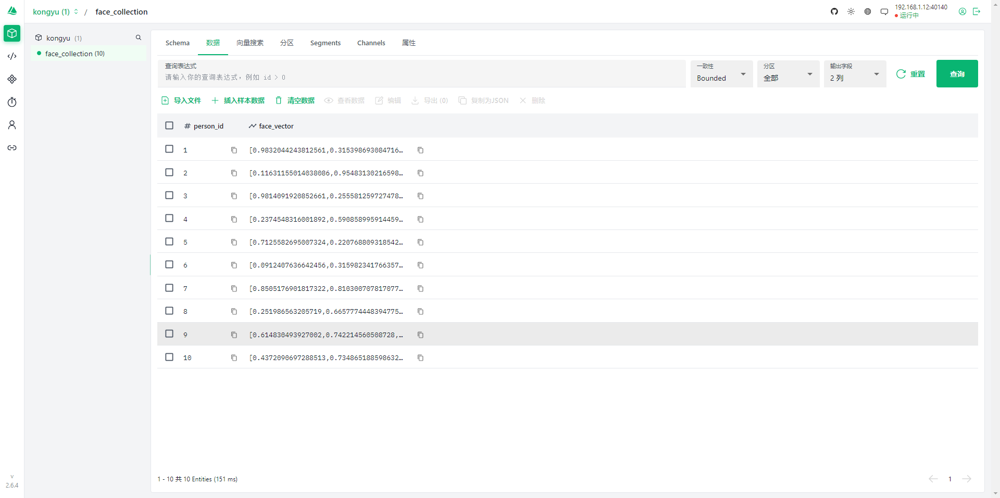

# Dromara MilvusPlus：向量数据库增强操作库

[MilvusPlus](https://gitee.com/link?target=https%3A%2F%2Fmilvus-plus.m78cloud.cn)（简称 MP）是一个 [Milvus](https://gitee.com/link?target=https%3A%2F%2Fmilvus.io) 的操作工具，旨在简化与 Milvus 向量数据库的交互，为开发者提供类似 MyBatis-Plus 注解和方法调用风格的直观 API,提高效率而生。


## 基础配置

**添加依赖**

```xml
<!-- Dromara MilvusPlus：向量数据库增强操作库 -->
<dependency>
    <groupId>org.dromara.milvus-plus</groupId>
    <artifactId>milvus-plus-boot-starter</artifactId>
    <version>2.2.5</version>
</dependency>
```

**编辑配置文件**

`application.yml`

```yaml
---
# MilvusPlus 配置
milvus:
  uri: http://192.168.1.12:40140
  # token: root:Milvus
  enable: true
  open-log: true
  db-name: kongyu
  username: root
  password: Milvus
  packages:
    - io.github.atengk.milvus.entity
```


## 快速使用

### 创建实体类

```java
package io.github.atengk.milvus.entity;

import io.milvus.v2.common.DataType;
import io.milvus.v2.common.IndexParam;
import lombok.Data;
import org.dromara.milvus.plus.annotation.ExtraParam;
import org.dromara.milvus.plus.annotation.MilvusCollection;
import org.dromara.milvus.plus.annotation.MilvusField;
import org.dromara.milvus.plus.annotation.MilvusIndex;

import java.util.List;

/**
 * 人脸向量实体
 *
 * @author Ateng
 * @since 2026-04-10
 */
@Data
@MilvusCollection(name = "face_collection") // 指定Milvus集合的名称
public class Face {
    @MilvusField(
            name = "person_id", // 字段名称
            dataType = DataType.Int64, // 数据类型为64位整数
            isPrimaryKey = true // 标记为主键
    )
    private Long personId; // 人员的唯一标识符

    @MilvusField(
            name = "face_vector", // 字段名称
            dataType = DataType.FloatVector, // 数据类型为浮点型向量
            dimension = 128 // 向量维度，假设人脸特征向量的维度是128
    )
    @MilvusIndex(
            indexType = IndexParam.IndexType.IVF_FLAT, // 使用IVF_FLAT索引类型
            metricType = IndexParam.MetricType.L2, // 使用L2距离度量类型
            indexName = "face_index", // 索引名称
            extraParams = { // 指定额外的索引参数
                    @ExtraParam(key = "nlist", value = "100") // 例如，IVF的nlist参数
            }
    )
    private List<Float> faceVector; // 存储人脸特征的向量
}
```

### 创建 Mapper

```
package io.github.atengk.milvus.mapper;

import io.github.atengk.milvus.entity.Face;
import org.dromara.milvus.plus.mapper.MilvusMapper;
import org.springframework.stereotype.Component;

/**
 * 人脸向量 Mapper
 *
 * @author Ateng
 * @since 2026-04-10
 */
@Component
public class FaceMilvusMapper extends MilvusMapper<Face> {

}
```

### 创建接口

```java
package io.github.atengk.milvus.controller;

import io.github.atengk.milvus.entity.Face;
import io.github.atengk.milvus.mapper.FaceMilvusMapper;
import lombok.RequiredArgsConstructor;
import org.springframework.web.bind.annotation.*;

import java.util.ArrayList;
import java.util.List;
import java.util.concurrent.ThreadLocalRandom;

/**
 * Milvus 向量操作接口
 *
 * @author Ateng
 * @since 2026-04-10
 */
@RestController
@RequestMapping("/milvus")
@RequiredArgsConstructor
public class MilvusController {

    private final FaceMilvusMapper faceMilvusMapper;

    /**
     * 插入测试数据
     */
    @PostMapping("/insert")
    public Object insert(@RequestParam(defaultValue = "10") int count) {

        List<Face> list = new ArrayList<>();

        for (long i = 1; i <= count; i++) {
            Face face = new Face();
            face.setPersonId(i);
            face.setFaceVector(randomVector(128));
            list.add(face);
        }

        return faceMilvusMapper.insert(list.toArray(new Face[0]));
    }

    /**
     * 向量检索
     */
    @GetMapping("/search")
    public Object search(@RequestParam(defaultValue = "3") int topK) {

        List<Float> queryVector = randomVector(128);

        return faceMilvusMapper.queryWrapper()
                .vector(Face::getFaceVector, queryVector)
                .topK(topK)
                .query();
    }

    /**
     * 生成随机向量
     */
    private List<Float> randomVector(int dimension) {
        List<Float> vector = new ArrayList<>(dimension);
        for (int i = 0; i < dimension; i++) {
            vector.add(ThreadLocalRandom.current().nextFloat());
        }
        return vector;
    }
}
```


