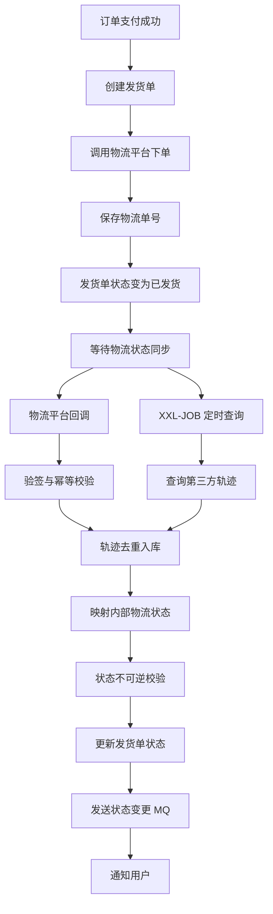

# 物流轨迹 / 状态同步

本案例围绕“创建发货单、调用物流平台下单、保存物流单号、定时查询物流轨迹、接收物流回调、更新物流状态、通知用户物流变化”这一完整链路展开，重点处理物流状态映射、回调幂等、轨迹去重、定时补偿和多物流渠道适配等问题。

## 功能概述

物流轨迹 / 状态同步模块主要用于电商、仓储、供应链、售后寄修等业务中，对接第三方物流平台并维护系统内部的发货状态、物流状态和轨迹明细。该模块不是简单保存快递单号，而是要保证物流状态在第三方平台、订单系统、通知系统之间最终一致。

### 业务场景

在电商或供应链系统中，用户支付订单后，仓库完成拣货、打包、出库，系统需要创建发货单并调用物流平台下单。物流平台返回运单号后，系统保存运单信息，并持续同步物流轨迹。

常见业务场景包括：

| 场景         | 说明                                           |
| ------------ | ---------------------------------------------- |
| 电商订单发货 | 订单支付后创建发货单，物流状态变化后同步给用户 |
| 售后寄修     | 用户寄回商品，平台同步寄修物流轨迹             |
| 仓储出库     | WMS 出库后推送物流信息到订单系统               |
| 样品寄送     | 业务人员创建样品寄送单，系统跟踪签收状态       |
| 设备发货     | IoT、硬件设备发货后跟踪运输状态                |

本案例以“订单发货”为主场景实现：

```text
订单支付成功
-> 创建发货单
-> 调用物流平台下单
-> 保存物流单号
-> 同步物流轨迹
-> 更新物流状态
-> 推送物流变更通知
-> 订单进入已签收 / 已完成
```

### 核心流程

模块核心流程分为三条链路：发货链路、轨迹同步链路、回调处理链路。

发货链路负责从业务系统创建发货单，并向第三方物流平台下单：

```text
业务系统提交发货请求
-> 校验订单是否允许发货
-> 创建系统发货单
-> 调用物流平台下单
-> 获取物流单号
-> 更新发货单为已发货
-> 发送物流状态变更消息
```

轨迹同步链路负责定时补偿第三方物流轨迹，避免回调丢失：

```text
XXL-JOB 定时扫描运输中发货单
-> 调用物流平台查询轨迹
-> 解析第三方轨迹节点
-> 轨迹明细去重入库
-> 映射内部物流状态
-> 更新发货单最新状态
-> 发送物流状态变更消息
```

回调处理链路负责接收第三方物流平台主动推送：

```text
物流平台推送轨迹回调
-> 验证回调签名
-> 记录回调日志
-> 判断回调是否重复
-> 解析物流状态和轨迹节点
-> 更新发货单状态
-> 写入轨迹明细
-> 发送用户通知
```

整体处理流程如下：



### 实现目标

本案例实现物流状态同步的核心能力，不追求完整商业物流平台能力，重点落在后端业务建模和稳定性处理。

需要实现的核心能力：

| 能力       | 实现目标                                     |
| ---------- | -------------------------------------------- |
| 发货单创建 | 支持业务系统创建发货单，并保存收发件信息     |
| 物流下单   | 通过统一接口调用第三方物流平台，返回物流单号 |
| 轨迹查询   | 支持根据物流单号主动查询物流轨迹             |
| 回调接收   | 支持接收第三方物流平台状态回调               |
| 状态映射   | 将第三方物流状态转换为系统内部标准状态       |
| 轨迹去重   | 同一个物流节点重复推送时不重复入库           |
| 回调幂等   | 第三方重复回调时不会重复更新业务状态         |
| 定时补偿   | 回调丢失或接口异常时，通过定时任务主动补偿   |
| 状态不可逆 | 已签收、已取消等终态不能被低优先级状态覆盖   |
| 消息通知   | 物流状态变化后发送 MQ，供通知系统消费        |

内部物流状态建议控制在少量、稳定、通用的状态，不直接把第三方所有状态暴露给业务系统：

| 内部状态     | 说明                 |
| ------------ | -------------------- |
| CREATED      | 已创建发货单，未下单 |
| ORDERED      | 已向物流平台下单     |
| SHIPPED      | 已揽收 / 已发出      |
| TRANSPORTING | 运输中               |
| DELIVERING   | 派送中               |
| SIGNED       | 已签收               |
| EXCEPTION    | 物流异常             |
| CANCELED     | 已取消               |

## 技术栈选型

本案例基于 Spring Boot 3 单体后端项目实现，保留后续拆分为微服务的扩展空间。物流对接模块天然涉及第三方接口调用、异步消息、定时补偿和幂等处理，因此技术栈重点围绕“稳定调用、可靠同步、可补偿、可扩展”来选择。

### 后端基础技术

后端基础技术用于完成接口、业务逻辑、数据库访问、参数校验和统一返回。

| 技术                       | 用途                                       |
| -------------------------- | ------------------------------------------ |
| Spring Boot 3              | 项目基础框架                               |
| Spring Web                 | 提供 REST API 和物流回调接口               |
| Validation                 | 请求参数校验                               |
| MyBatis-Plus               | 发货单、轨迹、回调日志表 CRUD              |
| MySQL 8                    | 保存发货单、物流轨迹、回调日志             |
| Lombok                     | 简化实体类和 DTO 样板代码                  |
| Hutool                     | JSON、日期、签名、字符串、集合等工具处理   |
| Sa-Token / Spring Security | 对后台接口做认证授权，回调接口使用签名校验 |

推荐基础依赖方向：

```text
spring-boot-starter-web
spring-boot-starter-validation
mybatis-plus-spring-boot3-starter
mysql-connector-j
lombok
hutool-all
sa-token-spring-boot3-starter
```

其中 Hutool 在本案例中主要用于：

| Hutool 工具           | 使用位置                     |
| --------------------- | ---------------------------- |
| JSONUtil              | 第三方响应解析、回调原文保存 |
| DateUtil              | 轨迹时间解析、同步时间处理   |
| StrUtil               | 参数判空、物流单号处理       |
| CollUtil              | 轨迹节点集合判断             |
| SecureUtil / SignUtil | 第三方回调验签、请求签名     |
| IdUtil                | 生成业务请求号、幂等号       |

### 第三方物流对接技术

第三方物流对接主要解决“如何稳定调用外部接口”和“如何屏蔽不同物流渠道差异”。

| 技术                         | 用途                                     |
| ---------------------------- | ---------------------------------------- |
| OpenFeign                    | 声明式调用第三方物流接口                 |
| Resilience4j                 | 超时、重试、熔断、限流                   |
| Hutool JSONUtil              | 处理第三方 JSON 请求和响应               |
| Hutool SignUtil / SecureUtil | 生成请求签名、验证回调签名               |
| 统一 Adapter 接口            | 屏蔽顺丰、中通、圆通、京东物流等渠道差异 |

物流平台通常存在这些不稳定因素：

```text
接口偶发超时
接口返回成功但回调延迟
回调重复推送
轨迹节点乱序
第三方状态码不统一
同一个状态在不同渠道含义不同
```

因此本案例不建议业务代码直接调用具体物流平台 Client，而是增加一层物流渠道适配器：

```text
业务 Service
-> LogisticsChannelAdapter 统一接口
-> SfLogisticsAdapter / MockLogisticsAdapter / JdLogisticsAdapter
-> OpenFeign Client
-> 第三方物流平台
```

后续代码会按这个结构实现，便于新增物流渠道时只扩展适配器，不改主业务流程。

### 异步与补偿技术

物流状态同步不能完全依赖第三方回调。实际项目中，第三方回调可能延迟、重复、丢失，甚至因为网络或签名配置异常导致失败。因此本案例采用“回调为主，定时补偿为辅，MQ 解耦通知”的方案。

| 技术           | 用途                                       |
| -------------- | ------------------------------------------ |
| RabbitMQ       | 物流状态变更后异步通知订单系统、站内信系统 |
| XXL-JOB        | 定时扫描运输中的发货单，主动查询轨迹补偿   |
| Redis          | 幂等 Key、短期去重、分布式锁               |
| Redisson       | 防止同一物流单并发同步                     |
| MySQL 唯一索引 | 保证轨迹节点、回调事件最终不重复           |
| 本地事务       | 保证发货单状态和轨迹明细同时更新           |

异步补偿整体策略：

```text
第三方回调成功
-> 实时处理物流状态
-> 写入轨迹明细
-> 发送 MQ 通知

第三方回调丢失
-> XXL-JOB 扫描待同步发货单
-> 主动查询第三方轨迹
-> 补偿写入轨迹明细
-> 更新最新物流状态

第三方重复回调
-> Redis 幂等 Key 拦截
-> MySQL 唯一索引兜底
-> 不重复更新状态，不重复发送通知
```

Redis 幂等 Key 设计建议：

| 场景         | Key 示例                                 | 过期时间 |
| ------------ | ---------------------------------------- | -------- |
| 发货请求幂等 | `logistics:ship:request:{bizOrderNo}`    | 24 小时  |
| 回调事件幂等 | `logistics:callback:{channel}:{eventId}` | 7 天     |
| 物流同步锁   | `logistics:sync:lock:{trackingNo}`       | 5 分钟   |
| MQ 消费幂等  | `logistics:mq:consume:{messageId}`       | 7 天     |

数据库层面仍然需要唯一索引兜底，不能只依赖 Redis：

```text
发货单表：biz_order_no 唯一
轨迹表：tracking_no + trace_time + status_code 唯一
回调日志表：channel_code + callback_event_id 唯一
```

最终实现目标是：

```text
回调能实时处理
重复回调不会污染数据
定时任务能补偿漏同步
轨迹明细不会重复入库
终态不会被旧状态覆盖
状态变化可以可靠通知下游系统
```

## 表结构设计

本模块至少需要三张核心表：物流发货单表、物流轨迹明细表、物流回调日志表。发货单保存当前最新物流状态，轨迹明细表保存物流过程节点，回调日志表用于回调原文留存和幂等处理。该设计对应文档中“保存物流单号、定时查询物流轨迹、接收物流回调、更新物流状态”的核心流程。

### 物流发货单表

物流发货单表是主表，用于保存业务订单与物流单之间的绑定关系。系统后续所有轨迹查询、状态同步、用户通知，都会基于这张表进行。

建议表名：`logistics_shipment`

该 SQL 用于创建物流发货单主表，保存业务单号、物流渠道、运单号、收发件信息和当前物流状态。

```sql
CREATE TABLE logistics_shipment (
    id BIGINT NOT NULL AUTO_INCREMENT COMMENT '主键ID',

    shipment_no VARCHAR(64) NOT NULL COMMENT '系统发货单号',
    biz_order_no VARCHAR(64) NOT NULL COMMENT '业务订单号',
    channel_code VARCHAR(32) NOT NULL COMMENT '物流渠道编码，如 SF、YD、ZTO、MOCK',
    tracking_no VARCHAR(64) DEFAULT NULL COMMENT '物流运单号',

    sender_name VARCHAR(64) NOT NULL COMMENT '寄件人姓名',
    sender_mobile VARCHAR(32) NOT NULL COMMENT '寄件人手机号',
    sender_address VARCHAR(255) NOT NULL COMMENT '寄件人地址',

    receiver_name VARCHAR(64) NOT NULL COMMENT '收件人姓名',
    receiver_mobile VARCHAR(32) NOT NULL COMMENT '收件人手机号',
    receiver_address VARCHAR(255) NOT NULL COMMENT '收件人地址',

    shipment_status VARCHAR(32) NOT NULL COMMENT '发货单状态：CREATED、ORDERED、CANCELED',
    logistics_status VARCHAR(32) NOT NULL COMMENT '物流状态：CREATED、SHIPPED、TRANSPORTING、DELIVERING、SIGNED、EXCEPTION、CANCELED',

    last_trace_content VARCHAR(500) DEFAULT NULL COMMENT '最新轨迹内容',
    last_trace_time DATETIME DEFAULT NULL COMMENT '最新轨迹时间',
    last_sync_time DATETIME DEFAULT NULL COMMENT '最近一次同步时间',

    sync_retry_count INT NOT NULL DEFAULT 0 COMMENT '同步重试次数',
    version INT NOT NULL DEFAULT 0 COMMENT '乐观锁版本号',

    create_time DATETIME NOT NULL DEFAULT CURRENT_TIMESTAMP COMMENT '创建时间',
    update_time DATETIME NOT NULL DEFAULT CURRENT_TIMESTAMP ON UPDATE CURRENT_TIMESTAMP COMMENT '更新时间',
    deleted TINYINT NOT NULL DEFAULT 0 COMMENT '逻辑删除：0-未删除，1-已删除',

    PRIMARY KEY (id),
    UNIQUE KEY uk_shipment_no (shipment_no),
    UNIQUE KEY uk_biz_order_no (biz_order_no),
    UNIQUE KEY uk_tracking_no (tracking_no),
    KEY idx_channel_status (channel_code, logistics_status),
    KEY idx_last_sync_time (last_sync_time),
    KEY idx_create_time (create_time)
) ENGINE=InnoDB DEFAULT CHARSET=utf8mb4 COMMENT='物流发货单表';
```

关键设计说明：

| 字段                 | 说明                                           |
| -------------------- | ---------------------------------------------- |
| `shipment_no`        | 系统内部发货单号，建议用业务编号生成器生成     |
| `biz_order_no`       | 业务订单号，设置唯一索引，避免一个订单重复发货 |
| `channel_code`       | 物流渠道编码，用于多物流渠道适配               |
| `tracking_no`        | 第三方物流平台返回的运单号                     |
| `shipment_status`    | 发货单自身状态，描述系统下单过程               |
| `logistics_status`   | 物流运输状态，描述包裹流转过程                 |
| `last_trace_content` | 最新物流轨迹，便于列表页快速展示               |
| `last_sync_time`     | 定时任务补偿扫描时使用                         |
| `sync_retry_count`   | 第三方接口异常时记录重试次数                   |
| `version`            | 乐观锁字段，防止并发状态覆盖                   |

这里把 `shipment_status` 和 `logistics_status` 分开，是为了避免“发货单下单状态”和“包裹运输状态”混在一起。比如物流平台已经成功下单，但包裹还没有揽收，此时发货单状态可以是 `ORDERED`，物流状态仍然是 `CREATED`。

### 物流轨迹明细表

物流轨迹明细表保存每一个物流流转节点。第三方平台可能重复推送同一个节点，因此轨迹表必须通过唯一索引做最终去重。

建议表名：`logistics_trace`

该 SQL 用于创建物流轨迹明细表，每条记录对应一个物流轨迹节点。

```sql
CREATE TABLE logistics_trace (
    id BIGINT NOT NULL AUTO_INCREMENT COMMENT '主键ID',

    shipment_no VARCHAR(64) NOT NULL COMMENT '系统发货单号',
    tracking_no VARCHAR(64) NOT NULL COMMENT '物流运单号',
    channel_code VARCHAR(32) NOT NULL COMMENT '物流渠道编码',

    third_status_code VARCHAR(64) NOT NULL COMMENT '第三方物流状态编码',
    third_status_name VARCHAR(128) DEFAULT NULL COMMENT '第三方物流状态名称',
    logistics_status VARCHAR(32) NOT NULL COMMENT '系统内部物流状态',

    trace_content VARCHAR(500) NOT NULL COMMENT '轨迹内容',
    trace_location VARCHAR(128) DEFAULT NULL COMMENT '轨迹发生地点',
    trace_time DATETIME NOT NULL COMMENT '轨迹发生时间',

    source_type VARCHAR(32) NOT NULL COMMENT '来源类型：CALLBACK-回调，JOB-定时查询，MANUAL-手动同步',
    raw_content JSON DEFAULT NULL COMMENT '第三方轨迹节点原始内容',

    create_time DATETIME NOT NULL DEFAULT CURRENT_TIMESTAMP COMMENT '创建时间',

    PRIMARY KEY (id),
    UNIQUE KEY uk_tracking_trace (tracking_no, trace_time, third_status_code),
    KEY idx_shipment_no (shipment_no),
    KEY idx_tracking_no (tracking_no),
    KEY idx_trace_time (trace_time)
) ENGINE=InnoDB DEFAULT CHARSET=utf8mb4 COMMENT='物流轨迹明细表';
```

关键设计说明：

| 字段                | 说明                                   |
| ------------------- | -------------------------------------- |
| `third_status_code` | 第三方原始状态码，用于排查渠道问题     |
| `logistics_status`  | 系统内部标准状态，用于业务判断         |
| `trace_content`     | 展示给用户看的物流轨迹内容             |
| `trace_time`        | 轨迹真实发生时间，不是入库时间         |
| `source_type`       | 区分轨迹来自回调、定时任务还是人工同步 |
| `raw_content`       | 保存原始节点，便于问题追踪             |

唯一索引建议使用：

```sql
UNIQUE KEY uk_tracking_trace (tracking_no, trace_time, third_status_code)
```

这个唯一索引用于解决以下问题：

```text
第三方重复回调同一个轨迹节点
XXL-JOB 查询到已经由回调写入的节点
人工同步和自动同步同时写入同一个节点
```

如果某些物流平台的 `trace_time` 精度不够，可以扩展一个 `trace_hash` 字段，用 Hutool 的 `SecureUtil.md5()` 根据 `trackingNo + statusCode + traceTime + traceContent` 生成摘要，再对 `tracking_no + trace_hash` 建唯一索引。

### 物流回调日志表

物流回调日志表用于记录第三方物流平台每一次回调请求。它不只用于排查问题，也用于回调幂等控制。

建议表名：`logistics_callback_log`

该 SQL 用于创建物流回调日志表，保存回调事件号、签名校验结果、处理状态和回调原文。

```sql
CREATE TABLE logistics_callback_log (
    id BIGINT NOT NULL AUTO_INCREMENT COMMENT '主键ID',

    channel_code VARCHAR(32) NOT NULL COMMENT '物流渠道编码',
    callback_event_id VARCHAR(128) NOT NULL COMMENT '第三方回调事件ID',
    tracking_no VARCHAR(64) DEFAULT NULL COMMENT '物流运单号',
    shipment_no VARCHAR(64) DEFAULT NULL COMMENT '系统发货单号',

    request_header JSON DEFAULT NULL COMMENT '回调请求头',
    request_body JSON NOT NULL COMMENT '回调请求体',
    sign_valid TINYINT NOT NULL DEFAULT 0 COMMENT '签名是否有效：0-无效，1-有效',

    handle_status VARCHAR(32) NOT NULL COMMENT '处理状态：INIT、SUCCESS、FAILED、IGNORED',
    error_msg VARCHAR(500) DEFAULT NULL COMMENT '异常信息',

    receive_time DATETIME NOT NULL DEFAULT CURRENT_TIMESTAMP COMMENT '接收时间',
    handle_time DATETIME DEFAULT NULL COMMENT '处理时间',

    create_time DATETIME NOT NULL DEFAULT CURRENT_TIMESTAMP COMMENT '创建时间',
    update_time DATETIME NOT NULL DEFAULT CURRENT_TIMESTAMP ON UPDATE CURRENT_TIMESTAMP COMMENT '更新时间',

    PRIMARY KEY (id),
    UNIQUE KEY uk_channel_event (channel_code, callback_event_id),
    KEY idx_tracking_no (tracking_no),
    KEY idx_handle_status (handle_status),
    KEY idx_receive_time (receive_time)
) ENGINE=InnoDB DEFAULT CHARSET=utf8mb4 COMMENT='物流回调日志表';
```

关键设计说明：

| 字段                | 说明                       |
| ------------------- | -------------------------- |
| `callback_event_id` | 第三方回调事件号，用于幂等 |
| `request_body`      | 保存完整回调原文           |
| `sign_valid`        | 标记签名是否合法           |
| `handle_status`     | 标记回调处理结果           |
| `error_msg`         | 处理失败时记录错误原因     |
| `handle_time`       | 回调实际处理完成时间       |

回调日志的处理状态建议如下：

| 状态      | 说明                       |
| --------- | -------------------------- |
| `INIT`    | 已接收，待处理             |
| `SUCCESS` | 已成功处理                 |
| `FAILED`  | 处理失败，可人工排查或补偿 |
| `IGNORED` | 重复回调或无效回调，已忽略 |

回调处理时的推荐顺序：

```text
保存回调日志
-> 验签
-> 判断 callback_event_id 是否重复
-> 查询发货单
-> 解析轨迹
-> 更新物流状态
-> 更新回调日志处理结果
```

## 状态模型设计

物流状态同步的核心不是简单覆盖状态，而是要控制状态流转方向。尤其是“已签收”“已取消”这类终态，不能被第三方延迟推送的旧状态覆盖。

### 发货单状态

发货单状态描述的是系统和物流平台之间的下单过程，不等同于包裹运输状态。

建议枚举：`ShipmentStatusEnum`

| 状态       | 说明                             | 是否终态 |
| ---------- | -------------------------------- | -------- |
| `CREATED`  | 已创建发货单，未调用物流平台下单 | 否       |
| `ORDERING` | 正在调用物流平台下单             | 否       |
| `ORDERED`  | 已成功下单，已获得物流单号       | 否       |
| `FAILED`   | 物流下单失败                     | 否       |
| `CANCELED` | 发货单已取消                     | 是       |

发货单状态流转：

```text
CREATED
-> ORDERING
-> ORDERED
```

异常流转：

```text
CREATED / ORDERING
-> FAILED
```

取消流转：

```text
CREATED / FAILED
-> CANCELED
```

不建议允许以下流转：

```text
ORDERED -> CREATED
ORDERED -> FAILED
CANCELED -> ORDERED
```

原因是 `ORDERED` 代表物流平台已经生成运单号，不能再回退为未下单。如果确实需要取消，应走物流平台取消接口，并更新为 `CANCELED`。

### 物流状态映射

物流状态描述包裹实际运输过程。由于不同物流平台状态码不统一，系统内部必须维护一套标准状态。

建议枚举：`LogisticsStatusEnum`

| 内部状态       | 状态等级 | 说明            | 是否终态 |
| -------------- | -------- | --------------- | -------- |
| `CREATED`      | 10       | 已创建，未揽收  | 否       |
| `SHIPPED`      | 20       | 已揽收 / 已发出 | 否       |
| `TRANSPORTING` | 30       | 运输中          | 否       |
| `DELIVERING`   | 40       | 派送中          | 否       |
| `SIGNED`       | 50       | 已签收          | 是       |
| `EXCEPTION`    | 60       | 物流异常        | 否       |
| `CANCELED`     | 70       | 已取消          | 是       |

第三方状态映射示例：

| 物流渠道 | 第三方状态码 | 第三方含义 | 内部状态       |
| -------- | ------------ | ---------- | -------------- |
| `MOCK`   | `CREATED`    | 已创建运单 | `CREATED`      |
| `MOCK`   | `PICKED`     | 已揽收     | `SHIPPED`      |
| `MOCK`   | `IN_TRANSIT` | 运输中     | `TRANSPORTING` |
| `MOCK`   | `DELIVERING` | 派送中     | `DELIVERING`   |
| `MOCK`   | `SIGNED`     | 已签收     | `SIGNED`       |
| `MOCK`   | `EXCEPTION`  | 运输异常   | `EXCEPTION`    |
| `MOCK`   | `CANCELED`   | 已取消     | `CANCELED`     |

建议在代码中维护一个映射组件，而不是把映射逻辑散落在业务代码中：

```text
第三方状态码
-> LogisticsStatusMapping
-> 系统内部物流状态
-> 状态流转校验
-> 更新发货单
```

物流状态流转建议：

```text
CREATED
-> SHIPPED
-> TRANSPORTING
-> DELIVERING
-> SIGNED
```

异常状态允许从运输过程进入：

```text
SHIPPED / TRANSPORTING / DELIVERING
-> EXCEPTION
```

异常恢复后可以继续流转：

```text
EXCEPTION
-> TRANSPORTING
-> DELIVERING
-> SIGNED
```

取消状态通常只允许在未签收前进入：

```text
CREATED / SHIPPED / TRANSPORTING / DELIVERING / EXCEPTION
-> CANCELED
```

### 状态不可逆控制

第三方物流接口存在延迟推送、乱序推送、重复推送的问题，因此状态更新必须做不可逆控制。

核心原则：

```text
终态不可回退
低等级状态不能覆盖高等级状态
相同状态可以更新最新轨迹
异常状态允许恢复
取消状态不允许恢复
```

建议使用状态等级进行判断：

| 当前状态       | 新状态         | 是否允许 | 说明                 |
| -------------- | -------------- | -------- | -------------------- |
| `TRANSPORTING` | `DELIVERING`   | 是       | 正常向前流转         |
| `DELIVERING`   | `TRANSPORTING` | 否       | 旧状态不能覆盖新状态 |
| `SIGNED`       | `DELIVERING`   | 否       | 已签收不能回退       |
| `SIGNED`       | `EXCEPTION`    | 否       | 已签收不能变异常     |
| `EXCEPTION`    | `TRANSPORTING` | 是       | 异常恢复后继续运输   |
| `CANCELED`     | `TRANSPORTING` | 否       | 已取消不能恢复       |
| `DELIVERING`   | `SIGNED`       | 是       | 正常签收             |
| `TRANSPORTING` | `EXCEPTION`    | 是       | 运输中可进入异常     |

状态不可逆控制伪代码：

```text
如果当前状态是 SIGNED 或 CANCELED：
    拒绝更新

如果新状态是 EXCEPTION：
    允许 CREATED、SHIPPED、TRANSPORTING、DELIVERING 进入异常

如果当前状态是 EXCEPTION：
    允许恢复到 TRANSPORTING、DELIVERING、SIGNED

如果新状态等级 >= 当前状态等级：
    允许更新

否则：
    拒绝更新
```

后续 Java 实现中建议在枚举类里封装判断逻辑，例如：

```text
LogisticsStatusEnum.canTransferTo(newStatus)
```

这样 Service 层只需要调用状态机方法，不需要写大量 `if else`。

## 项目代码结构

本案例采用典型 Spring Boot 分层结构，重点突出物流业务链路，不引入过重的工程封装。后续实现时，可以直接按下面的目录创建文件。

推荐基础包名：

```text
io.github.atengk.logistics
```

整体代码结构：

```text
src/main/java/io/github/atengk/logistics
├── LogisticsApplication.java
├── client
│   ├── LogisticsClient.java
│   ├── MockLogisticsClient.java
│   └── dto
│       ├── LogisticsCreateOrderRequest.java
│       ├── LogisticsCreateOrderResponse.java
│       ├── LogisticsQueryTraceRequest.java
│       └── LogisticsQueryTraceResponse.java
├── config
│   ├── RabbitMqConfig.java
│   └── RedissonConfig.java
├── controller
│   ├── LogisticsCallbackController.java
│   └── LogisticsShipmentController.java
├── entity
│   ├── LogisticsCallbackLog.java
│   ├── LogisticsShipment.java
│   └── LogisticsTrace.java
├── enums
│   ├── CallbackHandleStatusEnum.java
│   ├── LogisticsChannelEnum.java
│   ├── LogisticsSourceTypeEnum.java
│   ├── LogisticsStatusEnum.java
│   └── ShipmentStatusEnum.java
├── mapper
│   ├── LogisticsCallbackLogMapper.java
│   ├── LogisticsShipmentMapper.java
│   └── LogisticsTraceMapper.java
├── mq
│   ├── LogisticsMqConstant.java
│   ├── LogisticsStatusChangedConsumer.java
│   └── LogisticsStatusChangedMessage.java
├── service
│   ├── LogisticsCallbackService.java
│   ├── LogisticsShipmentService.java
│   ├── LogisticsSyncService.java
│   └── impl
│       ├── LogisticsCallbackServiceImpl.java
│       ├── LogisticsShipmentServiceImpl.java
│       └── LogisticsSyncServiceImpl.java
├── adapter
│   ├── LogisticsChannelAdapter.java
│   ├── LogisticsChannelAdapterFactory.java
│   └── impl
│       └── MockLogisticsChannelAdapter.java
├── job
│   └── LogisticsSyncJob.java
└── web
    ├── dto
    │   ├── CreateShipmentRequest.java
    │   ├── LogisticsCallbackRequest.java
    │   └── ManualSyncRequest.java
    └── vo
        ├── LogisticsShipmentVO.java
        └── LogisticsTraceVO.java
```

### controller 接口层

`controller` 层负责对外提供 HTTP 接口，只做参数接收、参数校验和结果返回，不写复杂业务逻辑。

核心类：

| 类名                          | 作用                                 |
| ----------------------------- | ------------------------------------ |
| `LogisticsShipmentController` | 发货单创建、查询、手动同步、轨迹查询 |
| `LogisticsCallbackController` | 接收第三方物流平台回调               |

建议接口设计：

| 接口                                           | 方法   | 说明                     |
| ---------------------------------------------- | ------ | ------------------------ |
| `/api/logistics/shipments`                     | `POST` | 创建发货单并调用物流下单 |
| `/api/logistics/shipments/{shipmentNo}`        | `GET`  | 查询发货单详情           |
| `/api/logistics/shipments/{shipmentNo}/traces` | `GET`  | 查询物流轨迹             |
| `/api/logistics/shipments/manual-sync`         | `POST` | 手动同步物流轨迹         |
| `/api/logistics/callback/{channelCode}`        | `POST` | 接收物流平台回调         |

控制层注意事项：

```text
后台业务接口需要登录鉴权
第三方回调接口不走登录鉴权
回调接口必须做签名校验
Controller 不直接操作 Mapper
Controller 不直接调用第三方 Client
```

### service 业务层

`service` 层负责核心业务编排，是本模块最重要的一层。创建发货单、物流下单、回调处理、状态更新、轨迹去重、消息发送，都应该在 Service 层完成。

核心接口：

| 接口                       | 作用                                 |
| -------------------------- | ------------------------------------ |
| `LogisticsShipmentService` | 发货单创建、发货单查询、轨迹查询     |
| `LogisticsCallbackService` | 回调验签、回调日志记录、回调处理     |
| `LogisticsSyncService`     | 主动查询物流轨迹、状态同步、定时补偿 |

核心实现类：

| 实现类                         | 作用                         |
| ------------------------------ | ---------------------------- |
| `LogisticsShipmentServiceImpl` | 创建发货单并调用物流平台下单 |
| `LogisticsCallbackServiceImpl` | 处理第三方物流回调           |
| `LogisticsSyncServiceImpl`     | 同步物流轨迹并更新状态       |

Service 层职责边界：

```text
创建发货单：
校验业务单是否重复
-> 生成发货单号
-> 写入 logistics_shipment
-> 调用 LogisticsChannelAdapter 下单
-> 更新 tracking_no 和 shipment_status

同步轨迹：
查询发货单
-> 加分布式锁
-> 调用 LogisticsChannelAdapter 查询轨迹
-> 轨迹节点去重入库
-> 计算最新物流状态
-> 状态不可逆校验
-> 更新 logistics_shipment
-> 发送 MQ 通知

处理回调：
保存回调日志
-> 验签
-> 幂等校验
-> 解析回调内容
-> 调用 LogisticsSyncService 更新状态
-> 更新回调处理结果
```

### client 第三方物流客户端

`client` 层用于封装第三方物流平台的 HTTP 调用。业务代码不直接依赖具体物流平台接口，而是通过 `adapter` 层做适配。

核心类：

| 类名                           | 作用                 |
| ------------------------------ | -------------------- |
| `LogisticsClient`              | 第三方物流接口抽象   |
| `MockLogisticsClient`          | 本地模拟物流平台实现 |
| `LogisticsCreateOrderRequest`  | 第三方物流下单请求   |
| `LogisticsCreateOrderResponse` | 第三方物流下单响应   |
| `LogisticsQueryTraceRequest`   | 第三方轨迹查询请求   |
| `LogisticsQueryTraceResponse`  | 第三方轨迹查询响应   |

实际项目中，如果对接真实物流平台，可以替换为：

```text
SfLogisticsFeignClient
JdLogisticsFeignClient
KdnLogisticsFeignClient
CainiaoLogisticsFeignClient
```

推荐调用链路：

```text
Service
-> LogisticsChannelAdapter
-> MockLogisticsChannelAdapter
-> MockLogisticsClient
```

这样做的好处：

```text
Service 不感知第三方字段
不同物流渠道可以独立扩展
本地开发可以使用 Mock 渠道
真实渠道异常时便于降级处理
```

### mapper 数据访问层

`mapper` 层使用 MyBatis-Plus 完成基础 CRUD 和少量条件更新。复杂业务判断不要放在 Mapper 中。

核心 Mapper：

| Mapper                       | 对应表                   |
| ---------------------------- | ------------------------ |
| `LogisticsShipmentMapper`    | `logistics_shipment`     |
| `LogisticsTraceMapper`       | `logistics_trace`        |
| `LogisticsCallbackLogMapper` | `logistics_callback_log` |

Mapper 层建议保留的能力：

```text
根据发货单号查询发货单
根据业务订单号查询发货单
根据运单号查询发货单
查询运输中待同步发货单
批量查询物流轨迹
乐观锁更新发货单状态
```

不建议在 Mapper 层处理：

```text
物流状态映射
状态是否允许流转
第三方接口异常重试
MQ 消息发送
回调验签
```

这些逻辑应该放在 Service、Adapter 或独立组件中。

### mq 消息处理层

`mq` 层用于处理物流状态变化后的异步通知。本案例中，发货单状态更新成功后，发送一条物流状态变更消息，后续可以由通知系统、订单系统、售后系统消费。

核心类：

| 类名                             | 作用                         |
| -------------------------------- | ---------------------------- |
| `LogisticsMqConstant`            | 定义交换机、队列、RoutingKey |
| `LogisticsStatusChangedMessage`  | 物流状态变更消息体           |
| `LogisticsStatusChangedConsumer` | 示例消费者，可模拟用户通知   |

消息内容建议：

```json
{
  "messageId": "LOGISTICS_202605151200001",
  "shipmentNo": "SHIP202605150001",
  "bizOrderNo": "ORDER202605150001",
  "trackingNo": "SF1234567890",
  "oldStatus": "TRANSPORTING",
  "newStatus": "DELIVERING",
  "traceContent": "快件正在派送中",
  "traceTime": "2026-05-15 12:00:00"
}
```

发送 MQ 的时机：

```text
发货单物流状态发生变化后发送
相同状态重复回调不发送
低等级状态被拒绝更新时不发送
轨迹新增但状态不变时可按业务需要决定是否发送
```

实际项目中，建议为消费者增加幂等控制：

```text
Redis Key:
logistics:mq:consume:{messageId}

处理策略:
setIfAbsent 成功 -> 正常消费
setIfAbsent 失败 -> 重复消息，直接确认
```

### job 定时补偿层

`job` 层用于处理第三方回调丢失、接口异常、系统短暂不可用等问题。物流同步不能只依赖回调，必须保留主动查询补偿能力。

核心类：

| 类名               | 作用                                       |
| ------------------ | ------------------------------------------ |
| `LogisticsSyncJob` | XXL-JOB 定时任务，扫描并同步运输中的发货单 |

定时任务扫描条件建议：

```text
shipment_status = ORDERED
logistics_status IN (CREATED, SHIPPED, TRANSPORTING, DELIVERING, EXCEPTION)
last_sync_time IS NULL OR last_sync_time <= 当前时间 - 30分钟
sync_retry_count < 10
deleted = 0
```

定时任务处理流程：

```text
查询待同步发货单
-> 遍历发货单
-> 按 tracking_no 加分布式锁
-> 调用物流轨迹查询接口
-> 写入新增轨迹
-> 更新最新物流状态
-> 记录 last_sync_time
-> 异常时增加 sync_retry_count
```

建议同步频率：

| 物流状态       | 同步频率   |
| -------------- | ---------- |
| `CREATED`      | 每 10 分钟 |
| `SHIPPED`      | 每 30 分钟 |
| `TRANSPORTING` | 每 1 小时  |
| `DELIVERING`   | 每 10 分钟 |
| `EXCEPTION`    | 每 30 分钟 |
| `SIGNED`       | 不再同步   |
| `CANCELED`     | 不再同步   |

如果项目暂时没有接入 XXL-JOB，也可以先使用 Spring `@Scheduled` 实现，后续再替换为 XXL-JOB。核心是同步逻辑必须写在 `LogisticsSyncService` 中，不要直接堆在 Job 类里。

## 核心功能实现

核心功能围绕发货单主流程、第三方物流平台交互、轨迹同步、回调处理和状态变更通知展开。实现时建议把“物流下单”和“物流轨迹同步”拆开处理，避免第三方接口异常影响主业务链路。该章节对应原始功能中的“创建发货单、调用物流平台下单、保存物流单号、定时查询物流轨迹、接收物流回调、更新物流状态、通知用户物流变化”。

### 创建发货单

创建发货单的核心目标是：业务订单只能创建一次发货单，发货单创建成功后再调用物流平台下单。这里使用 `bizOrderNo` 做业务幂等，数据库唯一索引作为最终兜底。

创建发货单请求对象放在 `web/dto` 目录中，用于接收订单系统或后台发货页面提交的发货请求。

文件位置：`src/main/java/io/github/atengk/logistics/web/dto/CreateShipmentRequest.java`

```java
package io.github.atengk.logistics.web.dto;

import jakarta.validation.constraints.NotBlank;
import lombok.Data;

/**
 * 创建发货单请求
 *
 * @author Ateng
 * @since 2026-05-15
 */
@Data
public class CreateShipmentRequest {

    @NotBlank(message = "业务订单号不能为空")
    private String bizOrderNo;

    @NotBlank(message = "物流渠道不能为空")
    private String channelCode;

    @NotBlank(message = "寄件人姓名不能为空")
    private String senderName;

    @NotBlank(message = "寄件人手机号不能为空")
    private String senderMobile;

    @NotBlank(message = "寄件人地址不能为空")
    private String senderAddress;

    @NotBlank(message = "收件人姓名不能为空")
    private String receiverName;

    @NotBlank(message = "收件人手机号不能为空")
    private String receiverMobile;

    @NotBlank(message = "收件人地址不能为空")
    private String receiverAddress;
}
```

发货单实体类对应 `logistics_shipment` 表，用于保存发货单主数据和最新物流状态。

文件位置：`src/main/java/io/github/atengk/logistics/entity/LogisticsShipment.java`

```java
package io.github.atengk.logistics.entity;

import com.baomidou.mybatisplus.annotation.IdType;
import com.baomidou.mybatisplus.annotation.TableId;
import com.baomidou.mybatisplus.annotation.TableLogic;
import com.baomidou.mybatisplus.annotation.TableName;
import com.baomidou.mybatisplus.annotation.Version;
import lombok.Data;

import java.time.LocalDateTime;

/**
 * 物流发货单实体
 *
 * @author Ateng
 * @since 2026-05-15
 */
@Data
@TableName("logistics_shipment")
public class LogisticsShipment {

    @TableId(type = IdType.AUTO)
    private Long id;

    private String shipmentNo;

    private String bizOrderNo;

    private String channelCode;

    private String trackingNo;

    private String senderName;

    private String senderMobile;

    private String senderAddress;

    private String receiverName;

    private String receiverMobile;

    private String receiverAddress;

    private String shipmentStatus;

    private String logisticsStatus;

    private String lastTraceContent;

    private LocalDateTime lastTraceTime;

    private LocalDateTime lastSyncTime;

    private Integer syncRetryCount;

    @Version
    private Integer version;

    private LocalDateTime createTime;

    private LocalDateTime updateTime;

    @TableLogic
    private Integer deleted;
}
```

发货单 Mapper 使用 MyBatis-Plus 基础能力即可，复杂业务逻辑不放在 Mapper 中。

文件位置：`src/main/java/io/github/atengk/logistics/mapper/LogisticsShipmentMapper.java`

```java
package io.github.atengk.logistics.mapper;

import com.baomidou.mybatisplus.core.mapper.BaseMapper;
import io.github.atengk.logistics.entity.LogisticsShipment;
import org.apache.ibatis.annotations.Mapper;

/**
 * 物流发货单 Mapper
 *
 * @author Ateng
 * @since 2026-05-15
 */
@Mapper
public interface LogisticsShipmentMapper extends BaseMapper<LogisticsShipment> {
}
```

发货单状态枚举用于区分系统发货过程，不和包裹运输状态混用。

文件位置：`src/main/java/io/github/atengk/logistics/enums/ShipmentStatusEnum.java`

```java
package io.github.atengk.logistics.enums;

import lombok.AllArgsConstructor;
import lombok.Getter;

/**
 * 发货单状态枚举
 *
 * @author Ateng
 * @since 2026-05-15
 */
@Getter
@AllArgsConstructor
public enum ShipmentStatusEnum {

    CREATED("CREATED", "已创建"),
    ORDERING("ORDERING", "下单中"),
    ORDERED("ORDERED", "已下单"),
    FAILED("FAILED", "下单失败"),
    CANCELED("CANCELED", "已取消");

    private final String code;
    private final String desc;
}
```

创建发货单的 Service 接口如下，后续创建、查询、手动同步都从该接口扩展。

文件位置：`src/main/java/io/github/atengk/logistics/service/LogisticsShipmentService.java`

```java
package io.github.atengk.logistics.service;

import io.github.atengk.logistics.web.dto.CreateShipmentRequest;

/**
 * 物流发货单业务接口
 *
 * @author Ateng
 * @since 2026-05-15
 */
public interface LogisticsShipmentService {

    String createShipment(CreateShipmentRequest request);
}
```

### 调用物流平台下单

第三方物流平台字段通常和内部字段不一致，因此不要让业务 Service 直接依赖第三方接口。推荐先定义统一适配器接口，再由不同物流渠道实现。

物流下单结果对象用于屏蔽第三方响应差异，只向业务层返回统一字段。

文件位置：`src/main/java/io/github/atengk/logistics/client/dto/LogisticsCreateOrderResponse.java`

```java
package io.github.atengk.logistics.client.dto;

import lombok.Data;

/**
 * 物流下单响应
 *
 * @author Ateng
 * @since 2026-05-15
 */
@Data
public class LogisticsCreateOrderResponse {

    private Boolean success;

    private String trackingNo;

    private String thirdOrderNo;

    private String errorCode;

    private String errorMsg;
}
```

物流渠道适配器定义统一的下单和轨迹查询能力。

文件位置：`src/main/java/io/github/atengk/logistics/adapter/LogisticsChannelAdapter.java`

```java
package io.github.atengk.logistics.adapter;

import io.github.atengk.logistics.client.dto.LogisticsCreateOrderResponse;
import io.github.atengk.logistics.client.dto.LogisticsQueryTraceResponse;
import io.github.atengk.logistics.entity.LogisticsShipment;

/**
 * 物流渠道适配器
 *
 * @author Ateng
 * @since 2026-05-15
 */
public interface LogisticsChannelAdapter {

    String channelCode();

    LogisticsCreateOrderResponse createOrder(LogisticsShipment shipment);

    LogisticsQueryTraceResponse queryTrace(LogisticsShipment shipment);
}
```

本地开发阶段可以先实现一个 Mock 渠道，模拟第三方物流平台下单成功。

文件位置：`src/main/java/io/github/atengk/logistics/adapter/impl/MockLogisticsChannelAdapter.java`

```java
package io.github.atengk.logistics.adapter.impl;

import cn.hutool.core.date.DateUtil;
import cn.hutool.core.util.IdUtil;
import io.github.atengk.logistics.adapter.LogisticsChannelAdapter;
import io.github.atengk.logistics.client.dto.LogisticsCreateOrderResponse;
import io.github.atengk.logistics.client.dto.LogisticsQueryTraceResponse;
import io.github.atengk.logistics.entity.LogisticsShipment;
import lombok.extern.slf4j.Slf4j;
import org.springframework.stereotype.Component;

import java.time.LocalDateTime;
import java.util.List;

/**
 * Mock 物流渠道适配器
 *
 * @author Ateng
 * @since 2026-05-15
 */
@Slf4j
@Component
public class MockLogisticsChannelAdapter implements LogisticsChannelAdapter {

    @Override
    public String channelCode() {
        return "MOCK";
    }

    @Override
    public LogisticsCreateOrderResponse createOrder(LogisticsShipment shipment) {
        String trackingNo = "MOCK" + DateUtil.format(DateUtil.date(), "yyyyMMddHHmmss") + IdUtil.fastSimpleUUID().substring(0, 8);

        LogisticsCreateOrderResponse response = new LogisticsCreateOrderResponse();
        response.setSuccess(Boolean.TRUE);
        response.setTrackingNo(trackingNo);
        response.setThirdOrderNo("THIRD_" + trackingNo);

        log.info("Mock物流下单成功，发货单号：{}，运单号：{}", shipment.getShipmentNo(), trackingNo);
        return response;
    }

    @Override
    public LogisticsQueryTraceResponse queryTrace(LogisticsShipment shipment) {
        LogisticsQueryTraceResponse.TraceNode node = new LogisticsQueryTraceResponse.TraceNode();
        node.setThirdStatusCode("IN_TRANSIT");
        node.setThirdStatusName("运输中");
        node.setTraceContent("快件正在运输中");
        node.setTraceLocation("杭州转运中心");
        node.setTraceTime(LocalDateTime.now());

        LogisticsQueryTraceResponse response = new LogisticsQueryTraceResponse();
        response.setSuccess(Boolean.TRUE);
        response.setTrackingNo(shipment.getTrackingNo());
        response.setTraceNodes(List.of(node));

        log.info("Mock物流轨迹查询成功，运单号：{}", shipment.getTrackingNo());
        return response;
    }
}
```

适配器工厂根据物流渠道编码选择对应实现，避免 Service 中写大量 `if else`。

文件位置：`src/main/java/io/github/atengk/logistics/adapter/LogisticsChannelAdapterFactory.java`

```java
package io.github.atengk.logistics.adapter;

import cn.hutool.core.collection.CollUtil;
import cn.hutool.core.util.StrUtil;
import jakarta.annotation.PostConstruct;
import lombok.RequiredArgsConstructor;
import org.springframework.stereotype.Component;

import java.util.List;
import java.util.Map;
import java.util.function.Function;
import java.util.stream.Collectors;

/**
 * 物流渠道适配器工厂
 *
 * @author Ateng
 * @since 2026-05-15
 */
@Component
@RequiredArgsConstructor
public class LogisticsChannelAdapterFactory {

    private final List<LogisticsChannelAdapter> adapters;

    private Map<String, LogisticsChannelAdapter> adapterMap;

    @PostConstruct
    public void init() {
        if (CollUtil.isEmpty(adapters)) {
            throw new IllegalStateException("未配置物流渠道适配器");
        }
        this.adapterMap = adapters.stream()
                .collect(Collectors.toMap(LogisticsChannelAdapter::channelCode, Function.identity()));
    }

    public LogisticsChannelAdapter getAdapter(String channelCode) {
        if (StrUtil.isBlank(channelCode)) {
            throw new IllegalArgumentException("物流渠道不能为空");
        }

        LogisticsChannelAdapter adapter = adapterMap.get(channelCode);
        if (adapter == null) {
            throw new IllegalArgumentException("不支持的物流渠道：" + channelCode);
        }
        return adapter;
    }
}
```

### 保存物流单号

创建发货单时，建议先落库为 `CREATED`，再更新为 `ORDERING`，调用第三方成功后保存 `trackingNo` 并更新为 `ORDERED`。这样即使第三方调用失败，也能保留失败记录，方便重试或人工处理。

物流状态枚举用于控制包裹运输过程，并提供状态不可逆判断。

文件位置：`src/main/java/io/github/atengk/logistics/enums/LogisticsStatusEnum.java`

```java
package io.github.atengk.logistics.enums;

import lombok.AllArgsConstructor;
import lombok.Getter;

import java.util.Arrays;

/**
 * 物流状态枚举
 *
 * @author Ateng
 * @since 2026-05-15
 */
@Getter
@AllArgsConstructor
public enum LogisticsStatusEnum {

    CREATED("CREATED", "已创建", 10, false),
    SHIPPED("SHIPPED", "已揽收", 20, false),
    TRANSPORTING("TRANSPORTING", "运输中", 30, false),
    DELIVERING("DELIVERING", "派送中", 40, false),
    SIGNED("SIGNED", "已签收", 50, true),
    EXCEPTION("EXCEPTION", "物流异常", 60, false),
    CANCELED("CANCELED", "已取消", 70, true);

    private final String code;
    private final String desc;
    private final Integer level;
    private final Boolean terminal;

    public static LogisticsStatusEnum of(String code) {
        return Arrays.stream(values())
                .filter(item -> item.getCode().equals(code))
                .findFirst()
                .orElseThrow(() -> new IllegalArgumentException("未知物流状态：" + code));
    }

    public boolean canTransferTo(LogisticsStatusEnum target) {
        if (Boolean.TRUE.equals(this.terminal)) {
            return false;
        }

        if (this == EXCEPTION) {
            return target == TRANSPORTING || target == DELIVERING || target == SIGNED || target == CANCELED;
        }

        if (target == EXCEPTION) {
            return this == CREATED || this == SHIPPED || this == TRANSPORTING || this == DELIVERING;
        }

        return target.getLevel() >= this.level;
    }
}
```

发货单创建核心实现如下，包含业务幂等检查、发货单落库、物流下单、运单号保存和失败状态记录。

文件位置：`src/main/java/io/github/atengk/logistics/service/impl/LogisticsShipmentServiceImpl.java`

```java
package io.github.atengk.logistics.service.impl;

import cn.hutool.core.date.DateUtil;
import cn.hutool.core.util.IdUtil;
import com.baomidou.mybatisplus.core.conditions.query.LambdaQueryWrapper;
import io.github.atengk.logistics.adapter.LogisticsChannelAdapter;
import io.github.atengk.logistics.adapter.LogisticsChannelAdapterFactory;
import io.github.atengk.logistics.client.dto.LogisticsCreateOrderResponse;
import io.github.atengk.logistics.entity.LogisticsShipment;
import io.github.atengk.logistics.enums.LogisticsStatusEnum;
import io.github.atengk.logistics.enums.ShipmentStatusEnum;
import io.github.atengk.logistics.mapper.LogisticsShipmentMapper;
import io.github.atengk.logistics.service.LogisticsShipmentService;
import io.github.atengk.logistics.web.dto.CreateShipmentRequest;
import lombok.RequiredArgsConstructor;
import lombok.extern.slf4j.Slf4j;
import org.springframework.dao.DuplicateKeyException;
import org.springframework.stereotype.Service;
import org.springframework.transaction.annotation.Transactional;

import java.time.LocalDateTime;

/**
 * 物流发货单业务实现
 *
 * @author Ateng
 * @since 2026-05-15
 */
@Slf4j
@Service
@RequiredArgsConstructor
public class LogisticsShipmentServiceImpl implements LogisticsShipmentService {

    private final LogisticsShipmentMapper logisticsShipmentMapper;
    private final LogisticsChannelAdapterFactory adapterFactory;

    @Override
    @Transactional(rollbackFor = Exception.class)
    public String createShipment(CreateShipmentRequest request) {
        LogisticsShipment exists = logisticsShipmentMapper.selectOne(
                new LambdaQueryWrapper<LogisticsShipment>()
                        .eq(LogisticsShipment::getBizOrderNo, request.getBizOrderNo())
                        .last("LIMIT 1")
        );
        if (exists != null) {
            log.info("发货单已存在，业务订单号：{}，发货单号：{}", request.getBizOrderNo(), exists.getShipmentNo());
            return exists.getShipmentNo();
        }

        LogisticsShipment shipment = buildShipment(request);

        try {
            logisticsShipmentMapper.insert(shipment);
        } catch (DuplicateKeyException e) {
            LogisticsShipment dbShipment = logisticsShipmentMapper.selectOne(
                    new LambdaQueryWrapper<LogisticsShipment>()
                            .eq(LogisticsShipment::getBizOrderNo, request.getBizOrderNo())
                            .last("LIMIT 1")
            );
            log.warn("并发创建发货单触发唯一索引，业务订单号：{}", request.getBizOrderNo());
            return dbShipment.getShipmentNo();
        }

        updateShipmentOrdering(shipment);

        LogisticsChannelAdapter adapter = adapterFactory.getAdapter(shipment.getChannelCode());
        LogisticsCreateOrderResponse response = adapter.createOrder(shipment);

        if (!Boolean.TRUE.equals(response.getSuccess())) {
            updateShipmentFailed(shipment.getId(), response.getErrorMsg());
            throw new IllegalStateException("物流下单失败：" + response.getErrorMsg());
        }

        LogisticsShipment update = new LogisticsShipment();
        update.setId(shipment.getId());
        update.setTrackingNo(response.getTrackingNo());
        update.setShipmentStatus(ShipmentStatusEnum.ORDERED.getCode());
        update.setLogisticsStatus(LogisticsStatusEnum.CREATED.getCode());
        update.setLastSyncTime(LocalDateTime.now());
        logisticsShipmentMapper.updateById(update);

        log.info("创建发货单成功，业务订单号：{}，发货单号：{}，运单号：{}",
                request.getBizOrderNo(), shipment.getShipmentNo(), response.getTrackingNo());

        return shipment.getShipmentNo();
    }

    private LogisticsShipment buildShipment(CreateShipmentRequest request) {
        LogisticsShipment shipment = new LogisticsShipment();
        shipment.setShipmentNo(generateShipmentNo());
        shipment.setBizOrderNo(request.getBizOrderNo());
        shipment.setChannelCode(request.getChannelCode());
        shipment.setSenderName(request.getSenderName());
        shipment.setSenderMobile(request.getSenderMobile());
        shipment.setSenderAddress(request.getSenderAddress());
        shipment.setReceiverName(request.getReceiverName());
        shipment.setReceiverMobile(request.getReceiverMobile());
        shipment.setReceiverAddress(request.getReceiverAddress());
        shipment.setShipmentStatus(ShipmentStatusEnum.CREATED.getCode());
        shipment.setLogisticsStatus(LogisticsStatusEnum.CREATED.getCode());
        shipment.setSyncRetryCount(0);
        shipment.setVersion(0);
        return shipment;
    }

    private String generateShipmentNo() {
        return "SHIP" + DateUtil.format(DateUtil.date(), "yyyyMMddHHmmss") + IdUtil.getSnowflakeNextIdStr();
    }

    private void updateShipmentOrdering(LogisticsShipment shipment) {
        LogisticsShipment update = new LogisticsShipment();
        update.setId(shipment.getId());
        update.setShipmentStatus(ShipmentStatusEnum.ORDERING.getCode());
        logisticsShipmentMapper.updateById(update);
    }

    private void updateShipmentFailed(Long shipmentId, String errorMsg) {
        LogisticsShipment update = new LogisticsShipment();
        update.setId(shipmentId);
        update.setShipmentStatus(ShipmentStatusEnum.FAILED.getCode());
        logisticsShipmentMapper.updateById(update);
        log.warn("物流下单失败，发货单ID：{}，原因：{}", shipmentId, errorMsg);
    }
}
```

### 查询物流轨迹

查询物流轨迹既可以由用户主动查询触发，也可以由定时任务触发。这里先定义统一的第三方轨迹响应对象，后续由 `LogisticsSyncService` 统一处理入库和状态更新。

文件位置：`src/main/java/io/github/atengk/logistics/client/dto/LogisticsQueryTraceResponse.java`

```java
package io.github.atengk.logistics.client.dto;

import lombok.Data;

import java.time.LocalDateTime;
import java.util.List;

/**
 * 物流轨迹查询响应
 *
 * @author Ateng
 * @since 2026-05-15
 */
@Data
public class LogisticsQueryTraceResponse {

    private Boolean success;

    private String trackingNo;

    private String errorCode;

    private String errorMsg;

    private List<TraceNode> traceNodes;

    /**
     * 物流轨迹节点
     *
     * @author Ateng
     * @since 2026-05-15
     */
    @Data
    public static class TraceNode {

        private String thirdStatusCode;

        private String thirdStatusName;

        private String traceContent;

        private String traceLocation;

        private LocalDateTime traceTime;
    }
}
```

轨迹明细实体类对应 `logistics_trace` 表，用于保存每一个物流节点。

文件位置：`src/main/java/io/github/atengk/logistics/entity/LogisticsTrace.java`

```java
package io.github.atengk.logistics.entity;

import com.baomidou.mybatisplus.annotation.IdType;
import com.baomidou.mybatisplus.annotation.TableId;
import com.baomidou.mybatisplus.annotation.TableName;
import lombok.Data;

import java.time.LocalDateTime;

/**
 * 物流轨迹明细实体
 *
 * @author Ateng
 * @since 2026-05-15
 */
@Data
@TableName("logistics_trace")
public class LogisticsTrace {

    @TableId(type = IdType.AUTO)
    private Long id;

    private String shipmentNo;

    private String trackingNo;

    private String channelCode;

    private String thirdStatusCode;

    private String thirdStatusName;

    private String logisticsStatus;

    private String traceContent;

    private String traceLocation;

    private LocalDateTime traceTime;

    private String sourceType;

    private String rawContent;

    private LocalDateTime createTime;
}
```

轨迹 Mapper 仍然保持简单，轨迹去重主要依赖数据库唯一索引兜底。

文件位置：`src/main/java/io/github/atengk/logistics/mapper/LogisticsTraceMapper.java`

```java
package io.github.atengk.logistics.mapper;

import com.baomidou.mybatisplus.core.mapper.BaseMapper;
import io.github.atengk.logistics.entity.LogisticsTrace;
import org.apache.ibatis.annotations.Mapper;

/**
 * 物流轨迹明细 Mapper
 *
 * @author Ateng
 * @since 2026-05-15
 */
@Mapper
public interface LogisticsTraceMapper extends BaseMapper<LogisticsTrace> {
}
```

轨迹来源枚举用于区分数据来自回调、定时任务还是手动同步。

文件位置：`src/main/java/io/github/atengk/logistics/enums/LogisticsSourceTypeEnum.java`

```java
package io.github.atengk.logistics.enums;

import lombok.AllArgsConstructor;
import lombok.Getter;

/**
 * 物流轨迹来源枚举
 *
 * @author Ateng
 * @since 2026-05-15
 */
@Getter
@AllArgsConstructor
public enum LogisticsSourceTypeEnum {

    CALLBACK("CALLBACK", "物流回调"),
    JOB("JOB", "定时任务"),
    MANUAL("MANUAL", "手动同步");

    private final String code;
    private final String desc;
}
```

第三方状态映射组件用于把第三方状态码转换成系统内部物流状态。

文件位置：`src/main/java/io/github/atengk/logistics/service/LogisticsStatusMappingService.java`

```java
package io.github.atengk.logistics.service;

import io.github.atengk.logistics.enums.LogisticsStatusEnum;

/**
 * 物流状态映射服务
 *
 * @author Ateng
 * @since 2026-05-15
 */
public interface LogisticsStatusMappingService {

    LogisticsStatusEnum mapping(String channelCode, String thirdStatusCode);
}
```

文件位置：`src/main/java/io/github/atengk/logistics/service/impl/LogisticsStatusMappingServiceImpl.java`

```java
package io.github.atengk.logistics.service.impl;

import cn.hutool.core.map.MapUtil;
import io.github.atengk.logistics.enums.LogisticsStatusEnum;
import io.github.atengk.logistics.service.LogisticsStatusMappingService;
import org.springframework.stereotype.Service;

import java.util.Map;

/**
 * 物流状态映射服务实现
 *
 * @author Ateng
 * @since 2026-05-15
 */
@Service
public class LogisticsStatusMappingServiceImpl implements LogisticsStatusMappingService {

    private static final Map<String, LogisticsStatusEnum> MOCK_MAPPING = MapUtil.<String, LogisticsStatusEnum>builder()
            .put("CREATED", LogisticsStatusEnum.CREATED)
            .put("PICKED", LogisticsStatusEnum.SHIPPED)
            .put("IN_TRANSIT", LogisticsStatusEnum.TRANSPORTING)
            .put("DELIVERING", LogisticsStatusEnum.DELIVERING)
            .put("SIGNED", LogisticsStatusEnum.SIGNED)
            .put("EXCEPTION", LogisticsStatusEnum.EXCEPTION)
            .put("CANCELED", LogisticsStatusEnum.CANCELED)
            .build();

    @Override
    public LogisticsStatusEnum mapping(String channelCode, String thirdStatusCode) {
        if ("MOCK".equals(channelCode)) {
            return MOCK_MAPPING.getOrDefault(thirdStatusCode, LogisticsStatusEnum.EXCEPTION);
        }
        return LogisticsStatusEnum.EXCEPTION;
    }
}
```

### 接收物流回调

物流回调接口通常不走登录鉴权，而是通过签名校验确认来源合法。接口层只接收数据，保存和处理交给 Service。

回调请求对象如下。

文件位置：`src/main/java/io/github/atengk/logistics/web/dto/LogisticsCallbackRequest.java`

```java
package io.github.atengk.logistics.web.dto;

import jakarta.validation.constraints.NotBlank;
import jakarta.validation.constraints.NotEmpty;
import lombok.Data;

import java.util.List;

/**
 * 物流回调请求
 *
 * @author Ateng
 * @since 2026-05-15
 */
@Data
public class LogisticsCallbackRequest {

    @NotBlank(message = "回调事件ID不能为空")
    private String eventId;

    @NotBlank(message = "运单号不能为空")
    private String trackingNo;

    @NotEmpty(message = "轨迹节点不能为空")
    private List<CallbackTraceNode> traces;

    /**
     * 回调轨迹节点
     *
     * @author Ateng
     * @since 2026-05-15
     */
    @Data
    public static class CallbackTraceNode {

        @NotBlank(message = "第三方状态码不能为空")
        private String statusCode;

        private String statusName;

        @NotBlank(message = "轨迹内容不能为空")
        private String content;

        private String location;

        @NotBlank(message = "轨迹时间不能为空")
        private String traceTime;
    }
}
```

回调日志实体类用于保存回调原文和处理结果。

文件位置：`src/main/java/io/github/atengk/logistics/entity/LogisticsCallbackLog.java`

```java
package io.github.atengk.logistics.entity;

import com.baomidou.mybatisplus.annotation.IdType;
import com.baomidou.mybatisplus.annotation.TableId;
import com.baomidou.mybatisplus.annotation.TableName;
import lombok.Data;

import java.time.LocalDateTime;

/**
 * 物流回调日志实体
 *
 * @author Ateng
 * @since 2026-05-15
 */
@Data
@TableName("logistics_callback_log")
public class LogisticsCallbackLog {

    @TableId(type = IdType.AUTO)
    private Long id;

    private String channelCode;

    private String callbackEventId;

    private String trackingNo;

    private String shipmentNo;

    private String requestHeader;

    private String requestBody;

    private Integer signValid;

    private String handleStatus;

    private String errorMsg;

    private LocalDateTime receiveTime;

    private LocalDateTime handleTime;

    private LocalDateTime createTime;

    private LocalDateTime updateTime;
}
```

回调处理状态枚举如下。

文件位置：`src/main/java/io/github/atengk/logistics/enums/CallbackHandleStatusEnum.java`

```java
package io.github.atengk.logistics.enums;

import lombok.AllArgsConstructor;
import lombok.Getter;

/**
 * 回调处理状态枚举
 *
 * @author Ateng
 * @since 2026-05-15
 */
@Getter
@AllArgsConstructor
public enum CallbackHandleStatusEnum {

    INIT("INIT", "待处理"),
    SUCCESS("SUCCESS", "处理成功"),
    FAILED("FAILED", "处理失败"),
    IGNORED("IGNORED", "已忽略");

    private final String code;
    private final String desc;
}
```

回调 Controller 负责接收第三方物流平台回调。

文件位置：`src/main/java/io/github/atengk/logistics/controller/LogisticsCallbackController.java`

```java
package io.github.atengk.logistics.controller;

import io.github.atengk.logistics.service.LogisticsCallbackService;
import io.github.atengk.logistics.web.dto.LogisticsCallbackRequest;
import jakarta.servlet.http.HttpServletRequest;
import jakarta.validation.Valid;
import lombok.RequiredArgsConstructor;
import org.springframework.web.bind.annotation.*;

/**
 * 物流回调接口
 *
 * @author Ateng
 * @since 2026-05-15
 */
@RestController
@RequiredArgsConstructor
@RequestMapping("/api/logistics/callback")
public class LogisticsCallbackController {

    private final LogisticsCallbackService logisticsCallbackService;

    @PostMapping("/{channelCode}")
    public String callback(@PathVariable String channelCode,
                           @RequestHeader(value = "X-Logistics-Sign", required = false) String sign,
                           @Valid @RequestBody LogisticsCallbackRequest request,
                           HttpServletRequest servletRequest) {
        logisticsCallbackService.handleCallback(channelCode, sign, request, servletRequest);
        return "SUCCESS";
    }
}
```

回调 Service 接口如下。

文件位置：`src/main/java/io/github/atengk/logistics/service/LogisticsCallbackService.java`

```java
package io.github.atengk.logistics.service;

import io.github.atengk.logistics.web.dto.LogisticsCallbackRequest;
import jakarta.servlet.http.HttpServletRequest;

/**
 * 物流回调业务接口
 *
 * @author Ateng
 * @since 2026-05-15
 */
public interface LogisticsCallbackService {

    void handleCallback(String channelCode, String sign, LogisticsCallbackRequest request, HttpServletRequest servletRequest);
}
```

### 更新物流状态

物流状态更新是整个模块最关键的部分。它需要同时完成轨迹入库、状态映射、状态不可逆校验、发货单更新和消息发送。

同步 Service 接口如下。

文件位置：`src/main/java/io/github/atengk/logistics/service/LogisticsSyncService.java`

```java
package io.github.atengk.logistics.service;

import io.github.atengk.logistics.client.dto.LogisticsQueryTraceResponse;
import io.github.atengk.logistics.entity.LogisticsShipment;

/**
 * 物流同步业务接口
 *
 * @author Ateng
 * @since 2026-05-15
 */
public interface LogisticsSyncService {

    void syncByShipmentNo(String shipmentNo, String sourceType);

    void syncTraceNodes(LogisticsShipment shipment, LogisticsQueryTraceResponse response, String sourceType);
}
```

物流同步实现类完成主动查询、轨迹入库和状态更新。这里使用 Redisson 对运单号加锁，避免回调、定时任务、手动同步同时更新同一张发货单。

文件位置：`src/main/java/io/github/atengk/logistics/service/impl/LogisticsSyncServiceImpl.java`

```java
package io.github.atengk.logistics.service.impl;

import cn.hutool.core.collection.CollUtil;
import cn.hutool.json.JSONUtil;
import com.baomidou.mybatisplus.core.conditions.query.LambdaQueryWrapper;
import io.github.atengk.logistics.adapter.LogisticsChannelAdapter;
import io.github.atengk.logistics.adapter.LogisticsChannelAdapterFactory;
import io.github.atengk.logistics.client.dto.LogisticsQueryTraceResponse;
import io.github.atengk.logistics.entity.LogisticsShipment;
import io.github.atengk.logistics.entity.LogisticsTrace;
import io.github.atengk.logistics.enums.LogisticsStatusEnum;
import io.github.atengk.logistics.mapper.LogisticsShipmentMapper;
import io.github.atengk.logistics.mapper.LogisticsTraceMapper;
import io.github.atengk.logistics.mq.LogisticsStatusChangedMessage;
import io.github.atengk.logistics.service.LogisticsStatusMappingService;
import io.github.atengk.logistics.service.LogisticsSyncService;
import lombok.RequiredArgsConstructor;
import lombok.extern.slf4j.Slf4j;
import org.redisson.api.RLock;
import org.redisson.api.RedissonClient;
import org.springframework.amqp.rabbit.core.RabbitTemplate;
import org.springframework.dao.DuplicateKeyException;
import org.springframework.stereotype.Service;
import org.springframework.transaction.annotation.Transactional;

import java.time.LocalDateTime;
import java.util.Comparator;
import java.util.Optional;
import java.util.concurrent.TimeUnit;

import static io.github.atengk.logistics.mq.LogisticsMqConstant.LOGISTICS_STATUS_CHANGED_EXCHANGE;
import static io.github.atengk.logistics.mq.LogisticsMqConstant.LOGISTICS_STATUS_CHANGED_ROUTING_KEY;

/**
 * 物流轨迹同步业务实现
 *
 * @author Ateng
 * @since 2026-05-15
 */
@Slf4j
@Service
@RequiredArgsConstructor
public class LogisticsSyncServiceImpl implements LogisticsSyncService {

    private final LogisticsShipmentMapper logisticsShipmentMapper;
    private final LogisticsTraceMapper logisticsTraceMapper;
    private final LogisticsChannelAdapterFactory adapterFactory;
    private final LogisticsStatusMappingService statusMappingService;
    private final RedissonClient redissonClient;
    private final RabbitTemplate rabbitTemplate;

    @Override
    public void syncByShipmentNo(String shipmentNo, String sourceType) {
        LogisticsShipment shipment = logisticsShipmentMapper.selectOne(
                new LambdaQueryWrapper<LogisticsShipment>()
                        .eq(LogisticsShipment::getShipmentNo, shipmentNo)
                        .last("LIMIT 1")
        );
        if (shipment == null) {
            throw new IllegalArgumentException("发货单不存在：" + shipmentNo);
        }

        LogisticsChannelAdapter adapter = adapterFactory.getAdapter(shipment.getChannelCode());
        LogisticsQueryTraceResponse response = adapter.queryTrace(shipment);

        if (!Boolean.TRUE.equals(response.getSuccess())) {
            log.warn("主动同步物流轨迹失败，发货单号：{}，原因：{}", shipmentNo, response.getErrorMsg());
            throw new IllegalStateException("查询物流轨迹失败：" + response.getErrorMsg());
        }

        syncTraceNodes(shipment, response, sourceType);
    }

    @Override
    @Transactional(rollbackFor = Exception.class)
    public void syncTraceNodes(LogisticsShipment shipment, LogisticsQueryTraceResponse response, String sourceType) {
        if (shipment == null || response == null || CollUtil.isEmpty(response.getTraceNodes())) {
            log.info("物流轨迹为空，跳过同步，发货单号：{}", shipment == null ? null : shipment.getShipmentNo());
            return;
        }

        String lockKey = "logistics:sync:lock:" + shipment.getTrackingNo();
        RLock lock = redissonClient.getLock(lockKey);

        boolean locked = false;
        try {
            locked = lock.tryLock(3, 30, TimeUnit.SECONDS);
            if (!locked) {
                log.warn("获取物流同步锁失败，运单号：{}", shipment.getTrackingNo());
                return;
            }

            LogisticsShipment dbShipment = logisticsShipmentMapper.selectById(shipment.getId());
            LogisticsStatusEnum currentStatus = LogisticsStatusEnum.of(dbShipment.getLogisticsStatus());

            Optional<LogisticsQueryTraceResponse.TraceNode> latestNodeOptional = response.getTraceNodes()
                    .stream()
                    .max(Comparator.comparing(LogisticsQueryTraceResponse.TraceNode::getTraceTime));

            if (latestNodeOptional.isEmpty()) {
                return;
            }

            LogisticsQueryTraceResponse.TraceNode latestNode = latestNodeOptional.get();
            LogisticsStatusEnum newStatus = statusMappingService.mapping(dbShipment.getChannelCode(), latestNode.getThirdStatusCode());

            for (LogisticsQueryTraceResponse.TraceNode node : response.getTraceNodes()) {
                saveTraceIgnoreDuplicate(dbShipment, node, sourceType);
            }

            if (!currentStatus.canTransferTo(newStatus) && currentStatus != newStatus) {
                log.warn("物流状态不允许回退，发货单号：{}，当前状态：{}，新状态：{}",
                        dbShipment.getShipmentNo(), currentStatus.getCode(), newStatus.getCode());
                updateLastSyncTime(dbShipment.getId());
                return;
            }

            boolean statusChanged = !currentStatus.getCode().equals(newStatus.getCode());

            LogisticsShipment update = new LogisticsShipment();
            update.setId(dbShipment.getId());
            update.setLogisticsStatus(newStatus.getCode());
            update.setLastTraceContent(latestNode.getTraceContent());
            update.setLastTraceTime(latestNode.getTraceTime());
            update.setLastSyncTime(LocalDateTime.now());
            update.setSyncRetryCount(0);
            logisticsShipmentMapper.updateById(update);

            if (statusChanged) {
                sendStatusChangedMessage(dbShipment, currentStatus, newStatus, latestNode);
            }

            log.info("物流轨迹同步完成，发货单号：{}，运单号：{}，物流状态：{}",
                    dbShipment.getShipmentNo(), dbShipment.getTrackingNo(), newStatus.getCode());
        } catch (InterruptedException e) {
            Thread.currentThread().interrupt();
            throw new IllegalStateException("物流同步锁等待被中断", e);
        } finally {
            if (locked && lock.isHeldByCurrentThread()) {
                lock.unlock();
            }
        }
    }

    private void saveTraceIgnoreDuplicate(LogisticsShipment shipment,
                                          LogisticsQueryTraceResponse.TraceNode node,
                                          String sourceType) {
        LogisticsStatusEnum logisticsStatus = statusMappingService.mapping(shipment.getChannelCode(), node.getThirdStatusCode());

        LogisticsTrace trace = new LogisticsTrace();
        trace.setShipmentNo(shipment.getShipmentNo());
        trace.setTrackingNo(shipment.getTrackingNo());
        trace.setChannelCode(shipment.getChannelCode());
        trace.setThirdStatusCode(node.getThirdStatusCode());
        trace.setThirdStatusName(node.getThirdStatusName());
        trace.setLogisticsStatus(logisticsStatus.getCode());
        trace.setTraceContent(node.getTraceContent());
        trace.setTraceLocation(node.getTraceLocation());
        trace.setTraceTime(node.getTraceTime());
        trace.setSourceType(sourceType);
        trace.setRawContent(JSONUtil.toJsonStr(node));

        try {
            logisticsTraceMapper.insert(trace);
        } catch (DuplicateKeyException e) {
            log.info("物流轨迹重复，已忽略，运单号：{}，状态码：{}，轨迹时间：{}",
                    shipment.getTrackingNo(), node.getThirdStatusCode(), node.getTraceTime());
        }
    }

    private void updateLastSyncTime(Long shipmentId) {
        LogisticsShipment update = new LogisticsShipment();
        update.setId(shipmentId);
        update.setLastSyncTime(LocalDateTime.now());
        logisticsShipmentMapper.updateById(update);
    }

    private void sendStatusChangedMessage(LogisticsShipment shipment,
                                          LogisticsStatusEnum oldStatus,
                                          LogisticsStatusEnum newStatus,
                                          LogisticsQueryTraceResponse.TraceNode latestNode) {
        LogisticsStatusChangedMessage message = new LogisticsStatusChangedMessage();
        message.setMessageId("LOGISTICS_" + shipment.getShipmentNo() + "_" + newStatus.getCode());
        message.setShipmentNo(shipment.getShipmentNo());
        message.setBizOrderNo(shipment.getBizOrderNo());
        message.setTrackingNo(shipment.getTrackingNo());
        message.setOldStatus(oldStatus.getCode());
        message.setNewStatus(newStatus.getCode());
        message.setTraceContent(latestNode.getTraceContent());
        message.setTraceTime(latestNode.getTraceTime());

        rabbitTemplate.convertAndSend(
                LOGISTICS_STATUS_CHANGED_EXCHANGE,
                LOGISTICS_STATUS_CHANGED_ROUTING_KEY,
                message
        );

        log.info("已发送物流状态变更消息，发货单号：{}，状态：{} -> {}",
                shipment.getShipmentNo(), oldStatus.getCode(), newStatus.getCode());
    }
}
```

### 发送物流变更通知

物流状态变更后不建议在当前事务里直接发送短信、站内信或 WebSocket。更稳妥的方式是发送 MQ，由通知系统异步消费。

MQ 常量如下。

文件位置：`src/main/java/io/github/atengk/logistics/mq/LogisticsMqConstant.java`

```java
package io.github.atengk.logistics.mq;

/**
 * 物流 MQ 常量
 *
 * @author Ateng
 * @since 2026-05-15
 */
public class LogisticsMqConstant {

    public static final String LOGISTICS_STATUS_CHANGED_EXCHANGE = "logistics.status.changed.exchange";

    public static final String LOGISTICS_STATUS_CHANGED_QUEUE = "logistics.status.changed.queue";

    public static final String LOGISTICS_STATUS_CHANGED_ROUTING_KEY = "logistics.status.changed";
}
```

物流状态变更消息体如下。

文件位置：`src/main/java/io/github/atengk/logistics/mq/LogisticsStatusChangedMessage.java`

```java
package io.github.atengk.logistics.mq;

import lombok.Data;

import java.io.Serializable;
import java.time.LocalDateTime;

/**
 * 物流状态变更消息
 *
 * @author Ateng
 * @since 2026-05-15
 */
@Data
public class LogisticsStatusChangedMessage implements Serializable {

    private String messageId;

    private String shipmentNo;

    private String bizOrderNo;

    private String trackingNo;

    private String oldStatus;

    private String newStatus;

    private String traceContent;

    private LocalDateTime traceTime;
}
```

RabbitMQ 配置如下，用于声明交换机、队列和绑定关系。

文件位置：`src/main/java/io/github/atengk/logistics/config/RabbitMqConfig.java`

```java
package io.github.atengk.logistics.config;

import org.springframework.amqp.core.*;
import org.springframework.context.annotation.Bean;
import org.springframework.context.annotation.Configuration;

import static io.github.atengk.logistics.mq.LogisticsMqConstant.*;

/**
 * RabbitMQ 配置
 *
 * @author Ateng
 * @since 2026-05-15
 */
@Configuration
public class RabbitMqConfig {

    @Bean
    public DirectExchange logisticsStatusChangedExchange() {
        return ExchangeBuilder.directExchange(LOGISTICS_STATUS_CHANGED_EXCHANGE)
                .durable(true)
                .build();
    }

    @Bean
    public Queue logisticsStatusChangedQueue() {
        return QueueBuilder.durable(LOGISTICS_STATUS_CHANGED_QUEUE)
                .build();
    }

    @Bean
    public Binding logisticsStatusChangedBinding() {
        return BindingBuilder.bind(logisticsStatusChangedQueue())
                .to(logisticsStatusChangedExchange())
                .with(LOGISTICS_STATUS_CHANGED_ROUTING_KEY);
    }
}
```

示例消费者用于模拟物流变更通知。真实项目中可以在这里调用站内信、短信、WebSocket 或订单状态更新接口。

文件位置：`src/main/java/io/github/atengk/logistics/mq/LogisticsStatusChangedConsumer.java`

```java
package io.github.atengk.logistics.mq;

import cn.hutool.core.util.StrUtil;
import lombok.RequiredArgsConstructor;
import lombok.extern.slf4j.Slf4j;
import org.springframework.amqp.rabbit.annotation.RabbitListener;
import org.springframework.data.redis.core.StringRedisTemplate;
import org.springframework.stereotype.Component;

import java.time.Duration;

import static io.github.atengk.logistics.mq.LogisticsMqConstant.LOGISTICS_STATUS_CHANGED_QUEUE;

/**
 * 物流状态变更消费者
 *
 * @author Ateng
 * @since 2026-05-15
 */
@Slf4j
@Component
@RequiredArgsConstructor
public class LogisticsStatusChangedConsumer {

    private final StringRedisTemplate stringRedisTemplate;

    @RabbitListener(queues = LOGISTICS_STATUS_CHANGED_QUEUE)
    public void consume(LogisticsStatusChangedMessage message) {
        if (message == null || StrUtil.isBlank(message.getMessageId())) {
            log.warn("物流状态变更消息为空，已忽略");
            return;
        }

        String idempotentKey = "logistics:mq:consume:" + message.getMessageId();
        Boolean firstConsume = stringRedisTemplate.opsForValue()
                .setIfAbsent(idempotentKey, "1", Duration.ofDays(7));

        if (!Boolean.TRUE.equals(firstConsume)) {
            log.info("物流状态变更消息重复消费，消息ID：{}", message.getMessageId());
            return;
        }

        log.info("发送物流变更通知，业务订单号：{}，运单号：{}，状态：{} -> {}，轨迹：{}",
                message.getBizOrderNo(),
                message.getTrackingNo(),
                message.getOldStatus(),
                message.getNewStatus(),
                message.getTraceContent());

        // 实际项目可在这里发送站内信、短信、App Push、WebSocket 消息。
    }
}
```

## 幂等与防重复处理

物流场景中的重复非常常见：用户重复点击发货、订单系统重复调用、物流平台重复回调、定时任务和回调同时写轨迹、MQ 重复投递。幂等设计不能只靠 Redis，也不能只靠代码判断，必须使用“Redis 快速拦截 + 数据库唯一索引兜底 + 状态机不可逆控制”的组合。

### 发货单幂等

发货单幂等的核心是 `biz_order_no` 唯一。只要一个业务订单只允许发一次货，就必须在数据库层面对 `biz_order_no` 建唯一索引。

数据库兜底：

```sql
ALTER TABLE logistics_shipment
ADD UNIQUE KEY uk_biz_order_no (biz_order_no);
```

代码层处理：

```text
先根据 bizOrderNo 查询是否已存在
-> 不存在则创建发货单
-> 并发情况下如果触发 DuplicateKeyException
-> 再根据 bizOrderNo 查询已有发货单并返回
```

这种方式的好处是：即使两个请求在同一时间进入系统，也只有一个请求能插入成功，另一个请求会被唯一索引拦截。

如果请求量较大，可以再加 Redis 前置幂等锁：

```text
logistics:ship:request:{bizOrderNo}
```

建议过期时间为 1 到 24 小时，具体取决于订单发货重试策略。

### 物流回调幂等

物流平台回调可能重复推送，甚至同一事件在几秒内连续推送多次。回调幂等建议使用第三方回调事件号 `eventId`。

回调日志 Mapper 如下。

文件位置：`src/main/java/io/github/atengk/logistics/mapper/LogisticsCallbackLogMapper.java`

```java
package io.github.atengk.logistics.mapper;

import com.baomidou.mybatisplus.core.mapper.BaseMapper;
import io.github.atengk.logistics.entity.LogisticsCallbackLog;
import org.apache.ibatis.annotations.Mapper;

/**
 * 物流回调日志 Mapper
 *
 * @author Ateng
 * @since 2026-05-15
 */
@Mapper
public interface LogisticsCallbackLogMapper extends BaseMapper<LogisticsCallbackLog> {
}
```

回调处理实现中，先保存回调日志，再进行验签和业务处理。这里用 `channelCode + eventId` 唯一索引防重复。

文件位置：`src/main/java/io/github/atengk/logistics/service/impl/LogisticsCallbackServiceImpl.java`

```java
package io.github.atengk.logistics.service.impl;

import cn.hutool.core.date.DateUtil;
import cn.hutool.crypto.SecureUtil;
import cn.hutool.json.JSONUtil;
import com.baomidou.mybatisplus.core.conditions.query.LambdaQueryWrapper;
import io.github.atengk.logistics.client.dto.LogisticsQueryTraceResponse;
import io.github.atengk.logistics.entity.LogisticsCallbackLog;
import io.github.atengk.logistics.entity.LogisticsShipment;
import io.github.atengk.logistics.enums.CallbackHandleStatusEnum;
import io.github.atengk.logistics.enums.LogisticsSourceTypeEnum;
import io.github.atengk.logistics.mapper.LogisticsCallbackLogMapper;
import io.github.atengk.logistics.mapper.LogisticsShipmentMapper;
import io.github.atengk.logistics.service.LogisticsCallbackService;
import io.github.atengk.logistics.service.LogisticsSyncService;
import io.github.atengk.logistics.web.dto.LogisticsCallbackRequest;
import jakarta.servlet.http.HttpServletRequest;
import lombok.RequiredArgsConstructor;
import lombok.extern.slf4j.Slf4j;
import org.springframework.dao.DuplicateKeyException;
import org.springframework.stereotype.Service;
import org.springframework.transaction.annotation.Transactional;

import java.time.LocalDateTime;

/**
 * 物流回调业务实现
 *
 * @author Ateng
 * @since 2026-05-15
 */
@Slf4j
@Service
@RequiredArgsConstructor
public class LogisticsCallbackServiceImpl implements LogisticsCallbackService {

    private static final String MOCK_CALLBACK_SECRET = "mock-secret";

    private final LogisticsCallbackLogMapper callbackLogMapper;
    private final LogisticsShipmentMapper logisticsShipmentMapper;
    private final LogisticsSyncService logisticsSyncService;

    @Override
    @Transactional(rollbackFor = Exception.class)
    public void handleCallback(String channelCode,
                               String sign,
                               LogisticsCallbackRequest request,
                               HttpServletRequest servletRequest) {
        LogisticsCallbackLog callbackLog = buildCallbackLog(channelCode, request);

        try {
            callbackLogMapper.insert(callbackLog);
        } catch (DuplicateKeyException e) {
            log.info("物流回调重复，已忽略，渠道：{}，事件ID：{}", channelCode, request.getEventId());
            return;
        }

        boolean signValid = verifySign(sign, request);
        callbackLog.setSignValid(signValid ? 1 : 0);

        if (!signValid) {
            markCallbackFailed(callbackLog, "物流回调签名校验失败");
            throw new IllegalArgumentException("物流回调签名校验失败");
        }

        LogisticsShipment shipment = logisticsShipmentMapper.selectOne(
                new LambdaQueryWrapper<LogisticsShipment>()
                        .eq(LogisticsShipment::getTrackingNo, request.getTrackingNo())
                        .last("LIMIT 1")
        );

        if (shipment == null) {
            markCallbackFailed(callbackLog, "运单号不存在：" + request.getTrackingNo());
            throw new IllegalArgumentException("运单号不存在：" + request.getTrackingNo());
        }

        callbackLog.setShipmentNo(shipment.getShipmentNo());

        LogisticsQueryTraceResponse response = convertCallbackToTraceResponse(request);
        logisticsSyncService.syncTraceNodes(shipment, response, LogisticsSourceTypeEnum.CALLBACK.getCode());

        callbackLog.setHandleStatus(CallbackHandleStatusEnum.SUCCESS.getCode());
        callbackLog.setHandleTime(LocalDateTime.now());
        callbackLogMapper.updateById(callbackLog);

        log.info("物流回调处理成功，渠道：{}，事件ID：{}，运单号：{}",
                channelCode, request.getEventId(), request.getTrackingNo());
    }

    private LogisticsCallbackLog buildCallbackLog(String channelCode, LogisticsCallbackRequest request) {
        LogisticsCallbackLog callbackLog = new LogisticsCallbackLog();
        callbackLog.setChannelCode(channelCode);
        callbackLog.setCallbackEventId(request.getEventId());
        callbackLog.setTrackingNo(request.getTrackingNo());
        callbackLog.setRequestBody(JSONUtil.toJsonStr(request));
        callbackLog.setSignValid(0);
        callbackLog.setHandleStatus(CallbackHandleStatusEnum.INIT.getCode());
        callbackLog.setReceiveTime(LocalDateTime.now());
        return callbackLog;
    }

    private boolean verifySign(String sign, LogisticsCallbackRequest request) {
        String raw = request.getEventId() + request.getTrackingNo() + MOCK_CALLBACK_SECRET;
        String serverSign = SecureUtil.md5(raw);
        return serverSign.equalsIgnoreCase(sign);
    }

    private LogisticsQueryTraceResponse convertCallbackToTraceResponse(LogisticsCallbackRequest request) {
        LogisticsQueryTraceResponse response = new LogisticsQueryTraceResponse();
        response.setSuccess(Boolean.TRUE);
        response.setTrackingNo(request.getTrackingNo());

        response.setTraceNodes(request.getTraces().stream().map(item -> {
            LogisticsQueryTraceResponse.TraceNode node = new LogisticsQueryTraceResponse.TraceNode();
            node.setThirdStatusCode(item.getStatusCode());
            node.setThirdStatusName(item.getStatusName());
            node.setTraceContent(item.getContent());
            node.setTraceLocation(item.getLocation());
            node.setTraceTime(DateUtil.parseLocalDateTime(item.getTraceTime()));
            return node;
        }).toList());

        return response;
    }

    private void markCallbackFailed(LogisticsCallbackLog callbackLog, String errorMsg) {
        callbackLog.setHandleStatus(CallbackHandleStatusEnum.FAILED.getCode());
        callbackLog.setErrorMsg(errorMsg);
        callbackLog.setHandleTime(LocalDateTime.now());
        callbackLogMapper.updateById(callbackLog);
        log.warn("物流回调处理失败，事件ID：{}，原因：{}", callbackLog.getCallbackEventId(), errorMsg);
    }
}
```

回调唯一索引：

```sql
ALTER TABLE logistics_callback_log
ADD UNIQUE KEY uk_channel_event (channel_code, callback_event_id);
```

签名示例：

```text
sign = MD5(eventId + trackingNo + secret)
```

真实项目中，签名规则应以物流平台官方文档为准，并且密钥必须放在配置中心或环境变量中，不能硬编码在代码里。

### 轨迹明细去重

轨迹明细去重的核心是：同一个运单、同一个轨迹时间、同一个第三方状态码不能重复入库。

数据库唯一索引：

```sql
ALTER TABLE logistics_trace
ADD UNIQUE KEY uk_tracking_trace (tracking_no, trace_time, third_status_code);
```

代码层通过捕获 `DuplicateKeyException` 忽略重复轨迹：

```java
try {
    logisticsTraceMapper.insert(trace);
} catch (DuplicateKeyException e) {
    log.info("物流轨迹重复，已忽略，运单号：{}，状态码：{}，轨迹时间：{}",
            shipment.getTrackingNo(), node.getThirdStatusCode(), node.getTraceTime());
}
```

如果第三方平台的轨迹时间精度不稳定，可以增加 `trace_hash` 字段：

```text
trace_hash = MD5(trackingNo + thirdStatusCode + traceTime + traceContent)
```

使用 Hutool 生成轨迹摘要：

```java
String traceHash = SecureUtil.md5(
        shipment.getTrackingNo()
                + node.getThirdStatusCode()
                + node.getTraceTime()
                + node.getTraceContent()
);
```

然后改为：

```sql
ALTER TABLE logistics_trace
ADD COLUMN trace_hash VARCHAR(64) DEFAULT NULL COMMENT '轨迹摘要';

ALTER TABLE logistics_trace
ADD UNIQUE KEY uk_tracking_trace_hash (tracking_no, trace_hash);
```

这比单纯依赖 `trace_time` 更稳定，尤其适合轨迹时间精度只有分钟级的物流平台。

### MQ 消费幂等

RabbitMQ、Kafka、RocketMQ 都可能出现重复消费，所以消费者必须幂等。物流状态变更消息建议使用稳定的 `messageId`，例如：

```text
LOGISTICS_{shipmentNo}_{newStatus}
```

对于同一个发货单进入同一个状态，只消费一次即可。

Redis 幂等 Key：

```text
logistics:mq:consume:{messageId}
```

核心处理逻辑：

```java
String idempotentKey = "logistics:mq:consume:" + message.getMessageId();
Boolean firstConsume = stringRedisTemplate.opsForValue()
        .setIfAbsent(idempotentKey, "1", Duration.ofDays(7));

if (!Boolean.TRUE.equals(firstConsume)) {
    log.info("物流状态变更消息重复消费，消息ID：{}", message.getMessageId());
    return;
}
```

MQ 幂等策略建议：

| 场景             | 处理方式                         |
| ---------------- | -------------------------------- |
| 消息第一次消费   | 写入 Redis 幂等 Key，正常处理    |
| 消息重复消费     | 直接返回成功，不再发送通知       |
| 消费处理中异常   | 抛出异常，让 MQ 重试             |
| 通知系统不可用   | 记录失败日志，进入重试或死信队列 |
| Redis 短暂不可用 | 可降级为数据库消费记录表兜底     |

最终的防重复体系如下：

| 重复来源       | 防重复方式                                              |
| -------------- | ------------------------------------------------------- |
| 重复创建发货单 | `biz_order_no` 唯一索引                                 |
| 重复物流回调   | `channel_code + callback_event_id` 唯一索引             |
| 重复轨迹节点   | `tracking_no + trace_time + third_status_code` 唯一索引 |
| 并发轨迹同步   | Redisson 运单号分布式锁                                 |
| 物流状态乱序   | `LogisticsStatusEnum.canTransferTo()` 状态不可逆控制    |
| MQ 重复消费    | Redis `setIfAbsent` 幂等 Key                            |

## 定时补偿查询

物流轨迹同步不能只依赖第三方回调。实际项目中，物流平台可能出现回调延迟、回调丢失、接口超时、重复推送等情况，因此需要用定时任务主动扫描未完成物流单并补偿查询轨迹。该设计对应原始文档中的“定时查询物流轨迹”和“第三方接口不稳定、定时补偿查询”等核心难点。

### 待同步物流单扫描

待同步物流单扫描的目标是：找出仍处于运输过程中的发货单，定时调用第三方物流平台查询最新轨迹。已签收、已取消的物流单不再扫描，避免浪费接口调用次数。

扫描条件建议如下：

| 条件                                         | 说明                       |
| -------------------------------------------- | -------------------------- |
| `shipment_status = ORDERED`                  | 已成功向物流平台下单       |
| `tracking_no IS NOT NULL`                    | 已存在物流运单号           |
| `logistics_status NOT IN (SIGNED, CANCELED)` | 非终态物流单才需要同步     |
| `last_sync_time <= 当前时间 - N 分钟`        | 避免高频重复查询           |
| `sync_retry_count < 10`                      | 异常次数过多时停止自动重试 |

在原有 `LogisticsShipmentMapper` 中增加待同步物流单查询方法。

文件位置：`src/main/java/io/github/atengk/logistics/mapper/LogisticsShipmentMapper.java`

```java
package io.github.atengk.logistics.mapper;

import com.baomidou.mybatisplus.core.mapper.BaseMapper;
import io.github.atengk.logistics.entity.LogisticsShipment;
import org.apache.ibatis.annotations.Mapper;
import org.apache.ibatis.annotations.Param;

import java.time.LocalDateTime;
import java.util.List;

/**
 * 物流发货单 Mapper
 *
 * @author Ateng
 * @since 2026-05-15
 */
@Mapper
public interface LogisticsShipmentMapper extends BaseMapper<LogisticsShipment> {

    /**
     * 查询待同步物流单
     *
     * @param beforeTime 最后同步时间上限
     * @param limit 查询数量
     * @return 待同步物流单列表
     */
    List<LogisticsShipment> selectPendingSyncList(@Param("beforeTime") LocalDateTime beforeTime,
                                                  @Param("limit") Integer limit);
}
```

使用 XML 编写查询 SQL，便于精确控制扫描条件。

文件位置：`src/main/resources/mapper/LogisticsShipmentMapper.xml`

```xml
<?xml version="1.0" encoding="UTF-8"?>
<!DOCTYPE mapper
        PUBLIC "-//mybatis.org//DTD Mapper 3.0//EN"
        "https://mybatis.org/dtd/mybatis-3-mapper.dtd">

<mapper namespace="io.github.atengk.logistics.mapper.LogisticsShipmentMapper">

    <!-- 查询仍需要主动补偿同步的物流单 -->
    <select id="selectPendingSyncList"
            resultType="io.github.atengk.logistics.entity.LogisticsShipment">
        SELECT
            id,
            shipment_no,
            biz_order_no,
            channel_code,
            tracking_no,
            sender_name,
            sender_mobile,
            sender_address,
            receiver_name,
            receiver_mobile,
            receiver_address,
            shipment_status,
            logistics_status,
            last_trace_content,
            last_trace_time,
            last_sync_time,
            sync_retry_count,
            version,
            create_time,
            update_time,
            deleted
        FROM logistics_shipment
        WHERE deleted = 0
          AND shipment_status = 'ORDERED'
          AND tracking_no IS NOT NULL
          AND logistics_status NOT IN ('SIGNED', 'CANCELED')
          AND sync_retry_count &lt; 10
          AND (
              last_sync_time IS NULL
              OR last_sync_time &lt;= #{beforeTime}
          )
        ORDER BY last_sync_time ASC, id ASC
        LIMIT #{limit}
    </select>

</mapper>
```

XXL-JOB 任务类只负责调度，不直接写复杂同步逻辑。真正的查询、加锁、调用第三方、轨迹入库、状态更新，都放到 `LogisticsSyncService` 中。

文件位置：`src/main/java/io/github/atengk/logistics/job/LogisticsSyncJob.java`

```java
package io.github.atengk.logistics.job;

import com.xxl.job.core.handler.annotation.XxlJob;
import io.github.atengk.logistics.service.LogisticsSyncService;
import lombok.RequiredArgsConstructor;
import lombok.extern.slf4j.Slf4j;
import org.springframework.stereotype.Component;

/**
 * 物流轨迹同步定时任务
 *
 * @author Ateng
 * @since 2026-05-15
 */
@Slf4j
@Component
@RequiredArgsConstructor
public class LogisticsSyncJob {

    private final LogisticsSyncService logisticsSyncService;

    /**
     * 扫描并同步待补偿物流单
     */
    @XxlJob("logisticsSyncJob")
    public void logisticsSyncJob() {
        log.info("开始执行物流轨迹补偿同步任务");
        logisticsSyncService.scanAndSyncPendingShipments(100);
        log.info("物流轨迹补偿同步任务执行完成");
    }
}
```

如果暂时没有接入 XXL-JOB，也可以先用 Spring 定时任务替代。

文件位置：`src/main/java/io/github/atengk/logistics/job/LogisticsSyncScheduleJob.java`

```java
package io.github.atengk.logistics.job;

import io.github.atengk.logistics.service.LogisticsSyncService;
import lombok.RequiredArgsConstructor;
import lombok.extern.slf4j.Slf4j;
import org.springframework.scheduling.annotation.Scheduled;
import org.springframework.stereotype.Component;

/**
 * Spring 定时物流同步任务
 *
 * @author Ateng
 * @since 2026-05-15
 */
@Slf4j
@Component
@RequiredArgsConstructor
public class LogisticsSyncScheduleJob {

    private final LogisticsSyncService logisticsSyncService;

    /**
     * 每 10 分钟扫描一次待同步物流单
     */
    @Scheduled(cron = "0 */10 * * * ?")
    public void syncPendingShipments() {
        log.info("开始执行Spring定时物流轨迹补偿任务");
        logisticsSyncService.scanAndSyncPendingShipments(100);
        log.info("Spring定时物流轨迹补偿任务执行完成");
    }
}
```

使用 `@Scheduled` 时，需要在启动类加上 `@EnableScheduling`。

```java
package io.github.atengk.logistics;

import org.springframework.boot.SpringApplication;
import org.springframework.boot.autoconfigure.SpringBootApplication;
import org.springframework.scheduling.annotation.EnableScheduling;

/**
 * 物流服务启动类
 *
 * @author Ateng
 * @since 2026-05-15
 */
@EnableScheduling
@SpringBootApplication
public class LogisticsApplication {

    public static void main(String[] args) {
        SpringApplication.run(LogisticsApplication.class, args);
    }
}
```

### 第三方轨迹补偿查询

在前面 `LogisticsSyncService` 的基础上，补充批量扫描方法。扫描方法负责取出待同步物流单，然后逐个调用已有的 `syncByShipmentNo`。

文件位置：`src/main/java/io/github/atengk/logistics/service/LogisticsSyncService.java`

```java
package io.github.atengk.logistics.service;

import io.github.atengk.logistics.client.dto.LogisticsQueryTraceResponse;
import io.github.atengk.logistics.entity.LogisticsShipment;

/**
 * 物流同步业务接口
 *
 * @author Ateng
 * @since 2026-05-15
 */
public interface LogisticsSyncService {

    /**
     * 根据发货单号同步物流轨迹
     *
     * @param shipmentNo 发货单号
     * @param sourceType 同步来源
     */
    void syncByShipmentNo(String shipmentNo, String sourceType);

    /**
     * 同步第三方轨迹节点
     *
     * @param shipment 发货单
     * @param response 第三方轨迹响应
     * @param sourceType 同步来源
     */
    void syncTraceNodes(LogisticsShipment shipment, LogisticsQueryTraceResponse response, String sourceType);

    /**
     * 扫描并同步待补偿物流单
     *
     * @param limit 每次扫描数量
     */
    void scanAndSyncPendingShipments(Integer limit);
}
```

下面代码追加到 `LogisticsSyncServiceImpl` 中，用于批量扫描待同步物流单，并逐个执行补偿查询。

文件位置：`src/main/java/io/github/atengk/logistics/service/impl/LogisticsSyncServiceImpl.java`

```java
@Override
public void scanAndSyncPendingShipments(Integer limit) {
    int queryLimit = limit == null || limit <= 0 ? 100 : limit;
    LocalDateTime beforeTime = LocalDateTime.now().minusMinutes(30);

    List<LogisticsShipment> pendingList = logisticsShipmentMapper.selectPendingSyncList(beforeTime, queryLimit);
    if (CollUtil.isEmpty(pendingList)) {
        log.info("暂无待补偿同步的物流单");
        return;
    }

    log.info("扫描到待补偿同步物流单数量：{}", pendingList.size());

    for (LogisticsShipment shipment : pendingList) {
        try {
            syncByShipmentNo(shipment.getShipmentNo(), LogisticsSourceTypeEnum.JOB.getCode());
        } catch (Exception e) {
            increaseSyncRetryCount(shipment.getId(), e.getMessage());
            log.warn("物流轨迹补偿同步失败，发货单号：{}，运单号：{}，原因：{}",
                    shipment.getShipmentNo(), shipment.getTrackingNo(), e.getMessage(), e);
        }
    }
}

/**
 * 增加同步失败次数
 *
 * @param shipmentId 发货单ID
 * @param errorMsg 错误信息
 */
private void increaseSyncRetryCount(Long shipmentId, String errorMsg) {
    LogisticsShipment dbShipment = logisticsShipmentMapper.selectById(shipmentId);
    if (dbShipment == null) {
        return;
    }

    LogisticsShipment update = new LogisticsShipment();
    update.setId(shipmentId);
    update.setSyncRetryCount(dbShipment.getSyncRetryCount() == null ? 1 : dbShipment.getSyncRetryCount() + 1);
    update.setLastSyncTime(LocalDateTime.now());
    logisticsShipmentMapper.updateById(update);

    log.warn("已记录物流同步失败次数，发货单ID：{}，当前失败次数：{}，原因：{}",
            shipmentId, update.getSyncRetryCount(), errorMsg);
}
```

注意这里每个物流单独立 `try catch`，不能因为某一个物流单同步失败导致整批任务中断。

补偿查询的实际调用链路如下：

```text
XXL-JOB / @Scheduled
-> LogisticsSyncService.scanAndSyncPendingShipments
-> LogisticsShipmentMapper.selectPendingSyncList
-> LogisticsSyncService.syncByShipmentNo
-> LogisticsChannelAdapter.queryTrace
-> LogisticsSyncService.syncTraceNodes
-> logistics_trace 去重入库
-> logistics_shipment 更新最新状态
-> RabbitMQ 发送状态变更消息
```

### 异常状态重试处理

物流接口异常不能无限重试，否则会造成接口浪费和日志污染。建议对每个发货单维护 `sync_retry_count`，超过阈值后停止自动同步，转人工处理或后台手动同步。

推荐重试规则：

| 异常类型       | 处理方式                         |
| -------------- | -------------------------------- |
| 第三方接口超时 | 增加失败次数，下次任务重试       |
| 第三方返回限流 | 增加失败次数，降低任务频率       |
| 运单号不存在   | 增加失败次数，超过阈值后人工处理 |
| 签名错误       | 不建议自动重试，应立即排查配置   |
| 物流已签收     | 不再进入扫描                     |
| 物流已取消     | 不再进入扫描                     |

为了支持手动恢复，可以增加一个重置重试次数的方法。

文件位置：`src/main/java/io/github/atengk/logistics/service/LogisticsShipmentService.java`

```java
package io.github.atengk.logistics.service;

import io.github.atengk.logistics.web.dto.CreateShipmentRequest;

/**
 * 物流发货单业务接口
 *
 * @author Ateng
 * @since 2026-05-15
 */
public interface LogisticsShipmentService {

    /**
     * 创建发货单
     *
     * @param request 创建请求
     * @return 发货单号
     */
    String createShipment(CreateShipmentRequest request);

    /**
     * 重置物流同步失败次数
     *
     * @param shipmentNo 发货单号
     */
    void resetSyncRetryCount(String shipmentNo);
}
```

下面代码追加到 `LogisticsShipmentServiceImpl` 中，用于后台人工处理后恢复自动补偿。

```java
@Override
public void resetSyncRetryCount(String shipmentNo) {
    LogisticsShipment shipment = logisticsShipmentMapper.selectOne(
            new LambdaQueryWrapper<LogisticsShipment>()
                    .eq(LogisticsShipment::getShipmentNo, shipmentNo)
                    .last("LIMIT 1")
    );
    if (shipment == null) {
        throw new IllegalArgumentException("发货单不存在：" + shipmentNo);
    }

    LogisticsShipment update = new LogisticsShipment();
    update.setId(shipment.getId());
    update.setSyncRetryCount(0);
    update.setLastSyncTime(null);
    logisticsShipmentMapper.updateById(update);

    log.info("已重置物流同步失败次数，发货单号：{}", shipmentNo);
}
```

如果需要更强的异常治理，可以增加 `logistics_sync_fail_log` 表记录每一次失败原因。但核心案例中，先保留 `sync_retry_count` 即可。

## 多物流渠道适配

多物流渠道适配的核心目标是：业务层只关心“物流下单”和“轨迹查询”，不关心顺丰、中通、圆通、京东物流等渠道的具体字段、签名方式、状态码和响应结构。该设计可以避免业务代码被第三方接口污染。

### 物流渠道枚举

物流渠道枚举用于约束系统支持的物流渠道。新增渠道时，先新增枚举，再新增对应适配器实现。

文件位置：`src/main/java/io/github/atengk/logistics/enums/LogisticsChannelEnum.java`

```java
package io.github.atengk.logistics.enums;

import lombok.AllArgsConstructor;
import lombok.Getter;

import java.util.Arrays;

/**
 * 物流渠道枚举
 *
 * @author Ateng
 * @since 2026-05-15
 */
@Getter
@AllArgsConstructor
public enum LogisticsChannelEnum {

    MOCK("MOCK", "模拟物流"),
    SF("SF", "顺丰速运"),
    JD("JD", "京东物流"),
    ZTO("ZTO", "中通快递");

    private final String code;
    private final String desc;

    /**
     * 根据编码获取物流渠道
     *
     * @param code 渠道编码
     * @return 物流渠道
     */
    public static LogisticsChannelEnum of(String code) {
        return Arrays.stream(values())
                .filter(item -> item.getCode().equals(code))
                .findFirst()
                .orElseThrow(() -> new IllegalArgumentException("不支持的物流渠道：" + code));
    }

    /**
     * 判断渠道是否存在
     *
     * @param code 渠道编码
     * @return 是否存在
     */
    public static boolean exists(String code) {
        return Arrays.stream(values()).anyMatch(item -> item.getCode().equals(code));
    }
}
```

在创建发货单时，可以增加渠道校验：

```java
if (!LogisticsChannelEnum.exists(request.getChannelCode())) {
    throw new IllegalArgumentException("不支持的物流渠道：" + request.getChannelCode());
}
```

建议在 `LogisticsShipmentServiceImpl#createShipment` 的入参校验阶段执行，避免无效渠道进入数据库。

### 统一物流接口定义

统一接口定义分两层：

第一层是业务适配器 `LogisticsChannelAdapter`，面向系统内部业务。

第二层是第三方 Client，例如 Feign Client、WebClient 或 Hutool HttpUtil，面向真实物流平台。

业务 Service 只依赖 `LogisticsChannelAdapter`，不直接依赖第三方 Client。

```text
LogisticsShipmentService
-> LogisticsChannelAdapter
-> SfLogisticsChannelAdapter
-> SfLogisticsClient
-> 顺丰物流接口
```

统一适配器接口如下，前面已经使用过，这里作为多渠道扩展的核心标准。

文件位置：`src/main/java/io/github/atengk/logistics/adapter/LogisticsChannelAdapter.java`

```java
package io.github.atengk.logistics.adapter;

import io.github.atengk.logistics.client.dto.LogisticsCreateOrderResponse;
import io.github.atengk.logistics.client.dto.LogisticsQueryTraceResponse;
import io.github.atengk.logistics.entity.LogisticsShipment;

/**
 * 物流渠道适配器
 *
 * @author Ateng
 * @since 2026-05-15
 */
public interface LogisticsChannelAdapter {

    /**
     * 当前适配器支持的渠道编码
     *
     * @return 渠道编码
     */
    String channelCode();

    /**
     * 创建物流订单
     *
     * @param shipment 发货单
     * @return 物流下单响应
     */
    LogisticsCreateOrderResponse createOrder(LogisticsShipment shipment);

    /**
     * 查询物流轨迹
     *
     * @param shipment 发货单
     * @return 物流轨迹响应
     */
    LogisticsQueryTraceResponse queryTrace(LogisticsShipment shipment);
}
```

第三方 Client 可以按渠道独立定义。下面用顺丰示例说明，不对接真实接口细节，只保留核心结构。

文件位置：`src/main/java/io/github/atengk/logistics/client/SfLogisticsClient.java`

```java
package io.github.atengk.logistics.client;

import io.github.atengk.logistics.client.dto.sf.SfCreateOrderRequest;
import io.github.atengk.logistics.client.dto.sf.SfCreateOrderResponse;
import io.github.atengk.logistics.client.dto.sf.SfQueryTraceRequest;
import io.github.atengk.logistics.client.dto.sf.SfQueryTraceResponse;
import org.springframework.cloud.openfeign.FeignClient;
import org.springframework.web.bind.annotation.PostMapping;

/**
 * 顺丰物流 Feign 客户端
 *
 * @author Ateng
 * @since 2026-05-15
 */
@FeignClient(
        name = "sfLogisticsClient",
        url = "${logistics.sf.base-url}"
)
public interface SfLogisticsClient {

    /**
     * 顺丰物流下单
     *
     * @param request 下单请求
     * @return 下单响应
     */
    @PostMapping("/open/api/order/create")
    SfCreateOrderResponse createOrder(SfCreateOrderRequest request);

    /**
     * 顺丰物流轨迹查询
     *
     * @param request 查询请求
     * @return 轨迹响应
     */
    @PostMapping("/open/api/route/query")
    SfQueryTraceResponse queryTrace(SfQueryTraceRequest request);
}
```

顺丰请求 DTO 示例：

文件位置：`src/main/java/io/github/atengk/logistics/client/dto/sf/SfCreateOrderRequest.java`

```java
package io.github.atengk.logistics.client.dto.sf;

import lombok.Data;

/**
 * 顺丰物流下单请求
 *
 * @author Ateng
 * @since 2026-05-15
 */
@Data
public class SfCreateOrderRequest {

    private String requestId;

    private String monthlyCard;

    private String senderName;

    private String senderMobile;

    private String senderAddress;

    private String receiverName;

    private String receiverMobile;

    private String receiverAddress;

    private String sign;
}
```

文件位置：`src/main/java/io/github/atengk/logistics/client/dto/sf/SfCreateOrderResponse.java`

```java
package io.github.atengk.logistics.client.dto.sf;

import lombok.Data;

/**
 * 顺丰物流下单响应
 *
 * @author Ateng
 * @since 2026-05-15
 */
@Data
public class SfCreateOrderResponse {

    private Boolean success;

    private String waybillNo;

    private String orderNo;

    private String errorCode;

    private String errorMsg;
}
```

文件位置：`src/main/java/io/github/atengk/logistics/client/dto/sf/SfQueryTraceRequest.java`

```java
package io.github.atengk.logistics.client.dto.sf;

import lombok.Data;

/**
 * 顺丰物流轨迹查询请求
 *
 * @author Ateng
 * @since 2026-05-15
 */
@Data
public class SfQueryTraceRequest {

    private String trackingNo;

    private String sign;
}
```

文件位置：`src/main/java/io/github/atengk/logistics/client/dto/sf/SfQueryTraceResponse.java`

```java
package io.github.atengk.logistics.client.dto.sf;

import lombok.Data;

import java.util.List;

/**
 * 顺丰物流轨迹查询响应
 *
 * @author Ateng
 * @since 2026-05-15
 */
@Data
public class SfQueryTraceResponse {

    private Boolean success;

    private String errorCode;

    private String errorMsg;

    private List<SfRouteNode> routes;

    /**
     * 顺丰轨迹节点
     *
     * @author Ateng
     * @since 2026-05-15
     */
    @Data
    public static class SfRouteNode {

        private String statusCode;

        private String statusName;

        private String acceptAddress;

        private String acceptTime;

        private String remark;
    }
}
```

### 渠道实现类

渠道实现类负责把内部发货单转换为第三方请求，再把第三方响应转换成系统统一响应。业务层永远只处理统一响应对象。

下面是顺丰渠道适配器示例。

文件位置：`src/main/java/io/github/atengk/logistics/adapter/impl/SfLogisticsChannelAdapter.java`

```java
package io.github.atengk.logistics.adapter.impl;

import cn.hutool.core.date.DateUtil;
import cn.hutool.core.util.IdUtil;
import cn.hutool.crypto.SecureUtil;
import io.github.atengk.logistics.adapter.LogisticsChannelAdapter;
import io.github.atengk.logistics.client.SfLogisticsClient;
import io.github.atengk.logistics.client.dto.LogisticsCreateOrderResponse;
import io.github.atengk.logistics.client.dto.LogisticsQueryTraceResponse;
import io.github.atengk.logistics.client.dto.sf.SfCreateOrderRequest;
import io.github.atengk.logistics.client.dto.sf.SfCreateOrderResponse;
import io.github.atengk.logistics.client.dto.sf.SfQueryTraceRequest;
import io.github.atengk.logistics.client.dto.sf.SfQueryTraceResponse;
import io.github.atengk.logistics.entity.LogisticsShipment;
import io.github.atengk.logistics.enums.LogisticsChannelEnum;
import lombok.RequiredArgsConstructor;
import lombok.extern.slf4j.Slf4j;
import org.springframework.beans.factory.annotation.Value;
import org.springframework.stereotype.Component;

import java.util.List;

/**
 * 顺丰物流渠道适配器
 *
 * @author Ateng
 * @since 2026-05-15
 */
@Slf4j
@Component
@RequiredArgsConstructor
public class SfLogisticsChannelAdapter implements LogisticsChannelAdapter {

    private final SfLogisticsClient sfLogisticsClient;

    @Value("${logistics.sf.monthly-card:}")
    private String monthlyCard;

    @Value("${logistics.sf.secret:}")
    private String secret;

    @Override
    public String channelCode() {
        return LogisticsChannelEnum.SF.getCode();
    }

    @Override
    public LogisticsCreateOrderResponse createOrder(LogisticsShipment shipment) {
        SfCreateOrderRequest request = buildCreateOrderRequest(shipment);
        SfCreateOrderResponse sfResponse = sfLogisticsClient.createOrder(request);

        LogisticsCreateOrderResponse response = new LogisticsCreateOrderResponse();
        response.setSuccess(Boolean.TRUE.equals(sfResponse.getSuccess()));
        response.setTrackingNo(sfResponse.getWaybillNo());
        response.setThirdOrderNo(sfResponse.getOrderNo());
        response.setErrorCode(sfResponse.getErrorCode());
        response.setErrorMsg(sfResponse.getErrorMsg());

        log.info("顺丰物流下单完成，发货单号：{}，是否成功：{}，运单号：{}",
                shipment.getShipmentNo(), response.getSuccess(), response.getTrackingNo());
        return response;
    }

    @Override
    public LogisticsQueryTraceResponse queryTrace(LogisticsShipment shipment) {
        SfQueryTraceRequest request = new SfQueryTraceRequest();
        request.setTrackingNo(shipment.getTrackingNo());
        request.setSign(buildSign(shipment.getTrackingNo()));

        SfQueryTraceResponse sfResponse = sfLogisticsClient.queryTrace(request);

        LogisticsQueryTraceResponse response = new LogisticsQueryTraceResponse();
        response.setSuccess(Boolean.TRUE.equals(sfResponse.getSuccess()));
        response.setTrackingNo(shipment.getTrackingNo());
        response.setErrorCode(sfResponse.getErrorCode());
        response.setErrorMsg(sfResponse.getErrorMsg());

        if (sfResponse.getRoutes() != null) {
            List<LogisticsQueryTraceResponse.TraceNode> nodes = sfResponse.getRoutes().stream()
                    .map(this::convertTraceNode)
                    .toList();
            response.setTraceNodes(nodes);
        }

        log.info("顺丰物流轨迹查询完成，发货单号：{}，运单号：{}，轨迹数量：{}",
                shipment.getShipmentNo(),
                shipment.getTrackingNo(),
                response.getTraceNodes() == null ? 0 : response.getTraceNodes().size());

        return response;
    }

    /**
     * 构建顺丰下单请求
     *
     * @param shipment 发货单
     * @return 顺丰下单请求
     */
    private SfCreateOrderRequest buildCreateOrderRequest(LogisticsShipment shipment) {
        String requestId = IdUtil.fastSimpleUUID();

        SfCreateOrderRequest request = new SfCreateOrderRequest();
        request.setRequestId(requestId);
        request.setMonthlyCard(monthlyCard);
        request.setSenderName(shipment.getSenderName());
        request.setSenderMobile(shipment.getSenderMobile());
        request.setSenderAddress(shipment.getSenderAddress());
        request.setReceiverName(shipment.getReceiverName());
        request.setReceiverMobile(shipment.getReceiverMobile());
        request.setReceiverAddress(shipment.getReceiverAddress());
        request.setSign(buildSign(requestId + shipment.getBizOrderNo()));
        return request;
    }

    /**
     * 转换顺丰轨迹节点
     *
     * @param route 顺丰轨迹节点
     * @return 系统统一轨迹节点
     */
    private LogisticsQueryTraceResponse.TraceNode convertTraceNode(SfQueryTraceResponse.SfRouteNode route) {
        LogisticsQueryTraceResponse.TraceNode node = new LogisticsQueryTraceResponse.TraceNode();
        node.setThirdStatusCode(route.getStatusCode());
        node.setThirdStatusName(route.getStatusName());
        node.setTraceLocation(route.getAcceptAddress());
        node.setTraceContent(route.getRemark());
        node.setTraceTime(DateUtil.parseLocalDateTime(route.getAcceptTime()));
        return node;
    }

    /**
     * 构建请求签名
     *
     * @param raw 原始字符串
     * @return 签名
     */
    private String buildSign(String raw) {
        return SecureUtil.md5(raw + secret);
    }
}
```

顺丰状态码还需要补充到状态映射服务中。

文件位置：`src/main/java/io/github/atengk/logistics/service/impl/LogisticsStatusMappingServiceImpl.java`

```java
private static final Map<String, LogisticsStatusEnum> SF_MAPPING = MapUtil.<String, LogisticsStatusEnum>builder()
        .put("10", LogisticsStatusEnum.CREATED)
        .put("20", LogisticsStatusEnum.SHIPPED)
        .put("30", LogisticsStatusEnum.TRANSPORTING)
        .put("40", LogisticsStatusEnum.DELIVERING)
        .put("50", LogisticsStatusEnum.SIGNED)
        .put("60", LogisticsStatusEnum.EXCEPTION)
        .put("70", LogisticsStatusEnum.CANCELED)
        .build();

@Override
public LogisticsStatusEnum mapping(String channelCode, String thirdStatusCode) {
    if ("MOCK".equals(channelCode)) {
        return MOCK_MAPPING.getOrDefault(thirdStatusCode, LogisticsStatusEnum.EXCEPTION);
    }

    if ("SF".equals(channelCode)) {
        return SF_MAPPING.getOrDefault(thirdStatusCode, LogisticsStatusEnum.EXCEPTION);
    }

    return LogisticsStatusEnum.EXCEPTION;
}
```

这里的顺丰状态码只是示例，真实项目必须以物流平台官方状态码为准。

### 渠道路由选择

渠道路由选择由 `LogisticsChannelAdapterFactory` 完成。它在 Spring 启动时收集所有 `LogisticsChannelAdapter` 实现类，然后根据 `channelCode` 选择对应适配器。

文件位置：`src/main/java/io/github/atengk/logistics/adapter/LogisticsChannelAdapterFactory.java`

```java
package io.github.atengk.logistics.adapter;

import cn.hutool.core.collection.CollUtil;
import cn.hutool.core.util.StrUtil;
import io.github.atengk.logistics.enums.LogisticsChannelEnum;
import jakarta.annotation.PostConstruct;
import lombok.RequiredArgsConstructor;
import lombok.extern.slf4j.Slf4j;
import org.springframework.stereotype.Component;

import java.util.List;
import java.util.Map;
import java.util.function.Function;
import java.util.stream.Collectors;

/**
 * 物流渠道适配器工厂
 *
 * @author Ateng
 * @since 2026-05-15
 */
@Slf4j
@Component
@RequiredArgsConstructor
public class LogisticsChannelAdapterFactory {

    private final List<LogisticsChannelAdapter> adapters;

    private Map<String, LogisticsChannelAdapter> adapterMap;

    /**
     * 初始化渠道适配器映射
     */
    @PostConstruct
    public void init() {
        if (CollUtil.isEmpty(adapters)) {
            throw new IllegalStateException("未配置物流渠道适配器");
        }

        this.adapterMap = adapters.stream()
                .collect(Collectors.toMap(LogisticsChannelAdapter::channelCode, Function.identity()));

        log.info("物流渠道适配器初始化完成，已加载渠道：{}", adapterMap.keySet());
    }

    /**
     * 根据渠道编码获取适配器
     *
     * @param channelCode 渠道编码
     * @return 物流渠道适配器
     */
    public LogisticsChannelAdapter getAdapter(String channelCode) {
        if (StrUtil.isBlank(channelCode)) {
            throw new IllegalArgumentException("物流渠道不能为空");
        }

        LogisticsChannelEnum.of(channelCode);

        LogisticsChannelAdapter adapter = adapterMap.get(channelCode);
        if (adapter == null) {
            throw new IllegalArgumentException("当前物流渠道未实现适配器：" + channelCode);
        }

        return adapter;
    }
}
```

业务层调用时只需要传入发货单上的 `channelCode`：

```java
LogisticsChannelAdapter adapter = adapterFactory.getAdapter(shipment.getChannelCode());
LogisticsCreateOrderResponse response = adapter.createOrder(shipment);
```

查询轨迹时也是同样的路由方式：

```java
LogisticsChannelAdapter adapter = adapterFactory.getAdapter(shipment.getChannelCode());
LogisticsQueryTraceResponse response = adapter.queryTrace(shipment);
```

新增一个物流渠道时，只需要完成四件事：

```text
1. 在 LogisticsChannelEnum 中新增渠道编码
2. 新增该渠道的第三方 Client 和 DTO
3. 新增 LogisticsChannelAdapter 实现类
4. 在 LogisticsStatusMappingServiceImpl 中补充状态码映射
```

这样主业务流程不需要改动，创建发货单、查询物流轨迹、定时补偿、回调处理都可以复用同一套逻辑。

## 接口设计

接口设计围绕发货、回调、手动同步和轨迹查询四个核心动作展开。这里使用 REST 风格接口，后台业务接口走登录鉴权，物流回调接口不走登录鉴权，但必须做签名校验。该接口设计对应原文档中的“创建发货单、接收物流回调、定时查询物流轨迹、更新物流状态”链路。

### 创建发货单接口

创建发货单接口用于订单系统、仓储系统或后台管理端发起发货。接口接收业务订单号、物流渠道、寄件人和收件人信息，系统创建发货单后调用物流渠道下单，并返回系统发货单号。

接口信息：

| 项目     | 内容                         |
| -------- | ---------------------------- |
| 请求路径 | `/api/logistics/shipments`   |
| 请求方式 | `POST`                       |
| 是否鉴权 | 是                           |
| 主要功能 | 创建发货单并调用物流平台下单 |

请求示例：

```json
{
  "bizOrderNo": "ORDER202605150001",
  "channelCode": "MOCK",
  "senderName": "张三",
  "senderMobile": "13800000000",
  "senderAddress": "浙江省杭州市西湖区文三路1号",
  "receiverName": "李四",
  "receiverMobile": "13900000000",
  "receiverAddress": "上海市浦东新区世纪大道100号"
}
```

响应示例：

```json
{
  "code": 0,
  "message": "success",
  "data": "SHIP202605151030001234567890"
}
```

先定义统一响应对象，后续 Controller 都使用它返回结果。

文件位置：`src/main/java/io/github/atengk/logistics/web/vo/ApiResult.java`

```java
package io.github.atengk.logistics.web.vo;

import lombok.AllArgsConstructor;
import lombok.Data;
import lombok.NoArgsConstructor;

/**
 * 接口统一响应结果
 *
 * @author Ateng
 * @since 2026-05-15
 */
@Data
@NoArgsConstructor
@AllArgsConstructor
public class ApiResult<T> {

    private Integer code;

    private String message;

    private T data;

    /**
     * 成功响应
     *
     * @param data 响应数据
     * @return 统一响应结果
     */
    public static <T> ApiResult<T> success(T data) {
        return new ApiResult<>(0, "success", data);
    }

    /**
     * 失败响应
     *
     * @param message 错误信息
     * @return 统一响应结果
     */
    public static <T> ApiResult<T> fail(String message) {
        return new ApiResult<>(-1, message, null);
    }
}
```

发货单 Controller 提供创建发货单、手动同步、发货单查询和轨迹查询接口。

文件位置：`src/main/java/io/github/atengk/logistics/controller/LogisticsShipmentController.java`

```java
package io.github.atengk.logistics.controller;

import io.github.atengk.logistics.enums.LogisticsSourceTypeEnum;
import io.github.atengk.logistics.service.LogisticsShipmentService;
import io.github.atengk.logistics.service.LogisticsSyncService;
import io.github.atengk.logistics.web.dto.CreateShipmentRequest;
import io.github.atengk.logistics.web.dto.ManualSyncRequest;
import io.github.atengk.logistics.web.vo.ApiResult;
import io.github.atengk.logistics.web.vo.LogisticsShipmentVO;
import io.github.atengk.logistics.web.vo.LogisticsTraceVO;
import jakarta.validation.Valid;
import lombok.RequiredArgsConstructor;
import org.springframework.web.bind.annotation.*;

import java.util.List;

/**
 * 物流发货单接口
 *
 * @author Ateng
 * @since 2026-05-15
 */
@RestController
@RequiredArgsConstructor
@RequestMapping("/api/logistics/shipments")
public class LogisticsShipmentController {

    private final LogisticsShipmentService logisticsShipmentService;
    private final LogisticsSyncService logisticsSyncService;

    /**
     * 创建发货单
     *
     * @param request 创建发货单请求
     * @return 发货单号
     */
    @PostMapping
    public ApiResult<String> createShipment(@Valid @RequestBody CreateShipmentRequest request) {
        return ApiResult.success(logisticsShipmentService.createShipment(request));
    }

    /**
     * 查询发货单详情
     *
     * @param shipmentNo 发货单号
     * @return 发货单详情
     */
    @GetMapping("/{shipmentNo}")
    public ApiResult<LogisticsShipmentVO> getShipment(@PathVariable String shipmentNo) {
        return ApiResult.success(logisticsShipmentService.getShipment(shipmentNo));
    }

    /**
     * 查询物流轨迹
     *
     * @param shipmentNo 发货单号
     * @return 物流轨迹列表
     */
    @GetMapping("/{shipmentNo}/traces")
    public ApiResult<List<LogisticsTraceVO>> listTraces(@PathVariable String shipmentNo) {
        return ApiResult.success(logisticsShipmentService.listTraces(shipmentNo));
    }

    /**
     * 手动同步物流轨迹
     *
     * @param request 手动同步请求
     * @return 同步结果
     */
    @PostMapping("/manual-sync")
    public ApiResult<Boolean> manualSync(@Valid @RequestBody ManualSyncRequest request) {
        logisticsSyncService.syncByShipmentNo(request.getShipmentNo(), LogisticsSourceTypeEnum.MANUAL.getCode());
        return ApiResult.success(Boolean.TRUE);
    }
}
```

补充查询发货单详情和轨迹列表所需的 Service 方法。

文件位置：`src/main/java/io/github/atengk/logistics/service/LogisticsShipmentService.java`

```java
package io.github.atengk.logistics.service;

import io.github.atengk.logistics.web.dto.CreateShipmentRequest;
import io.github.atengk.logistics.web.vo.LogisticsShipmentVO;
import io.github.atengk.logistics.web.vo.LogisticsTraceVO;

import java.util.List;

/**
 * 物流发货单业务接口
 *
 * @author Ateng
 * @since 2026-05-15
 */
public interface LogisticsShipmentService {

    /**
     * 创建发货单
     *
     * @param request 创建请求
     * @return 发货单号
     */
    String createShipment(CreateShipmentRequest request);

    /**
     * 查询发货单详情
     *
     * @param shipmentNo 发货单号
     * @return 发货单详情
     */
    LogisticsShipmentVO getShipment(String shipmentNo);

    /**
     * 查询物流轨迹
     *
     * @param shipmentNo 发货单号
     * @return 物流轨迹列表
     */
    List<LogisticsTraceVO> listTraces(String shipmentNo);

    /**
     * 重置物流同步失败次数
     *
     * @param shipmentNo 发货单号
     */
    void resetSyncRetryCount(String shipmentNo);
}
```

补充发货单详情 VO。

文件位置：`src/main/java/io/github/atengk/logistics/web/vo/LogisticsShipmentVO.java`

```java
package io.github.atengk.logistics.web.vo;

import lombok.Data;

import java.time.LocalDateTime;

/**
 * 物流发货单详情响应
 *
 * @author Ateng
 * @since 2026-05-15
 */
@Data
public class LogisticsShipmentVO {

    private String shipmentNo;

    private String bizOrderNo;

    private String channelCode;

    private String trackingNo;

    private String shipmentStatus;

    private String logisticsStatus;

    private String receiverName;

    private String receiverMobile;

    private String receiverAddress;

    private String lastTraceContent;

    private LocalDateTime lastTraceTime;

    private LocalDateTime lastSyncTime;
}
```

补充物流轨迹 VO。

文件位置：`src/main/java/io/github/atengk/logistics/web/vo/LogisticsTraceVO.java`

```java
package io.github.atengk.logistics.web.vo;

import lombok.Data;

import java.time.LocalDateTime;

/**
 * 物流轨迹响应
 *
 * @author Ateng
 * @since 2026-05-15
 */
@Data
public class LogisticsTraceVO {

    private String thirdStatusCode;

    private String thirdStatusName;

    private String logisticsStatus;

    private String traceContent;

    private String traceLocation;

    private LocalDateTime traceTime;

    private String sourceType;
}
```

在 `LogisticsShipmentServiceImpl` 中补充查询方法。

```java
@Override
public LogisticsShipmentVO getShipment(String shipmentNo) {
    LogisticsShipment shipment = logisticsShipmentMapper.selectOne(
            new LambdaQueryWrapper<LogisticsShipment>()
                    .eq(LogisticsShipment::getShipmentNo, shipmentNo)
                    .last("LIMIT 1")
    );
    if (shipment == null) {
        throw new IllegalArgumentException("发货单不存在：" + shipmentNo);
    }

    LogisticsShipmentVO vo = new LogisticsShipmentVO();
    BeanUtil.copyProperties(shipment, vo);
    return vo;
}

@Override
public List<LogisticsTraceVO> listTraces(String shipmentNo) {
    LogisticsShipment shipment = logisticsShipmentMapper.selectOne(
            new LambdaQueryWrapper<LogisticsShipment>()
                    .eq(LogisticsShipment::getShipmentNo, shipmentNo)
                    .last("LIMIT 1")
    );
    if (shipment == null) {
        throw new IllegalArgumentException("发货单不存在：" + shipmentNo);
    }

    List<LogisticsTrace> traces = logisticsTraceMapper.selectList(
            new LambdaQueryWrapper<LogisticsTrace>()
                    .eq(LogisticsTrace::getShipmentNo, shipmentNo)
                    .orderByDesc(LogisticsTrace::getTraceTime)
    );

    return traces.stream().map(item -> {
        LogisticsTraceVO vo = new LogisticsTraceVO();
        BeanUtil.copyProperties(item, vo);
        return vo;
    }).toList();
}
```

上面代码需要在 `LogisticsShipmentServiceImpl` 中补充依赖和导入：

```java
import cn.hutool.core.bean.BeanUtil;
import io.github.atengk.logistics.entity.LogisticsTrace;
import io.github.atengk.logistics.mapper.LogisticsTraceMapper;
import io.github.atengk.logistics.web.vo.LogisticsShipmentVO;
import io.github.atengk.logistics.web.vo.LogisticsTraceVO;

import java.util.List;
```

同时在构造器注入中增加：

```java
private final LogisticsTraceMapper logisticsTraceMapper;
```

创建发货单 curl 示例：

```bash
curl -X POST 'http://localhost:8080/api/logistics/shipments' \
  -H 'Content-Type: application/json' \
  -d '{
    "bizOrderNo": "ORDER202605150001",
    "channelCode": "MOCK",
    "senderName": "张三",
    "senderMobile": "13800000000",
    "senderAddress": "浙江省杭州市西湖区文三路1号",
    "receiverName": "李四",
    "receiverMobile": "13900000000",
    "receiverAddress": "上海市浦东新区世纪大道100号"
  }'
```

### 物流回调接口

物流回调接口用于接收第三方物流平台主动推送。第三方平台可能重复推送同一个事件，因此接口必须保存回调日志，并基于 `channelCode + eventId` 做幂等处理。

接口信息：

| 项目     | 内容                                    |
| -------- | --------------------------------------- |
| 请求路径 | `/api/logistics/callback/{channelCode}` |
| 请求方式 | `POST`                                  |
| 是否鉴权 | 否                                      |
| 安全机制 | 请求签名                                |
| 主要功能 | 接收物流轨迹回调并更新物流状态          |

请求头示例：

```text
X-Logistics-Sign: 1f7a6d2f6d7e0c1d7b3f4b9d8a6c2e11
```

请求体示例：

```json
{
  "eventId": "EVT202605151100001",
  "trackingNo": "MOCK202605151030001234abcd",
  "traces": [
    {
      "statusCode": "PICKED",
      "statusName": "已揽收",
      "content": "快件已由快递员揽收",
      "location": "杭州西湖营业点",
      "traceTime": "2026-05-15 11:00:00"
    },
    {
      "statusCode": "IN_TRANSIT",
      "statusName": "运输中",
      "content": "快件已到达杭州转运中心",
      "location": "杭州转运中心",
      "traceTime": "2026-05-15 13:30:00"
    }
  ]
}
```

响应示例：

```text
SUCCESS
```

回调接口前面已经定义过，这里补充实际调用示例。Mock 签名规则为：

```text
sign = MD5(eventId + trackingNo + mock-secret)
```

可以用以下 Java 片段生成测试签名：

```java
String sign = SecureUtil.md5("EVT202605151100001" + "MOCK202605151030001234abcd" + "mock-secret");
```

物流回调 curl 示例：

```bash
curl -X POST 'http://localhost:8080/api/logistics/callback/MOCK' \
  -H 'Content-Type: application/json' \
  -H 'X-Logistics-Sign: 替换为生成后的签名' \
  -d '{
    "eventId": "EVT202605151100001",
    "trackingNo": "MOCK202605151030001234abcd",
    "traces": [
      {
        "statusCode": "PICKED",
        "statusName": "已揽收",
        "content": "快件已由快递员揽收",
        "location": "杭州西湖营业点",
        "traceTime": "2026-05-15 11:00:00"
      },
      {
        "statusCode": "IN_TRANSIT",
        "statusName": "运输中",
        "content": "快件已到达杭州转运中心",
        "location": "杭州转运中心",
        "traceTime": "2026-05-15 13:30:00"
      }
    ]
  }'
```

### 手动同步物流接口

手动同步接口用于后台运维或客服人员主动触发同步。适用于第三方回调丢失、用户投诉物流未更新、定时任务失败次数过多等场景。

接口信息：

| 项目     | 内容                                         |
| -------- | -------------------------------------------- |
| 请求路径 | `/api/logistics/shipments/manual-sync`       |
| 请求方式 | `POST`                                       |
| 是否鉴权 | 是                                           |
| 主要功能 | 根据发货单号主动查询第三方轨迹并更新本地状态 |

手动同步请求对象如下。

文件位置：`src/main/java/io/github/atengk/logistics/web/dto/ManualSyncRequest.java`

```java
package io.github.atengk.logistics.web.dto;

import jakarta.validation.constraints.NotBlank;
import lombok.Data;

/**
 * 手动同步物流请求
 *
 * @author Ateng
 * @since 2026-05-15
 */
@Data
public class ManualSyncRequest {

    @NotBlank(message = "发货单号不能为空")
    private String shipmentNo;
}
```

请求示例：

```json
{
  "shipmentNo": "SHIP202605151030001234567890"
}
```

响应示例：

```json
{
  "code": 0,
  "message": "success",
  "data": true
}
```

curl 示例：

```bash
curl -X POST 'http://localhost:8080/api/logistics/shipments/manual-sync' \
  -H 'Content-Type: application/json' \
  -d '{
    "shipmentNo": "SHIP202605151030001234567890"
  }'
```

手动同步最终会复用这条业务链路：

```text
manual-sync 接口
-> LogisticsSyncService.syncByShipmentNo
-> LogisticsChannelAdapter.queryTrace
-> LogisticsSyncService.syncTraceNodes
-> 写入物流轨迹
-> 更新物流状态
-> 发送 MQ 通知
```

### 查询物流轨迹接口

查询物流轨迹接口用于订单详情页、售后详情页或后台发货单详情页展示轨迹节点。该接口只查询本地库，不实时调用第三方物流平台，避免用户频繁刷新造成第三方接口压力。

接口信息：

| 项目     | 内容                                           |
| -------- | ---------------------------------------------- |
| 请求路径 | `/api/logistics/shipments/{shipmentNo}/traces` |
| 请求方式 | `GET`                                          |
| 是否鉴权 | 是                                             |
| 主要功能 | 查询本地物流轨迹明细                           |

响应示例：

```json
{
  "code": 0,
  "message": "success",
  "data": [
    {
      "thirdStatusCode": "IN_TRANSIT",
      "thirdStatusName": "运输中",
      "logisticsStatus": "TRANSPORTING",
      "traceContent": "快件已到达杭州转运中心",
      "traceLocation": "杭州转运中心",
      "traceTime": "2026-05-15T13:30:00",
      "sourceType": "CALLBACK"
    },
    {
      "thirdStatusCode": "PICKED",
      "thirdStatusName": "已揽收",
      "logisticsStatus": "SHIPPED",
      "traceContent": "快件已由快递员揽收",
      "traceLocation": "杭州西湖营业点",
      "traceTime": "2026-05-15T11:00:00",
      "sourceType": "CALLBACK"
    }
  ]
}
```

curl 示例：

```bash
curl -X GET 'http://localhost:8080/api/logistics/shipments/SHIP202605151030001234567890/traces'
```

发货单详情接口也可以用于订单详情页展示最新物流状态。

接口信息：

| 项目     | 内容                                    |
| -------- | --------------------------------------- |
| 请求路径 | `/api/logistics/shipments/{shipmentNo}` |
| 请求方式 | `GET`                                   |
| 是否鉴权 | 是                                      |
| 主要功能 | 查询发货单基础信息和最新物流状态        |

curl 示例：

```bash
curl -X GET 'http://localhost:8080/api/logistics/shipments/SHIP202605151030001234567890'
```

## 配置与依赖

配置与依赖主要包括 Spring Boot Web、MyBatis-Plus、MySQL、Redis、Redisson、RabbitMQ、OpenFeign、XXL-JOB、Hutool 和 Lombok。当前案例以单体 Spring Boot 项目实现，后续可以平滑拆分为订单服务、物流服务和通知服务。

### Maven 依赖

这里使用 Spring Boot 3 项目结构，版本号统一放在 `properties` 中。Spring Boot 相关依赖尽量由 parent 管理版本，第三方依赖按项目实际版本调整。

文件位置：`pom.xml`

```xml
<project xmlns="http://maven.apache.org/POM/4.0.0"
         xmlns:xsi="http://www.w3.org/2001/XMLSchema-instance"
         xsi:schemaLocation="http://maven.apache.org/POM/4.0.0 https://maven.apache.org/xsd/maven-4.0.0.xsd">

    <modelVersion>4.0.0</modelVersion>

    <groupId>io.github.atengk</groupId>
    <artifactId>logistics-demo</artifactId>
    <version>1.0.0</version>
    <name>logistics-demo</name>
    <description>物流轨迹与状态同步案例</description>

    <properties>
        <java.version>17</java.version>
        <spring-boot.version>3.3.5</spring-boot.version>
        <spring-cloud.version>2023.0.3</spring-cloud.version>
        <mybatis-plus.version>3.5.7</mybatis-plus.version>
        <hutool.version>5.8.33</hutool.version>
        <redisson.version>3.37.0</redisson.version>
        <xxl-job.version>2.4.1</xxl-job.version>
        <sa-token.version>1.39.0</sa-token.version>
    </properties>

    <dependencyManagement>
        <dependencies>
            <!-- Spring Boot 依赖版本管理 -->
            <dependency>
                <groupId>org.springframework.boot</groupId>
                <artifactId>spring-boot-dependencies</artifactId>
                <version>${spring-boot.version}</version>
                <type>pom</type>
                <scope>import</scope>
            </dependency>

            <!-- Spring Cloud 依赖版本管理，主要用于 OpenFeign -->
            <dependency>
                <groupId>org.springframework.cloud</groupId>
                <artifactId>spring-cloud-dependencies</artifactId>
                <version>${spring-cloud.version}</version>
                <type>pom</type>
                <scope>import</scope>
            </dependency>
        </dependencies>
    </dependencyManagement>

    <dependencies>
        <!-- Web 接口能力 -->
        <dependency>
            <groupId>org.springframework.boot</groupId>
            <artifactId>spring-boot-starter-web</artifactId>
        </dependency>

        <!-- 参数校验能力 -->
        <dependency>
            <groupId>org.springframework.boot</groupId>
            <artifactId>spring-boot-starter-validation</artifactId>
        </dependency>

        <!-- RabbitMQ 异步消息 -->
        <dependency>
            <groupId>org.springframework.boot</groupId>
            <artifactId>spring-boot-starter-amqp</artifactId>
        </dependency>

        <!-- Redis 幂等与缓存 -->
        <dependency>
            <groupId>org.springframework.boot</groupId>
            <artifactId>spring-boot-starter-data-redis</artifactId>
        </dependency>

        <!-- OpenFeign 调用第三方物流接口 -->
        <dependency>
            <groupId>org.springframework.cloud</groupId>
            <artifactId>spring-cloud-starter-openfeign</artifactId>
        </dependency>

        <!-- MyBatis-Plus ORM -->
        <dependency>
            <groupId>com.baomidou</groupId>
            <artifactId>mybatis-plus-spring-boot3-starter</artifactId>
            <version>${mybatis-plus.version}</version>
        </dependency>

        <!-- MySQL 驱动 -->
        <dependency>
            <groupId>com.mysql</groupId>
            <artifactId>mysql-connector-j</artifactId>
            <scope>runtime</scope>
        </dependency>

        <!-- Redisson 分布式锁 -->
        <dependency>
            <groupId>org.redisson</groupId>
            <artifactId>redisson-spring-boot-starter</artifactId>
            <version>${redisson.version}</version>
        </dependency>

        <!-- Hutool 工具类：JSON、日期、签名、字符串、集合处理 -->
        <dependency>
            <groupId>cn.hutool</groupId>
            <artifactId>hutool-all</artifactId>
            <version>${hutool.version}</version>
        </dependency>

        <!-- XXL-JOB 定时任务执行器 -->
        <dependency>
            <groupId>com.xuxueli</groupId>
            <artifactId>xxl-job-core</artifactId>
            <version>${xxl-job.version}</version>
        </dependency>

        <!-- Sa-Token 权限认证，后台接口可使用 -->
        <dependency>
            <groupId>cn.dev33</groupId>
            <artifactId>sa-token-spring-boot3-starter</artifactId>
            <version>${sa-token.version}</version>
        </dependency>

        <!-- Lombok 简化实体和 DTO -->
        <dependency>
            <groupId>org.projectlombok</groupId>
            <artifactId>lombok</artifactId>
            <optional>true</optional>
        </dependency>

        <!-- 单元测试 -->
        <dependency>
            <groupId>org.springframework.boot</groupId>
            <artifactId>spring-boot-starter-test</artifactId>
            <scope>test</scope>
        </dependency>
    </dependencies>

    <build>
        <plugins>
            <!-- Spring Boot 打包插件 -->
            <plugin>
                <groupId>org.springframework.boot</groupId>
                <artifactId>spring-boot-maven-plugin</artifactId>
                <version>${spring-boot.version}</version>
            </plugin>
        </plugins>
    </build>

</project>
```

启动类需要开启 Feign 和定时任务能力。

文件位置：`src/main/java/io/github/atengk/logistics/LogisticsApplication.java`

```java
package io.github.atengk.logistics;

import org.springframework.boot.SpringApplication;
import org.springframework.boot.autoconfigure.SpringBootApplication;
import org.springframework.cloud.openfeign.EnableFeignClients;
import org.springframework.scheduling.annotation.EnableScheduling;

/**
 * 物流服务启动类
 *
 * @author Ateng
 * @since 2026-05-15
 */
@EnableScheduling
@EnableFeignClients
@SpringBootApplication
public class LogisticsApplication {

    public static void main(String[] args) {
        SpringApplication.run(LogisticsApplication.class, args);
    }
}
```

### application.yml 配置

`application.yml` 主要配置服务端口、数据库、Redis、RabbitMQ、MyBatis-Plus、物流渠道参数和 XXL-JOB 执行器参数。

文件位置：`src/main/resources/application.yml`

```yaml
server:
  port: 8080 # 当前物流服务端口

spring:
  application:
    name: logistics-demo # 应用名称

  datasource:
    driver-class-name: com.mysql.cj.jdbc.Driver # MySQL 8 驱动
    url: jdbc:mysql://127.0.0.1:3306/logistics_demo?useUnicode=true&characterEncoding=utf8&serverTimezone=Asia/Shanghai&useSSL=false
    username: root
    password: root

  data:
    redis:
      host: 127.0.0.1 # Redis 地址
      port: 6379
      database: 0
      timeout: 3s

  rabbitmq:
    host: 127.0.0.1 # RabbitMQ 地址
    port: 5672
    username: guest
    password: guest
    virtual-host: /
    listener:
      simple:
        acknowledge-mode: auto # 示例使用自动确认，生产建议结合重试和死信队列
        retry:
          enabled: true # 开启消费重试
          max-attempts: 3
          initial-interval: 1000ms
          multiplier: 2
          max-interval: 10000ms
    template:
      retry:
        enabled: true # 开启发送重试
        max-attempts: 3
        initial-interval: 1000ms
        multiplier: 2
        max-interval: 10000ms

mybatis-plus:
  mapper-locations: classpath*:/mapper/**/*.xml # XML Mapper 路径
  configuration:
    map-underscore-to-camel-case: true # 下划线字段自动映射驼峰属性
    log-impl: org.apache.ibatis.logging.stdout.StdOutImpl # 本地调试输出 SQL，生产建议关闭
  global-config:
    db-config:
      logic-delete-field: deleted # 逻辑删除字段
      logic-delete-value: 1
      logic-not-delete-value: 0

redisson:
  single-server-config:
    address: redis://127.0.0.1:6379 # Redisson 使用的 Redis 地址
    database: 0
  threads: 8
  netty-threads: 8

logistics:
  callback:
    mock-secret: mock-secret # Mock 回调签名密钥，生产环境不要写死在配置文件中
  sync:
    scan-limit: 100 # 每次补偿扫描数量
    interval-minutes: 30 # 距离上次同步超过该时间才再次查询
    max-retry-count: 10 # 最大同步失败次数
  sf:
    base-url: https://example-sf-logistics.com # 顺丰接口地址，示例占位
    monthly-card: your-monthly-card # 顺丰月结卡号
    secret: your-sf-secret # 顺丰接口签名密钥

xxl:
  job:
    admin:
      addresses: http://127.0.0.1:8088/xxl-job-admin # XXL-JOB 调度中心地址
    accessToken: default_token # 调度中心通信令牌
    executor:
      appname: logistics-demo-executor # 执行器名称
      address:
      ip:
      port: 9999 # 执行器端口
      logpath: ./logs/xxl-job/jobhandler # 任务日志目录
      logretentiondays: 30 # 日志保留天数

logging:
  level:
    io.github.atengk.logistics: info
```

如果使用 Spring Boot 的配置绑定方式，可以把物流补偿参数封装成配置类。

文件位置：`src/main/java/io/github/atengk/logistics/config/LogisticsSyncProperties.java`

```java
package io.github.atengk.logistics.config;

import lombok.Data;
import org.springframework.boot.context.properties.ConfigurationProperties;
import org.springframework.stereotype.Component;

/**
 * 物流同步配置属性
 *
 * @author Ateng
 * @since 2026-05-15
 */
@Data
@Component
@ConfigurationProperties(prefix = "logistics.sync")
public class LogisticsSyncProperties {

    private Integer scanLimit = 100;

    private Integer intervalMinutes = 30;

    private Integer maxRetryCount = 10;
}
```

然后在定时补偿扫描中使用配置值替代硬编码：

```java
LocalDateTime beforeTime = LocalDateTime.now().minusMinutes(logisticsSyncProperties.getIntervalMinutes());
```

### RabbitMQ 配置

RabbitMQ 用于物流状态变更通知。发货单状态发生变化后，物流模块只发送消息，不直接调用短信、站内信或订单系统接口。

消息模型：

| 项目       | 名称                                |
| ---------- | ----------------------------------- |
| Exchange   | `logistics.status.changed.exchange` |
| Queue      | `logistics.status.changed.queue`    |
| RoutingKey | `logistics.status.changed`          |
| 消息体     | `LogisticsStatusChangedMessage`     |

RabbitMQ 配置类建议增加 JSON 消息转换器，避免消费者收到 Java 序列化二进制内容。

文件位置：`src/main/java/io/github/atengk/logistics/config/RabbitMqConfig.java`

```java
package io.github.atengk.logistics.config;

import org.springframework.amqp.core.*;
import org.springframework.amqp.support.converter.Jackson2JsonMessageConverter;
import org.springframework.context.annotation.Bean;
import org.springframework.context.annotation.Configuration;

import static io.github.atengk.logistics.mq.LogisticsMqConstant.*;

/**
 * RabbitMQ 配置
 *
 * @author Ateng
 * @since 2026-05-15
 */
@Configuration
public class RabbitMqConfig {

    /**
     * 物流状态变更交换机
     *
     * @return Direct 交换机
     */
    @Bean
    public DirectExchange logisticsStatusChangedExchange() {
        return ExchangeBuilder.directExchange(LOGISTICS_STATUS_CHANGED_EXCHANGE)
                .durable(true)
                .build();
    }

    /**
     * 物流状态变更队列
     *
     * @return 队列
     */
    @Bean
    public Queue logisticsStatusChangedQueue() {
        return QueueBuilder.durable(LOGISTICS_STATUS_CHANGED_QUEUE)
                .build();
    }

    /**
     * 绑定物流状态变更队列
     *
     * @return 队列绑定关系
     */
    @Bean
    public Binding logisticsStatusChangedBinding() {
        return BindingBuilder.bind(logisticsStatusChangedQueue())
                .to(logisticsStatusChangedExchange())
                .with(LOGISTICS_STATUS_CHANGED_ROUTING_KEY);
    }

    /**
     * RabbitMQ JSON 消息转换器
     *
     * @return JSON 转换器
     */
    @Bean
    public Jackson2JsonMessageConverter jackson2JsonMessageConverter() {
        return new Jackson2JsonMessageConverter();
    }
}
```

如果需要更稳的生产级消息处理，建议增加死信队列。核心配置如下。

文件位置：`src/main/java/io/github/atengk/logistics/config/RabbitMqDeadLetterConfig.java`

```java
package io.github.atengk.logistics.config;

import org.springframework.amqp.core.*;
import org.springframework.context.annotation.Bean;
import org.springframework.context.annotation.Configuration;

/**
 * RabbitMQ 死信队列配置
 *
 * @author Ateng
 * @since 2026-05-15
 */
@Configuration
public class RabbitMqDeadLetterConfig {

    public static final String LOGISTICS_DLX_EXCHANGE = "logistics.dlx.exchange";
    public static final String LOGISTICS_DLX_QUEUE = "logistics.dlx.queue";
    public static final String LOGISTICS_DLX_ROUTING_KEY = "logistics.dlx";

    /**
     * 死信交换机
     *
     * @return 死信交换机
     */
    @Bean
    public DirectExchange logisticsDlxExchange() {
        return ExchangeBuilder.directExchange(LOGISTICS_DLX_EXCHANGE)
                .durable(true)
                .build();
    }

    /**
     * 死信队列
     *
     * @return 死信队列
     */
    @Bean
    public Queue logisticsDlxQueue() {
        return QueueBuilder.durable(LOGISTICS_DLX_QUEUE)
                .build();
    }

    /**
     * 死信绑定
     *
     * @return 绑定关系
     */
    @Bean
    public Binding logisticsDlxBinding() {
        return BindingBuilder.bind(logisticsDlxQueue())
                .to(logisticsDlxExchange())
                .with(LOGISTICS_DLX_ROUTING_KEY);
    }
}
```

如果要让物流状态变更队列绑定死信交换机，可以把队列声明改成：

```java
@Bean
public Queue logisticsStatusChangedQueue() {
    return QueueBuilder.durable(LOGISTICS_STATUS_CHANGED_QUEUE)
            .deadLetterExchange(RabbitMqDeadLetterConfig.LOGISTICS_DLX_EXCHANGE)
            .deadLetterRoutingKey(RabbitMqDeadLetterConfig.LOGISTICS_DLX_ROUTING_KEY)
            .build();
}
```

生产建议：

| 场景       | 建议                                     |
| ---------- | ---------------------------------------- |
| 通知失败   | 让消息重试，超过次数进入死信队列         |
| 消费重复   | Redis 幂等 Key 拦截                      |
| 消息体较大 | 只传发货单号和状态，消费者再查库         |
| 高并发通知 | 通知系统独立消费，物流服务不直接发送短信 |

### XXL-JOB 配置

XXL-JOB 用于定时扫描待同步物流单。物流补偿任务建议每 5 到 10 分钟执行一次，任务内部再根据 `last_sync_time` 控制单个物流单的真实查询频率。

先增加 XXL-JOB 执行器配置类。

文件位置：`src/main/java/io/github/atengk/logistics/config/XxlJobConfig.java`

```java
package io.github.atengk.logistics.config;

import cn.hutool.core.util.StrUtil;
import com.xxl.job.core.executor.impl.XxlJobSpringExecutor;
import lombok.Data;
import org.springframework.boot.context.properties.ConfigurationProperties;
import org.springframework.context.annotation.Bean;
import org.springframework.context.annotation.Configuration;

/**
 * XXL-JOB 执行器配置
 *
 * @author Ateng
 * @since 2026-05-15
 */
@Data
@Configuration
@ConfigurationProperties(prefix = "xxl.job")
public class XxlJobConfig {

    private Admin admin = new Admin();

    private String accessToken;

    private Executor executor = new Executor();

    /**
     * 创建 XXL-JOB Spring 执行器
     *
     * @return XXL-JOB 执行器
     */
    @Bean
    public XxlJobSpringExecutor xxlJobExecutor() {
        XxlJobSpringExecutor executorBean = new XxlJobSpringExecutor();
        executorBean.setAdminAddresses(admin.getAddresses());
        executorBean.setAppname(executor.getAppname());
        executorBean.setAddress(executor.getAddress());
        executorBean.setIp(executor.getIp());
        executorBean.setPort(executor.getPort());
        executorBean.setAccessToken(accessToken);
        executorBean.setLogPath(executor.getLogpath());
        executorBean.setLogRetentionDays(executor.getLogretentiondays());

        if (StrUtil.isBlank(admin.getAddresses())) {
            throw new IllegalStateException("XXL-JOB调度中心地址不能为空");
        }
        if (StrUtil.isBlank(executor.getAppname())) {
            throw new IllegalStateException("XXL-JOB执行器名称不能为空");
        }

        return executorBean;
    }

    /**
     * 调度中心配置
     *
     * @author Ateng
     * @since 2026-05-15
     */
    @Data
    public static class Admin {
        private String addresses;
    }

    /**
     * 执行器配置
     *
     * @author Ateng
     * @since 2026-05-15
     */
    @Data
    public static class Executor {
        private String appname;
        private String address;
        private String ip;
        private Integer port;
        private String logpath;
        private Integer logretentiondays;
    }
}
```

XXL-JOB 任务处理器如下。

文件位置：`src/main/java/io/github/atengk/logistics/job/LogisticsSyncJob.java`

```java
package io.github.atengk.logistics.job;

import com.xxl.job.core.handler.annotation.XxlJob;
import io.github.atengk.logistics.config.LogisticsSyncProperties;
import io.github.atengk.logistics.service.LogisticsSyncService;
import lombok.RequiredArgsConstructor;
import lombok.extern.slf4j.Slf4j;
import org.springframework.stereotype.Component;

/**
 * 物流轨迹补偿同步任务
 *
 * @author Ateng
 * @since 2026-05-15
 */
@Slf4j
@Component
@RequiredArgsConstructor
public class LogisticsSyncJob {

    private final LogisticsSyncService logisticsSyncService;
    private final LogisticsSyncProperties logisticsSyncProperties;

    /**
     * 扫描并同步待补偿物流单
     */
    @XxlJob("logisticsSyncJob")
    public void logisticsSyncJob() {
        Integer scanLimit = logisticsSyncProperties.getScanLimit();

        log.info("开始执行物流轨迹补偿同步任务，扫描数量：{}", scanLimit);
        logisticsSyncService.scanAndSyncPendingShipments(scanLimit);
        log.info("物流轨迹补偿同步任务执行完成");
    }
}
```

XXL-JOB 管理后台新增任务时，核心配置如下：

| 配置项       | 示例值                    |
| ------------ | ------------------------- |
| 执行器       | `logistics-demo-executor` |
| 任务描述     | `物流轨迹补偿同步任务`    |
| JobHandler   | `logisticsSyncJob`        |
| 调度类型     | `CRON`                    |
| Cron         | `0 */10 * * * ?`          |
| 阻塞处理策略 | `单机串行`                |
| 失败重试次数 | `1`                       |

推荐使用“单机串行”策略，避免同一个服务节点内并发执行补偿任务。如果是多节点部署，还需要配合 Redisson 运单号锁，避免不同节点同时同步同一运单。

XXL-JOB 未接入前，可以先使用 `@Scheduled` 版本；正式环境建议使用 XXL-JOB，便于页面化查看执行日志、手动触发任务和失败告警。

## 本地验证

本地验证建议按“初始化数据库 -> 启动中间件 -> 启动项目 -> 创建发货单 -> 模拟回调 -> 查询轨迹 -> 触发补偿任务”的顺序进行。该验证链路覆盖原始需求中的发货单创建、物流单号保存、轨迹同步、回调幂等、定时补偿和状态更新。

### 初始化 SQL

先创建本地数据库。

```sql
-- 创建物流案例数据库
CREATE DATABASE IF NOT EXISTS logistics_demo
    DEFAULT CHARACTER SET utf8mb4
    DEFAULT COLLATE utf8mb4_general_ci;

USE logistics_demo;
```

创建物流发货单表。

```sql
-- 物流发货单表：保存业务订单与物流单的绑定关系，以及当前最新物流状态
DROP TABLE IF EXISTS logistics_shipment;

CREATE TABLE logistics_shipment (
    id BIGINT NOT NULL AUTO_INCREMENT COMMENT '主键ID',

    shipment_no VARCHAR(64) NOT NULL COMMENT '系统发货单号',
    biz_order_no VARCHAR(64) NOT NULL COMMENT '业务订单号',
    channel_code VARCHAR(32) NOT NULL COMMENT '物流渠道编码，如 MOCK、SF、JD、ZTO',
    tracking_no VARCHAR(64) DEFAULT NULL COMMENT '物流运单号',

    sender_name VARCHAR(64) NOT NULL COMMENT '寄件人姓名',
    sender_mobile VARCHAR(32) NOT NULL COMMENT '寄件人手机号',
    sender_address VARCHAR(255) NOT NULL COMMENT '寄件人地址',

    receiver_name VARCHAR(64) NOT NULL COMMENT '收件人姓名',
    receiver_mobile VARCHAR(32) NOT NULL COMMENT '收件人手机号',
    receiver_address VARCHAR(255) NOT NULL COMMENT '收件人地址',

    shipment_status VARCHAR(32) NOT NULL COMMENT '发货单状态：CREATED、ORDERING、ORDERED、FAILED、CANCELED',
    logistics_status VARCHAR(32) NOT NULL COMMENT '物流状态：CREATED、SHIPPED、TRANSPORTING、DELIVERING、SIGNED、EXCEPTION、CANCELED',

    last_trace_content VARCHAR(500) DEFAULT NULL COMMENT '最新轨迹内容',
    last_trace_time DATETIME DEFAULT NULL COMMENT '最新轨迹时间',
    last_sync_time DATETIME DEFAULT NULL COMMENT '最近一次同步时间',

    sync_retry_count INT NOT NULL DEFAULT 0 COMMENT '同步失败次数',
    version INT NOT NULL DEFAULT 0 COMMENT '乐观锁版本号',

    create_time DATETIME NOT NULL DEFAULT CURRENT_TIMESTAMP COMMENT '创建时间',
    update_time DATETIME NOT NULL DEFAULT CURRENT_TIMESTAMP ON UPDATE CURRENT_TIMESTAMP COMMENT '更新时间',
    deleted TINYINT NOT NULL DEFAULT 0 COMMENT '逻辑删除：0-未删除，1-已删除',

    PRIMARY KEY (id),
    UNIQUE KEY uk_shipment_no (shipment_no),
    UNIQUE KEY uk_biz_order_no (biz_order_no),
    UNIQUE KEY uk_tracking_no (tracking_no),
    KEY idx_channel_status (channel_code, logistics_status),
    KEY idx_last_sync_time (last_sync_time),
    KEY idx_create_time (create_time)
) ENGINE=InnoDB DEFAULT CHARSET=utf8mb4 COMMENT='物流发货单表';
```

创建物流轨迹明细表。

```sql
-- 物流轨迹明细表：保存每一个物流节点，使用唯一索引防止重复轨迹入库
DROP TABLE IF EXISTS logistics_trace;

CREATE TABLE logistics_trace (
    id BIGINT NOT NULL AUTO_INCREMENT COMMENT '主键ID',

    shipment_no VARCHAR(64) NOT NULL COMMENT '系统发货单号',
    tracking_no VARCHAR(64) NOT NULL COMMENT '物流运单号',
    channel_code VARCHAR(32) NOT NULL COMMENT '物流渠道编码',

    third_status_code VARCHAR(64) NOT NULL COMMENT '第三方物流状态编码',
    third_status_name VARCHAR(128) DEFAULT NULL COMMENT '第三方物流状态名称',
    logistics_status VARCHAR(32) NOT NULL COMMENT '系统内部物流状态',

    trace_content VARCHAR(500) NOT NULL COMMENT '轨迹内容',
    trace_location VARCHAR(128) DEFAULT NULL COMMENT '轨迹发生地点',
    trace_time DATETIME NOT NULL COMMENT '轨迹发生时间',

    source_type VARCHAR(32) NOT NULL COMMENT '来源类型：CALLBACK、JOB、MANUAL',
    raw_content JSON DEFAULT NULL COMMENT '第三方轨迹节点原始内容',

    create_time DATETIME NOT NULL DEFAULT CURRENT_TIMESTAMP COMMENT '创建时间',

    PRIMARY KEY (id),
    UNIQUE KEY uk_tracking_trace (tracking_no, trace_time, third_status_code),
    KEY idx_shipment_no (shipment_no),
    KEY idx_tracking_no (tracking_no),
    KEY idx_trace_time (trace_time)
) ENGINE=InnoDB DEFAULT CHARSET=utf8mb4 COMMENT='物流轨迹明细表';
```

创建物流回调日志表。

```sql
-- 物流回调日志表：保存第三方回调原文，并使用 channel_code + callback_event_id 做回调幂等
DROP TABLE IF EXISTS logistics_callback_log;

CREATE TABLE logistics_callback_log (
    id BIGINT NOT NULL AUTO_INCREMENT COMMENT '主键ID',

    channel_code VARCHAR(32) NOT NULL COMMENT '物流渠道编码',
    callback_event_id VARCHAR(128) NOT NULL COMMENT '第三方回调事件ID',
    tracking_no VARCHAR(64) DEFAULT NULL COMMENT '物流运单号',
    shipment_no VARCHAR(64) DEFAULT NULL COMMENT '系统发货单号',

    request_header JSON DEFAULT NULL COMMENT '回调请求头',
    request_body JSON NOT NULL COMMENT '回调请求体',
    sign_valid TINYINT NOT NULL DEFAULT 0 COMMENT '签名是否有效：0-无效，1-有效',

    handle_status VARCHAR(32) NOT NULL COMMENT '处理状态：INIT、SUCCESS、FAILED、IGNORED',
    error_msg VARCHAR(500) DEFAULT NULL COMMENT '异常信息',

    receive_time DATETIME NOT NULL DEFAULT CURRENT_TIMESTAMP COMMENT '接收时间',
    handle_time DATETIME DEFAULT NULL COMMENT '处理时间',

    create_time DATETIME NOT NULL DEFAULT CURRENT_TIMESTAMP COMMENT '创建时间',
    update_time DATETIME NOT NULL DEFAULT CURRENT_TIMESTAMP ON UPDATE CURRENT_TIMESTAMP COMMENT '更新时间',

    PRIMARY KEY (id),
    UNIQUE KEY uk_channel_event (channel_code, callback_event_id),
    KEY idx_tracking_no (tracking_no),
    KEY idx_handle_status (handle_status),
    KEY idx_receive_time (receive_time)
) ENGINE=InnoDB DEFAULT CHARSET=utf8mb4 COMMENT='物流回调日志表';
```

本地验证时，可以用以下 SQL 检查数据变化。

```sql
-- 查看发货单主表
SELECT
    shipment_no,
    biz_order_no,
    channel_code,
    tracking_no,
    shipment_status,
    logistics_status,
    last_trace_content,
    last_trace_time,
    last_sync_time,
    sync_retry_count
FROM logistics_shipment
ORDER BY id DESC;

-- 查看物流轨迹
SELECT
    shipment_no,
    tracking_no,
    third_status_code,
    third_status_name,
    logistics_status,
    trace_content,
    trace_location,
    trace_time,
    source_type
FROM logistics_trace
ORDER BY trace_time DESC;

-- 查看回调日志
SELECT
    channel_code,
    callback_event_id,
    tracking_no,
    shipment_no,
    sign_valid,
    handle_status,
    error_msg,
    receive_time,
    handle_time
FROM logistics_callback_log
ORDER BY id DESC;
```

本地中间件可以用 Docker 快速启动。

```bash
# 启动 MySQL
docker run -d \
  --name logistics-mysql \
  -p 3306:3306 \
  -e MYSQL_ROOT_PASSWORD=root \
  -e MYSQL_DATABASE=logistics_demo \
  mysql:8.0

# 启动 Redis
docker run -d \
  --name logistics-redis \
  -p 6379:6379 \
  redis:7.2

# 启动 RabbitMQ 管理版
docker run -d \
  --name logistics-rabbitmq \
  -p 5672:5672 \
  -p 15672:15672 \
  rabbitmq:3.13-management
```

参数说明：`3306` 是 MySQL 端口，`6379` 是 Redis 端口，`5672` 是 RabbitMQ AMQP 端口，`15672` 是 RabbitMQ 管理后台端口。RabbitMQ 管理后台默认账号密码为 `guest / guest`。

### 接口调用示例

先启动项目。

```bash
# 编译项目
mvn clean package -DskipTests

# 启动项目
java -jar target/logistics-demo-1.0.0.jar
```

创建发货单。

```bash
curl -X POST 'http://localhost:8080/api/logistics/shipments' \
  -H 'Content-Type: application/json' \
  -d '{
    "bizOrderNo": "ORDER202605150001",
    "channelCode": "MOCK",
    "senderName": "张三",
    "senderMobile": "13800000000",
    "senderAddress": "浙江省杭州市西湖区文三路1号",
    "receiverName": "李四",
    "receiverMobile": "13900000000",
    "receiverAddress": "上海市浦东新区世纪大道100号"
  }'
```

期望响应：

```json
{
  "code": 0,
  "message": "success",
  "data": "SHIP202605151030001234567890"
}
```

创建成功后，查询数据库确认 `tracking_no` 已生成，`shipment_status` 为 `ORDERED`。

```sql
SELECT
    shipment_no,
    biz_order_no,
    channel_code,
    tracking_no,
    shipment_status,
    logistics_status
FROM logistics_shipment
WHERE biz_order_no = 'ORDER202605150001';
```

查询发货单详情。

```bash
curl -X GET 'http://localhost:8080/api/logistics/shipments/SHIP202605151030001234567890'
```

查询物流轨迹。

```bash
curl -X GET 'http://localhost:8080/api/logistics/shipments/SHIP202605151030001234567890/traces'
```

手动同步物流轨迹。

```bash
curl -X POST 'http://localhost:8080/api/logistics/shipments/manual-sync' \
  -H 'Content-Type: application/json' \
  -d '{
    "shipmentNo": "SHIP202605151030001234567890"
  }'
```

手动同步成功后，再次查询轨迹。

```bash
curl -X GET 'http://localhost:8080/api/logistics/shipments/SHIP202605151030001234567890/traces'
```

期望可以看到 `sourceType = MANUAL` 或 `sourceType = JOB` 的轨迹记录，具体取决于调用来源。

### 回调模拟测试

回调模拟测试需要先获取发货单对应的 `tracking_no`。

```sql
SELECT shipment_no, tracking_no
FROM logistics_shipment
WHERE biz_order_no = 'ORDER202605150001';
```

Mock 回调签名规则为：

```text
MD5(eventId + trackingNo + mock-secret)
```

可以用下面这个小工具生成签名。

文件位置：`src/test/java/io/github/atengk/logistics/LogisticsSignTest.java`

```java
package io.github.atengk.logistics;

import cn.hutool.crypto.SecureUtil;
import org.junit.jupiter.api.Test;

/**
 * 物流签名测试工具
 *
 * @author Ateng
 * @since 2026-05-15
 */
public class LogisticsSignTest {

    /**
     * 生成 Mock 物流回调签名
     */
    @Test
    void generateMockCallbackSign() {
        String eventId = "EVT202605151100001";
        String trackingNo = "替换为数据库中的tracking_no";
        String secret = "mock-secret";

        String sign = SecureUtil.md5(eventId + trackingNo + secret);
        System.out.println(sign);
    }
}
```

拿到签名后，模拟物流回调。

```bash
curl -X POST 'http://localhost:8080/api/logistics/callback/MOCK' \
  -H 'Content-Type: application/json' \
  -H 'X-Logistics-Sign: 替换为生成后的签名' \
  -d '{
    "eventId": "EVT202605151100001",
    "trackingNo": "替换为数据库中的tracking_no",
    "traces": [
      {
        "statusCode": "PICKED",
        "statusName": "已揽收",
        "content": "快件已由快递员揽收",
        "location": "杭州西湖营业点",
        "traceTime": "2026-05-15 11:00:00"
      },
      {
        "statusCode": "IN_TRANSIT",
        "statusName": "运输中",
        "content": "快件已到达杭州转运中心",
        "location": "杭州转运中心",
        "traceTime": "2026-05-15 13:30:00"
      }
    ]
  }'
```

期望响应：

```text
SUCCESS
```

验证回调日志。

```sql
SELECT
    channel_code,
    callback_event_id,
    tracking_no,
    sign_valid,
    handle_status,
    error_msg
FROM logistics_callback_log
WHERE callback_event_id = 'EVT202605151100001';
```

期望结果：

```text
sign_valid = 1
handle_status = SUCCESS
error_msg = NULL
```

验证物流轨迹。

```sql
SELECT
    tracking_no,
    third_status_code,
    logistics_status,
    trace_content,
    trace_time,
    source_type
FROM logistics_trace
WHERE tracking_no = '替换为数据库中的tracking_no'
ORDER BY trace_time ASC;
```

期望结果中包含：

```text
PICKED      -> SHIPPED
IN_TRANSIT  -> TRANSPORTING
source_type -> CALLBACK
```

验证发货单最新状态。

```sql
SELECT
    shipment_no,
    tracking_no,
    shipment_status,
    logistics_status,
    last_trace_content,
    last_trace_time
FROM logistics_shipment
WHERE tracking_no = '替换为数据库中的tracking_no';
```

期望 `logistics_status` 更新为 `TRANSPORTING`。

重复发送同一个回调，验证幂等。

```bash
curl -X POST 'http://localhost:8080/api/logistics/callback/MOCK' \
  -H 'Content-Type: application/json' \
  -H 'X-Logistics-Sign: 替换为生成后的签名' \
  -d '{
    "eventId": "EVT202605151100001",
    "trackingNo": "替换为数据库中的tracking_no",
    "traces": [
      {
        "statusCode": "PICKED",
        "statusName": "已揽收",
        "content": "快件已由快递员揽收",
        "location": "杭州西湖营业点",
        "traceTime": "2026-05-15 11:00:00"
      }
    ]
  }'
```

期望日志中出现类似信息：

```text
物流回调重复，已忽略，渠道：MOCK，事件ID：EVT202605151100001
```

数据库中 `logistics_callback_log` 不会新增重复记录，因为存在唯一索引：

```sql
SELECT COUNT(*)
FROM logistics_callback_log
WHERE channel_code = 'MOCK'
  AND callback_event_id = 'EVT202605151100001';
```

期望结果为 `1`。

### 定时补偿测试

定时补偿测试用于验证回调丢失时，系统能否通过主动查询第三方物流轨迹补齐数据。

先创建一个新的发货单，不发送回调。

```bash
curl -X POST 'http://localhost:8080/api/logistics/shipments' \
  -H 'Content-Type: application/json' \
  -d '{
    "bizOrderNo": "ORDER202605150002",
    "channelCode": "MOCK",
    "senderName": "张三",
    "senderMobile": "13800000000",
    "senderAddress": "浙江省杭州市西湖区文三路1号",
    "receiverName": "王五",
    "receiverMobile": "13700000000",
    "receiverAddress": "北京市朝阳区建国路88号"
  }'
```

为了快速触发扫描，可以手动把 `last_sync_time` 调整到 30 分钟以前。

```sql
UPDATE logistics_shipment
SET last_sync_time = DATE_SUB(NOW(), INTERVAL 31 MINUTE),
    sync_retry_count = 0
WHERE biz_order_no = 'ORDER202605150002';
```

使用手动接口模拟补偿同步。

```bash
curl -X POST 'http://localhost:8080/api/logistics/shipments/manual-sync' \
  -H 'Content-Type: application/json' \
  -d '{
    "shipmentNo": "替换为新创建的shipment_no"
  }'
```

验证轨迹是否写入。

```sql
SELECT
    shipment_no,
    tracking_no,
    third_status_code,
    logistics_status,
    trace_content,
    source_type
FROM logistics_trace
WHERE shipment_no = '替换为新创建的shipment_no'
ORDER BY trace_time DESC;
```

如果通过手动接口触发，期望 `source_type = MANUAL`。

如果通过 XXL-JOB 或 `@Scheduled` 触发，期望 `source_type = JOB`。

验证发货单同步时间是否更新。

```sql
SELECT
    shipment_no,
    logistics_status,
    last_sync_time,
    sync_retry_count
FROM logistics_shipment
WHERE shipment_no = '替换为新创建的shipment_no';
```

期望结果：

```text
last_sync_time 不为空
sync_retry_count = 0
```

如果要测试异常重试，可以临时把发货单的 `channel_code` 改成不存在的渠道。

```sql
UPDATE logistics_shipment
SET channel_code = 'UNKNOWN',
    last_sync_time = DATE_SUB(NOW(), INTERVAL 31 MINUTE)
WHERE shipment_no = '替换为新创建的shipment_no';
```

然后触发定时补偿任务，期望 `sync_retry_count` 增加。

```sql
SELECT
    shipment_no,
    channel_code,
    sync_retry_count,
    last_sync_time
FROM logistics_shipment
WHERE shipment_no = '替换为新创建的shipment_no';
```

测试完成后，恢复渠道编码。

```sql
UPDATE logistics_shipment
SET channel_code = 'MOCK'
WHERE shipment_no = '替换为新创建的shipment_no';
```

## 核心代码清单

本节汇总本案例的核心代码文件。前面章节已经给出了主要代码，这里按工程目录归档，便于实际创建项目时逐个落地。

### Entity 实体类

实体类对应三张核心表：发货单主表、轨迹明细表、回调日志表。

| 文件                                                         | 说明                                            |
| ------------------------------------------------------------ | ----------------------------------------------- |
| `src/main/java/io/github/atengk/logistics/entity/LogisticsShipment.java` | 物流发货单实体，对应 `logistics_shipment`       |
| `src/main/java/io/github/atengk/logistics/entity/LogisticsTrace.java` | 物流轨迹明细实体，对应 `logistics_trace`        |
| `src/main/java/io/github/atengk/logistics/entity/LogisticsCallbackLog.java` | 物流回调日志实体，对应 `logistics_callback_log` |

实体类重点字段：

```text
LogisticsShipment:
shipmentNo、bizOrderNo、channelCode、trackingNo、shipmentStatus、logisticsStatus、lastTraceContent、lastTraceTime、lastSyncTime、syncRetryCount、version

LogisticsTrace:
shipmentNo、trackingNo、thirdStatusCode、thirdStatusName、logisticsStatus、traceContent、traceLocation、traceTime、sourceType、rawContent

LogisticsCallbackLog:
channelCode、callbackEventId、trackingNo、shipmentNo、requestBody、signValid、handleStatus、errorMsg
```

### Enum 枚举类

枚举类用于控制状态流转、物流渠道、轨迹来源和回调处理结果。

| 文件                                                         | 说明                                   |
| ------------------------------------------------------------ | -------------------------------------- |
| `src/main/java/io/github/atengk/logistics/enums/ShipmentStatusEnum.java` | 发货单状态                             |
| `src/main/java/io/github/atengk/logistics/enums/LogisticsStatusEnum.java` | 物流运输状态，包含状态等级和不可逆判断 |
| `src/main/java/io/github/atengk/logistics/enums/LogisticsChannelEnum.java` | 物流渠道枚举                           |
| `src/main/java/io/github/atengk/logistics/enums/LogisticsSourceTypeEnum.java` | 轨迹来源枚举                           |
| `src/main/java/io/github/atengk/logistics/enums/CallbackHandleStatusEnum.java` | 回调处理状态枚举                       |

最关键的是 `LogisticsStatusEnum`，它需要提供：

```text
of(code)
canTransferTo(target)
terminal
level
```

状态不可逆控制要放在枚举或状态机组件中，不要散落在 Service 的多个 `if else` 中。

### DTO 请求响应对象

DTO 用于接口入参、第三方请求响应、物流回调转换。

| 文件                                                         | 说明                 |
| ------------------------------------------------------------ | -------------------- |
| `src/main/java/io/github/atengk/logistics/web/dto/CreateShipmentRequest.java` | 创建发货单请求       |
| `src/main/java/io/github/atengk/logistics/web/dto/ManualSyncRequest.java` | 手动同步请求         |
| `src/main/java/io/github/atengk/logistics/web/dto/LogisticsCallbackRequest.java` | 物流回调请求         |
| `src/main/java/io/github/atengk/logistics/client/dto/LogisticsCreateOrderResponse.java` | 统一物流下单响应     |
| `src/main/java/io/github/atengk/logistics/client/dto/LogisticsQueryTraceResponse.java` | 统一物流轨迹查询响应 |
| `src/main/java/io/github/atengk/logistics/client/dto/sf/SfCreateOrderRequest.java` | 顺丰下单请求示例     |
| `src/main/java/io/github/atengk/logistics/client/dto/sf/SfCreateOrderResponse.java` | 顺丰下单响应示例     |
| `src/main/java/io/github/atengk/logistics/client/dto/sf/SfQueryTraceRequest.java` | 顺丰轨迹查询请求示例 |
| `src/main/java/io/github/atengk/logistics/client/dto/sf/SfQueryTraceResponse.java` | 顺丰轨迹查询响应示例 |

VO 响应对象：

| 文件                                                         | 说明           |
| ------------------------------------------------------------ | -------------- |
| `src/main/java/io/github/atengk/logistics/web/vo/ApiResult.java` | 统一响应对象   |
| `src/main/java/io/github/atengk/logistics/web/vo/LogisticsShipmentVO.java` | 发货单详情响应 |
| `src/main/java/io/github/atengk/logistics/web/vo/LogisticsTraceVO.java` | 物流轨迹响应   |

### Mapper 接口

Mapper 层只负责数据访问，不承载业务状态判断。

| 文件                                                         | 说明                                    |
| ------------------------------------------------------------ | --------------------------------------- |
| `src/main/java/io/github/atengk/logistics/mapper/LogisticsShipmentMapper.java` | 发货单 Mapper，包含待同步物流单扫描方法 |
| `src/main/java/io/github/atengk/logistics/mapper/LogisticsTraceMapper.java` | 轨迹明细 Mapper                         |
| `src/main/java/io/github/atengk/logistics/mapper/LogisticsCallbackLogMapper.java` | 回调日志 Mapper                         |
| `src/main/resources/mapper/LogisticsShipmentMapper.xml`      | 待同步物流单扫描 SQL                    |

Mapper 层重点能力：

```text
根据 bizOrderNo 查询发货单
根据 shipmentNo 查询发货单
根据 trackingNo 查询发货单
查询待同步物流单
插入轨迹明细并依赖唯一索引去重
插入回调日志并依赖唯一索引做回调幂等
```

### Service 实现类

Service 层是核心业务编排层，负责发货、下单、轨迹同步、回调处理和状态更新。

| 文件                                                         | 说明                                      |
| ------------------------------------------------------------ | ----------------------------------------- |
| `src/main/java/io/github/atengk/logistics/service/LogisticsShipmentService.java` | 发货单业务接口                            |
| `src/main/java/io/github/atengk/logistics/service/impl/LogisticsShipmentServiceImpl.java` | 发货单创建、查询、重试次数重置            |
| `src/main/java/io/github/atengk/logistics/service/LogisticsSyncService.java` | 物流轨迹同步接口                          |
| `src/main/java/io/github/atengk/logistics/service/impl/LogisticsSyncServiceImpl.java` | 主动查询轨迹、轨迹入库、状态更新、MQ 发送 |
| `src/main/java/io/github/atengk/logistics/service/LogisticsCallbackService.java` | 物流回调业务接口                          |
| `src/main/java/io/github/atengk/logistics/service/impl/LogisticsCallbackServiceImpl.java` | 回调日志、验签、幂等、回调轨迹转换        |
| `src/main/java/io/github/atengk/logistics/service/LogisticsStatusMappingService.java` | 第三方状态映射接口                        |
| `src/main/java/io/github/atengk/logistics/service/impl/LogisticsStatusMappingServiceImpl.java` | MOCK、SF 等渠道状态映射                   |

Service 层核心职责：

```text
LogisticsShipmentServiceImpl:
创建发货单
调用物流适配器下单
保存物流单号
查询发货单
查询物流轨迹

LogisticsSyncServiceImpl:
主动查询第三方轨迹
轨迹明细去重入库
状态不可逆校验
更新发货单最新状态
发送物流状态变更 MQ

LogisticsCallbackServiceImpl:
保存回调日志
验证回调签名
回调事件幂等
转换回调轨迹
复用物流同步逻辑
```

### Feign Client

Feign Client 用于真实物流渠道的 HTTP 调用。业务层不直接依赖 Feign Client，而是通过 `LogisticsChannelAdapter` 间接调用。

| 文件                                                         | 说明                         |
| ------------------------------------------------------------ | ---------------------------- |
| `src/main/java/io/github/atengk/logistics/client/SfLogisticsClient.java` | 顺丰物流 Feign Client 示例   |
| `src/main/java/io/github/atengk/logistics/adapter/LogisticsChannelAdapter.java` | 统一物流渠道适配器接口       |
| `src/main/java/io/github/atengk/logistics/adapter/LogisticsChannelAdapterFactory.java` | 根据渠道编码路由到具体适配器 |
| `src/main/java/io/github/atengk/logistics/adapter/impl/MockLogisticsChannelAdapter.java` | Mock 物流渠道实现            |
| `src/main/java/io/github/atengk/logistics/adapter/impl/SfLogisticsChannelAdapter.java` | 顺丰物流渠道实现示例         |

调用链路：

```text
LogisticsShipmentServiceImpl
-> LogisticsChannelAdapterFactory
-> LogisticsChannelAdapter
-> MockLogisticsChannelAdapter / SfLogisticsChannelAdapter
-> Mock 实现 / SfLogisticsClient
```

新增渠道时，只新增适配器和状态映射，不修改主业务流程。

### RabbitMQ 消费者

RabbitMQ 用于物流状态变更后的异步通知。物流服务只发送状态变更消息，不直接耦合短信、站内信、订单系统或 WebSocket。

| 文件                                                         | 说明                             |
| ------------------------------------------------------------ | -------------------------------- |
| `src/main/java/io/github/atengk/logistics/mq/LogisticsMqConstant.java` | MQ 交换机、队列、RoutingKey 常量 |
| `src/main/java/io/github/atengk/logistics/mq/LogisticsStatusChangedMessage.java` | 物流状态变更消息体               |
| `src/main/java/io/github/atengk/logistics/mq/LogisticsStatusChangedConsumer.java` | 物流状态变更消费者示例           |
| `src/main/java/io/github/atengk/logistics/config/RabbitMqConfig.java` | RabbitMQ 基础配置                |
| `src/main/java/io/github/atengk/logistics/config/RabbitMqDeadLetterConfig.java` | RabbitMQ 死信队列配置，可选      |

消息发送位置：

```text
LogisticsSyncServiceImpl#sendStatusChangedMessage
```

消费者幂等方式：

```text
Redis Key:
logistics:mq:consume:{messageId}

处理逻辑:
setIfAbsent 成功 -> 正常消费
setIfAbsent 失败 -> 重复消息，直接返回
```

### XXL-JOB 任务

XXL-JOB 用于定时补偿物流轨迹。定时任务只负责调度，业务逻辑仍然放在 `LogisticsSyncService`。

| 文件                                                         | 说明                               |
| ------------------------------------------------------------ | ---------------------------------- |
| `src/main/java/io/github/atengk/logistics/job/LogisticsSyncJob.java` | XXL-JOB 物流轨迹补偿任务           |
| `src/main/java/io/github/atengk/logistics/job/LogisticsSyncScheduleJob.java` | Spring `@Scheduled` 替代方案，可选 |
| `src/main/java/io/github/atengk/logistics/config/XxlJobConfig.java` | XXL-JOB 执行器配置                 |
| `src/main/java/io/github/atengk/logistics/config/LogisticsSyncProperties.java` | 物流同步参数配置                   |

XXL-JOB 管理后台配置：

```text
JobHandler: logisticsSyncJob
Cron: 0 */10 * * * ?
阻塞处理策略: 单机串行
失败重试次数: 1
```

补偿任务链路：

```text
XXL-JOB
-> LogisticsSyncJob#logisticsSyncJob
-> LogisticsSyncService#scanAndSyncPendingShipments
-> 查询待同步发货单
-> 逐个 syncByShipmentNo
-> 加 Redisson 锁
-> 查询第三方轨迹
-> 轨迹入库
-> 更新状态
-> 发送 MQ
```

### Controller 接口类

Controller 层只负责 HTTP 入参和响应，不直接写业务逻辑，不直接操作 Mapper，也不直接调用第三方物流接口。

| 文件                                                         | 说明                                     |
| ------------------------------------------------------------ | ---------------------------------------- |
| `src/main/java/io/github/atengk/logistics/controller/LogisticsShipmentController.java` | 发货单创建、详情查询、轨迹查询、手动同步 |
| `src/main/java/io/github/atengk/logistics/controller/LogisticsCallbackController.java` | 物流平台回调入口                         |

接口汇总：

| 接口                                           | 方法   | 说明           |
| ---------------------------------------------- | ------ | -------------- |
| `/api/logistics/shipments`                     | `POST` | 创建发货单     |
| `/api/logistics/shipments/{shipmentNo}`        | `GET`  | 查询发货单详情 |
| `/api/logistics/shipments/{shipmentNo}/traces` | `GET`  | 查询物流轨迹   |
| `/api/logistics/shipments/manual-sync`         | `POST` | 手动同步物流   |
| `/api/logistics/callback/{channelCode}`        | `POST` | 接收物流回调   |

本案例最小闭环代码清单如下：

```text
src/main/java/io/github/atengk/logistics
├── LogisticsApplication.java
├── adapter
│   ├── LogisticsChannelAdapter.java
│   ├── LogisticsChannelAdapterFactory.java
│   └── impl
│       ├── MockLogisticsChannelAdapter.java
│       └── SfLogisticsChannelAdapter.java
├── client
│   ├── SfLogisticsClient.java
│   └── dto
│       ├── LogisticsCreateOrderResponse.java
│       ├── LogisticsQueryTraceResponse.java
│       └── sf
│           ├── SfCreateOrderRequest.java
│           ├── SfCreateOrderResponse.java
│           ├── SfQueryTraceRequest.java
│           └── SfQueryTraceResponse.java
├── config
│   ├── LogisticsSyncProperties.java
│   ├── RabbitMqConfig.java
│   ├── RabbitMqDeadLetterConfig.java
│   └── XxlJobConfig.java
├── controller
│   ├── LogisticsCallbackController.java
│   └── LogisticsShipmentController.java
├── entity
│   ├── LogisticsCallbackLog.java
│   ├── LogisticsShipment.java
│   └── LogisticsTrace.java
├── enums
│   ├── CallbackHandleStatusEnum.java
│   ├── LogisticsChannelEnum.java
│   ├── LogisticsSourceTypeEnum.java
│   ├── LogisticsStatusEnum.java
│   └── ShipmentStatusEnum.java
├── job
│   ├── LogisticsSyncJob.java
│   └── LogisticsSyncScheduleJob.java
├── mapper
│   ├── LogisticsCallbackLogMapper.java
│   ├── LogisticsShipmentMapper.java
│   └── LogisticsTraceMapper.java
├── mq
│   ├── LogisticsMqConstant.java
│   ├── LogisticsStatusChangedConsumer.java
│   └── LogisticsStatusChangedMessage.java
├── service
│   ├── LogisticsCallbackService.java
│   ├── LogisticsShipmentService.java
│   ├── LogisticsStatusMappingService.java
│   ├── LogisticsSyncService.java
│   └── impl
│       ├── LogisticsCallbackServiceImpl.java
│       ├── LogisticsShipmentServiceImpl.java
│       ├── LogisticsStatusMappingServiceImpl.java
│       └── LogisticsSyncServiceImpl.java
└── web
    ├── dto
    │   ├── CreateShipmentRequest.java
    │   ├── LogisticsCallbackRequest.java
    │   └── ManualSyncRequest.java
    └── vo
        ├── ApiResult.java
        ├── LogisticsShipmentVO.java
        └── LogisticsTraceVO.java

src/main/resources
├── application.yml
└── mapper
    └── LogisticsShipmentMapper.xml
```