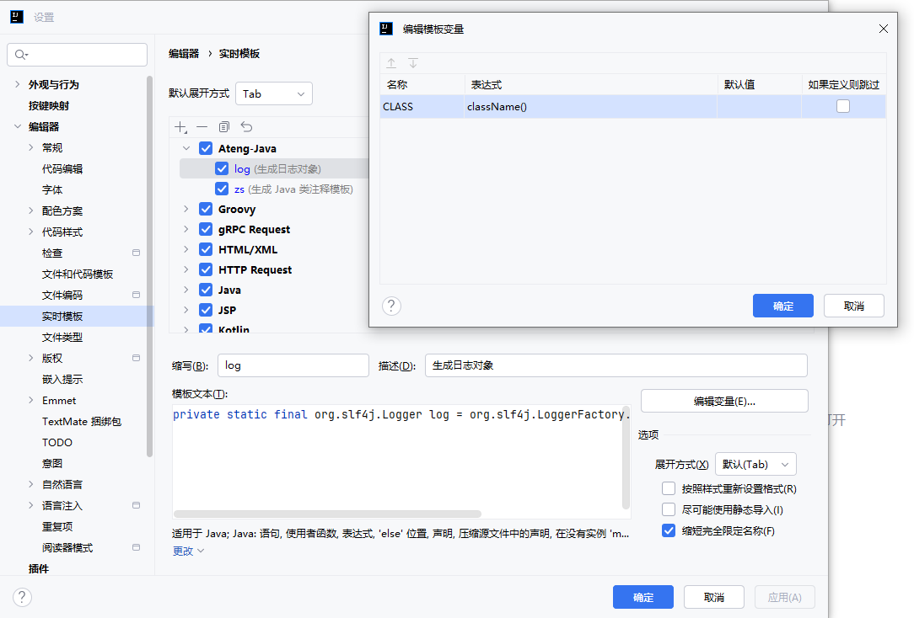
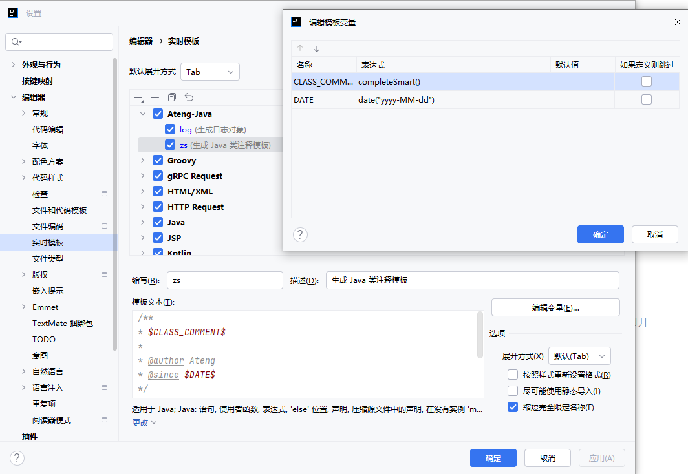
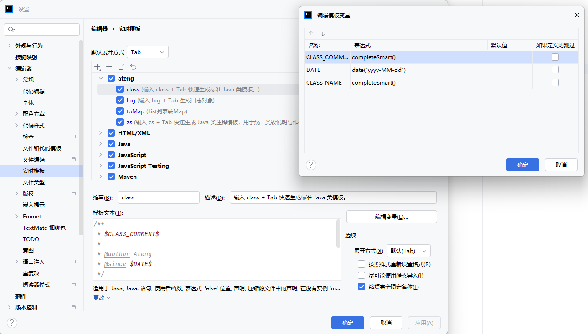
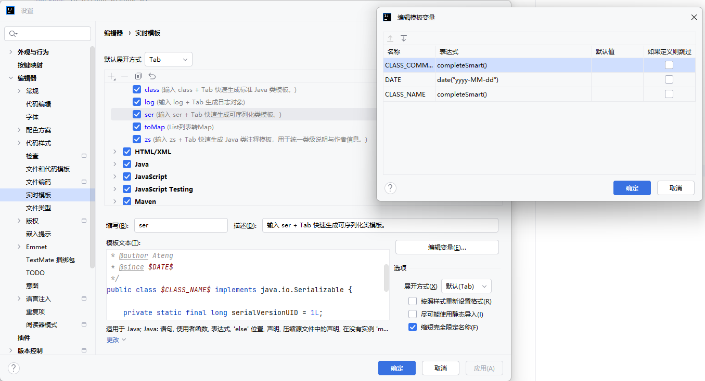
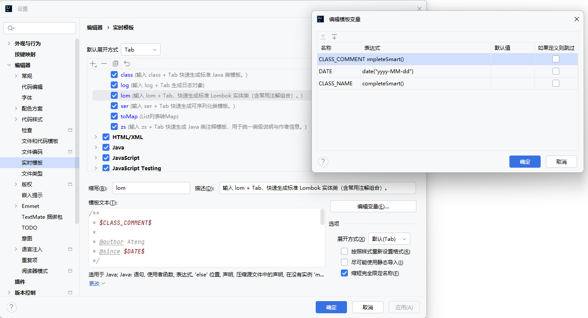

# IntelliJ IDEA 配置

IntelliJ IDEA 常用配置与开发效率优化方案。

---

## 实时模版

实时模板（Live Templates）用于快速生成常用代码结构，建议按团队规范统一配置，避免重复手写样板代码。

---

### 日志模板（log）

输入 `log` + Tab 生成日志对象

```
private static final org.slf4j.Logger log = org.slf4j.LoggerFactory.getLogger($CLASS$.class);
```

变量：

- CLASS = className()

含义说明：

className() 表示 IntelliJ IDEA 内置的表达式，用于自动获取当前所在 Java 类的类名（不包含包名）。例如在 UserServiceImpl 类中使用该模板时，IDEA 会自动将 $CLASS$ 替换为 UserServiceImpl，从而生成：

```
private static final org.slf4j.Logger log = org.slf4j.LoggerFactory.getLogger(UserServiceImpl.class);
```

该表达式的作用是避免手动填写类名，保证日志对象始终与当前类绑定，减少重构或复制代码时遗漏修改类名的问题。



---

### 生成类注释（zs）

输入 `zs` + Tab 快速生成 Java 类注释模板，用于统一类级说明与作者信息。

```
 /**
 * $CLASS_COMMENT$
 *
 * @author Ateng
 * @since $DATE$
 */
```

变量：

* CLASS_COMMENT = completeSmart()
* DATE = date("yyyy-MM-dd")

含义说明：

CLASS_COMMENT 用于填写当前类的业务说明或功能描述，例如“用户服务实现类”、“订单查询控制器”等。该字段支持智能补全（completeSmart），可根据当前文件名或上下文自动推测，也允许手动修改。

DATE 使用 IDEA 内置日期函数 date("yyyy-MM-dd")，用于自动生成当前日期，确保类注释中的时间统一规范，无需手动维护。

该模板的作用是保证所有 Java 类具备统一结构的类级文档信息，提高代码可读性与维护一致性，特别适用于 Spring Boot 分层架构中的 Controller、Service、DAO 等核心层。




### 生成类（class）

输入 `class` + Tab 快速生成标准 Java 类模板。

```java
/**
 * $CLASS_COMMENT$
 *
 * @author Ateng
 * @since $DATE$
 */
public class $CLASS_NAME$ {
}
```

变量：

- CLASS_NAME = completeSmart()
- CLASS_COMMENT = completeSmart()
- DATE = date("yyyy-MM-dd")

含义说明：

CLASS_NAME 用于自动填充当前类名，避免手动输入类名时出错。
CLASS_COMMENT 用于填写当前类的业务说明，支持智能补全，也可以直接修改。
DATE 使用 IDEA 内置日期函数自动生成当前日期，保持类注释时间统一。

该模板适用于快速创建 Controller、Service、Entity、DTO 等标准 Java 类骨架。



------

### 序列化（ser）

输入 `ser` + Tab 快速生成可序列化类模板。

```java
/**
 * $CLASS_COMMENT$
 *
 * @author Ateng
 * @since $DATE$
 */
public class $CLASS_NAME$ implements java.io.Serializable {

    private static final long serialVersionUID = 1L;
}
```

变量：

- CLASS_NAME = completeSmart()
- CLASS_COMMENT = completeSmart()
- DATE = date("yyyy-MM-dd")

含义说明：

该模板会在类上自动添加 `implements Serializable`，并补充 `serialVersionUID`，用于对象序列化、反序列化以及分布式传输场景。
适合实体类、缓存对象、RPC 传输对象等需要序列化支持的类。



### Lombok 实体类模板（lom）

输入 `lom` + Tab，快速生成标准 Lombok 实体类（含常用注解组合）。

```java
/**
 * $CLASS_COMMENT$
 *
 * @author Ateng
 * @since $DATE$
 */
@lombok.Data
@lombok.Builder
@lombok.NoArgsConstructor
@lombok.AllArgsConstructor
public class $CLASS_NAME$ implements java.io.Serializable {

    private static final long serialVersionUID = 1L;

    $END$
}
```

变量：

- CLASS_NAME = completeSmart()
- CLASS_COMMENT = completeSmart()
- DATE = date("yyyy-MM-dd")

含义说明：

该模板用于快速生成标准实体类，内置了 Lombok 最常用组合：

- `@Data`：自动生成 getter/setter/toString/equals/hashCode
- `@Builder`：支持链式构建对象（适合复杂对象构造）
- `@NoArgsConstructor` / `@AllArgsConstructor`：补齐无参和全参构造



### 列表 转 Map（toMap）

输入 `toMap` + Tab 快速生成List列表转Map模板。

```java
list
        .stream()
        .collect(Collectors.toMap(
                AtengEntity::getId,
                java.util.function.Function.identity(),
                (existing, replacement) -> replacement,
                LinkedHashMap::new
        ));
```

