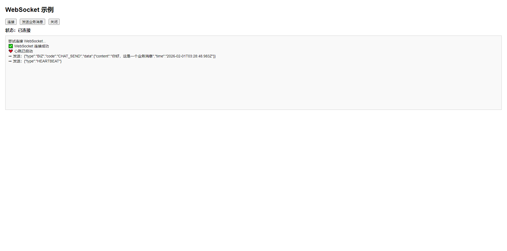

# WebSocket

WebSocket 是一种**全双工**通信协议，它允许服务器和客户端之间建立**持久化连接**，并且可以**实时**双向发送数据，而不需要像 HTTP 那样每次请求都要建立新的连接。

**特点**：

- **全双工通信**：服务器和客户端都可以主动推送消息。
- **低延迟**：相比 HTTP 轮询，WebSocket 只在建立连接时使用 HTTP 进行握手，后续通信使用 TCP，减少了带宽和延迟。
- **减少服务器压力**：减少了频繁的 HTTP 请求，适用于聊天室、实时股票推送、在线游戏等应用场景。


## 概览

本文档描述了一套基于 **Spring Boot + 原生 WebSocket（非 STOMP）+ 单机部署** 的 WebSocket 实现方案，适用于**中小规模实时通信场景**，如消息推送、通知下发、实时状态同步等。

该方案以**工程化、可维护、可扩展**为设计目标，围绕以下核心能力展开：

### 🎯 核心目标

- 建立 **稳定、可控** 的 WebSocket 长连接
- 支持 **按 Session / 用户 / 多用户 / 全量广播** 推送消息
- 支持 **多端登录**、**重复登录控制**、**主动踢人**
- 提供 **业务消息分发机制**，避免 Handler 中堆业务逻辑
- 实现 **心跳检测 + 超时清理**，防止僵尸连接
- 提供 **HTTP 管理接口**，便于运维和后台系统调用

------

### 🧱 整体架构说明

整体采用 **分层解耦设计**，各层职责清晰：

```
HTTP / Browser
      │
      ▼
WebSocket 握手
(AuthInterceptor)
      │
      ▼
WebSocketHandler（协议层）
      │
      ▼
WebSocketService（会话 / 心跳 / 推送 / 管理）
      │
      ▼
WebSocketBizDispatcher
      │
      ▼
WebSocketBizHandler（具体业务处理）
```

- **AuthInterceptor**
  负责 WebSocket 握手阶段的鉴权（如 token 校验、用户识别）
- **WebSocketHandler**
  负责 WebSocket 协议层处理（连接、断开、消息接收、异常处理）
- **WebSocketService**
  WebSocket 核心服务，统一管理：
  - Session 与用户映射
  - 心跳与连接状态
  - 消息推送（单播 / 多播 / 广播）
  - 用户踢下线、重复登录控制
- **BizDispatcher + BizHandler**
  将业务消息从 WebSocket 协议中解耦出来，实现**可插拔的业务处理机制**

------

### 🔗 连接模型说明

系统内部维护三类核心映射关系：

- **Session 维度**：
  每个 WebSocket 连接对应一个唯一 `sessionId`
- **用户维度**：
  一个用户可同时拥有多个 Session（多端登录）
- **连接信息维度**：
  记录用户、Session、连接时间、心跳时间等运行时信息

该模型支持以下能力：

- 按 Session 精确推送
- 按用户推送（多端同时接收）
- 获取当前在线用户数
- 查询所有在线连接详情
- 灵活实现踢人、下线、重复登录控制

------

### 💓 心跳与连接管理策略

采用 **应用层心跳机制**：

- 客户端定时发送心跳消息
- 服务端记录最后一次心跳时间
- 定时任务扫描超时连接并主动关闭

该方式相比依赖 TCP 层心跳，具备：

- 更强的可控性
- 更清晰的业务语义
- 更方便的监控与扩展能力

------

### 🚀 适用范围与限制说明

**适用场景：**

- 单机或单实例部署
- 中低并发 WebSocket 连接
- 实时通知、聊天、进度推送等场景

**当前限制：**

- 不支持多实例 / 集群消息同步
- 广播、踢人等操作仅作用于当前实例
- 如需集群支持，需要引入 MQ / Redis 等中间件

> 本方案在设计上已为后续**集群化、消息中间件接入**预留扩展空间。

------

## 基础配置

### 添加依赖

编辑 `pom.xml` 添加 WebSocket 依赖

```xml
<!-- WebSocket 协议支持 -->
<dependency>
    <groupId>org.springframework.boot</groupId>
    <artifactId>spring-boot-starter-websocket</artifactId>
</dependency>

<!-- Spring Boot Validation 数据校验框架 -->
<dependency>
    <groupId>org.springframework.boot</groupId>
    <artifactId>spring-boot-starter-validation</artifactId>
</dependency>
```

### 编辑配置文件

编辑 `application.yml` 配置文件

```yaml
server:
  port: 18001
spring:
  application:
    name: ${project.artifactId}
logging:
  level:
    root: info
    io.github.atengk: debug
---
# WebSocket 配置
websocket:
  # 连接地址
  endpoint: /ws

  # 允许跨域来源
  allowed-origins:
    - http://localhost:5173
    - http://127.0.0.1:5173

  # 心跳超时时间
  heartbeat-timeout: 60s

  # 心跳检测间隔（毫秒）
  heartbeat-check-interval: 30000

```


## 配置WebSocket

### 配置实体类

#### 配置类

```java
package io.github.atengk.config;

import jakarta.validation.constraints.NotBlank;
import jakarta.validation.constraints.NotEmpty;
import jakarta.validation.constraints.NotNull;
import lombok.Data;
import org.springframework.boot.context.properties.ConfigurationProperties;
import org.springframework.stereotype.Component;

import java.time.Duration;
import java.util.List;

/**
 * WebSocket 配置属性绑定类
 *
 * <p>
 * 用于统一管理 WebSocket 相关的配置项，
 * 通过 {@code websocket.*} 前缀从配置文件中加载。
 * </p>
 *
 * @author 孔余
 * @since 2026-01-30
 */
@Data
@Component
@ConfigurationProperties(prefix = "websocket")
public class WebSocketProperties {

    /**
     * WebSocket 端点路径
     *
     * <p>
     * 客户端建立 WebSocket 连接时访问的路径，
     * 例如：/ws
     * </p>
     */
    @NotBlank
    private String endpoint;

    /**
     * 允许跨域访问的来源列表
     *
     * <p>
     * 用于配置 WebSocket 的跨域访问控制，
     * 可配置多个前端访问地址。
     * </p>
     *
     * <pre>
     * 示例：
     * - http://localhost:5173
     * - https://www.example.com
     * </pre>
     */
    @NotEmpty
    private List<String> allowedOrigins;

    /**
     * WebSocket 心跳超时时间
     *
     * <p>
     * 在该时间范围内未收到客户端心跳消息，
     * 将认为连接已失效并主动关闭。
     * </p>
     */
    @NotNull
    private Duration heartbeatTimeout;

    /**
     * WebSocket 心跳检测执行间隔
     *
     * <p>
     * 表示后台定时任务检测心跳超时的执行频率，
     * 单位为毫秒。
     * </p>
     */
    @NotNull
    private Long heartbeatCheckInterval;
}

```

#### 消息类

```java
package io.github.atengk.entity;

import lombok.Data;

/**
 * WebSocket 消息实体
 *
 * <p>
 * 用于客户端与服务端之间统一的数据传输结构，
 * 支持不同类型的业务消息。
 * </p>
 *
 * @author 孔余
 * @since 2026-01-30
 */
@Data
public class WebSocketMessage {

    /**
     * 消息类型
     *
     * <p>
     * 用于区分业务消息、心跳消息、系统消息等
     * </p>
     */
    private String type;

    /**
     * 业务状态码
     *
     * <p>
     * 用于标识消息处理结果或业务场景
     * </p>
     */
    private String code;

    /**
     * 消息数据体
     *
     * <p>
     * 具体业务数据，由不同消息类型决定
     * </p>
     */
    private Object data;
}

```

#### 消息常量类

```java
package io.github.atengk.constants;

/**
 * WebSocket 业务码常量
 *
 * <p>
 * 用于标识 WebSocket 消息对应的具体业务场景，
 * 便于前后端统一识别与处理。
 * </p>
 *
 * @author 孔余
 * @since 2026-01-30
 */
public final class WebSocketBizCodeConstants {

    private WebSocketBizCodeConstants() {
    }

    /**
     * 订单创建
     */
    public static final String ORDER_CREATE = "ORDER_CREATE";

    /**
     * 订单取消
     */
    public static final String ORDER_CANCEL = "ORDER_CANCEL";

    /**
     * 任务进度通知
     */
    public static final String TASK_PROGRESS = "TASK_PROGRESS";
}

```

#### 消息类型枚举

```java
package io.github.atengk.enums;

import lombok.Getter;

/**
 * WebSocket 消息类型枚举
 *
 * <p>
 * 用于区分 WebSocket 消息的基础类型，
 * 如心跳消息、业务消息等。
 * </p>
 *
 * @author 孔余
 * @since 2026-01-30
 */
@Getter
public enum WebSocketMessageType {

    /**
     * 心跳消息
     */
    HEARTBEAT("HEARTBEAT", "心跳"),

    /**
     * 心跳确认消息
     */
    HEARTBEAT_ACK("HEARTBEAT_ACK", "心跳确认"),

    /**
     * 业务消息
     */
    BIZ("BIZ", "业务消息");

    /**
     * 类型编码
     */
    private final String code;

    /**
     * 类型描述
     */
    private final String desc;

    WebSocketMessageType(String code, String desc) {
        this.code = code;
        this.desc = desc;
    }

    /**
     * 根据编码获取消息类型
     *
     * @param code 类型编码
     * @return 消息类型，未匹配返回 null
     */
    public static WebSocketMessageType fromCode(String code) {
        for (WebSocketMessageType type : values()) {
            if (type.code.equals(code)) {
                return type;
            }
        }
        return null;
    }
}

```

#### 业务消息枚举

```java
package io.github.atengk.enums;

import lombok.Getter;

/**
 * WebSocket 业务编码枚举
 *
 * <p>
 * 用于区分不同业务类型的 WebSocket 消息，
 * 结合 {@link io.github.atengk.service.WebSocketBizHandler}
 * 实现按业务分发处理。
 * </p>
 *
 * @author 孔余
 * @since 2026-01-30
 */
@Getter
public enum WebSocketBizCode {

    /**
     * 发送聊天消息
     */
    CHAT_SEND("CHAT_SEND", "发送聊天消息"),

    /**
     * 接收聊天消息
     */
    CHAT_RECEIVE("CHAT_RECEIVE", "接收聊天消息"),

    /**
     * 通知推送
     */
    NOTICE_PUSH("NOTICE_PUSH", "通知推送"),

    /**
     * 通知确认
     */
    NOTICE_ACK("NOTICE_ACK", "通知确认");

    /**
     * 业务编码
     */
    private final String code;

    /**
     * 业务描述
     */
    private final String desc;

    WebSocketBizCode(String code, String desc) {
        this.code = code;
        this.desc = desc;
    }

    /**
     * 根据编码获取业务枚举
     *
     * @param code 业务编码
     * @return 业务枚举，未匹配返回 null
     */
    public static WebSocketBizCode fromCode(String code) {
        for (WebSocketBizCode bizCode : values()) {
            if (bizCode.code.equals(code)) {
                return bizCode;
            }
        }
        return null;
    }
}

```

### 配置WebSocketService

```java
package io.github.atengk.service;

import com.alibaba.fastjson2.JSONObject;
import io.github.atengk.config.WebSocketProperties;
import io.github.atengk.entity.WebSocketMessage;
import io.github.atengk.enums.WebSocketMessageType;
import lombok.Getter;
import lombok.RequiredArgsConstructor;
import lombok.extern.slf4j.Slf4j;
import org.springframework.stereotype.Service;
import org.springframework.web.socket.CloseStatus;
import org.springframework.web.socket.TextMessage;
import org.springframework.web.socket.WebSocketSession;

import java.io.IOException;
import java.time.Duration;
import java.time.LocalDateTime;
import java.util.Collections;
import java.util.Map;
import java.util.Set;
import java.util.concurrent.ConcurrentHashMap;

/**
 * WebSocket 核心服务
 *
 * <p>
 * 负责 WebSocket 会话的统一管理，包括：
 * </p>
 * <ul>
 *     <li>Session 与用户关系维护</li>
 *     <li>心跳检测与连接清理</li>
 *     <li>消息推送（单播 / 多播 / 广播）</li>
 *     <li>用户踢下线与重复登录控制</li>
 *     <li>业务消息分发</li>
 * </ul>
 *
 * <p>
 * 该实现基于单机内存模型，适用于单实例部署场景
 * </p>
 *
 * @author 孔余
 * @since 2026-01-30
 */
@Slf4j
@Service
@RequiredArgsConstructor
public class WebSocketService {

    /**
     * SessionId -> WebSocketSession 映射
     *
     * <p>
     * 用于根据 SessionId 精确操作 WebSocket 连接
     * </p>
     */
    private static final Map<String, WebSocketSession> SESSION_MAP = new ConcurrentHashMap<>();

    /**
     * 用户ID -> SessionId 集合 映射
     *
     * <p>
     * 支持同一用户多端同时在线
     * </p>
     */
    private static final Map<String, Set<String>> USER_SESSION_MAP = new ConcurrentHashMap<>();

    /**
     * SessionId -> 连接信息 映射
     *
     * <p>
     * 记录连接建立时间、最近心跳时间等运行时信息
     * </p>
     */
    private static final Map<String, ConnectionInfo> CONNECTION_INFO_MAP = new ConcurrentHashMap<>();

    /**
     * WebSocket 配置属性
     */
    private final WebSocketProperties webSocketProperties;

    /**
     * WebSocket 业务消息分发器
     */
    private final WebSocketBizDispatcher bizDispatcher;

    /**
     * 注册新的 WebSocket 会话
     *
     * @param userId  用户ID
     * @param session WebSocket 会话
     */
    public void registerSession(String userId, WebSocketSession session) {
        SESSION_MAP.put(session.getId(), session);

        USER_SESSION_MAP
                .computeIfAbsent(userId, k -> ConcurrentHashMap.newKeySet())
                .add(session.getId());

        ConnectionInfo info = new ConnectionInfo(
                userId,
                session.getId(),
                session.getRemoteAddress() != null
                        ? session.getRemoteAddress().toString()
                        : "未知",
                LocalDateTime.now(),
                LocalDateTime.now()
        );

        CONNECTION_INFO_MAP.put(session.getId(), info);

        log.info(
                "WebSocket 用户连接成功，用户ID：{}，SessionID：{}",
                userId,
                session.getId()
        );
    }

    /**
     * 移除 WebSocket 会话并清理相关映射关系
     *
     * @param session WebSocket 会话
     */
    public void removeSession(WebSocketSession session) {
        if (session == null) {
            return;
        }

        ConnectionInfo info = CONNECTION_INFO_MAP.remove(session.getId());
        SESSION_MAP.remove(session.getId());

        if (info != null) {
            String userId = info.getUserId();
            Set<String> sessions = USER_SESSION_MAP.get(userId);
            if (sessions != null) {
                sessions.remove(session.getId());
                if (sessions.isEmpty()) {
                    USER_SESSION_MAP.remove(userId);
                }
            }

            log.info(
                    "WebSocket 用户断开连接，用户ID：{}，SessionID：{}",
                    userId,
                    session.getId()
            );
        } else {
            log.info("WebSocket Session 断开连接，SessionID：{}", session.getId());
        }
    }

    /**
     * WebSocket 鉴权校验
     *
     * @param userId 用户ID
     * @return 是否鉴权通过
     */
    public boolean authenticate(String userId) {
        if (userId == null || userId.isBlank()) {
            log.warn("WebSocket 鉴权失败，用户ID为空");
            return false;
        }
        log.info("WebSocket 鉴权通过，用户ID：{}", userId);
        return true;
    }

    /**
     * 处理心跳消息
     *
     * <p>
     * 刷新当前 Session 的最近心跳时间
     * </p>
     *
     * @param session WebSocket 会话
     */
    public void handleHeartbeat(WebSocketSession session) {
        ConnectionInfo info = CONNECTION_INFO_MAP.get(session.getId());
        if (info == null) {
            log.debug(
                    "收到心跳但未找到连接信息，SessionID：{}",
                    session.getId()
            );
            return;
        }

        info.refreshHeartbeat();

        log.debug(
                "收到 WebSocket 心跳，SessionID：{}，更新时间：{}",
                session.getId(),
                info.getLastHeartbeatTime()
        );

        // 返回心跳响应
        try {
            if (session.isOpen()) {
                WebSocketMessage webSocketMessage = new WebSocketMessage();
                webSocketMessage.setType(WebSocketMessageType.HEARTBEAT_ACK.getCode());
                String message = JSONObject.toJSONString(webSocketMessage);
                session.sendMessage(new TextMessage(message));
            }
        } catch (Exception e) {
            log.warn(
                    "发送心跳响应失败，SessionID：{}",
                    session.getId(),
                    e
            );
        }
    }

    /**
     * 检测心跳超时的连接并主动关闭
     */
    public void checkHeartbeatTimeout() {
        LocalDateTime now = LocalDateTime.now();

        CONNECTION_INFO_MAP.values().forEach(info -> {
            if (Duration.between(info.getLastHeartbeatTime(), now)
                    .compareTo(webSocketProperties.getHeartbeatTimeout()) > 0) {
                closeSession(info.getSessionId(), CloseStatus.SESSION_NOT_RELIABLE);
            }
        });
    }

    /**
     * 踢指定用户下线
     *
     * @param userId 用户ID
     * @param reason 踢下线原因
     */
    public void kickUser(String userId, String reason) {
        Set<String> sessionIds = USER_SESSION_MAP.get(userId);
        if (sessionIds == null || sessionIds.isEmpty()) {
            return;
        }

        for (String sessionId : Set.copyOf(sessionIds)) {
            sendToSession(sessionId, reason);
            closeSession(sessionId, CloseStatus.NORMAL);
        }
    }

    /**
     * 向指定 Session 发送消息
     *
     * @param sessionId SessionID
     * @param message   消息内容
     */
    public void sendToSession(String sessionId, String message) {
        WebSocketSession session = SESSION_MAP.get(sessionId);
        if (session == null || !session.isOpen()) {
            if (session != null) {
                removeSession(session);
            }
            return;
        }

        try {
            session.sendMessage(new TextMessage(message));
        } catch (IOException e) {
            log.error("WebSocket 消息发送异常，SessionID：{}", sessionId, e);
            closeSession(sessionId, CloseStatus.SERVER_ERROR);
        }
    }

    /**
     * 向指定用户发送消息（多端同时接收）
     *
     * @param userId  用户ID
     * @param message 消息内容
     */
    public void sendToUser(String userId, String message) {
        Set<String> sessionIds = USER_SESSION_MAP.getOrDefault(userId, Collections.emptySet());
        for (String sessionId : Set.copyOf(sessionIds)) {
            sendToSession(sessionId, message);
        }
    }

    /**
     * 向多个用户发送消息
     *
     * @param userIds 用户ID集合
     * @param message 消息内容
     */
    public void sendToUsers(Set<String> userIds, String message) {
        if (userIds == null || userIds.isEmpty()) {
            return;
        }

        for (String userId : Set.copyOf(userIds)) {
            sendToUser(userId, message);
        }
    }

    /**
     * 向多个用户发送消息（排除指定用户）
     *
     * @param userIds        目标用户集合
     * @param excludeUserIds 排除的用户集合
     * @param message        消息内容
     */
    public void sendToUsersExclude(Set<String> userIds,
                                   Set<String> excludeUserIds,
                                   String message) {
        if (userIds == null || userIds.isEmpty()) {
            return;
        }

        for (String userId : Set.copyOf(userIds)) {
            if (excludeUserIds != null && excludeUserIds.contains(userId)) {
                continue;
            }
            sendToUser(userId, message);
        }
    }

    /**
     * 广播消息给所有在线 Session
     *
     * @param message 消息内容
     */
    public void broadcast(String message) {
        SESSION_MAP.values().forEach(session -> {
            if (!session.isOpen()) {
                removeSession(session);
                return;
            }

            try {
                session.sendMessage(new TextMessage(message));
            } catch (IOException e) {
                closeSession(session.getId(), CloseStatus.SERVER_ERROR);
            }
        });
    }

    /**
     * 关闭指定 Session
     *
     * @param sessionId SessionID
     * @param status    关闭状态
     */
    public void closeSession(String sessionId, CloseStatus status) {
        WebSocketSession session = SESSION_MAP.get(sessionId);
        if (session == null) {
            return;
        }

        try {
            if (session.isOpen()) {
                session.close(status);
            }
        } catch (IOException e) {
            log.error("关闭 WebSocket Session 异常，SessionID：{}", sessionId, e);
        } finally {
            removeSession(session);
        }
    }

    /**
     * 获取当前在线用户数量
     *
     * @return 在线用户数
     */
    public int getOnlineUserCount() {
        return USER_SESSION_MAP.size();
    }

    /**
     * 获取所有在线连接信息
     *
     * @return 连接信息映射
     */
    public Map<String, ConnectionInfo> getAllConnectionInfo() {
        return Collections.unmodifiableMap(CONNECTION_INFO_MAP);
    }

    /**
     * 处理业务消息
     *
     * @param session WebSocket 会话
     * @param message 业务消息
     */
    public void handleBizMessage(WebSocketSession session, WebSocketMessage message) {
        boolean handled = bizDispatcher.dispatch(
                session,
                message.getCode(),
                message
        );

        if (!handled) {
            log.warn(
                    "未找到对应的 BizHandler，sessionId：{}，code：{}",
                    session.getId(),
                    message.getCode()
            );
        }
    }

    /**
     * 踢除指定用户的所有连接
     *
     * @param userId 用户ID
     */
    public void kickIfDuplicateLogin(String userId) {
        Set<String> sessionIds = USER_SESSION_MAP.get(userId);
        if (sessionIds == null || sessionIds.size() <= 1) {
            return;
        }

        for (String sessionId : Set.copyOf(sessionIds)) {
            closeSession(sessionId, CloseStatus.NORMAL);
        }
    }

    /**
     * 踢除指定用户除当前 Session 外的其他连接
     *
     * @param userId           用户ID
     * @param currentSessionId 当前 SessionID
     */
    public void kickIfDuplicateLogin(String userId, String currentSessionId) {
        Set<String> sessionIds = USER_SESSION_MAP.get(userId);
        if (sessionIds == null || sessionIds.size() <= 1) {
            return;
        }

        for (String sessionId : Set.copyOf(sessionIds)) {
            if (!sessionId.equals(currentSessionId)) {
                closeSession(sessionId, CloseStatus.NORMAL);
            }
        }
    }

    /**
     * WebSocket 连接信息
     */
    @Getter
    public static class ConnectionInfo {

        /**
         * 用户ID
         */
        private final String userId;

        /**
         * SessionID
         */
        private final String sessionId;

        /**
         * 客户端地址
         */
        private final String clientAddress;

        /**
         * 连接建立时间
         */
        private final LocalDateTime connectTime;

        /**
         * 最近一次心跳时间
         */
        private volatile LocalDateTime lastHeartbeatTime;

        public ConnectionInfo(String userId,
                              String sessionId,
                              String clientAddress,
                              LocalDateTime connectTime,
                              LocalDateTime lastHeartbeatTime) {
            this.userId = userId;
            this.sessionId = sessionId;
            this.clientAddress = clientAddress;
            this.connectTime = connectTime;
            this.lastHeartbeatTime = lastHeartbeatTime;
        }

        /**
         * 刷新心跳时间
         */
        public void refreshHeartbeat() {
            this.lastHeartbeatTime = LocalDateTime.now();
        }
    }
}
```

### 配置WebSocketAuthInterceptor

```java
package io.github.atengk.interceptor;

import cn.hutool.core.net.url.UrlBuilder;
import cn.hutool.core.net.url.UrlQuery;
import cn.hutool.core.util.CharsetUtil;
import lombok.extern.slf4j.Slf4j;
import org.springframework.http.server.ServerHttpRequest;
import org.springframework.http.server.ServerHttpResponse;
import org.springframework.stereotype.Component;
import org.springframework.web.socket.WebSocketHandler;
import org.springframework.web.socket.server.HandshakeInterceptor;

import java.net.URI;
import java.util.Map;

/**
 * WebSocket 握手阶段鉴权拦截器
 *
 * <p>
 * 在 WebSocket 握手建立之前执行，用于从请求参数中解析 token，
 * 并完成用户身份校验，将用户信息存入 WebSocket Session attributes。
 * </p>
 *
 * @author 孔余
 * @since 2026-01-30
 */
@Slf4j
@Component
public class WebSocketAuthInterceptor implements HandshakeInterceptor {

    /**
     * WebSocket Session 中存储用户ID的属性名
     */
    public static final String ATTR_USER_ID = "USER_ID";

    /**
     * WebSocket 握手前置处理
     *
     * <p>
     * 用于从请求 URI 中解析 token，并校验 token 的合法性。
     * 校验通过后，将用户ID写入 attributes，供后续 WebSocketHandler 使用。
     * </p>
     *
     * @param request    当前 HTTP 请求
     * @param response   当前 HTTP 响应
     * @param handler    WebSocket 处理器
     * @param attributes WebSocket Session 属性集合
     * @return true 表示允许握手，false 表示拒绝握手
     */
    @Override
    public boolean beforeHandshake(ServerHttpRequest request,
                                   ServerHttpResponse response,
                                   WebSocketHandler handler,
                                   Map<String, Object> attributes) {

        // 获取请求 URI
        URI uri = request.getURI();

        // 使用 Hutool 解析并自动解码查询参数
        UrlQuery query = UrlBuilder.of(uri, CharsetUtil.CHARSET_UTF_8).getQuery();

        // 获取 token 参数
        String token = null;
        if (query != null) {
            CharSequence value = query.get("token");
            if (value != null) {
                token = value.toString();
            }
        }

        // token 为空，直接拒绝握手
        if (token == null || token.isBlank()) {
            log.warn("WebSocket 握手失败，token 缺失");
            return false;
        }

        // 根据 token 解析用户ID
        String userId = parseUserIdFromToken(token);
        if (userId == null) {
            log.warn("WebSocket 握手失败，token 无效，token：{}", token);
            return false;
        }

        // 将用户ID存入 WebSocket Session 属性
        attributes.put(ATTR_USER_ID, userId);

        log.info("WebSocket 握手鉴权成功，用户ID：{}", userId);
        return true;
    }

    /**
     * WebSocket 握手完成后的回调
     *
     * <p>
     * 当前未做额外处理，预留扩展。
     * </p>
     *
     * @param request  当前 HTTP 请求
     * @param response 当前 HTTP 响应
     * @param handler  WebSocket 处理器
     * @param ex       握手异常（如果有）
     */
    @Override
    public void afterHandshake(ServerHttpRequest request,
                               ServerHttpResponse response,
                               WebSocketHandler handler,
                               Exception ex) {
    }

    /**
     * 根据 token 解析用户ID
     *
     * <p>
     * 示例实现：通过固定 token 映射用户ID，
     * 实际项目中可替换为 JWT 校验或统一认证中心校验。
     * </p>
     *
     * @param token 客户端传入的 token
     * @return 用户ID，解析失败返回 null
     */
    private String parseUserIdFromToken(String token) {
        if ("Admin@123".equals(token)) {
            return "10001";
        }
        return null;
    }
}
```

### 配置WebSocketHandler

```java
package io.github.atengk.handler;

import com.alibaba.fastjson2.JSON;
import io.github.atengk.entity.WebSocketMessage;
import io.github.atengk.enums.WebSocketMessageType;
import io.github.atengk.interceptor.WebSocketAuthInterceptor;
import io.github.atengk.service.WebSocketService;
import lombok.RequiredArgsConstructor;
import lombok.extern.slf4j.Slf4j;
import org.springframework.stereotype.Component;
import org.springframework.web.socket.CloseStatus;
import org.springframework.web.socket.TextMessage;
import org.springframework.web.socket.WebSocketSession;
import org.springframework.web.socket.handler.TextWebSocketHandler;

/**
 * WebSocket 核心处理器
 *
 * <p>
 * 负责处理 WebSocket 生命周期事件以及文本消息的分发：
 * 连接建立、消息接收、连接关闭、传输异常等。
 * </p>
 *
 * @author 孔余
 * @since 2026-01-30
 */
@Slf4j
@Component
@RequiredArgsConstructor
public class WebSocketHandler extends TextWebSocketHandler {

    /**
     * WebSocket 业务服务
     */
    private final WebSocketService webSocketService;

    /**
     * WebSocket 连接建立成功后的回调
     *
     * <p>
     * 从握手阶段保存的 attributes 中获取用户ID，
     * 进行二次鉴权校验，并注册 WebSocket Session。
     * </p>
     *
     * @param session 当前 WebSocket Session
     */
    @Override
    public void afterConnectionEstablished(WebSocketSession session) {
        String userId = (String) session.getAttributes()
                .get(WebSocketAuthInterceptor.ATTR_USER_ID);

        if (!webSocketService.authenticate(userId)) {
            log.warn("WebSocket 连接鉴权失败，关闭连接，SessionID：{}", session.getId());
            webSocketService.closeSession(session.getId(), CloseStatus.NOT_ACCEPTABLE);
            return;
        }

        webSocketService.registerSession(userId, session);
    }

    /**
     * 处理客户端发送的文本消息
     *
     * <p>
     * 解析消息内容，根据消息类型分发到不同的处理逻辑：
     * 心跳消息或业务消息。
     * </p>
     *
     * @param session 当前 WebSocket Session
     * @param message 客户端发送的文本消息
     */
    @Override
    protected void handleTextMessage(WebSocketSession session, TextMessage message) {
        try {
            // 将 JSON 文本解析为 WebSocketMessage 对象
            WebSocketMessage wsMessage =
                    JSON.parseObject(message.getPayload(), WebSocketMessage.class);

            // 根据消息类型编码获取消息类型枚举
            WebSocketMessageType messageType =
                    WebSocketMessageType.fromCode(wsMessage.getType());

            // 未识别的消息类型，直接忽略
            if (messageType == null) {
                log.warn(
                        "收到未知 WebSocket 消息类型，SessionID：{}，type：{}",
                        session.getId(),
                        wsMessage.getType()
                );
                return;
            }

            switch (messageType) {
                case HEARTBEAT:
                    // 处理心跳消息
                    webSocketService.handleHeartbeat(session);
                    break;

                case BIZ:
                    // 处理业务消息
                    webSocketService.handleBizMessage(session, wsMessage);
                    break;

                default:
                    log.warn(
                            "未处理的 WebSocket 消息类型，SessionID：{}，type：{}",
                            session.getId(),
                            messageType.getCode()
                    );
            }

        } catch (Exception e) {
            log.error("处理 WebSocket 消息异常，SessionID：{}", session.getId(), e);
        }
    }

    /**
     * WebSocket 连接关闭后的回调
     *
     * <p>
     * 清理 Session 及相关连接信息。
     * </p>
     *
     * @param session 当前 WebSocket Session
     * @param status  连接关闭状态
     */
    @Override
    public void afterConnectionClosed(WebSocketSession session, CloseStatus status) {
        webSocketService.removeSession(session);
        log.info("WebSocket 连接关闭，SessionID：{}，状态：{}", session.getId(), status);
    }

    /**
     * WebSocket 传输异常处理
     *
     * <p>
     * 出现传输异常时，主动关闭连接并释放资源。
     * </p>
     *
     * @param session   当前 WebSocket Session
     * @param exception 异常信息
     */
    @Override
    public void handleTransportError(WebSocketSession session, Throwable exception) {
        log.error(
                "WebSocket 传输异常，准备关闭连接，SessionID：{}",
                session.getId(),
                exception
        );

        webSocketService.closeSession(
                session.getId(),
                CloseStatus.SERVER_ERROR
        );
    }

}

```

### 配置消息分发

#### 配置消息分发器

```java
package io.github.atengk.service;

import io.github.atengk.entity.WebSocketMessage;
import lombok.extern.slf4j.Slf4j;
import org.springframework.stereotype.Component;
import org.springframework.web.socket.WebSocketSession;

import java.util.List;

/**
 * WebSocket 业务消息分发器
 *
 * <p>
 * 负责根据业务编码（bizCode），从已注册的 WebSocketBizHandler 中
 * 查找能够处理该业务的处理器，并进行消息分发。
 * </p>
 *
 * @author 孔余
 * @since 2026-01-30
 */
@Slf4j
@Component
public class WebSocketBizDispatcher {

    /**
     * 所有 WebSocket 业务处理器
     *
     * <p>
     * 由 Spring 自动注入，实现 WebSocketBizHandler 接口的 Bean
     * 都会被收集到该列表中。
     * </p>
     */
    private final List<WebSocketBizHandler> handlers;

    /**
     * 构造方法
     *
     * @param handlers WebSocket 业务处理器集合
     */
    public WebSocketBizDispatcher(List<WebSocketBizHandler> handlers) {
        this.handlers = handlers;
    }

    /**
     * 分发 WebSocket 业务消息
     *
     * <p>
     * 根据业务编码查找支持该编码的处理器，
     * 找到后立即处理消息并返回。
     * </p>
     *
     * @param session 当前 WebSocket Session
     * @param bizCode  业务编码
     * @param message  WebSocket 消息对象
     * @return true 表示已成功处理，false 表示未找到对应处理器
     */
    public boolean dispatch(WebSocketSession session, String bizCode, Object message) {
        for (WebSocketBizHandler handler : handlers) {
            if (handler.support(bizCode)) {
                handler.handle(session, (WebSocketMessage) message);
                return true;
            }
        }

        return false;
    }
}

```

#### 配置消息处理器接口

```java
package io.github.atengk.service;

import io.github.atengk.entity.WebSocketMessage;
import org.springframework.web.socket.WebSocketSession;

/**
 * WebSocket 业务消息处理器接口
 *
 * <p>
 * 定义 WebSocket 业务消息的处理规范，
 * 每个业务处理器通过业务编码（bizCode）进行区分。
 * </p>
 *
 * @author 孔余
 * @since 2026-01-30
 */
public interface WebSocketBizHandler {

    /**
     * 判断当前处理器是否支持指定的业务编码
     *
     * @param bizCode 业务编码
     * @return true 表示支持，false 表示不支持
     */
    boolean support(String bizCode);

    /**
     * 处理 WebSocket 业务消息
     *
     * @param session 当前 WebSocket Session
     * @param message WebSocket 消息对象
     */
    void handle(WebSocketSession session, WebSocketMessage message);
}

```

#### 配置消息处理器接口实现

**处理聊天发送消息**

```java
package io.github.atengk.service.impl;

import io.github.atengk.entity.WebSocketMessage;
import io.github.atengk.enums.WebSocketBizCode;
import io.github.atengk.service.WebSocketBizHandler;
import lombok.extern.slf4j.Slf4j;
import org.springframework.stereotype.Component;
import org.springframework.web.socket.WebSocketSession;

/**
 * 聊天消息发送业务处理器
 *
 * <p>
 * 负责处理聊天发送相关的 WebSocket 业务消息，
 * 仅对指定的聊天发送业务编码进行处理。
 * </p>
 *
 * @author 孔余
 * @since 2026-01-30
 */
@Component
@Slf4j
public class ChatSendBizHandler implements WebSocketBizHandler {

    /**
     * 判断是否支持当前业务编码
     *
     * @param bizCode 业务编码
     * @return true 表示支持聊天发送业务
     */
    @Override
    public boolean support(String bizCode) {
        return WebSocketBizCode.CHAT_SEND.getCode().equals(bizCode);
    }

    /**
     * 处理聊天发送业务消息
     *
     * <p>
     * 当前示例仅记录日志，实际业务中可在此处进行
     * 消息持久化、转发、推送等操作。
     * </p>
     *
     * @param session 当前 WebSocket Session
     * @param message WebSocket 消息对象
     */
    @Override
    public void handle(WebSocketSession session, WebSocketMessage message) {
        log.info(
                "处理聊天发送消息，SessionID：{}，数据：{}",
                session.getId(),
                message.getData()
        );
    }
}

```

**处理通知确认消息**

```java
package io.github.atengk.service.impl;

import io.github.atengk.entity.WebSocketMessage;
import io.github.atengk.enums.WebSocketBizCode;
import io.github.atengk.service.WebSocketBizHandler;
import lombok.extern.slf4j.Slf4j;
import org.springframework.stereotype.Component;
import org.springframework.web.socket.WebSocketSession;

/**
 * 通知确认业务处理器
 *
 * <p>
 * 用于处理客户端对通知类消息的确认（ACK）业务，
 * 通常用于已读回执、消息确认等场景。
 * </p>
 *
 * @author 孔余
 * @since 2026-01-30
 */
@Component
@Slf4j
public class NoticeAckBizHandler implements WebSocketBizHandler {

    /**
     * 判断是否支持当前业务编码
     *
     * @param bizCode 业务编码
     * @return true 表示支持通知确认业务
     */
    @Override
    public boolean support(String bizCode) {
        return WebSocketBizCode.NOTICE_ACK.getCode().equals(bizCode);
    }

    /**
     * 处理通知确认业务消息
     *
     * <p>
     * 当前示例仅记录日志，实际业务中可在此处进行
     * 通知状态更新、确认记录持久化等操作。
     * </p>
     *
     * @param session 当前 WebSocket Session
     * @param message WebSocket 消息对象
     */
    @Override
    public void handle(WebSocketSession session, WebSocketMessage message) {
        log.info(
                "处理通知确认消息，SessionID：{}，数据：{}",
                session.getId(),
                message.getData()
        );
    }
}

```

**处理订单创建消息**

```java
package io.github.atengk.service.impl;

import io.github.atengk.constants.WebSocketBizCodeConstants;
import io.github.atengk.entity.WebSocketMessage;
import io.github.atengk.service.WebSocketBizHandler;
import lombok.extern.slf4j.Slf4j;
import org.springframework.stereotype.Component;
import org.springframework.web.socket.WebSocketSession;

/**
 * 订单创建业务处理器
 *
 * <p>
 * 用于处理订单创建相关的 WebSocket 业务消息，
 * 当客户端发送订单创建指令时由该处理器进行处理。
 * </p>
 *
 * @author 孔余
 * @since 2026-01-30
 */
@Component
@Slf4j
public class OrderCreateBizHandler implements WebSocketBizHandler {

    /**
     * 判断是否支持当前业务编码
     *
     * @param bizCode 业务编码
     * @return true 表示支持订单创建业务
     */
    @Override
    public boolean support(String bizCode) {
        return WebSocketBizCodeConstants.ORDER_CREATE.equals(bizCode);
    }

    /**
     * 处理订单创建业务消息
     *
     * <p>
     * 当前示例仅记录日志，实际业务中可在此处完成
     * 订单创建、校验、状态初始化等核心逻辑。
     * </p>
     *
     * @param session 当前 WebSocket Session
     * @param message WebSocket 消息对象
     */
    @Override
    public void handle(WebSocketSession session, WebSocketMessage message) {
        log.info(
                "处理订单创建消息，SessionID：{}，数据：{}",
                session.getId(),
                message.getData()
        );
    }
}

```

### 配置会话定时任务

注意开启 `@EnableScheduling`

```java
package io.github.atengk.schedule;

import io.github.atengk.service.WebSocketService;
import lombok.RequiredArgsConstructor;
import lombok.extern.slf4j.Slf4j;
import org.springframework.scheduling.annotation.Scheduled;
import org.springframework.stereotype.Component;

/**
 * WebSocket 会话定时任务
 *
 * <p>
 * 负责周期性执行 WebSocket 会话相关的后台任务，
 * 目前用于检测并清理心跳超时的连接。
 * </p>
 *
 * @author 孔余
 * @since 2026-01-30
 */
@Slf4j
@Component
@RequiredArgsConstructor
public class WebSocketSessionScheduler {

    /**
     * WebSocket 服务
     */
    private final WebSocketService webSocketService;

    /**
     * 定期检测 WebSocket 心跳超时连接
     *
     * <p>
     * 按固定延迟执行，通过配置项
     * websocket.heartbeat-check-interval 控制执行间隔，
     * 默认 30 秒执行一次。
     * </p>
     */
    @Scheduled(fixedDelayString = "${websocket.heartbeat-check-interval:30000}")
    public void checkHeartbeat() {
        try {
            log.debug("开始执行 WebSocket 心跳超时检测任务");
            webSocketService.checkHeartbeatTimeout();
        } catch (Exception e) {
            log.error("WebSocket 心跳检测任务执行异常", e);
        }
    }

}

```


### 配置WebSocketConfig

```java
package io.github.atengk.config;

import io.github.atengk.handler.WebSocketHandler;
import io.github.atengk.interceptor.WebSocketAuthInterceptor;
import lombok.RequiredArgsConstructor;
import org.springframework.context.annotation.Configuration;
import org.springframework.web.socket.config.annotation.EnableWebSocket;
import org.springframework.web.socket.config.annotation.WebSocketConfigurer;
import org.springframework.web.socket.config.annotation.WebSocketHandlerRegistry;

/**
 * WebSocket 配置类
 *
 * <p>
 * 基于 Spring 原生 WebSocket 实现（非 STOMP 协议），
 * 负责注册 WebSocket Handler、鉴权拦截器以及跨域配置。
 * </p>
 *
 * @author 孔余
 * @since 2026-01-30
 */
@Configuration
@EnableWebSocket
@RequiredArgsConstructor
public class WebSocketConfig implements WebSocketConfigurer {

    /**
     * WebSocket 核心处理器
     */
    private final WebSocketHandler webSocketHandler;

    /**
     * WebSocket 握手鉴权拦截器
     */
    private final WebSocketAuthInterceptor webSocketAuthInterceptor;

    /**
     * WebSocket 配置属性
     */
    private final WebSocketProperties webSocketProperties;

    /**
     * 注册 WebSocket Handler
     *
     * <p>
     * 指定 WebSocket 访问路径、拦截器以及允许的跨域来源，
     * 所有配置均由 WebSocketProperties 统一管理。
     * </p>
     *
     * @param registry WebSocket Handler 注册器
     */
    @Override
    public void registerWebSocketHandlers(WebSocketHandlerRegistry registry) {

        registry.addHandler(
                        webSocketHandler,
                        webSocketProperties.getEndpoint()
                )
                // 添加 WebSocket 握手阶段鉴权拦截器
                .addInterceptors(webSocketAuthInterceptor)
                // 设置允许的跨域来源
                .setAllowedOrigins(
                        webSocketProperties
                                .getAllowedOrigins()
                                .toArray(new String[0])
                );
    }
}

```

### 配置WebSocketController

```java
package io.github.atengk.controller;

import io.github.atengk.service.WebSocketService;
import lombok.RequiredArgsConstructor;
import lombok.extern.slf4j.Slf4j;
import org.springframework.web.bind.annotation.*;

import java.util.Map;
import java.util.Set;

/**
 * WebSocket 管理控制器
 *
 * <p>
 * 提供基于 HTTP 的 WebSocket 管理与运维接口，
 * 用于查询连接状态、主动推送消息、踢用户下线等操作。
 * </p>
 *
 * @author 孔余
 * @since 2026-01-30
 */
@Slf4j
@RestController
@RequestMapping("/websocket")
@RequiredArgsConstructor
public class WebSocketController {

    /**
     * WebSocket 服务
     */
    private final WebSocketService webSocketService;

    /**
     * 获取当前在线用户数
     *
     * @return 在线用户数量
     */
    @GetMapping("/online/count")
    public int getOnlineCount() {
        return webSocketService.getOnlineUserCount();
    }

    /**
     * 获取当前所有在线连接信息
     *
     * @return SessionID 与连接信息的映射关系
     */
    @GetMapping("/connections")
    public Map<String, WebSocketService.ConnectionInfo> getConnections() {
        return webSocketService.getAllConnectionInfo();
    }

    /**
     * 向指定用户发送 WebSocket 消息
     *
     * <p>
     * 如果用户存在多个连接，将向该用户的所有 Session 推送消息。
     * </p>
     *
     * @param userId  用户ID
     * @param message 消息内容
     */
    @PostMapping("/send/user/{userId}")
    public void sendToUser(
            @PathVariable String userId,
            @RequestBody String message
    ) {
        log.info("HTTP 推送 WebSocket 消息给用户，userId：{}，message：{}", userId, message);
        webSocketService.sendToUser(userId, message);
    }

    /**
     * 向指定用户集合群发 WebSocket 消息
     *
     * <p>
     * 根据用户ID集合进行群发，
     * 每个用户的所有在线 Session 都会收到消息。
     * </p>
     *
     * @param userIds 用户ID集合
     * @param message 消息内容
     */
    @PostMapping("/send/users")
    public void sendToUsers(
            @RequestParam Set<String> userIds,
            @RequestBody String message
    ) {
        log.info(
                "HTTP 群发 WebSocket 消息，userIds：{}，message：{}",
                userIds,
                message
        );
        webSocketService.sendToUsers(userIds, message);
    }

    /**
     * 向指定 Session 发送 WebSocket 消息
     *
     * @param sessionId WebSocket SessionID
     * @param message   消息内容
     */
    @PostMapping("/send/session/{sessionId}")
    public void sendToSession(
            @PathVariable String sessionId,
            @RequestBody String message
    ) {
        log.info("HTTP 推送 WebSocket 消息给 Session，sessionId：{}，message：{}", sessionId, message);
        webSocketService.sendToSession(sessionId, message);
    }

    /**
     * 广播 WebSocket 消息
     *
     * <p>
     * 向当前所有在线 Session 推送消息。
     * </p>
     *
     * @param message 消息内容
     */
    @PostMapping("/broadcast")
    public void broadcast(@RequestBody String message) {
        log.info("HTTP 广播 WebSocket 消息，message：{}", message);
        webSocketService.broadcast(message);
    }

    /**
     * 踢指定用户下线
     *
     * <p>
     * 将关闭该用户的所有 WebSocket 连接，并向其发送下线原因。
     * </p>
     *
     * @param userId 用户ID
     * @param reason 下线原因
     */
    @PostMapping("/kick/{userId}")
    public void kickUser(
            @PathVariable String userId,
            @RequestParam(required = false, defaultValue = "管理员强制下线") String reason
    ) {
        log.warn("HTTP 请求踢用户下线，userId：{}，reason：{}", userId, reason);
        webSocketService.kickUser(userId, reason);
    }

    /**
     * 手动触发一次 WebSocket 心跳超时检测
     *
     * <p>
     * 主要用于运维或调试场景。
     * </p>
     */
    @PostMapping("/heartbeat/check")
    public void checkHeartbeat() {
        log.info("HTTP 触发 WebSocket 心跳超时检测");
        webSocketService.checkHeartbeatTimeout();
    }
}

```


## 使用WebSocket

### 创建index.html页面

编辑 ` resources\static\index.html` ，调试WebSocket的一个页面

```html
<!DOCTYPE html>
<html lang="zh-CN">
<head>
    <meta charset="UTF-8">
    <title>WebSocket Demo</title>
    <meta name="viewport" content="width=device-width, initial-scale=1.0">
    <style>
        body {
            font-family: Arial, sans-serif;
            margin: 20px;
        }
        button {
            margin-right: 8px;
        }
        #status {
            margin: 10px 0;
            font-weight: bold;
        }
        #log {
            margin-top: 10px;
            padding: 10px;
            height: 260px;
            border: 1px solid #ccc;
            overflow-y: auto;
            background: #f9f9f9;
            font-size: 14px;
        }
    </style>
</head>
<body>

<h2>WebSocket 示例</h2>

<div>
    <button onclick="connect()">连接</button>
    <button onclick="sendBizMessage()">发送业务消息</button>
    <button onclick="closeWebSocket()">关闭</button>
</div>

<div id="status">状态：未连接</div>
<div id="log"></div>

<script>
    /* ================== 配置 ================== */

    const WS_URL = "ws://localhost:18001/ws";
    const HEARTBEAT_INTERVAL = 20 * 1000;

    const RECONNECT_BASE_DELAY = 1000;
    const RECONNECT_MAX_DELAY = 30 * 1000;

    const MESSAGE_TYPE = {
        HEARTBEAT: "HEARTBEAT",
        BIZ: "BIZ"
    };

    const BIZ_CODE = {
        CHAT_SEND: "CHAT_SEND"
    };

    /* ================== 状态 ================== */

    let socket = null;
    let heartbeatTimer = null;
    let reconnectTimer = null;
    let reconnectDelay = RECONNECT_BASE_DELAY;
    let manualClose = false;
    let connecting = false;

    /* ================== 连接 ================== */

    function connect() {
        if (connecting) {
            log("⚠️ 正在连接中，请勿重复操作");
            return;
        }

        if (socket && socket.readyState === WebSocket.OPEN) {
            log("WebSocket 已连接");
            return;
        }

        manualClose = false;
        connecting = true;

        const token = "Admin@123";
        const userId = "10001";

        log("尝试连接 WebSocket...");
        setStatus("连接中");

        socket = new WebSocket(
            WS_URL + "?token=" + token + "&userId=" + userId
        );

        socket.onopen = () => {
            connecting = false;
            reconnectDelay = RECONNECT_BASE_DELAY;
            setStatus("已连接");
            log("✅ WebSocket 连接成功");
            startHeartbeat();
        };

        socket.onmessage = (event) => {
            log("⬅ 收到消息：" + event.data);
        };

        socket.onclose = () => {
            connecting = false;
            stopHeartbeat();
            setStatus("已断开");
            log("❌ WebSocket 连接断开");

            if (!manualClose) {
                scheduleReconnect();
            }
        };

        socket.onerror = () => {
            log("❗ WebSocket 发生错误");
        };
    }

    function closeWebSocket() {
        manualClose = true;
        stopHeartbeat();
        clearReconnect();

        if (socket) {
            socket.close();
            socket = null;
        }

        setStatus("已手动关闭");
        log("🛑 WebSocket 已手动关闭");
    }

    /* ================== 自动重连 ================== */

    function scheduleReconnect() {
        if (reconnectTimer) {
            return;
        }

        log(`🔄 ${reconnectDelay / 1000}s 后尝试重连...`);

        reconnectTimer = setTimeout(() => {
            reconnectTimer = null;
            connect();
            reconnectDelay = Math.min(
                reconnectDelay * 2,
                RECONNECT_MAX_DELAY
            );
        }, reconnectDelay);
    }

    function clearReconnect() {
        if (reconnectTimer) {
            clearTimeout(reconnectTimer);
            reconnectTimer = null;
        }
    }

    /* ================== 心跳 ================== */

    function startHeartbeat() {
        stopHeartbeat();
        heartbeatTimer = setInterval(() => {
            send({ type: MESSAGE_TYPE.HEARTBEAT });
        }, HEARTBEAT_INTERVAL);
        log("💓 心跳已启动");
    }

    function stopHeartbeat() {
        if (heartbeatTimer) {
            clearInterval(heartbeatTimer);
            heartbeatTimer = null;
            log("💔 心跳已停止");
        }
    }

    /* ================== 消息 ================== */

    function sendBizMessage() {
        send({
            type: MESSAGE_TYPE.BIZ,
            code: BIZ_CODE.CHAT_SEND,
            data: {
                content: "你好，这是一个业务消息",
                time: new Date().toISOString()
            }
        });
    }

    function send(message) {
        if (!socket || socket.readyState !== WebSocket.OPEN) {
            log("❌ WebSocket 未连接，无法发送消息");
            return;
        }
        const payload = JSON.stringify(message);
        socket.send(payload);
        log("➡ 发送：" + payload);
    }

    /* ================== UI ================== */

    function log(message) {
        const el = document.getElementById("log");
        el.innerHTML += message + "<br/>";
        el.scrollTop = el.scrollHeight;
    }

    function setStatus(text) {
        document.getElementById("status").innerText = "状态：" + text;
    }
</script>

</body>
</html>

```

### 访问页面

浏览器打开 http://localhost:18001/ 进入WebSocket测试页面



### Vue3使用

 前端Vue使用WebSocket参考文档：[链接](https://atengk.github.io/Ateng-Vue/apps/realtime/web-socket/README)

其他的都一样，就是心跳的配置需要修改一下

```
heartbeat: {
    interval: 30000,
    pongTimeout: 10000,

    message: JSON.stringify({
        type: 'HEARTBEAT',
    }),

    responseMessage: JSON.stringify({
        type: 'HEARTBEAT_ACK',
    }),
}
```

