# Spring 原生 WebSocket 开发文档

## 模块概述

本模块用于在 Spring Boot 3 项目中基于 Spring Framework 原生 WebSocket API 实现长连接通信能力，主要覆盖连接建立、连接鉴权、消息收发、服务端主动推送、会话管理、心跳保活和异常处理等能力。Spring Framework 提供了可直接处理客户端与服务端 WebSocket 消息的 API，服务端通常通过实现 `WebSocketHandler`，或继承 `TextWebSocketHandler`、`BinaryWebSocketHandler` 来完成消息处理。([Home](https://docs.spring.io/spring-framework/reference/web/websocket/server.html))

### 功能定位

Spring 原生 WebSocket 模块定位为系统中的实时通信基础能力模块，用于解决传统 HTTP 请求响应模型无法高效处理的服务端主动通知、实时状态同步和长连接消息交互问题。

在项目中，该模块不直接承载复杂业务逻辑，而是作为通用通信层存在。它负责维护客户端连接、识别用户身份、管理在线会话、接收客户端消息、调用业务处理器、向指定用户或指定连接推送消息，并对连接异常、消息格式异常、鉴权失败等情况进行统一处理。

模块核心职责包括：

| 职责       | 说明                                                         |
| ---------- | ------------------------------------------------------------ |
| 连接接入   | 提供统一 WebSocket 访问路径，处理客户端握手和连接建立        |
| 连接鉴权   | 在握手阶段解析 Token，识别当前连接对应的用户身份             |
| 会话管理   | 维护用户与 `WebSocketSession` 的映射关系，支持单用户多端连接 |
| 消息接收   | 接收客户端文本消息、二进制消息、心跳消息                     |
| 消息分发   | 按消息类型路由到不同业务处理器                               |
| 服务端推送 | 支持向单用户、多用户、分组、全站发送消息                     |
| 异常处理   | 对传输异常、业务异常、连接关闭等场景进行统一处理             |
| 运维支撑   | 提供在线人数、连接数、推送失败率等统计基础                   |

该模块应保持通信能力与业务处理解耦。WebSocketHandler 只负责协议层处理，具体业务逻辑应下沉到独立的业务处理器或服务类中，避免 Handler 成为复杂业务入口。

### 使用场景

WebSocket 适合客户端和服务端需要保持双向实时通信的场景。与普通 HTTP 轮询相比，WebSocket 建立连接后可以复用同一条 TCP 通道，减少频繁建立连接带来的开销，并支持服务端主动向客户端推送消息。

常见使用场景如下：

| 场景         | 说明                                                         |
| ------------ | ------------------------------------------------------------ |
| 系统通知     | 后台产生审批、告警、公告、任务完成等事件后，实时推送给在线用户 |
| 即时消息     | 实现用户之间的文本消息、状态消息、已读回执等能力             |
| 数据大屏     | 服务端持续推送实时统计指标、监控数据、业务看板数据           |
| 任务进度     | 文件导入、导出、批处理、AI 任务等异步操作进度实时反馈        |
| 在线状态     | 维护用户在线、离线、忙碌、设备连接状态                       |
| 协同操作     | 多人同时编辑、协同标注、实时同步操作状态                     |
| 低频控制指令 | 服务端向客户端下发刷新、重新加载、清理缓存等指令             |

不建议在以下场景中优先使用 WebSocket：

| 不适合场景     | 原因                                                         |
| -------------- | ------------------------------------------------------------ |
| 普通 CRUD 接口 | HTTP REST 接口更简单，链路更清晰                             |
| 只需要单次查询 | WebSocket 连接维护成本高于普通 HTTP                          |
| 强事务请求     | WebSocket 更适合通信，不适合作为核心事务边界                 |
| 大文件上传下载 | 应使用 HTTP、对象存储或专用文件传输方案                      |
| 高可靠消息投递 | 原生 WebSocket 不自带确认、重试、离线消息等机制，需要业务层补充 |

### 原生 WebSocket 与 STOMP 的区别

Spring 中常见的 WebSocket 开发方式有两类：一类是原生 WebSocket API，另一类是基于 STOMP 的消息协议方式。原生方式更贴近 WebSocket 本身，开发者需要自行设计消息协议、路由规则、会话管理和推送逻辑；STOMP 则在 WebSocket 之上提供了更完整的消息语义，例如订阅、目的地、消息代理等。

| 对比项     | 原生 WebSocket                   | STOMP WebSocket                                       |
| ---------- | -------------------------------- | ----------------------------------------------------- |
| 协议层级   | 直接使用 WebSocket 协议          | WebSocket 之上叠加 STOMP 子协议                       |
| 消息格式   | 完全自定义                       | 遵循 STOMP 帧格式                                     |
| 路由方式   | 业务自行实现消息类型分发         | 通过 `/topic`、`/queue`、`@MessageMapping` 等方式路由 |
| 会话管理   | 自行维护用户与 Session 关系      | Spring Messaging 提供部分抽象                         |
| 服务端推送 | 自行封装发送服务                 | 可使用 `SimpMessagingTemplate`                        |
| 学习成本   | 协议简单，但工程能力需要自建     | 框架能力较多，概念更多                                |
| 灵活性     | 高                               | 中等                                                  |
| 适合场景   | 自定义协议、轻量推送、强控制场景 | 订阅发布、聊天室、消息代理、主题广播场景              |
| 集群扩展   | 需要自行结合 Redis、MQ 等实现    | 可结合消息代理增强                                    |

Spring 官方文档也说明，直接使用 `WebSocketHandler` API 与通过 STOMP 间接使用 WebSocket 有差异；直接使用底层 WebSocket 会话时，需要应用自行处理发送同步问题，因为底层标准 WebSocket Session 不允许并发发送，可通过 `ConcurrentWebSocketSessionDecorator` 进行包装。([Home](https://docs.spring.io/spring-framework/reference/web/websocket/server.html))

本开发文档选择“Spring 原生 WebSocket”作为实现方案，重点是掌控连接生命周期、鉴权逻辑、消息协议、推送策略和集群扩展方式。若业务天然依赖订阅发布、主题路由和消息代理，可考虑 STOMP；若业务更关注轻量、可控、自定义协议，则优先使用原生 WebSocket。

### 技术选型说明

本模块基于 Spring Boot 3、Spring Framework WebSocket、内嵌 Servlet 容器和自定义消息协议实现。Spring 的 WebSocket 支持可集成在 Spring MVC 应用中，也可以借助 `WebSocketHttpRequestHandler` 集成到其他 HTTP 处理环境中；在 Spring Boot Web 项目中，通常通过 `@EnableWebSocket` 和 `WebSocketConfigurer` 注册 Handler 到指定访问路径。([Home](https://docs.spring.io/spring-framework/reference/web/websocket/server.html))

推荐技术选型如下：

| 技术           | 选型                              | 说明                                                |
| -------------- | --------------------------------- | --------------------------------------------------- |
| JDK            | Java 17+                          | Spring Boot 3 最低要求 Java 17                      |
| Spring Boot    | 3.x                               | 使用 Jakarta EE 命名空间和 Spring Framework 6+ 体系 |
| WebSocket 实现 | `spring-boot-starter-websocket`   | 引入 Spring WebSocket 能力                          |
| 连接处理       | `TextWebSocketHandler`            | 以 JSON 文本消息为主，便于前后端调试                |
| 消息格式       | JSON                              | 使用统一消息结构封装请求、响应、推送和错误          |
| JSON 处理      | Jackson / Hutool JSON             | Spring Boot 默认集成 Jackson，工具处理可使用 Hutool |
| 会话存储       | 本地内存 Map                      | 单机阶段使用，集群阶段扩展 Redis 或 MQ              |
| 鉴权方式       | Token                             | 握手阶段从 query、header 或 cookie 中解析           |
| 推送扩展       | Redis Pub/Sub / MQ                | 集群多实例场景下实现跨节点推送                      |
| 监控           | Spring Boot Actuator + Micrometer | 统计连接数、消息吞吐和异常指标                      |

依赖选择原则如下：

1. 使用 Spring 官方 WebSocket 能力，不额外引入第三方 WebSocket 框架。
2. 使用原生 Handler 模式，避免引入 STOMP 相关复杂概念。
3. 消息协议由业务系统统一定义，前后端均基于同一套消息类型通信。
4. 单机版本先实现本地会话管理，集群版本再引入 Redis 或 MQ。
5. 鉴权与业务权限校验分层处理，握手阶段只解决“是谁连接”，消息处理阶段再解决“是否允许操作”。

### 功能边界

WebSocket 模块只负责实时通信相关能力，不应替代 HTTP API、业务服务、数据库事务或完整消息队列系统。模块边界清晰可以降低后续维护成本，也便于在单机、集群和高并发场景下逐步演进。

模块包含的功能边界如下：

| 功能                | 是否包含 | 说明                                           |
| ------------------- | -------- | ---------------------------------------------- |
| WebSocket 连接建立  | 是       | 提供统一连接入口                               |
| 握手阶段 Token 鉴权 | 是       | 解析用户身份并绑定到 Session                   |
| 在线 Session 管理   | 是       | 维护用户、设备、Session 的关系                 |
| 文本消息接收        | 是       | 处理 JSON 文本消息                             |
| 二进制消息接收      | 可选     | 文件、语音、图片等不建议直接走 WebSocket       |
| 服务端主动推送      | 是       | 支持用户、分组、广播等推送方式                 |
| 消息协议定义        | 是       | 统一请求、响应、推送、错误结构                 |
| 业务消息处理        | 部分包含 | 只提供路由和处理器抽象，具体业务由业务模块实现 |
| 离线消息            | 可选     | 需要结合数据库或 MQ 实现                       |
| 消息可靠投递        | 可选     | 需要确认、重试、幂等机制支撑                   |
| 分布式会话同步      | 可选     | 集群部署阶段引入                               |
| 大文件传输          | 不包含   | 建议使用 HTTP 或对象存储                       |
| 完整 IM 系统        | 不包含   | 本模块只提供通信基础能力                       |

边界设计建议：

1. WebSocket 连接只负责消息通道，不直接承载复杂业务事务。
2. 客户端发送的消息必须有统一类型字段，服务端按类型分发。
3. 服务端推送能力应封装为独立服务，业务模块通过服务接口触发推送。
4. 在线状态可由 WebSocket 模块维护，但用户基础信息仍应来自用户中心或认证系统。
5. 对可靠性要求高的消息，应额外设计确认、重试、持久化和补偿机制。

## 项目环境

本部分用于约定 Spring 原生 WebSocket 模块的基础运行环境、依赖配置、目录结构和配置文件规划。后续章节中的 Handler、鉴权、会话管理、消息路由和推送服务均基于本节环境展开。

### JDK 版本要求

Spring Boot 3 要求使用 Java 17 或更高版本。以 Spring Boot 3.4.x 文档为例，Spring Boot 3.4.16 至少需要 Java 17，并兼容到 Java 24；同时需要 Spring Framework 6.2.18 或更高版本。([Spring Enterprise 文档](https://docs.enterprise.spring.io/spring-boot/system-requirements.html))

推荐配置如下：

| 环境         | 推荐版本                     | 说明                                              |
| ------------ | ---------------------------- | ------------------------------------------------- |
| 开发环境 JDK | JDK 17                       | 与 Spring Boot 3 最低要求保持一致，兼容性稳定     |
| 生产环境 JDK | JDK 17 / JDK 21              | JDK 21 可作为长期支持版本选择，但需要完成压测验证 |
| 编译版本     | 17                           | Maven `java.version` 统一设置为 `17`              |
| 字符编码     | UTF-8                        | 避免中文消息、日志、配置读取乱码                  |
| 时区         | Asia/Shanghai 或业务指定时区 | 保证日志时间、消息时间一致                        |

本项目建议优先使用 JDK 17 作为默认开发和生产版本。若生产环境计划使用 JDK 21，应重点验证 WebSocket 长连接、大量连接、线程池、GC、内存占用和容器资源限制等指标。

本地检查 JDK 版本：

```bash
java -version
javac -version
```

期望输出中包含 `17` 或更高版本，例如：

```bash
openjdk version "17.0.x"
```

### Spring Boot 3 版本要求

本模块要求项目基于 Spring Boot 3.x 构建。Spring Boot 3 使用 Spring Framework 6 体系，底层 Servlet、WebSocket 等相关规范已经迁移到 Jakarta EE 命名空间。Spring Boot 3.4.x 官方文档明确要求 Maven 3.6.3 或更高版本，并支持 Tomcat 10.1、Jetty 12、Undertow 2.3 等内嵌 Servlet 容器。([Spring Enterprise 文档](https://docs.enterprise.spring.io/spring-boot/system-requirements.html))

推荐版本策略如下：

| 项目类型   | 推荐版本策略                          | 说明                         |
| ---------- | ------------------------------------- | ---------------------------- |
| 新项目     | Spring Boot 3.4.x 或公司统一 3.x 版本 | 优先使用稳定维护版本         |
| 老项目升级 | 先升级到公司统一 3.x 基线             | 避免直接跨多个大版本升级     |
| 生产项目   | 固定小版本                            | 不建议使用动态版本或快照版本 |
| 多模块项目 | 父工程统一管理版本                    | 避免子模块依赖版本不一致     |

Maven 父工程建议统一设置：

```xml
<parent>
    <!-- Spring Boot 父工程：统一管理 Spring 相关依赖版本 -->
    <groupId>org.springframework.boot</groupId>
    <artifactId>spring-boot-starter-parent</artifactId>
    <version>3.4.16</version>
    <relativePath/>
</parent>

<properties>
    <!-- Spring Boot 3 最低要求 Java 17 -->
    <java.version>17</java.version>
    <!-- 项目源码统一使用 UTF-8 编码 -->
    <project.build.sourceEncoding>UTF-8</project.build.sourceEncoding>
    <project.reporting.outputEncoding>UTF-8</project.reporting.outputEncoding>
</properties>
```

如果项目已有公司统一父工程，则不需要重复声明 `spring-boot-starter-parent`，只需要确保父工程已经统一管理 Spring Boot 3.x 版本，并且当前模块不要单独覆盖 Spring Framework、Tomcat、Jackson 等核心依赖版本。

### Maven 依赖配置

本模块最小依赖为 `spring-boot-starter-websocket`。如果项目需要提供 HTTP 接口触发推送、查看在线用户、测试推送能力，建议同时保留 Web、Validation、Actuator 等常用依赖。

文件位置：`pom.xml`

```xml
<dependencies>
    <!-- Spring WebSocket：提供 WebSocketHandler、握手拦截器、Handler 注册等能力 -->
    <dependency>
        <groupId>org.springframework.boot</groupId>
        <artifactId>spring-boot-starter-websocket</artifactId>
    </dependency>

    <!-- Spring Web：用于提供 HTTP 接口，例如触发推送、查询在线用户、健康检查等 -->
    <dependency>
        <groupId>org.springframework.boot</groupId>
        <artifactId>spring-boot-starter-web</artifactId>
    </dependency>

    <!-- 参数校验：用于校验 HTTP 接口参数和 WebSocket 消息体字段 -->
    <dependency>
        <groupId>org.springframework.boot</groupId>
        <artifactId>spring-boot-starter-validation</artifactId>
    </dependency>

    <!-- Actuator：用于暴露健康检查、指标监控、应用状态等运维能力 -->
    <dependency>
        <groupId>org.springframework.boot</groupId>
        <artifactId>spring-boot-starter-actuator</artifactId>
    </dependency>

    <!-- Hutool：提供字符串、集合、JSON、日期、唯一 ID 等常用工具能力 -->
    <dependency>
        <groupId>cn.hutool</groupId>
        <artifactId>hutool-all</artifactId>
        <version>5.8.35</version>
    </dependency>

    <!-- Lombok：减少实体类、配置类、日志对象等样板代码 -->
    <dependency>
        <groupId>org.projectlombok</groupId>
        <artifactId>lombok</artifactId>
        <optional>true</optional>
    </dependency>

    <!-- Spring Boot Test：用于单元测试和集成测试 -->
    <dependency>
        <groupId>org.springframework.boot</groupId>
        <artifactId>spring-boot-starter-test</artifactId>
        <scope>test</scope>
    </dependency>
</dependencies>
```

如果后续需要支持集群推送，可以按实际选型追加 Redis 或 MQ 依赖：

```xml
<!-- Redis：用于集群在线状态维护、跨节点推送通知、分布式限流等 -->
<dependency>
    <groupId>org.springframework.boot</groupId>
    <artifactId>spring-boot-starter-data-redis</artifactId>
</dependency>

<!-- RabbitMQ：用于业务事件广播、异步推送、削峰缓冲等 -->
<dependency>
    <groupId>org.springframework.boot</groupId>
    <artifactId>spring-boot-starter-amqp</artifactId>
</dependency>
```

依赖使用说明：

| 依赖                             | 是否必需 | 用途                          |
| -------------------------------- | -------- | ----------------------------- |
| `spring-boot-starter-websocket`  | 必需     | WebSocket 核心能力            |
| `spring-boot-starter-web`        | 建议     | HTTP 接口、MVC 环境、测试接口 |
| `spring-boot-starter-validation` | 建议     | 消息参数和接口参数校验        |
| `spring-boot-starter-actuator`   | 建议     | 监控和健康检查                |
| `hutool-all`                     | 建议     | 工具类封装，减少重复代码      |
| `lombok`                         | 可选     | 简化 DTO、配置类和日志代码    |
| `spring-boot-starter-data-redis` | 集群可选 | 在线状态、跨节点推送          |
| `spring-boot-starter-amqp`       | 集群可选 | 异步推送、广播通知            |

### 项目目录结构

项目目录建议按照“配置、处理器、会话、协议、路由、推送、鉴权、事件、监控”进行拆分，避免所有 WebSocket 代码集中在一个 Handler 中。

推荐目录结构如下：

```text
springboot-websocket-demo
├── pom.xml
├── src
│   ├── main
│   │   ├── java
│   │   │   └── io
│   │   │       └── github
│   │   │           └── atengk
│   │   │               └── websocket
│   │   │                   ├── WebSocketApplication.java
│   │   │                   ├── config
│   │   │                   │   ├── WebSocketConfig.java
│   │   │                   │   └── WebSocketProperties.java
│   │   │                   ├── handler
│   │   │                   │   └── NativeWebSocketHandler.java
│   │   │                   ├── interceptor
│   │   │                   │   └── TokenHandshakeInterceptor.java
│   │   │                   ├── handshake
│   │   │                   │   └── UserHandshakeHandler.java
│   │   │                   ├── session
│   │   │                   │   ├── WebSocketSessionManager.java
│   │   │                   │   └── WebSocketUserSession.java
│   │   │                   ├── protocol
│   │   │                   │   ├── WebSocketMessage.java
│   │   │                   │   ├── WebSocketMessageType.java
│   │   │                   │   └── WebSocketResponse.java
│   │   │                   ├── router
│   │   │                   │   ├── WebSocketMessageRouter.java
│   │   │                   │   └── WebSocketMessageProcessor.java
│   │   │                   ├── processor
│   │   │                   │   ├── HeartbeatMessageProcessor.java
│   │   │                   │   └── DemoMessageProcessor.java
│   │   │                   ├── sender
│   │   │                   │   ├── WebSocketSender.java
│   │   │                   │   └── DefaultWebSocketSender.java
│   │   │                   ├── controller
│   │   │                   │   └── WebSocketPushController.java
│   │   │                   ├── event
│   │   │                   │   └── WebSocketPushEvent.java
│   │   │                   ├── exception
│   │   │                   │   ├── WebSocketBizException.java
│   │   │                   │   └── WebSocketErrorCode.java
│   │   │                   └── monitor
│   │   │                       └── WebSocketMetrics.java
│   │   └── resources
│   │       ├── application.yml
│   │       ├── application-dev.yml
│   │       └── application-prod.yml
│   └── test
│       └── java
│           └── io
│               └── github
│                   └── atengk
│                       └── websocket
│                           └── WebSocketApplicationTests.java
```

核心目录说明：

| 目录          | 说明                                        |
| ------------- | ------------------------------------------- |
| `config`      | WebSocket 注册配置、配置属性绑定            |
| `handler`     | WebSocket 连接生命周期和消息入口处理        |
| `interceptor` | 握手前后拦截、Token 解析、连接前置校验      |
| `handshake`   | 自定义握手处理器，例如绑定 Principal        |
| `session`     | 在线会话存储、用户与 Session 映射、多端管理 |
| `protocol`    | 统一消息结构、消息类型、响应结构            |
| `router`      | 消息路由分发，按消息类型选择处理器          |
| `processor`   | 具体业务消息处理器                          |
| `sender`      | 服务端主动推送能力封装                      |
| `controller`  | HTTP 测试接口或业务推送入口                 |
| `event`       | 业务事件触发推送的事件模型                  |
| `exception`   | WebSocket 业务异常和错误码定义              |
| `monitor`     | 在线连接数、推送次数、异常次数等指标统计    |

包路径建议统一使用 `io.github.atengk.websocket`。如果接入已有项目，可以将 `websocket` 作为独立业务包放在现有基础包下，例如 `io.github.atengk.modules.websocket`。

### 配置文件规划

WebSocket 配置应集中放在 `application.yml` 中，并通过 `@ConfigurationProperties` 绑定到配置类，避免在代码中硬编码连接路径、跨域来源、心跳间隔、消息大小限制和推送开关等参数。Spring 官方文档也支持通过注册 Handler 时设置访问路径、握手拦截器和允许来源；指定来源需要以 `http://` 或 `https://` 开头，允许所有来源可使用 `*`。([Home](https://docs.spring.io/spring-framework/reference/web/websocket/server.html))

文件位置：`src/main/resources/application.yml`

```yaml
server:
  port: 8080
  servlet:
    context-path: /api

spring:
  application:
    name: springboot-websocket-demo

websocket:
  # 是否启用 WebSocket 模块，生产环境可通过配置快速关闭
  enabled: true

  # WebSocket 访问路径，最终连接地址示例：ws://localhost:8080/api/ws/native
  path: /ws/native

  # 允许跨域来源，生产环境不建议使用 "*"
  allowed-origins:
    - "http://localhost:5173"
    - "http://127.0.0.1:5173"

  # Token 参数名称，客户端可通过 ws://host/api/ws/native?token=xxx 传递
  token-name: token

  # 是否允许同一用户多端在线
  allow-multi-session: true

  # 单个用户最大连接数，防止异常客户端重复建立连接
  max-session-per-user: 5

  # 单条文本消息最大长度，单位：字节
  max-text-message-size: 65536

  # 单条二进制消息最大长度，单位：字节
  max-binary-message-size: 65536

  # 连接空闲超时时间，单位：秒
  idle-timeout-seconds: 300

  # 客户端心跳间隔，单位：秒
  heartbeat-interval-seconds: 30

  # 服务端判定连接超时的时间，单位：秒
  heartbeat-timeout-seconds: 90

  # 是否开启服务端主动推送
  push-enabled: true

  # 是否打印消息明细日志，生产环境建议关闭或仅打印摘要
  message-detail-log-enabled: false

management:
  endpoints:
    web:
      exposure:
        # 暴露健康检查和指标接口，生产环境应结合权限控制
        include: health,info,metrics,prometheus
  endpoint:
    health:
      show-details: when_authorized
```

多环境配置建议如下：

文件位置：`src/main/resources/application-dev.yml`

```yaml
websocket:
  # 开发环境允许本地前端访问
  allowed-origins:
    - "http://localhost:5173"
    - "http://127.0.0.1:5173"

  # 开发环境可开启明细日志，便于调试消息内容
  message-detail-log-enabled: true
```

文件位置：`src/main/resources/application-prod.yml`

```yaml
websocket:
  # 生产环境只允许正式前端域名访问
  allowed-origins:
    - "https://www.example.com"
    - "https://admin.example.com"

  # 生产环境关闭明细日志，避免敏感数据落盘
  message-detail-log-enabled: false

  # 生产环境限制单用户连接数，避免恶意占用连接资源
  max-session-per-user: 3

  # 生产环境根据网关和客户端策略调整空闲超时时间
  idle-timeout-seconds: 300
```

配置项规划说明：

| 配置项                                 | 说明                    | 建议                            |
| -------------------------------------- | ----------------------- | ------------------------------- |
| `websocket.enabled`                    | 是否启用 WebSocket 模块 | 默认 `true`                     |
| `websocket.path`                       | WebSocket 连接路径      | 使用独立路径，例如 `/ws/native` |
| `websocket.allowed-origins`            | 允许握手来源            | 生产环境配置明确域名            |
| `websocket.token-name`                 | Token 参数名            | 默认 `token`                    |
| `websocket.allow-multi-session`        | 是否允许多端登录        | 按业务决定                      |
| `websocket.max-session-per-user`       | 单用户最大连接数        | 防止连接滥用                    |
| `websocket.max-text-message-size`      | 文本消息最大长度        | 根据消息协议控制                |
| `websocket.max-binary-message-size`    | 二进制消息最大长度      | 不建议过大                      |
| `websocket.idle-timeout-seconds`       | 空闲连接超时            | 与 Nginx、网关超时保持协调      |
| `websocket.heartbeat-interval-seconds` | 心跳间隔                | 客户端按此间隔发送心跳          |
| `websocket.heartbeat-timeout-seconds`  | 心跳超时                | 超时后服务端关闭连接            |
| `websocket.push-enabled`               | 是否允许服务端推送      | 可作为生产开关                  |
| `websocket.message-detail-log-enabled` | 是否打印消息明细        | 生产环境建议关闭                |

配置规划注意事项：

1. WebSocket 路径应与普通 HTTP API 路径区分，便于网关和 Nginx 单独配置升级头。
2. `allowed-origins` 生产环境不建议配置为 `*`，应配置明确前端域名。
3. 心跳超时时间应大于客户端心跳间隔，通常设置为心跳间隔的 2 到 3 倍。
4. 消息大小限制应结合实际业务消息体设计，不应允许客户端发送过大的 JSON。
5. 是否打印消息明细应按环境控制，避免生产日志记录 Token、用户隐私或业务敏感字段。
6. 如果系统部署在 Nginx、网关、负载均衡之后，需要同步规划代理层 WebSocket 超时时间和升级头配置。


## 整体架构设计

整体架构设计用于说明 WebSocket 模块在系统中的位置、客户端与服务端的交互路径、消息处理链路、用户与连接的映射关系，以及单机部署和集群部署下的差异。该部分是后续连接鉴权、会话管理、消息路由、服务端推送和集群扩展的设计基础。

### WebSocket 连接流程

WebSocket 连接流程从客户端发起握手请求开始，服务端在 HTTP 升级阶段完成来源校验、Token 解析、用户身份识别和连接准入判断。握手成功后，HTTP 连接升级为 WebSocket 长连接，后续客户端与服务端通过同一条连接进行双向消息通信。

推荐连接流程如下：

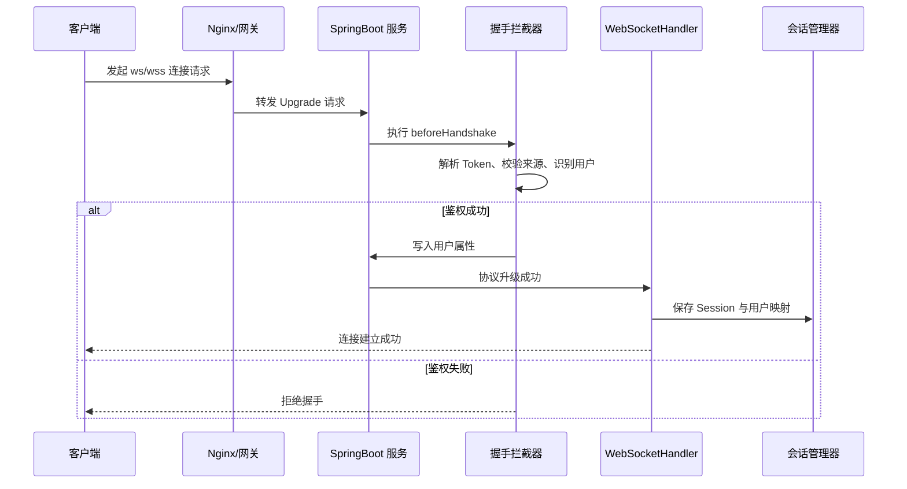

连接阶段的核心处理点如下：

| 阶段       | 处理内容                          | 说明                                            |
| ---------- | --------------------------------- | ----------------------------------------------- |
| 客户端连接 | 拼接 `ws://` 或 `wss://` 地址     | 通常携带 Token、客户端类型、设备标识等参数      |
| 网关转发   | 处理 HTTP Upgrade                 | Nginx 需要配置 `Upgrade` 和 `Connection` 请求头 |
| 握手拦截   | 执行 `HandshakeInterceptor`       | 校验 Token、来源、黑名单、连接频率              |
| 用户识别   | 写入 attributes 或 Principal      | 后续 Handler 可从 Session 中获取用户身份        |
| 连接建立   | 执行 `afterConnectionEstablished` | 记录连接日志，保存 Session                      |
| 会话绑定   | 用户 ID 与 Session 建立映射       | 支持单端或多端在线策略                          |

连接流程设计要点：

1. Token 鉴权应尽量放在握手阶段完成，避免未认证连接占用服务端长连接资源。
2. 握手阶段只做轻量校验，不建议执行耗时数据库查询或复杂业务逻辑。
3. 用户信息应写入 `WebSocketSession#getAttributes()` 或绑定到 `Principal`，便于后续消息处理和日志追踪。
4. 连接建立成功后，应立即注册到会话管理器，并记录用户 ID、Session ID、客户端 IP、连接时间等信息。
5. 握手失败应返回明确日志，但不应向客户端暴露过多认证细节。

### 消息收发流程

消息收发流程描述客户端发送消息后，服务端如何解析消息、校验参数、分发处理、执行业务逻辑并返回响应。原生 WebSocket 不提供固定消息协议，因此项目必须定义统一的消息结构和消息类型分发规则。

推荐消息收发流程如下：

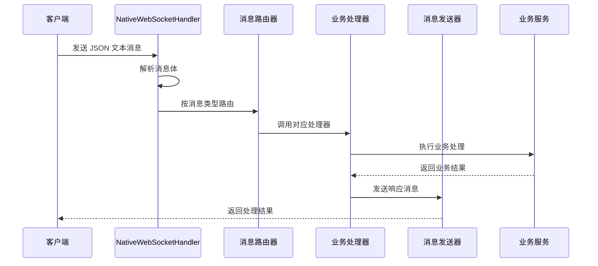

消息处理链路建议分为以下层次：

| 层级         | 职责                           | 典型类                                              |
| ------------ | ------------------------------ | --------------------------------------------------- |
| Handler 层   | 接收原始消息、处理连接生命周期 | `NativeWebSocketHandler`                            |
| Protocol 层  | 定义消息结构、类型、响应格式   | `WebSocketMessage`、`WebSocketResponse`             |
| Router 层    | 按消息类型查找处理器           | `WebSocketMessageRouter`                            |
| Processor 层 | 处理具体消息类型               | `HeartbeatMessageProcessor`、`DemoMessageProcessor` |
| Service 层   | 执行业务逻辑                   | 业务模块 Service                                    |
| Sender 层    | 封装服务端发送能力             | `WebSocketSender`                                   |

推荐消息基础结构如下：

```json
{
  "seq": "202605051030000001",
  "type": "demo.echo",
  "timestamp": 1777948200000,
  "data": {
    "content": "hello websocket"
  }
}
```

字段说明：

| 字段        | 类型   | 是否必填 | 说明                                   |
| ----------- | ------ | -------- | -------------------------------------- |
| `seq`       | String | 是       | 消息序列号，用于请求响应关联和日志追踪 |
| `type`      | String | 是       | 消息类型，用于服务端路由               |
| `timestamp` | Long   | 建议     | 客户端发送时间                         |
| `data`      | Object | 否       | 业务参数对象                           |

消息收发设计要点：

1. 客户端发送的所有业务消息必须包含 `type`。
2. 服务端应对消息体进行 JSON 格式校验和必填字段校验。
3. 未知消息类型应返回标准错误响应，而不是直接断开连接。
4. 业务异常应转换为统一错误消息，避免异常栈直接暴露给客户端。
5. 服务端发送消息前应判断 Session 是否仍然打开。
6. 单个 Session 不应并发直接发送消息，后续高并发场景应考虑发送队列或同步发送控制。Spring 官方文档也提示，底层标准 WebSocket Session 不支持并发发送，可通过 `ConcurrentWebSocketSessionDecorator` 进行包装。([Home](https://docs.spring.io/spring-framework/reference/web/websocket/server.html?utm_source=chatgpt.com))

### 用户会话关系

用户会话关系用于描述用户、设备、连接之间的映射方式。一个用户可能在多个浏览器、多个设备或多个页面中同时建立 WebSocket 连接，因此会话结构不应简单设计为 `userId -> session`，而应支持 `userId -> session集合`。

推荐会话关系如下：

```text
用户 userId
└── 设备 clientId / terminal
    └── WebSocketSession
        ├── sessionId
        ├── userId
        ├── clientIp
        ├── userAgent
        ├── connectedAt
        ├── lastHeartbeatAt
        └── attributes
```

单机内存结构建议如下：

```text
USER_SESSION_MAP
├── userId_10001
│   ├── sessionId_A -> WebSocketSession
│   └── sessionId_B -> WebSocketSession
├── userId_10002
│   └── sessionId_C -> WebSocketSession
└── userId_10003
    └── sessionId_D -> WebSocketSession
```

核心映射关系建议：

| 映射           | 数据结构                                     | 用途                          |
| -------------- | -------------------------------------------- | ----------------------------- |
| 用户到 Session | `Map<String, Map<String, WebSocketSession>>` | 按用户推送、多端管理          |
| Session 到用户 | `Map<String, String>`                        | 连接关闭时反向查找用户        |
| Session 元信息 | `Map<String, WebSocketUserSession>`          | 记录 IP、设备、心跳、连接时间 |
| 在线用户集合   | `Set<String>`                                | 快速统计在线用户              |
| 分组到用户     | `Map<String, Set<String>>`                   | 分组推送、房间推送            |

会话关系设计要点：

1. 用户 ID 应作为核心维度，Session ID 作为连接维度。
2. 单用户多端登录时，应允许一个用户对应多个 Session。
3. 如果业务只允许单端在线，应在新连接建立后关闭旧 Session。
4. 连接关闭时必须清理用户映射、Session 映射和元信息，避免内存泄漏。
5. 心跳时间应记录到 Session 元信息中，用于清理无效连接。
6. 集群部署时，本地 Map 只能表示当前实例的在线连接，不能表示全局在线状态。

### 服务端推送流程

服务端推送流程用于描述业务系统如何主动向客户端发送消息。推送动作可以由 HTTP 接口、定时任务、业务事件、消息队列或数据库变更触发，但最终都应收敛到统一的 WebSocket 推送服务中。

推荐服务端推送流程如下：

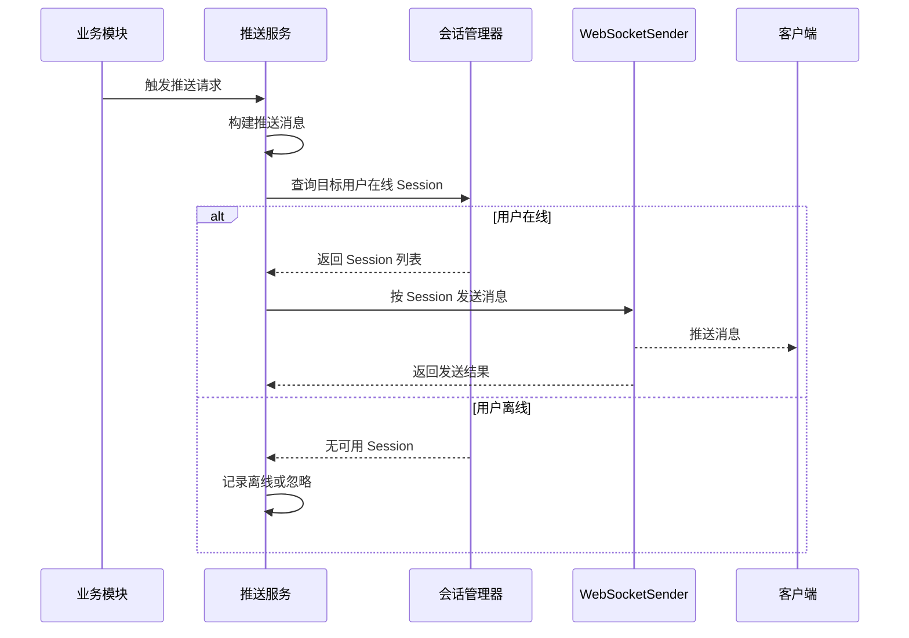

推送方式建议如下：

| 推送方式          | 说明                           | 适合场景                 |
| ----------------- | ------------------------------ | ------------------------ |
| 单用户推送        | 向指定用户所有在线连接发送消息 | 个人通知、任务进度       |
| 指定 Session 推送 | 向某个连接发送消息             | 请求响应、单页面状态反馈 |
| 多用户推送        | 向一批用户发送消息             | 审批提醒、角色通知       |
| 分组推送          | 向指定分组或房间发送消息       | 直播间、项目组、业务房间 |
| 全站广播          | 向所有在线用户发送消息         | 系统公告、全局刷新       |
| 条件推送          | 根据用户状态、权限、标签筛选   | 精准通知、运营消息       |

推送流程设计要点：

1. 业务模块不应直接操作 `WebSocketSession`，应调用统一的 `WebSocketSender` 或 `WebSocketPushService`。
2. 推送消息应统一包装为标准消息结构，包含 `type`、`seq`、`timestamp`、`data`。
3. 推送前应判断模块开关、用户在线状态、Session 是否打开。
4. 发送失败应记录日志，并根据消息重要程度决定是否重试或存储离线消息。
5. 广播推送需要控制频率，避免瞬时大量发送导致线程阻塞。
6. 集群部署时，当前实例只能推送本机连接；跨实例推送需要 Redis Pub/Sub、MQ 或统一连接路由表支持。

### 单机与集群架构差异

单机部署时，所有 WebSocket 连接都在同一个应用实例中，使用本地内存即可维护用户与 Session 的映射关系。集群部署时，用户连接会分散到多个应用实例，本地内存只能感知当前实例的连接，服务端推送和在线状态统计需要引入外部中间件协同。

单机架构如下：

```text
客户端 A ─┐
客户端 B ─┼── Nginx ── SpringBoot 实例 1 ── 本地 SessionManager
客户端 C ─┘
```

集群架构如下：

```text
客户端 A ─┐
客户端 B ─┼── Nginx/负载均衡 ── SpringBoot 实例 1 ── 本地 SessionManager
客户端 C ─┤                   ├─ SpringBoot 实例 2 ── 本地 SessionManager
客户端 D ─┘                   └─ SpringBoot 实例 3 ── 本地 SessionManager
                                      │
                                      ├── Redis：在线状态、连接路由、Pub/Sub
                                      └── MQ：业务事件广播、异步推送
```

差异对比如下：

| 对比项       | 单机架构               | 集群架构                           |
| ------------ | ---------------------- | ---------------------------------- |
| Session 存储 | 本地内存 Map           | 本地 Map + Redis/MQ 协同           |
| 在线用户统计 | 当前实例即全量         | 需要汇总多个实例                   |
| 单用户推送   | 直接查本地 Session     | 需要定位用户所在实例或广播推送     |
| 全站广播     | 遍历本地 Session       | 各实例分别广播本机连接             |
| 服务重启影响 | 所有连接断开           | 当前实例连接断开，其他实例不受影响 |
| 扩展能力     | 受单机连接数限制       | 可水平扩展                         |
| 实现复杂度   | 低                     | 中高                               |
| 适合阶段     | 开发、测试、小规模业务 | 生产、大量连接、多实例部署         |

集群设计建议：

1. 每个实例只保存本机真实 `WebSocketSession`，不要尝试将 Session 序列化到 Redis。
2. Redis 中只保存用户在线状态、实例 ID、Session ID、最后心跳时间等轻量元信息。
3. 单用户推送可以使用“连接路由表”定位实例，也可以通过 Redis Pub/Sub 广播到各实例后由本地判断是否有目标用户连接。
4. 全站广播可以通过 MQ 或 Redis 发布广播事件，由所有实例消费并推送本机连接。
5. 网关层可配置会话粘滞，但不能完全依赖粘滞解决推送路由问题。
6. 服务下线前应主动关闭本机连接或通知客户端重连，避免客户端长时间等待。

## WebSocket 基础配置

WebSocket 基础配置用于完成模块启用、Handler 注册、连接路径配置、跨域来源控制、握手拦截器和自定义握手处理器配置。Spring 的原生 WebSocket 配置方式支持通过 `HandshakeInterceptor` 自定义握手前后逻辑，也支持通过 `DefaultHandshakeHandler` 扩展握手处理过程，例如校验来源、协商子协议、绑定用户身份等。([Home](https://docs.spring.io/spring-framework/reference/web/websocket/server.html?utm_source=chatgpt.com))

本节涉及的核心文件如下：

```text
src/main/java/io/github/atengk/websocket
├── config
│   ├── WebSocketConfig.java
│   └── WebSocketProperties.java
├── handler
│   └── NativeWebSocketHandler.java
├── handshake
│   ├── UserHandshakeHandler.java
│   └── WebSocketPrincipal.java
└── interceptor
    └── TokenHandshakeInterceptor.java
```

### 启用 WebSocket 支持

启用 WebSocket 支持需要在配置类上添加 `@EnableWebSocket`，并实现 `WebSocketConfigurer` 接口。该配置类负责把自定义 Handler 注册到指定路径，同时挂载握手拦截器、自定义握手处理器和跨域来源配置。

文件位置：`src/main/java/io/github/atengk/websocket/config/WebSocketProperties.java`

下面的配置类用于绑定 `application.yml` 中的 `websocket.*` 配置项，后续注册 Handler、配置跨域、解析 Token 时都会使用该配置。

```java
package io.github.atengk.websocket.config;

import cn.hutool.core.collection.CollUtil;
import lombok.Data;
import org.springframework.boot.context.properties.ConfigurationProperties;

import java.util.List;

/**
 * WebSocket 配置属性
 *
 * @author Ateng
 * @since 2026-05-05
 */
@Data
@ConfigurationProperties(prefix = "websocket")
public class WebSocketProperties {

    /**
     * 是否启用 WebSocket 模块
     */
    private Boolean enabled = true;

    /**
     * WebSocket 连接路径
     */
    private String path = "/ws/native";

    /**
     * 允许跨域来源
     */
    private List<String> allowedOrigins = CollUtil.newArrayList();

    /**
     * Token 参数名称
     */
    private String tokenName = "token";

    /**
     * 是否允许单用户多端连接
     */
    private Boolean allowMultiSession = true;

    /**
     * 单用户最大连接数
     */
    private Integer maxSessionPerUser = 5;

    /**
     * 文本消息最大长度
     */
    private Integer maxTextMessageSize = 65536;

    /**
     * 二进制消息最大长度
     */
    private Integer maxBinaryMessageSize = 65536;

    /**
     * 连接空闲超时时间，单位：秒
     */
    private Integer idleTimeoutSeconds = 300;

    /**
     * 心跳间隔，单位：秒
     */
    private Integer heartbeatIntervalSeconds = 30;

    /**
     * 心跳超时时间，单位：秒
     */
    private Integer heartbeatTimeoutSeconds = 90;

    /**
     * 是否开启服务端主动推送
     */
    private Boolean pushEnabled = true;

    /**
     * 是否打印消息明细日志
     */
    private Boolean messageDetailLogEnabled = false;

}
```

配置属性类启用后，`application.yml` 中的配置即可被自动注入。建议所有 WebSocket 可变参数都放入配置文件，不要硬编码在 Handler 或拦截器中。

### WebSocketHandler 注册

`WebSocketHandler` 是服务端处理连接生命周期和消息入口的核心组件。Spring 官方文档说明，`WebSocketHandler` 提供了连接建立、消息到达、传输异常、连接关闭等生命周期方法；`TextWebSocketHandler` 是一个只处理文本消息的便捷基类，二进制消息默认会被拒绝。([Home](https://docs.spring.io/spring-framework/docs/6.0.0-M5/javadoc-api/org/springframework/web/socket/WebSocketHandler.html?utm_source=chatgpt.com))

文件位置：`src/main/java/io/github/atengk/websocket/handler/NativeWebSocketHandler.java`

下面的 Handler 只保留基础生命周期处理，完整消息路由、会话管理和发送能力会在后续章节继续扩展。

```java
package io.github.atengk.websocket.handler;

import cn.hutool.core.util.StrUtil;
import io.github.atengk.websocket.config.WebSocketProperties;
import lombok.RequiredArgsConstructor;
import lombok.extern.slf4j.Slf4j;
import org.springframework.stereotype.Component;
import org.springframework.web.socket.BinaryMessage;
import org.springframework.web.socket.CloseStatus;
import org.springframework.web.socket.PongMessage;
import org.springframework.web.socket.TextMessage;
import org.springframework.web.socket.WebSocketSession;
import org.springframework.web.socket.handler.TextWebSocketHandler;

/**
 * 原生 WebSocket 消息处理器
 *
 * @author Ateng
 * @since 2026-05-05
 */
@Slf4j
@Component
@RequiredArgsConstructor
public class NativeWebSocketHandler extends TextWebSocketHandler {

    private final WebSocketProperties webSocketProperties;

    /**
     * 连接建立成功后执行
     *
     * @param session WebSocket 会话
     */
    @Override
    public void afterConnectionEstablished(WebSocketSession session) {
        session.setTextMessageSizeLimit(webSocketProperties.getMaxTextMessageSize());
        session.setBinaryMessageSizeLimit(webSocketProperties.getMaxBinaryMessageSize());

        String userId = getUserId(session);
        log.info("WebSocket 连接建立成功，userId={}，sessionId={}，remoteAddress={}",
                userId, session.getId(), session.getRemoteAddress());
    }

    /**
     * 接收文本消息
     *
     * @param session WebSocket 会话
     * @param message 文本消息
     */
    @Override
    protected void handleTextMessage(WebSocketSession session, TextMessage message) {
        String userId = getUserId(session);
        String payload = message.getPayload();

        if (Boolean.TRUE.equals(webSocketProperties.getMessageDetailLogEnabled())) {
            log.info("WebSocket 接收文本消息，userId={}，sessionId={}，payload={}",
                    userId, session.getId(), payload);
        } else {
            log.info("WebSocket 接收文本消息，userId={}，sessionId={}，payloadLength={}",
                    userId, session.getId(), StrUtil.length(payload));
        }

        // 后续章节接入 WebSocketMessageRouter，在这里完成消息解析、校验和路由分发
    }

    /**
     * 接收二进制消息
     *
     * @param session WebSocket 会话
     * @param message 二进制消息
     */
    @Override
    protected void handleBinaryMessage(WebSocketSession session, BinaryMessage message) {
        log.warn("WebSocket 暂不处理二进制消息，sessionId={}，payloadLength={}",
                session.getId(), message.getPayloadLength());
    }

    /**
     * 接收 Pong 消息
     *
     * @param session WebSocket 会话
     * @param message Pong 消息
     */
    @Override
    protected void handlePongMessage(WebSocketSession session, PongMessage message) {
        log.debug("WebSocket 接收 Pong 消息，sessionId={}，payloadLength={}",
                session.getId(), message.getPayloadLength());
    }

    /**
     * 传输异常处理
     *
     * @param session   WebSocket 会话
     * @param exception 异常信息
     */
    @Override
    public void handleTransportError(WebSocketSession session, Throwable exception) {
        log.error("WebSocket 传输异常，sessionId={}，remoteAddress={}",
                session.getId(), session.getRemoteAddress(), exception);
    }

    /**
     * 连接关闭后执行
     *
     * @param session     WebSocket 会话
     * @param closeStatus 关闭状态
     */
    @Override
    public void afterConnectionClosed(WebSocketSession session, CloseStatus closeStatus) {
        String userId = getUserId(session);
        log.info("WebSocket 连接关闭，userId={}，sessionId={}，code={}，reason={}",
                userId, session.getId(), closeStatus.getCode(), closeStatus.getReason());
    }

    /**
     * 从 Session 中获取用户 ID
     *
     * @param session WebSocket 会话
     * @return 用户 ID
     */
    private String getUserId(WebSocketSession session) {
        Object userId = session.getAttributes().get("userId");
        return userId == null ? "anonymous" : String.valueOf(userId);
    }

}
```

Handler 注册配置如下。

文件位置：`src/main/java/io/github/atengk/websocket/config/WebSocketConfig.java`

下面的配置类负责启用 WebSocket、注册 Handler、设置访问路径、配置握手拦截器、自定义握手处理器和允许跨域来源。

```java
package io.github.atengk.websocket.config;

import cn.hutool.core.collection.CollUtil;
import cn.hutool.core.util.BooleanUtil;
import io.github.atengk.websocket.handler.NativeWebSocketHandler;
import io.github.atengk.websocket.handshake.UserHandshakeHandler;
import io.github.atengk.websocket.interceptor.TokenHandshakeInterceptor;
import lombok.RequiredArgsConstructor;
import lombok.extern.slf4j.Slf4j;
import org.springframework.boot.context.properties.EnableConfigurationProperties;
import org.springframework.context.annotation.Configuration;
import org.springframework.web.socket.config.annotation.EnableWebSocket;
import org.springframework.web.socket.config.annotation.WebSocketConfigurer;
import org.springframework.web.socket.config.annotation.WebSocketHandlerRegistration;
import org.springframework.web.socket.config.annotation.WebSocketHandlerRegistry;

/**
 * WebSocket 基础配置
 *
 * @author Ateng
 * @since 2026-05-05
 */
@Slf4j
@Configuration
@EnableWebSocket
@RequiredArgsConstructor
@EnableConfigurationProperties(WebSocketProperties.class)
public class WebSocketConfig implements WebSocketConfigurer {

    private final WebSocketProperties webSocketProperties;
    private final NativeWebSocketHandler nativeWebSocketHandler;
    private final TokenHandshakeInterceptor tokenHandshakeInterceptor;
    private final UserHandshakeHandler userHandshakeHandler;

    /**
     * 注册 WebSocketHandler
     *
     * @param registry WebSocketHandler 注册器
     */
    @Override
    public void registerWebSocketHandlers(WebSocketHandlerRegistry registry) {
        if (BooleanUtil.isFalse(webSocketProperties.getEnabled())) {
            log.warn("WebSocket 模块未启用，跳过 Handler 注册");
            return;
        }

        WebSocketHandlerRegistration registration = registry
                .addHandler(nativeWebSocketHandler, webSocketProperties.getPath())
                .addInterceptors(tokenHandshakeInterceptor)
                .setHandshakeHandler(userHandshakeHandler);

        if (CollUtil.isNotEmpty(webSocketProperties.getAllowedOrigins())) {
            registration.setAllowedOrigins(webSocketProperties.getAllowedOrigins().toArray(new String[0]));
        }

        log.info("WebSocket Handler 注册完成，path={}，allowedOrigins={}",
                webSocketProperties.getPath(), webSocketProperties.getAllowedOrigins());
    }

}
```

注册完成后，客户端连接地址示例：

```text
ws://localhost:8080/api/ws/native?token=dev-10001
```

如果生产环境启用了 HTTPS，则浏览器端应使用 `wss://`：

```text
wss://www.example.com/api/ws/native?token=真实访问令牌
```

### WebSocket 访问路径配置

WebSocket 访问路径应作为配置项统一管理，避免多个环境、多个服务或多个网关规则下出现路径不一致。路径设计应与普通 HTTP 接口区分，便于 Nginx、网关、日志和监控单独识别长连接请求。

推荐路径设计如下：

| 环境     | 连接地址示例                                        | 说明                     |
| -------- | --------------------------------------------------- | ------------------------ |
| 本地开发 | `ws://localhost:8080/api/ws/native?token=dev-10001` | 用于本地前后端联调       |
| 测试环境 | `wss://test.example.com/api/ws/native?token=xxx`    | 通过测试域名访问         |
| 生产环境 | `wss://www.example.com/api/ws/native?token=xxx`     | 必须使用 HTTPS/WSS       |
| 管理后台 | `wss://admin.example.com/api/ws/native?token=xxx`   | 后台可单独配置来源白名单 |

配置文件示例：

```yaml
websocket:
  # WebSocket 访问路径，需与 WebSocketConfig 中注册路径保持一致
  path: /ws/native
```

路径规划建议：

1. 不建议直接使用根路径 `/ws`，避免和未来其他 WebSocket 模块冲突。
2. 可以按业务拆分路径，例如 `/ws/notice`、`/ws/im`、`/ws/monitor`。
3. 如果系统只有一个 WebSocket 通道，建议统一使用 `/ws/native`，再通过消息类型区分业务。
4. 如果经过网关转发，需要确认外部路径和应用内部 `context-path` 的组合关系。
5. 前端拼接地址时，应根据当前页面协议自动选择 `ws://` 或 `wss://`。

前端地址拼接示例：

```javascript
const protocol = window.location.protocol === 'https:' ? 'wss:' : 'ws:'
const host = window.location.host
const token = encodeURIComponent('dev-10001')
const wsUrl = `${protocol}//${host}/api/ws/native?token=${token}`

const socket = new WebSocket(wsUrl)
```

### 允许跨域配置

浏览器发起 WebSocket 握手时会携带 `Origin` 请求头，服务端应对来源进行限制。Spring 默认只允许同源请求，也支持配置指定来源或允许所有来源；指定来源需要以 `http://` 或 `https://` 开头，允许所有来源可以使用 `*`。生产环境不建议使用 `*`，应配置明确的前端域名。([Home](https://docs.spring.io/spring-framework/reference/web/websocket/server.html?utm_source=chatgpt.com))

开发环境配置示例：

```yaml
websocket:
  # 开发环境允许本地前端项目访问
  allowed-origins:
    - "http://localhost:5173"
    - "http://127.0.0.1:5173"
```

生产环境配置示例：

```yaml
websocket:
  # 生产环境只允许正式域名访问
  allowed-origins:
    - "https://www.example.com"
    - "https://admin.example.com"
```

跨域配置建议：

| 场景       | 配置建议                        | 说明                       |
| ---------- | ------------------------------- | -------------------------- |
| 本地开发   | 允许 `localhost` 和 `127.0.0.1` | 便于前后端分离联调         |
| 测试环境   | 允许测试域名                    | 避免其他来源连接测试服务   |
| 生产环境   | 只允许正式域名                  | 降低恶意站点发起连接的风险 |
| 临时排查   | 可短时间使用 `*`                | 排查后应立即恢复白名单     |
| 多租户系统 | 按租户域名动态配置              | 可结合配置中心或数据库     |

注意事项：

1. `allowed-origins` 只校验浏览器来源，不等于完整安全防护。
2. 非浏览器客户端可以伪造 `Origin`，因此仍必须做 Token 鉴权。
3. 如果启用 Nginx 或网关，应确认网关没有错误覆盖 `Origin` 请求头。
4. 生产环境跨域白名单应纳入发布检查项。

### 握手拦截器配置

握手拦截器用于在 WebSocket 协议升级前执行前置逻辑。Spring 官方文档说明，`HandshakeInterceptor` 可以在握手前后执行逻辑，也可以在握手阶段阻止连接建立，并将属性传递给后续的 `WebSocketSession`。([Home](https://docs.spring.io/spring-framework/reference/web/websocket/server.html?utm_source=chatgpt.com))

本项目中，握手拦截器主要负责：

| 功能       | 说明                                       |
| ---------- | ------------------------------------------ |
| Token 获取 | 从 query、header 中解析 Token              |
| Token 校验 | 判断 Token 是否为空、是否有效              |
| 用户识别   | 从 Token 中解析用户 ID                     |
| 属性绑定   | 将 `userId`、`token` 等信息写入 attributes |
| 连接准入   | 鉴权失败时返回 `false`，拒绝建立连接       |
| 日志记录   | 记录连接来源、用户标识和失败原因           |

文件位置：`src/main/java/io/github/atengk/websocket/interceptor/TokenHandshakeInterceptor.java`

下面的握手拦截器演示从 URL 参数或 `Authorization` 请求头中解析 Token，并将用户 ID 写入 WebSocket 会话属性。生产环境应替换 `parseUserId` 方法，接入 Sa-Token、Spring Security、JWT 或公司统一认证服务。

```java
package io.github.atengk.websocket.interceptor;

import cn.hutool.core.util.StrUtil;
import io.github.atengk.websocket.config.WebSocketProperties;
import lombok.RequiredArgsConstructor;
import lombok.extern.slf4j.Slf4j;
import org.springframework.http.HttpHeaders;
import org.springframework.http.server.ServerHttpRequest;
import org.springframework.http.server.ServerHttpResponse;
import org.springframework.stereotype.Component;
import org.springframework.web.socket.WebSocketHandler;
import org.springframework.web.socket.server.HandshakeInterceptor;
import org.springframework.web.util.UriComponentsBuilder;

import java.net.URI;
import java.util.Map;

/**
 * Token 握手拦截器
 *
 * @author Ateng
 * @since 2026-05-05
 */
@Slf4j
@Component
@RequiredArgsConstructor
public class TokenHandshakeInterceptor implements HandshakeInterceptor {

    public static final String ATTR_USER_ID = "userId";
    public static final String ATTR_TOKEN = "token";

    private final WebSocketProperties webSocketProperties;

    /**
     * 握手前处理
     *
     * @param request    HTTP 请求
     * @param response   HTTP 响应
     * @param wsHandler  WebSocketHandler
     * @param attributes WebSocketSession 属性
     * @return 是否允许握手
     */
    @Override
    public boolean beforeHandshake(ServerHttpRequest request,
                                   ServerHttpResponse response,
                                   WebSocketHandler wsHandler,
                                   Map<String, Object> attributes) {
        String token = resolveToken(request);
        if (StrUtil.isBlank(token)) {
            log.warn("WebSocket 握手失败，Token 为空，uri={}", request.getURI());
            return false;
        }

        String userId = parseUserId(token);
        if (StrUtil.isBlank(userId)) {
            log.warn("WebSocket 握手失败，Token 无效，uri={}", request.getURI());
            return false;
        }

        attributes.put(ATTR_USER_ID, userId);
        attributes.put(ATTR_TOKEN, token);

        log.info("WebSocket 握手鉴权成功，userId={}，remoteAddress={}", userId, request.getRemoteAddress());
        return true;
    }

    /**
     * 握手后处理
     *
     * @param request   HTTP 请求
     * @param response  HTTP 响应
     * @param wsHandler WebSocketHandler
     * @param exception 异常信息
     */
    @Override
    public void afterHandshake(ServerHttpRequest request,
                               ServerHttpResponse response,
                               WebSocketHandler wsHandler,
                               Exception exception) {
        if (exception != null) {
            log.error("WebSocket 握手后处理异常，uri={}", request.getURI(), exception);
        }
    }

    /**
     * 解析 Token
     *
     * @param request HTTP 请求
     * @return Token
     */
    private String resolveToken(ServerHttpRequest request) {
        String token = resolveTokenFromQuery(request.getURI());
        if (StrUtil.isNotBlank(token)) {
            return token;
        }

        HttpHeaders headers = request.getHeaders();
        String authorization = headers.getFirst(HttpHeaders.AUTHORIZATION);
        if (StrUtil.startWithIgnoreCase(authorization, "Bearer ")) {
            return StrUtil.removePrefixIgnoreCase(authorization, "Bearer ");
        }

        return authorization;
    }

    /**
     * 从 URL 参数中解析 Token
     *
     * @param uri 请求 URI
     * @return Token
     */
    private String resolveTokenFromQuery(URI uri) {
        return UriComponentsBuilder.fromUri(uri)
                .build()
                .getQueryParams()
                .getFirst(webSocketProperties.getTokenName());
    }

    /**
     * 根据 Token 解析用户 ID
     *
     * @param token Token
     * @return 用户 ID
     */
    private String parseUserId(String token) {
        // 示例逻辑：dev-10001 解析为 10001。生产环境应替换为真实认证逻辑。
        if (StrUtil.startWithIgnoreCase(token, "dev-")) {
            return StrUtil.removePrefixIgnoreCase(token, "dev-");
        }

        // 示例兼容：直接把 token 当作 userId。生产环境不建议这样处理。
        return token;
    }

}
```

握手拦截器配置已经在 `WebSocketConfig` 中完成：

```java
registry.addHandler(nativeWebSocketHandler, webSocketProperties.getPath())
        .addInterceptors(tokenHandshakeInterceptor)
        .setHandshakeHandler(userHandshakeHandler);
```

验证方式：

```bash
# 使用 websocat 测试，token=dev-10001 会被解析为 userId=10001
websocat "ws://localhost:8080/api/ws/native?token=dev-10001"
```

如果没有安装 `websocat`，也可以在浏览器控制台测试：

```javascript
const socket = new WebSocket('ws://localhost:8080/api/ws/native?token=dev-10001')

socket.onopen = () => {
  console.log('连接成功')
  socket.send(JSON.stringify({
    seq: '1000001',
    type: 'demo.echo',
    timestamp: Date.now(),
    data: {
      content: 'hello websocket'
    }
  }))
}

socket.onmessage = event => {
  console.log('收到服务端消息', event.data)
}

socket.onclose = event => {
  console.log('连接关闭', event.code, event.reason)
}
```

### 自定义握手处理器

自定义握手处理器用于扩展 WebSocket 握手阶段的处理逻辑。常见用途包括绑定用户 `Principal`、处理子协议协商、适配特殊容器升级策略、记录握手上下文等。Spring 官方文档说明，更高级的握手定制可以通过扩展 `DefaultHandshakeHandler` 实现。([Home](https://docs.spring.io/spring-framework/reference/web/websocket/server.html?utm_source=chatgpt.com))

本项目推荐在握手拦截器中完成 Token 校验和 attributes 写入，在自定义握手处理器中将用户 ID 绑定为 `Principal`，便于后续通过 `session.getPrincipal()` 获取当前连接用户。

文件位置：`src/main/java/io/github/atengk/websocket/handshake/WebSocketPrincipal.java`

下面的 Principal 用于表示 WebSocket 连接中的当前用户身份。

```java
package io.github.atengk.websocket.handshake;

import java.security.Principal;

/**
 * WebSocket 用户身份
 *
 * @author Ateng
 * @since 2026-05-05
 */
public record WebSocketPrincipal(String name) implements Principal {
}
```

文件位置：`src/main/java/io/github/atengk/websocket/handshake/UserHandshakeHandler.java`

下面的自定义握手处理器会从握手拦截器写入的 attributes 中读取 `userId`，并绑定为当前 WebSocket 连接的 `Principal`。

```java
package io.github.atengk.websocket.handshake;

import cn.hutool.core.convert.Convert;
import cn.hutool.core.util.StrUtil;
import io.github.atengk.websocket.interceptor.TokenHandshakeInterceptor;
import lombok.extern.slf4j.Slf4j;
import org.springframework.http.server.ServerHttpRequest;
import org.springframework.stereotype.Component;
import org.springframework.web.socket.WebSocketHandler;
import org.springframework.web.socket.server.support.DefaultHandshakeHandler;

import java.security.Principal;
import java.util.Map;

/**
 * 用户握手处理器
 *
 * @author Ateng
 * @since 2026-05-05
 */
@Slf4j
@Component
public class UserHandshakeHandler extends DefaultHandshakeHandler {

    /**
     * 确定当前 WebSocket 连接用户
     *
     * @param request    HTTP 请求
     * @param wsHandler  WebSocketHandler
     * @param attributes WebSocketSession 属性
     * @return 用户身份
     */
    @Override
    protected Principal determineUser(ServerHttpRequest request,
                                      WebSocketHandler wsHandler,
                                      Map<String, Object> attributes) {
        String userId = Convert.toStr(attributes.get(TokenHandshakeInterceptor.ATTR_USER_ID));
        if (StrUtil.isBlank(userId)) {
            log.warn("WebSocket 绑定用户身份失败，userId 为空，uri={}", request.getURI());
            return super.determineUser(request, wsHandler, attributes);
        }

        log.debug("WebSocket 绑定用户身份成功，userId={}", userId);
        return new WebSocketPrincipal(userId);
    }

}
```

绑定后，Handler 中可以通过以下方式获取用户身份：

```java
Principal principal = session.getPrincipal();
String userId = principal == null ? "anonymous" : principal.getName();
```

自定义握手处理器设计建议：

1. 握手拦截器负责“是否允许连接”，自定义握手处理器负责“如何表示当前用户”。
2. `Principal#getName()` 建议返回系统内唯一用户 ID，不建议返回昵称、手机号或其他可变字段。
3. 如果系统有租户概念，可以将 `tenantId` 放入 `session.getAttributes()`，不要强行塞进 `Principal#getName()`。
4. 如果需要支持子协议，可以在握手处理器中扩展协议协商逻辑。
5. 如果后续接入 Spring Security，可将认证对象与 WebSocket 用户身份映射规则统一，避免 HTTP 用户和 WebSocket 用户不一致。

本节完成后，WebSocket 基础配置已经具备以下能力：

| 能力                            | 状态   |
| ------------------------------- | ------ |
| 启用 WebSocket                  | 已完成 |
| 注册 Handler                    | 已完成 |
| 配置连接路径                    | 已完成 |
| 配置跨域来源                    | 已完成 |
| 握手阶段 Token 解析             | 已完成 |
| 用户身份写入 Session attributes | 已完成 |
| 用户身份绑定 Principal          | 已完成 |
| 基础生命周期日志                | 已完成 |

后续章节可以在此基础上继续扩展连接鉴权、会话管理、消息协议、消息路由、推送服务、心跳保活和集群部署能力。


## 连接鉴权设计

连接鉴权设计用于保证只有合法客户端能够建立 WebSocket 长连接，并且服务端能够在连接建立后准确识别当前连接对应的用户、租户、设备和权限信息。WebSocket 鉴权通常在握手阶段完成，握手成功后再将用户身份绑定到 `WebSocketSession` 和 `Principal` 中，供后续消息处理、会话管理和服务端推送使用。

### Token 参数传递方式

Token 参数传递方式需要结合客户端类型选择。浏览器原生 `WebSocket` 构造函数主要接收 `url` 和可选 `protocols` 参数，不能像 `fetch` 或 `axios` 一样直接设置任意自定义请求头；MDN 文档中 `WebSocket()` 构造函数语法也只包含 `new WebSocket(url)` 和 `new WebSocket(url, protocols)` 两种形式。([MDN Web Docs](https://developer.mozilla.org/docs/Web/API/WebSocket/WebSocket?utm_source=chatgpt.com)) 因此，浏览器场景下更常见的方式是 URL 参数、Cookie 或子协议参数；非浏览器客户端可以使用请求头方式。

推荐传递方式如下：

| 方式                   | 示例                                | 适用客户端                       | 推荐度 | 说明                                                    |
| ---------------------- | ----------------------------------- | -------------------------------- | ------ | ------------------------------------------------------- |
| URL Query              | `ws://host/api/ws/native?token=xxx` | 浏览器、App、小程序、测试工具    | 高     | 简单直观，便于调试，但要避免 Token 被日志长期记录       |
| Cookie                 | 浏览器自动携带                      | 浏览器同域或受控跨域场景         | 中     | 适合已有登录态系统，但要处理 SameSite、跨域和 CSRF 风险 |
| Authorization Header   | `Authorization: Bearer xxx`         | Java、Go、Node、移动端原生客户端 | 中     | 浏览器原生 WebSocket 不方便设置，适合非浏览器客户端     |
| Sec-WebSocket-Protocol | `new WebSocket(url, ['token.xxx'])` | 浏览器                           | 低     | 本意是协商子协议，不建议作为常规 Token 通道             |
| 首条消息鉴权           | 连接后第一条消息发送 Token          | 所有客户端                       | 低     | 未鉴权连接会先占用服务端资源，不适合高并发场景          |

浏览器端推荐使用 URL Query：

```javascript
const token = encodeURIComponent('dev-10001')
const socket = new WebSocket(`ws://localhost:8080/api/ws/native?token=${token}`)

socket.onopen = () => {
  console.log('WebSocket 连接成功')
}

socket.onerror = event => {
  console.error('WebSocket 连接异常', event)
}
```

非浏览器客户端可以使用 Header 传递，例如 Java、Go、Node.js、Postman、Apifox、websocat 等工具。服务端可同时兼容 Query 和 Header，但建议在团队内统一一种主通道，避免排查问题时出现“有的客户端从参数取，有的客户端从请求头取”的混乱情况。

Token 传递建议：

1. 浏览器前端优先使用 URL Query 或 Cookie。
2. 生产环境必须使用 `wss://`，避免 Token 明文传输。
3. Nginx、网关和应用日志不要完整打印 Token。
4. Token 只用于识别身份，不应把用户敏感信息直接放入连接参数。
5. 如果 Token 有过期时间，服务端应在心跳或业务消息阶段补充过期校验。

### 握手阶段鉴权

握手阶段鉴权发生在 HTTP Upgrade 之前。服务端在 `beforeHandshake` 中解析 Token、校验 Token、识别用户、检查连接权限，全部通过后才允许连接升级为 WebSocket。Spring 的 `HandshakeInterceptor#beforeHandshake` 返回 `false` 时可以中止握手，并可通过 `ServerHttpResponse` 设置响应状态。([Home](https://docs.spring.io/spring-framework/docs/7.0.0-M6/javadoc-api/org/springframework/web/socket/server/HandshakeInterceptor.html?utm_source=chatgpt.com))

推荐鉴权流程如下：

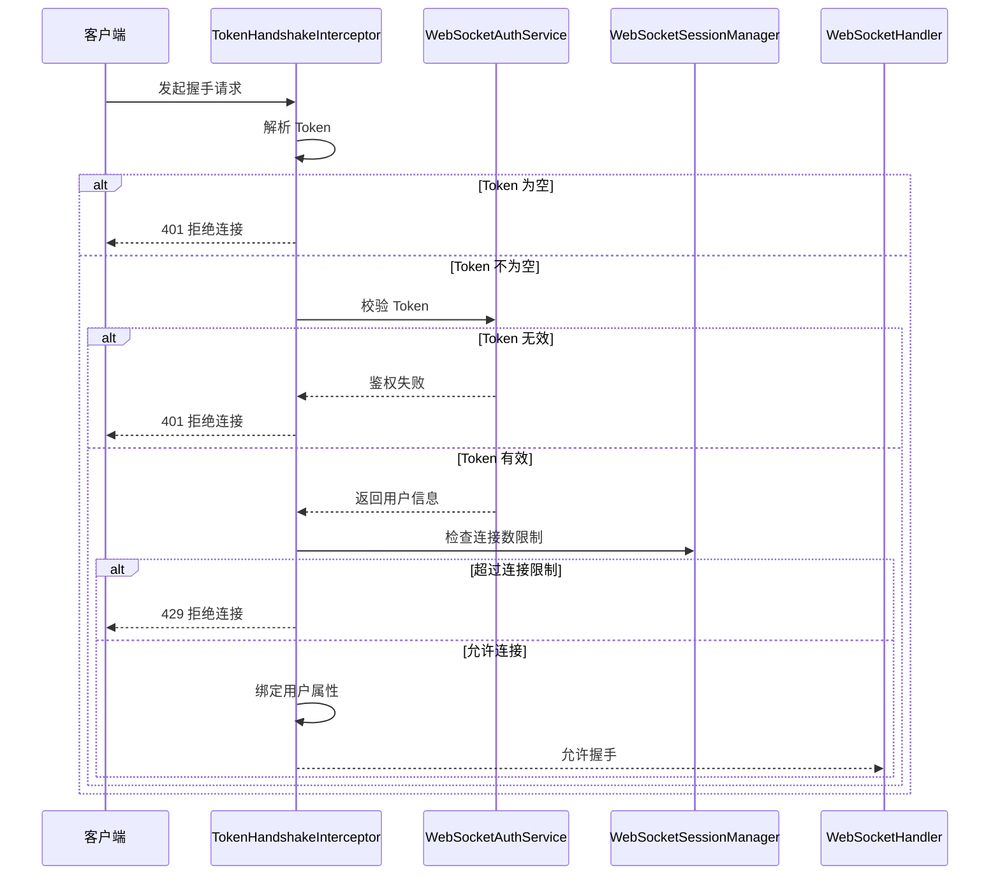

本节建议新增以下文件：

```text
src/main/java/io/github/atengk/websocket
├── auth
│   ├── WebSocketAuthService.java
│   ├── DefaultWebSocketAuthService.java
│   └── WebSocketAuthUser.java
├── constant
│   └── WebSocketAttributeKeys.java
├── interceptor
│   └── TokenHandshakeInterceptor.java
└── session
    ├── WebSocketSessionManager.java
    └── WebSocketUserSession.java
```

文件位置：`src/main/java/io/github/atengk/websocket/constant/WebSocketAttributeKeys.java`

该常量类用于统一维护写入 `WebSocketSession#getAttributes()` 的属性名称，避免各个类中硬编码字符串。

```java
package io.github.atengk.websocket.constant;

/**
 * WebSocket 会话属性键
 *
 * @author Ateng
 * @since 2026-05-05
 */
public final class WebSocketAttributeKeys {

    /**
     * 用户 ID
     */
    public static final String USER_ID = "userId";

    /**
     * 租户 ID
     */
    public static final String TENANT_ID = "tenantId";

    /**
     * 用户名
     */
    public static final String USERNAME = "username";

    /**
     * 访问令牌
     */
    public static final String TOKEN = "token";

    /**
     * 鉴权用户对象
     */
    public static final String AUTH_USER = "authUser";

    /**
     * 客户端 IP
     */
    public static final String CLIENT_IP = "clientIp";

    /**
     * User-Agent
     */
    public static final String USER_AGENT = "userAgent";

    private WebSocketAttributeKeys() {
    }

}
```

### 用户身份解析

用户身份解析应封装为独立服务，避免握手拦截器直接依赖某一种认证框架。后续如果项目接入 Sa-Token、Spring Security、JWT、OAuth2 或公司统一认证中心，只需要替换 `WebSocketAuthService` 的实现，不需要改动 Handler 和会话管理逻辑。

文件位置：`src/main/java/io/github/atengk/websocket/auth/WebSocketAuthUser.java`

该对象用于表示 WebSocket 握手成功后解析出的用户身份信息。

```java
package io.github.atengk.websocket.auth;

import java.io.Serializable;

/**
 * WebSocket 鉴权用户
 *
 * @author Ateng
 * @since 2026-05-05
 */
public record WebSocketAuthUser(
        String userId,
        String username,
        String tenantId,
        String token
) implements Serializable {
}
```

文件位置：`src/main/java/io/github/atengk/websocket/auth/WebSocketAuthService.java`

该接口定义 Token 鉴权和连接权限校验能力，业务系统可以按实际认证体系实现。

```java
package io.github.atengk.websocket.auth;

import org.springframework.http.server.ServerHttpRequest;

import java.util.Optional;

/**
 * WebSocket 鉴权服务
 *
 * @author Ateng
 * @since 2026-05-05
 */
public interface WebSocketAuthService {

    /**
     * 根据 Token 解析用户身份
     *
     * @param token 访问令牌
     * @return 鉴权用户
     */
    Optional<WebSocketAuthUser> authenticate(String token);

    /**
     * 判断用户是否允许建立 WebSocket 连接
     *
     * @param authUser 鉴权用户
     * @param request  握手请求
     * @return 是否允许连接
     */
    boolean hasConnectionPermission(WebSocketAuthUser authUser, ServerHttpRequest request);

}
```

文件位置：`src/main/java/io/github/atengk/websocket/auth/DefaultWebSocketAuthService.java`

下面的默认实现仅用于开发和文档示例：`dev-10001` 会被解析为用户 `10001`。生产环境应替换为真实 Token 校验逻辑，例如校验 JWT 签名、查询 Redis 登录态、调用认证中心或使用 Sa-Token 获取当前登录用户。

```java
package io.github.atengk.websocket.auth;

import cn.hutool.core.util.StrUtil;
import lombok.extern.slf4j.Slf4j;
import org.springframework.http.server.ServerHttpRequest;
import org.springframework.stereotype.Service;

import java.util.Optional;

/**
 * 默认 WebSocket 鉴权服务
 *
 * @author Ateng
 * @since 2026-05-05
 */
@Slf4j
@Service
public class DefaultWebSocketAuthService implements WebSocketAuthService {

    /**
     * 根据 Token 解析用户身份
     *
     * @param token 访问令牌
     * @return 鉴权用户
     */
    @Override
    public Optional<WebSocketAuthUser> authenticate(String token) {
        if (StrUtil.isBlank(token)) {
            return Optional.empty();
        }

        // 开发环境示例：dev-10001 -> userId=10001
        if (StrUtil.startWithIgnoreCase(token, "dev-")) {
            String userId = StrUtil.removePrefixIgnoreCase(token, "dev-");
            if (StrUtil.isBlank(userId)) {
                return Optional.empty();
            }

            WebSocketAuthUser authUser = new WebSocketAuthUser(userId, "用户" + userId, "default", token);
            return Optional.of(authUser);
        }

        log.warn("WebSocket Token 校验失败，当前仅支持 dev- 前缀测试 Token");
        return Optional.empty();
    }

    /**
     * 判断用户是否允许建立 WebSocket 连接
     *
     * @param authUser 鉴权用户
     * @param request  握手请求
     * @return 是否允许连接
     */
    @Override
    public boolean hasConnectionPermission(WebSocketAuthUser authUser, ServerHttpRequest request) {
        // 示例逻辑：只要 Token 有效就允许连接。生产环境可在这里判断用户状态、租户状态、黑名单、IP 等。
        return authUser != null && StrUtil.isNotBlank(authUser.userId());
    }

}
```

用户身份解析建议：

1. `userId` 必须稳定且唯一，不建议使用昵称、手机号、邮箱等可变字段作为连接主键。
2. `tenantId`、`clientType`、`deviceId` 等信息可以放入 attributes，便于后续权限校验和日志分析。
3. Token 校验失败应直接拒绝握手，不建议允许匿名长连接进入系统。
4. 认证服务内部可以查询 Redis、认证中心或本地缓存，但要控制耗时。
5. 对高并发连接场景，Token 校验结果可以短时间缓存，但必须考虑 Token 过期和用户禁用后的失效策略。

### 用户信息绑定

用户信息绑定是指在握手鉴权成功后，将用户信息写入 `attributes`，并在自定义握手处理器中绑定为 `Principal`。`HandshakeHandler#doHandshake` 接收的 attributes 会被关联到后续 WebSocket Session；`DefaultHandshakeHandler#determineUser` 也可用于在握手建立过程中为 WebSocket Session 关联用户。([Home](https://docs.spring.io/spring-framework/docs/current/javadoc-api/org/springframework/web/socket/server/HandshakeHandler.html?utm_source=chatgpt.com))

绑定内容建议如下：

| 属性        | 来源                    | 用途                           |
| ----------- | ----------------------- | ------------------------------ |
| `userId`    | Token 解析结果          | 会话管理、单用户推送、日志追踪 |
| `tenantId`  | Token 或用户中心        | 多租户隔离、权限校验           |
| `username`  | 用户中心或 Token Claims | 日志展示、调试定位             |
| `token`     | 握手请求                | 后续 Token 过期校验            |
| `authUser`  | 鉴权服务返回            | 业务处理时获取完整用户上下文   |
| `clientIp`  | 请求远程地址            | 安全审计、异常连接分析         |
| `userAgent` | 请求头                  | 终端识别、兼容性排查           |

文件位置：`src/main/java/io/github/atengk/websocket/interceptor/TokenHandshakeInterceptor.java`

下面的握手拦截器完成 Token 解析、用户鉴权、连接数限制、用户信息绑定和鉴权失败处理。

```java
package io.github.atengk.websocket.interceptor;

import cn.hutool.core.util.StrUtil;
import io.github.atengk.websocket.auth.WebSocketAuthService;
import io.github.atengk.websocket.auth.WebSocketAuthUser;
import io.github.atengk.websocket.config.WebSocketProperties;
import io.github.atengk.websocket.constant.WebSocketAttributeKeys;
import io.github.atengk.websocket.session.WebSocketSessionManager;
import lombok.RequiredArgsConstructor;
import lombok.extern.slf4j.Slf4j;
import org.springframework.http.HttpHeaders;
import org.springframework.http.HttpStatus;
import org.springframework.http.server.ServerHttpRequest;
import org.springframework.http.server.ServerHttpResponse;
import org.springframework.stereotype.Component;
import org.springframework.web.socket.WebSocketHandler;
import org.springframework.web.socket.server.HandshakeInterceptor;
import org.springframework.web.util.UriComponentsBuilder;

import java.net.InetSocketAddress;
import java.net.URI;
import java.util.Map;
import java.util.Optional;

/**
 * Token 握手拦截器
 *
 * @author Ateng
 * @since 2026-05-05
 */
@Slf4j
@Component
@RequiredArgsConstructor
public class TokenHandshakeInterceptor implements HandshakeInterceptor {

    private final WebSocketProperties webSocketProperties;
    private final WebSocketAuthService webSocketAuthService;
    private final WebSocketSessionManager webSocketSessionManager;

    /**
     * 握手前处理
     *
     * @param request    HTTP 请求
     * @param response   HTTP 响应
     * @param wsHandler  WebSocketHandler
     * @param attributes WebSocketSession 属性
     * @return 是否允许握手
     */
    @Override
    public boolean beforeHandshake(ServerHttpRequest request,
                                   ServerHttpResponse response,
                                   WebSocketHandler wsHandler,
                                   Map<String, Object> attributes) {
        String token = resolveToken(request);
        if (StrUtil.isBlank(token)) {
            response.setStatusCode(HttpStatus.UNAUTHORIZED);
            log.warn("WebSocket 握手失败，Token 为空，uri={}，remoteAddress={}",
                    request.getURI(), request.getRemoteAddress());
            return false;
        }

        Optional<WebSocketAuthUser> optionalAuthUser = webSocketAuthService.authenticate(token);
        if (optionalAuthUser.isEmpty()) {
            response.setStatusCode(HttpStatus.UNAUTHORIZED);
            log.warn("WebSocket 握手失败，Token 无效，uri={}，remoteAddress={}",
                    request.getURI(), request.getRemoteAddress());
            return false;
        }

        WebSocketAuthUser authUser = optionalAuthUser.get();
        if (!webSocketAuthService.hasConnectionPermission(authUser, request)) {
            response.setStatusCode(HttpStatus.FORBIDDEN);
            log.warn("WebSocket 握手失败，用户无连接权限，userId={}，uri={}",
                    authUser.userId(), request.getURI());
            return false;
        }

        if (!webSocketSessionManager.canConnect(authUser.userId(), webSocketProperties.getMaxSessionPerUser())) {
            response.setStatusCode(HttpStatus.TOO_MANY_REQUESTS);
            log.warn("WebSocket 握手失败，用户连接数超过限制，userId={}，maxSessionPerUser={}",
                    authUser.userId(), webSocketProperties.getMaxSessionPerUser());
            return false;
        }

        bindAttributes(request, attributes, token, authUser);

        log.info("WebSocket 握手鉴权成功，userId={}，tenantId={}，remoteAddress={}",
                authUser.userId(), authUser.tenantId(), request.getRemoteAddress());
        return true;
    }

    /**
     * 握手后处理
     *
     * @param request   HTTP 请求
     * @param response  HTTP 响应
     * @param wsHandler WebSocketHandler
     * @param exception 异常信息
     */
    @Override
    public void afterHandshake(ServerHttpRequest request,
                               ServerHttpResponse response,
                               WebSocketHandler wsHandler,
                               Exception exception) {
        if (exception != null) {
            log.error("WebSocket 握手后处理异常，uri={}，remoteAddress={}",
                    request.getURI(), request.getRemoteAddress(), exception);
        }
    }

    /**
     * 绑定用户属性
     *
     * @param request    HTTP 请求
     * @param attributes WebSocketSession 属性
     * @param token      访问令牌
     * @param authUser   鉴权用户
     */
    private void bindAttributes(ServerHttpRequest request,
                                Map<String, Object> attributes,
                                String token,
                                WebSocketAuthUser authUser) {
        attributes.put(WebSocketAttributeKeys.USER_ID, authUser.userId());
        attributes.put(WebSocketAttributeKeys.USERNAME, authUser.username());
        attributes.put(WebSocketAttributeKeys.TENANT_ID, authUser.tenantId());
        attributes.put(WebSocketAttributeKeys.TOKEN, token);
        attributes.put(WebSocketAttributeKeys.AUTH_USER, authUser);
        attributes.put(WebSocketAttributeKeys.CLIENT_IP, getClientIp(request));
        attributes.put(WebSocketAttributeKeys.USER_AGENT, request.getHeaders().getFirst(HttpHeaders.USER_AGENT));
    }

    /**
     * 解析 Token
     *
     * @param request HTTP 请求
     * @return Token
     */
    private String resolveToken(ServerHttpRequest request) {
        String token = resolveTokenFromQuery(request.getURI());
        if (StrUtil.isNotBlank(token)) {
            return token;
        }

        String authorization = request.getHeaders().getFirst(HttpHeaders.AUTHORIZATION);
        if (StrUtil.startWithIgnoreCase(authorization, "Bearer ")) {
            return StrUtil.removePrefixIgnoreCase(authorization, "Bearer ");
        }

        return authorization;
    }

    /**
     * 从 URL 参数中解析 Token
     *
     * @param uri 请求 URI
     * @return Token
     */
    private String resolveTokenFromQuery(URI uri) {
        return UriComponentsBuilder.fromUri(uri)
                .build()
                .getQueryParams()
                .getFirst(webSocketProperties.getTokenName());
    }

    /**
     * 获取客户端 IP
     *
     * @param request HTTP 请求
     * @return 客户端 IP
     */
    private String getClientIp(ServerHttpRequest request) {
        String forwardedFor = request.getHeaders().getFirst("X-Forwarded-For");
        if (StrUtil.isNotBlank(forwardedFor)) {
            return StrUtil.splitTrim(forwardedFor, ',').get(0);
        }

        String realIp = request.getHeaders().getFirst("X-Real-IP");
        if (StrUtil.isNotBlank(realIp)) {
            return realIp;
        }

        InetSocketAddress remoteAddress = request.getRemoteAddress();
        return remoteAddress == null ? "unknown" : remoteAddress.getAddress().getHostAddress();
    }

}
```

### 鉴权失败处理

鉴权失败处理应尽量在握手阶段完成，并通过 HTTP 状态码表达失败原因。客户端在 WebSocket 连接失败时不一定能拿到完整响应体，因此服务端日志必须记录清楚失败原因，客户端只需要提示“连接失败，请重新登录”或“连接数过多”。

推荐状态码如下：

| 失败场景   | 状态码                      | 服务端处理         | 客户端建议                 |
| ---------- | --------------------------- | ------------------ | -------------------------- |
| Token 为空 | `401 Unauthorized`          | 拒绝握手           | 跳转登录或刷新 Token       |
| Token 无效 | `401 Unauthorized`          | 拒绝握手           | 清理登录态并重新登录       |
| 用户无权限 | `403 Forbidden`             | 拒绝握手           | 提示无连接权限             |
| 连接数超限 | `429 Too Many Requests`     | 拒绝握手           | 提示关闭其他页面或稍后重试 |
| 来源非法   | `403 Forbidden`             | 拒绝握手           | 检查前端域名或跨域配置     |
| 服务异常   | `500 Internal Server Error` | 拒绝握手并记录异常 | 稍后重试                   |

鉴权失败处理建议：

1. 不向客户端返回 Token 是否过期、用户是否禁用、租户是否停用等过细信息。
2. 服务端日志中记录 `uri`、`remoteAddress`、`userAgent`、失败原因，但不要完整记录 Token。
3. 连续鉴权失败的 IP 应纳入限流或黑名单策略。
4. 对于 Token 过期场景，客户端应先刷新 Token，再重新建立 WebSocket。
5. 握手失败不要进入 `WebSocketHandler#afterConnectionEstablished`，也不应写入会话管理器。

### 连接权限控制

连接权限控制不只包括 Token 是否有效，还包括来源是否合法、用户是否被禁用、租户是否可用、连接数是否超限、IP 是否在黑名单、是否允许当前终端连接等。连接权限属于“连接级安全”，消息处理阶段还需要继续做“消息级权限”。

连接权限建议分层处理：

| 控制点       | 处理位置                      | 说明                         |
| ------------ | ----------------------------- | ---------------------------- |
| 跨域来源     | `setAllowedOrigins` 或网关    | 限制浏览器来源               |
| Token 有效性 | `HandshakeInterceptor`        | 校验登录态                   |
| 用户状态     | `WebSocketAuthService`        | 禁用、锁定、注销用户拒绝连接 |
| 租户状态     | `WebSocketAuthService`        | 租户停用时拒绝连接           |
| IP 黑名单    | `HandshakeInterceptor` 或网关 | 阻断恶意来源                 |
| 单用户连接数 | `WebSocketSessionManager`     | 防止重复页面占用连接         |
| 系统总连接数 | 监控或限流组件                | 防止服务被打满               |
| 消息权限     | 消息处理器                    | 判断用户是否允许执行某类消息 |

文件位置：`src/main/java/io/github/atengk/websocket/session/WebSocketUserSession.java`

该对象用于记录单个 WebSocket 连接的元信息。

```java
package io.github.atengk.websocket.session;

import lombok.Builder;
import lombok.Data;

/**
 * WebSocket 用户会话信息
 *
 * @author Ateng
 * @since 2026-05-05
 */
@Data
@Builder
public class WebSocketUserSession {

    /**
     * 用户 ID
     */
    private String userId;

    /**
     * Session ID
     */
    private String sessionId;

    /**
     * 租户 ID
     */
    private String tenantId;

    /**
     * 用户名
     */
    private String username;

    /**
     * 客户端 IP
     */
    private String clientIp;

    /**
     * User-Agent
     */
    private String userAgent;

    /**
     * 连接建立时间
     */
    private Long connectedAt;

    /**
     * 最后心跳时间
     */
    private Long lastHeartbeatAt;

}
```

文件位置：`src/main/java/io/github/atengk/websocket/session/WebSocketSessionManager.java`

下面的会话管理器提供连接数判断、注册连接、移除连接、刷新心跳等基础能力。后续“会话管理”章节可以继续扩展为多端登录、在线统计、无效连接清理和集群会话路由。

```java
package io.github.atengk.websocket.session;

import cn.hutool.core.convert.Convert;
import cn.hutool.core.util.StrUtil;
import io.github.atengk.websocket.constant.WebSocketAttributeKeys;
import lombok.extern.slf4j.Slf4j;
import org.springframework.stereotype.Component;
import org.springframework.web.socket.WebSocketSession;

import java.util.Map;
import java.util.concurrent.ConcurrentHashMap;
import java.util.concurrent.ConcurrentMap;

/**
 * WebSocket 会话管理器
 *
 * @author Ateng
 * @since 2026-05-05
 */
@Slf4j
@Component
public class WebSocketSessionManager {

    private final ConcurrentMap<String, ConcurrentMap<String, WebSocketSession>> userSessionMap = new ConcurrentHashMap<>();

    private final ConcurrentMap<String, WebSocketUserSession> sessionInfoMap = new ConcurrentHashMap<>();

    /**
     * 判断用户是否还能建立新连接
     *
     * @param userId            用户 ID
     * @param maxSessionPerUser 单用户最大连接数
     * @return 是否允许连接
     */
    public boolean canConnect(String userId, Integer maxSessionPerUser) {
        if (StrUtil.isBlank(userId)) {
            return false;
        }

        if (maxSessionPerUser == null || maxSessionPerUser <= 0) {
            return true;
        }

        return getSessionCount(userId) < maxSessionPerUser;
    }

    /**
     * 注册 WebSocket 会话
     *
     * @param session WebSocket 会话
     */
    public void register(WebSocketSession session) {
        String userId = getAttribute(session, WebSocketAttributeKeys.USER_ID);
        if (StrUtil.isBlank(userId)) {
            log.warn("WebSocket 会话注册失败，用户 ID 为空，sessionId={}", session.getId());
            return;
        }

        userSessionMap.computeIfAbsent(userId, key -> new ConcurrentHashMap<>())
                .put(session.getId(), session);

        long now = System.currentTimeMillis();
        WebSocketUserSession userSession = WebSocketUserSession.builder()
                .userId(userId)
                .sessionId(session.getId())
                .tenantId(getAttribute(session, WebSocketAttributeKeys.TENANT_ID))
                .username(getAttribute(session, WebSocketAttributeKeys.USERNAME))
                .clientIp(getAttribute(session, WebSocketAttributeKeys.CLIENT_IP))
                .userAgent(getAttribute(session, WebSocketAttributeKeys.USER_AGENT))
                .connectedAt(now)
                .lastHeartbeatAt(now)
                .build();

        sessionInfoMap.put(session.getId(), userSession);

        log.info("WebSocket 会话注册成功，userId={}，sessionId={}，currentUserSessionCount={}",
                userId, session.getId(), getSessionCount(userId));
    }

    /**
     * 移除 WebSocket 会话
     *
     * @param session WebSocket 会话
     */
    public void remove(WebSocketSession session) {
        String userId = getAttribute(session, WebSocketAttributeKeys.USER_ID);
        if (StrUtil.isBlank(userId)) {
            sessionInfoMap.remove(session.getId());
            return;
        }

        Map<String, WebSocketSession> sessionMap = userSessionMap.get(userId);
        if (sessionMap != null) {
            sessionMap.remove(session.getId());
            if (sessionMap.isEmpty()) {
                userSessionMap.remove(userId);
            }
        }

        sessionInfoMap.remove(session.getId());

        log.info("WebSocket 会话移除成功，userId={}，sessionId={}，currentUserSessionCount={}",
                userId, session.getId(), getSessionCount(userId));
    }

    /**
     * 刷新心跳时间
     *
     * @param session WebSocket 会话
     */
    public void refreshHeartbeat(WebSocketSession session) {
        WebSocketUserSession userSession = sessionInfoMap.get(session.getId());
        if (userSession == null) {
            return;
        }

        userSession.setLastHeartbeatAt(System.currentTimeMillis());
        log.debug("WebSocket 心跳刷新成功，userId={}，sessionId={}",
                userSession.getUserId(), session.getId());
    }

    /**
     * 获取用户当前连接数
     *
     * @param userId 用户 ID
     * @return 连接数
     */
    public int getSessionCount(String userId) {
        Map<String, WebSocketSession> sessionMap = userSessionMap.get(userId);
        return sessionMap == null ? 0 : sessionMap.size();
    }

    /**
     * 获取全部连接数
     *
     * @return 全部连接数
     */
    public int getTotalSessionCount() {
        return sessionInfoMap.size();
    }

    /**
     * 获取 Session 属性
     *
     * @param session WebSocket 会话
     * @param key     属性键
     * @return 属性值
     */
    private String getAttribute(WebSocketSession session, String key) {
        return Convert.toStr(session.getAttributes().get(key));
    }

}
```

连接权限控制建议：

1. 连接权限在握手阶段控制，业务权限在消息处理阶段控制。
2. 单用户最大连接数要可配置，避免同一个用户打开大量页面导致连接膨胀。
3. 如果不允许多端在线，应在新连接建立后主动关闭旧连接，或者握手阶段拒绝新连接。
4. 集群部署时，单用户连接数不能只依赖本地 Map，需要结合 Redis 维护全局连接计数。
5. 对管理后台、普通用户端、移动端可以配置不同连接路径或不同权限策略。

## WebSocketHandler 实现

WebSocketHandler 是 WebSocket 服务端的核心入口，负责处理连接建立、文本消息、二进制消息、Pong 消息、连接关闭和传输异常。Spring 的 `WebSocketHandler` 生命周期方法包括连接建立后回调、消息到达回调、传输异常处理、连接关闭后回调和是否支持分片消息；连接关闭后即使底层 Session 仍显示为 open，也不建议继续发送消息。([Home](https://docs.spring.io/spring-framework/docs/6.0.0-M5/javadoc-api/org/springframework/web/socket/WebSocketHandler.html?utm_source=chatgpt.com))

本节的 Handler 以 `TextWebSocketHandler` 为基础实现。Spring 官方文档中也给出了通过继承 `TextWebSocketHandler` 创建 WebSocket 服务端的方式，它适合以 JSON 文本消息为主的业务场景。([Home](https://docs.spring.io/spring-framework/reference/web/websocket/server.html?utm_source=chatgpt.com))

### 建立连接处理

建立连接处理发生在握手成功之后。此时服务端应该设置消息大小限制、注册会话、记录连接日志，并根据业务需要发送连接成功消息。这里不建议执行复杂业务逻辑，也不建议在连接建立时立即推送大量数据。

建立连接阶段建议处理内容：

| 处理项           | 说明                                         |
| ---------------- | -------------------------------------------- |
| 获取用户身份     | 从 `Principal` 或 attributes 中获取 `userId` |
| 设置消息限制     | 设置文本消息和二进制消息大小                 |
| 注册会话         | 写入 `WebSocketSessionManager`               |
| 记录日志         | 记录用户、Session、IP、User-Agent            |
| 返回连接成功消息 | 可选，便于客户端确认服务端已完成绑定         |
| 初始化心跳时间   | 设置最后活跃时间                             |

### 接收文本消息处理

文本消息是最常用的 WebSocket 消息类型，建议统一使用 JSON 格式。Handler 不应直接写大量业务逻辑，而应完成基础校验后交给消息路由器处理。当前章节先给出可运行的基础实现，后续“消息协议设计”和“消息路由设计”章节再将 `demo.echo`、`heartbeat` 等类型拆分到独立处理器。

文本消息处理建议：

1. 空消息直接返回错误响应。
2. 非法 JSON 返回错误响应，不关闭连接。
3. 缺少 `type` 字段返回错误响应。
4. 心跳消息刷新最后心跳时间。
5. 普通业务消息交给路由层处理。
6. 生产环境不建议打印完整消息体。

### 接收二进制消息处理

如果当前系统主要使用 JSON 文本消息，不建议默认开放二进制消息。二进制消息通常适合语音、图片、文件片段、协议包等场景，但这些能力对消息大小、分片、限流、存储和安全校验要求更高。

建议策略：

| 场景               | 处理方式                                     |
| ------------------ | -------------------------------------------- |
| 不支持二进制消息   | 返回错误并关闭连接                           |
| 支持小型二进制指令 | 限制大小并校验协议头                         |
| 支持文件传输       | 不建议走 WebSocket，优先使用 HTTP 或对象存储 |
| 支持音视频流       | 应使用专用流媒体协议或网关                   |

### Pong 消息处理

Pong 消息通常用于心跳保活。服务端可以在收到客户端 Pong 后刷新最后活跃时间，也可以由客户端主动发送业务心跳消息。对于浏览器客户端，更常见的是应用层 JSON 心跳，因为浏览器原生 WebSocket API 不直接暴露底层 Ping 发送能力。

推荐心跳消息示例：

```json
{
  "seq": "heartbeat-10001",
  "type": "heartbeat",
  "timestamp": 1777948200000,
  "data": {}
}
```

服务端收到后返回：

```json
{
  "seq": "heartbeat-10001",
  "type": "heartbeat.ack",
  "success": true,
  "code": "OK",
  "message": "成功",
  "data": {
    "serverTime": 1777948201000
  },
  "timestamp": 1777948201000
}
```

### 连接关闭处理

连接关闭处理用于清理会话映射、记录关闭原因、更新在线状态和释放资源。无论客户端主动关闭、服务端主动关闭、网络异常关闭，最终都应进入清理逻辑，避免 Session 残留在内存中。

连接关闭阶段建议处理内容：

| 处理项       | 说明                             |
| ------------ | -------------------------------- |
| 移除 Session | 从用户映射和 Session 映射中删除  |
| 清理元信息   | 删除 IP、心跳、连接时间等记录    |
| 记录关闭日志 | 包含关闭码、关闭原因、用户 ID    |
| 更新在线状态 | 如果用户无其他连接，则可视为离线 |
| 触发离线事件 | 可选，供业务模块监听             |

### 传输异常处理

传输异常通常由网络断开、客户端异常退出、消息过大、连接被代理层中断、服务端发送失败等原因引起。Handler 中应记录异常日志，并在 Session 仍然打开时主动关闭连接，最终由连接关闭逻辑清理会话。

异常处理建议：

1. 不在 `handleTransportError` 中重复执行复杂清理，统一交给 `afterConnectionClosed`。
2. 如果 Session 仍然打开，可以主动关闭。
3. 发送失败、连接关闭、消息过大等异常要区分日志级别。
4. 高频异常应纳入监控，避免日志刷屏。
5. Nginx、网关、负载均衡导致的断连需要结合代理日志一起排查。

文件位置：`src/main/java/io/github/atengk/websocket/protocol/WebSocketResponse.java`

该响应对象用于 Handler 返回连接成功、心跳确认、错误响应等基础消息。

```java
package io.github.atengk.websocket.protocol;

import lombok.Builder;
import lombok.Data;

/**
 * WebSocket 响应消息
 *
 * @author Ateng
 * @since 2026-05-05
 */
@Data
@Builder
public class WebSocketResponse {

    /**
     * 消息序列号
     */
    private String seq;

    /**
     * 消息类型
     */
    private String type;

    /**
     * 是否成功
     */
    private Boolean success;

    /**
     * 响应编码
     */
    private String code;

    /**
     * 响应消息
     */
    private String message;

    /**
     * 响应数据
     */
    private Object data;

    /**
     * 服务端时间戳
     */
    private Long timestamp;

    /**
     * 构建成功响应
     *
     * @param seq  消息序列号
     * @param type 消息类型
     * @param data 响应数据
     * @return WebSocket 响应
     */
    public static WebSocketResponse ok(String seq, String type, Object data) {
        return WebSocketResponse.builder()
                .seq(seq)
                .type(type)
                .success(true)
                .code("OK")
                .message("成功")
                .data(data)
                .timestamp(System.currentTimeMillis())
                .build();
    }

    /**
     * 构建错误响应
     *
     * @param seq     消息序列号
     * @param code    错误编码
     * @param message 错误消息
     * @return WebSocket 响应
     */
    public static WebSocketResponse error(String seq, String code, String message) {
        return WebSocketResponse.builder()
                .seq(seq)
                .type("system.error")
                .success(false)
                .code(code)
                .message(message)
                .timestamp(System.currentTimeMillis())
                .build();
    }

}
```

文件位置：`src/main/java/io/github/atengk/websocket/handler/NativeWebSocketHandler.java`

下面的 Handler 实现覆盖连接建立、文本消息、二进制消息、Pong 消息、连接关闭和传输异常处理，可作为后续消息路由设计前的基础版本。

```java
package io.github.atengk.websocket.handler;

import cn.hutool.core.convert.Convert;
import cn.hutool.core.map.MapUtil;
import cn.hutool.core.util.BooleanUtil;
import cn.hutool.core.util.StrUtil;
import com.fasterxml.jackson.databind.JsonNode;
import com.fasterxml.jackson.databind.ObjectMapper;
import io.github.atengk.websocket.config.WebSocketProperties;
import io.github.atengk.websocket.constant.WebSocketAttributeKeys;
import io.github.atengk.websocket.protocol.WebSocketResponse;
import io.github.atengk.websocket.session.WebSocketSessionManager;
import lombok.RequiredArgsConstructor;
import lombok.extern.slf4j.Slf4j;
import org.springframework.stereotype.Component;
import org.springframework.web.socket.BinaryMessage;
import org.springframework.web.socket.CloseStatus;
import org.springframework.web.socket.PongMessage;
import org.springframework.web.socket.TextMessage;
import org.springframework.web.socket.WebSocketSession;
import org.springframework.web.socket.handler.TextWebSocketHandler;

import java.io.IOException;
import java.security.Principal;
import java.util.Map;

/**
 * 原生 WebSocket 消息处理器
 *
 * @author Ateng
 * @since 2026-05-05
 */
@Slf4j
@Component
@RequiredArgsConstructor
public class NativeWebSocketHandler extends TextWebSocketHandler {

    private static final String TYPE_HEARTBEAT = "heartbeat";

    private static final String TYPE_HEARTBEAT_ACK = "heartbeat.ack";

    private static final String TYPE_CONNECT_ACK = "connect.ack";

    private final WebSocketProperties webSocketProperties;

    private final WebSocketSessionManager webSocketSessionManager;

    private final ObjectMapper objectMapper;

    /**
     * 连接建立成功后执行
     *
     * @param session WebSocket 会话
     * @throws Exception 处理异常
     */
    @Override
    public void afterConnectionEstablished(WebSocketSession session) throws Exception {
        session.setTextMessageSizeLimit(webSocketProperties.getMaxTextMessageSize());
        session.setBinaryMessageSizeLimit(webSocketProperties.getMaxBinaryMessageSize());

        webSocketSessionManager.register(session);

        String userId = getUserId(session);
        log.info("WebSocket 连接建立成功，userId={}，sessionId={}，remoteAddress={}",
                userId, session.getId(), session.getRemoteAddress());

        sendResponse(session, WebSocketResponse.ok(null, TYPE_CONNECT_ACK, MapUtil.builder()
                .put("sessionId", session.getId())
                .put("serverTime", System.currentTimeMillis())
                .build()));
    }

    /**
     * 接收文本消息
     *
     * @param session WebSocket 会话
     * @param message 文本消息
     * @throws Exception 处理异常
     */
    @Override
    protected void handleTextMessage(WebSocketSession session, TextMessage message) throws Exception {
        String payload = message.getPayload();
        String userId = getUserId(session);

        if (BooleanUtil.isTrue(webSocketProperties.getMessageDetailLogEnabled())) {
            log.info("WebSocket 接收文本消息，userId={}，sessionId={}，payload={}",
                    userId, session.getId(), payload);
        } else {
            log.info("WebSocket 接收文本消息，userId={}，sessionId={}，payloadLength={}",
                    userId, session.getId(), StrUtil.length(payload));
        }

        if (StrUtil.isBlank(payload)) {
            sendError(session, null, "INVALID_MESSAGE", "消息内容不能为空");
            return;
        }

        JsonNode rootNode;
        try {
            rootNode = objectMapper.readTree(payload);
        } catch (Exception e) {
            log.warn("WebSocket 消息 JSON 解析失败，userId={}，sessionId={}，payloadLength={}",
                    userId, session.getId(), StrUtil.length(payload));
            sendError(session, null, "INVALID_JSON", "消息格式不是合法 JSON");
            return;
        }

        String seq = rootNode.path("seq").asText(null);
        String type = rootNode.path("type").asText(null);
        if (StrUtil.isBlank(type)) {
            sendError(session, seq, "INVALID_TYPE", "消息类型不能为空");
            return;
        }

        if (StrUtil.equals(TYPE_HEARTBEAT, type)) {
            handleHeartbeat(session, seq);
            return;
        }

        // 后续章节接入 WebSocketMessageRouter，将不同 type 分发给对应业务处理器。
        sendResponse(session, WebSocketResponse.ok(seq, "demo.echo.ack", Map.of(
                "receivedType", type,
                "serverTime", System.currentTimeMillis()
        )));
    }

    /**
     * 接收二进制消息
     *
     * @param session WebSocket 会话
     * @param message 二进制消息
     * @throws Exception 处理异常
     */
    @Override
    protected void handleBinaryMessage(WebSocketSession session, BinaryMessage message) throws Exception {
        log.warn("WebSocket 暂不支持二进制消息，userId={}，sessionId={}，payloadLength={}",
                getUserId(session), session.getId(), message.getPayloadLength());

        sendError(session, null, "BINARY_NOT_SUPPORTED", "当前连接不支持二进制消息");
        closeIfOpen(session, CloseStatus.NOT_ACCEPTABLE.withReason("binary not supported"));
    }

    /**
     * 接收 Pong 消息
     *
     * @param session WebSocket 会话
     * @param message Pong 消息
     */
    @Override
    protected void handlePongMessage(WebSocketSession session, PongMessage message) {
        webSocketSessionManager.refreshHeartbeat(session);
        log.debug("WebSocket 接收 Pong 消息，userId={}，sessionId={}，payloadLength={}",
                getUserId(session), session.getId(), message.getPayloadLength());
    }

    /**
     * 传输异常处理
     *
     * @param session   WebSocket 会话
     * @param exception 异常信息
     * @throws Exception 处理异常
     */
    @Override
    public void handleTransportError(WebSocketSession session, Throwable exception) throws Exception {
        log.error("WebSocket 传输异常，userId={}，sessionId={}，remoteAddress={}",
                getUserId(session), session.getId(), session.getRemoteAddress(), exception);

        closeIfOpen(session, CloseStatus.SERVER_ERROR.withReason("transport error"));
    }

    /**
     * 连接关闭后执行
     *
     * @param session     WebSocket 会话
     * @param closeStatus 关闭状态
     */
    @Override
    public void afterConnectionClosed(WebSocketSession session, CloseStatus closeStatus) {
        webSocketSessionManager.remove(session);

        log.info("WebSocket 连接关闭，userId={}，sessionId={}，code={}，reason={}",
                getUserId(session), session.getId(), closeStatus.getCode(), closeStatus.getReason());
    }

    /**
     * 是否支持分片消息
     *
     * @return 是否支持
     */
    @Override
    public boolean supportsPartialMessages() {
        return false;
    }

    /**
     * 处理心跳消息
     *
     * @param session WebSocket 会话
     * @param seq     消息序列号
     * @throws IOException IO 异常
     */
    private void handleHeartbeat(WebSocketSession session, String seq) throws IOException {
        webSocketSessionManager.refreshHeartbeat(session);

        sendResponse(session, WebSocketResponse.ok(seq, TYPE_HEARTBEAT_ACK, Map.of(
                "serverTime", System.currentTimeMillis()
        )));
    }

    /**
     * 发送错误响应
     *
     * @param session WebSocket 会话
     * @param seq     消息序列号
     * @param code    错误编码
     * @param message 错误消息
     * @throws IOException IO 异常
     */
    private void sendError(WebSocketSession session, String seq, String code, String message) throws IOException {
        sendResponse(session, WebSocketResponse.error(seq, code, message));
    }

    /**
     * 发送响应消息
     *
     * @param session  WebSocket 会话
     * @param response 响应对象
     * @throws IOException IO 异常
     */
    private void sendResponse(WebSocketSession session, WebSocketResponse response) throws IOException {
        if (!session.isOpen()) {
            log.warn("WebSocket 消息发送失败，Session 已关闭，sessionId={}", session.getId());
            return;
        }

        String payload = objectMapper.writeValueAsString(response);
        session.sendMessage(new TextMessage(payload));
    }

    /**
     * 如果连接开启则关闭
     *
     * @param session     WebSocket 会话
     * @param closeStatus 关闭状态
     * @throws IOException IO 异常
     */
    private void closeIfOpen(WebSocketSession session, CloseStatus closeStatus) throws IOException {
        if (session.isOpen()) {
            session.close(closeStatus);
        }
    }

    /**
     * 获取用户 ID
     *
     * @param session WebSocket 会话
     * @return 用户 ID
     */
    private String getUserId(WebSocketSession session) {
        Principal principal = session.getPrincipal();
        if (principal != null && StrUtil.isNotBlank(principal.getName())) {
            return principal.getName();
        }

        return Convert.toStr(session.getAttributes().get(WebSocketAttributeKeys.USER_ID), "anonymous");
    }

}
```

基础验证方式如下。

启动 Spring Boot 服务后，在浏览器控制台执行：

```javascript
const socket = new WebSocket('ws://localhost:8080/api/ws/native?token=dev-10001')

socket.onopen = () => {
  console.log('连接成功')
  socket.send(JSON.stringify({
    seq: 'msg-10001',
    type: 'demo.echo',
    timestamp: Date.now(),
    data: {
      content: 'hello websocket'
    }
  }))
}

socket.onmessage = event => {
  console.log('收到消息', event.data)
}

socket.onclose = event => {
  console.log('连接关闭', event.code, event.reason)
}

socket.onerror = event => {
  console.error('连接异常', event)
}
```

发送心跳消息：

```javascript
socket.send(JSON.stringify({
  seq: 'heartbeat-10001',
  type: 'heartbeat',
  timestamp: Date.now(),
  data: {}
}))
```

预期服务端返回：

```json
{
  "seq": "heartbeat-10001",
  "type": "heartbeat.ack",
  "success": true,
  "code": "OK",
  "message": "成功",
  "data": {
    "serverTime": 1777948201000
  },
  "timestamp": 1777948201000
}
```

本节完成后，WebSocket 模块已经具备以下基础能力：

| 能力                            | 状态                              |
| ------------------------------- | --------------------------------- |
| URL Query Token 解析            | 已完成                            |
| Authorization Header Token 兼容 | 已完成                            |
| 握手阶段鉴权                    | 已完成                            |
| 用户信息绑定 attributes         | 已完成                            |
| 用户身份绑定 Principal          | 沿用上一节 `UserHandshakeHandler` |
| 单用户连接数限制                | 已完成                            |
| 连接建立处理                    | 已完成                            |
| 文本消息基础处理                | 已完成                            |
| 心跳消息处理                    | 已完成                            |
| 二进制消息拒绝处理              | 已完成                            |
| 连接关闭清理                    | 已完成                            |
| 传输异常关闭                    | 已完成                            |

后续“会话管理”“消息协议设计”“消息路由设计”章节可以继续在当前代码基础上扩展，不需要推翻现有结构。


## 会话管理

会话管理用于维护 WebSocket 连接与业务用户之间的关系。服务端只有准确管理 `WebSocketSession`，才能实现单用户推送、多端连接控制、在线用户统计、无效连接清理和后续集群路由扩展。

在原生 WebSocket 中，`WebSocketSession` 是服务端与客户端之间的真实连接对象。它只能保存在当前应用实例内存中，不能直接序列化到 Redis 或数据库中。单机模式下可以使用本地内存管理 Session；集群模式下，Redis 只应保存用户、实例、Session ID、心跳时间等轻量元信息，真实 `WebSocketSession` 仍然保存在各自应用实例中。

### WebSocketSession 存储结构

`WebSocketSession` 存储结构需要同时支持“按用户查连接”和“按 Session 查用户”。前者用于单用户推送、多用户推送；后者用于连接关闭时反向清理用户关系。

推荐使用以下三类映射结构：

| 存储结构            | 类型                                            | 用途                                      |
| ------------------- | ----------------------------------------------- | ----------------------------------------- |
| 用户到 Session 映射 | `Map<userId, Map<sessionId, WebSocketSession>>` | 按用户推送、统计用户连接数                |
| Session 到用户映射  | `Map<sessionId, userId>`                        | 连接关闭时快速定位所属用户                |
| Session 元信息映射  | `Map<sessionId, WebSocketUserSession>`          | 记录 IP、设备、心跳、连接时间、租户等信息 |

逻辑结构如下：

```text
WebSocketSessionManager
├── userSessionMap
│   ├── userId=10001
│   │   ├── sessionId=A -> WebSocketSession
│   │   └── sessionId=B -> WebSocketSession
│   └── userId=10002
│       └── sessionId=C -> WebSocketSession
├── sessionUserMap
│   ├── sessionId=A -> userId=10001
│   ├── sessionId=B -> userId=10001
│   └── sessionId=C -> userId=10002
└── sessionInfoMap
    ├── sessionId=A -> WebSocketUserSession
    ├── sessionId=B -> WebSocketUserSession
    └── sessionId=C -> WebSocketUserSession
```

文件位置：`src/main/java/io/github/atengk/websocket/session/WebSocketUserSession.java`

下面的对象用于保存单个连接的业务元信息，不直接包含 `WebSocketSession` 对象，便于后续对外返回在线连接列表，也便于集群模式扩展到 Redis 元信息存储。

```java
package io.github.atengk.websocket.session;

import lombok.Builder;
import lombok.Data;

/**
 * WebSocket 用户会话信息
 *
 * @author Ateng
 * @since 2026-05-05
 */
@Data
@Builder
public class WebSocketUserSession {

    /**
     * 用户 ID
     */
    private String userId;

    /**
     * Session ID
     */
    private String sessionId;

    /**
     * 租户 ID
     */
    private String tenantId;

    /**
     * 用户名
     */
    private String username;

    /**
     * 客户端 IP
     */
    private String clientIp;

    /**
     * User-Agent
     */
    private String userAgent;

    /**
     * 连接建立时间
     */
    private Long connectedAt;

    /**
     * 最后心跳时间
     */
    private Long lastHeartbeatAt;

}
```

### 用户与 Session 映射关系

用户与 Session 的映射关系是推送能力的基础。一个用户可能同时打开多个浏览器标签页，也可能同时登录 PC、移动端和管理后台，因此会话管理默认应支持一个用户绑定多个 Session。

推荐映射关系如下：

| 关系                                      | 说明                             |
| ----------------------------------------- | -------------------------------- |
| `userId -> sessionId -> WebSocketSession` | 支持向用户所有在线端推送         |
| `sessionId -> userId`                     | 支持连接关闭时反向清理           |
| `sessionId -> WebSocketUserSession`       | 支持在线列表、心跳检查、运维排查 |
| `tenantId -> userId`                      | 可选，用于多租户统计和租户广播   |
| `groupId -> userId/sessionId`             | 可选，用于分组推送和房间推送     |

文件位置：`src/main/java/io/github/atengk/websocket/session/WebSocketSessionManager.java`

下面的会话管理器可以替换上一节中的基础版本，提供注册、移除、查询、心跳刷新、无效连接清理和在线统计能力。

```java
package io.github.atengk.websocket.session;

import cn.hutool.core.collection.CollUtil;
import cn.hutool.core.convert.Convert;
import cn.hutool.core.util.BooleanUtil;
import cn.hutool.core.util.StrUtil;
import io.github.atengk.websocket.config.WebSocketProperties;
import io.github.atengk.websocket.constant.WebSocketAttributeKeys;
import lombok.RequiredArgsConstructor;
import lombok.extern.slf4j.Slf4j;
import org.springframework.stereotype.Component;
import org.springframework.web.socket.CloseStatus;
import org.springframework.web.socket.WebSocketSession;

import java.io.IOException;
import java.util.ArrayList;
import java.util.Collection;
import java.util.List;
import java.util.Map;
import java.util.concurrent.ConcurrentHashMap;
import java.util.concurrent.ConcurrentMap;

/**
 * WebSocket 会话管理器
 *
 * @author Ateng
 * @since 2026-05-05
 */
@Slf4j
@Component
@RequiredArgsConstructor
public class WebSocketSessionManager {

    private final WebSocketProperties webSocketProperties;

    /**
     * 用户与 Session 映射：userId -> sessionId -> WebSocketSession
     */
    private final ConcurrentMap<String, ConcurrentMap<String, WebSocketSession>> userSessionMap = new ConcurrentHashMap<>();

    /**
     * Session 与用户映射：sessionId -> userId
     */
    private final ConcurrentMap<String, String> sessionUserMap = new ConcurrentHashMap<>();

    /**
     * Session 元信息映射：sessionId -> WebSocketUserSession
     */
    private final ConcurrentMap<String, WebSocketUserSession> sessionInfoMap = new ConcurrentHashMap<>();

    /**
     * 判断用户是否允许建立新连接
     *
     * @param userId 用户 ID
     * @return 是否允许连接
     */
    public boolean canConnect(String userId) {
        return canConnect(userId, webSocketProperties.getMaxSessionPerUser());
    }

    /**
     * 判断用户是否允许建立新连接
     *
     * @param userId            用户 ID
     * @param maxSessionPerUser 单用户最大连接数
     * @return 是否允许连接
     */
    public boolean canConnect(String userId, Integer maxSessionPerUser) {
        if (StrUtil.isBlank(userId)) {
            return false;
        }

        if (BooleanUtil.isFalse(webSocketProperties.getAllowMultiSession())) {
            return true;
        }

        if (maxSessionPerUser == null || maxSessionPerUser <= 0) {
            return true;
        }

        return getUserSessionCount(userId) < maxSessionPerUser;
    }

    /**
     * 注册 WebSocket 会话
     *
     * @param session WebSocket 会话
     */
    public void register(WebSocketSession session) {
        String userId = getAttribute(session, WebSocketAttributeKeys.USER_ID);
        if (StrUtil.isBlank(userId)) {
            log.warn("WebSocket 会话注册失败，用户 ID 为空，sessionId={}", session.getId());
            return;
        }

        if (BooleanUtil.isFalse(webSocketProperties.getAllowMultiSession())) {
            closeUserSessions(userId, CloseStatus.NORMAL.withReason("new session connected"));
        }

        userSessionMap.computeIfAbsent(userId, key -> new ConcurrentHashMap<>())
                .put(session.getId(), session);
        sessionUserMap.put(session.getId(), userId);
        sessionInfoMap.put(session.getId(), buildUserSession(session, userId));

        log.info("WebSocket 会话注册成功，userId={}，sessionId={}，userSessionCount={}，totalSessionCount={}",
                userId, session.getId(), getUserSessionCount(userId), getTotalSessionCount());
    }

    /**
     * 移除 WebSocket 会话
     *
     * @param session WebSocket 会话
     */
    public void remove(WebSocketSession session) {
        if (session == null) {
            return;
        }

        removeBySessionId(session.getId());
    }

    /**
     * 根据 Session ID 移除会话
     *
     * @param sessionId Session ID
     */
    public void removeBySessionId(String sessionId) {
        if (StrUtil.isBlank(sessionId)) {
            return;
        }

        String userId = sessionUserMap.remove(sessionId);
        if (StrUtil.isNotBlank(userId)) {
            Map<String, WebSocketSession> sessionMap = userSessionMap.get(userId);
            if (sessionMap != null) {
                sessionMap.remove(sessionId);
                if (sessionMap.isEmpty()) {
                    userSessionMap.remove(userId);
                }
            }
        }

        WebSocketUserSession removed = sessionInfoMap.remove(sessionId);
        log.info("WebSocket 会话移除成功，userId={}，sessionId={}，totalSessionCount={}",
                removed == null ? userId : removed.getUserId(), sessionId, getTotalSessionCount());
    }

    /**
     * 刷新心跳时间
     *
     * @param session WebSocket 会话
     */
    public void refreshHeartbeat(WebSocketSession session) {
        if (session == null) {
            return;
        }

        WebSocketUserSession userSession = sessionInfoMap.get(session.getId());
        if (userSession == null) {
            log.debug("WebSocket 心跳刷新跳过，会话元信息不存在，sessionId={}", session.getId());
            return;
        }

        userSession.setLastHeartbeatAt(System.currentTimeMillis());
    }

    /**
     * 获取用户全部在线 Session
     *
     * @param userId 用户 ID
     * @return Session 列表
     */
    public List<WebSocketSession> getUserSessions(String userId) {
        if (StrUtil.isBlank(userId)) {
            return List.of();
        }

        Map<String, WebSocketSession> sessionMap = userSessionMap.get(userId);
        if (CollUtil.isEmpty(sessionMap)) {
            return List.of();
        }

        return sessionMap.values()
                .stream()
                .filter(WebSocketSession::isOpen)
                .toList();
    }

    /**
     * 获取指定 Session
     *
     * @param sessionId Session ID
     * @return WebSocketSession
     */
    public WebSocketSession getSession(String sessionId) {
        String userId = sessionUserMap.get(sessionId);
        if (StrUtil.isBlank(userId)) {
            return null;
        }

        Map<String, WebSocketSession> sessionMap = userSessionMap.get(userId);
        if (CollUtil.isEmpty(sessionMap)) {
            return null;
        }

        return sessionMap.get(sessionId);
    }

    /**
     * 获取用户连接数
     *
     * @param userId 用户 ID
     * @return 连接数
     */
    public int getUserSessionCount(String userId) {
        Map<String, WebSocketSession> sessionMap = userSessionMap.get(userId);
        return sessionMap == null ? 0 : sessionMap.size();
    }

    /**
     * 获取在线用户数
     *
     * @return 在线用户数
     */
    public int getOnlineUserCount() {
        return userSessionMap.size();
    }

    /**
     * 获取在线连接数
     *
     * @return 在线连接数
     */
    public int getTotalSessionCount() {
        return sessionInfoMap.size();
    }

    /**
     * 获取在线会话元信息
     *
     * @return 在线会话列表
     */
    public List<WebSocketUserSession> listOnlineSessions() {
        return new ArrayList<>(sessionInfoMap.values());
    }

    /**
     * 清理无效连接
     *
     * @param heartbeatTimeoutMillis 心跳超时时间，单位：毫秒
     * @return 清理数量
     */
    public int cleanInvalidSessions(long heartbeatTimeoutMillis) {
        long now = System.currentTimeMillis();
        int cleanCount = 0;

        Collection<WebSocketUserSession> sessionInfos = new ArrayList<>(sessionInfoMap.values());
        for (WebSocketUserSession sessionInfo : sessionInfos) {
            WebSocketSession session = getSession(sessionInfo.getSessionId());
            boolean heartbeatTimeout = now - Convert.toLong(sessionInfo.getLastHeartbeatAt(), 0L) > heartbeatTimeoutMillis;

            if (session == null || !session.isOpen() || heartbeatTimeout) {
                closeIfOpen(session, CloseStatus.SESSION_NOT_RELIABLE.withReason("heartbeat timeout"));
                removeBySessionId(sessionInfo.getSessionId());
                cleanCount++;
            }
        }

        if (cleanCount > 0) {
            log.info("WebSocket 无效连接清理完成，cleanCount={}，totalSessionCount={}", cleanCount, getTotalSessionCount());
        }

        return cleanCount;
    }

    /**
     * 关闭指定用户全部连接
     *
     * @param userId      用户 ID
     * @param closeStatus 关闭状态
     */
    public void closeUserSessions(String userId, CloseStatus closeStatus) {
        List<WebSocketSession> sessions = getUserSessions(userId);
        if (CollUtil.isEmpty(sessions)) {
            return;
        }

        for (WebSocketSession session : sessions) {
            closeIfOpen(session, closeStatus);
        }

        log.info("WebSocket 用户连接关闭完成，userId={}，closeCount={}", userId, sessions.size());
    }

    /**
     * 构建用户会话元信息
     *
     * @param session WebSocket 会话
     * @param userId  用户 ID
     * @return 用户会话元信息
     */
    private WebSocketUserSession buildUserSession(WebSocketSession session, String userId) {
        long now = System.currentTimeMillis();
        return WebSocketUserSession.builder()
                .userId(userId)
                .sessionId(session.getId())
                .tenantId(getAttribute(session, WebSocketAttributeKeys.TENANT_ID))
                .username(getAttribute(session, WebSocketAttributeKeys.USERNAME))
                .clientIp(getAttribute(session, WebSocketAttributeKeys.CLIENT_IP))
                .userAgent(getAttribute(session, WebSocketAttributeKeys.USER_AGENT))
                .connectedAt(now)
                .lastHeartbeatAt(now)
                .build();
    }

    /**
     * 获取 Session 属性
     *
     * @param session WebSocket 会话
     * @param key     属性键
     * @return 属性值
     */
    private String getAttribute(WebSocketSession session, String key) {
        return Convert.toStr(session.getAttributes().get(key));
    }

    /**
     * 如果连接开启则关闭
     *
     * @param session     WebSocket 会话
     * @param closeStatus 关闭状态
     */
    private void closeIfOpen(WebSocketSession session, CloseStatus closeStatus) {
        if (session == null || !session.isOpen()) {
            return;
        }

        try {
            session.close(closeStatus);
        } catch (IOException e) {
            log.warn("WebSocket 连接关闭异常，sessionId={}", session.getId(), e);
        }
    }

}
```

### 多端登录连接管理

多端登录连接管理用于控制同一个用户能否同时建立多个 WebSocket 连接。实际项目中常见两种策略：允许多端在线，或只保留最新连接。

推荐配置项如下：

```yaml
websocket:
  # 是否允许同一用户多端在线
  allow-multi-session: true

  # 单个用户最大连接数，防止浏览器多标签页或异常客户端占用过多连接
  max-session-per-user: 5
```

策略说明：

| 策略         | 配置                         | 行为                         |
| ------------ | ---------------------------- | ---------------------------- |
| 允许多端在线 | `allow-multi-session: true`  | 同一用户可建立多个连接       |
| 限制连接数量 | `max-session-per-user: 5`    | 超过限制后握手阶段拒绝新连接 |
| 单端在线     | `allow-multi-session: false` | 新连接建立时关闭旧连接       |
| 按端互斥     | 扩展 `clientType`            | PC、App、后台端分别控制      |

多端管理建议：

1. 普通通知、任务进度、系统消息场景建议允许多端在线。
2. 强状态型业务，例如远程控制、设备控制，可以考虑单端在线。
3. 浏览器多标签页会产生多个连接，需要通过 `max-session-per-user` 控制上限。
4. 如果要实现“同一设备只保留一个连接”，需要客户端传递 `clientId` 或 `deviceId`。
5. 集群模式下，单用户连接数需要使用 Redis 维护全局计数，本地 Map 只能控制当前实例连接数。

### Session 生命周期管理

Session 生命周期从握手成功后开始，到连接关闭、异常关闭或服务端主动清理后结束。生命周期管理必须保证注册和清理成对出现，否则会导致内存中的 Session 残留，进而造成在线人数不准确和推送失败。

生命周期流程如下：

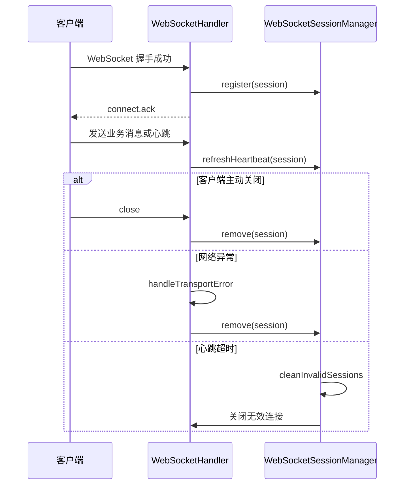

生命周期处理建议：

| 阶段      | 触发方法                     | 处理动作                                   |
| --------- | ---------------------------- | ------------------------------------------ |
| 握手前    | `beforeHandshake`            | 鉴权、限流、连接权限校验                   |
| 连接建立  | `afterConnectionEstablished` | 注册 Session、初始化心跳、返回连接成功消息 |
| 消息到达  | `handleTextMessage`          | 解析消息、刷新心跳、路由分发               |
| Pong 到达 | `handlePongMessage`          | 刷新最后活跃时间                           |
| 传输异常  | `handleTransportError`       | 记录异常、主动关闭连接                     |
| 连接关闭  | `afterConnectionClosed`      | 移除 Session、清理映射、记录日志           |
| 定时清理  | 定时任务                     | 清理关闭连接和心跳超时连接                 |

在前面实现的 `NativeWebSocketHandler` 中，需要保证以下调用关系存在：

```java
// 连接建立时注册
webSocketSessionManager.register(session);

// 收到心跳时刷新
webSocketSessionManager.refreshHeartbeat(session);

// 连接关闭时移除
webSocketSessionManager.remove(session);
```

### 无效连接清理

无效连接清理用于处理客户端异常退出、网络中断、代理层断开但应用未及时感知的场景。虽然多数断开都会触发 `afterConnectionClosed`，但生产环境中仍然建议增加定时清理任务，基于 Session 状态和最后心跳时间主动清理无效连接。

文件位置：`src/main/java/io/github/atengk/websocket/session/WebSocketSessionCleaner.java`

下面的定时任务会按配置中的心跳超时时间清理无效连接。需要在启动类上启用 `@EnableScheduling`，或者将该注解放到配置类中。

```java
package io.github.atengk.websocket.session;

import io.github.atengk.websocket.config.WebSocketProperties;
import lombok.RequiredArgsConstructor;
import lombok.extern.slf4j.Slf4j;
import org.springframework.scheduling.annotation.Scheduled;
import org.springframework.stereotype.Component;

/**
 * WebSocket 无效连接清理任务
 *
 * @author Ateng
 * @since 2026-05-05
 */
@Slf4j
@Component
@RequiredArgsConstructor
public class WebSocketSessionCleaner {

    private final WebSocketProperties webSocketProperties;

    private final WebSocketSessionManager webSocketSessionManager;

    /**
     * 定时清理无效连接
     */
    @Scheduled(fixedDelayString = "${websocket.session-clean-delay-millis:30000}")
    public void cleanInvalidSessions() {
        long heartbeatTimeoutMillis = webSocketProperties.getHeartbeatTimeoutSeconds() * 1000L;
        int cleanCount = webSocketSessionManager.cleanInvalidSessions(heartbeatTimeoutMillis);

        if (cleanCount > 0) {
            log.info("WebSocket 定时清理无效连接完成，cleanCount={}", cleanCount);
        }
    }

}
```

文件位置：`src/main/java/io/github/atengk/websocket/WebSocketApplication.java`

启动类中启用定时任务。

```java
package io.github.atengk.websocket;

import org.springframework.boot.SpringApplication;
import org.springframework.boot.autoconfigure.SpringBootApplication;
import org.springframework.scheduling.annotation.EnableScheduling;

/**
 * WebSocket 应用启动类
 *
 * @author Ateng
 * @since 2026-05-05
 */
@EnableScheduling
@SpringBootApplication
public class WebSocketApplication {

    /**
     * 应用启动入口
     *
     * @param args 启动参数
     */
    public static void main(String[] args) {
        SpringApplication.run(WebSocketApplication.class, args);
    }

}
```

配置文件补充：

```yaml
websocket:
  # 服务端判定连接超时的时间，单位：秒
  heartbeat-timeout-seconds: 90

  # 无效连接清理任务执行间隔，单位：毫秒
  session-clean-delay-millis: 30000
```

清理策略建议：

1. 清理间隔不宜过短，通常 30 秒到 60 秒即可。
2. 心跳超时时间应大于客户端心跳间隔，通常设置为心跳间隔的 2 到 3 倍。
3. 清理任务只处理本机 Session，集群模式下每个实例各自清理本机连接。
4. 心跳超时不一定代表用户主动离线，可能是网络异常或页面休眠。
5. 客户端应配合断线重连策略，服务端只负责关闭失效连接。

### 在线用户统计

在线用户统计用于运维监控、业务展示和排查问题。单机模式下，在线用户数可以直接取 `userSessionMap.size()`，在线连接数可以取 `sessionInfoMap.size()`。集群模式下，需要把各实例统计值汇总，或通过 Redis 维护全局在线状态。

推荐统计指标如下：

| 指标         | 说明                                                    |
| ------------ | ------------------------------------------------------- |
| 在线用户数   | 当前至少有一个 WebSocket 连接的用户数量                 |
| 在线连接数   | 当前实例中的 WebSocket Session 数量                     |
| 单用户连接数 | 指定用户当前在线连接数量                                |
| 连接明细     | 用户 ID、Session ID、IP、User-Agent、连接时间、心跳时间 |
| 心跳超时数   | 被清理任务关闭的连接数量                                |
| 推送失败数   | 服务端发送失败的次数                                    |

文件位置：`src/main/java/io/github/atengk/websocket/controller/WebSocketOnlineController.java`

下面的接口用于开发、测试和运维查看在线连接情况。生产环境应结合 Spring Security、Sa-Token 或网关权限控制，避免普通用户访问在线连接明细。

```java
package io.github.atengk.websocket.controller;

import cn.hutool.core.lang.Dict;
import io.github.atengk.websocket.session.WebSocketSessionManager;
import io.github.atengk.websocket.session.WebSocketUserSession;
import lombok.RequiredArgsConstructor;
import org.springframework.web.bind.annotation.GetMapping;
import org.springframework.web.bind.annotation.PathVariable;
import org.springframework.web.bind.annotation.RequestMapping;
import org.springframework.web.bind.annotation.RestController;
import org.springframework.web.socket.WebSocketSession;

import java.util.List;

/**
 * WebSocket 在线用户接口
 *
 * @author Ateng
 * @since 2026-05-05
 */
@RestController
@RequiredArgsConstructor
@RequestMapping("/websocket/online")
public class WebSocketOnlineController {

    private final WebSocketSessionManager webSocketSessionManager;

    /**
     * 获取在线统计
     *
     * @return 在线统计信息
     */
    @GetMapping("/stats")
    public Dict stats() {
        return Dict.create()
                .set("onlineUserCount", webSocketSessionManager.getOnlineUserCount())
                .set("onlineSessionCount", webSocketSessionManager.getTotalSessionCount());
    }

    /**
     * 获取在线连接列表
     *
     * @return 在线连接列表
     */
    @GetMapping("/sessions")
    public List<WebSocketUserSession> sessions() {
        return webSocketSessionManager.listOnlineSessions();
    }

    /**
     * 获取指定用户连接数
     *
     * @param userId 用户 ID
     * @return 用户连接统计
     */
    @GetMapping("/users/{userId}/stats")
    public Dict userStats(@PathVariable String userId) {
        List<WebSocketSession> sessions = webSocketSessionManager.getUserSessions(userId);
        return Dict.create()
                .set("userId", userId)
                .set("sessionCount", sessions.size())
                .set("sessionIds", sessions.stream().map(WebSocketSession::getId).toList());
    }

}
```

接口验证命令：

```bash
# 查看在线统计
curl "http://localhost:8080/api/websocket/online/stats"

# 查看在线连接明细
curl "http://localhost:8080/api/websocket/online/sessions"

# 查看指定用户连接数
curl "http://localhost:8080/api/websocket/online/users/10001/stats"
```

预期响应示例：

```json
{
  "onlineUserCount": 1,
  "onlineSessionCount": 2
}
```

生产环境注意事项：

1. 在线连接明细接口必须加权限控制。
2. 不建议直接返回完整 Token、用户隐私或敏感字段。
3. 多实例部署时，该接口默认只表示当前实例统计。
4. 如果需要全局在线用户数，应引入 Redis 或监控系统聚合。
5. 在线用户数是实时连接状态，不等同于业务在线状态或登录状态。

## 消息协议设计

消息协议设计用于统一客户端请求、服务端响应、服务端推送和错误消息格式。原生 WebSocket 不提供业务消息协议，如果不提前约定统一结构，后续消息路由、参数校验、异常处理、前端封装和日志追踪都会变得混乱。

本模块建议使用 JSON 作为消息格式，所有消息必须包含 `type` 字段，建议包含 `seq` 和 `timestamp` 字段。客户端请求和服务端响应通过 `seq` 进行关联；服务端主动推送也可以生成独立 `seq`，便于链路追踪。

### 消息体基础结构

基础消息结构用于约束所有 WebSocket 消息的公共字段。请求、响应、推送和错误消息都应遵循同一套命名风格。

通用结构如下：

```json
{
  "seq": "202605051030000001",
  "type": "demo.echo",
  "timestamp": 1777948200000,
  "data": {
    "content": "hello websocket"
  }
}
```

公共字段说明：

| 字段        | 类型   | 是否必填 | 说明                                   |
| ----------- | ------ | -------- | -------------------------------------- |
| `seq`       | String | 建议     | 消息序列号，用于请求响应关联和日志追踪 |
| `type`      | String | 是       | 消息类型，用于服务端路由               |
| `timestamp` | Long   | 建议     | 消息产生时间，毫秒时间戳               |
| `data`      | Object | 否       | 业务数据                               |

设计约定：

1. `type` 必须存在，否则服务端返回 `INVALID_TYPE`。
2. `seq` 建议由发送方生成，服务端响应时原样返回。
3. `timestamp` 使用毫秒时间戳，避免前后端时区格式差异。
4. `data` 只放业务参数，不放协议字段。
5. 大字段、文件、图片、二进制数据不建议直接放入 JSON 消息中。

### 消息类型定义

消息类型是消息路由的核心依据。建议使用“业务域.动作”格式，例如 `notice.read`、`chat.send`、`task.progress`。系统级消息可以使用 `system.*`，心跳消息可以使用 `heartbeat` 和 `heartbeat.ack`。

推荐命名规范：

| 类型格式             | 示例                 | 说明           |
| -------------------- | -------------------- | -------------- |
| `heartbeat`          | `heartbeat`          | 客户端心跳     |
| `heartbeat.ack`      | `heartbeat.ack`      | 服务端心跳响应 |
| `connect.ack`        | `connect.ack`        | 连接成功确认   |
| `system.error`       | `system.error`       | 系统错误消息   |
| `demo.echo`          | `demo.echo`          | 示例请求       |
| `demo.echo.ack`      | `demo.echo.ack`      | 示例响应       |
| `notice.push`        | `notice.push`        | 通知推送       |
| `task.progress.push` | `task.progress.push` | 任务进度推送   |

文件位置：`src/main/java/io/github/atengk/websocket/protocol/WebSocketMessageType.java`

该枚举集中维护系统内置消息类型。业务模块可以继续扩展自己的消息类型，也可以只把系统级消息放在这里。

```java
package io.github.atengk.websocket.protocol;

import cn.hutool.core.util.StrUtil;
import lombok.Getter;

import java.util.Arrays;
import java.util.Optional;

/**
 * WebSocket 消息类型
 *
 * @author Ateng
 * @since 2026-05-05
 */
@Getter
public enum WebSocketMessageType {

    /**
     * 连接确认
     */
    CONNECT_ACK("connect.ack", "连接确认"),

    /**
     * 心跳请求
     */
    HEARTBEAT("heartbeat", "心跳请求"),

    /**
     * 心跳响应
     */
    HEARTBEAT_ACK("heartbeat.ack", "心跳响应"),

    /**
     * 示例回显请求
     */
    DEMO_ECHO("demo.echo", "示例回显请求"),

    /**
     * 示例回显响应
     */
    DEMO_ECHO_ACK("demo.echo.ack", "示例回显响应"),

    /**
     * 通知推送
     */
    NOTICE_PUSH("notice.push", "通知推送"),

    /**
     * 系统错误
     */
    SYSTEM_ERROR("system.error", "系统错误");

    private final String code;

    private final String description;

    WebSocketMessageType(String code, String description) {
        this.code = code;
        this.description = description;
    }

    /**
     * 根据编码解析消息类型
     *
     * @param code 消息类型编码
     * @return 消息类型
     */
    public static Optional<WebSocketMessageType> resolve(String code) {
        return Arrays.stream(values())
                .filter(item -> StrUtil.equals(item.getCode(), code))
                .findFirst();
    }

}
```

消息类型设计建议：

1. 客户端请求类型不建议和服务端响应类型完全相同，响应可以追加 `.ack`。
2. 服务端主动推送建议追加 `.push`，便于前端区分请求响应和服务端通知。
3. 系统级错误统一使用 `system.error`。
4. 消息类型应保持稳定，避免前端频繁适配。
5. 废弃消息类型时，应保留一段兼容期并记录日志。

### 请求消息结构

请求消息由客户端发送给服务端，用于触发业务处理。请求消息必须包含 `type`，建议包含 `seq`。如果是业务请求，`data` 中应放置业务参数。

请求结构示例：

```json
{
  "seq": "req-10001",
  "type": "demo.echo",
  "timestamp": 1777948200000,
  "data": {
    "content": "hello websocket"
  }
}
```

文件位置：`src/main/java/io/github/atengk/websocket/protocol/WebSocketRequest.java`

该对象用于接收客户端请求消息。`data` 使用 `JsonNode` 保存，便于不同消息类型按需转换为各自的业务 DTO。

```java
package io.github.atengk.websocket.protocol;

import com.fasterxml.jackson.databind.JsonNode;
import lombok.Data;

/**
 * WebSocket 请求消息
 *
 * @author Ateng
 * @since 2026-05-05
 */
@Data
public class WebSocketRequest {

    /**
     * 消息序列号
     */
    private String seq;

    /**
     * 消息类型
     */
    private String type;

    /**
     * 客户端时间戳
     */
    private Long timestamp;

    /**
     * 业务数据
     */
    private JsonNode data;

}
```

请求消息校验规则：

| 校验项        | 规则               | 错误码              |
| ------------- | ------------------ | ------------------- |
| 消息体为空    | 不允许为空         | `INVALID_MESSAGE`   |
| JSON 非法     | 必须是合法 JSON    | `INVALID_JSON`      |
| `type` 为空   | 不允许为空         | `INVALID_TYPE`      |
| `type` 未注册 | 不允许处理未知类型 | `UNKNOWN_TYPE`      |
| `data` 非法   | 按具体消息类型校验 | `INVALID_PARAM`     |
| 消息过大      | 不超过配置限制     | `MESSAGE_TOO_LARGE` |

在 Handler 中解析请求时建议使用：

```java
WebSocketRequest request = objectMapper.readValue(payload, WebSocketRequest.class);
```

后续消息路由章节可以继续将 `request.getData()` 转换成具体 DTO：

```java
DemoEchoRequest data = objectMapper.treeToValue(request.getData(), DemoEchoRequest.class);
```

### 响应消息结构

响应消息由服务端发送给客户端，用于回应客户端请求。响应消息应原样返回请求中的 `seq`，并通过 `success`、`code`、`message` 表达处理结果。

成功响应示例：

```json
{
  "seq": "req-10001",
  "type": "demo.echo.ack",
  "success": true,
  "code": "OK",
  "message": "成功",
  "data": {
    "content": "hello websocket",
    "serverTime": 1777948201000
  },
  "timestamp": 1777948201000
}
```

文件位置：`src/main/java/io/github/atengk/websocket/protocol/WebSocketResponse.java`

该响应对象用于统一封装成功响应、错误响应和服务端推送消息。

```java
package io.github.atengk.websocket.protocol;

import com.fasterxml.jackson.annotation.JsonInclude;
import lombok.Builder;
import lombok.Data;

/**
 * WebSocket 响应消息
 *
 * @author Ateng
 * @since 2026-05-05
 */
@Data
@Builder
@JsonInclude(JsonInclude.Include.NON_NULL)
public class WebSocketResponse<T> {

    /**
     * 消息序列号
     */
    private String seq;

    /**
     * 消息类型
     */
    private String type;

    /**
     * 是否成功
     */
    private Boolean success;

    /**
     * 响应编码
     */
    private String code;

    /**
     * 响应消息
     */
    private String message;

    /**
     * 响应数据
     */
    private T data;

    /**
     * 服务端时间戳
     */
    private Long timestamp;

    /**
     * 构建成功响应
     *
     * @param seq  消息序列号
     * @param type 消息类型
     * @param data 响应数据
     * @param <T>  数据类型
     * @return WebSocket 响应
     */
    public static <T> WebSocketResponse<T> ok(String seq, String type, T data) {
        return WebSocketResponse.<T>builder()
                .seq(seq)
                .type(type)
                .success(true)
                .code(WebSocketErrorCode.OK.getCode())
                .message(WebSocketErrorCode.OK.getMessage())
                .data(data)
                .timestamp(System.currentTimeMillis())
                .build();
    }

    /**
     * 构建错误响应
     *
     * @param seq       消息序列号
     * @param errorCode 错误编码
     * @return WebSocket 响应
     */
    public static WebSocketResponse<Void> error(String seq, WebSocketErrorCode errorCode) {
        return error(seq, errorCode.getCode(), errorCode.getMessage());
    }

    /**
     * 构建错误响应
     *
     * @param seq     消息序列号
     * @param code    错误编码
     * @param message 错误消息
     * @return WebSocket 响应
     */
    public static WebSocketResponse<Void> error(String seq, String code, String message) {
        return WebSocketResponse.<Void>builder()
                .seq(seq)
                .type(WebSocketMessageType.SYSTEM_ERROR.getCode())
                .success(false)
                .code(code)
                .message(message)
                .timestamp(System.currentTimeMillis())
                .build();
    }

    /**
     * 构建推送消息
     *
     * @param type 推送类型
     * @param data 推送数据
     * @param <T>  数据类型
     * @return WebSocket 推送消息
     */
    public static <T> WebSocketResponse<T> push(String type, T data) {
        return WebSocketResponse.<T>builder()
                .seq(WebSocketSeqGenerator.next())
                .type(type)
                .success(true)
                .code(WebSocketErrorCode.OK.getCode())
                .message(WebSocketErrorCode.OK.getMessage())
                .data(data)
                .timestamp(System.currentTimeMillis())
                .build();
    }

}
```

### 推送消息结构

推送消息由服务端主动发送给客户端，不依赖客户端请求。推送消息仍然建议包含 `seq`，用于日志排查、客户端去重和消息追踪。

通知推送示例：

```json
{
  "seq": "push-725287391263744",
  "type": "notice.push",
  "success": true,
  "code": "OK",
  "message": "成功",
  "data": {
    "noticeId": "N10001",
    "title": "系统通知",
    "content": "你有一条新的审批任务",
    "level": "INFO"
  },
  "timestamp": 1777948201000
}
```

推送消息设计建议：

| 字段        | 建议                     |
| ----------- | ------------------------ |
| `seq`       | 服务端生成，便于追踪     |
| `type`      | 使用 `.push` 后缀        |
| `success`   | 固定为 `true`            |
| `code`      | 固定为 `OK` 或业务状态码 |
| `message`   | 简要说明                 |
| `data`      | 推送业务内容             |
| `timestamp` | 服务端生成时间           |

推送类型建议：

| 推送类型                   | 说明         |
| -------------------------- | ------------ |
| `notice.push`              | 通知推送     |
| `task.progress.push`       | 任务进度推送 |
| `chat.message.push`        | 聊天消息推送 |
| `system.announcement.push` | 系统公告推送 |
| `user.status.push`         | 用户状态推送 |
| `monitor.metric.push`      | 监控指标推送 |

推送消息不应直接复用客户端请求类型，否则前端难以判断一条消息是“请求响应”还是“服务端主动通知”。

### 错误消息结构

错误消息用于表达协议错误、参数错误、权限错误、业务异常和系统异常。错误消息应保持结构统一，不应直接把 Java 异常栈、数据库错误或敏感信息返回给客户端。

错误响应示例：

```json
{
  "seq": "req-10001",
  "type": "system.error",
  "success": false,
  "code": "INVALID_TYPE",
  "message": "消息类型不能为空",
  "timestamp": 1777948201000
}
```

文件位置：`src/main/java/io/github/atengk/websocket/protocol/WebSocketErrorCode.java`

该枚举用于统一定义 WebSocket 协议层错误码。业务错误码可以在业务模块中扩展，但建议保持同样的编码风格。

```java
package io.github.atengk.websocket.protocol;

import lombok.Getter;

/**
 * WebSocket 错误码
 *
 * @author Ateng
 * @since 2026-05-05
 */
@Getter
public enum WebSocketErrorCode {

    /**
     * 成功
     */
    OK("OK", "成功"),

    /**
     * 消息为空
     */
    INVALID_MESSAGE("INVALID_MESSAGE", "消息内容不能为空"),

    /**
     * JSON 非法
     */
    INVALID_JSON("INVALID_JSON", "消息格式不是合法 JSON"),

    /**
     * 消息类型为空
     */
    INVALID_TYPE("INVALID_TYPE", "消息类型不能为空"),

    /**
     * 未知消息类型
     */
    UNKNOWN_TYPE("UNKNOWN_TYPE", "未知消息类型"),

    /**
     * 参数错误
     */
    INVALID_PARAM("INVALID_PARAM", "消息参数不合法"),

    /**
     * 未登录或 Token 无效
     */
    UNAUTHORIZED("UNAUTHORIZED", "连接未认证或认证已失效"),

    /**
     * 无操作权限
     */
    FORBIDDEN("FORBIDDEN", "没有操作权限"),

    /**
     * 消息发送失败
     */
    SEND_FAILED("SEND_FAILED", "消息发送失败"),

    /**
     * 请求过于频繁
     */
    RATE_LIMITED("RATE_LIMITED", "请求过于频繁"),

    /**
     * 服务端异常
     */
    SERVER_ERROR("SERVER_ERROR", "服务端异常");

    private final String code;

    private final String message;

    WebSocketErrorCode(String code, String message) {
        this.code = code;
        this.message = message;
    }

}
```

错误消息处理建议：

1. 协议错误返回 `system.error`，不要直接断开连接。
2. 鉴权失败通常发生在握手阶段，直接拒绝连接。
3. Token 过期如果在消息阶段发现，可以发送 `UNAUTHORIZED` 后关闭连接。
4. 业务异常应转换为业务错误码，不应返回异常类名。
5. 服务端异常统一返回 `SERVER_ERROR`，详细异常只写入日志。

### 消息序列号设计

消息序列号用于请求响应关联、日志追踪、消息去重和可靠性设计。客户端发送请求时建议生成 `seq`，服务端响应时原样返回；服务端主动推送时由服务端生成 `seq`。

序列号使用方式如下：

| 消息方向   | 生成方               | 用途                    |
| ---------- | -------------------- | ----------------------- |
| 客户端请求 | 客户端               | 关联服务端响应          |
| 服务端响应 | 服务端复用请求 `seq` | 客户端匹配 pending 请求 |
| 服务端推送 | 服务端               | 日志追踪、客户端去重    |
| 错误消息   | 服务端复用请求 `seq` | 定位错误来源            |
| 心跳消息   | 客户端或服务端       | 诊断延迟和连接状态      |

文件位置：`src/main/java/io/github/atengk/websocket/protocol/WebSocketSeqGenerator.java`

该工具类用于服务端生成推送消息、连接确认消息等服务端侧消息序列号。

```java
package io.github.atengk.websocket.protocol;

import cn.hutool.core.util.IdUtil;

/**
 * WebSocket 消息序列号生成器
 *
 * @author Ateng
 * @since 2026-05-05
 */
public final class WebSocketSeqGenerator {

    private static final String PREFIX = "ws-";

    private WebSocketSeqGenerator() {
    }

    /**
     * 生成消息序列号
     *
     * @return 消息序列号
     */
    public static String next() {
        return PREFIX + IdUtil.getSnowflakeNextIdStr();
    }

}
```

客户端序列号示例：

```javascript
function nextSeq() {
  return `client-${Date.now()}-${Math.random().toString(16).slice(2)}`
}

socket.send(JSON.stringify({
  seq: nextSeq(),
  type: 'demo.echo',
  timestamp: Date.now(),
  data: {
    content: 'hello websocket'
  }
}))
```

服务端响应关联示例：

```json
{
  "seq": "client-1777948200000-a12f",
  "type": "demo.echo.ack",
  "success": true,
  "code": "OK",
  "message": "成功",
  "data": {
    "content": "hello websocket"
  },
  "timestamp": 1777948201000
}
```

序列号设计建议：

1. `seq` 不要求全局连续，但应尽量全局唯一。
2. 客户端请求必须保存 `seq` 与回调函数或 Promise 的关系。
3. 服务端响应必须原样返回请求 `seq`。
4. 服务端推送消息使用服务端生成的 `seq`。
5. 如果后续设计消息确认、重试、离线消息，应将 `seq` 或业务消息 ID 持久化。
6. `seq` 不能代替业务主键，业务消息仍应有自己的 `messageId`、`noticeId` 或 `taskId`。

本节完成后，WebSocket 模块已经具备可持续扩展的会话管理和消息协议基础：

| 能力                    | 状态   |
| ----------------------- | ------ |
| 用户与 Session 多级映射 | 已完成 |
| Session 元信息记录      | 已完成 |
| 多端登录策略            | 已完成 |
| Session 生命周期管理    | 已完成 |
| 无效连接定时清理        | 已完成 |
| 在线用户统计接口        | 已完成 |
| 请求消息结构            | 已完成 |
| 响应消息结构            | 已完成 |
| 推送消息结构            | 已完成 |
| 错误码结构              | 已完成 |
| 消息序列号生成          | 已完成 |


## 消息路由设计

消息路由设计用于解决 WebSocketHandler 中业务逻辑膨胀的问题。Handler 只负责接收原始消息、解析基础协议和处理连接生命周期；具体业务消息应按 `type` 分发到独立处理器中执行。

推荐处理链路如下：

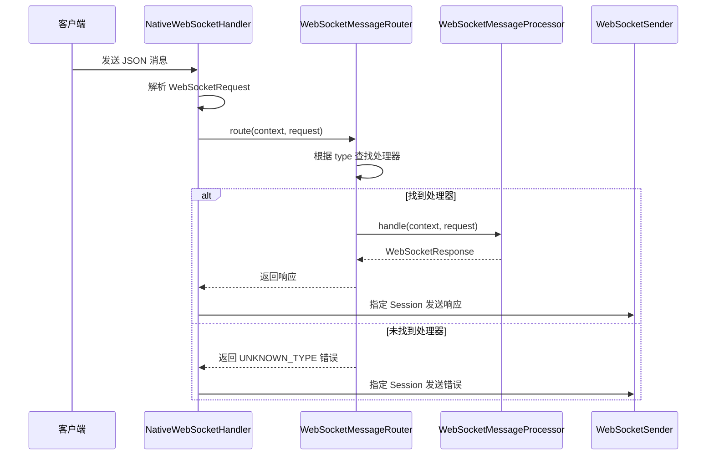

### 按消息类型分发

按消息类型分发是指服务端根据请求消息中的 `type` 字段选择对应业务处理器。推荐每个业务处理器只处理一种或一组相关消息类型，避免所有业务堆在一个 `switch` 或 `if-else` 中。

推荐消息类型与处理器关系如下：

| 消息类型         | 处理器                          | 说明         |
| ---------------- | ------------------------------- | ------------ |
| `heartbeat`      | `HeartbeatMessageProcessor`     | 心跳处理     |
| `demo.echo`      | `DemoEchoMessageProcessor`      | 示例回显     |
| `notice.read`    | `NoticeReadMessageProcessor`    | 通知已读     |
| `chat.send`      | `ChatSendMessageProcessor`      | 聊天发送     |
| `task.subscribe` | `TaskSubscribeMessageProcessor` | 订阅任务进度 |

新增文件结构如下：

```text
src/main/java/io/github/atengk/websocket
├── context
│   └── WebSocketContext.java
├── exception
│   └── WebSocketBizException.java
├── processor
│   ├── WebSocketMessageProcessor.java
│   ├── HeartbeatMessageProcessor.java
│   └── DemoEchoMessageProcessor.java
├── router
│   └── WebSocketMessageRouter.java
└── support
    └── WebSocketMessageValidator.java
```

文件位置：`src/main/java/io/github/atengk/websocket/context/WebSocketContext.java`

该对象用于在消息处理过程中传递当前连接上下文，避免处理器直接重复从 `WebSocketSession` 中解析用户信息。

```java
package io.github.atengk.websocket.context;

import org.springframework.web.socket.WebSocketSession;

/**
 * WebSocket 消息上下文
 *
 * @author Ateng
 * @since 2026-05-05
 */
public record WebSocketContext(
        WebSocketSession session,
        String userId,
        String tenantId,
        String username
) {
}
```

文件位置：`src/main/java/io/github/atengk/websocket/processor/WebSocketMessageProcessor.java`

该接口是所有业务消息处理器的统一抽象。每个处理器通过 `support` 判断是否处理当前消息类型，通过 `handle` 返回标准响应。

```java
package io.github.atengk.websocket.processor;

import io.github.atengk.websocket.context.WebSocketContext;
import io.github.atengk.websocket.protocol.WebSocketRequest;
import io.github.atengk.websocket.protocol.WebSocketResponse;

/**
 * WebSocket 消息处理器
 *
 * @author Ateng
 * @since 2026-05-05
 */
public interface WebSocketMessageProcessor {

    /**
     * 判断是否支持当前消息类型
     *
     * @param type 消息类型
     * @return 是否支持
     */
    boolean support(String type);

    /**
     * 处理 WebSocket 消息
     *
     * @param context 当前连接上下文
     * @param request 请求消息
     * @return 响应消息
     */
    WebSocketResponse<?> handle(WebSocketContext context, WebSocketRequest request);

}
```

文件位置：`src/main/java/io/github/atengk/websocket/router/WebSocketMessageRouter.java`

该路由器会在启动时注入所有 `WebSocketMessageProcessor`，收到消息后按 `type` 查找对应处理器。业务异常和未知消息类型在这里统一转换为标准响应。

```java
package io.github.atengk.websocket.router;

import cn.hutool.core.collection.CollUtil;
import cn.hutool.core.util.StrUtil;
import io.github.atengk.websocket.context.WebSocketContext;
import io.github.atengk.websocket.exception.WebSocketBizException;
import io.github.atengk.websocket.processor.WebSocketMessageProcessor;
import io.github.atengk.websocket.protocol.WebSocketErrorCode;
import io.github.atengk.websocket.protocol.WebSocketRequest;
import io.github.atengk.websocket.protocol.WebSocketResponse;
import lombok.extern.slf4j.Slf4j;
import org.springframework.stereotype.Component;

import java.util.List;

/**
 * WebSocket 消息路由器
 *
 * @author Ateng
 * @since 2026-05-05
 */
@Slf4j
@Component
public class WebSocketMessageRouter {

    private final List<WebSocketMessageProcessor> processors;

    public WebSocketMessageRouter(List<WebSocketMessageProcessor> processors) {
        this.processors = processors;
        log.info("WebSocket 消息处理器加载完成，processorCount={}", processors.size());
    }

    /**
     * 路由并处理消息
     *
     * @param context 当前连接上下文
     * @param request 请求消息
     * @return 响应消息
     */
    public WebSocketResponse<?> route(WebSocketContext context, WebSocketRequest request) {
        if (request == null) {
            return WebSocketResponse.error(null, WebSocketErrorCode.INVALID_MESSAGE);
        }

        if (StrUtil.isBlank(request.getType())) {
            return WebSocketResponse.error(request.getSeq(), WebSocketErrorCode.INVALID_TYPE);
        }

        if (CollUtil.isEmpty(processors)) {
            log.warn("WebSocket 消息处理失败，未加载任何处理器，type={}", request.getType());
            return WebSocketResponse.error(request.getSeq(), WebSocketErrorCode.UNKNOWN_TYPE);
        }

        WebSocketMessageProcessor processor = processors.stream()
                .filter(item -> item.support(request.getType()))
                .findFirst()
                .orElse(null);

        if (processor == null) {
            log.warn("WebSocket 未知消息类型，userId={}，sessionId={}，type={}",
                    context.userId(), context.session().getId(), request.getType());
            return WebSocketResponse.error(request.getSeq(), WebSocketErrorCode.UNKNOWN_TYPE);
        }

        try {
            return processor.handle(context, request);
        } catch (WebSocketBizException e) {
            log.warn("WebSocket 业务处理异常，userId={}，sessionId={}，type={}，code={}，message={}",
                    context.userId(), context.session().getId(), request.getType(), e.getCode(), e.getMessage());
            return WebSocketResponse.error(request.getSeq(), e.getCode(), e.getMessage());
        } catch (Exception e) {
            log.error("WebSocket 消息处理异常，userId={}，sessionId={}，type={}",
                    context.userId(), context.session().getId(), request.getType(), e);
            return WebSocketResponse.error(request.getSeq(), WebSocketErrorCode.SERVER_ERROR);
        }
    }

}
```

### 业务处理器抽象

业务处理器抽象用于统一消息处理入口。每个处理器只关注自己支持的消息类型，不关心连接注册、消息发送、异常封装等通用逻辑。

文件位置：`src/main/java/io/github/atengk/websocket/processor/HeartbeatMessageProcessor.java`

该处理器负责处理客户端应用层心跳，刷新当前 Session 的最后心跳时间，并返回 `heartbeat.ack`。

```java
package io.github.atengk.websocket.processor;

import io.github.atengk.websocket.context.WebSocketContext;
import io.github.atengk.websocket.protocol.WebSocketMessageType;
import io.github.atengk.websocket.protocol.WebSocketRequest;
import io.github.atengk.websocket.protocol.WebSocketResponse;
import io.github.atengk.websocket.session.WebSocketSessionManager;
import lombok.RequiredArgsConstructor;
import lombok.extern.slf4j.Slf4j;
import org.springframework.stereotype.Component;

import java.util.Map;

/**
 * WebSocket 心跳消息处理器
 *
 * @author Ateng
 * @since 2026-05-05
 */
@Slf4j
@Component
@RequiredArgsConstructor
public class HeartbeatMessageProcessor implements WebSocketMessageProcessor {

    private final WebSocketSessionManager webSocketSessionManager;

    /**
     * 判断是否支持当前消息类型
     *
     * @param type 消息类型
     * @return 是否支持
     */
    @Override
    public boolean support(String type) {
        return WebSocketMessageType.HEARTBEAT.getCode().equals(type);
    }

    /**
     * 处理心跳消息
     *
     * @param context 当前连接上下文
     * @param request 请求消息
     * @return 响应消息
     */
    @Override
    public WebSocketResponse<?> handle(WebSocketContext context, WebSocketRequest request) {
        webSocketSessionManager.refreshHeartbeat(context.session());

        log.debug("WebSocket 心跳处理完成，userId={}，sessionId={}",
                context.userId(), context.session().getId());

        return WebSocketResponse.ok(request.getSeq(), WebSocketMessageType.HEARTBEAT_ACK.getCode(), Map.of(
                "serverTime", System.currentTimeMillis()
        ));
    }

}
```

文件位置：`src/main/java/io/github/atengk/websocket/processor/DemoEchoMessageProcessor.java`

该处理器演示如何处理业务消息、校验参数并返回标准响应。真实业务中可以按业务域继续新增处理器。

```java
package io.github.atengk.websocket.processor;

import com.fasterxml.jackson.databind.ObjectMapper;
import io.github.atengk.websocket.context.WebSocketContext;
import io.github.atengk.websocket.protocol.WebSocketMessageType;
import io.github.atengk.websocket.protocol.WebSocketRequest;
import io.github.atengk.websocket.protocol.WebSocketResponse;
import io.github.atengk.websocket.support.WebSocketMessageValidator;
import jakarta.validation.constraints.NotBlank;
import lombok.Data;
import lombok.RequiredArgsConstructor;
import lombok.extern.slf4j.Slf4j;
import org.springframework.stereotype.Component;

import java.util.Map;

/**
 * WebSocket 示例回显消息处理器
 *
 * @author Ateng
 * @since 2026-05-05
 */
@Slf4j
@Component
@RequiredArgsConstructor
public class DemoEchoMessageProcessor implements WebSocketMessageProcessor {

    private final ObjectMapper objectMapper;

    private final WebSocketMessageValidator webSocketMessageValidator;

    /**
     * 判断是否支持当前消息类型
     *
     * @param type 消息类型
     * @return 是否支持
     */
    @Override
    public boolean support(String type) {
        return WebSocketMessageType.DEMO_ECHO.getCode().equals(type);
    }

    /**
     * 处理示例回显消息
     *
     * @param context 当前连接上下文
     * @param request 请求消息
     * @return 响应消息
     */
    @Override
    public WebSocketResponse<?> handle(WebSocketContext context, WebSocketRequest request) {
        DemoEchoRequest data = objectMapper.convertValue(request.getData(), DemoEchoRequest.class);
        webSocketMessageValidator.validate(data);

        log.info("WebSocket 示例消息处理完成，userId={}，sessionId={}，content={}",
                context.userId(), context.session().getId(), data.getContent());

        return WebSocketResponse.ok(request.getSeq(), WebSocketMessageType.DEMO_ECHO_ACK.getCode(), Map.of(
                "content", data.getContent(),
                "serverTime", System.currentTimeMillis()
        ));
    }

    /**
     * 示例回显请求参数
     *
     * @author Ateng
     * @since 2026-05-05
     */
    @Data
    public static class DemoEchoRequest {

        /**
         * 回显内容
         */
        @NotBlank(message = "回显内容不能为空")
        private String content;

    }

}
```

### 消息参数校验

消息参数校验用于保证业务处理器拿到的数据是有效的。建议使用 `spring-boot-starter-validation` 提供的 Jakarta Validation 进行 DTO 校验，避免每个处理器手写大量空值判断。

参数校验流程如下：

```text
WebSocketRequest.data
        │
        ▼
业务 DTO
        │
        ▼
WebSocketMessageValidator.validate(dto)
        │
        ├── 校验通过：继续业务处理
        └── 校验失败：抛出 WebSocketBizException(INVALID_PARAM)
```

文件位置：`src/main/java/io/github/atengk/websocket/support/WebSocketMessageValidator.java`

该组件统一处理消息参数校验，校验失败后抛出业务异常，由路由器统一转换为错误响应。

```java
package io.github.atengk.websocket.support;

import cn.hutool.core.collection.CollUtil;
import cn.hutool.core.util.StrUtil;
import io.github.atengk.websocket.exception.WebSocketBizException;
import io.github.atengk.websocket.protocol.WebSocketErrorCode;
import jakarta.validation.ConstraintViolation;
import jakarta.validation.Validator;
import lombok.RequiredArgsConstructor;
import org.springframework.stereotype.Component;

import java.util.Set;
import java.util.stream.Collectors;

/**
 * WebSocket 消息参数校验器
 *
 * @author Ateng
 * @since 2026-05-05
 */
@Component
@RequiredArgsConstructor
public class WebSocketMessageValidator {

    private final Validator validator;

    /**
     * 校验消息参数
     *
     * @param target 校验对象
     */
    public void validate(Object target) {
        if (target == null) {
            throw new WebSocketBizException(WebSocketErrorCode.INVALID_PARAM.getCode(), "消息参数不能为空");
        }

        Set<ConstraintViolation<Object>> violations = validator.validate(target);
        if (CollUtil.isEmpty(violations)) {
            return;
        }

        String message = violations.stream()
                .map(ConstraintViolation::getMessage)
                .filter(StrUtil::isNotBlank)
                .collect(Collectors.joining("；"));

        throw new WebSocketBizException(WebSocketErrorCode.INVALID_PARAM.getCode(), message);
    }

}
```

校验建议：

1. `WebSocketRequest` 只做协议字段校验。
2. 业务字段校验放到具体业务 DTO 中。
3. 校验失败统一返回 `INVALID_PARAM`。
4. 多个校验错误可以合并为一个错误消息。
5. 高安全场景下，错误消息不要暴露过细内部规则。

### 业务异常转换

业务异常转换用于把处理器内部抛出的业务异常统一转换为 WebSocket 错误消息，避免异常栈或 Java 类名暴露给客户端。

文件位置：`src/main/java/io/github/atengk/websocket/exception/WebSocketBizException.java`

该异常类用于承载业务错误码和错误消息。

```java
package io.github.atengk.websocket.exception;

import lombok.Getter;

/**
 * WebSocket 业务异常
 *
 * @author Ateng
 * @since 2026-05-05
 */
@Getter
public class WebSocketBizException extends RuntimeException {

    private final String code;

    /**
     * 创建 WebSocket 业务异常
     *
     * @param code    错误码
     * @param message 错误消息
     */
    public WebSocketBizException(String code, String message) {
        super(message);
        this.code = code;
    }

}
```

处理器中可以这样抛出业务异常：

```java
throw new WebSocketBizException("NOTICE_NOT_FOUND", "通知不存在或已被删除");
```

路由器会统一转换为：

```json
{
  "seq": "req-10001",
  "type": "system.error",
  "success": false,
  "code": "NOTICE_NOT_FOUND",
  "message": "通知不存在或已被删除",
  "timestamp": 1777948201000
}
```

业务异常转换建议：

1. 参数错误使用 `INVALID_PARAM`。
2. 未登录或 Token 过期使用 `UNAUTHORIZED`。
3. 无权限使用 `FORBIDDEN`。
4. 可预期业务失败抛出 `WebSocketBizException`。
5. 未预期异常由路由器兜底转换为 `SERVER_ERROR`。

### 未知消息类型处理

未知消息类型是指客户端发送的 `type` 没有任何处理器支持。服务端不应直接关闭连接，而应返回标准错误响应，便于前端发现类型写错、版本不一致或功能未发布。

未知类型请求示例：

```json
{
  "seq": "req-unknown-1",
  "type": "unknown.message",
  "timestamp": 1777948200000,
  "data": {}
}
```

服务端响应示例：

```json
{
  "seq": "req-unknown-1",
  "type": "system.error",
  "success": false,
  "code": "UNKNOWN_TYPE",
  "message": "未知消息类型",
  "timestamp": 1777948201000
}
```

未知消息类型处理建议：

1. 返回错误响应，不立即关闭连接。
2. 服务端记录 `userId`、`sessionId`、`type`，便于定位前后端版本不一致。
3. 如果同一连接短时间内大量发送未知类型，可以触发限流或主动断开。
4. 前端收到 `UNKNOWN_TYPE` 后，应检查消息类型枚举是否与服务端一致。
5. 灰度发布期间，前端新类型可能连接到旧服务实例，应做好兼容。

Handler 接入路由器的核心代码如下。将上一节 `NativeWebSocketHandler` 中的文本消息业务处理替换为路由调用。

文件位置：`src/main/java/io/github/atengk/websocket/handler/NativeWebSocketHandler.java`

这段代码负责把 JSON 文本解析为 `WebSocketRequest`，构造上下文后交给 `WebSocketMessageRouter` 处理，再通过 `WebSocketSender` 向当前 Session 返回响应。

```java
private final WebSocketMessageRouter webSocketMessageRouter;

private final WebSocketSender webSocketSender;

/**
 * 接收文本消息
 *
 * @param session WebSocket 会话
 * @param message 文本消息
 * @throws Exception 处理异常
 */
@Override
protected void handleTextMessage(WebSocketSession session, TextMessage message) throws Exception {
    String payload = message.getPayload();
    String userId = getUserId(session);

    if (StrUtil.isBlank(payload)) {
        webSocketSender.sendToSession(session.getId(), WebSocketResponse.error(null, WebSocketErrorCode.INVALID_MESSAGE));
        return;
    }

    WebSocketRequest request;
    try {
        request = objectMapper.readValue(payload, WebSocketRequest.class);
    } catch (Exception e) {
        log.warn("WebSocket 消息 JSON 解析失败，userId={}，sessionId={}，payloadLength={}",
                userId, session.getId(), StrUtil.length(payload));
        webSocketSender.sendToSession(session.getId(), WebSocketResponse.error(null, WebSocketErrorCode.INVALID_JSON));
        return;
    }

    WebSocketContext context = new WebSocketContext(
            session,
            userId,
            Convert.toStr(session.getAttributes().get(WebSocketAttributeKeys.TENANT_ID)),
            Convert.toStr(session.getAttributes().get(WebSocketAttributeKeys.USERNAME))
    );

    WebSocketResponse<?> response = webSocketMessageRouter.route(context, request);
    webSocketSender.sendToSession(session.getId(), response);
}
```

## 消息发送能力

消息发送能力用于统一封装服务端向客户端发送消息的方式。业务模块不应直接持有或操作 `WebSocketSession`，而应通过 `WebSocketSender` 发送消息。这样可以集中处理 Session 是否在线、JSON 序列化、异常捕获、日志记录、发送结果统计和后续集群扩展。

发送能力分为以下几类：

| 能力              | 方法                   | 说明                       |
| ----------------- | ---------------------- | -------------------------- |
| 单用户推送        | `sendToUser`           | 向某个用户所有在线连接发送 |
| 多用户推送        | `sendToUsers`          | 向多个用户推送             |
| 全站广播          | `broadcast`            | 向当前实例所有在线连接推送 |
| 分组推送          | `sendToGroup`          | 向某个业务分组内用户推送   |
| 指定 Session 推送 | `sendToSession`        | 向某个连接发送             |
| 离线用户处理      | 发送结果返回 `offline` | 记录离线或转离线消息       |

### 单用户推送

单用户推送用于向指定用户的所有在线连接发送消息。适合系统通知、任务进度、审批提醒、个人状态变更等场景。

请求示例：

```json
{
  "type": "notice.push",
  "data": {
    "title": "审批提醒",
    "content": "你有一条新的审批任务"
  }
}
```

### 多用户推送

多用户推送用于向一批用户发送相同消息。适合角色通知、部门通知、项目组通知等场景。

多用户推送建议：

1. 用户数量较少时，可以直接循环发送。
2. 用户数量较大时，应使用异步队列或 MQ 削峰。
3. 推送结果应按用户维度返回成功数、失败数、离线数。
4. 大批量推送不建议在 HTTP 请求线程中同步完成。

### 全站广播

全站广播用于向当前实例所有在线连接发送消息。适合系统公告、全局刷新、运维通知等场景。

单机环境中，全站广播等于向全部在线连接发送。集群环境中，全站广播只覆盖当前实例，需要通过 Redis Pub/Sub 或 MQ 让所有实例分别广播本机连接。

### 分组推送

分组推送用于向某个业务分组中的用户发送消息，例如项目房间、聊天群、监控大屏、直播间、任务订阅组等。

推荐分组关系：

```text
groupId=project-10001
├── userId=10001
├── userId=10002
└── userId=10003
```

分组关系可以存本地内存，也可以存 Redis。单机阶段先使用本地内存即可；集群阶段建议把分组成员关系和实例路由一起设计。

### 指定 Session 推送

指定 Session 推送用于向当前连接返回消息，常用于请求响应、错误消息、连接确认、单页面状态更新。它比单用户推送更精确，不会影响同一用户的其他标签页或其他设备。

典型使用场景：

| 场景       | 说明                             |
| ---------- | -------------------------------- |
| 请求响应   | 客户端发起请求后，只回复当前连接 |
| 参数错误   | 只把错误返回给当前请求连接       |
| 连接确认   | 连接建立后返回当前 Session ID    |
| 页面级状态 | 只更新当前页面订阅内容           |

### 离线用户处理

离线用户处理用于决定目标用户不在线时如何处理推送消息。不同消息的重要程度不同，不应一律丢弃或一律入库。

推荐策略如下：

| 消息类型     | 离线处理策略                 |
| ------------ | ---------------------------- |
| 普通系统通知 | 入库，用户上线后拉取         |
| 任务进度     | 可只保留最新状态             |
| 聊天消息     | 必须持久化，支持历史消息拉取 |
| 监控指标     | 可丢弃，客户端重连后重新订阅 |
| 全站公告     | 入库或通过 HTTP 接口拉取     |
| 临时刷新指令 | 可丢弃                       |

文件位置：`src/main/java/io/github/atengk/websocket/sender/WebSocketSendResult.java`

该对象用于描述一次发送的结果，方便业务方判断成功、失败或离线。

```java
package io.github.atengk.websocket.sender;

import lombok.Builder;
import lombok.Data;

/**
 * WebSocket 发送结果
 *
 * @author Ateng
 * @since 2026-05-05
 */
@Data
@Builder
public class WebSocketSendResult {

    /**
     * 是否成功
     */
    private Boolean success;

    /**
     * 是否离线
     */
    private Boolean offline;

    /**
     * 成功数量
     */
    private Integer successCount;

    /**
     * 失败数量
     */
    private Integer failCount;

    /**
     * 离线数量
     */
    private Integer offlineCount;

    /**
     * 结果消息
     */
    private String message;

    /**
     * 成功结果
     *
     * @param successCount 成功数量
     * @return 发送结果
     */
    public static WebSocketSendResult success(int successCount) {
        return WebSocketSendResult.builder()
                .success(true)
                .offline(false)
                .successCount(successCount)
                .failCount(0)
                .offlineCount(0)
                .message("发送成功")
                .build();
    }

    /**
     * 离线结果
     *
     * @param message 结果消息
     * @return 发送结果
     */
    public static WebSocketSendResult offline(String message) {
        return WebSocketSendResult.builder()
                .success(false)
                .offline(true)
                .successCount(0)
                .failCount(0)
                .offlineCount(1)
                .message(message)
                .build();
    }

    /**
     * 失败结果
     *
     * @param message 结果消息
     * @return 发送结果
     */
    public static WebSocketSendResult fail(String message) {
        return WebSocketSendResult.builder()
                .success(false)
                .offline(false)
                .successCount(0)
                .failCount(1)
                .offlineCount(0)
                .message(message)
                .build();
    }

}
```

文件位置：`src/main/java/io/github/atengk/websocket/group/WebSocketGroupManager.java`

该管理器用于维护本机分组关系，支持用户加入分组、退出分组和查询分组用户。

```java
package io.github.atengk.websocket.group;

import cn.hutool.core.collection.CollUtil;
import cn.hutool.core.util.StrUtil;
import lombok.extern.slf4j.Slf4j;
import org.springframework.stereotype.Component;

import java.util.Set;
import java.util.concurrent.ConcurrentHashMap;
import java.util.concurrent.ConcurrentMap;

/**
 * WebSocket 分组管理器
 *
 * @author Ateng
 * @since 2026-05-05
 */
@Slf4j
@Component
public class WebSocketGroupManager {

    private final ConcurrentMap<String, Set<String>> groupUserMap = new ConcurrentHashMap<>();

    /**
     * 用户加入分组
     *
     * @param groupId 分组 ID
     * @param userId  用户 ID
     */
    public void join(String groupId, String userId) {
        if (StrUtil.hasBlank(groupId, userId)) {
            return;
        }

        groupUserMap.computeIfAbsent(groupId, key -> ConcurrentHashMap.newKeySet()).add(userId);
        log.info("WebSocket 用户加入分组，groupId={}，userId={}", groupId, userId);
    }

    /**
     * 用户退出分组
     *
     * @param groupId 分组 ID
     * @param userId  用户 ID
     */
    public void leave(String groupId, String userId) {
        if (StrUtil.hasBlank(groupId, userId)) {
            return;
        }

        Set<String> userIds = groupUserMap.get(groupId);
        if (CollUtil.isEmpty(userIds)) {
            return;
        }

        userIds.remove(userId);
        if (userIds.isEmpty()) {
            groupUserMap.remove(groupId);
        }

        log.info("WebSocket 用户退出分组，groupId={}，userId={}", groupId, userId);
    }

    /**
     * 获取分组用户
     *
     * @param groupId 分组 ID
     * @return 用户 ID 集合
     */
    public Set<String> getUserIds(String groupId) {
        Set<String> userIds = groupUserMap.get(groupId);
        if (CollUtil.isEmpty(userIds)) {
            return Set.of();
        }

        return Set.copyOf(userIds);
    }

}
```

在已有 `WebSocketSessionManager` 中补充以下方法，用于全站广播获取当前实例全部在线连接。

文件位置：`src/main/java/io/github/atengk/websocket/session/WebSocketSessionManager.java`

```java
/**
 * 获取当前实例全部在线 Session
 *
 * @return 在线 Session 列表
 */
public List<WebSocketSession> getAllOpenSessions() {
    return userSessionMap.values()
            .stream()
            .flatMap(item -> item.values().stream())
            .filter(WebSocketSession::isOpen)
            .toList();
}
```

文件位置：`src/main/java/io/github/atengk/websocket/sender/WebSocketSender.java`

该接口定义统一发送能力。业务代码只依赖该接口，不直接操作 `WebSocketSession`。

```java
package io.github.atengk.websocket.sender;

import io.github.atengk.websocket.protocol.WebSocketResponse;

import java.util.Collection;
import java.util.Map;

/**
 * WebSocket 消息发送器
 *
 * @author Ateng
 * @since 2026-05-05
 */
public interface WebSocketSender {

    /**
     * 向指定用户推送消息
     *
     * @param userId  用户 ID
     * @param message 消息内容
     * @return 发送结果
     */
    WebSocketSendResult sendToUser(String userId, WebSocketResponse<?> message);

    /**
     * 向多个用户推送消息
     *
     * @param userIds 用户 ID 集合
     * @param message 消息内容
     * @return 用户维度发送结果
     */
    Map<String, WebSocketSendResult> sendToUsers(Collection<String> userIds, WebSocketResponse<?> message);

    /**
     * 向当前实例全部连接广播消息
     *
     * @param message 消息内容
     * @return 发送结果
     */
    WebSocketSendResult broadcast(WebSocketResponse<?> message);

    /**
     * 向指定分组推送消息
     *
     * @param groupId 分组 ID
     * @param message 消息内容
     * @return 发送结果
     */
    WebSocketSendResult sendToGroup(String groupId, WebSocketResponse<?> message);

    /**
     * 向指定 Session 推送消息
     *
     * @param sessionId Session ID
     * @param message   消息内容
     * @return 发送结果
     */
    WebSocketSendResult sendToSession(String sessionId, WebSocketResponse<?> message);

}
```

文件位置：`src/main/java/io/github/atengk/websocket/sender/DefaultWebSocketSender.java`

下面的发送器实现了单用户、多用户、全站广播、分组和指定 Session 推送。为避免同一个 Session 并发发送导致异常，示例中对单个 Session 发送进行了同步控制；高并发生产环境可进一步升级为单 Session 发送队列。

```java
package io.github.atengk.websocket.sender;

import cn.hutool.core.collection.CollUtil;
import cn.hutool.core.util.StrUtil;
import com.fasterxml.jackson.databind.ObjectMapper;
import io.github.atengk.websocket.group.WebSocketGroupManager;
import io.github.atengk.websocket.protocol.WebSocketResponse;
import io.github.atengk.websocket.session.WebSocketSessionManager;
import lombok.RequiredArgsConstructor;
import lombok.extern.slf4j.Slf4j;
import org.springframework.stereotype.Service;
import org.springframework.web.socket.TextMessage;
import org.springframework.web.socket.WebSocketSession;

import java.util.Collection;
import java.util.LinkedHashMap;
import java.util.List;
import java.util.Map;
import java.util.Set;

/**
 * 默认 WebSocket 消息发送器
 *
 * @author Ateng
 * @since 2026-05-05
 */
@Slf4j
@Service
@RequiredArgsConstructor
public class DefaultWebSocketSender implements WebSocketSender {

    private final ObjectMapper objectMapper;

    private final WebSocketSessionManager webSocketSessionManager;

    private final WebSocketGroupManager webSocketGroupManager;

    /**
     * 向指定用户推送消息
     *
     * @param userId  用户 ID
     * @param message 消息内容
     * @return 发送结果
     */
    @Override
    public WebSocketSendResult sendToUser(String userId, WebSocketResponse<?> message) {
        if (StrUtil.isBlank(userId)) {
            return WebSocketSendResult.fail("用户 ID 不能为空");
        }

        List<WebSocketSession> sessions = webSocketSessionManager.getUserSessions(userId);
        if (CollUtil.isEmpty(sessions)) {
            log.info("WebSocket 单用户推送跳过，用户离线，userId={}，type={}", userId, message.getType());
            return WebSocketSendResult.offline("用户不在线");
        }

        int successCount = 0;
        int failCount = 0;

        for (WebSocketSession session : sessions) {
            if (send(session, message)) {
                successCount++;
            } else {
                failCount++;
            }
        }

        log.info("WebSocket 单用户推送完成，userId={}，type={}，successCount={}，failCount={}",
                userId, message.getType(), successCount, failCount);

        return WebSocketSendResult.builder()
                .success(failCount == 0)
                .offline(false)
                .successCount(successCount)
                .failCount(failCount)
                .offlineCount(0)
                .message(failCount == 0 ? "发送成功" : "部分发送失败")
                .build();
    }

    /**
     * 向多个用户推送消息
     *
     * @param userIds 用户 ID 集合
     * @param message 消息内容
     * @return 用户维度发送结果
     */
    @Override
    public Map<String, WebSocketSendResult> sendToUsers(Collection<String> userIds, WebSocketResponse<?> message) {
        Map<String, WebSocketSendResult> resultMap = new LinkedHashMap<>();
        if (CollUtil.isEmpty(userIds)) {
            return resultMap;
        }

        for (String userId : userIds) {
            resultMap.put(userId, sendToUser(userId, message));
        }

        log.info("WebSocket 多用户推送完成，userCount={}，type={}", userIds.size(), message.getType());
        return resultMap;
    }

    /**
     * 向当前实例全部连接广播消息
     *
     * @param message 消息内容
     * @return 发送结果
     */
    @Override
    public WebSocketSendResult broadcast(WebSocketResponse<?> message) {
        List<WebSocketSession> sessions = webSocketSessionManager.getAllOpenSessions();
        if (CollUtil.isEmpty(sessions)) {
            return WebSocketSendResult.offline("当前实例无在线连接");
        }

        int successCount = 0;
        int failCount = 0;

        for (WebSocketSession session : sessions) {
            if (send(session, message)) {
                successCount++;
            } else {
                failCount++;
            }
        }

        log.info("WebSocket 全站广播完成，type={}，successCount={}，failCount={}",
                message.getType(), successCount, failCount);

        return WebSocketSendResult.builder()
                .success(failCount == 0)
                .offline(false)
                .successCount(successCount)
                .failCount(failCount)
                .offlineCount(0)
                .message(failCount == 0 ? "广播成功" : "部分广播失败")
                .build();
    }

    /**
     * 向指定分组推送消息
     *
     * @param groupId 分组 ID
     * @param message 消息内容
     * @return 发送结果
     */
    @Override
    public WebSocketSendResult sendToGroup(String groupId, WebSocketResponse<?> message) {
        Set<String> userIds = webSocketGroupManager.getUserIds(groupId);
        if (CollUtil.isEmpty(userIds)) {
            log.info("WebSocket 分组推送跳过，分组无在线用户，groupId={}，type={}", groupId, message.getType());
            return WebSocketSendResult.offline("分组无在线用户");
        }

        Map<String, WebSocketSendResult> resultMap = sendToUsers(userIds, message);

        int successCount = resultMap.values().stream().mapToInt(WebSocketSendResult::getSuccessCount).sum();
        int failCount = resultMap.values().stream().mapToInt(WebSocketSendResult::getFailCount).sum();
        int offlineCount = resultMap.values().stream().mapToInt(WebSocketSendResult::getOfflineCount).sum();

        log.info("WebSocket 分组推送完成，groupId={}，type={}，successCount={}，failCount={}，offlineCount={}",
                groupId, message.getType(), successCount, failCount, offlineCount);

        return WebSocketSendResult.builder()
                .success(failCount == 0)
                .offline(successCount == 0)
                .successCount(successCount)
                .failCount(failCount)
                .offlineCount(offlineCount)
                .message(failCount == 0 ? "分组推送完成" : "分组推送部分失败")
                .build();
    }

    /**
     * 向指定 Session 推送消息
     *
     * @param sessionId Session ID
     * @param message   消息内容
     * @return 发送结果
     */
    @Override
    public WebSocketSendResult sendToSession(String sessionId, WebSocketResponse<?> message) {
        if (StrUtil.isBlank(sessionId)) {
            return WebSocketSendResult.fail("Session ID 不能为空");
        }

        WebSocketSession session = webSocketSessionManager.getSession(sessionId);
        if (session == null || !session.isOpen()) {
            log.info("WebSocket 指定 Session 推送跳过，Session 不在线，sessionId={}，type={}",
                    sessionId, message.getType());
            return WebSocketSendResult.offline("Session 不在线");
        }

        boolean success = send(session, message);
        return success ? WebSocketSendResult.success(1) : WebSocketSendResult.fail("Session 消息发送失败");
    }

    /**
     * 发送消息到指定 Session
     *
     * @param session WebSocket 会话
     * @param message 消息内容
     * @return 是否发送成功
     */
    private boolean send(WebSocketSession session, WebSocketResponse<?> message) {
        if (session == null || !session.isOpen()) {
            return false;
        }

        try {
            String payload = objectMapper.writeValueAsString(message);
            synchronized (session) {
                session.sendMessage(new TextMessage(payload));
            }
            return true;
        } catch (Exception e) {
            log.warn("WebSocket 消息发送失败，sessionId={}，type={}", session.getId(), message.getType(), e);
            return false;
        }
    }

}
```

业务模块调用示例。

文件位置：`src/main/java/io/github/atengk/websocket/controller/WebSocketPushController.java`

下面的接口用于开发和测试服务端推送能力。生产环境应加权限控制，不建议直接暴露给普通用户。

```java
package io.github.atengk.websocket.controller;

import io.github.atengk.websocket.protocol.WebSocketMessageType;
import io.github.atengk.websocket.protocol.WebSocketResponse;
import io.github.atengk.websocket.sender.WebSocketSendResult;
import io.github.atengk.websocket.sender.WebSocketSender;
import lombok.Data;
import lombok.RequiredArgsConstructor;
import org.springframework.web.bind.annotation.*;

import java.util.Map;

/**
 * WebSocket 推送测试接口
 *
 * @author Ateng
 * @since 2026-05-05
 */
@RestController
@RequiredArgsConstructor
@RequestMapping("/websocket/push")
public class WebSocketPushController {

    private final WebSocketSender webSocketSender;

    /**
     * 向指定用户推送通知
     *
     * @param userId  用户 ID
     * @param request 推送请求
     * @return 发送结果
     */
    @PostMapping("/users/{userId}")
    public WebSocketSendResult pushToUser(@PathVariable String userId, @RequestBody PushRequest request) {
        WebSocketResponse<Map<String, Object>> message = WebSocketResponse.push(
                WebSocketMessageType.NOTICE_PUSH.getCode(),
                Map.of(
                        "title", request.getTitle(),
                        "content", request.getContent()
                )
        );
        return webSocketSender.sendToUser(userId, message);
    }

    /**
     * 全站广播通知
     *
     * @param request 推送请求
     * @return 发送结果
     */
    @PostMapping("/broadcast")
    public WebSocketSendResult broadcast(@RequestBody PushRequest request) {
        WebSocketResponse<Map<String, Object>> message = WebSocketResponse.push(
                WebSocketMessageType.NOTICE_PUSH.getCode(),
                Map.of(
                        "title", request.getTitle(),
                        "content", request.getContent()
                )
        );
        return webSocketSender.broadcast(message);
    }

    /**
     * 推送请求参数
     *
     * @author Ateng
     * @since 2026-05-05
     */
    @Data
    public static class PushRequest {

        /**
         * 标题
         */
        private String title;

        /**
         * 内容
         */
        private String content;

    }

}
```

验证命令：

```bash
# 向用户 10001 推送通知
curl -X POST "http://localhost:8080/api/websocket/push/users/10001" \
  -H "Content-Type: application/json" \
  -d '{"title":"审批提醒","content":"你有一条新的审批任务"}'

# 向当前实例全部在线连接广播
curl -X POST "http://localhost:8080/api/websocket/push/broadcast" \
  -H "Content-Type: application/json" \
  -d '{"title":"系统公告","content":"系统将在今晚 23:00 发布更新"}'
```

客户端收到的推送示例：

```json
{
  "seq": "ws-725287391263744",
  "type": "notice.push",
  "success": true,
  "code": "OK",
  "message": "成功",
  "data": {
    "title": "审批提醒",
    "content": "你有一条新的审批任务"
  },
  "timestamp": 1777948201000
}
```

发送能力设计注意事项：

1. 业务模块只调用 `WebSocketSender`，不要直接操作 `WebSocketSession`。
2. 单用户推送默认推送给该用户所有在线端。
3. 指定 Session 推送适合请求响应，不适合业务通知。
4. 全站广播在集群模式下只代表当前实例广播。
5. 离线用户是否入库，应由具体业务消息的重要程度决定。
6. 高并发推送场景应增加异步队列、发送线程池、限流和失败重试。
7. 对同一个 `WebSocketSession` 并发发送时需要同步控制，生产环境可进一步引入单连接发送队列。


## 业务集成方式

业务集成方式用于说明系统内不同业务触发点如何接入 WebSocket 推送能力。WebSocket 模块本身只提供连接管理、消息协议、消息路由和发送能力，不应该直接耦合审批、通知、聊天、任务、告警等具体业务逻辑。

推荐集成原则如下：

| 原则     | 说明                                                         |
| -------- | ------------------------------------------------------------ |
| 统一入口 | 所有业务推送都通过统一服务封装，不直接调用 `WebSocketSession` |
| 协议统一 | 所有推送消息都使用 `WebSocketResponse.push(...)` 封装        |
| 业务解耦 | 业务模块只关心“推给谁、推什么”，不关心连接在哪               |
| 离线可控 | 不同业务按重要程度决定离线消息是否入库                       |
| 可扩展   | 后续集群推送、MQ 推送、离线消息、重试机制都在推送层扩展      |

推荐新增统一业务推送服务：

```text
src/main/java/io/github/atengk/websocket
├── service
│   └── WebSocketBusinessPushService.java
├── controller
│   └── WebSocketBusinessPushController.java
├── task
│   └── WebSocketPushTask.java
├── event
│   ├── WebSocketNoticeEvent.java
│   └── WebSocketNoticeEventListener.java
├── mq
│   ├── WebSocketPushMqMessage.java
│   └── WebSocketPushMqListener.java
└── notice
    └── NoticeBusinessService.java
```

文件位置：`src/main/java/io/github/atengk/websocket/service/WebSocketBusinessPushService.java`

下面的服务作为业务推送统一入口，HTTP 接口、定时任务、业务事件、MQ 消费和数据变更都可以调用它。

```java
package io.github.atengk.websocket.service;

import cn.hutool.core.collection.CollUtil;
import cn.hutool.core.lang.Dict;
import cn.hutool.core.util.StrUtil;
import io.github.atengk.websocket.protocol.WebSocketResponse;
import io.github.atengk.websocket.sender.WebSocketSendResult;
import io.github.atengk.websocket.sender.WebSocketSender;
import lombok.RequiredArgsConstructor;
import lombok.extern.slf4j.Slf4j;
import org.springframework.stereotype.Service;

import java.util.Collection;
import java.util.Map;

/**
 * WebSocket 业务推送服务
 *
 * @author Ateng
 * @since 2026-05-05
 */
@Slf4j
@Service
@RequiredArgsConstructor
public class WebSocketBusinessPushService {

    private final WebSocketSender webSocketSender;

    /**
     * 推送通知给单个用户
     *
     * @param userId  用户 ID
     * @param title   通知标题
     * @param content 通知内容
     * @return 发送结果
     */
    public WebSocketSendResult pushNoticeToUser(String userId, String title, String content) {
        if (StrUtil.hasBlank(userId, title, content)) {
            return WebSocketSendResult.fail("用户 ID、标题和内容不能为空");
        }

        WebSocketResponse<Dict> message = WebSocketResponse.push("notice.push", Dict.create()
                .set("title", title)
                .set("content", content)
                .set("serverTime", System.currentTimeMillis()));

        WebSocketSendResult result = webSocketSender.sendToUser(userId, message);
        log.info("WebSocket 通知推送完成，userId={}，title={}，success={}，offline={}",
                userId, title, result.getSuccess(), result.getOffline());
        return result;
    }

    /**
     * 推送通知给多个用户
     *
     * @param userIds 用户 ID 集合
     * @param title   通知标题
     * @param content 通知内容
     * @return 用户维度发送结果
     */
    public Map<String, WebSocketSendResult> pushNoticeToUsers(Collection<String> userIds, String title, String content) {
        if (CollUtil.isEmpty(userIds)) {
            return Map.of();
        }

        WebSocketResponse<Dict> message = WebSocketResponse.push("notice.push", Dict.create()
                .set("title", title)
                .set("content", content)
                .set("serverTime", System.currentTimeMillis()));

        Map<String, WebSocketSendResult> resultMap = webSocketSender.sendToUsers(userIds, message);
        log.info("WebSocket 多用户通知推送完成，userCount={}，title={}", userIds.size(), title);
        return resultMap;
    }

    /**
     * 广播系统公告
     *
     * @param title   公告标题
     * @param content 公告内容
     * @return 发送结果
     */
    public WebSocketSendResult broadcastAnnouncement(String title, String content) {
        WebSocketResponse<Dict> message = WebSocketResponse.push("system.announcement.push", Dict.create()
                .set("title", title)
                .set("content", content)
                .set("serverTime", System.currentTimeMillis()));

        WebSocketSendResult result = webSocketSender.broadcast(message);
        log.info("WebSocket 系统公告广播完成，title={}，successCount={}，failCount={}",
                title, result.getSuccessCount(), result.getFailCount());
        return result;
    }

    /**
     * 推送任务进度
     *
     * @param userId   用户 ID
     * @param taskId   任务 ID
     * @param progress 任务进度
     * @param status   任务状态
     * @return 发送结果
     */
    public WebSocketSendResult pushTaskProgress(String userId, String taskId, Integer progress, String status) {
        WebSocketResponse<Dict> message = WebSocketResponse.push("task.progress.push", Dict.create()
                .set("taskId", taskId)
                .set("progress", progress)
                .set("status", status)
                .set("serverTime", System.currentTimeMillis()));

        WebSocketSendResult result = webSocketSender.sendToUser(userId, message);
        log.info("WebSocket 任务进度推送完成，userId={}，taskId={}，progress={}，status={}，success={}",
                userId, taskId, progress, status, result.getSuccess());
        return result;
    }

}
```

### HTTP 接口触发推送

HTTP 接口触发推送适合后台管理端、测试工具、业务系统内部接口主动触发 WebSocket 消息。常见场景包括手动发送系统公告、测试指定用户推送、后台触发任务刷新等。

HTTP 触发流程如下：

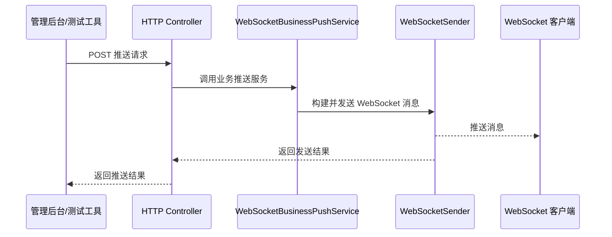

文件位置：`src/main/java/io/github/atengk/websocket/controller/WebSocketBusinessPushController.java`

下面的接口用于通过 HTTP 触发单用户通知、全站公告和任务进度推送。生产环境必须加权限控制，避免被未授权用户调用。

```java
package io.github.atengk.websocket.controller;

import io.github.atengk.websocket.sender.WebSocketSendResult;
import io.github.atengk.websocket.service.WebSocketBusinessPushService;
import jakarta.validation.constraints.Max;
import jakarta.validation.constraints.Min;
import jakarta.validation.constraints.NotBlank;
import lombok.Data;
import lombok.RequiredArgsConstructor;
import org.springframework.validation.annotation.Validated;
import org.springframework.web.bind.annotation.*;

/**
 * WebSocket 业务推送接口
 *
 * @author Ateng
 * @since 2026-05-05
 */
@Validated
@RestController
@RequiredArgsConstructor
@RequestMapping("/websocket/business-push")
public class WebSocketBusinessPushController {

    private final WebSocketBusinessPushService webSocketBusinessPushService;

    /**
     * 推送通知给指定用户
     *
     * @param userId  用户 ID
     * @param request 推送请求
     * @return 发送结果
     */
    @PostMapping("/users/{userId}/notice")
    public WebSocketSendResult pushNotice(@PathVariable String userId, @RequestBody @Validated NoticePushRequest request) {
        return webSocketBusinessPushService.pushNoticeToUser(userId, request.getTitle(), request.getContent());
    }

    /**
     * 广播系统公告
     *
     * @param request 公告请求
     * @return 发送结果
     */
    @PostMapping("/announcement")
    public WebSocketSendResult broadcastAnnouncement(@RequestBody @Validated NoticePushRequest request) {
        return webSocketBusinessPushService.broadcastAnnouncement(request.getTitle(), request.getContent());
    }

    /**
     * 推送任务进度
     *
     * @param userId  用户 ID
     * @param request 任务进度请求
     * @return 发送结果
     */
    @PostMapping("/users/{userId}/task-progress")
    public WebSocketSendResult pushTaskProgress(@PathVariable String userId, @RequestBody @Validated TaskProgressRequest request) {
        return webSocketBusinessPushService.pushTaskProgress(userId, request.getTaskId(), request.getProgress(), request.getStatus());
    }

    /**
     * 通知推送请求
     *
     * @author Ateng
     * @since 2026-05-05
     */
    @Data
    public static class NoticePushRequest {

        /**
         * 标题
         */
        @NotBlank(message = "标题不能为空")
        private String title;

        /**
         * 内容
         */
        @NotBlank(message = "内容不能为空")
        private String content;

    }

    /**
     * 任务进度推送请求
     *
     * @author Ateng
     * @since 2026-05-05
     */
    @Data
    public static class TaskProgressRequest {

        /**
         * 任务 ID
         */
        @NotBlank(message = "任务 ID 不能为空")
        private String taskId;

        /**
         * 进度百分比
         */
        @Min(value = 0, message = "进度不能小于 0")
        @Max(value = 100, message = "进度不能大于 100")
        private Integer progress;

        /**
         * 任务状态
         */
        @NotBlank(message = "任务状态不能为空")
        private String status;

    }

}
```

验证命令：

```bash
# 推送通知给用户 10001
curl -X POST "http://localhost:8080/api/websocket/business-push/users/10001/notice" \
  -H "Content-Type: application/json" \
  -d '{"title":"审批提醒","content":"你有一条新的审批任务"}'

# 广播系统公告
curl -X POST "http://localhost:8080/api/websocket/business-push/announcement" \
  -H "Content-Type: application/json" \
  -d '{"title":"系统公告","content":"系统将在今晚 23:00 发布更新"}'

# 推送任务进度
curl -X POST "http://localhost:8080/api/websocket/business-push/users/10001/task-progress" \
  -H "Content-Type: application/json" \
  -d '{"taskId":"TASK-10001","progress":60,"status":"RUNNING"}'
```

HTTP 触发推送注意事项：

1. 生产环境接口必须增加认证和权限校验。
2. 管理后台推送接口应记录操作人、推送目标、推送内容摘要。
3. 不建议通过 HTTP 接口同步推送大量用户，大批量推送应转 MQ 或异步任务。
4. 推送接口返回的是“发送到当前在线连接”的结果，不代表业务消息已被用户阅读。
5. 如果用户离线，应根据业务要求决定是否写入离线消息表。

### 定时任务触发推送

定时任务触发推送适合系统巡检、定时提醒、任务进度轮询、过期提醒、指标快照推送等场景。定时任务不应直接操作 Session，也应通过统一业务推送服务完成发送。

典型场景：

| 场景     | 示例                             |
| -------- | -------------------------------- |
| 定时提醒 | 每天 9 点提醒用户处理待办        |
| 任务进度 | 每 5 秒推送异步任务进度          |
| 系统指标 | 每 10 秒推送监控大屏数据         |
| 超时告警 | 定时扫描超时订单并推送告警       |
| 连接巡检 | 定时统计在线连接数并输出监控日志 |

文件位置：`src/main/java/io/github/atengk/websocket/task/WebSocketPushTask.java`

下面的定时任务演示系统公告和任务进度推送。实际项目中应先查询数据库或业务状态，再决定是否推送。

```java
package io.github.atengk.websocket.task;

import io.github.atengk.websocket.service.WebSocketBusinessPushService;
import lombok.RequiredArgsConstructor;
import lombok.extern.slf4j.Slf4j;
import org.springframework.scheduling.annotation.Scheduled;
import org.springframework.stereotype.Component;

/**
 * WebSocket 定时推送任务
 *
 * @author Ateng
 * @since 2026-05-05
 */
@Slf4j
@Component
@RequiredArgsConstructor
public class WebSocketPushTask {

    private final WebSocketBusinessPushService webSocketBusinessPushService;

    /**
     * 定时推送系统心跳公告示例
     */
    @Scheduled(cron = "${websocket.task.announcement-cron:0 0 9 * * ?}")
    public void pushDailyAnnouncement() {
        log.info("WebSocket 定时公告推送开始");
        webSocketBusinessPushService.broadcastAnnouncement("系统提醒", "请及时处理今日待办任务");
        log.info("WebSocket 定时公告推送结束");
    }

    /**
     * 定时推送任务进度示例
     */
    @Scheduled(fixedDelayString = "${websocket.task.progress-delay-millis:10000}")
    public void pushTaskProgress() {
        // 示例：实际项目应查询任务表，筛选正在执行且需要推送的任务。
        log.debug("WebSocket 定时任务进度推送检查开始");
    }

}
```

配置文件补充：

```yaml
websocket:
  task:
    # 每天 9 点推送系统提醒
    announcement-cron: "0 0 9 * * ?"

    # 任务进度扫描间隔，单位：毫秒
    progress-delay-millis: 10000
```

定时推送建议：

1. 定时任务必须避免重复推送，必要时记录推送状态。
2. 多实例部署时，定时任务可能在多个实例同时执行，应使用分布式锁或任务调度平台。
3. 大量用户推送不应在定时任务线程内同步循环完成。
4. 定时任务触发后可以投递 MQ，再由消费者异步推送。
5. 定时任务日志应打印任务开始、结束、处理数量和异常信息。

### 业务事件触发推送

业务事件触发推送适合业务模块和 WebSocket 模块解耦。业务服务只发布事件，不直接依赖 WebSocket 发送器；WebSocket 监听器收到事件后再完成推送。

适合场景：

| 业务事件     | 推送消息               |
| ------------ | ---------------------- |
| 审批单创建   | 推送待办提醒           |
| 订单状态变更 | 推送订单进度           |
| 文件导入完成 | 推送任务完成通知       |
| 告警产生     | 推送实时告警           |
| 用户被踢下线 | 推送退出通知并关闭连接 |

事件触发流程如下：

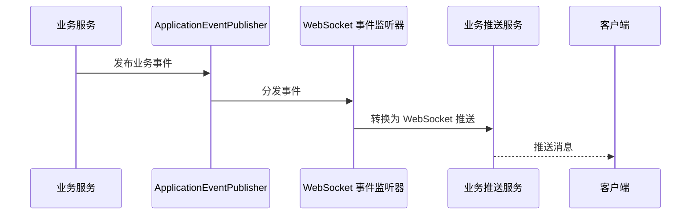

文件位置：`src/main/java/io/github/atengk/websocket/event/WebSocketNoticeEvent.java`

该事件用于表达需要推送给用户的通知消息。

```java
package io.github.atengk.websocket.event;

/**
 * WebSocket 通知事件
 *
 * @author Ateng
 * @since 2026-05-05
 */
public record WebSocketNoticeEvent(
        String userId,
        String title,
        String content
) {
}
```

文件位置：`src/main/java/io/github/atengk/websocket/event/WebSocketNoticeEventListener.java`

该监听器接收通知事件并调用统一业务推送服务。

```java
package io.github.atengk.websocket.event;

import io.github.atengk.websocket.service.WebSocketBusinessPushService;
import lombok.RequiredArgsConstructor;
import lombok.extern.slf4j.Slf4j;
import org.springframework.context.event.EventListener;
import org.springframework.stereotype.Component;

/**
 * WebSocket 通知事件监听器
 *
 * @author Ateng
 * @since 2026-05-05
 */
@Slf4j
@Component
@RequiredArgsConstructor
public class WebSocketNoticeEventListener {

    private final WebSocketBusinessPushService webSocketBusinessPushService;

    /**
     * 处理通知事件
     *
     * @param event 通知事件
     */
    @EventListener
    public void handleNoticeEvent(WebSocketNoticeEvent event) {
        log.info("WebSocket 通知事件开始处理，userId={}，title={}", event.userId(), event.title());
        webSocketBusinessPushService.pushNoticeToUser(event.userId(), event.title(), event.content());
    }

}
```

业务服务中发布事件：

```java
applicationEventPublisher.publishEvent(new WebSocketNoticeEvent(
        "10001",
        "审批提醒",
        "你有一条新的审批任务"
));
```

事件推送建议：

1. 业务事件适合单体应用或同一 JVM 内模块解耦。
2. 如果事件处理需要异步执行，可配合 `@Async`。
3. 如果事件不能丢失，应使用 MQ 替代 JVM 内事件。
4. 监听器中不要写复杂业务逻辑，只做事件转换和推送调用。
5. 业务事务未提交前不要推送“成功”类消息，可使用事务提交后事件机制。

### 消息队列触发推送

消息队列触发推送适合跨服务、跨实例、大批量、异步化推送场景。业务服务只负责把推送消息投递到 MQ，WebSocket 服务消费后完成在线推送。集群模式下，MQ 是更推荐的业务推送触发方式之一。

适合场景：

| 场景       | 说明                                                      |
| ---------- | --------------------------------------------------------- |
| 跨服务推送 | 订单服务、审批服务、通知服务向 WebSocket 服务发送推送事件 |
| 大批量推送 | 削峰填谷，避免 HTTP 请求线程阻塞                          |
| 可靠投递   | MQ 负责消息持久化和重试                                   |
| 集群广播   | 多个 WebSocket 实例消费广播消息                           |
| 异步解耦   | 业务处理和连接发送解耦                                    |

MQ 触发流程如下：

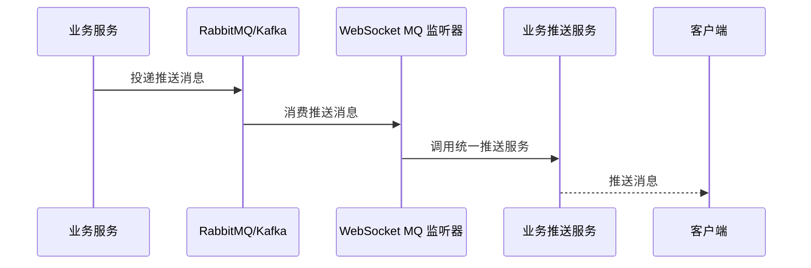

文件位置：`src/main/java/io/github/atengk/websocket/mq/WebSocketPushMqMessage.java`

该对象用于承载 MQ 中的推送消息内容。

```java
package io.github.atengk.websocket.mq;

import lombok.Data;

import java.io.Serializable;
import java.util.List;

/**
 * WebSocket MQ 推送消息
 *
 * @author Ateng
 * @since 2026-05-05
 */
@Data
public class WebSocketPushMqMessage implements Serializable {

    /**
     * 推送类型：USER、USERS、BROADCAST
     */
    private String pushMode;

    /**
     * 单个用户 ID
     */
    private String userId;

    /**
     * 多个用户 ID
     */
    private List<String> userIds;

    /**
     * 消息标题
     */
    private String title;

    /**
     * 消息内容
     */
    private String content;

}
```

文件位置：`src/main/java/io/github/atengk/websocket/mq/WebSocketPushMqListener.java`

下面示例基于 RabbitMQ。使用前需要引入 `spring-boot-starter-amqp`，并配置队列、交换机和绑定关系。

```java
package io.github.atengk.websocket.mq;

import cn.hutool.core.collection.CollUtil;
import cn.hutool.core.util.StrUtil;
import io.github.atengk.websocket.service.WebSocketBusinessPushService;
import lombok.RequiredArgsConstructor;
import lombok.extern.slf4j.Slf4j;
import org.springframework.amqp.rabbit.annotation.RabbitListener;
import org.springframework.stereotype.Component;

/**
 * WebSocket MQ 推送监听器
 *
 * @author Ateng
 * @since 2026-05-05
 */
@Slf4j
@Component
@RequiredArgsConstructor
public class WebSocketPushMqListener {

    private final WebSocketBusinessPushService webSocketBusinessPushService;

    /**
     * 消费 WebSocket 推送消息
     *
     * @param message MQ 推送消息
     */
    @RabbitListener(queues = "${websocket.mq.push-queue:websocket.push.queue}")
    public void onMessage(WebSocketPushMqMessage message) {
        if (message == null || StrUtil.isBlank(message.getPushMode())) {
            log.warn("WebSocket MQ 推送消息无效，message={}", message);
            return;
        }

        log.info("WebSocket MQ 推送消息开始处理，pushMode={}，title={}", message.getPushMode(), message.getTitle());

        switch (message.getPushMode()) {
            case "USER" -> webSocketBusinessPushService.pushNoticeToUser(
                    message.getUserId(), message.getTitle(), message.getContent());
            case "USERS" -> {
                if (CollUtil.isNotEmpty(message.getUserIds())) {
                    webSocketBusinessPushService.pushNoticeToUsers(
                            message.getUserIds(), message.getTitle(), message.getContent());
                }
            }
            case "BROADCAST" -> webSocketBusinessPushService.broadcastAnnouncement(
                    message.getTitle(), message.getContent());
            default -> log.warn("WebSocket MQ 推送模式不支持，pushMode={}", message.getPushMode());
        }
    }

}
```

配置文件示例：

```yaml
websocket:
  mq:
    # WebSocket 推送队列名称
    push-queue: websocket.push.queue
```

MQ 推送建议：

1. 推送消息应包含业务消息 ID，便于幂等和排查。
2. 大批量用户推送建议只发送业务条件，由消费者分页查询目标用户。
3. 消费失败要结合 MQ 重试、死信队列和告警处理。
4. 集群模式下，如果每个实例都消费同一条广播消息，需要明确是“竞争消费”还是“广播消费”。
5. 对单用户推送，集群下可使用 Redis Pub/Sub 或连接路由表判断用户所在实例。

### 数据变更触发推送

数据变更触发推送适合在业务数据创建、更新、删除后实时通知客户端刷新页面或展示新状态。例如通知创建后推送给接收人，任务状态变更后推送进度，订单状态变更后推送物流状态。

数据变更触发推送有两种常见方式：

| 方式                       | 说明                               |
| -------------------------- | ---------------------------------- |
| 业务服务内直接调用推送服务 | 简单直接，适合单体项目             |
| 数据变更后发布事件或 MQ    | 解耦更好，适合复杂系统或分布式系统 |

文件位置：`src/main/java/io/github/atengk/websocket/notice/NoticeBusinessService.java`

下面示例演示业务数据保存后发布 WebSocket 通知事件。实际项目中可以在保存数据库成功后发布事件，或在事务提交后投递 MQ。

```java
package io.github.atengk.websocket.notice;

import io.github.atengk.websocket.event.WebSocketNoticeEvent;
import lombok.RequiredArgsConstructor;
import lombok.extern.slf4j.Slf4j;
import org.springframework.context.ApplicationEventPublisher;
import org.springframework.stereotype.Service;

/**
 * 通知业务服务
 *
 * @author Ateng
 * @since 2026-05-05
 */
@Slf4j
@Service
@RequiredArgsConstructor
public class NoticeBusinessService {

    private final ApplicationEventPublisher applicationEventPublisher;

    /**
     * 创建通知并触发推送
     *
     * @param receiverUserId 接收用户 ID
     * @param title          通知标题
     * @param content        通知内容
     */
    public void createNotice(String receiverUserId, String title, String content) {
        // 示例：这里应先保存通知到数据库，保存成功后再发布推送事件。
        log.info("通知创建成功，receiverUserId={}，title={}", receiverUserId, title);

        applicationEventPublisher.publishEvent(new WebSocketNoticeEvent(
                receiverUserId,
                title,
                content
        ));
    }

}
```

数据变更触发推送建议：

1. 数据库事务未提交前不要推送“已成功”消息。
2. 对重要通知，先入库再推送；用户离线时可通过历史消息拉取。
3. 对临时状态类消息，可以只推送在线用户，不做持久化。
4. 数据变更频繁的业务要做合并推送，避免频繁刷新前端。
5. 批量数据变更后应聚合推送结果，而不是逐条推送。

## 心跳与保活

心跳与保活用于判断连接是否仍然有效，避免网络异常、浏览器页面休眠、代理层断开、客户端异常退出后服务端仍然保留无效 Session。WebSocket 是长连接协议，生产环境必须设计心跳机制、超时检测和客户端重连策略。

心跳机制建议采用“应用层 JSON 心跳 + 服务端定时清理”的方式。浏览器原生 WebSocket 不直接向 JavaScript 暴露底层 Ping 发送接口，因此前端通常通过定时发送业务心跳消息实现保活。

推荐心跳流程如下：

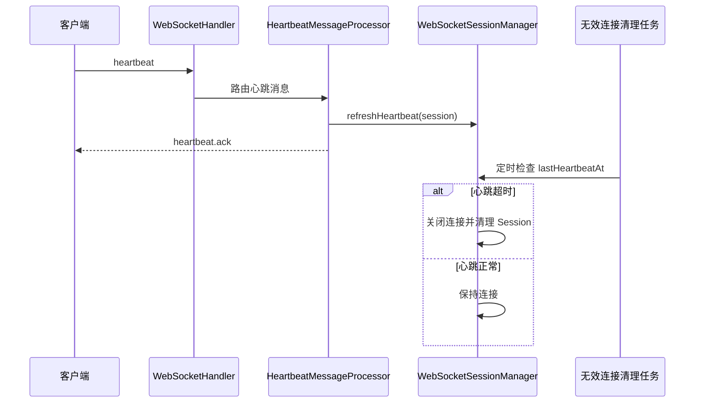

### 客户端心跳机制

客户端心跳机制用于定时向服务端发送心跳消息，证明当前页面仍然存活。心跳消息应尽量轻量，不携带复杂业务数据。

客户端发送心跳示例：

```json
{
  "seq": "heartbeat-1777948200000",
  "type": "heartbeat",
  "timestamp": 1777948200000,
  "data": {}
}
```

服务端响应示例：

```json
{
  "seq": "heartbeat-1777948200000",
  "type": "heartbeat.ack",
  "success": true,
  "code": "OK",
  "message": "成功",
  "data": {
    "serverTime": 1777948201000
  },
  "timestamp": 1777948201000
}
```

前端心跳封装示例：

```javascript
class NativeWebSocketClient {
  constructor(options) {
    this.url = options.url
    this.token = options.token
    this.heartbeatInterval = options.heartbeatInterval || 30000
    this.reconnectInterval = options.reconnectInterval || 3000
    this.maxReconnectTimes = options.maxReconnectTimes || 10

    this.socket = null
    this.heartbeatTimer = null
    this.reconnectTimer = null
    this.reconnectTimes = 0
    this.manualClose = false
  }

  connect() {
    const token = encodeURIComponent(this.token)
    this.socket = new WebSocket(`${this.url}?token=${token}`)

    this.socket.onopen = () => {
      console.log('WebSocket 连接成功')
      this.reconnectTimes = 0
      this.startHeartbeat()
    }

    this.socket.onmessage = event => {
      const message = JSON.parse(event.data)
      this.handleMessage(message)
    }

    this.socket.onclose = event => {
      console.warn('WebSocket 连接关闭', event.code, event.reason)
      this.stopHeartbeat()
      this.reconnect()
    }

    this.socket.onerror = event => {
      console.error('WebSocket 连接异常', event)
    }
  }

  send(type, data = {}) {
    if (!this.socket || this.socket.readyState !== WebSocket.OPEN) {
      console.warn('WebSocket 未连接，消息发送跳过', type)
      return
    }

    this.socket.send(JSON.stringify({
      seq: this.nextSeq(),
      type,
      timestamp: Date.now(),
      data
    }))
  }

  startHeartbeat() {
    this.stopHeartbeat()
    this.heartbeatTimer = window.setInterval(() => {
      this.send('heartbeat', {})
    }, this.heartbeatInterval)
  }

  stopHeartbeat() {
    if (this.heartbeatTimer) {
      window.clearInterval(this.heartbeatTimer)
      this.heartbeatTimer = null
    }
  }

  reconnect() {
    if (this.manualClose) {
      return
    }

    if (this.reconnectTimes >= this.maxReconnectTimes) {
      console.warn('WebSocket 重连次数已达上限')
      return
    }

    if (this.reconnectTimer) {
      return
    }

    this.reconnectTimer = window.setTimeout(() => {
      this.reconnectTimer = null
      this.reconnectTimes += 1
      console.log('WebSocket 开始重连', this.reconnectTimes)
      this.connect()
    }, this.reconnectInterval)
  }

  close() {
    this.manualClose = true
    this.stopHeartbeat()

    if (this.reconnectTimer) {
      window.clearTimeout(this.reconnectTimer)
      this.reconnectTimer = null
    }

    if (this.socket) {
      this.socket.close(1000, 'manual close')
      this.socket = null
    }
  }

  handleMessage(message) {
    if (message.type === 'heartbeat.ack') {
      console.debug('WebSocket 心跳响应', message.data)
      return
    }

    console.log('WebSocket 收到消息', message)
  }

  nextSeq() {
    return `client-${Date.now()}-${Math.random().toString(16).slice(2)}`
  }
}
```

使用示例：

```javascript
const protocol = window.location.protocol === 'https:' ? 'wss:' : 'ws:'
const wsClient = new NativeWebSocketClient({
  url: `${protocol}//${window.location.host}/api/ws/native`,
  token: 'dev-10001',
  heartbeatInterval: 30000,
  reconnectInterval: 3000,
  maxReconnectTimes: 10
})

wsClient.connect()

window.addEventListener('beforeunload', () => {
  wsClient.close()
})
```

客户端心跳建议：

1. 心跳间隔建议 20 到 30 秒。
2. 心跳消息只包含必要字段，不携带业务数据。
3. 页面卸载时主动关闭连接。
4. 网络断开、页面休眠后恢复时，应重新建立连接。
5. 前端应区分手动关闭和异常断开，手动关闭不自动重连。

### 服务端心跳检测

服务端心跳检测用于根据最后心跳时间判断连接是否失效。前面已经在 `HeartbeatMessageProcessor` 中调用 `webSocketSessionManager.refreshHeartbeat(session)`，并在 `WebSocketSessionCleaner` 中定时清理超时连接。

配置建议：

```yaml
websocket:
  # 客户端心跳间隔，单位：秒
  heartbeat-interval-seconds: 30

  # 服务端判定连接超时的时间，单位：秒，建议为心跳间隔的 2 到 3 倍
  heartbeat-timeout-seconds: 90

  # 无效连接清理任务执行间隔，单位：毫秒
  session-clean-delay-millis: 30000
```

服务端检测逻辑如下：

```text
当前时间 - lastHeartbeatAt > heartbeatTimeoutSeconds
        │
        ├── true：关闭连接，清理 Session
        └── false：保持连接
```

服务端心跳检测建议：

1. 收到 `heartbeat` 消息时刷新 `lastHeartbeatAt`。
2. 收到 `PongMessage` 时也可以刷新 `lastHeartbeatAt`。
3. 连接建立时初始化 `lastHeartbeatAt`。
4. 超时连接由定时任务关闭，关闭后统一走 Session 清理逻辑。
5. 如果业务消息持续收发，也可以把普通业务消息视为活跃行为，刷新心跳时间。

如果希望普通业务消息也刷新活跃时间，可以在 Handler 接收到合法消息后刷新：

```java
// 收到任意合法文本消息后刷新连接活跃时间
webSocketSessionManager.refreshHeartbeat(session);
```

### Ping Pong 处理

Ping/Pong 是 WebSocket 协议层的保活机制。服务端可以发送 `PingMessage`，客户端收到后通常会由底层自动响应 Pong；服务端收到 `PongMessage` 后刷新最后活跃时间。对于浏览器前端，JavaScript 无法直接构造协议层 Ping 帧，所以业务上仍建议使用 JSON 心跳作为主机制。

服务端 Pong 处理已经在 Handler 中实现：

```java
/**
 * 接收 Pong 消息
 *
 * @param session WebSocket 会话
 * @param message Pong 消息
 */
@Override
protected void handlePongMessage(WebSocketSession session, PongMessage message) {
    webSocketSessionManager.refreshHeartbeat(session);
    log.debug("WebSocket 接收 Pong 消息，userId={}，sessionId={}，payloadLength={}",
            getUserId(session), session.getId(), message.getPayloadLength());
}
```

如需服务端主动发送 Ping，可以在 `WebSocketSessionManager` 中增加获取全部在线连接的方法后，通过定时任务发送。

文件位置：`src/main/java/io/github/atengk/websocket/task/WebSocketPingTask.java`

下面的任务用于定时向当前实例所有在线连接发送 Ping 帧。

```java
package io.github.atengk.websocket.task;

import io.github.atengk.websocket.session.WebSocketSessionManager;
import lombok.RequiredArgsConstructor;
import lombok.extern.slf4j.Slf4j;
import org.springframework.scheduling.annotation.Scheduled;
import org.springframework.stereotype.Component;
import org.springframework.web.socket.PingMessage;
import org.springframework.web.socket.WebSocketSession;

import java.nio.ByteBuffer;
import java.nio.charset.StandardCharsets;
import java.util.List;

/**
 * WebSocket Ping 保活任务
 *
 * @author Ateng
 * @since 2026-05-05
 */
@Slf4j
@Component
@RequiredArgsConstructor
public class WebSocketPingTask {

    private final WebSocketSessionManager webSocketSessionManager;

    /**
     * 定时发送 Ping 消息
     */
    @Scheduled(fixedDelayString = "${websocket.ping-delay-millis:30000}")
    public void sendPing() {
        List<WebSocketSession> sessions = webSocketSessionManager.getAllOpenSessions();
        if (sessions.isEmpty()) {
            return;
        }

        int successCount = 0;
        int failCount = 0;

        for (WebSocketSession session : sessions) {
            try {
                synchronized (session) {
                    session.sendMessage(new PingMessage(ByteBuffer.wrap("ping".getBytes(StandardCharsets.UTF_8))));
                }
                successCount++;
            } catch (Exception e) {
                failCount++;
                log.warn("WebSocket Ping 发送失败，sessionId={}", session.getId(), e);
            }
        }

        log.debug("WebSocket Ping 发送完成，successCount={}，failCount={}", successCount, failCount);
    }

}
```

配置文件补充：

```yaml
websocket:
  # 服务端 Ping 发送间隔，单位：毫秒
  ping-delay-millis: 30000
```

Ping/Pong 使用建议：

1. 浏览器客户端建议以 JSON 心跳为主。
2. 服务端 Ping 可作为补充机制，不应完全替代应用层心跳。
3. 如果业务消息频繁，可以适当降低 Ping 频率。
4. Ping 发送失败应记录日志，但清理动作仍由超时检测统一处理。
5. 不要同时配置过高频率的 JSON 心跳和协议层 Ping，避免无意义流量。

### 超时连接关闭

超时连接关闭用于释放服务端资源，避免无效连接长期占用内存、线程、文件描述符和会话映射。超时关闭应统一由 `WebSocketSessionCleaner` 执行。

前面 `WebSocketSessionManager#cleanInvalidSessions(...)` 已实现核心逻辑：

```java
boolean heartbeatTimeout = now - Convert.toLong(sessionInfo.getLastHeartbeatAt(), 0L) > heartbeatTimeoutMillis;

if (session == null || !session.isOpen() || heartbeatTimeout) {
    closeIfOpen(session, CloseStatus.SESSION_NOT_RELIABLE.withReason("heartbeat timeout"));
    removeBySessionId(sessionInfo.getSessionId());
    cleanCount++;
}
```

超时关闭策略建议：

| 参数           | 推荐值          | 说明                     |
| -------------- | --------------- | ------------------------ |
| 客户端心跳间隔 | 30 秒           | 前端定时发送 `heartbeat` |
| 服务端心跳超时 | 90 秒           | 约为心跳间隔 3 倍        |
| 清理任务间隔   | 30 秒           | 周期性清理无效连接       |
| 重连间隔       | 3 秒起          | 前端异常断开后重连       |
| 最大重连次数   | 10 次或无限退避 | 按业务决定               |

超时连接关闭注意事项：

1. 服务端关闭连接后，客户端会触发 `onclose`。
2. 客户端收到异常关闭后应进入重连流程。
3. 服务端不应对同一个无效连接重复关闭和重复清理。
4. 连接关闭日志应包含 `userId`、`sessionId`、关闭码和原因。
5. 如果大量连接同时超时，应排查网关、Nginx、网络或前端心跳是否异常。

### 客户端重连策略

客户端重连策略用于提升网络波动、服务重启、代理断开后的恢复能力。重连策略不能简单地无限快速重连，否则服务重启时可能形成重连风暴。

推荐重连策略：

| 策略             | 说明                             |
| ---------------- | -------------------------------- |
| 手动关闭不重连   | 用户退出登录或页面卸载时不重连   |
| 异常关闭自动重连 | 网络断开、服务重启后尝试恢复     |
| 递增退避         | 重连间隔逐步增加，避免重连风暴   |
| 最大次数限制     | 达到上限后提示用户刷新页面       |
| Token 刷新       | Token 过期时先刷新 Token 再重连  |
| 订阅恢复         | 重连成功后重新订阅业务分组或任务 |

改进版重连间隔计算：

```javascript
function getReconnectDelay(reconnectTimes) {
  const baseDelay = 3000
  const maxDelay = 30000
  const delay = baseDelay * Math.pow(2, reconnectTimes - 1)
  return Math.min(delay, maxDelay)
}
```

重连成功后恢复订阅示例：

```javascript
socket.onopen = () => {
  console.log('WebSocket 重连成功')
  reconnectTimes = 0

  // 恢复心跳
  startHeartbeat()

  // 恢复业务订阅，例如任务进度、项目房间、监控大屏等
  send('task.subscribe', {
    taskId: 'TASK-10001'
  })
}
```

Token 过期处理建议：

```javascript
function handleMessage(message) {
  if (message.code === 'UNAUTHORIZED') {
    console.warn('WebSocket 认证失效，准备刷新 Token')
    closeSocket()

    // 示例：刷新 Token 后重新连接。实际项目应接入登录态刷新逻辑。
    refreshToken().then(newToken => {
      token = newToken
      connect()
    })

    return
  }

  console.log('收到业务消息', message)
}
```

客户端重连注意事项：

1. 不要在 `onerror` 和 `onclose` 中同时重复触发重连，应统一由 `onclose` 处理。
2. 服务端主动返回认证失败时，应先刷新 Token，不要盲目重连。
3. 重连成功后，前端需要恢复订阅状态。
4. 页面隐藏或休眠场景下，心跳可能不稳定，恢复可见后应检查连接状态。
5. 移动端弱网环境下建议使用指数退避重连。

本节完成后，业务集成和心跳保活能力已经具备以下基础：

| 能力               | 状态                 |
| ------------------ | -------------------- |
| HTTP 接口触发推送  | 已完成               |
| 定时任务触发推送   | 已完成               |
| 业务事件触发推送   | 已完成               |
| MQ 触发推送        | 已提供 RabbitMQ 示例 |
| 数据变更触发推送   | 已完成               |
| 客户端应用层心跳   | 已完成               |
| 服务端心跳检测     | 已完成               |
| Ping/Pong 补充保活 | 已完成               |
| 超时连接关闭       | 已完成               |
| 客户端断线重连     | 已完成               |


## 并发与异步处理

并发与异步处理用于提升 WebSocket 服务在大量连接、大量消息和批量推送场景下的稳定性。原生 WebSocket 连接本身是长连接，服务端不能把耗时业务逻辑、批量发送、外部接口调用直接堆在 WebSocket IO 回调线程中，否则容易导致连接处理阻塞、消息积压和推送延迟。

推荐线程模型如下：

```text
WebSocket IO 线程
    │
    ├── 连接建立、连接关闭、基础校验
    │
    ├── 快速解析协议字段
    │
    └── 投递到业务消息线程池
            │
            ├── 参数校验
            ├── 消息路由
            ├── 业务处理
            └── 投递到发送队列
                    │
                    └── WebSocket 发送线程池
```

### 消息处理线程模型

消息处理线程模型用于区分“连接 IO 线程”和“业务处理线程”。Handler 中应只做轻量工作，例如消息长度检查、JSON 解析失败处理、构造上下文和投递任务；耗时业务逻辑应交给独立线程池执行。

推荐线程池规划如下：

| 线程池            | 用途                     | 建议                    |
| ----------------- | ------------------------ | ----------------------- |
| WebSocket IO 线程 | 容器负责连接读写         | 不直接执行耗时业务      |
| 消息处理线程池    | 参数校验、路由、业务处理 | 根据 CPU 和业务耗时配置 |
| 消息发送线程池    | WebSocket 消息发送       | 与业务处理线程池隔离    |
| 定时任务线程池    | 心跳清理、Ping、统计     | 独立配置                |
| MQ 消费线程池     | 消费推送事件             | 根据 MQ 消费能力配置    |

配置文件补充：

```yaml
websocket:
  async:
    # 消息处理线程池核心线程数
    message-core-pool-size: 8

    # 消息处理线程池最大线程数
    message-max-pool-size: 32

    # 消息处理线程池队列容量
    message-queue-capacity: 2000

    # 发送线程池核心线程数
    send-core-pool-size: 8

    # 发送线程池最大线程数
    send-max-pool-size: 32

    # 发送线程池队列容量
    send-queue-capacity: 5000

    # 单个 Session 发送队列容量
    session-send-queue-capacity: 200

    # 单条消息发送超时时间，单位：毫秒
    send-timeout-millis: 3000

    # 单用户每秒最大消息数
    user-rate-limit-per-second: 20
```

文件位置：`src/main/java/io/github/atengk/websocket/config/WebSocketAsyncProperties.java`

该配置类用于绑定 WebSocket 异步处理相关参数。

```java
package io.github.atengk.websocket.config;

import lombok.Data;
import org.springframework.boot.context.properties.ConfigurationProperties;

/**
 * WebSocket 异步配置属性
 *
 * @author Ateng
 * @since 2026-05-05
 */
@Data
@ConfigurationProperties(prefix = "websocket.async")
public class WebSocketAsyncProperties {

    private Integer messageCorePoolSize = 8;

    private Integer messageMaxPoolSize = 32;

    private Integer messageQueueCapacity = 2000;

    private Integer sendCorePoolSize = 8;

    private Integer sendMaxPoolSize = 32;

    private Integer sendQueueCapacity = 5000;

    private Integer sessionSendQueueCapacity = 200;

    private Long sendTimeoutMillis = 3000L;

    private Integer userRateLimitPerSecond = 20;

}
```

文件位置：`src/main/java/io/github/atengk/websocket/config/WebSocketThreadPoolConfig.java`

下面的配置类用于定义消息处理线程池和消息发送线程池。

```java
package io.github.atengk.websocket.config;

import lombok.RequiredArgsConstructor;
import org.springframework.boot.context.properties.EnableConfigurationProperties;
import org.springframework.context.annotation.Bean;
import org.springframework.context.annotation.Configuration;
import org.springframework.scheduling.concurrent.ThreadPoolTaskExecutor;

import java.util.concurrent.Executor;
import java.util.concurrent.ThreadPoolExecutor;

/**
 * WebSocket 线程池配置
 *
 * @author Ateng
 * @since 2026-05-05
 */
@Configuration
@RequiredArgsConstructor
@EnableConfigurationProperties(WebSocketAsyncProperties.class)
public class WebSocketThreadPoolConfig {

    private final WebSocketAsyncProperties asyncProperties;

    @Bean("websocketMessageExecutor")
    public Executor websocketMessageExecutor() {
        ThreadPoolTaskExecutor executor = new ThreadPoolTaskExecutor();
        executor.setCorePoolSize(asyncProperties.getMessageCorePoolSize());
        executor.setMaxPoolSize(asyncProperties.getMessageMaxPoolSize());
        executor.setQueueCapacity(asyncProperties.getMessageQueueCapacity());
        executor.setThreadNamePrefix("ws-message-");
        executor.setRejectedExecutionHandler(new ThreadPoolExecutor.CallerRunsPolicy());
        executor.initialize();
        return executor;
    }

    @Bean("websocketSendExecutor")
    public Executor websocketSendExecutor() {
        ThreadPoolTaskExecutor executor = new ThreadPoolTaskExecutor();
        executor.setCorePoolSize(asyncProperties.getSendCorePoolSize());
        executor.setMaxPoolSize(asyncProperties.getSendMaxPoolSize());
        executor.setQueueCapacity(asyncProperties.getSendQueueCapacity());
        executor.setThreadNamePrefix("ws-send-");
        executor.setRejectedExecutionHandler(new ThreadPoolExecutor.AbortPolicy());
        executor.initialize();
        return executor;
    }

}
```

Handler 中接入消息线程池的核心方式如下。`handleTextMessage` 不再同步执行完整路由，而是将消息处理任务投递到 `websocketMessageExecutor`。

文件位置：`src/main/java/io/github/atengk/websocket/handler/NativeWebSocketHandler.java`

```java
private final Executor websocketMessageExecutor;

private final WebSocketMessageRouter webSocketMessageRouter;

private final WebSocketSender webSocketSender;

@Override
protected void handleTextMessage(WebSocketSession session, TextMessage message) {
    websocketMessageExecutor.execute(() -> handleTextMessageAsync(session, message));
}

private void handleTextMessageAsync(WebSocketSession session, TextMessage message) {
    String payload = message.getPayload();
    String userId = getUserId(session);

    try {
        if (StrUtil.isBlank(payload)) {
            webSocketSender.sendToSession(session.getId(), WebSocketResponse.error(null, WebSocketErrorCode.INVALID_MESSAGE));
            return;
        }

        WebSocketRequest request = objectMapper.readValue(payload, WebSocketRequest.class);
        WebSocketContext context = new WebSocketContext(
                session,
                userId,
                Convert.toStr(session.getAttributes().get(WebSocketAttributeKeys.TENANT_ID)),
                Convert.toStr(session.getAttributes().get(WebSocketAttributeKeys.USERNAME))
        );

        WebSocketResponse<?> response = webSocketMessageRouter.route(context, request);
        webSocketSender.sendToSession(session.getId(), response);
    } catch (Exception e) {
        log.error("WebSocket 异步消息处理异常，userId={}，sessionId={}", userId, session.getId(), e);
        webSocketSender.sendToSession(session.getId(), WebSocketResponse.error(null, WebSocketErrorCode.SERVER_ERROR));
    }
}
```

线程模型设计建议：

1. Handler 中不要直接执行数据库查询、远程调用、复杂计算和批量推送。
2. 消息处理线程池和发送线程池要分开，避免发送阻塞影响业务处理。
3. 线程池队列容量必须有限，避免高峰期无限堆积导致内存溢出。
4. 对关键业务消息可以使用 MQ 异步化，对普通消息可以直接丢弃或限流。
5. `CallerRunsPolicy` 适合对入口形成自然反压，但要谨慎使用，避免拖慢 IO 线程。

### 异步发送设计

异步发送设计用于避免业务线程直接阻塞在 `session.sendMessage(...)` 上。WebSocket 发送过程可能因为客户端网络慢、连接异常、代理阻塞等原因变慢。如果同步发送大量消息，会拖慢业务处理线程。

推荐发送链路如下：

```text
业务模块
  │
  ▼
WebSocketSender
  │
  ▼
单 Session 有界发送队列
  │
  ▼
发送线程池
  │
  ▼
session.sendMessage(...)
```

异步发送的关键点是“同一个 Session 的消息要串行发送，不同 Session 的消息可以并行发送”。如果多个线程同时向同一个 `WebSocketSession` 发送消息，容易出现并发发送问题，因此建议为每个 Session 维护独立发送队列。

文件位置：`src/main/java/io/github/atengk/websocket/sender/QueuedWebSocketSender.java`

下面的发送器基于“单 Session 有界队列 + 异步发送线程池”实现，适合替换前面基础版 `DefaultWebSocketSender`。

```java
package io.github.atengk.websocket.sender;

import cn.hutool.core.collection.CollUtil;
import cn.hutool.core.util.StrUtil;
import com.fasterxml.jackson.databind.ObjectMapper;
import io.github.atengk.websocket.config.WebSocketAsyncProperties;
import io.github.atengk.websocket.group.WebSocketGroupManager;
import io.github.atengk.websocket.protocol.WebSocketResponse;
import io.github.atengk.websocket.session.WebSocketSessionManager;
import lombok.RequiredArgsConstructor;
import lombok.extern.slf4j.Slf4j;
import org.springframework.beans.factory.annotation.Qualifier;
import org.springframework.stereotype.Service;
import org.springframework.web.socket.TextMessage;
import org.springframework.web.socket.WebSocketSession;

import java.util.Collection;
import java.util.LinkedHashMap;
import java.util.List;
import java.util.Map;
import java.util.Set;
import java.util.concurrent.BlockingQueue;
import java.util.concurrent.ConcurrentHashMap;
import java.util.concurrent.ConcurrentMap;
import java.util.concurrent.Executor;
import java.util.concurrent.LinkedBlockingQueue;
import java.util.concurrent.atomic.AtomicBoolean;

/**
 * 基于队列的 WebSocket 异步发送器
 *
 * @author Ateng
 * @since 2026-05-05
 */
@Slf4j
@Service
@RequiredArgsConstructor
public class QueuedWebSocketSender implements WebSocketSender {

    private final ObjectMapper objectMapper;

    private final WebSocketSessionManager webSocketSessionManager;

    private final WebSocketGroupManager webSocketGroupManager;

    private final WebSocketAsyncProperties asyncProperties;

    @Qualifier("websocketSendExecutor")
    private final Executor websocketSendExecutor;

    private final ConcurrentMap<String, SessionSendQueue> sessionQueueMap = new ConcurrentHashMap<>();

    @Override
    public WebSocketSendResult sendToUser(String userId, WebSocketResponse<?> message) {
        if (StrUtil.isBlank(userId)) {
            return WebSocketSendResult.fail("用户 ID 不能为空");
        }

        List<WebSocketSession> sessions = webSocketSessionManager.getUserSessions(userId);
        if (CollUtil.isEmpty(sessions)) {
            log.info("WebSocket 用户离线，跳过推送，userId={}，type={}", userId, message.getType());
            return WebSocketSendResult.offline("用户不在线");
        }

        int successCount = 0;
        int failCount = 0;

        for (WebSocketSession session : sessions) {
            WebSocketSendResult result = sendToSession(session.getId(), message);
            if (Boolean.TRUE.equals(result.getSuccess())) {
                successCount++;
            } else {
                failCount++;
            }
        }

        return WebSocketSendResult.builder()
                .success(failCount == 0)
                .offline(false)
                .successCount(successCount)
                .failCount(failCount)
                .offlineCount(0)
                .message(failCount == 0 ? "发送成功" : "部分发送失败")
                .build();
    }

    @Override
    public Map<String, WebSocketSendResult> sendToUsers(Collection<String> userIds, WebSocketResponse<?> message) {
        Map<String, WebSocketSendResult> resultMap = new LinkedHashMap<>();
        if (CollUtil.isEmpty(userIds)) {
            return resultMap;
        }

        for (String userId : userIds) {
            resultMap.put(userId, sendToUser(userId, message));
        }
        return resultMap;
    }

    @Override
    public WebSocketSendResult broadcast(WebSocketResponse<?> message) {
        List<WebSocketSession> sessions = webSocketSessionManager.getAllOpenSessions();
        if (CollUtil.isEmpty(sessions)) {
            return WebSocketSendResult.offline("当前实例无在线连接");
        }

        int successCount = 0;
        int failCount = 0;

        for (WebSocketSession session : sessions) {
            WebSocketSendResult result = sendToSession(session.getId(), message);
            if (Boolean.TRUE.equals(result.getSuccess())) {
                successCount++;
            } else {
                failCount++;
            }
        }

        return WebSocketSendResult.builder()
                .success(failCount == 0)
                .offline(false)
                .successCount(successCount)
                .failCount(failCount)
                .offlineCount(0)
                .message(failCount == 0 ? "广播成功" : "部分广播失败")
                .build();
    }

    @Override
    public WebSocketSendResult sendToGroup(String groupId, WebSocketResponse<?> message) {
        Set<String> userIds = webSocketGroupManager.getUserIds(groupId);
        if (CollUtil.isEmpty(userIds)) {
            return WebSocketSendResult.offline("分组无在线用户");
        }

        Map<String, WebSocketSendResult> resultMap = sendToUsers(userIds, message);
        int successCount = resultMap.values().stream().mapToInt(WebSocketSendResult::getSuccessCount).sum();
        int failCount = resultMap.values().stream().mapToInt(WebSocketSendResult::getFailCount).sum();
        int offlineCount = resultMap.values().stream().mapToInt(WebSocketSendResult::getOfflineCount).sum();

        return WebSocketSendResult.builder()
                .success(failCount == 0)
                .offline(successCount == 0)
                .successCount(successCount)
                .failCount(failCount)
                .offlineCount(offlineCount)
                .message("分组推送完成")
                .build();
    }

    @Override
    public WebSocketSendResult sendToSession(String sessionId, WebSocketResponse<?> message) {
        if (StrUtil.isBlank(sessionId)) {
            return WebSocketSendResult.fail("Session ID 不能为空");
        }

        WebSocketSession session = webSocketSessionManager.getSession(sessionId);
        if (session == null || !session.isOpen()) {
            return WebSocketSendResult.offline("Session 不在线");
        }

        SessionSendQueue queue = sessionQueueMap.computeIfAbsent(sessionId, key ->
                new SessionSendQueue(new LinkedBlockingQueue<>(asyncProperties.getSessionSendQueueCapacity()))
        );

        boolean offered = queue.queue().offer(message);
        if (!offered) {
            log.warn("WebSocket Session 发送队列已满，sessionId={}，type={}", sessionId, message.getType());
            return WebSocketSendResult.fail("Session 发送队列已满");
        }

        startDrain(sessionId, session, queue);
        return WebSocketSendResult.success(1);
    }

    private void startDrain(String sessionId, WebSocketSession session, SessionSendQueue queue) {
        if (!queue.draining().compareAndSet(false, true)) {
            return;
        }

        websocketSendExecutor.execute(() -> {
            try {
                drainQueue(sessionId, session, queue);
            } finally {
                queue.draining().set(false);
                if (!queue.queue().isEmpty()) {
                    startDrain(sessionId, session, queue);
                }
            }
        });
    }

    private void drainQueue(String sessionId, WebSocketSession session, SessionSendQueue queue) {
        while (session.isOpen()) {
            WebSocketResponse<?> message = queue.queue().poll();
            if (message == null) {
                return;
            }

            try {
                String payload = objectMapper.writeValueAsString(message);
                session.sendMessage(new TextMessage(payload));
            } catch (Exception e) {
                log.warn("WebSocket 异步消息发送失败，sessionId={}，type={}",
                        sessionId, message.getType(), e);
                return;
            }
        }

        sessionQueueMap.remove(sessionId);
    }

    private record SessionSendQueue(
            BlockingQueue<WebSocketResponse<?>> queue,
            AtomicBoolean draining
    ) {

        private SessionSendQueue(BlockingQueue<WebSocketResponse<?>> queue) {
            this(queue, new AtomicBoolean(false));
        }

    }

}
```

异步发送设计建议：

1. 同一个 Session 的消息必须串行发送。
2. 每个 Session 的发送队列必须有上限。
3. 队列满时要返回失败或丢弃低优先级消息。
4. 业务线程只负责入队，不直接执行底层发送。
5. 客户端网络慢会导致单个 Session 队列堆积，应配合限流和超时关闭。

### 发送超时控制

发送超时控制用于避免慢客户端长时间占用服务端发送资源。慢客户端通常表现为队列持续增长、发送耗时升高、连接状态不稳定。服务端应在发送层记录耗时，并对超时连接采取降级或关闭策略。

发送超时建议：

| 场景             | 策略                       |
| ---------------- | -------------------------- |
| 单条发送耗时过长 | 记录日志，统计慢连接       |
| 发送队列持续堆积 | 丢弃低优先级消息或关闭连接 |
| 发送异常         | 记录失败并等待连接关闭清理 |
| 批量广播超时     | 停止当前批次或异步分批     |
| 慢客户端         | 主动关闭，释放资源         |

可以在 `drainQueue` 中补充发送耗时统计：

```java
long startTime = System.currentTimeMillis();
session.sendMessage(new TextMessage(payload));
long cost = System.currentTimeMillis() - startTime;

if (cost > asyncProperties.getSendTimeoutMillis()) {
    log.warn("WebSocket 消息发送耗时过高，sessionId={}，type={}，cost={}ms",
            sessionId, message.getType(), cost);
}
```

如果需要严格超时，可将单次发送放入独立 Future 中等待结果，但不建议对每条消息都创建 Future，因为这会增加线程调度成本。生产中更实用的方式是：记录发送耗时、限制队列长度、慢连接主动关闭。

### 消息队列缓冲

消息队列缓冲用于吸收短时间的消息突发，避免瞬时推送高峰直接打满发送线程池。缓冲队列应区分本地内存队列和外部 MQ。

本地队列适合：

| 场景                    | 说明             |
| ----------------------- | ---------------- |
| 单 Session 短时消息突发 | 通过有界队列缓冲 |
| 请求响应类消息          | 入队后尽快发送   |
| 低延迟实时消息          | 不经过外部 MQ    |
| 单机小规模业务          | 实现简单         |

外部 MQ 适合：

| 场景       | 说明                          |
| ---------- | ----------------------------- |
| 大批量推送 | 削峰填谷                      |
| 跨服务推送 | 业务服务与 WebSocket 服务解耦 |
| 可重试消息 | MQ 负责重试和死信             |
| 集群广播   | 多实例协同消费                |
| 可靠通知   | 配合持久化和幂等处理          |

缓冲设计建议：

1. 本地队列必须有容量上限，不能无限堆积。
2. 队列满时应按消息优先级处理：心跳、响应、重要通知优先，低价值状态刷新可丢弃。
3. 对任务进度类消息，可以只保留最新进度，不必发送每一个中间状态。
4. 对聊天消息、重要通知，应先持久化，再异步推送。
5. 广播类消息应分批发送，避免一次性遍历全部连接造成抖动。

### 背压与限流处理

背压与限流用于在客户端或业务侧发送过快时保护服务端。限流对象可以是用户、Session、IP、消息类型或业务分组。

推荐限流维度如下：

| 维度         | 示例                        | 说明                   |
| ------------ | --------------------------- | ---------------------- |
| 用户限流     | 单用户每秒最多 20 条消息    | 防止单用户刷消息       |
| Session 限流 | 单连接每秒最多 10 条消息    | 防止浏览器标签页异常   |
| IP 限流      | 单 IP 每分钟最多 100 次连接 | 防止恶意连接           |
| 消息类型限流 | `chat.send` 每秒 5 次       | 保护高成本业务         |
| 发送队列限流 | 单 Session 队列最多 200 条  | 防止慢客户端拖垮服务端 |

文件位置：`src/main/java/io/github/atengk/websocket/support/WebSocketRateLimiter.java`

下面的限流器采用内存计数方式实现，适合单机基础限流。集群环境下应改为 Redis Lua、Redisson RateLimiter 或网关限流。

```java
package io.github.atengk.websocket.support;

import cn.hutool.core.util.StrUtil;
import lombok.extern.slf4j.Slf4j;
import org.springframework.scheduling.annotation.Scheduled;
import org.springframework.stereotype.Component;

import java.util.concurrent.ConcurrentHashMap;
import java.util.concurrent.ConcurrentMap;
import java.util.concurrent.atomic.AtomicInteger;

/**
 * WebSocket 简易限流器
 *
 * @author Ateng
 * @since 2026-05-05
 */
@Slf4j
@Component
public class WebSocketRateLimiter {

    private final ConcurrentMap<String, AtomicInteger> counterMap = new ConcurrentHashMap<>();

    public boolean tryAcquire(String key, int limitPerSecond) {
        if (StrUtil.isBlank(key) || limitPerSecond <= 0) {
            return true;
        }

        AtomicInteger counter = counterMap.computeIfAbsent(key, item -> new AtomicInteger());
        int current = counter.incrementAndGet();
        return current <= limitPerSecond;
    }

    @Scheduled(fixedRate = 1000)
    public void reset() {
        counterMap.clear();
    }

}
```

在 Handler 异步处理前增加用户限流：

```java
if (!webSocketRateLimiter.tryAcquire("user:" + userId, asyncProperties.getUserRateLimitPerSecond())) {
    log.warn("WebSocket 用户消息触发限流，userId={}，sessionId={}", userId, session.getId());
    webSocketSender.sendToSession(session.getId(),
            WebSocketResponse.error(null, WebSocketErrorCode.RATE_LIMITED));
    return;
}
```

背压策略建议：

1. 请求类消息触发限流时返回 `RATE_LIMITED`。
2. 推送类消息触发队列满时，可丢弃低优先级消息。
3. 慢客户端持续堆积时，应主动关闭连接。
4. 业务高峰推送应通过 MQ 削峰。
5. 集群环境限流应使用 Redis 或网关，避免每个实例各算各的。

### 大量连接场景优化

大量连接场景下，系统瓶颈通常不只在 Java 代码，还包括操作系统文件描述符、Nginx 超时配置、容器资源限制、JVM 内存、对象数量、日志量和网络带宽。

优化建议如下：

| 方向         | 建议                                           |
| ------------ | ---------------------------------------------- |
| Session 管理 | 只保存必要元信息，避免在 attributes 中放大对象 |
| 日志         | 生产环境关闭消息明细日志，只打印摘要和异常     |
| 心跳         | 心跳间隔不要过短，避免无意义流量               |
| 推送         | 批量推送异步化，广播分批执行                   |
| 队列         | 所有队列设置容量上限                           |
| JSON         | 消息体保持小而稳定，避免大对象                 |
| 连接数       | 评估单实例最大连接数，按容量水平扩容           |
| 操作系统     | 调整文件描述符、TCP 参数                       |
| 网关         | 配置 WebSocket Upgrade、读写超时               |
| 监控         | 监控连接数、队列长度、发送失败、消息耗时       |

生产环境容量评估建议：

```text
单实例可承载连接数 ≈ min(
    文件描述符限制,
    JVM 内存可容纳 Session 数,
    心跳和推送带来的 CPU 消耗,
    网络带宽,
    业务处理线程池能力
)
```

大量连接场景注意事项：

1. 不要把用户完整资料、大权限集合、大 DTO 放入 Session attributes。
2. 不要为每个连接创建专属线程。
3. 心跳间隔建议 30 秒左右，大规模连接可根据网关超时适当调大。
4. 广播消息必须控制频率和消息大小。
5. 单实例连接数达到上限后，应通过负载均衡水平扩容。

## 集群部署支持

集群部署支持用于解决多实例环境下的 WebSocket 推送问题。WebSocketSession 是进程内对象，只存在于当前应用实例中，无法直接共享到其他实例。因此集群部署的核心问题是：用户连接分布在哪些实例、业务消息如何到达目标实例、在线状态如何在多实例之间维护。

推荐集群架构如下：

```text
客户端
  │
  ▼
Nginx / 网关 / 负载均衡
  │
  ├── WebSocket 实例 A ── 本地 SessionManager
  ├── WebSocket 实例 B ── 本地 SessionManager
  └── WebSocket 实例 C ── 本地 SessionManager
          │
          ├── Redis：在线状态、用户连接路由、Pub/Sub
          └── MQ：业务推送事件、广播消息、削峰缓冲
```

### 单机 Session 局限

单机模式下，本地 `WebSocketSessionManager` 可以直接查到用户连接并推送。但在集群模式下，一个用户可能连接在实例 A，而业务接口请求可能落到实例 B。实例 B 的本地内存中没有该用户的 `WebSocketSession`，因此直接查本地 Session 会认为用户离线。

单机 Session 的局限如下：

| 问题                         | 说明                                       |
| ---------------------------- | ------------------------------------------ |
| Session 不能跨 JVM 共享      | `WebSocketSession` 是本地连接对象          |
| 本地在线不等于全局在线       | 当前实例只知道自己的连接                   |
| 推送请求可能落到错误实例     | HTTP 请求和 WebSocket 连接可能不在同一实例 |
| 全站广播只覆盖本机           | 多实例需要每个实例各自广播                 |
| 实例重启会丢失本机连接       | 客户端需要重连到其他实例                   |
| 本地连接数限制不等于全局限制 | 单用户连接数需 Redis 统计                  |

集群设计原则：

1. Redis 或数据库只保存连接元信息，不保存 `WebSocketSession`。
2. 每个实例只操作自己的本地 Session。
3. 跨实例推送通过 Redis Pub/Sub、MQ 或连接路由表转发。
4. 在线状态需要设置 TTL，避免实例异常宕机后脏数据残留。
5. 客户端必须具备断线重连能力。

### 多实例连接分布

多实例连接分布由负载均衡决定。客户端建立 WebSocket 连接时，网关会将连接分配到某个后端实例。连接建立后，该连接通常长期保持在同一个实例上。

连接分布示例：

```text
userId=10001
├── sessionId=A，instanceId=ws-1
└── sessionId=B，instanceId=ws-2

userId=10002
└── sessionId=C，instanceId=ws-3
```

多实例分布设计建议：

| 设计项   | 建议                                 |
| -------- | ------------------------------------ |
| 实例 ID  | 每个实例启动时生成或通过环境变量指定 |
| 连接注册 | 连接建立后写入 Redis 路由表          |
| 心跳刷新 | 定时刷新 Session 元信息 TTL          |
| 连接关闭 | 删除 Redis 中的 Session 路由         |
| 实例下线 | 清理当前实例注册的连接               |
| 异常宕机 | 依赖 Redis TTL 自动过期              |

配置文件补充：

```yaml
websocket:
  cluster:
    # 是否启用集群模式
    enabled: true

    # 当前实例 ID，容器部署时建议通过环境变量注入
    instance-id: ${HOSTNAME:${spring.application.name:ws-app}-${server.port:8080}}

    # Redis Pub/Sub 推送频道
    redis-push-channel: websocket:push

    # Redis 在线状态过期时间，单位：秒
    route-ttl-seconds: 120
```

文件位置：`src/main/java/io/github/atengk/websocket/config/WebSocketClusterProperties.java`

```java
package io.github.atengk.websocket.config;

import lombok.Data;
import org.springframework.boot.context.properties.ConfigurationProperties;

/**
 * WebSocket 集群配置属性
 *
 * @author Ateng
 * @since 2026-05-05
 */
@Data
@ConfigurationProperties(prefix = "websocket.cluster")
public class WebSocketClusterProperties {

    private Boolean enabled = false;

    private String instanceId = "default-instance";

    private String redisPushChannel = "websocket:push";

    private Long routeTtlSeconds = 120L;

}
```

### Redis Pub/Sub 推送

Redis Pub/Sub 推送适合实现轻量级跨实例通知。业务请求无论落在哪个实例，都可以向 Redis 频道发布推送消息；所有 WebSocket 实例订阅该频道，收到消息后检查本机是否有目标用户连接，有则推送。

Redis Pub/Sub 推送流程：

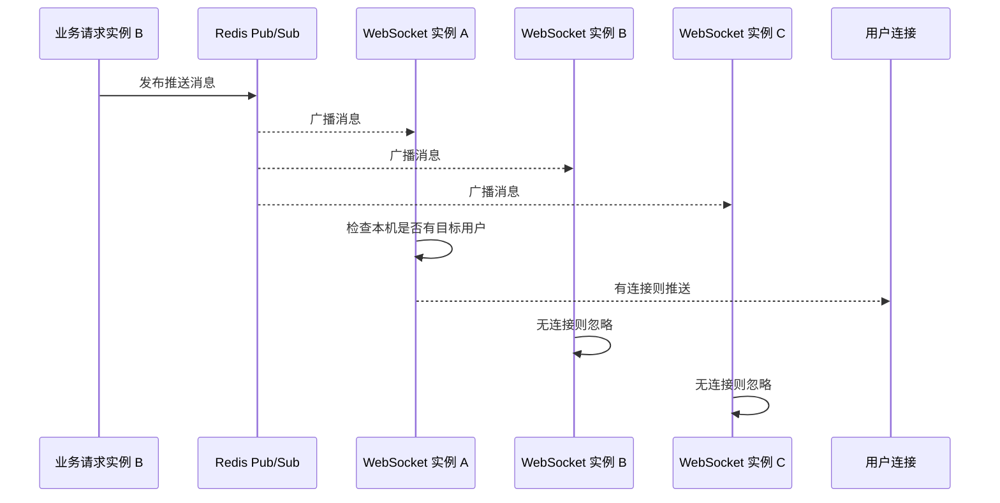

文件位置：`src/main/java/io/github/atengk/websocket/cluster/WebSocketClusterPushMessage.java`

```java
package io.github.atengk.websocket.cluster;

import io.github.atengk.websocket.protocol.WebSocketResponse;
import lombok.Data;

import java.io.Serializable;
import java.util.List;

/**
 * WebSocket 集群推送消息
 *
 * @author Ateng
 * @since 2026-05-05
 */
@Data
public class WebSocketClusterPushMessage implements Serializable {

    private String pushMode;

    private String userId;

    private List<String> userIds;

    private String groupId;

    private String originInstanceId;

    private WebSocketResponse<?> message;

}
```

文件位置：`src/main/java/io/github/atengk/websocket/cluster/RedisWebSocketClusterPublisher.java`

该发布器负责把跨实例推送消息写入 Redis Pub/Sub 频道。

```java
package io.github.atengk.websocket.cluster;

import com.fasterxml.jackson.databind.ObjectMapper;
import io.github.atengk.websocket.config.WebSocketClusterProperties;
import lombok.RequiredArgsConstructor;
import lombok.extern.slf4j.Slf4j;
import org.springframework.data.redis.core.StringRedisTemplate;
import org.springframework.stereotype.Component;

/**
 * Redis WebSocket 集群推送发布器
 *
 * @author Ateng
 * @since 2026-05-05
 */
@Slf4j
@Component
@RequiredArgsConstructor
public class RedisWebSocketClusterPublisher {

    private final ObjectMapper objectMapper;

    private final StringRedisTemplate stringRedisTemplate;

    private final WebSocketClusterProperties clusterProperties;

    public void publish(WebSocketClusterPushMessage message) {
        try {
            message.setOriginInstanceId(clusterProperties.getInstanceId());
            String payload = objectMapper.writeValueAsString(message);
            stringRedisTemplate.convertAndSend(clusterProperties.getRedisPushChannel(), payload);
            log.info("WebSocket 集群推送消息发布成功，pushMode={}，originInstanceId={}",
                    message.getPushMode(), message.getOriginInstanceId());
        } catch (Exception e) {
            log.error("WebSocket 集群推送消息发布失败，pushMode={}", message.getPushMode(), e);
        }
    }

}
```

文件位置：`src/main/java/io/github/atengk/websocket/cluster/RedisWebSocketClusterSubscriber.java`

该订阅器接收 Redis Pub/Sub 消息，并在当前实例本地执行推送。

```java
package io.github.atengk.websocket.cluster;

import com.fasterxml.jackson.databind.ObjectMapper;
import io.github.atengk.websocket.sender.WebSocketSender;
import lombok.RequiredArgsConstructor;
import lombok.extern.slf4j.Slf4j;
import org.springframework.data.redis.connection.Message;
import org.springframework.data.redis.connection.MessageListener;
import org.springframework.stereotype.Component;

/**
 * Redis WebSocket 集群推送订阅器
 *
 * @author Ateng
 * @since 2026-05-05
 */
@Slf4j
@Component
@RequiredArgsConstructor
public class RedisWebSocketClusterSubscriber implements MessageListener {

    private final ObjectMapper objectMapper;

    private final WebSocketSender webSocketSender;

    @Override
    public void onMessage(Message message, byte[] pattern) {
        try {
            String payload = new String(message.getBody());
            WebSocketClusterPushMessage pushMessage = objectMapper.readValue(payload, WebSocketClusterPushMessage.class);
            dispatch(pushMessage);
        } catch (Exception e) {
            log.error("WebSocket 集群推送消息消费失败", e);
        }
    }

    private void dispatch(WebSocketClusterPushMessage pushMessage) {
        switch (pushMessage.getPushMode()) {
            case "USER" -> webSocketSender.sendToUser(pushMessage.getUserId(), pushMessage.getMessage());
            case "USERS" -> webSocketSender.sendToUsers(pushMessage.getUserIds(), pushMessage.getMessage());
            case "GROUP" -> webSocketSender.sendToGroup(pushMessage.getGroupId(), pushMessage.getMessage());
            case "BROADCAST" -> webSocketSender.broadcast(pushMessage.getMessage());
            default -> log.warn("WebSocket 集群推送模式不支持，pushMode={}", pushMessage.getPushMode());
        }
    }

}
```

文件位置：`src/main/java/io/github/atengk/websocket/config/WebSocketRedisPubSubConfig.java`

该配置类注册 Redis 监听容器。

```java
package io.github.atengk.websocket.config;

import io.github.atengk.websocket.cluster.RedisWebSocketClusterSubscriber;
import lombok.RequiredArgsConstructor;
import org.springframework.boot.context.properties.EnableConfigurationProperties;
import org.springframework.context.annotation.Bean;
import org.springframework.context.annotation.Configuration;
import org.springframework.data.redis.listener.PatternTopic;
import org.springframework.data.redis.listener.RedisMessageListenerContainer;
import org.springframework.data.redis.connection.RedisConnectionFactory;

/**
 * WebSocket Redis Pub/Sub 配置
 *
 * @author Ateng
 * @since 2026-05-05
 */
@Configuration
@RequiredArgsConstructor
@EnableConfigurationProperties(WebSocketClusterProperties.class)
public class WebSocketRedisPubSubConfig {

    private final WebSocketClusterProperties clusterProperties;

    private final RedisWebSocketClusterSubscriber subscriber;

    @Bean
    public RedisMessageListenerContainer webSocketRedisMessageListenerContainer(RedisConnectionFactory connectionFactory) {
        RedisMessageListenerContainer container = new RedisMessageListenerContainer();
        container.setConnectionFactory(connectionFactory);
        container.addMessageListener(subscriber, new PatternTopic(clusterProperties.getRedisPushChannel()));
        return container;
    }

}
```

Redis Pub/Sub 方案特点：

| 优点           | 缺点                                 |
| -------------- | ------------------------------------ |
| 实现简单       | 消息不持久化                         |
| 延迟低         | Redis 重启或订阅断开期间消息可能丢失 |
| 适合在线推送   | 不适合可靠消息                       |
| 多实例天然广播 | 所有实例都会收到消息，需要本地判断   |

适用场景：

1. 在线通知。
2. 状态刷新。
3. 任务进度。
4. 监控大屏。
5. 对可靠性要求不高的实时推送。

### MQ 广播推送

MQ 广播推送适合可靠性更高、流量更大、需要削峰和重试的场景。和 Redis Pub/Sub 相比，MQ 可以提供消息持久化、消费确认、失败重试、死信队列等能力。

MQ 推送有两种模式：

| 模式     | 说明                                            |
| -------- | ----------------------------------------------- |
| 竞争消费 | 多个实例中只有一个实例消费消息，适合任务处理    |
| 广播消费 | 每个实例都消费一份消息，适合集群 WebSocket 广播 |

WebSocket 集群广播通常需要“每个实例都收到消息，然后各自推送本机连接”。不同 MQ 对广播消费支持方式不同：

| MQ           | 广播方式                                              |
| ------------ | ----------------------------------------------------- |
| RabbitMQ     | Fanout Exchange，为每个实例创建独立队列               |
| Kafka        | 每个实例使用不同 Consumer Group，或按业务设计广播主题 |
| RocketMQ     | 广播消费模式                                          |
| Redis Stream | 每实例独立消费组或独立消费位置                        |

RabbitMQ Fanout 方案示意：

```text
业务服务
  │
  ▼
websocket.push.exchange(fanout)
  │
  ├── websocket.push.queue.ws-1 -> 实例 ws-1
  ├── websocket.push.queue.ws-2 -> 实例 ws-2
  └── websocket.push.queue.ws-3 -> 实例 ws-3
```

MQ 广播推送建议：

1. 可靠通知优先使用 MQ。
2. 全站广播需要每个实例都消费到消息。
3. 单用户推送可以使用连接路由，只投递到目标实例队列。
4. 消息中必须带业务消息 ID，便于幂等处理。
5. 消费失败要配置重试和死信队列。

### 用户连接路由

用户连接路由用于记录“用户的连接在哪个实例”。有了路由表后，业务服务可以判断目标用户是否在线，也可以将推送消息投递到目标实例，减少全实例广播带来的无效消费。

推荐 Redis Key 设计：

```text
# Session 元信息，设置 TTL
websocket:session:{sessionId}

# 用户拥有的 Session 列表
websocket:user:sessions:{userId}

# 实例拥有的 Session 列表
websocket:instance:sessions:{instanceId}
```

Session 元信息示例：

```json
{
  "sessionId": "A",
  "userId": "10001",
  "tenantId": "default",
  "instanceId": "ws-1",
  "clientIp": "192.168.1.10",
  "connectedAt": 1777948200000,
  "lastHeartbeatAt": 1777948230000
}
```

文件位置：`src/main/java/io/github/atengk/websocket/cluster/WebSocketClusterSessionInfo.java`

```java
package io.github.atengk.websocket.cluster;

import lombok.Builder;
import lombok.Data;

import java.io.Serializable;

/**
 * WebSocket 集群会话信息
 *
 * @author Ateng
 * @since 2026-05-05
 */
@Data
@Builder
public class WebSocketClusterSessionInfo implements Serializable {

    private String sessionId;

    private String userId;

    private String tenantId;

    private String username;

    private String instanceId;

    private String clientIp;

    private Long connectedAt;

    private Long lastHeartbeatAt;

}
```

文件位置：`src/main/java/io/github/atengk/websocket/cluster/WebSocketClusterSessionRegistry.java`

该组件用于在 Redis 中维护集群会话路由。

```java
package io.github.atengk.websocket.cluster;

import cn.hutool.core.collection.CollUtil;
import cn.hutool.core.convert.Convert;
import com.fasterxml.jackson.databind.ObjectMapper;
import io.github.atengk.websocket.config.WebSocketClusterProperties;
import io.github.atengk.websocket.constant.WebSocketAttributeKeys;
import lombok.RequiredArgsConstructor;
import lombok.extern.slf4j.Slf4j;
import org.springframework.data.redis.core.StringRedisTemplate;
import org.springframework.stereotype.Component;
import org.springframework.web.socket.WebSocketSession;

import java.time.Duration;
import java.util.Set;

/**
 * WebSocket 集群会话注册表
 *
 * @author Ateng
 * @since 2026-05-05
 */
@Slf4j
@Component
@RequiredArgsConstructor
public class WebSocketClusterSessionRegistry {

    private final ObjectMapper objectMapper;

    private final StringRedisTemplate stringRedisTemplate;

    private final WebSocketClusterProperties clusterProperties;

    public void register(WebSocketSession session) {
        try {
            String sessionId = session.getId();
            String userId = Convert.toStr(session.getAttributes().get(WebSocketAttributeKeys.USER_ID));

            WebSocketClusterSessionInfo sessionInfo = WebSocketClusterSessionInfo.builder()
                    .sessionId(sessionId)
                    .userId(userId)
                    .tenantId(Convert.toStr(session.getAttributes().get(WebSocketAttributeKeys.TENANT_ID)))
                    .username(Convert.toStr(session.getAttributes().get(WebSocketAttributeKeys.USERNAME)))
                    .instanceId(clusterProperties.getInstanceId())
                    .clientIp(Convert.toStr(session.getAttributes().get(WebSocketAttributeKeys.CLIENT_IP)))
                    .connectedAt(System.currentTimeMillis())
                    .lastHeartbeatAt(System.currentTimeMillis())
                    .build();

            String sessionKey = getSessionKey(sessionId);
            String userSessionsKey = getUserSessionsKey(userId);
            String instanceSessionsKey = getInstanceSessionsKey(clusterProperties.getInstanceId());

            stringRedisTemplate.opsForValue().set(
                    sessionKey,
                    objectMapper.writeValueAsString(sessionInfo),
                    Duration.ofSeconds(clusterProperties.getRouteTtlSeconds())
            );
            stringRedisTemplate.opsForSet().add(userSessionsKey, sessionId);
            stringRedisTemplate.opsForSet().add(instanceSessionsKey, sessionId);

            log.info("WebSocket 集群会话注册成功，userId={}，sessionId={}，instanceId={}",
                    userId, sessionId, clusterProperties.getInstanceId());
        } catch (Exception e) {
            log.error("WebSocket 集群会话注册失败，sessionId={}", session.getId(), e);
        }
    }

    public void unregister(WebSocketSession session) {
        String sessionId = session.getId();
        String userId = Convert.toStr(session.getAttributes().get(WebSocketAttributeKeys.USER_ID));
        String instanceId = clusterProperties.getInstanceId();

        stringRedisTemplate.delete(getSessionKey(sessionId));
        stringRedisTemplate.opsForSet().remove(getUserSessionsKey(userId), sessionId);
        stringRedisTemplate.opsForSet().remove(getInstanceSessionsKey(instanceId), sessionId);

        log.info("WebSocket 集群会话注销成功，userId={}，sessionId={}，instanceId={}",
                userId, sessionId, instanceId);
    }

    public void refresh(WebSocketSession session) {
        String sessionKey = getSessionKey(session.getId());
        stringRedisTemplate.expire(sessionKey, Duration.ofSeconds(clusterProperties.getRouteTtlSeconds()));
    }

    public Set<String> getUserSessionIds(String userId) {
        Set<String> sessionIds = stringRedisTemplate.opsForSet().members(getUserSessionsKey(userId));
        return CollUtil.isEmpty(sessionIds) ? Set.of() : sessionIds;
    }

    private String getSessionKey(String sessionId) {
        return "websocket:session:" + sessionId;
    }

    private String getUserSessionsKey(String userId) {
        return "websocket:user:sessions:" + userId;
    }

    private String getInstanceSessionsKey(String instanceId) {
        return "websocket:instance:sessions:" + instanceId;
    }

}
```

在 Handler 生命周期中接入集群注册表：

```java
// 连接建立
webSocketSessionManager.register(session);
webSocketClusterSessionRegistry.register(session);

// 心跳刷新
webSocketSessionManager.refreshHeartbeat(session);
webSocketClusterSessionRegistry.refresh(session);

// 连接关闭
webSocketSessionManager.remove(session);
webSocketClusterSessionRegistry.unregister(session);
```

用户连接路由建议：

1. Session 元信息必须设置 TTL。
2. 心跳刷新时同步刷新 Redis TTL。
3. 连接关闭时主动删除路由。
4. 实例异常宕机时依赖 TTL 自动清理。
5. Redis Set 中可能残留过期 Session ID，查询时需要二次校验 Session Key 是否存在。

### 集群下在线状态维护

集群下在线状态维护不能只依赖本地 Map。推荐采用“本地 Session + Redis 路由元信息 + TTL”的方式维护全局在线状态。

在线状态判断逻辑：

```text
判断用户是否在线
    │
    ▼
查询 websocket:user:sessions:{userId}
    │
    ▼
逐个检查 websocket:session:{sessionId}
    │
    ├── 存在有效 Session 元信息：在线
    └── 全部不存在：离线
```

集群在线状态维护策略：

| 操作     | 本地处理                 | Redis 处理                    |
| -------- | ------------------------ | ----------------------------- |
| 连接建立 | 注册本地 Session         | 写入 Session 元信息和用户 Set |
| 心跳刷新 | 更新本地 lastHeartbeatAt | 刷新 Session Key TTL          |
| 连接关闭 | 删除本地 Session         | 删除 Session Key 和 Set 成员  |
| 实例下线 | 关闭本机连接             | 清理实例 Session Set          |
| 实例宕机 | 本地数据丢失             | 依赖 TTL 过期                 |
| 查询在线 | 查本地连接               | 查询 Redis 全局状态           |

文件位置：`src/main/java/io/github/atengk/websocket/cluster/WebSocketClusterOnlineService.java`

该服务用于判断集群下用户是否在线，并返回用户的全局在线连接数。

```java
package io.github.atengk.websocket.cluster;

import cn.hutool.core.collection.CollUtil;
import lombok.RequiredArgsConstructor;
import org.springframework.data.redis.core.StringRedisTemplate;
import org.springframework.stereotype.Service;

import java.util.Set;

/**
 * WebSocket 集群在线状态服务
 *
 * @author Ateng
 * @since 2026-05-05
 */
@Service
@RequiredArgsConstructor
public class WebSocketClusterOnlineService {

    private final StringRedisTemplate stringRedisTemplate;

    private final WebSocketClusterSessionRegistry clusterSessionRegistry;

    public boolean isOnline(String userId) {
        return getOnlineSessionCount(userId) > 0;
    }

    public int getOnlineSessionCount(String userId) {
        Set<String> sessionIds = clusterSessionRegistry.getUserSessionIds(userId);
        if (CollUtil.isEmpty(sessionIds)) {
            return 0;
        }

        int count = 0;
        for (String sessionId : sessionIds) {
            Boolean exists = stringRedisTemplate.hasKey("websocket:session:" + sessionId);
            if (Boolean.TRUE.equals(exists)) {
                count++;
            }
        }

        return count;
    }

}
```

集群在线状态注意事项：

1. Redis 中的在线状态是近实时状态，不是强一致状态。
2. 用户刚断网时，状态可能要等 TTL 到期后才变为离线。
3. 如果业务要求强一致在线状态，需要额外设计确认、踢线和状态同步机制。
4. 用户在线不代表用户正在查看某个页面，只代表存在 WebSocket 连接。
5. 用户连接多个实例时，单用户推送需要覆盖所有实例上的连接。

本节完成后，WebSocket 模块具备以下生产化扩展能力：

| 能力                     | 状态           |
| ------------------------ | -------------- |
| 消息处理线程池           | 已完成         |
| 发送线程池               | 已完成         |
| 单 Session 有界发送队列  | 已完成         |
| 异步发送                 | 已完成         |
| 发送耗时监控             | 已给出接入方式 |
| 本地限流                 | 已完成         |
| 背压策略                 | 已完成         |
| 大量连接优化建议         | 已完成         |
| 集群实例配置             | 已完成         |
| Redis Pub/Sub 跨实例推送 | 已完成         |
| MQ 广播推送设计          | 已完成         |
| 用户连接路由             | 已完成         |
| 集群在线状态维护         | 已完成         |


## 消息可靠性设计

消息可靠性设计用于提升重要消息的可追踪、可确认、可补偿能力。原生 WebSocket 本身只提供长连接通信通道，不提供消息持久化、ACK、重试、离线消息、历史消息和幂等处理能力，这些都需要业务层自行设计。

建议按消息重要程度分级处理：

| 消息类型     | 示例                         | 可靠性策略                              |
| ------------ | ---------------------------- | --------------------------------------- |
| 临时状态消息 | 在线人数、页面刷新、监控指标 | 在线即推，离线丢弃                      |
| 过程状态消息 | 导入进度、任务进度           | 只保留最新状态                          |
| 普通通知消息 | 系统通知、审批提醒           | 入库，在线推送，离线可拉取              |
| 强可靠消息   | 聊天消息、交易通知、告警通知 | 入库、ACK、重试、幂等、历史拉取         |
| 用户已读消息 | 通知已读、聊天已读           | 业务接口确认，不依赖 WebSocket 发送结果 |

推荐可靠消息流程如下：

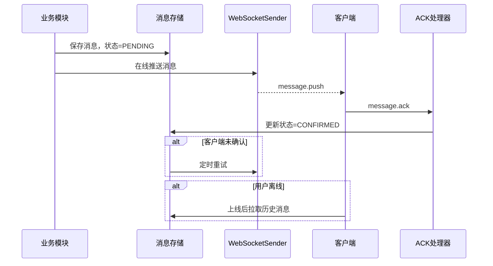

### 消息发送结果处理

消息发送结果处理用于记录一次推送动作的结果。发送结果要区分“入队成功”“写出成功”“用户离线”“发送失败”“客户端确认”几个阶段，不能把服务端发送成功等同于业务可靠送达。

推荐状态模型：

| 状态        | 说明                          |
| ----------- | ----------------------------- |
| `PENDING`   | 消息已创建，等待发送          |
| `SENDING`   | 消息正在发送                  |
| `SENT`      | 服务端已写出到 WebSocket 连接 |
| `CONFIRMED` | 客户端已 ACK                  |
| `OFFLINE`   | 用户离线，等待历史拉取或重推  |
| `FAILED`    | 发送失败                      |
| `EXPIRED`   | 超过有效期，不再发送          |

文件位置：`src/main/java/io/github/atengk/websocket/reliable/WebSocketMessageStatus.java`

该枚举用于统一表示可靠消息的生命周期状态。

```java
package io.github.atengk.websocket.reliable;

import lombok.Getter;

/**
 * WebSocket 可靠消息状态
 *
 * @author Ateng
 * @since 2026-05-05
 */
@Getter
public enum WebSocketMessageStatus {

    /**
     * 等待发送
     */
    PENDING("PENDING", "等待发送"),

    /**
     * 发送中
     */
    SENDING("SENDING", "发送中"),

    /**
     * 已发送
     */
    SENT("SENT", "已发送"),

    /**
     * 客户端已确认
     */
    CONFIRMED("CONFIRMED", "客户端已确认"),

    /**
     * 用户离线
     */
    OFFLINE("OFFLINE", "用户离线"),

    /**
     * 发送失败
     */
    FAILED("FAILED", "发送失败"),

    /**
     * 已过期
     */
    EXPIRED("EXPIRED", "已过期");

    private final String code;

    private final String description;

    WebSocketMessageStatus(String code, String description) {
        this.code = code;
        this.description = description;
    }

}
```

发送结果处理建议：

1. 普通在线推送只需要记录 `WebSocketSendResult`。
2. 重要消息必须先生成 `messageId` 并持久化，再进行在线推送。
3. `SENT` 只表示服务端写出成功，不表示客户端处理成功。
4. `CONFIRMED` 必须由客户端 ACK 触发。
5. 离线消息不应反复实时推送，应等待客户端上线后拉取或由重试任务补偿。

可靠消息发送入口建议如下。

文件位置：`src/main/java/io/github/atengk/websocket/reliable/WebSocketReliablePushService.java`

下面的服务用于发送需要可靠性保障的消息，先保存消息记录，再根据在线状态推送。

```java
package io.github.atengk.websocket.reliable;

import cn.hutool.core.lang.Dict;
import cn.hutool.core.util.IdUtil;
import cn.hutool.core.util.StrUtil;
import io.github.atengk.websocket.protocol.WebSocketResponse;
import io.github.atengk.websocket.sender.WebSocketSendResult;
import io.github.atengk.websocket.sender.WebSocketSender;
import lombok.RequiredArgsConstructor;
import lombok.extern.slf4j.Slf4j;
import org.springframework.stereotype.Service;

/**
 * WebSocket 可靠推送服务
 *
 * @author Ateng
 * @since 2026-05-05
 */
@Slf4j
@Service
@RequiredArgsConstructor
public class WebSocketReliablePushService {

    private final WebSocketSender webSocketSender;

    private final WebSocketReliableMessageRepository reliableMessageRepository;

    /**
     * 推送可靠消息
     *
     * @param receiverUserId 接收用户 ID
     * @param messageType    消息类型
     * @param payload        消息内容
     * @return 消息 ID
     */
    public String pushReliableMessage(String receiverUserId, String messageType, Object payload) {
        if (StrUtil.hasBlank(receiverUserId, messageType)) {
            throw new IllegalArgumentException("接收用户 ID 和消息类型不能为空");
        }

        String messageId = IdUtil.getSnowflakeNextIdStr();
        reliableMessageRepository.savePending(messageId, receiverUserId, messageType, payload);

        WebSocketResponse<Dict> message = WebSocketResponse.push(messageType, Dict.create()
                .set("messageId", messageId)
                .set("payload", payload)
                .set("needAck", true)
                .set("serverTime", System.currentTimeMillis()));

        WebSocketSendResult sendResult = webSocketSender.sendToUser(receiverUserId, message);
        if (Boolean.TRUE.equals(sendResult.getOffline())) {
            reliableMessageRepository.markOffline(messageId);
            log.info("WebSocket 可靠消息用户离线，messageId={}，receiverUserId={}", messageId, receiverUserId);
            return messageId;
        }

        if (Boolean.TRUE.equals(sendResult.getSuccess())) {
            reliableMessageRepository.markSent(messageId);
            log.info("WebSocket 可靠消息发送成功，messageId={}，receiverUserId={}", messageId, receiverUserId);
            return messageId;
        }

        reliableMessageRepository.markFailed(messageId, sendResult.getMessage());
        log.warn("WebSocket 可靠消息发送失败，messageId={}，receiverUserId={}，message={}",
                messageId, receiverUserId, sendResult.getMessage());
        return messageId;
    }

}
```

### 消息确认机制

消息确认机制用于让客户端告诉服务端“我已经收到并处理了这条消息”。确认机制建议只用于重要消息，不建议所有消息都 ACK，否则会显著增加消息量。

客户端 ACK 消息结构：

```json
{
  "seq": "ack-1777948200000",
  "type": "message.ack",
  "timestamp": 1777948200000,
  "data": {
    "messageId": "725287391263744",
    "ackType": "RECEIVED"
  }
}
```

ACK 字段说明：

| 字段        | 说明                                           |
| ----------- | ---------------------------------------------- |
| `messageId` | 服务端推送时生成的业务消息 ID                  |
| `ackType`   | 确认类型，例如 `RECEIVED`、`DISPLAYED`、`READ` |
| `seq`       | ACK 消息自身序列号                             |
| `timestamp` | 客户端确认时间                                 |

文件位置：`src/main/java/io/github/atengk/websocket/processor/MessageAckProcessor.java`

该处理器负责处理客户端 ACK，并把消息状态更新为已确认。

```java
package io.github.atengk.websocket.processor;

import com.fasterxml.jackson.databind.ObjectMapper;
import io.github.atengk.websocket.context.WebSocketContext;
import io.github.atengk.websocket.exception.WebSocketBizException;
import io.github.atengk.websocket.protocol.WebSocketErrorCode;
import io.github.atengk.websocket.protocol.WebSocketRequest;
import io.github.atengk.websocket.protocol.WebSocketResponse;
import io.github.atengk.websocket.reliable.WebSocketReliableMessageRepository;
import io.github.atengk.websocket.support.WebSocketMessageValidator;
import jakarta.validation.constraints.NotBlank;
import lombok.Data;
import lombok.RequiredArgsConstructor;
import lombok.extern.slf4j.Slf4j;
import org.springframework.stereotype.Component;

import java.util.Map;

/**
 * WebSocket 消息确认处理器
 *
 * @author Ateng
 * @since 2026-05-05
 */
@Slf4j
@Component
@RequiredArgsConstructor
public class MessageAckProcessor implements WebSocketMessageProcessor {

    private static final String TYPE_MESSAGE_ACK = "message.ack";

    private static final String TYPE_MESSAGE_ACK_ACK = "message.ack.ack";

    private final ObjectMapper objectMapper;

    private final WebSocketMessageValidator webSocketMessageValidator;

    private final WebSocketReliableMessageRepository reliableMessageRepository;

    @Override
    public boolean support(String type) {
        return TYPE_MESSAGE_ACK.equals(type);
    }

    @Override
    public WebSocketResponse<?> handle(WebSocketContext context, WebSocketRequest request) {
        MessageAckRequest data = objectMapper.convertValue(request.getData(), MessageAckRequest.class);
        webSocketMessageValidator.validate(data);

        boolean updated = reliableMessageRepository.confirm(data.getMessageId(), context.userId());
        if (!updated) {
            throw new WebSocketBizException(WebSocketErrorCode.INVALID_PARAM.getCode(), "消息不存在或不属于当前用户");
        }

        log.info("WebSocket 消息确认成功，userId={}，messageId={}，ackType={}",
                context.userId(), data.getMessageId(), data.getAckType());

        return WebSocketResponse.ok(request.getSeq(), TYPE_MESSAGE_ACK_ACK, Map.of(
                "messageId", data.getMessageId(),
                "ackType", data.getAckType(),
                "serverTime", System.currentTimeMillis()
        ));
    }

    /**
     * 消息确认请求
     *
     * @author Ateng
     * @since 2026-05-05
     */
    @Data
    public static class MessageAckRequest {

        /**
         * 消息 ID
         */
        @NotBlank(message = "消息 ID 不能为空")
        private String messageId;

        /**
         * 确认类型
         */
        @NotBlank(message = "确认类型不能为空")
        private String ackType;

    }

}
```

客户端收到可靠消息后发送 ACK：

```javascript
function handleMessage(message) {
  if (message.data && message.data.needAck && message.data.messageId) {
    socket.send(JSON.stringify({
      seq: `ack-${Date.now()}`,
      type: 'message.ack',
      timestamp: Date.now(),
      data: {
        messageId: message.data.messageId,
        ackType: 'RECEIVED'
      }
    }))
  }

  console.log('收到 WebSocket 消息', message)
}
```

确认机制建议：

1. 只对重要消息开启 ACK。
2. ACK 应使用业务消息 ID，不使用 WebSocket Session ID。
3. ACK 接口必须校验消息接收人是否为当前用户。
4. ACK 处理必须幂等，重复 ACK 不能报错。
5. `RECEIVED`、`DISPLAYED`、`READ` 应按业务区分，不要混用。

### 消息重试机制

消息重试机制用于处理在线推送失败、客户端未 ACK 或短暂网络异常的情况。重试不能无限执行，需要设置最大重试次数、重试间隔和消息过期时间。

推荐重试策略：

| 参数         | 建议值      | 说明                       |
| ------------ | ----------- | -------------------------- |
| 最大重试次数 | 3 到 5 次   | 避免无限重试               |
| 首次重试间隔 | 10 到 30 秒 | 等待短暂网络恢复           |
| 后续重试     | 指数退避    | 例如 30 秒、1 分钟、3 分钟 |
| 消息过期时间 | 按业务决定  | 超过后标记 `EXPIRED`       |
| 离线消息     | 不高频重试  | 等用户上线后拉取           |

文件位置：`src/main/java/io/github/atengk/websocket/reliable/WebSocketReliableRetryTask.java`

下面的任务扫描需要重试的消息，并重新通过可靠推送流程发送。实际项目中应基于数据库分页查询，避免一次加载过多记录。

```java
package io.github.atengk.websocket.reliable;

import cn.hutool.core.collection.CollUtil;
import io.github.atengk.websocket.protocol.WebSocketResponse;
import io.github.atengk.websocket.sender.WebSocketSendResult;
import io.github.atengk.websocket.sender.WebSocketSender;
import lombok.RequiredArgsConstructor;
import lombok.extern.slf4j.Slf4j;
import org.springframework.scheduling.annotation.Scheduled;
import org.springframework.stereotype.Component;

import java.util.List;

/**
 * WebSocket 可靠消息重试任务
 *
 * @author Ateng
 * @since 2026-05-05
 */
@Slf4j
@Component
@RequiredArgsConstructor
public class WebSocketReliableRetryTask {

    private final WebSocketSender webSocketSender;

    private final WebSocketReliableMessageRepository reliableMessageRepository;

    /**
     * 定时重试未确认消息
     */
    @Scheduled(fixedDelayString = "${websocket.reliable.retry-delay-millis:30000}")
    public void retryUnconfirmedMessages() {
        List<WebSocketReliableMessage> messages = reliableMessageRepository.listRetryMessages(100);
        if (CollUtil.isEmpty(messages)) {
            return;
        }

        int successCount = 0;
        int failCount = 0;

        for (WebSocketReliableMessage item : messages) {
            WebSocketResponse<Object> response = WebSocketResponse.push(item.getMessageType(), item.getPayload());
            WebSocketSendResult result = webSocketSender.sendToUser(item.getReceiverUserId(), response);

            if (Boolean.TRUE.equals(result.getSuccess())) {
                reliableMessageRepository.markSent(item.getMessageId());
                successCount++;
            } else {
                reliableMessageRepository.increaseRetry(item.getMessageId(), result.getMessage());
                failCount++;
            }
        }

        log.info("WebSocket 可靠消息重试完成，total={}，successCount={}，failCount={}",
                messages.size(), successCount, failCount);
    }

}
```

配置文件补充：

```yaml
websocket:
  reliable:
    # 可靠消息重试间隔，单位：毫秒
    retry-delay-millis: 30000

    # 最大重试次数
    max-retry-count: 5

    # 消息确认超时时间，单位：秒
    ack-timeout-seconds: 60
```

重试机制建议：

1. 只重试重要消息，不重试高频状态消息。
2. 重试前检查消息是否已 ACK。
3. 已离线用户不应高频重试，应等待用户上线拉取。
4. 重试任务需要分页处理，避免一次扫描大量数据。
5. 集群环境下重试任务应加分布式锁，避免多个实例重复重试。

### 离线消息存储

离线消息存储用于保证用户不在线时仍然可以在上线后获取重要消息。离线消息建议存储业务消息本身，而不是存储 WebSocket 推送 JSON 的最终字符串，这样后续可以根据客户端版本重新组装消息结构。

推荐表结构如下。

文件位置：`docs/sql/websocket_message.sql`

```sql
CREATE TABLE websocket_message (
    id BIGINT PRIMARY KEY AUTO_INCREMENT COMMENT '主键 ID',
    message_id VARCHAR(64) NOT NULL COMMENT '消息 ID',
    receiver_user_id VARCHAR(64) NOT NULL COMMENT '接收用户 ID',
    message_type VARCHAR(128) NOT NULL COMMENT '消息类型',
    payload JSON NOT NULL COMMENT '消息业务内容',
    status VARCHAR(32) NOT NULL COMMENT '消息状态',
    retry_count INT NOT NULL DEFAULT 0 COMMENT '重试次数',
    last_error VARCHAR(512) NULL COMMENT '最后一次错误信息',
    confirmed_at DATETIME NULL COMMENT '确认时间',
    expire_at DATETIME NULL COMMENT '过期时间',
    created_at DATETIME NOT NULL DEFAULT CURRENT_TIMESTAMP COMMENT '创建时间',
    updated_at DATETIME NOT NULL DEFAULT CURRENT_TIMESTAMP ON UPDATE CURRENT_TIMESTAMP COMMENT '更新时间',
    UNIQUE KEY uk_message_id (message_id),
    KEY idx_receiver_status (receiver_user_id, status),
    KEY idx_retry_status (status, retry_count, updated_at)
) COMMENT='WebSocket 可靠消息表';
```

文件位置：`src/main/java/io/github/atengk/websocket/reliable/WebSocketReliableMessage.java`

该对象表示可靠消息记录。若项目使用 MyBatis-Plus，可在此基础上增加 `@TableName`、`@TableId` 等注解。

```java
package io.github.atengk.websocket.reliable;

import lombok.Builder;
import lombok.Data;

/**
 * WebSocket 可靠消息
 *
 * @author Ateng
 * @since 2026-05-05
 */
@Data
@Builder
public class WebSocketReliableMessage {

    /**
     * 消息 ID
     */
    private String messageId;

    /**
     * 接收用户 ID
     */
    private String receiverUserId;

    /**
     * 消息类型
     */
    private String messageType;

    /**
     * 消息内容
     */
    private Object payload;

    /**
     * 消息状态
     */
    private String status;

    /**
     * 重试次数
     */
    private Integer retryCount;

    /**
     * 最后错误信息
     */
    private String lastError;

    /**
     * 确认时间
     */
    private Long confirmedAt;

    /**
     * 过期时间
     */
    private Long expireAt;

}
```

文件位置：`src/main/java/io/github/atengk/websocket/reliable/WebSocketReliableMessageRepository.java`

该接口屏蔽具体持久化实现，可以用 MyBatis-Plus、JPA、JdbcTemplate 或消息中心实现。

```java
package io.github.atengk.websocket.reliable;

import java.util.List;

/**
 * WebSocket 可靠消息仓储
 *
 * @author Ateng
 * @since 2026-05-05
 */
public interface WebSocketReliableMessageRepository {

    /**
     * 保存等待发送消息
     *
     * @param messageId      消息 ID
     * @param receiverUserId 接收用户 ID
     * @param messageType    消息类型
     * @param payload        消息内容
     */
    void savePending(String messageId, String receiverUserId, String messageType, Object payload);

    /**
     * 标记消息已发送
     *
     * @param messageId 消息 ID
     */
    void markSent(String messageId);

    /**
     * 标记用户离线
     *
     * @param messageId 消息 ID
     */
    void markOffline(String messageId);

    /**
     * 标记消息发送失败
     *
     * @param messageId 消息 ID
     * @param reason    失败原因
     */
    void markFailed(String messageId, String reason);

    /**
     * 确认消息
     *
     * @param messageId 消息 ID
     * @param userId    用户 ID
     * @return 是否确认成功
     */
    boolean confirm(String messageId, String userId);

    /**
     * 增加重试次数
     *
     * @param messageId 消息 ID
     * @param reason    失败原因
     */
    void increaseRetry(String messageId, String reason);

    /**
     * 查询需要重试的消息
     *
     * @param limit 查询数量
     * @return 消息列表
     */
    List<WebSocketReliableMessage> listRetryMessages(int limit);

    /**
     * 查询用户历史消息
     *
     * @param userId 用户 ID
     * @param cursor 游标
     * @param size   查询数量
     * @return 消息列表
     */
    List<WebSocketReliableMessage> listHistoryMessages(String userId, String cursor, int size);

}
```

离线存储建议：

1. 重要消息先入库，再推送。
2. 离线消息不要只存在 Redis，除非允许丢失。
3. 消息表要按用户和状态建立索引。
4. 历史消息需要过期清理，避免无限增长。
5. 聊天类、通知类、告警类消息建议使用独立业务表，不要全部塞进一张通用表。

### 历史消息拉取

历史消息拉取用于客户端重连、换设备登录或离线后恢复消息。历史消息拉取可以通过 HTTP 接口实现，也可以通过 WebSocket 消息类型实现。通常更推荐 HTTP 拉取，因为分页、鉴权、缓存和错误处理更成熟。

HTTP 拉取接口示例：

| 接口                                              | 说明         |
| ------------------------------------------------- | ------------ |
| `GET /websocket/messages/history?cursor=&size=20` | 拉取历史消息 |
| `POST /websocket/messages/{messageId}/read`       | 标记已读     |
| `POST /websocket/messages/batch-read`             | 批量标记已读 |

文件位置：`src/main/java/io/github/atengk/websocket/reliable/WebSocketMessageHistoryController.java`

下面的接口用于拉取当前用户的历史消息。示例中通过请求头传入用户 ID，生产环境应从登录态中获取。

```java
package io.github.atengk.websocket.reliable;

import cn.hutool.core.util.StrUtil;
import lombok.RequiredArgsConstructor;
import org.springframework.web.bind.annotation.*;

import java.util.List;

/**
 * WebSocket 历史消息接口
 *
 * @author Ateng
 * @since 2026-05-05
 */
@RestController
@RequiredArgsConstructor
@RequestMapping("/websocket/messages")
public class WebSocketMessageHistoryController {

    private final WebSocketReliableMessageRepository reliableMessageRepository;

    /**
     * 拉取历史消息
     *
     * @param userId 用户 ID
     * @param cursor 游标
     * @param size   查询数量
     * @return 历史消息
     */
    @GetMapping("/history")
    public List<WebSocketReliableMessage> history(@RequestHeader("X-User-Id") String userId,
                                                  @RequestParam(required = false) String cursor,
                                                  @RequestParam(defaultValue = "20") Integer size) {
        int querySize = Math.min(size == null ? 20 : size, 100);
        return reliableMessageRepository.listHistoryMessages(userId, StrUtil.blankToDefault(cursor, ""), querySize);
    }

    /**
     * 确认消息已收到
     *
     * @param userId    用户 ID
     * @param messageId 消息 ID
     * @return 是否成功
     */
    @PostMapping("/{messageId}/confirm")
    public boolean confirm(@RequestHeader("X-User-Id") String userId, @PathVariable String messageId) {
        return reliableMessageRepository.confirm(messageId, userId);
    }

}
```

客户端重连成功后拉取历史消息：

```javascript
async function pullHistoryMessages(cursor = '') {
  const response = await fetch(`/api/websocket/messages/history?cursor=${encodeURIComponent(cursor)}&size=20`, {
    headers: {
      'X-User-Id': '10001'
    }
  })

  const messages = await response.json()
  messages.forEach(item => {
    console.log('历史消息', item)
  })
}
```

历史消息拉取建议：

1. 使用游标分页，不建议使用深分页。
2. 拉取后由客户端逐条 ACK 或批量 ACK。
3. 客户端应根据 `messageId` 去重。
4. 服务端应限制单次拉取数量。
5. 历史消息接口必须校验用户身份，不能让用户查询他人消息。

### 消息幂等处理

消息幂等处理用于防止同一条消息被重复保存、重复推送、重复确认或重复展示。可靠消息中，重试、重连、MQ 重复消费都可能导致重复。

推荐幂等点：

| 场景       | 幂等依据                          |
| ---------- | --------------------------------- |
| 消息保存   | `messageId` 唯一索引              |
| 用户接收   | `messageId + receiverUserId` 唯一 |
| 客户端展示 | `messageId` 去重                  |
| ACK 确认   | 已确认则直接返回成功              |
| MQ 消费    | 业务消息 ID 去重                  |
| 重试发送   | 状态已 `CONFIRMED` 则跳过         |

服务端幂等建议：

```text
收到 ACK
  │
  ├── 消息不存在：返回失败
  ├── 消息不属于当前用户：返回失败
  ├── 消息已 CONFIRMED：返回成功
  └── 消息未确认：更新为 CONFIRMED
```

客户端幂等示例：

```javascript
const receivedMessageIds = new Set()

function handleReliableMessage(message) {
  const messageId = message?.data?.messageId
  if (messageId && receivedMessageIds.has(messageId)) {
    console.warn('重复消息已忽略', messageId)
    return
  }

  if (messageId) {
    receivedMessageIds.add(messageId)
  }

  console.log('处理可靠消息', message)
}
```

幂等处理建议：

1. `messageId` 必须全局唯一。
2. 服务端消息表必须对 `messageId` 建唯一索引。
3. ACK 更新必须允许重复调用。
4. MQ 消费必须考虑重复投递。
5. 前端展示层也要基于 `messageId` 去重，不能完全依赖服务端。

## 安全控制

安全控制用于防止未授权连接、恶意来源、Token 滥用、越权消息、刷消息、恶意连接和敏感数据泄露。WebSocket 是长连接，一旦建立成功会持续占用服务端资源，因此安全控制应覆盖握手阶段、连接生命周期、消息处理阶段和日志输出阶段。

推荐安全控制分层如下：

| 层级   | 控制内容                                       |
| ------ | ---------------------------------------------- |
| 网关层 | HTTPS/WSS、IP 黑名单、连接数限制、请求速率限制 |
| 握手层 | Origin 校验、Token 校验、连接权限校验          |
| 会话层 | 单用户连接数、心跳检测、异常连接清理           |
| 消息层 | 消息类型权限、参数校验、消息频率限制           |
| 数据层 | 敏感字段脱敏、最小化返回、审计日志             |
| 运维层 | 连接异常监控、推送失败监控、告警               |

### 连接来源校验

连接来源校验用于限制浏览器页面从哪些域名发起 WebSocket 连接。Spring WebSocket 可以通过 `setAllowedOrigins(...)` 配置允许来源；同时也建议在握手拦截器中做更明确的日志记录和来源校验。

配置示例：

```yaml
websocket:
  allowed-origins:
    - "https://www.example.com"
    - "https://admin.example.com"
```

来源校验建议：

| 环境           | 策略                              |
| -------------- | --------------------------------- |
| 本地开发       | 允许 `localhost`、`127.0.0.1`     |
| 测试环境       | 允许测试前端域名                  |
| 生产环境       | 只允许正式域名                    |
| 管理后台       | 独立后台域名白名单                |
| 非浏览器客户端 | 不能只依赖 Origin，必须校验 Token |

在握手拦截器中补充来源校验：

```java
private boolean checkOrigin(ServerHttpRequest request) {
    String origin = request.getHeaders().getOrigin();
    if (StrUtil.isBlank(origin)) {
        // 非浏览器客户端可能没有 Origin，是否允许由业务决定。
        return true;
    }

    return webSocketProperties.getAllowedOrigins().contains(origin);
}
```

握手阶段调用：

```java
if (!checkOrigin(request)) {
    response.setStatusCode(HttpStatus.FORBIDDEN);
    log.warn("WebSocket 握手失败，非法来源，origin={}，uri={}",
            request.getHeaders().getOrigin(), request.getURI());
    return false;
}
```

连接来源校验注意事项：

1. Origin 可以被非浏览器客户端伪造，不能替代 Token 鉴权。
2. 生产环境不建议使用 `*`。
3. Nginx 或网关不能错误覆盖 Origin。
4. 允许来源应纳入配置中心或发布配置。
5. 来源校验失败时只记录摘要，不返回过多安全细节。

### Token 过期处理

Token 过期处理应覆盖两个阶段：握手阶段和连接存活阶段。握手阶段校验 Token 是否有效；连接存活期间，如果 Token 过期或用户被禁用，服务端应通知客户端认证失效并关闭连接。

处理策略：

| 阶段                    | 处理方式                      |
| ----------------------- | ----------------------------- |
| 握手阶段 Token 过期     | 拒绝连接，返回 `401`          |
| 消息处理阶段 Token 过期 | 返回 `UNAUTHORIZED`，关闭连接 |
| 心跳阶段发现过期        | 返回认证失效消息，关闭连接    |
| 用户被禁用              | 主动关闭连接                  |
| 用户退出登录            | 清理登录态并关闭连接          |

文件位置：`src/main/java/io/github/atengk/websocket/security/WebSocketTokenGuard.java`

该组件用于在消息阶段检查当前连接是否仍然有效。示例中只保留接口结构，真实项目应接入 Sa-Token、JWT、Spring Security 或认证中心。

```java
package io.github.atengk.websocket.security;

import cn.hutool.core.util.StrUtil;
import io.github.atengk.websocket.constant.WebSocketAttributeKeys;
import lombok.extern.slf4j.Slf4j;
import org.springframework.stereotype.Component;
import org.springframework.web.socket.WebSocketSession;

/**
 * WebSocket Token 安全检查器
 *
 * @author Ateng
 * @since 2026-05-05
 */
@Slf4j
@Component
public class WebSocketTokenGuard {

    /**
     * 判断当前连接 Token 是否仍然有效
     *
     * @param session WebSocket 会话
     * @return 是否有效
     */
    public boolean isTokenValid(WebSocketSession session) {
        Object tokenObj = session.getAttributes().get(WebSocketAttributeKeys.TOKEN);
        String token = tokenObj == null ? "" : String.valueOf(tokenObj);

        if (StrUtil.isBlank(token)) {
            return false;
        }

        // 示例逻辑：生产环境应替换为真实 Token 校验。
        return StrUtil.startWithIgnoreCase(token, "dev-");
    }

}
```

在 Handler 或 Router 前置检查中使用：

```java
if (!webSocketTokenGuard.isTokenValid(session)) {
    webSocketSender.sendToSession(session.getId(),
            WebSocketResponse.error(null, WebSocketErrorCode.UNAUTHORIZED));
    session.close(CloseStatus.POLICY_VIOLATION.withReason("token expired"));
    return;
}
```

Token 过期处理建议：

1. 长连接不能只在握手时校验一次 Token。
2. 如果 Token 有较短有效期，客户端应具备刷新 Token 后重连能力。
3. 服务端发现 Token 失效后应发送错误消息并关闭连接。
4. 用户退出登录、被禁用、密码重置后，应主动关闭其 WebSocket 连接。
5. 日志中不要打印完整 Token。

### 消息权限校验

消息权限校验用于控制当前用户是否允许发送某类消息或订阅某类数据。例如普通用户不允许发送后台管理消息，用户只能订阅自己的任务进度，项目成员才能加入项目分组。

权限校验维度：

| 维度         | 示例                             |
| ------------ | -------------------------------- |
| 消息类型权限 | 是否允许发送 `admin.notice.push` |
| 数据范围权限 | 是否允许订阅 `projectId=10001`   |
| 用户角色权限 | 管理员、普通用户、访客           |
| 租户隔离     | 用户只能访问本租户数据           |
| 连接来源权限 | 后台消息只能来自后台域名         |
| 设备权限     | 某些消息只允许 App 端发送        |

文件位置：`src/main/java/io/github/atengk/websocket/security/WebSocketPermissionService.java`

该服务用于统一判断消息权限。实际项目中应接入权限系统、角色系统或数据权限组件。

```java
package io.github.atengk.websocket.security;

import io.github.atengk.websocket.context.WebSocketContext;
import io.github.atengk.websocket.protocol.WebSocketRequest;

/**
 * WebSocket 消息权限服务
 *
 * @author Ateng
 * @since 2026-05-05
 */
public interface WebSocketPermissionService {

    /**
     * 判断是否允许处理当前消息
     *
     * @param context 当前连接上下文
     * @param request 请求消息
     * @return 是否允许
     */
    boolean hasPermission(WebSocketContext context, WebSocketRequest request);

}
```

文件位置：`src/main/java/io/github/atengk/websocket/security/DefaultWebSocketPermissionService.java`

下面的默认实现演示基础权限控制：禁止普通连接发送 `admin.` 开头的消息。

```java
package io.github.atengk.websocket.security;

import cn.hutool.core.util.StrUtil;
import io.github.atengk.websocket.context.WebSocketContext;
import io.github.atengk.websocket.protocol.WebSocketRequest;
import lombok.extern.slf4j.Slf4j;
import org.springframework.stereotype.Service;

/**
 * 默认 WebSocket 消息权限服务
 *
 * @author Ateng
 * @since 2026-05-05
 */
@Slf4j
@Service
public class DefaultWebSocketPermissionService implements WebSocketPermissionService {

    @Override
    public boolean hasPermission(WebSocketContext context, WebSocketRequest request) {
        if (request == null || StrUtil.isBlank(request.getType())) {
            return false;
        }

        if (StrUtil.startWith(request.getType(), "admin.")) {
            log.warn("WebSocket 管理消息权限拒绝，userId={}，type={}", context.userId(), request.getType());
            return false;
        }

        return true;
    }

}
```

在 Router 中增加权限校验：

```java
if (!webSocketPermissionService.hasPermission(context, request)) {
    return WebSocketResponse.error(request.getSeq(), WebSocketErrorCode.FORBIDDEN);
}
```

消息权限校验建议：

1. Handler 不做具体业务权限，只做通用前置校验。
2. 数据范围权限应放到具体处理器或业务服务中校验。
3. 订阅类消息必须校验用户是否有权订阅目标资源。
4. 服务端推送前也要校验目标用户是否有权接收该消息。
5. 权限失败返回 `FORBIDDEN`，不要返回内部权限规则细节。

### 消息频率限制

消息频率限制用于防止客户端短时间内发送大量消息，导致服务端线程池、路由器、业务服务或数据库被打满。限流可以在本地内存、Redis、网关或业务处理器中实现。

推荐限流策略：

| 限流对象     | 示例                      |
| ------------ | ------------------------- |
| 单连接限流   | 每个 Session 每秒 10 条   |
| 单用户限流   | 每个用户每秒 20 条        |
| 单 IP 限流   | 每个 IP 每分钟 100 次握手 |
| 消息类型限流 | `chat.send` 每秒 5 条     |
| 业务资源限流 | 同一任务订阅每秒 1 次     |

本地限流可以沿用前面章节的 `WebSocketRateLimiter`，在消息处理入口处使用：

```java
String userLimitKey = "ws:user:" + context.userId();
if (!webSocketRateLimiter.tryAcquire(userLimitKey, asyncProperties.getUserRateLimitPerSecond())) {
    log.warn("WebSocket 用户消息频率过高，userId={}，sessionId={}",
            context.userId(), context.session().getId());
    return WebSocketResponse.error(request.getSeq(), WebSocketErrorCode.RATE_LIMITED);
}
```

集群环境建议使用 Redis 限流，例如：

```text
限流 Key：websocket:rate:user:{userId}
时间窗口：1 秒
最大次数：20
```

消息频率限制建议：

1. 心跳消息和业务消息可以使用不同限流规则。
2. 登录用户和匿名连接应使用不同限制。
3. 超过限制时先返回 `RATE_LIMITED`，严重时关闭连接。
4. 集群环境不要只依赖本地限流。
5. 高频业务消息应考虑合并、采样或只保留最新状态。

### 恶意连接拦截

恶意连接拦截用于处理频繁握手失败、伪造 Token、异常高频连接、来源不合法、消息格式恶意构造等情况。WebSocket 是长连接，恶意连接会持续占用资源，因此应尽早在网关或握手阶段拦截。

常见恶意行为：

| 行为           | 处理方式               |
| -------------- | ---------------------- |
| 高频握手       | IP 限流、网关限流      |
| Token 暴力尝试 | 失败计数、短时封禁     |
| 非法 Origin    | 直接拒绝               |
| 超大消息       | 消息大小限制，关闭连接 |
| 高频非法 JSON  | 计数后关闭连接         |
| 大量未知类型   | 限流或关闭连接         |
| 慢连接         | 队列满或发送超时后关闭 |

文件位置：`src/main/java/io/github/atengk/websocket/security/WebSocketSecurityGuard.java`

下面的安全守卫提供简单的本地失败计数和拦截逻辑。生产环境建议迁移到 Redis 或网关层实现。

```java
package io.github.atengk.websocket.security;

import cn.hutool.core.util.StrUtil;
import lombok.extern.slf4j.Slf4j;
import org.springframework.stereotype.Component;

import java.util.concurrent.ConcurrentHashMap;
import java.util.concurrent.ConcurrentMap;
import java.util.concurrent.atomic.AtomicInteger;

/**
 * WebSocket 安全守卫
 *
 * @author Ateng
 * @since 2026-05-05
 */
@Slf4j
@Component
public class WebSocketSecurityGuard {

    private static final int MAX_FAIL_COUNT = 10;

    private final ConcurrentMap<String, AtomicInteger> failCounterMap = new ConcurrentHashMap<>();

    /**
     * 判断是否被拦截
     *
     * @param clientIp 客户端 IP
     * @return 是否拦截
     */
    public boolean isBlocked(String clientIp) {
        if (StrUtil.isBlank(clientIp)) {
            return false;
        }

        AtomicInteger counter = failCounterMap.get(clientIp);
        return counter != null && counter.get() >= MAX_FAIL_COUNT;
    }

    /**
     * 记录失败
     *
     * @param clientIp 客户端 IP
     * @param reason   失败原因
     */
    public void recordFail(String clientIp, String reason) {
        if (StrUtil.isBlank(clientIp)) {
            return;
        }

        int count = failCounterMap.computeIfAbsent(clientIp, key -> new AtomicInteger()).incrementAndGet();
        log.warn("WebSocket 安全失败计数增加，clientIp={}，count={}，reason={}", clientIp, count, reason);
    }

    /**
     * 清理失败计数
     *
     * @param clientIp 客户端 IP
     */
    public void clearFail(String clientIp) {
        if (StrUtil.isBlank(clientIp)) {
            return;
        }

        failCounterMap.remove(clientIp);
    }

}
```

握手阶段使用方式：

```java
String clientIp = getClientIp(request);
if (webSocketSecurityGuard.isBlocked(clientIp)) {
    response.setStatusCode(HttpStatus.FORBIDDEN);
    log.warn("WebSocket 握手被安全策略拦截，clientIp={}", clientIp);
    return false;
}
```

恶意连接拦截建议：

1. 网关层优先处理 IP 限流和连接数限制。
2. 应用层处理 Token 失败、消息异常和用户级限流。
3. 对频繁失败的 IP 设置短期封禁。
4. 单个用户连接数必须设置上限。
5. 消息大小限制必须启用，避免大包攻击。
6. 安全拦截日志要可检索，但不要记录敏感明文。

### 敏感数据脱敏

敏感数据脱敏用于防止 Token、手机号、身份证号、邮箱、地址、业务密钥等敏感信息进入日志、监控、异常响应或前端不该看到的消息体。WebSocket 消息通常是长连接实时传输，日志量大，如果直接打印完整消息体，容易造成敏感数据泄露。

需要脱敏的位置：

| 位置         | 处理方式                            |
| ------------ | ----------------------------------- |
| 握手日志     | Token 只打印前后几位或完全不打印    |
| 消息收发日志 | 生产环境只打印长度、类型、messageId |
| 推送日志     | 只打印摘要，不打印完整 payload      |
| 错误响应     | 不返回异常栈和 SQL 错误             |
| 历史消息接口 | 按用户权限过滤字段                  |
| 监控指标     | 不打业务敏感内容                    |

文件位置：`src/main/java/io/github/atengk/websocket/security/WebSocketDataMasker.java`

下面的脱敏工具基于 Hutool `DesensitizedUtil` 处理常见敏感字段。

```java
package io.github.atengk.websocket.security;

import cn.hutool.core.util.DesensitizedUtil;
import cn.hutool.core.util.StrUtil;
import org.springframework.stereotype.Component;

/**
 * WebSocket 数据脱敏工具
 *
 * @author Ateng
 * @since 2026-05-05
 */
@Component
public class WebSocketDataMasker {

    /**
     * Token 脱敏
     *
     * @param token Token
     * @return 脱敏结果
     */
    public String maskToken(String token) {
        if (StrUtil.isBlank(token)) {
            return "";
        }

        if (token.length() <= 8) {
            return "****";
        }

        return StrUtil.subPre(token, 4) + "****" + StrUtil.subSuf(token, token.length() - 4);
    }

    /**
     * 手机号脱敏
     *
     * @param mobile 手机号
     * @return 脱敏结果
     */
    public String maskMobile(String mobile) {
        if (StrUtil.isBlank(mobile)) {
            return "";
        }

        return DesensitizedUtil.mobilePhone(mobile);
    }

    /**
     * 邮箱脱敏
     *
     * @param email 邮箱
     * @return 脱敏结果
     */
    public String maskEmail(String email) {
        if (StrUtil.isBlank(email)) {
            return "";
        }

        return DesensitizedUtil.email(email);
    }

    /**
     * 身份证号脱敏
     *
     * @param idCard 身份证号
     * @return 脱敏结果
     */
    public String maskIdCard(String idCard) {
        if (StrUtil.isBlank(idCard)) {
            return "";
        }

        return DesensitizedUtil.idCardNum(idCard, 4, 4);
    }

}
```

日志使用示例：

```java
log.info("WebSocket 握手鉴权成功，userId={}，token={}，clientIp={}",
        authUser.userId(), webSocketDataMasker.maskToken(token), clientIp);
```

生产环境消息日志建议：

```java
if (Boolean.TRUE.equals(webSocketProperties.getMessageDetailLogEnabled())) {
    log.info("WebSocket 接收消息，userId={}，sessionId={}，type={}，payload={}",
            userId, session.getId(), request.getType(), payload);
} else {
    log.info("WebSocket 接收消息，userId={}，sessionId={}，type={}，payloadLength={}",
            userId, session.getId(), request.getType(), StrUtil.length(payload));
}
```

敏感数据脱敏建议：

1. 生产环境默认关闭完整消息日志。
2. Token 不应进入普通业务日志。
3. WebSocket 错误响应不能返回异常栈。
4. 推送给前端的数据必须按当前用户权限过滤。
5. 历史消息拉取接口必须防止越权查询。
6. 日志脱敏应作为基础工具使用，不依赖开发人员临时手动处理。

本节完成后，WebSocket 模块具备以下可靠性和安全能力：

| 能力             | 状态   |
| ---------------- | ------ |
| 消息发送状态模型 | 已完成 |
| 客户端 ACK 确认  | 已完成 |
| 可靠消息重试任务 | 已完成 |
| 离线消息存储结构 | 已完成 |
| 历史消息拉取接口 | 已完成 |
| 消息幂等设计     | 已完成 |
| 连接来源校验     | 已完成 |
| Token 过期处理   | 已完成 |
| 消息权限校验     | 已完成 |
| 消息频率限制     | 已完成 |
| 恶意连接拦截     | 已完成 |
| 敏感数据脱敏     | 已完成 |


## 配置化设计

配置化设计用于将 WebSocket 模块中的可变参数从代码中抽离出来，统一放入 `application.yml` 或配置中心。连接路径、跨域白名单、心跳间隔、连接超时时间、消息大小限制、推送开关、异步线程池、集群开关等参数都不应硬编码在 Handler、拦截器或发送器中。

推荐配置结构如下：

```text
websocket
├── enabled
├── path
├── allowed-origins
├── token-name
├── allow-multi-session
├── max-session-per-user
├── heartbeat-interval-seconds
├── heartbeat-timeout-seconds
├── idle-timeout-seconds
├── max-text-message-size
├── max-binary-message-size
├── push-enabled
├── message-detail-log-enabled
├── async
│   ├── message-core-pool-size
│   ├── message-max-pool-size
│   ├── message-queue-capacity
│   ├── send-core-pool-size
│   ├── send-max-pool-size
│   └── send-queue-capacity
└── cluster
    ├── enabled
    ├── instance-id
    ├── redis-push-channel
    └── route-ttl-seconds
```

配置化设计建议遵循以下原则：

| 原则         | 说明                                         |
| ------------ | -------------------------------------------- |
| 集中配置     | 所有 WebSocket 参数统一放在 `websocket.*` 下 |
| 分环境覆盖   | 开发、测试、生产使用不同 profile 覆盖        |
| 合理默认值   | 配置类中提供安全默认值                       |
| 生产收敛     | 生产环境关闭详细日志、限制来源、限制连接数   |
| 支持动态调整 | 集群推送、推送开关、日志开关可接入配置中心   |
| 启动校验     | 关键参数非法时启动失败，避免运行期异常       |

### WebSocket 路径配置

WebSocket 路径配置用于定义客户端连接服务端的访问地址。建议将 WebSocket 路径与普通 HTTP API 区分，便于 Nginx、网关、日志和监控单独处理长连接请求。

路径配置示例：

```yaml
server:
  port: 8080
  servlet:
    # 应用统一上下文路径
    context-path: /api

websocket:
  # WebSocket 模块开关
  enabled: true

  # WebSocket 连接路径，最终连接地址：ws://localhost:8080/api/ws/native
  path: /ws/native
```

路径规划建议：

| 场景                | 推荐路径      | 说明                   |
| ------------------- | ------------- | ---------------------- |
| 单一 WebSocket 通道 | `/ws/native`  | 通过消息类型区分业务   |
| 通知通道            | `/ws/notice`  | 只处理通知、公告、提醒 |
| IM 通道             | `/ws/im`      | 聊天、群聊、已读回执   |
| 监控通道            | `/ws/monitor` | 指标、告警、大屏       |
| 后台管理通道        | `/ws/admin`   | 管理端专用，权限更严格 |

如果项目同时存在多个 WebSocket 通道，可以在配置中规划多个路径；如果业务规模不大，建议先使用一个统一路径，避免过早拆分导致前后端维护复杂。

### 跨域白名单配置

跨域白名单配置用于限制浏览器页面从哪些来源发起 WebSocket 握手。生产环境必须配置明确域名，不建议使用 `*`。跨域白名单只能作为来源控制，不能替代 Token 鉴权。

开发环境配置示例：

```yaml
websocket:
  # 开发环境允许本地前端访问
  allowed-origins:
    - "http://localhost:5173"
    - "http://127.0.0.1:5173"
```

生产环境配置示例：

```yaml
websocket:
  # 生产环境只允许正式前端域名访问
  allowed-origins:
    - "https://www.example.com"
    - "https://admin.example.com"
```

跨域白名单配置建议：

| 环境     | 建议                            |
| -------- | ------------------------------- |
| 本地开发 | 允许 `localhost` 和 `127.0.0.1` |
| 测试环境 | 允许测试域名                    |
| 预发环境 | 允许预发域名                    |
| 生产环境 | 只允许正式域名                  |
| 临时排查 | 短时间放开，排查后立即恢复      |

注意事项：

1. `allowed-origins` 必须与前端页面实际访问来源一致。
2. 如果前端通过 HTTPS 访问，WebSocket 应使用 `wss://`。
3. 如果经过 Nginx 或网关，要确认代理层没有错误覆盖 `Origin`。
4. 非浏览器客户端可能不携带 `Origin`，应额外依赖 Token 鉴权。
5. 生产环境不建议将 `allowed-origins` 配置为 `*`。

### 心跳间隔配置

心跳间隔配置用于控制客户端多久向服务端发送一次心跳消息。心跳间隔过短会增加无意义流量，过长会导致无效连接清理不及时。

推荐配置：

```yaml
websocket:
  # 客户端心跳间隔，单位：秒
  heartbeat-interval-seconds: 30

  # 服务端判定连接超时的时间，单位：秒，建议为心跳间隔的 2 到 3 倍
  heartbeat-timeout-seconds: 90

  # 无效连接清理任务执行间隔，单位：毫秒
  session-clean-delay-millis: 30000

  # 服务端 Ping 发送间隔，单位：毫秒；如仅使用应用层心跳，可按需关闭相关任务
  ping-delay-millis: 30000
```

心跳参数建议：

| 参数                         | 推荐值  | 说明                       |
| ---------------------------- | ------- | -------------------------- |
| `heartbeat-interval-seconds` | `30`    | 客户端每 30 秒发送一次心跳 |
| `heartbeat-timeout-seconds`  | `90`    | 超过 90 秒未活跃则判定超时 |
| `session-clean-delay-millis` | `30000` | 每 30 秒清理一次无效连接   |
| `ping-delay-millis`          | `30000` | 服务端协议层 Ping 间隔     |

心跳配置注意事项：

1. `heartbeat-timeout-seconds` 应大于 `heartbeat-interval-seconds`。
2. 通常超时时间设置为心跳间隔的 2 到 3 倍。
3. 如果 Nginx 或网关有空闲超时配置，心跳间隔应小于代理层超时时间。
4. 大量连接场景下不建议将心跳间隔设置过短。
5. 如果客户端有业务消息持续收发，也可以将业务消息视为活跃行为。

### 连接超时时间配置

连接超时时间配置用于控制空闲连接、心跳超时连接和代理层空闲连接的关闭策略。应用层、Nginx、网关和客户端的超时时间应协同规划，避免某一层提前断开导致客户端频繁重连。

应用配置示例：

```yaml
websocket:
  # 连接空闲超时时间，单位：秒
  idle-timeout-seconds: 300

  # 心跳超时时间，单位：秒
  heartbeat-timeout-seconds: 90
```

如果使用 Nginx 代理 WebSocket，建议同步配置代理超时时间：

```nginx
location /api/ws/ {
    # WebSocket 协议升级
    proxy_http_version 1.1;
    proxy_set_header Upgrade $http_upgrade;
    proxy_set_header Connection "Upgrade";

    # 保留客户端真实信息
    proxy_set_header Host $host;
    proxy_set_header X-Real-IP $remote_addr;
    proxy_set_header X-Forwarded-For $proxy_add_x_forwarded_for;

    # WebSocket 长连接读写超时
    proxy_read_timeout 3600s;
    proxy_send_timeout 3600s;

    proxy_pass http://springboot_backend;
}
```

超时时间建议：

| 层级     | 参数                 | 建议               |
| -------- | -------------------- | ------------------ |
| 客户端   | 心跳间隔             | 20 到 30 秒        |
| 服务端   | 心跳超时             | 60 到 120 秒       |
| 服务端   | 空闲超时             | 300 秒或按业务设置 |
| Nginx    | `proxy_read_timeout` | 大于服务端心跳超时 |
| 网关     | 空闲连接超时         | 大于客户端心跳间隔 |
| 负载均衡 | TCP 空闲超时         | 与网关策略一致     |

注意事项：

1. 服务端心跳超时不应小于客户端心跳间隔。
2. Nginx 超时时间不应小于服务端预期连接保持时间。
3. 客户端异常断网后，服务端可能需要等到心跳超时才清理连接。
4. 移动端和浏览器后台页可能出现心跳延迟，应适当放宽超时时间。
5. 如果大量连接周期性断开，应优先排查代理层超时配置。

### 消息大小限制配置

消息大小限制用于防止客户端发送过大的文本消息或二进制消息，避免内存压力、JSON 解析耗时和恶意大包攻击。WebSocket 适合传输小型 JSON 消息，不适合直接传输大文件。

配置示例：

```yaml
websocket:
  # 单条文本消息最大长度，单位：字节
  max-text-message-size: 65536

  # 单条二进制消息最大长度，单位：字节
  max-binary-message-size: 65536
```

消息大小建议：

| 消息类型     | 建议                                 |
| ------------ | ------------------------------------ |
| 心跳消息     | 小于 1 KB                            |
| 普通业务请求 | 小于 16 KB                           |
| 通知推送     | 小于 16 KB                           |
| 任务进度     | 小于 4 KB                            |
| 聊天文本     | 小于 8 KB 或按业务限制               |
| 二进制消息   | 默认不开放或严格限制                 |
| 文件上传     | 使用 HTTP 或对象存储，不走 WebSocket |

Handler 中设置限制：

```java
session.setTextMessageSizeLimit(webSocketProperties.getMaxTextMessageSize());
session.setBinaryMessageSizeLimit(webSocketProperties.getMaxBinaryMessageSize());
```

消息大小限制建议：

1. 前后端都应限制消息大小。
2. 服务端应在 JSON 解析前判断原始 payload 长度。
3. 超过限制可以返回错误并关闭连接。
4. 大文件、图片、附件应通过 HTTP 上传后只推送文件 URL 或文件 ID。
5. 生产环境不建议开启无限制二进制消息。

### 推送开关配置

推送开关配置用于在生产环境快速关闭 WebSocket 主动推送能力，但保留连接和基础心跳能力。适合应急降级、业务压测、故障隔离和灰度发布。

配置示例：

```yaml
websocket:
  # 是否启用 WebSocket 模块
  enabled: true

  # 是否开启服务端主动推送
  push-enabled: true

  # 是否打印消息明细日志，生产环境建议 false
  message-detail-log-enabled: false
```

推送开关建议分级：

| 开关                                   | 说明                                   |
| -------------------------------------- | -------------------------------------- |
| `websocket.enabled`                    | 总开关，关闭后不注册 WebSocket Handler |
| `websocket.push-enabled`               | 推送开关，关闭后业务推送直接跳过       |
| `websocket.message-detail-log-enabled` | 消息明细日志开关                       |
| `websocket.cluster.enabled`            | 集群推送开关                           |
| `websocket.reliable.enabled`           | 可靠消息开关，可按需扩展               |

在发送器中使用推送开关：

```java
if (BooleanUtil.isFalse(webSocketProperties.getPushEnabled())) {
    log.warn("WebSocket 推送已关闭，messageType={}", message.getType());
    return WebSocketSendResult.fail("WebSocket 推送已关闭");
}
```

完整配置类建议如下。

文件位置：`src/main/java/io/github/atengk/websocket/config/WebSocketProperties.java`

该配置类统一承载 WebSocket 基础配置项，供 Handler、拦截器、发送器、心跳任务和运维接口使用。

```java
package io.github.atengk.websocket.config;

import cn.hutool.core.collection.CollUtil;
import lombok.Data;
import org.springframework.boot.context.properties.ConfigurationProperties;

import java.util.List;

/**
 * WebSocket 配置属性
 *
 * @author Ateng
 * @since 2026-05-05
 */
@Data
@ConfigurationProperties(prefix = "websocket")
public class WebSocketProperties {

    /**
     * 是否启用 WebSocket 模块
     */
    private Boolean enabled = true;

    /**
     * WebSocket 连接路径
     */
    private String path = "/ws/native";

    /**
     * 允许跨域来源
     */
    private List<String> allowedOrigins = CollUtil.newArrayList();

    /**
     * Token 参数名称
     */
    private String tokenName = "token";

    /**
     * 是否允许同一用户多端在线
     */
    private Boolean allowMultiSession = true;

    /**
     * 单用户最大连接数
     */
    private Integer maxSessionPerUser = 5;

    /**
     * 单条文本消息最大长度，单位：字节
     */
    private Integer maxTextMessageSize = 65536;

    /**
     * 单条二进制消息最大长度，单位：字节
     */
    private Integer maxBinaryMessageSize = 65536;

    /**
     * 连接空闲超时时间，单位：秒
     */
    private Integer idleTimeoutSeconds = 300;

    /**
     * 客户端心跳间隔，单位：秒
     */
    private Integer heartbeatIntervalSeconds = 30;

    /**
     * 服务端心跳超时时间，单位：秒
     */
    private Integer heartbeatTimeoutSeconds = 90;

    /**
     * 无效连接清理间隔，单位：毫秒
     */
    private Long sessionCleanDelayMillis = 30000L;

    /**
     * 服务端 Ping 间隔，单位：毫秒
     */
    private Long pingDelayMillis = 30000L;

    /**
     * 是否开启服务端主动推送
     */
    private Boolean pushEnabled = true;

    /**
     * 是否打印消息明细日志
     */
    private Boolean messageDetailLogEnabled = false;

}
```

完整配置文件示例。

文件位置：`src/main/resources/application.yml`

```yaml
server:
  port: 8080
  servlet:
    # 应用上下文路径，最终 WebSocket 地址会包含该前缀
    context-path: /api

spring:
  application:
    name: springboot-websocket-demo

websocket:
  # WebSocket 总开关
  enabled: true

  # WebSocket 连接路径，最终连接地址：ws://localhost:8080/api/ws/native
  path: /ws/native

  # 允许跨域来源，生产环境必须配置明确域名
  allowed-origins:
    - "http://localhost:5173"
    - "http://127.0.0.1:5173"

  # Token 参数名称，客户端示例：?token=xxx
  token-name: token

  # 是否允许同一用户多端在线
  allow-multi-session: true

  # 单用户最大连接数
  max-session-per-user: 5

  # 文本消息最大长度，单位：字节
  max-text-message-size: 65536

  # 二进制消息最大长度，单位：字节
  max-binary-message-size: 65536

  # 空闲连接超时时间，单位：秒
  idle-timeout-seconds: 300

  # 客户端心跳间隔，单位：秒
  heartbeat-interval-seconds: 30

  # 服务端心跳超时时间，单位：秒
  heartbeat-timeout-seconds: 90

  # 无效连接清理间隔，单位：毫秒
  session-clean-delay-millis: 30000

  # 服务端 Ping 间隔，单位：毫秒
  ping-delay-millis: 30000

  # 服务端主动推送开关
  push-enabled: true

  # 消息明细日志开关，生产环境建议关闭
  message-detail-log-enabled: false

  async:
    # 消息处理线程池核心线程数
    message-core-pool-size: 8

    # 消息处理线程池最大线程数
    message-max-pool-size: 32

    # 消息处理队列容量
    message-queue-capacity: 2000

    # 发送线程池核心线程数
    send-core-pool-size: 8

    # 发送线程池最大线程数
    send-max-pool-size: 32

    # 发送队列容量
    send-queue-capacity: 5000

    # 单个 Session 发送队列容量
    session-send-queue-capacity: 200

    # 单条消息发送超时时间，单位：毫秒
    send-timeout-millis: 3000

    # 单用户每秒最大消息数
    user-rate-limit-per-second: 20

  cluster:
    # 是否启用集群模式
    enabled: false

    # 当前实例 ID，容器部署时建议通过环境变量注入
    instance-id: ${HOSTNAME:${spring.application.name}-${server.port}}

    # Redis Pub/Sub 推送频道
    redis-push-channel: websocket:push

    # Redis 路由信息 TTL，单位：秒
    route-ttl-seconds: 120
```

生产环境覆盖示例。

文件位置：`src/main/resources/application-prod.yml`

```yaml
websocket:
  # 生产环境只允许正式域名
  allowed-origins:
    - "https://www.example.com"
    - "https://admin.example.com"

  # 生产环境限制单用户连接数
  max-session-per-user: 3

  # 生产环境关闭消息明细日志，避免敏感数据落盘
  message-detail-log-enabled: false

  # 生产环境开启推送
  push-enabled: true

  async:
    # 生产环境根据压测结果调整线程池
    message-core-pool-size: 16
    message-max-pool-size: 64
    message-queue-capacity: 5000
    send-core-pool-size: 16
    send-max-pool-size: 64
    send-queue-capacity: 10000

  cluster:
    # 多实例部署时开启集群模式
    enabled: true
    instance-id: ${HOSTNAME}
    redis-push-channel: websocket:push
    route-ttl-seconds: 120
```

## 前端接入

前端接入用于说明浏览器如何基于原生 WebSocket API 连接后端、携带 Token、发送统一消息、处理服务端响应、维持心跳、自动重连，并在页面卸载时主动关闭连接。

本节以前端原生 WebSocket API 为基础，不依赖 STOMP、SockJS 或第三方封装库。推荐将 WebSocket 客户端封装成独立工具类，再由 Vue、React 或普通 JavaScript 页面调用。

### 原生 WebSocket API 使用

浏览器原生 WebSocket 的基本使用流程包括创建连接、监听连接成功、监听消息、监听关闭、监听异常和发送消息。

基础示例：

```javascript
const socket = new WebSocket('ws://localhost:8080/api/ws/native?token=dev-10001')

socket.onopen = () => {
  console.log('WebSocket 连接成功')
}

socket.onmessage = event => {
  console.log('收到服务端消息', event.data)
}

socket.onclose = event => {
  console.log('WebSocket 连接关闭', event.code, event.reason)
}

socket.onerror = event => {
  console.error('WebSocket 连接异常', event)
}
```

发送消息示例：

```javascript
socket.send(JSON.stringify({
  seq: `client-${Date.now()}`,
  type: 'demo.echo',
  timestamp: Date.now(),
  data: {
    content: 'hello websocket'
  }
}))
```

原生 WebSocket 状态说明：

| 状态   | 常量                   | 值   | 说明         |
| ------ | ---------------------- | ---- | ------------ |
| 连接中 | `WebSocket.CONNECTING` | `0`  | 正在建立连接 |
| 已连接 | `WebSocket.OPEN`       | `1`  | 可以发送消息 |
| 关闭中 | `WebSocket.CLOSING`    | `2`  | 正在关闭     |
| 已关闭 | `WebSocket.CLOSED`     | `3`  | 连接已关闭   |

发送前必须判断连接状态：

```javascript
if (socket.readyState === WebSocket.OPEN) {
  socket.send(JSON.stringify(message))
}
```

### 连接地址拼接

连接地址拼接需要根据当前页面协议自动选择 `ws://` 或 `wss://`。如果页面是 HTTPS，WebSocket 必须使用 WSS，否则浏览器会拦截混合内容请求。

推荐拼接方式：

```javascript
function buildWebSocketUrl(path, token) {
  const protocol = window.location.protocol === 'https:' ? 'wss:' : 'ws:'
  const host = window.location.host
  const encodedToken = encodeURIComponent(token)
  return `${protocol}//${host}${path}?token=${encodedToken}`
}

const wsUrl = buildWebSocketUrl('/api/ws/native', 'dev-10001')
const socket = new WebSocket(wsUrl)
```

不同环境连接地址示例：

| 环境     | 页面地址                    | WebSocket 地址                                    |
| -------- | --------------------------- | ------------------------------------------------- |
| 本地开发 | `http://localhost:5173`     | `ws://localhost:8080/api/ws/native?token=xxx`     |
| 测试环境 | `https://test.example.com`  | `wss://test.example.com/api/ws/native?token=xxx`  |
| 生产环境 | `https://www.example.com`   | `wss://www.example.com/api/ws/native?token=xxx`   |
| 管理后台 | `https://admin.example.com` | `wss://admin.example.com/api/ws/native?token=xxx` |

如果前后端域名或端口不同，可以通过环境变量配置后端地址：

```javascript
const wsBaseUrl = import.meta.env.VITE_WS_BASE_URL
const token = 'dev-10001'
const socket = new WebSocket(`${wsBaseUrl}/api/ws/native?token=${encodeURIComponent(token)}`)
```

`.env.development` 示例：

```properties
# 本地 WebSocket 服务地址
VITE_WS_BASE_URL=ws://localhost:8080
```

`.env.production` 示例：

```properties
# 生产 WebSocket 服务地址
VITE_WS_BASE_URL=wss://www.example.com
```

### Token 携带方式

浏览器原生 WebSocket 不适合设置自定义 Header，因此前端最常用的 Token 携带方式是 URL Query 或 Cookie。当前后端设计中，默认从 `?token=xxx` 中读取 Token，同时兼容 `Authorization` 请求头用于非浏览器客户端。

推荐前端使用 URL Query：

```javascript
const token = localStorage.getItem('access_token')
const socket = new WebSocket(`wss://www.example.com/api/ws/native?token=${encodeURIComponent(token)}`)
```

Token 携带方式对比：

| 方式      | 前端使用     | 说明                                    |
| --------- | ------------ | --------------------------------------- |
| URL Query | 推荐         | 简单，兼容浏览器原生 WebSocket          |
| Cookie    | 可选         | 适合同域登录态，但要处理跨域和 SameSite |
| Header    | 浏览器不推荐 | 原生 WebSocket 不方便设置自定义 Header  |
| 首条消息  | 不推荐       | 未鉴权连接会先占用服务端资源            |

Token 使用建议：

1. 生产环境必须使用 `wss://`。
2. 前端不要把 Token 输出到控制台。
3. Token 过期后应刷新 Token 再重连。
4. 页面退出登录时应主动关闭 WebSocket。
5. 后端日志不要完整打印连接 URL，避免 Token 落盘。

### 消息发送封装

消息发送封装用于统一生成 `seq`、补充 `timestamp`、序列化 JSON、检查连接状态，并支持请求响应关联。建议前端所有业务消息都通过统一方法发送，不要在页面中手写 `socket.send(...)`。

推荐消息结构：

```json
{
  "seq": "client-1777948200000-a12f",
  "type": "demo.echo",
  "timestamp": 1777948200000,
  "data": {
    "content": "hello websocket"
  }
}
```

文件位置：`src/utils/native-websocket-client.js`

下面的前端封装基于原生 WebSocket API，支持连接、发送、接收、心跳、重连、请求响应回调和页面关闭。

```javascript
export class NativeWebSocketClient {
  constructor(options) {
    this.url = options.url
    this.tokenProvider = options.tokenProvider
    this.heartbeatInterval = options.heartbeatInterval || 30000
    this.reconnectBaseDelay = options.reconnectBaseDelay || 3000
    this.reconnectMaxDelay = options.reconnectMaxDelay || 30000
    this.maxReconnectTimes = options.maxReconnectTimes || 10

    this.socket = null
    this.heartbeatTimer = null
    this.reconnectTimer = null
    this.reconnectTimes = 0
    this.manualClose = false
    this.pendingMap = new Map()
    this.messageHandlers = new Map()
  }

  connect() {
    const token = this.tokenProvider ? this.tokenProvider() : ''
    const separator = this.url.includes('?') ? '&' : '?'
    const connectUrl = `${this.url}${separator}token=${encodeURIComponent(token)}`

    this.socket = new WebSocket(connectUrl)

    this.socket.onopen = () => {
      console.log('WebSocket 连接成功')
      this.reconnectTimes = 0
      this.startHeartbeat()
      this.emit('connect.ack.local', {
        connected: true
      })
    }

    this.socket.onmessage = event => {
      this.handleRawMessage(event.data)
    }

    this.socket.onclose = event => {
      console.warn('WebSocket 连接关闭', event.code, event.reason)
      this.stopHeartbeat()
      this.rejectAllPending('WebSocket 连接已关闭')
      this.reconnect()
    }

    this.socket.onerror = event => {
      console.error('WebSocket 连接异常', event)
    }
  }

  send(type, data = {}, options = {}) {
    if (!this.isOpen()) {
      console.warn('WebSocket 未连接，消息发送失败', type)
      return Promise.reject(new Error('WebSocket 未连接'))
    }

    const seq = this.nextSeq()
    const message = {
      seq,
      type,
      timestamp: Date.now(),
      data
    }

    this.socket.send(JSON.stringify(message))

    if (!options.waitResponse) {
      return Promise.resolve({
        seq,
        sent: true
      })
    }

    return new Promise((resolve, reject) => {
      const timeout = window.setTimeout(() => {
        this.pendingMap.delete(seq)
        reject(new Error('WebSocket 响应超时'))
      }, options.timeout || 10000)

      this.pendingMap.set(seq, {
        resolve,
        reject,
        timeout
      })
    })
  }

  on(type, handler) {
    if (!this.messageHandlers.has(type)) {
      this.messageHandlers.set(type, new Set())
    }

    this.messageHandlers.get(type).add(handler)

    return () => {
      this.off(type, handler)
    }
  }

  off(type, handler) {
    const handlers = this.messageHandlers.get(type)
    if (!handlers) {
      return
    }

    handlers.delete(handler)
    if (handlers.size === 0) {
      this.messageHandlers.delete(type)
    }
  }

  close() {
    this.manualClose = true
    this.stopHeartbeat()
    this.clearReconnectTimer()
    this.rejectAllPending('WebSocket 已手动关闭')

    if (this.socket) {
      this.socket.close(1000, 'manual close')
      this.socket = null
    }
  }

  isOpen() {
    return this.socket && this.socket.readyState === WebSocket.OPEN
  }

  handleRawMessage(rawData) {
    let message
    try {
      message = JSON.parse(rawData)
    } catch (error) {
      console.warn('WebSocket 消息解析失败', rawData)
      return
    }

    this.resolvePending(message)
    this.emit(message.type, message)

    if (message.code === 'UNAUTHORIZED') {
      console.warn('WebSocket 认证失效，准备关闭连接')
      this.close()
    }
  }

  resolvePending(message) {
    if (!message.seq || !this.pendingMap.has(message.seq)) {
      return
    }

    const pending = this.pendingMap.get(message.seq)
    window.clearTimeout(pending.timeout)
    this.pendingMap.delete(message.seq)

    if (message.success === false) {
      pending.reject(new Error(message.message || 'WebSocket 请求失败'))
      return
    }

    pending.resolve(message)
  }

  emit(type, message) {
    const handlers = this.messageHandlers.get(type)
    if (!handlers || handlers.size === 0) {
      return
    }

    handlers.forEach(handler => {
      try {
        handler(message)
      } catch (error) {
        console.error('WebSocket 消息处理异常', type, error)
      }
    })
  }

  startHeartbeat() {
    this.stopHeartbeat()

    this.heartbeatTimer = window.setInterval(() => {
      if (!this.isOpen()) {
        return
      }

      this.send('heartbeat', {}).catch(error => {
        console.warn('WebSocket 心跳发送失败', error.message)
      })
    }, this.heartbeatInterval)
  }

  stopHeartbeat() {
    if (this.heartbeatTimer) {
      window.clearInterval(this.heartbeatTimer)
      this.heartbeatTimer = null
    }
  }

  reconnect() {
    if (this.manualClose) {
      return
    }

    if (this.reconnectTimes >= this.maxReconnectTimes) {
      console.warn('WebSocket 重连次数已达上限')
      return
    }

    if (this.reconnectTimer) {
      return
    }

    const delay = this.getReconnectDelay()
    this.reconnectTimer = window.setTimeout(() => {
      this.reconnectTimer = null
      this.reconnectTimes += 1
      console.log('WebSocket 开始重连', this.reconnectTimes)
      this.connect()
    }, delay)
  }

  getReconnectDelay() {
    const delay = this.reconnectBaseDelay * Math.pow(2, this.reconnectTimes)
    return Math.min(delay, this.reconnectMaxDelay)
  }

  clearReconnectTimer() {
    if (this.reconnectTimer) {
      window.clearTimeout(this.reconnectTimer)
      this.reconnectTimer = null
    }
  }

  rejectAllPending(message) {
    this.pendingMap.forEach(pending => {
      window.clearTimeout(pending.timeout)
      pending.reject(new Error(message))
    })
    this.pendingMap.clear()
  }

  nextSeq() {
    return `client-${Date.now()}-${Math.random().toString(16).slice(2)}`
  }
}
```

发送普通消息：

```javascript
wsClient.send('demo.echo', {
  content: 'hello websocket'
})
```

发送并等待响应：

```javascript
wsClient.send('demo.echo', {
  content: 'hello websocket'
}, {
  waitResponse: true,
  timeout: 10000
}).then(response => {
  console.log('收到响应', response)
}).catch(error => {
  console.error('请求失败', error.message)
})
```

### 消息接收处理

消息接收处理用于根据服务端返回的 `type` 分发到不同业务逻辑。前端不建议在 `onmessage` 中写大量 `if-else`，应通过事件注册或消息处理器方式分发。

注册处理器示例：

```javascript
wsClient.on('connect.ack', message => {
  console.log('服务端连接确认', message.data)
})

wsClient.on('heartbeat.ack', message => {
  console.debug('心跳响应', message.data)
})

wsClient.on('notice.push', message => {
  console.log('收到通知', message.data)
})

wsClient.on('task.progress.push', message => {
  console.log('任务进度更新', message.data)
})

wsClient.on('system.error', message => {
  console.warn('WebSocket 错误消息', message.code, message.message)
})
```

前端消息类型建议集中维护。

文件位置：`src/constants/websocket-message-type.js`

```javascript
export const WebSocketMessageType = {
  CONNECT_ACK: 'connect.ack',
  HEARTBEAT: 'heartbeat',
  HEARTBEAT_ACK: 'heartbeat.ack',
  SYSTEM_ERROR: 'system.error',
  DEMO_ECHO: 'demo.echo',
  DEMO_ECHO_ACK: 'demo.echo.ack',
  NOTICE_PUSH: 'notice.push',
  TASK_PROGRESS_PUSH: 'task.progress.push',
  MESSAGE_ACK: 'message.ack'
}
```

可靠消息 ACK 示例：

```javascript
wsClient.on('notice.push', message => {
  console.log('收到通知', message.data)

  const messageId = message.data && message.data.messageId
  const needAck = message.data && message.data.needAck

  if (needAck && messageId) {
    wsClient.send('message.ack', {
      messageId,
      ackType: 'RECEIVED'
    })
  }
})
```

消息接收处理建议：

1. 根据 `type` 分发消息，不要根据 `message` 文本判断。
2. 响应消息通过 `seq` 匹配 pending 请求。
3. 推送消息通过业务处理器消费。
4. 错误消息统一处理，例如认证失效、权限不足、限流。
5. 可靠消息根据 `messageId` 做客户端去重。

### 断线重连封装

断线重连封装用于处理网络波动、服务端重启、Nginx 断开、浏览器休眠恢复等场景。重连必须区分“手动关闭”和“异常断开”，用户退出登录或页面卸载时不应继续重连。

推荐重连策略：

| 策略             | 说明                           |
| ---------------- | ------------------------------ |
| 指数退避         | 重连间隔逐渐增加，避免重连风暴 |
| 最大次数限制     | 达到上限后提示用户刷新页面     |
| 手动关闭不重连   | 页面卸载、退出登录时不重连     |
| Token 刷新后重连 | 认证失效时先刷新 Token         |
| 重连后恢复订阅   | 重新订阅任务、分组、监控等业务 |

前面的 `NativeWebSocketClient` 已内置重连逻辑：

```javascript
reconnect() {
  if (this.manualClose) {
    return
  }

  if (this.reconnectTimes >= this.maxReconnectTimes) {
    console.warn('WebSocket 重连次数已达上限')
    return
  }

  if (this.reconnectTimer) {
    return
  }

  const delay = this.getReconnectDelay()
  this.reconnectTimer = window.setTimeout(() => {
    this.reconnectTimer = null
    this.reconnectTimes += 1
    console.log('WebSocket 开始重连', this.reconnectTimes)
    this.connect()
  }, delay)
}
```

重连成功后恢复订阅：

```javascript
wsClient.on('connect.ack.local', () => {
  wsClient.send('task.subscribe', {
    taskId: 'TASK-10001'
  })

  wsClient.send('monitor.subscribe', {
    dashboardId: 'DASHBOARD-10001'
  })
})
```

认证失效后的处理建议：

```javascript
wsClient.on('system.error', async message => {
  if (message.code !== 'UNAUTHORIZED') {
    return
  }

  console.warn('WebSocket 认证失效，准备刷新 Token')

  wsClient.close()

  try {
    await refreshAccessToken()
    wsClient.manualClose = false
    wsClient.connect()
  } catch (error) {
    console.error('Token 刷新失败，请重新登录', error)
  }
})
```

断线重连建议：

1. 不要在 `onerror` 和 `onclose` 中同时触发重连，统一由 `onclose` 处理。
2. 重连间隔使用指数退避，避免服务重启后大量客户端同时重连。
3. 重连成功后恢复业务订阅。
4. Token 过期时先刷新 Token，再重新连接。
5. 达到最大重连次数后提示用户刷新页面或重新登录。

### 页面卸载关闭连接

页面卸载关闭连接用于避免用户关闭页面、刷新页面或退出登录后服务端仍保留连接。虽然服务端最终可以通过心跳超时清理连接，但前端主动关闭能更快释放资源。

页面卸载处理示例：

```javascript
window.addEventListener('beforeunload', () => {
  wsClient.close()
})
```

Vue 页面中使用示例：

```javascript
import { onMounted, onBeforeUnmount } from 'vue'
import { NativeWebSocketClient } from '@/utils/native-websocket-client'

let wsClient = null

onMounted(() => {
  wsClient = new NativeWebSocketClient({
    url: 'ws://localhost:8080/api/ws/native',
    tokenProvider: () => localStorage.getItem('access_token'),
    heartbeatInterval: 30000,
    reconnectBaseDelay: 3000,
    reconnectMaxDelay: 30000,
    maxReconnectTimes: 10
  })

  wsClient.connect()

  wsClient.on('notice.push', message => {
    console.log('收到通知', message.data)
  })
})

onBeforeUnmount(() => {
  if (wsClient) {
    wsClient.close()
    wsClient = null
  }
})
```

退出登录时关闭连接：

```javascript
async function logout() {
  if (wsClient) {
    wsClient.close()
  }

  localStorage.removeItem('access_token')
  window.location.href = '/login'
}
```

页面卸载关闭建议：

1. 页面组件销毁时关闭页面级 WebSocket 连接。
2. 如果 WebSocket 是全局单例，不应在普通页面切换时关闭，只在退出登录或应用卸载时关闭。
3. 退出登录必须关闭 WebSocket，并清理 Token。
4. 关闭前设置 `manualClose = true`，防止触发自动重连。
5. 服务端仍需保留心跳超时清理，不能完全依赖前端主动关闭。

前端完整接入流程建议如下：

```text
页面加载
  │
  ├── 获取 Token
  ├── 拼接 ws/wss 地址
  ├── 创建 NativeWebSocketClient
  ├── 注册消息处理器
  ├── 建立连接
  ├── 连接成功后启动心跳
  ├── 收到消息后按 type 分发
  ├── 异常关闭后自动重连
  ├── 重连成功后恢复订阅
  └── 页面卸载或退出登录时主动关闭
```

本节完成后，WebSocket 模块具备以下配置化和前端接入能力：

| 能力                | 状态   |
| ------------------- | ------ |
| WebSocket 路径配置  | 已完成 |
| 跨域白名单配置      | 已完成 |
| 心跳间隔配置        | 已完成 |
| 连接超时时间配置    | 已完成 |
| 消息大小限制配置    | 已完成 |
| 推送开关配置        | 已完成 |
| 原生 WebSocket 连接 | 已完成 |
| 前端连接地址拼接    | 已完成 |
| Token 携带方式      | 已完成 |
| 消息发送封装        | 已完成 |
| 消息接收分发        | 已完成 |
| 断线重连封装        | 已完成 |
| 页面卸载关闭连接    | 已完成 |


## 日志设计

日志设计用于记录 WebSocket 模块的关键运行过程，包括连接建立、握手鉴权、消息收发、服务端推送、异常处理、连接关闭和安全拦截。日志的目标不是“打印越多越好”，而是保证在生产问题发生时，可以根据 `traceId`、`userId`、`sessionId`、`messageId`、`seq` 快速定位问题链路。

WebSocket 日志建议遵循以下原则：

| 原则         | 说明                                                         |
| ------------ | ------------------------------------------------------------ |
| 关键链路必打 | 连接、鉴权、关闭、异常、推送失败必须记录                     |
| 正常高频少打 | 心跳、普通消息收发默认只打摘要或 debug                       |
| 敏感字段脱敏 | Token、手机号、邮箱、身份证号、业务密钥不能明文落盘          |
| 字段统一     | 所有日志尽量包含 `userId`、`sessionId`、`type`、`seq` 等字段 |
| 级别明确     | 正常流程 `info`，可预期失败 `warn`，系统异常 `error`         |
| 可检索       | 日志字段命名固定，便于 ELK、Loki、SkyWalking、Datadog 检索   |

### 连接日志

连接日志用于记录 WebSocket 连接建立、关闭、重连、踢下线和服务端主动关闭等事件。连接日志是排查“用户为什么收不到消息”“在线人数为什么不准确”“连接是否频繁断开”的基础。

连接建立日志建议记录：

| 字段                 | 说明                 |
| -------------------- | -------------------- |
| `event`              | 固定为 `WS_CONNECT`  |
| `userId`             | 用户 ID              |
| `tenantId`           | 租户 ID              |
| `sessionId`          | WebSocket Session ID |
| `clientIp`           | 客户端 IP            |
| `userAgent`          | 浏览器或客户端标识   |
| `path`               | WebSocket 连接路径   |
| `onlineSessionCount` | 当前实例在线连接数   |
| `connectedAt`        | 连接建立时间         |

连接关闭日志建议记录：

| 字段                 | 说明                     |
| -------------------- | ------------------------ |
| `event`              | 固定为 `WS_CLOSE`        |
| `userId`             | 用户 ID                  |
| `sessionId`          | Session ID               |
| `code`               | WebSocket 关闭码         |
| `reason`             | 关闭原因                 |
| `duration`           | 连接持续时长             |
| `onlineSessionCount` | 关闭后当前实例在线连接数 |

示例日志：

```text
INFO  WebSocket 连接建立成功，event=WS_CONNECT，userId=10001，tenantId=default，sessionId=abc123，clientIp=192.168.1.10，onlineSessionCount=125
INFO  WebSocket 连接关闭，event=WS_CLOSE，userId=10001，sessionId=abc123，code=1000，reason=manual close，duration=3600000ms，onlineSessionCount=124
```

建议在 `NativeWebSocketHandler#afterConnectionEstablished` 和 `afterConnectionClosed` 中记录连接日志：

```java
log.info("WebSocket 连接建立成功，event=WS_CONNECT，userId={}，tenantId={}，sessionId={}，clientIp={}，onlineSessionCount={}",
        userId, tenantId, session.getId(), clientIp, webSocketSessionManager.getTotalSessionCount());

log.info("WebSocket 连接关闭，event=WS_CLOSE，userId={}，sessionId={}，code={}，reason={}，onlineSessionCount={}",
        userId, session.getId(), closeStatus.getCode(), closeStatus.getReason(), webSocketSessionManager.getTotalSessionCount());
```

连接日志注意事项：

1. 连接建立和关闭必须成对观察。
2. 如果连接关闭日志缺失，说明连接可能由服务中断、进程退出或代理层直接断开。
3. `userAgent` 可以用于排查某类浏览器或 App 版本异常。
4. 大量连接同时关闭时，优先排查 Nginx、网关、负载均衡和服务重启。
5. 不建议在连接日志中打印完整 Token 和完整请求 URL。

### 鉴权日志

鉴权日志用于记录握手阶段 Token 解析、用户身份识别、权限判断和失败原因。鉴权失败通常发生在连接建立前，不会进入 `WebSocketHandler#afterConnectionEstablished`，因此必须在握手拦截器中记录清楚。

鉴权成功日志建议记录：

```text
INFO WebSocket 握手鉴权成功，event=WS_AUTH_SUCCESS，userId=10001，tenantId=default，clientIp=192.168.1.10，origin=https://www.example.com
```

鉴权失败日志建议记录：

```text
WARN WebSocket 握手鉴权失败，event=WS_AUTH_FAIL，reason=TOKEN_EMPTY，clientIp=192.168.1.10，origin=https://www.example.com，uri=/api/ws/native
WARN WebSocket 握手鉴权失败，event=WS_AUTH_FAIL，reason=TOKEN_INVALID，clientIp=192.168.1.10，origin=https://www.example.com
WARN WebSocket 握手被拒绝，event=WS_AUTH_REJECT，reason=MAX_SESSION_LIMIT，userId=10001，maxSessionPerUser=5
```

鉴权日志字段建议：

| 字段        | 说明                                                         |
| ----------- | ------------------------------------------------------------ |
| `event`     | `WS_AUTH_SUCCESS`、`WS_AUTH_FAIL`、`WS_AUTH_REJECT`          |
| `reason`    | 失败原因，例如 `TOKEN_EMPTY`、`TOKEN_INVALID`、`ORIGIN_DENIED` |
| `userId`    | 成功解析后记录                                               |
| `tenantId`  | 多租户系统记录                                               |
| `clientIp`  | 客户端 IP                                                    |
| `origin`    | 浏览器来源                                                   |
| `userAgent` | 客户端信息                                                   |
| `uri`       | 请求 URI，注意不要记录完整 Token                             |
| `token`     | 只允许脱敏后记录，通常不建议打印                             |

在 `TokenHandshakeInterceptor` 中推荐使用脱敏工具：

```java
log.info("WebSocket 握手鉴权成功，event=WS_AUTH_SUCCESS，userId={}，tenantId={}，clientIp={}，origin={}，token={}",
        authUser.userId(), authUser.tenantId(), clientIp, request.getHeaders().getOrigin(), webSocketDataMasker.maskToken(token));
```

鉴权日志注意事项：

1. Token 为空、Token 无效、来源非法、连接数超限要区分原因。
2. 不要把完整 Token、Cookie、Authorization Header 写入日志。
3. 鉴权失败日志建议保留 `clientIp`，用于安全分析。
4. 高频鉴权失败应触发安全告警或 IP 封禁。
5. 鉴权日志不要返回过细错误给客户端，但服务端内部日志要足够定位问题。

### 消息收发日志

消息收发日志用于记录客户端请求、服务端响应和服务端主动推送。WebSocket 消息可能非常高频，生产环境不建议打印完整消息体，应默认只记录摘要字段。

消息接收日志建议记录：

| 字段            | 说明                           |
| --------------- | ------------------------------ |
| `event`         | `WS_MESSAGE_RECEIVE`           |
| `userId`        | 用户 ID                        |
| `sessionId`     | Session ID                     |
| `seq`           | 消息序列号                     |
| `type`          | 消息类型                       |
| `payloadLength` | 消息长度                       |
| `cost`          | 处理耗时                       |
| `result`        | `SUCCESS`、`FAILED`、`LIMITED` |

消息发送日志建议记录：

| 字段        | 说明              |
| ----------- | ----------------- |
| `event`     | `WS_MESSAGE_SEND` |
| `userId`    | 目标用户 ID       |
| `sessionId` | 目标 Session ID   |
| `seq`       | 消息序列号        |
| `type`      | 消息类型          |
| `success`   | 是否发送成功      |
| `cost`      | 发送耗时          |
| `error`     | 失败原因          |

示例：

```text
INFO WebSocket 接收消息，event=WS_MESSAGE_RECEIVE，userId=10001，sessionId=abc123，seq=req-10001，type=demo.echo，payloadLength=128
INFO WebSocket 消息处理完成，event=WS_MESSAGE_HANDLE，userId=10001，sessionId=abc123，seq=req-10001，type=demo.echo，cost=12ms，result=SUCCESS
WARN WebSocket 消息处理失败，event=WS_MESSAGE_HANDLE，userId=10001，sessionId=abc123，seq=req-10002，type=unknown.type，code=UNKNOWN_TYPE
```

生产环境日志策略：

```java
if (Boolean.TRUE.equals(webSocketProperties.getMessageDetailLogEnabled())) {
    log.info("WebSocket 接收消息，event=WS_MESSAGE_RECEIVE，userId={}，sessionId={}，type={}，seq={}，payload={}",
            userId, session.getId(), request.getType(), request.getSeq(), payload);
} else {
    log.info("WebSocket 接收消息，event=WS_MESSAGE_RECEIVE，userId={}，sessionId={}，type={}，seq={}，payloadLength={}",
            userId, session.getId(), request.getType(), request.getSeq(), StrUtil.length(payload));
}
```

消息收发日志建议：

1. 心跳消息默认使用 `debug` 级别，不建议 `info` 打印。
2. 业务消息默认只打印 `type`、`seq`、长度和耗时。
3. 参数错误、未知类型、权限拒绝使用 `warn`。
4. 服务端异常使用 `error` 并打印异常栈。
5. 生产环境默认关闭完整 payload 日志。

### 推送结果日志

推送结果日志用于记录服务端主动推送的结果，包括单用户推送、多用户推送、分组推送、广播推送、离线用户处理、发送失败和重试情况。

推送日志字段建议：

| 字段           | 说明                                             |
| -------------- | ------------------------------------------------ |
| `event`        | `WS_PUSH`                                        |
| `pushMode`     | `USER`、`USERS`、`GROUP`、`BROADCAST`、`SESSION` |
| `target`       | 目标用户、分组或 Session                         |
| `type`         | 推送消息类型                                     |
| `messageId`    | 可靠消息 ID                                      |
| `successCount` | 成功数量                                         |
| `failCount`    | 失败数量                                         |
| `offlineCount` | 离线数量                                         |
| `cost`         | 推送耗时                                         |
| `result`       | 推送结果                                         |

示例日志：

```text
INFO WebSocket 单用户推送完成，event=WS_PUSH，pushMode=USER，targetUserId=10001，type=notice.push，successCount=2，failCount=0，offlineCount=0，cost=8ms
INFO WebSocket 多用户推送完成，event=WS_PUSH，pushMode=USERS，targetUserCount=100，type=notice.push，successCount=89，failCount=1，offlineCount=10，cost=156ms
WARN WebSocket 推送失败，event=WS_PUSH_FAIL，pushMode=SESSION，sessionId=abc123，type=notice.push，reason=Session 已关闭
```

推送结果日志建议：

1. 单用户推送记录目标用户和成功连接数。
2. 多用户推送记录用户数量、成功数、失败数、离线数。
3. 广播推送记录当前实例连接数和耗时。
4. 可靠消息推送必须记录 `messageId`。
5. 批量推送不要逐个用户打印大量日志，应汇总输出。

### 异常日志

异常日志用于记录 WebSocket 模块运行中的异常情况，包括连接异常、传输异常、消息解析异常、业务处理异常、发送异常、线程池拒绝、Redis/MQ 异常等。

异常分类建议：

| 异常类型      | 日志级别 | 说明                     |
| ------------- | -------- | ------------------------ |
| JSON 解析失败 | `warn`   | 客户端参数问题           |
| 未知消息类型  | `warn`   | 前后端版本或客户端错误   |
| 权限不足      | `warn`   | 用户无权限或越权         |
| 业务异常      | `warn`   | 可预期业务失败           |
| 发送失败      | `warn`   | 连接关闭、网络异常       |
| 传输异常      | `error`  | 底层连接异常             |
| Redis/MQ 异常 | `error`  | 集群推送异常             |
| 未捕获异常    | `error`  | 服务端代码缺陷或系统故障 |

异常日志示例：

```text
WARN WebSocket 消息 JSON 解析失败，event=WS_MESSAGE_PARSE_FAIL，userId=10001，sessionId=abc123，payloadLength=256
WARN WebSocket 业务处理异常，event=WS_BIZ_ERROR，userId=10001，sessionId=abc123，type=notice.read，code=NOTICE_NOT_FOUND，message=通知不存在
ERROR WebSocket 传输异常，event=WS_TRANSPORT_ERROR，userId=10001，sessionId=abc123，remoteAddress=/192.168.1.10:52310
ERROR WebSocket Redis 集群推送失败，event=WS_CLUSTER_PUSH_ERROR，channel=websocket:push，messageId=725287391263744
```

异常日志建议：

1. 可预期业务异常使用 `warn`，避免污染 error 告警。
2. 系统异常必须打印异常栈。
3. 高频异常要增加采样或聚合，避免日志刷屏。
4. 异常日志必须包含 `event`，便于告警规则匹配。
5. 不要在异常日志中打印完整请求体、Token 或敏感业务字段。

### 日志字段规范

日志字段规范用于统一 WebSocket 模块日志格式，便于日志平台检索、聚合和告警。建议所有关键日志至少包含事件类型、用户、Session、消息类型、消息序列号和结果。

推荐字段规范：

| 字段        | 类型   | 说明                                   |
| ----------- | ------ | -------------------------------------- |
| `event`     | String | 日志事件，例如 `WS_CONNECT`、`WS_PUSH` |
| `traceId`   | String | 链路追踪 ID                            |
| `userId`    | String | 用户 ID                                |
| `tenantId`  | String | 租户 ID                                |
| `sessionId` | String | WebSocket Session ID                   |
| `seq`       | String | 消息序列号                             |
| `messageId` | String | 业务消息 ID                            |
| `type`      | String | 消息类型                               |
| `clientIp`  | String | 客户端 IP                              |
| `origin`    | String | 请求来源                               |
| `cost`      | Long   | 耗时，单位毫秒                         |
| `result`    | String | `SUCCESS`、`FAILED`、`OFFLINE`         |
| `code`      | String | 错误码                                 |
| `reason`    | String | 失败原因                               |

推荐事件枚举：

```text
WS_CONNECT
WS_CLOSE
WS_AUTH_SUCCESS
WS_AUTH_FAIL
WS_MESSAGE_RECEIVE
WS_MESSAGE_HANDLE
WS_MESSAGE_SEND
WS_PUSH
WS_PUSH_FAIL
WS_HEARTBEAT
WS_RATE_LIMIT
WS_SECURITY_BLOCK
WS_TRANSPORT_ERROR
WS_CLUSTER_PUSH
WS_CLUSTER_PUSH_ERROR
```

文件位置：`src/main/java/io/github/atengk/websocket/log/WebSocketLogEvent.java`

```java
package io.github.atengk.websocket.log;

import lombok.Getter;

/**
 * WebSocket 日志事件
 *
 * @author Ateng
 * @since 2026-05-05
 */
@Getter
public enum WebSocketLogEvent {

    CONNECT("WS_CONNECT", "连接建立"),

    CLOSE("WS_CLOSE", "连接关闭"),

    AUTH_SUCCESS("WS_AUTH_SUCCESS", "鉴权成功"),

    AUTH_FAIL("WS_AUTH_FAIL", "鉴权失败"),

    MESSAGE_RECEIVE("WS_MESSAGE_RECEIVE", "消息接收"),

    MESSAGE_HANDLE("WS_MESSAGE_HANDLE", "消息处理"),

    MESSAGE_SEND("WS_MESSAGE_SEND", "消息发送"),

    PUSH("WS_PUSH", "服务端推送"),

    PUSH_FAIL("WS_PUSH_FAIL", "推送失败"),

    HEARTBEAT("WS_HEARTBEAT", "心跳"),

    RATE_LIMIT("WS_RATE_LIMIT", "限流"),

    SECURITY_BLOCK("WS_SECURITY_BLOCK", "安全拦截"),

    TRANSPORT_ERROR("WS_TRANSPORT_ERROR", "传输异常"),

    CLUSTER_PUSH("WS_CLUSTER_PUSH", "集群推送"),

    CLUSTER_PUSH_ERROR("WS_CLUSTER_PUSH_ERROR", "集群推送异常");

    private final String code;

    private final String description;

    WebSocketLogEvent(String code, String description) {
        this.code = code;
        this.description = description;
    }

}
```

如果项目使用 Logback，可以配置按天滚动和按大小切分。

文件位置：`src/main/resources/logback-spring.xml`

```xml
<?xml version="1.0" encoding="UTF-8"?>
<configuration>
    <!-- 日志目录，可通过环境变量覆盖 -->
    <property name="LOG_PATH" value="${LOG_PATH:-./logs}"/>
    <property name="APP_NAME" value="${spring.application.name:-springboot-websocket-demo}"/>

    <!-- 控制台日志格式 -->
    <appender name="CONSOLE" class="ch.qos.logback.core.ConsoleAppender">
        <encoder>
            <pattern>%d{yyyy-MM-dd HH:mm:ss.SSS} %-5level [%thread] [%X{traceId:-}] %logger{36} - %msg%n</pattern>
            <charset>UTF-8</charset>
        </encoder>
    </appender>

    <!-- WebSocket 专用日志文件 -->
    <appender name="WEBSOCKET_FILE" class="ch.qos.logback.core.rolling.RollingFileAppender">
        <file>${LOG_PATH}/${APP_NAME}-websocket.log</file>
        <encoder>
            <pattern>%d{yyyy-MM-dd HH:mm:ss.SSS} %-5level [%thread] [%X{traceId:-}] %logger{36} - %msg%n</pattern>
            <charset>UTF-8</charset>
        </encoder>
        <rollingPolicy class="ch.qos.logback.core.rolling.SizeAndTimeBasedRollingPolicy">
            <!-- 按天滚动，单文件最大 100MB -->
            <fileNamePattern>${LOG_PATH}/${APP_NAME}-websocket.%d{yyyy-MM-dd}.%i.log</fileNamePattern>
            <maxFileSize>100MB</maxFileSize>
            <maxHistory>30</maxHistory>
            <totalSizeCap>10GB</totalSizeCap>
        </rollingPolicy>
    </appender>

    <!-- WebSocket 模块日志单独输出 -->
    <logger name="io.github.atengk.websocket" level="INFO" additivity="false">
        <appender-ref ref="CONSOLE"/>
        <appender-ref ref="WEBSOCKET_FILE"/>
    </logger>

    <root level="INFO">
        <appender-ref ref="CONSOLE"/>
    </root>
</configuration>
```

日志字段规范建议：

1. 所有关键日志必须包含 `event`。
2. 消息类日志必须包含 `type` 和 `seq`。
3. 可靠消息日志必须包含 `messageId`。
4. 连接类日志必须包含 `userId` 和 `sessionId`。
5. 批量任务只打印汇总，不打印海量明细。
6. 生产环境完整消息体日志默认关闭。

## 监控与运维

监控与运维用于观察 WebSocket 模块整体运行状态，及时发现连接数异常、消息积压、推送失败率升高、连接异常增多、线程池耗尽、JVM 资源不足等问题。Spring Boot Actuator 基于 Micrometer 暴露指标，Spring Boot 会自动配置 `MeterRegistry`，也支持通过注入 `MeterRegistry` 注册自定义指标；Micrometer 提供 Counter、Gauge、Timer 等指标类型，适合对 WebSocket 模块进行业务指标埋点。([Home](https://docs.spring.io/spring-boot/reference/actuator/metrics.html?utm_source=chatgpt.com))

推荐监控维度：

| 维度     | 指标                                               |
| -------- | -------------------------------------------------- |
| 连接规模 | 在线连接数、在线用户数、连接建立次数、连接关闭次数 |
| 消息吞吐 | 接收消息数、发送消息数、消息处理耗时               |
| 推送质量 | 推送成功数、失败数、离线数、失败率                 |
| 异常趋势 | 鉴权失败、传输异常、解析失败、限流次数             |
| 资源状态 | JVM 内存、GC、线程数、CPU、文件描述符              |
| 线程池   | 活跃线程数、队列长度、拒绝次数                     |
| 集群状态 | 实例数、Redis Pub/Sub 消息数、路由表数量           |
| 可靠消息 | ACK 数、重试数、离线消息数、过期消息数             |

### 在线连接数监控

在线连接数监控用于观察当前实例 WebSocket 连接规模，包括在线连接数、在线用户数、单用户连接数和连接变化趋势。在线连接数突然升高可能代表流量激增或异常重连；突然下降可能代表服务重启、代理断开或网络故障。

推荐指标：

| 指标名                               | 类型    | 说明           |
| ------------------------------------ | ------- | -------------- |
| `websocket.sessions.current`         | Gauge   | 当前在线连接数 |
| `websocket.users.current`            | Gauge   | 当前在线用户数 |
| `websocket.sessions.connected.total` | Counter | 连接建立总次数 |
| `websocket.sessions.closed.total`    | Counter | 连接关闭总次数 |
| `websocket.sessions.rejected.total`  | Counter | 握手拒绝总次数 |

文件位置：`src/main/java/io/github/atengk/websocket/monitor/WebSocketMetrics.java`

下面的指标组件基于 Micrometer 注册 WebSocket 自定义指标。Spring Boot Actuator 支持通过注入 `MeterRegistry` 注册自定义 metrics。([Home](https://docs.spring.io/spring-boot/reference/actuator/metrics.html?utm_source=chatgpt.com))

```java
package io.github.atengk.websocket.monitor;

import io.github.atengk.websocket.session.WebSocketSessionManager;
import io.micrometer.core.instrument.Counter;
import io.micrometer.core.instrument.MeterRegistry;
import lombok.Getter;
import org.springframework.stereotype.Component;

import java.util.concurrent.atomic.AtomicLong;

/**
 * WebSocket 监控指标
 *
 * @author Ateng
 * @since 2026-05-05
 */
@Getter
@Component
public class WebSocketMetrics {

    private final WebSocketSessionManager webSocketSessionManager;

    private final Counter connectedCounter;

    private final Counter closedCounter;

    private final Counter rejectedCounter;

    private final Counter receivedCounter;

    private final Counter sentCounter;

    private final Counter sendFailedCounter;

    private final Counter authFailedCounter;

    private final Counter transportErrorCounter;

    private final Counter rateLimitedCounter;

    private final AtomicLong pushSuccessCount = new AtomicLong();

    private final AtomicLong pushFailCount = new AtomicLong();

    public WebSocketMetrics(MeterRegistry meterRegistry, WebSocketSessionManager webSocketSessionManager) {
        this.webSocketSessionManager = webSocketSessionManager;

        this.connectedCounter = meterRegistry.counter("websocket.sessions.connected.total");
        this.closedCounter = meterRegistry.counter("websocket.sessions.closed.total");
        this.rejectedCounter = meterRegistry.counter("websocket.sessions.rejected.total");
        this.receivedCounter = meterRegistry.counter("websocket.messages.received.total");
        this.sentCounter = meterRegistry.counter("websocket.messages.sent.total");
        this.sendFailedCounter = meterRegistry.counter("websocket.messages.send.failed.total");
        this.authFailedCounter = meterRegistry.counter("websocket.auth.failed.total");
        this.transportErrorCounter = meterRegistry.counter("websocket.transport.errors.total");
        this.rateLimitedCounter = meterRegistry.counter("websocket.rate.limited.total");

        meterRegistry.gauge("websocket.sessions.current", webSocketSessionManager, WebSocketSessionManager::getTotalSessionCount);
        meterRegistry.gauge("websocket.users.current", webSocketSessionManager, WebSocketSessionManager::getOnlineUserCount);
        meterRegistry.gauge("websocket.push.success.current", pushSuccessCount);
        meterRegistry.gauge("websocket.push.fail.current", pushFailCount);
    }

    /**
     * 记录连接建立
     */
    public void recordConnected() {
        connectedCounter.increment();
    }

    /**
     * 记录连接关闭
     */
    public void recordClosed() {
        closedCounter.increment();
    }

    /**
     * 记录握手拒绝
     */
    public void recordRejected() {
        rejectedCounter.increment();
    }

    /**
     * 记录消息接收
     */
    public void recordReceived() {
        receivedCounter.increment();
    }

    /**
     * 记录消息发送成功
     */
    public void recordSent() {
        sentCounter.increment();
    }

    /**
     * 记录消息发送失败
     */
    public void recordSendFailed() {
        sendFailedCounter.increment();
    }

    /**
     * 记录鉴权失败
     */
    public void recordAuthFailed() {
        authFailedCounter.increment();
    }

    /**
     * 记录传输异常
     */
    public void recordTransportError() {
        transportErrorCounter.increment();
    }

    /**
     * 记录限流
     */
    public void recordRateLimited() {
        rateLimitedCounter.increment();
    }

    /**
     * 记录推送成功
     *
     * @param count 成功数量
     */
    public void recordPushSuccess(long count) {
        pushSuccessCount.addAndGet(count);
    }

    /**
     * 记录推送失败
     *
     * @param count 失败数量
     */
    public void recordPushFail(long count) {
        pushFailCount.addAndGet(count);
    }

}
```

在 Handler 中接入：

```java
webSocketMetrics.recordConnected();
webSocketMetrics.recordClosed();
webSocketMetrics.recordReceived();
webSocketMetrics.recordTransportError();
```

在线连接数监控建议：

1. 单实例监控当前实例连接数。
2. 集群总连接数需要 Prometheus 汇总所有实例。
3. 在线用户数和在线连接数要分开观察。
4. 连接数短时间大幅下降应触发告警。
5. 连接数短时间大幅上升可能是客户端重连风暴。

### 消息吞吐量监控

消息吞吐量监控用于观察 WebSocket 模块每秒接收多少消息、发送多少消息、不同消息类型的处理耗时和异常比例。吞吐指标可以帮助定位性能瓶颈，例如某类消息处理耗时高、某个时间段消息量异常升高。

推荐指标：

| 指标名                               | 类型    | 说明         |
| ------------------------------------ | ------- | ------------ |
| `websocket.messages.received.total`  | Counter | 接收消息总数 |
| `websocket.messages.sent.total`      | Counter | 发送消息总数 |
| `websocket.messages.handle.duration` | Timer   | 消息处理耗时 |
| `websocket.messages.send.duration`   | Timer   | 消息发送耗时 |
| `websocket.messages.invalid.total`   | Counter | 非法消息总数 |

文件位置：`src/main/java/io/github/atengk/websocket/monitor/WebSocketMessageMetrics.java`

该组件使用 Micrometer `Timer` 记录消息处理耗时和发送耗时。

```java
package io.github.atengk.websocket.monitor;

import io.micrometer.core.instrument.MeterRegistry;
import io.micrometer.core.instrument.Timer;
import org.springframework.stereotype.Component;

import java.util.concurrent.TimeUnit;

/**
 * WebSocket 消息耗时指标
 *
 * @author Ateng
 * @since 2026-05-05
 */
@Component
public class WebSocketMessageMetrics {

    private final MeterRegistry meterRegistry;

    public WebSocketMessageMetrics(MeterRegistry meterRegistry) {
        this.meterRegistry = meterRegistry;
    }

    /**
     * 记录消息处理耗时
     *
     * @param type        消息类型
     * @param success     是否成功
     * @param costMillis  耗时毫秒
     */
    public void recordHandleDuration(String type, boolean success, long costMillis) {
        Timer.builder("websocket.messages.handle.duration")
                .tag("type", type)
                .tag("success", String.valueOf(success))
                .register(meterRegistry)
                .record(costMillis, TimeUnit.MILLISECONDS);
    }

    /**
     * 记录消息发送耗时
     *
     * @param type       消息类型
     * @param success    是否成功
     * @param costMillis 耗时毫秒
     */
    public void recordSendDuration(String type, boolean success, long costMillis) {
        Timer.builder("websocket.messages.send.duration")
                .tag("type", type)
                .tag("success", String.valueOf(success))
                .register(meterRegistry)
                .record(costMillis, TimeUnit.MILLISECONDS);
    }

}
```

在路由器中记录处理耗时：

```java
long startTime = System.currentTimeMillis();
boolean success = false;
try {
    WebSocketResponse<?> response = processor.handle(context, request);
    success = true;
    return response;
} finally {
    webSocketMessageMetrics.recordHandleDuration(
            request.getType(),
            success,
            System.currentTimeMillis() - startTime
    );
}
```

消息吞吐量监控建议：

1. 按消息类型打 tag，但不要把 `userId`、`sessionId` 作为 tag，避免指标基数爆炸。
2. 监控接收速率和发送速率的差异，发送明显低于接收可能代表队列积压。
3. 监控 P95、P99 处理耗时，而不只看平均值。
4. 心跳消息可以单独统计，避免淹没业务消息指标。
5. 非法消息、未知类型、限流次数应单独监控。

### 推送失败率监控

推送失败率监控用于观察服务端主动推送的质量。推送失败可能由用户离线、Session 已关闭、客户端网络慢、发送队列满、序列化失败、集群路由错误等原因导致。

推荐指标：

| 指标名                         | 类型    | 说明       |
| ------------------------------ | ------- | ---------- |
| `websocket.push.total`         | Counter | 推送总次数 |
| `websocket.push.success.total` | Counter | 推送成功数 |
| `websocket.push.failed.total`  | Counter | 推送失败数 |
| `websocket.push.offline.total` | Counter | 用户离线数 |
| `websocket.push.duration`      | Timer   | 推送耗时   |

文件位置：`src/main/java/io/github/atengk/websocket/monitor/WebSocketPushMetrics.java`

```java
package io.github.atengk.websocket.monitor;

import io.github.atengk.websocket.sender.WebSocketSendResult;
import io.micrometer.core.instrument.Counter;
import io.micrometer.core.instrument.MeterRegistry;
import org.springframework.stereotype.Component;

/**
 * WebSocket 推送指标
 *
 * @author Ateng
 * @since 2026-05-05
 */
@Component
public class WebSocketPushMetrics {

    private final Counter pushTotalCounter;

    private final Counter pushSuccessCounter;

    private final Counter pushFailedCounter;

    private final Counter pushOfflineCounter;

    public WebSocketPushMetrics(MeterRegistry meterRegistry) {
        this.pushTotalCounter = meterRegistry.counter("websocket.push.total");
        this.pushSuccessCounter = meterRegistry.counter("websocket.push.success.total");
        this.pushFailedCounter = meterRegistry.counter("websocket.push.failed.total");
        this.pushOfflineCounter = meterRegistry.counter("websocket.push.offline.total");
    }

    /**
     * 记录推送结果
     *
     * @param result 推送结果
     */
    public void record(WebSocketSendResult result) {
        if (result == null) {
            pushFailedCounter.increment();
            return;
        }

        pushTotalCounter.increment();

        if (result.getSuccessCount() != null && result.getSuccessCount() > 0) {
            pushSuccessCounter.increment(result.getSuccessCount());
        }

        if (result.getFailCount() != null && result.getFailCount() > 0) {
            pushFailedCounter.increment(result.getFailCount());
        }

        if (result.getOfflineCount() != null && result.getOfflineCount() > 0) {
            pushOfflineCounter.increment(result.getOfflineCount());
        }
    }

}
```

在发送器中接入：

```java
WebSocketSendResult result = webSocketSender.sendToUser(userId, message);
webSocketPushMetrics.record(result);
```

推送失败率计算：

```text
推送失败率 = push_failed_total / push_total
离线比例 = push_offline_total / push_total
```

推送失败率监控建议：

1. 离线不一定是系统异常，应单独统计。
2. 发送失败率升高通常需要排查连接质量、发送队列和客户端网络。
3. 广播推送失败要按实例观察。
4. 可靠消息推送失败要结合重试数和 ACK 率分析。
5. 推送失败率持续升高应触发告警。

### 连接异常监控

连接异常监控用于观察传输异常、异常关闭、鉴权失败、来源拒绝、连接数超限、心跳超时和安全拦截等情况。

推荐指标：

| 指标名                              | 类型    | 说明         |
| ----------------------------------- | ------- | ------------ |
| `websocket.transport.errors.total`  | Counter | 传输异常总数 |
| `websocket.auth.failed.total`       | Counter | 鉴权失败总数 |
| `websocket.rate.limited.total`      | Counter | 限流总数     |
| `websocket.security.blocked.total`  | Counter | 安全拦截总数 |
| `websocket.heartbeat.timeout.total` | Counter | 心跳超时总数 |
| `websocket.sessions.rejected.total` | Counter | 握手拒绝总数 |

连接异常分类：

| 异常类型 | 常见原因                             |
| -------- | ------------------------------------ |
| 鉴权失败 | Token 过期、Token 错误、未登录       |
| 来源拒绝 | 前端域名未加入白名单                 |
| 传输异常 | 网络断开、代理关闭、客户端异常退出   |
| 心跳超时 | 页面休眠、网络中断、客户端心跳未启动 |
| 连接超限 | 多标签页、异常重连、恶意连接         |
| 限流触发 | 客户端高频发送消息                   |

文件位置：`src/main/java/io/github/atengk/websocket/monitor/WebSocketExceptionMetrics.java`

```java
package io.github.atengk.websocket.monitor;

import io.micrometer.core.instrument.Counter;
import io.micrometer.core.instrument.MeterRegistry;
import org.springframework.stereotype.Component;

/**
 * WebSocket 异常指标
 *
 * @author Ateng
 * @since 2026-05-05
 */
@Component
public class WebSocketExceptionMetrics {

    private final MeterRegistry meterRegistry;

    public WebSocketExceptionMetrics(MeterRegistry meterRegistry) {
        this.meterRegistry = meterRegistry;
    }

    /**
     * 记录异常
     *
     * @param type 异常类型
     */
    public void record(String type) {
        Counter.builder("websocket.exceptions.total")
                .tag("type", type)
                .register(meterRegistry)
                .increment();
    }

}
```

使用示例：

```java
webSocketExceptionMetrics.record("AUTH_FAILED");
webSocketExceptionMetrics.record("TRANSPORT_ERROR");
webSocketExceptionMetrics.record("HEARTBEAT_TIMEOUT");
webSocketExceptionMetrics.record("RATE_LIMITED");
```

连接异常监控建议：

1. 鉴权失败和安全拦截适合做安全告警。
2. 传输异常短时间升高通常与网络、Nginx 或服务重启有关。
3. 心跳超时升高可能是前端版本问题或浏览器后台休眠。
4. 连接超限升高可能是多标签页或重连风暴。
5. 异常指标应结合日志事件字段一起排查。

### JVM 与线程池监控

JVM 与线程池监控用于判断 WebSocket 服务是否存在内存压力、GC 抖动、线程池耗尽、队列积压、CPU 飙高等问题。Spring Boot Actuator 自动提供 JVM 内存、GC、线程、类加载、系统 CPU、进程等基础指标，指标通常以 `jvm.`、`system.`、`process.` 等前缀暴露。([Home](https://docs.spring.io/spring-boot/reference/actuator/metrics.html?utm_source=chatgpt.com))

重点关注指标：

| 指标                     | 说明                |
| ------------------------ | ------------------- |
| `jvm.memory.used`        | JVM 已用内存        |
| `jvm.memory.max`         | JVM 最大内存        |
| `jvm.gc.pause`           | GC 暂停耗时         |
| `jvm.threads.live`       | 当前线程数          |
| `jvm.threads.peak`       | 峰值线程数          |
| `system.cpu.usage`       | 系统 CPU 使用率     |
| `process.cpu.usage`      | 当前进程 CPU 使用率 |
| `process.uptime`         | 应用运行时间        |
| `tomcat.threads.current` | Tomcat 当前线程数   |
| `tomcat.threads.busy`    | Tomcat 繁忙线程数   |

WebSocket 自定义线程池建议额外监控：

| 指标名                          | 说明           |
| ------------------------------- | -------------- |
| `websocket.executor.active`     | 活跃线程数     |
| `websocket.executor.pool.size`  | 当前线程池大小 |
| `websocket.executor.queue.size` | 队列长度       |
| `websocket.executor.completed`  | 已完成任务数   |

文件位置：`src/main/java/io/github/atengk/websocket/monitor/WebSocketExecutorMetrics.java`

下面的组件用于监控前面定义的 `ThreadPoolTaskExecutor`。如果你的线程池 Bean 返回类型是 `Executor`，建议调整为 `ThreadPoolTaskExecutor`，便于暴露线程池内部指标。

```java
package io.github.atengk.websocket.monitor;

import io.micrometer.core.instrument.MeterRegistry;
import org.springframework.beans.factory.annotation.Qualifier;
import org.springframework.scheduling.concurrent.ThreadPoolTaskExecutor;
import org.springframework.stereotype.Component;

import java.util.concurrent.ThreadPoolExecutor;

/**
 * WebSocket 线程池指标
 *
 * @author Ateng
 * @since 2026-05-05
 */
@Component
public class WebSocketExecutorMetrics {

    public WebSocketExecutorMetrics(MeterRegistry meterRegistry,
                                    @Qualifier("websocketMessageExecutor") ThreadPoolTaskExecutor messageExecutor,
                                    @Qualifier("websocketSendExecutor") ThreadPoolTaskExecutor sendExecutor) {
        bindExecutor(meterRegistry, "message", messageExecutor);
        bindExecutor(meterRegistry, "send", sendExecutor);
    }

    /**
     * 绑定线程池指标
     *
     * @param meterRegistry 指标注册器
     * @param name          线程池名称
     * @param executor      线程池
     */
    private void bindExecutor(MeterRegistry meterRegistry, String name, ThreadPoolTaskExecutor executor) {
        ThreadPoolExecutor threadPoolExecutor = executor.getThreadPoolExecutor();

        meterRegistry.gauge("websocket.executor.active", TagsBuilder.name(name), threadPoolExecutor, ThreadPoolExecutor::getActiveCount);
        meterRegistry.gauge("websocket.executor.pool.size", TagsBuilder.name(name), threadPoolExecutor, ThreadPoolExecutor::getPoolSize);
        meterRegistry.gauge("websocket.executor.queue.size", TagsBuilder.name(name), threadPoolExecutor, item -> item.getQueue().size());
        meterRegistry.gauge("websocket.executor.completed", TagsBuilder.name(name), threadPoolExecutor, ThreadPoolExecutor::getCompletedTaskCount);
    }

    /**
     * 指标标签工具
     *
     * @author Ateng
     * @since 2026-05-05
     */
    private static class TagsBuilder {

        /**
         * 构建线程池名称标签
         *
         * @param name 线程池名称
         * @return 标签
         */
        private static Iterable<io.micrometer.core.instrument.Tag> name(String name) {
            return java.util.List.of(io.micrometer.core.instrument.Tag.of("name", name));
        }

    }

}
```

如果你希望线程池 Bean 可以被上述代码注入，建议把线程池配置返回类型改为 `ThreadPoolTaskExecutor`：

```java
@Bean("websocketMessageExecutor")
public ThreadPoolTaskExecutor websocketMessageExecutor() {
    ThreadPoolTaskExecutor executor = new ThreadPoolTaskExecutor();
    executor.setCorePoolSize(asyncProperties.getMessageCorePoolSize());
    executor.setMaxPoolSize(asyncProperties.getMessageMaxPoolSize());
    executor.setQueueCapacity(asyncProperties.getMessageQueueCapacity());
    executor.setThreadNamePrefix("ws-message-");
    executor.initialize();
    return executor;
}
```

Actuator 暴露配置示例：

```yaml
management:
  endpoints:
    web:
      exposure:
        # 暴露健康检查、基础信息、指标和 Prometheus 抓取端点
        include: health,info,metrics,prometheus
  endpoint:
    health:
      show-details: when_authorized
  metrics:
    tags:
      # 给所有指标增加应用名标签，便于多服务聚合
      application: ${spring.application.name}
```

如果要暴露 Prometheus 格式指标，需要引入 Prometheus registry 依赖；Spring Boot 文档说明，在运行时 classpath 中加入对应 `micrometer-registry-{system}` 依赖即可让 Spring Boot 自动配置对应 registry。([Home](https://docs.spring.io/spring-boot/reference/actuator/metrics.html?utm_source=chatgpt.com))

```xml
<!-- Prometheus 指标导出，用于 /actuator/prometheus -->
<dependency>
    <groupId>io.micrometer</groupId>
    <artifactId>micrometer-registry-prometheus</artifactId>
</dependency>
```

验证命令：

```bash
# 查看全部指标名称
curl "http://localhost:8080/api/actuator/metrics"

# 查看在线连接数指标
curl "http://localhost:8080/api/actuator/metrics/websocket.sessions.current"

# 查看 Prometheus 格式指标
curl "http://localhost:8080/api/actuator/prometheus"
```

JVM 与线程池监控建议：

1. 连接数上升时重点观察堆内存、线程数和 GC。
2. 消息量上升时重点观察消息处理线程池队列长度。
3. 推送量上升时重点观察发送线程池活跃线程和队列长度。
4. 线程池队列持续不下降说明系统已经积压。
5. GC 暂停升高可能导致心跳超时和连接抖动。

### 告警指标设计

告警指标设计用于在 WebSocket 服务异常时及时通知运维和研发人员。告警不应只看单个瞬时值，应结合持续时间、环比变化和业务影响设置阈值。

推荐告警规则：

| 告警项             | 规则示例                         | 级别 |
| ------------------ | -------------------------------- | ---- |
| 在线连接数骤降     | 5 分钟内下降超过 50%             | 严重 |
| 鉴权失败突增       | 5 分钟内失败数超过 1000          | 警告 |
| 推送失败率升高     | 5 分钟失败率超过 5%              | 警告 |
| 传输异常突增       | 5 分钟异常数超过 500             | 警告 |
| 线程池队列积压     | 队列长度持续 3 分钟超过 80%      | 严重 |
| JVM 内存过高       | 堆内存使用率超过 85% 持续 5 分钟 | 严重 |
| 心跳超时突增       | 5 分钟内超时连接超过 1000        | 警告 |
| Redis Pub/Sub 异常 | 集群推送消费失败持续出现         | 严重 |

Prometheus 告警规则示例：

```yaml
groups:
  - name: websocket-alerts
    rules:
      - alert: WebSocketPushFailedRateHigh
        expr: rate(websocket_push_failed_total[5m]) / rate(websocket_push_total[5m]) > 0.05
        for: 5m
        labels:
          severity: warning
        annotations:
          summary: "WebSocket 推送失败率过高"
          description: "WebSocket 推送失败率 5 分钟内超过 5%，请检查连接状态、发送队列和网络情况。"

      - alert: WebSocketTransportErrorHigh
        expr: rate(websocket_transport_errors_total[5m]) > 100
        for: 5m
        labels:
          severity: warning
        annotations:
          summary: "WebSocket 传输异常过多"
          description: "WebSocket 传输异常数量持续升高，请检查 Nginx、网关、客户端网络和服务稳定性。"

      - alert: WebSocketMessageQueueBacklog
        expr: websocket_executor_queue_size{name="message"} > 1600
        for: 3m
        labels:
          severity: critical
        annotations:
          summary: "WebSocket 消息处理线程池队列积压"
          description: "消息处理队列持续积压，可能存在消费能力不足或业务处理耗时过高。"

      - alert: WebSocketSendQueueBacklog
        expr: websocket_executor_queue_size{name="send"} > 4000
        for: 3m
        labels:
          severity: critical
        annotations:
          summary: "WebSocket 发送线程池队列积压"
          description: "发送队列持续积压，可能存在慢客户端、广播过多或网络阻塞。"

      - alert: WebSocketOnlineSessionsDrop
        expr: websocket_sessions_current < 100
        for: 5m
        labels:
          severity: warning
        annotations:
          summary: "WebSocket 在线连接数过低"
          description: "在线连接数低于预期阈值，请检查服务实例、网关转发和客户端连接情况。"
```

告警设计建议：

1. 告警阈值必须结合业务基线和压测结果调整。
2. 推送失败率要排除正常离线用户，否则容易误报。
3. 在线连接数骤降比绝对连接数更值得关注。
4. 线程池队列积压通常比 CPU 瞬时升高更能说明系统拥塞。
5. 告警消息应包含实例、应用名、环境、指标值和排查入口。
6. 告警触发后应能通过日志中的 `event`、`userId`、`sessionId`、`messageId` 继续下钻。

本节完成后，WebSocket 模块具备以下日志和监控能力：

| 能力             | 状态   |
| ---------------- | ------ |
| 连接日志         | 已完成 |
| 鉴权日志         | 已完成 |
| 消息收发日志     | 已完成 |
| 推送结果日志     | 已完成 |
| 异常日志         | 已完成 |
| 日志字段规范     | 已完成 |
| 在线连接数监控   | 已完成 |
| 消息吞吐量监控   | 已完成 |
| 推送失败率监控   | 已完成 |
| 连接异常监控     | 已完成 |
| JVM 与线程池监控 | 已完成 |
| 告警指标设计     | 已完成 |


## 测试验证

测试验证用于确认 WebSocket 模块的连接建立、鉴权、消息收发、推送、心跳、重连、并发承载和集群推送能力是否符合预期。WebSocket 测试不能只验证“能连上”，还要覆盖连接生命周期、异常路径、推送路径、限流策略和部署链路。

推荐测试分层如下：

| 测试类型       | 验证目标                                |
| -------------- | --------------------------------------- |
| 单连接测试     | 验证基础连接、握手、心跳、关闭          |
| 多客户端测试   | 验证多用户、多端、多标签页连接          |
| 鉴权失败测试   | 验证 Token 为空、无效、过期、连接数超限 |
| 消息收发测试   | 验证请求、响应、错误消息、未知类型      |
| 广播推送测试   | 验证单用户、多用户、分组、广播推送      |
| 断线重连测试   | 验证客户端异常断开后的恢复能力          |
| 高并发连接测试 | 验证大量连接、消息吞吐、资源占用        |
| 集群推送测试   | 验证多实例下跨节点推送和在线状态        |

测试前确认配置：

```yaml
server:
  port: 8080
  servlet:
    context-path: /api

websocket:
  enabled: true
  path: /ws/native
  allowed-origins:
    - "http://localhost:5173"
    - "http://127.0.0.1:5173"
  token-name: token
  heartbeat-interval-seconds: 30
  heartbeat-timeout-seconds: 90
  push-enabled: true
  message-detail-log-enabled: true
```

推荐测试工具：

| 工具               | 用途                       |
| ------------------ | -------------------------- |
| 浏览器控制台       | 本地快速连接和消息收发验证 |
| Apifox/Postman     | WebSocket 接口调试         |
| `wscat`            | 命令行 WebSocket 测试      |
| `websocat`         | 命令行连接和脚本化测试     |
| JMeter             | 高并发连接和消息压测       |
| k6                 | 脚本化 WebSocket 压测      |
| curl               | HTTP 推送接口验证          |
| Prometheus/Grafana | 压测期间指标观察           |

### 单连接测试

单连接测试用于验证最基础的连接建立、鉴权通过、连接确认、心跳响应和主动关闭。该测试是后续所有测试的前置条件。

浏览器控制台测试：

```javascript
const socket = new WebSocket('ws://localhost:8080/api/ws/native?token=dev-10001')

socket.onopen = () => {
  console.log('连接成功')
}

socket.onmessage = event => {
  console.log('收到消息', event.data)
}

socket.onclose = event => {
  console.log('连接关闭', event.code, event.reason)
}

socket.onerror = event => {
  console.error('连接异常', event)
}
```

预期结果：

| 检查项         | 预期                                 |
| -------------- | ------------------------------------ |
| 浏览器控制台   | 输出 `连接成功`                      |
| 服务端日志     | 出现 `WS_AUTH_SUCCESS`、`WS_CONNECT` |
| 在线连接数     | 增加 1                               |
| Session 管理器 | 存在用户 `10001` 对应 Session        |
| 客户端消息     | 收到 `connect.ack` 或连接成功确认    |

发送心跳消息：

```javascript
socket.send(JSON.stringify({
  seq: `heartbeat-${Date.now()}`,
  type: 'heartbeat',
  timestamp: Date.now(),
  data: {}
}))
```

预期响应：

```json
{
  "type": "heartbeat.ack",
  "success": true,
  "code": "OK",
  "message": "成功"
}
```

主动关闭连接：

```javascript
socket.close(1000, 'manual close')
```

预期结果：

| 检查项       | 预期                |
| ------------ | ------------------- |
| 浏览器控制台 | 输出连接关闭        |
| 服务端日志   | 出现 `WS_CLOSE`     |
| 在线连接数   | 减少 1              |
| Session 映射 | 对应 Session 被移除 |

### 多客户端测试

多客户端测试用于验证多个用户、同一用户多个连接、多浏览器标签页、多终端同时在线的处理能力。该测试重点关注用户与 Session 的映射关系是否正确。

测试方式一：同一用户多端连接。

在两个浏览器标签页分别执行：

```javascript
const socket = new WebSocket('ws://localhost:8080/api/ws/native?token=dev-10001')
socket.onmessage = event => console.log('收到消息', event.data)
```

查看在线统计：

```bash
curl "http://localhost:8080/api/websocket/online/users/10001/stats"
```

预期结果：

```json
{
  "userId": "10001",
  "sessionCount": 2
}
```

测试方式二：多个用户连接。

```javascript
const socket10001 = new WebSocket('ws://localhost:8080/api/ws/native?token=dev-10001')
const socket10002 = new WebSocket('ws://localhost:8080/api/ws/native?token=dev-10002')
const socket10003 = new WebSocket('ws://localhost:8080/api/ws/native?token=dev-10003')
```

查看全局在线统计：

```bash
curl "http://localhost:8080/api/websocket/online/stats"
```

预期结果：

```json
{
  "onlineUserCount": 3,
  "onlineSessionCount": 3
}
```

如果配置为单端在线：

```yaml
websocket:
  allow-multi-session: false
```

同一用户第二次连接后，旧连接应被关闭，新连接保留。

多客户端测试检查点：

| 检查项         | 预期                                          |
| -------------- | --------------------------------------------- |
| 同一用户多连接 | `allow-multi-session=true` 时允许多个 Session |
| 单端在线       | `allow-multi-session=false` 时关闭旧连接      |
| 单用户连接上限 | 超过 `max-session-per-user` 后拒绝新连接      |
| 多用户隔离     | 用户 A 不应收到用户 B 的单用户推送            |
| 在线统计       | 用户数和连接数统计准确                        |

### 鉴权失败测试

鉴权失败测试用于验证 Token 为空、Token 无效、来源非法、连接数超限、用户无权限等场景是否能在握手阶段被拒绝。鉴权失败不应进入 `afterConnectionEstablished`，也不应注册 Session。

Token 为空测试：

```javascript
const socket = new WebSocket('ws://localhost:8080/api/ws/native')
socket.onerror = event => console.error('连接异常', event)
socket.onclose = event => console.log('连接关闭', event.code, event.reason)
```

Token 无效测试：

```javascript
const socket = new WebSocket('ws://localhost:8080/api/ws/native?token=invalid-token')
```

连接数超限测试：

```yaml
websocket:
  allow-multi-session: true
  max-session-per-user: 1
```

打开两个连接：

```javascript
const socket1 = new WebSocket('ws://localhost:8080/api/ws/native?token=dev-10001')
const socket2 = new WebSocket('ws://localhost:8080/api/ws/native?token=dev-10001')
```

预期结果：

| 场景         | 预期                                     |
| ------------ | ---------------------------------------- |
| Token 为空   | 握手失败，服务端记录 `TOKEN_EMPTY`       |
| Token 无效   | 握手失败，服务端记录 `TOKEN_INVALID`     |
| 来源非法     | 握手失败，服务端记录 `ORIGIN_DENIED`     |
| 连接数超限   | 握手失败，服务端记录 `MAX_SESSION_LIMIT` |
| 用户无权限   | 握手失败，服务端记录 `FORBIDDEN`         |
| Session 注册 | 鉴权失败时不注册 Session                 |

服务端日志示例：

```text
WARN WebSocket 握手鉴权失败，event=WS_AUTH_FAIL，reason=TOKEN_EMPTY，clientIp=127.0.0.1，uri=/api/ws/native
WARN WebSocket 握手鉴权失败，event=WS_AUTH_FAIL，reason=TOKEN_INVALID，clientIp=127.0.0.1
WARN WebSocket 握手被拒绝，event=WS_AUTH_REJECT，reason=MAX_SESSION_LIMIT，userId=10001，maxSessionPerUser=1
```

鉴权失败测试注意事项：

1. 浏览器原生 WebSocket 对握手失败响应体展示有限，主要看服务端日志。
2. 鉴权失败不应增加在线连接数。
3. 不应向前端暴露过多认证细节。
4. 生产日志不应打印完整 Token。
5. 高频鉴权失败应触发安全限流或告警。

### 消息收发测试

消息收发测试用于验证客户端请求、服务端响应、未知消息类型、非法 JSON、参数校验失败和业务异常转换是否正常。

正常消息测试：

```javascript
socket.send(JSON.stringify({
  seq: 'req-demo-10001',
  type: 'demo.echo',
  timestamp: Date.now(),
  data: {
    content: 'hello websocket'
  }
}))
```

预期响应：

```json
{
  "seq": "req-demo-10001",
  "type": "demo.echo.ack",
  "success": true,
  "code": "OK",
  "message": "成功",
  "data": {
    "content": "hello websocket"
  }
}
```

非法 JSON 测试：

```javascript
socket.send('{invalid json')
```

预期响应：

```json
{
  "type": "system.error",
  "success": false,
  "code": "INVALID_JSON",
  "message": "消息格式不是合法 JSON"
}
```

未知消息类型测试：

```javascript
socket.send(JSON.stringify({
  seq: 'req-unknown-10001',
  type: 'unknown.message',
  timestamp: Date.now(),
  data: {}
}))
```

预期响应：

```json
{
  "seq": "req-unknown-10001",
  "type": "system.error",
  "success": false,
  "code": "UNKNOWN_TYPE",
  "message": "未知消息类型"
}
```

参数校验失败测试：

```javascript
socket.send(JSON.stringify({
  seq: 'req-invalid-param-10001',
  type: 'demo.echo',
  timestamp: Date.now(),
  data: {
    "content": ""
  }
}))
```

预期响应：

```json
{
  "seq": "req-invalid-param-10001",
  "type": "system.error",
  "success": false,
  "code": "INVALID_PARAM",
  "message": "回显内容不能为空"
}
```

消息收发测试检查点：

| 检查项       | 预期                                |
| ------------ | ----------------------------------- |
| 正常请求     | 返回对应 `.ack` 消息                |
| `seq`        | 响应原样返回请求 `seq`              |
| 非法 JSON    | 返回 `INVALID_JSON`                 |
| 消息类型为空 | 返回 `INVALID_TYPE`                 |
| 未知消息类型 | 返回 `UNKNOWN_TYPE`                 |
| 参数错误     | 返回 `INVALID_PARAM`                |
| 业务异常     | 转换为标准错误消息                  |
| 服务端异常   | 返回 `SERVER_ERROR`，日志打印异常栈 |

### 广播推送测试

广播推送测试用于验证服务端主动推送能力，包括单用户推送、多用户推送、全站广播、分组推送和指定 Session 推送。

单用户推送测试：

```bash
curl -X POST "http://localhost:8080/api/websocket/business-push/users/10001/notice" \
  -H "Content-Type: application/json" \
  -d '{"title":"审批提醒","content":"你有一条新的审批任务"}'
```

预期结果：

| 检查项              | 预期               |
| ------------------- | ------------------ |
| 用户 10001 在线     | 收到 `notice.push` |
| 用户 10001 多端在线 | 所有在线端都收到   |
| 其他用户            | 不收到             |
| HTTP 响应           | 返回成功数量       |
| 服务端日志          | 出现 `WS_PUSH`     |

全站广播测试：

```bash
curl -X POST "http://localhost:8080/api/websocket/business-push/announcement" \
  -H "Content-Type: application/json" \
  -d '{"title":"系统公告","content":"系统将在今晚 23:00 发布更新"}'
```

预期结果：

| 检查项       | 预期                              |
| ------------ | --------------------------------- |
| 所有在线连接 | 都收到 `system.announcement.push` |
| HTTP 响应    | 返回广播成功数和失败数            |
| 服务端日志   | 记录推送耗时和连接数量            |
| 监控指标     | 推送总数、成功数增加              |

离线用户推送测试：

```bash
curl -X POST "http://localhost:8080/api/websocket/business-push/users/99999/notice" \
  -H "Content-Type: application/json" \
  -d '{"title":"离线测试","content":"该用户当前不在线"}'
```

预期结果：

```json
{
  "success": false,
  "offline": true,
  "successCount": 0,
  "offlineCount": 1,
  "message": "用户不在线"
}
```

广播推送测试注意事项：

1. 单机环境广播只覆盖当前实例。
2. 集群环境必须通过 Redis Pub/Sub 或 MQ 验证跨实例广播。
3. 离线用户不应被误判为发送失败。
4. 推送消息应包含 `type`、`seq`、`timestamp`。
5. 可靠消息应包含 `messageId` 和 `needAck`。

### 断线重连测试

断线重连测试用于验证客户端在网络异常、服务重启、代理断开、Token 过期等场景下是否能按预期恢复连接。

测试场景一：手动关闭服务端应用。

步骤：

```bash
# 启动应用
java -jar springboot-websocket-demo.jar

# 浏览器建立 WebSocket 连接后，停止应用
# 然后重新启动应用
java -jar springboot-websocket-demo.jar
```

预期结果：

| 检查项   | 预期                 |
| -------- | -------------------- |
| 应用停止 | 客户端触发 `onclose` |
| 客户端   | 启动重连逻辑         |
| 应用恢复 | 客户端自动重连成功   |
| 重连后   | 恢复心跳和业务订阅   |

测试场景二：客户端主动关闭。

```javascript
wsClient.close()
```

预期结果：

| 检查项        | 预期           |
| ------------- | -------------- |
| `manualClose` | 为 `true`      |
| 客户端        | 不触发自动重连 |
| 服务端        | 清理 Session   |
| 在线连接数    | 减少 1         |

测试场景三：Token 失效。

服务端返回：

```json
{
  "type": "system.error",
  "success": false,
  "code": "UNAUTHORIZED",
  "message": "连接未认证或认证已失效"
}
```

预期结果：

| 检查项 | 预期              |
| ------ | ----------------- |
| 客户端 | 关闭旧连接        |
| 客户端 | 刷新 Token        |
| 客户端 | 使用新 Token 重连 |
| 服务端 | 重新鉴权成功      |

断线重连测试注意事项：

1. `onerror` 和 `onclose` 不应重复触发重连。
2. 手动关闭不应自动重连。
3. 重连应使用指数退避，避免重连风暴。
4. 重连成功后要恢复业务订阅。
5. Token 失效必须先刷新 Token，再重新连接。

### 高并发连接测试

高并发连接测试用于验证服务在大量连接、大量消息和大量推送场景下的承载能力。测试重点不是单纯追求连接数，而是观察连接数、消息吞吐、推送耗时、失败率、线程池队列、JVM 内存和 GC 是否稳定。

推荐压测指标：

| 指标             | 关注点                 |
| ---------------- | ---------------------- |
| 最大在线连接数   | 单实例可承载多少连接   |
| 建连速率         | 每秒建立多少连接       |
| 消息接收 TPS     | 每秒接收多少消息       |
| 消息发送 TPS     | 每秒发送多少消息       |
| 推送失败率       | 是否随连接数升高而增加 |
| P95/P99 处理耗时 | 消息处理是否稳定       |
| 线程池队列长度   | 是否持续积压           |
| JVM 堆内存       | 是否持续增长           |
| GC 暂停          | 是否影响心跳           |
| CPU 和网络       | 是否达到瓶颈           |

k6 WebSocket 压测脚本示例。

文件位置：`scripts/k6-websocket-test.js`

该脚本用于模拟多个虚拟用户建立 WebSocket 连接、发送心跳和业务消息。

```javascript
import ws from 'k6/ws'
import { check, sleep } from 'k6'

export const options = {
  vus: 1000,
  duration: '5m'
}

export default function () {
  const userId = 10000 + __VU
  const url = `ws://localhost:8080/api/ws/native?token=dev-${userId}`

  const response = ws.connect(url, {}, function (socket) {
    socket.on('open', function () {
      socket.send(JSON.stringify({
        seq: `demo-${Date.now()}-${__VU}`,
        type: 'demo.echo',
        timestamp: Date.now(),
        data: {
          content: 'hello websocket'
        }
      }))
    })

    socket.setInterval(function () {
      socket.send(JSON.stringify({
        seq: `heartbeat-${Date.now()}-${__VU}`,
        type: 'heartbeat',
        timestamp: Date.now(),
        data: {}
      }))
    }, 30000)

    socket.on('message', function (message) {
      check(message, {
        'message is not empty': value => value && value.length > 0
      })
    })

    socket.setTimeout(function () {
      socket.close()
    }, 120000)
  })

  check(response, {
    'status is 101': r => r && r.status === 101
  })

  sleep(1)
}
```

执行命令：

```bash
k6 run scripts/k6-websocket-test.js
```

压测期间观察 Actuator 指标：

```bash
curl "http://localhost:8080/api/actuator/metrics/websocket.sessions.current"
curl "http://localhost:8080/api/actuator/metrics/websocket.messages.received.total"
curl "http://localhost:8080/api/actuator/metrics/websocket.messages.sent.total"
curl "http://localhost:8080/api/actuator/prometheus"
```

高并发测试建议：

1. 先单实例压测，确定单实例容量基线。
2. 再多实例压测，验证水平扩展能力。
3. 压测期间必须观察 JVM、线程池、队列、GC、CPU、网络。
4. 广播压测要谨慎，避免一次性向所有连接推送大消息。
5. 大量连接测试前要调整操作系统文件描述符限制。
6. 压测环境 Nginx、网关和应用参数应尽量接近生产。

### 集群推送测试

集群推送测试用于验证多个应用实例部署后，用户连接分布在不同实例时，业务推送仍然能够到达目标用户。该测试重点验证 Redis Pub/Sub、MQ 广播、用户连接路由和集群在线状态维护。

本地模拟多实例启动：

```bash
# 实例 1
java -jar springboot-websocket-demo.jar \
  --server.port=8081 \
  --websocket.cluster.enabled=true \
  --websocket.cluster.instance-id=ws-1

# 实例 2
java -jar springboot-websocket-demo.jar \
  --server.port=8082 \
  --websocket.cluster.enabled=true \
  --websocket.cluster.instance-id=ws-2
```

分别连接不同实例：

```javascript
const socket1 = new WebSocket('ws://localhost:8081/api/ws/native?token=dev-10001')
const socket2 = new WebSocket('ws://localhost:8082/api/ws/native?token=dev-10002')

socket1.onmessage = event => console.log('ws-1 收到', event.data)
socket2.onmessage = event => console.log('ws-2 收到', event.data)
```

通过实例 1 触发广播：

```bash
curl -X POST "http://localhost:8081/api/websocket/business-push/announcement" \
  -H "Content-Type: application/json" \
  -d '{"title":"集群测试","content":"这是一条跨实例广播消息"}'
```

预期结果：

| 检查项        | 预期                                |
| ------------- | ----------------------------------- |
| 实例 1 客户端 | 收到广播                            |
| 实例 2 客户端 | 收到广播                            |
| Redis Pub/Sub | 有发布和消费日志                    |
| 服务端日志    | 多个实例均出现 `WS_CLUSTER_PUSH`    |
| 在线状态      | Redis 中存在两个实例的 Session 路由 |

Redis 路由检查：

```bash
redis-cli keys "websocket:session:*"
redis-cli keys "websocket:user:sessions:*"
redis-cli keys "websocket:instance:sessions:*"
```

集群推送测试注意事项：

1. 单机广播不能代表集群广播。
2. Redis Pub/Sub 消息不持久化，实例未订阅时会丢失消息。
3. MQ 广播需要保证每个实例都能消费一份消息。
4. 用户连接路由要设置 TTL，实例异常退出后应自动过期。
5. 多实例下在线用户统计要区分本机统计和全局统计。

## 部署配置

部署配置用于说明 Spring Boot WebSocket 服务在生产环境中的运行方式，包括应用服务部署、Nginx 代理、HTTPS/WSS、负载均衡、容器化部署和生产参数建议。WebSocket 是长连接服务，部署时需要重点关注代理超时、协议升级、连接分布、服务优雅停机和资源限制。

推荐部署架构：

```text
浏览器 / App
    │
    ▼
HTTPS/WSS
    │
    ▼
Nginx / API Gateway / Load Balancer
    │
    ├── Spring Boot WebSocket 实例 1
    ├── Spring Boot WebSocket 实例 2
    └── Spring Boot WebSocket 实例 3
            │
            ├── Redis：在线状态、Pub/Sub、限流
            ├── MQ：可靠推送、广播事件
            └── DB：离线消息、历史消息
```

### 应用服务部署

应用服务部署可以采用 Jar、systemd、Docker、Kubernetes 等方式。对于传统虚拟机部署，推荐使用可执行 Jar + systemd 管理进程；对于容器环境，推荐使用 Docker 镜像或 Kubernetes Deployment。

Jar 构建命令：

```bash
# 清理并打包应用
mvn clean package -DskipTests

# 查看构建产物
ls -lh target/*.jar
```

启动命令：

```bash
java -jar target/springboot-websocket-demo.jar \
  --spring.profiles.active=prod \
  --server.port=8080
```

生产启动建议增加 JVM 参数：

```bash
java \
  -Xms2g \
  -Xmx2g \
  -XX:+UseG1GC \
  -XX:MaxGCPauseMillis=200 \
  -Dfile.encoding=UTF-8 \
  -Duser.timezone=Asia/Shanghai \
  -jar springboot-websocket-demo.jar \
  --spring.profiles.active=prod
```

systemd 服务配置。

文件位置：`/etc/systemd/system/springboot-websocket.service`

```ini
[Unit]
Description=Spring Boot WebSocket Service
After=network.target

[Service]
Type=simple
User=app
Group=app
WorkingDirectory=/opt/springboot-websocket

# Spring Boot 应用启动命令
ExecStart=/usr/bin/java \
  -Xms2g \
  -Xmx2g \
  -XX:+UseG1GC \
  -XX:MaxGCPauseMillis=200 \
  -Dfile.encoding=UTF-8 \
  -Duser.timezone=Asia/Shanghai \
  -jar /opt/springboot-websocket/springboot-websocket-demo.jar \
  --spring.profiles.active=prod

# 失败后自动重启
Restart=always
RestartSec=10

# 文件描述符限制，WebSocket 长连接场景需要调大
LimitNOFILE=65535

# 优雅停止等待时间
TimeoutStopSec=60

[Install]
WantedBy=multi-user.target
```

加载并启动服务：

```bash
# 重新加载 systemd 配置
sudo systemctl daemon-reload

# 启动服务
sudo systemctl start springboot-websocket

# 设置开机自启
sudo systemctl enable springboot-websocket

# 查看状态
sudo systemctl status springboot-websocket

# 查看日志
journalctl -u springboot-websocket -f
```

应用服务部署检查项：

| 检查项         | 命令                                              |
| -------------- | ------------------------------------------------- |
| 服务是否启动   | `systemctl status springboot-websocket`           |
| 端口是否监听   | `ss -lntp                                         |
| 健康检查       | `curl http://127.0.0.1:8080/api/actuator/health`  |
| 指标接口       | `curl http://127.0.0.1:8080/api/actuator/metrics` |
| WebSocket 连接 | 浏览器或 `wscat` 连接测试                         |

### Nginx WebSocket 代理配置

Nginx WebSocket 代理配置的核心是支持 HTTP 协议升级。反向代理必须正确传递 `Upgrade` 和 `Connection` 请求头，同时需要设置较长的读写超时时间，避免长连接被代理层提前断开。

基础 Nginx 配置如下。

文件位置：`/etc/nginx/conf.d/springboot-websocket.conf`

```nginx
upstream springboot_websocket_backend {
    # 后端 Spring Boot 实例
    server 127.0.0.1:8080 max_fails=3 fail_timeout=30s;
}

server {
    listen 80;
    server_name www.example.com;

    # 普通 HTTP API 代理
    location /api/ {
        proxy_pass http://springboot_websocket_backend;

        proxy_set_header Host $host;
        proxy_set_header X-Real-IP $remote_addr;
        proxy_set_header X-Forwarded-For $proxy_add_x_forwarded_for;
        proxy_set_header X-Forwarded-Proto $scheme;
    }

    # WebSocket 代理路径
    location /api/ws/ {
        proxy_pass http://springboot_websocket_backend;

        # WebSocket 协议升级配置
        proxy_http_version 1.1;
        proxy_set_header Upgrade $http_upgrade;
        proxy_set_header Connection "Upgrade";

        # 保留真实客户端信息
        proxy_set_header Host $host;
        proxy_set_header X-Real-IP $remote_addr;
        proxy_set_header X-Forwarded-For $proxy_add_x_forwarded_for;
        proxy_set_header X-Forwarded-Proto $scheme;

        # 长连接超时配置
        proxy_read_timeout 3600s;
        proxy_send_timeout 3600s;

        # 关闭代理缓冲，降低实时消息延迟
        proxy_buffering off;
    }
}
```

检查配置并重载：

```bash
# 检查 Nginx 配置
sudo nginx -t

# 重载 Nginx
sudo nginx -s reload
```

Nginx WebSocket 代理注意事项：

1. `proxy_http_version 1.1` 必须配置。
2. `Upgrade` 和 `Connection` 请求头必须传递。
3. `proxy_read_timeout` 应大于服务端心跳超时时间。
4. WebSocket 路径建议单独 location 配置。
5. 如果经过多层网关，每一层都要支持 WebSocket 升级。
6. 不要在 WebSocket 路径上启用不合适的响应缓冲。

### HTTPS 与 WSS 配置

HTTPS 与 WSS 配置用于保证 WebSocket 连接加密传输。浏览器页面如果通过 HTTPS 加载，WebSocket 必须使用 `wss://`，否则会被浏览器作为混合内容拦截。

HTTPS + WSS Nginx 配置示例：

```nginx
upstream springboot_websocket_backend {
    server 127.0.0.1:8080 max_fails=3 fail_timeout=30s;
}

server {
    listen 80;
    server_name www.example.com;

    # HTTP 强制跳转 HTTPS
    return 301 https://$host$request_uri;
}

server {
    listen 443 ssl http2;
    server_name www.example.com;

    # SSL 证书配置
    ssl_certificate /etc/nginx/cert/www.example.com.pem;
    ssl_certificate_key /etc/nginx/cert/www.example.com.key;

    ssl_protocols TLSv1.2 TLSv1.3;
    ssl_session_cache shared:SSL:10m;
    ssl_session_timeout 10m;

    location /api/ {
        proxy_pass http://springboot_websocket_backend;

        proxy_set_header Host $host;
        proxy_set_header X-Real-IP $remote_addr;
        proxy_set_header X-Forwarded-For $proxy_add_x_forwarded_for;
        proxy_set_header X-Forwarded-Proto https;
    }

    location /api/ws/ {
        proxy_pass http://springboot_websocket_backend;

        # WebSocket 协议升级
        proxy_http_version 1.1;
        proxy_set_header Upgrade $http_upgrade;
        proxy_set_header Connection "Upgrade";

        # 真实客户端信息
        proxy_set_header Host $host;
        proxy_set_header X-Real-IP $remote_addr;
        proxy_set_header X-Forwarded-For $proxy_add_x_forwarded_for;
        proxy_set_header X-Forwarded-Proto https;

        # 长连接超时
        proxy_read_timeout 3600s;
        proxy_send_timeout 3600s;

        proxy_buffering off;
    }
}
```

前端连接地址：

```javascript
const socket = new WebSocket('wss://www.example.com/api/ws/native?token=xxx')
```

HTTPS/WSS 检查项：

| 检查项        | 预期                 |
| ------------- | -------------------- |
| HTTP 访问     | 自动跳转 HTTPS       |
| HTTPS 证书    | 浏览器无证书错误     |
| WSS 连接      | WebSocket 成功建立   |
| Mixed Content | 控制台无混合内容错误 |
| Nginx 日志    | 返回状态码 `101`     |
| 服务端日志    | 出现连接建立日志     |

HTTPS 与 WSS 注意事项：

1. HTTPS 页面必须使用 `wss://`。
2. 证书过期会导致 WSS 连接失败。
3. 如果证书配置在负载均衡层，Nginx 或应用层要正确识别 `X-Forwarded-Proto`。
4. 本地开发可以使用 `ws://`，生产环境必须使用 `wss://`。
5. Token 通过 URL 参数传递时，必须使用 WSS 防止明文传输。

### 负载均衡配置

负载均衡配置用于将 WebSocket 连接分发到多个后端实例。WebSocket 连接建立后会长期占用某个后端实例，因此负载均衡策略会影响连接分布、实例负载和推送路由。

常见负载均衡策略：

| 策略            | 说明                         |
| --------------- | ---------------------------- |
| 轮询            | 默认策略，连接平均分配       |
| 最少连接        | 优先分配到当前连接少的实例   |
| IP Hash         | 同一 IP 尽量落到同一实例     |
| Cookie 粘滞     | 同一客户端保持同一后端       |
| 网关一致性 Hash | 按用户 ID 或 Token Hash 分配 |

Nginx 多实例配置示例：

```nginx
upstream springboot_websocket_backend {
    # least_conn 更适合长连接，优先选择当前连接数较少的实例
    least_conn;

    server 10.0.0.11:8080 max_fails=3 fail_timeout=30s;
    server 10.0.0.12:8080 max_fails=3 fail_timeout=30s;
    server 10.0.0.13:8080 max_fails=3 fail_timeout=30s;
}

server {
    listen 443 ssl http2;
    server_name www.example.com;

    ssl_certificate /etc/nginx/cert/www.example.com.pem;
    ssl_certificate_key /etc/nginx/cert/www.example.com.key;

    location /api/ws/ {
        proxy_pass http://springboot_websocket_backend;

        proxy_http_version 1.1;
        proxy_set_header Upgrade $http_upgrade;
        proxy_set_header Connection "Upgrade";

        proxy_set_header Host $host;
        proxy_set_header X-Real-IP $remote_addr;
        proxy_set_header X-Forwarded-For $proxy_add_x_forwarded_for;
        proxy_set_header X-Forwarded-Proto https;

        proxy_read_timeout 3600s;
        proxy_send_timeout 3600s;
        proxy_buffering off;
    }
}
```

负载均衡注意事项：

1. 长连接场景下，`least_conn` 通常比简单轮询更适合。
2. 粘滞会话可以减少同一客户端漂移，但不能替代集群推送设计。
3. 后端实例下线时，该实例上的 WebSocket 连接会断开，客户端必须重连。
4. 集群推送不能假设 HTTP 请求和 WebSocket 连接落在同一实例。
5. 多实例在线统计必须通过 Redis 或监控系统聚合。
6. 发布重启时应分批滚动，避免全部连接同时断开造成重连风暴。

### 容器化部署注意事项

容器化部署需要关注镜像构建、端口暴露、健康检查、优雅停机、资源限制、实例 ID、时区和文件描述符限制。WebSocket 是长连接服务，容器重启会导致本容器上的连接全部断开，因此客户端重连和服务端优雅下线都很重要。

Dockerfile 示例。

文件位置：`Dockerfile`

```dockerfile
# 使用 JRE 运行 Spring Boot 应用
FROM eclipse-temurin:17-jre

# 设置工作目录
WORKDIR /app

# 设置时区
ENV TZ=Asia/Shanghai

# 拷贝构建产物
COPY target/springboot-websocket-demo.jar /app/app.jar

# 暴露应用端口
EXPOSE 8080

# 启动应用
ENTRYPOINT ["java", "-Xms1g", "-Xmx1g", "-XX:+UseG1GC", "-Dfile.encoding=UTF-8", "-Duser.timezone=Asia/Shanghai", "-jar", "/app/app.jar"]
```

构建镜像：

```bash
docker build -t springboot-websocket-demo:1.0.0 .
```

运行容器：

```bash
docker run -d \
  --name springboot-websocket-demo \
  -p 8080:8080 \
  -e SPRING_PROFILES_ACTIVE=prod \
  -e HOSTNAME=ws-1 \
  --restart=always \
  springboot-websocket-demo:1.0.0
```

Docker Compose 示例。

文件位置：`docker-compose.yml`

```yaml
services:
  springboot-websocket:
    image: springboot-websocket-demo:1.0.0
    container_name: springboot-websocket
    restart: always
    ports:
      - "8080:8080"
    environment:
      # 激活生产环境配置
      SPRING_PROFILES_ACTIVE: prod

      # 当前实例 ID，集群路由使用
      HOSTNAME: ws-1

      # JVM 参数可按机器规格调整
      JAVA_TOOL_OPTIONS: "-Xms1g -Xmx1g -XX:+UseG1GC -Dfile.encoding=UTF-8 -Duser.timezone=Asia/Shanghai"
    ulimits:
      # WebSocket 长连接需要提高文件描述符限制
      nofile:
        soft: 65535
        hard: 65535
    healthcheck:
      test: ["CMD", "curl", "-f", "http://localhost:8080/api/actuator/health"]
      interval: 30s
      timeout: 5s
      retries: 3
```

Kubernetes 部署注意事项：

| 配置项                          | 建议                          |
| ------------------------------- | ----------------------------- |
| `readinessProbe`                | 应用准备好后再接收连接        |
| `livenessProbe`                 | 避免进程假死                  |
| `terminationGracePeriodSeconds` | 给连接关闭和摘流留时间        |
| `preStop`                       | 下线前等待负载均衡摘流        |
| `resources`                     | 设置 CPU 和内存 request/limit |
| `podAntiAffinity`               | 多实例分散到不同节点          |
| `HOSTNAME`                      | 作为实例 ID 使用              |
| Service                         | 支持 WebSocket 长连接代理     |

Kubernetes Deployment 片段：

```yaml
apiVersion: apps/v1
kind: Deployment
metadata:
  name: springboot-websocket
spec:
  replicas: 3
  selector:
    matchLabels:
      app: springboot-websocket
  template:
    metadata:
      labels:
        app: springboot-websocket
    spec:
      terminationGracePeriodSeconds: 60
      containers:
        - name: springboot-websocket
          image: springboot-websocket-demo:1.0.0
          ports:
            - containerPort: 8080
          env:
            - name: SPRING_PROFILES_ACTIVE
              value: prod
            - name: HOSTNAME
              valueFrom:
                fieldRef:
                  fieldPath: metadata.name
          resources:
            requests:
              cpu: "1"
              memory: "2Gi"
            limits:
              cpu: "2"
              memory: "2Gi"
          readinessProbe:
            httpGet:
              path: /api/actuator/health
              port: 8080
            initialDelaySeconds: 20
            periodSeconds: 10
          livenessProbe:
            httpGet:
              path: /api/actuator/health
              port: 8080
            initialDelaySeconds: 60
            periodSeconds: 30
          lifecycle:
            preStop:
              exec:
                command: ["/bin/sh", "-c", "sleep 20"]
```

容器化部署注意事项：

1. 容器重启会断开本实例全部 WebSocket 连接。
2. 必须保证客户端具备断线重连能力。
3. 滚动发布时应分批替换实例，避免所有客户端同时重连。
4. `HOSTNAME` 可作为集群实例 ID，但要保证唯一。
5. 容器文件描述符限制要调大。
6. 健康检查不能过于频繁，避免增加无意义负载。

### 生产环境参数建议

生产环境参数建议需要结合业务规模、压测结果、机器规格和代理层配置调整。以下参数可以作为初始参考，最终应以压测和线上监控为准。

Spring Boot 配置建议：

```yaml
websocket:
  enabled: true
  path: /ws/native

  # 生产环境只配置正式域名
  allowed-origins:
    - "https://www.example.com"
    - "https://admin.example.com"

  token-name: token
  allow-multi-session: true
  max-session-per-user: 3

  # 消息大小限制
  max-text-message-size: 65536
  max-binary-message-size: 65536

  # 心跳与超时
  heartbeat-interval-seconds: 30
  heartbeat-timeout-seconds: 90
  idle-timeout-seconds: 300
  session-clean-delay-millis: 30000

  # 推送和日志
  push-enabled: true
  message-detail-log-enabled: false

  async:
    message-core-pool-size: 16
    message-max-pool-size: 64
    message-queue-capacity: 5000
    send-core-pool-size: 16
    send-max-pool-size: 64
    send-queue-capacity: 10000
    session-send-queue-capacity: 200
    send-timeout-millis: 3000
    user-rate-limit-per-second: 20

  cluster:
    enabled: true
    instance-id: ${HOSTNAME}
    redis-push-channel: websocket:push
    route-ttl-seconds: 120

management:
  endpoints:
    web:
      exposure:
        include: health,info,metrics,prometheus
```

JVM 参数建议：

```bash
-Xms2g
-Xmx2g
-XX:+UseG1GC
-XX:MaxGCPauseMillis=200
-Dfile.encoding=UTF-8
-Duser.timezone=Asia/Shanghai
```

Linux 系统参数建议：

```bash
# 查看当前文件描述符限制
ulimit -n

# 临时调整当前会话文件描述符限制
ulimit -n 65535
```

`/etc/security/limits.conf` 示例：

```text
app soft nofile 65535
app hard nofile 65535
```

Nginx 参数建议：

```nginx
worker_processes auto;

events {
    worker_connections 65535;
}

http {
    keepalive_timeout 65;

    upstream springboot_websocket_backend {
        least_conn;
        server 10.0.0.11:8080;
        server 10.0.0.12:8080;
        server 10.0.0.13:8080;
    }

    server {
        listen 443 ssl http2;
        server_name www.example.com;

        location /api/ws/ {
            proxy_pass http://springboot_websocket_backend;
            proxy_http_version 1.1;
            proxy_set_header Upgrade $http_upgrade;
            proxy_set_header Connection "Upgrade";
            proxy_read_timeout 3600s;
            proxy_send_timeout 3600s;
            proxy_buffering off;
        }
    }
}
```

生产参数建议表：

| 参数             | 建议值     | 说明                             |
| ---------------- | ---------- | -------------------------------- |
| 单用户最大连接数 | `3` 到 `5` | 防止多标签页或异常客户端占用资源 |
| 心跳间隔         | `30s`      | 平衡实时性和流量                 |
| 心跳超时         | `90s`      | 心跳间隔的 3 倍                  |
| 清理间隔         | `30s`      | 周期性清理无效连接               |
| 文本消息大小     | `64KB`     | 普通 JSON 消息足够               |
| 发送超时         | `3s`       | 慢连接记录或关闭                 |
| 单 Session 队列  | `200`      | 防止慢客户端堆积                 |
| 线程池队列       | `5000+`    | 按压测调整                       |
| Nginx 读超时     | `3600s`    | 长连接保活                       |
| 文件描述符       | `65535+`   | 支撑大量连接                     |
| 日志明细         | `false`    | 防止敏感数据和日志膨胀           |
| 集群模式         | `true`     | 多实例生产部署开启               |

上线前检查清单：

| 检查项                     | 是否必须     |
| -------------------------- | ------------ |
| WebSocket 路径配置正确     | 是           |
| Nginx 支持 Upgrade         | 是           |
| HTTPS/WSS 证书有效         | 是           |
| 生产跨域白名单正确         | 是           |
| Token 鉴权接入真实认证系统 | 是           |
| 消息明细日志关闭           | 是           |
| 心跳和代理超时协调         | 是           |
| 文件描述符限制调大         | 是           |
| Actuator 指标可访问        | 是           |
| Prometheus/Grafana 接入    | 建议         |
| Redis/MQ 集群推送验证      | 集群部署必须 |
| 客户端断线重连验证         | 是           |
| 滚动发布验证               | 是           |
| 压测报告完成               | 是           |

部署后验证命令：

```bash
# 健康检查
curl "https://www.example.com/api/actuator/health"

# 指标检查
curl "https://www.example.com/api/actuator/metrics"

# WebSocket 连接测试，按实际工具选择
wscat -c "wss://www.example.com/api/ws/native?token=dev-10001"
```

生产部署注意事项：

1. WebSocket 发布前必须经过压测，不能只做功能联调。
2. 上线初期应重点观察连接数、推送失败率、传输异常、线程池队列和 GC。
3. 发布应采用滚动方式，避免所有连接同时断开。
4. 客户端重连策略必须灰度验证，避免服务重启后产生重连风暴。
5. 集群部署下必须验证跨实例单用户推送和广播推送。
6. 所有生产接口、在线用户接口、推送测试接口必须加权限控制。


## 常见问题

常见问题用于整理 Spring 原生 WebSocket 开发、联调、部署和生产运行中高频出现的问题。排查时建议先确认问题发生在哪一层：客户端、浏览器安全策略、Nginx/网关、Spring Boot 应用、鉴权逻辑、Session 管理、集群推送链路或 Redis/MQ 中间件。

推荐排查顺序如下：

```text
客户端控制台
  │
  ├── WebSocket 地址是否正确
  ├── ws/wss 协议是否匹配
  ├── Token 是否携带
  └── onclose/onerror 事件信息
        │
        ▼
Nginx / 网关日志
  │
  ├── 是否返回 101 Switching Protocols
  ├── Upgrade 头是否正确
  ├── 是否被超时断开
  └── 是否被跨域或安全策略拦截
        │
        ▼
Spring Boot 日志
  │
  ├── 握手拦截器是否执行
  ├── 鉴权是否成功
  ├── Session 是否注册
  ├── 消息是否被路由
  └── 推送是否有发送结果
        │
        ▼
Redis / MQ / 集群状态
  │
  ├── 用户连接路由是否存在
  ├── Pub/Sub 是否发布和消费
  ├── MQ 广播是否每个实例都收到
  └── 在线状态 TTL 是否正常
```

### WebSocket 连接失败

WebSocket 连接失败是最常见的问题，表现为浏览器控制台出现 `WebSocket connection failed`、`Error during WebSocket handshake`、`Unexpected response code`，或者服务端没有连接建立日志。

常见原因如下：

| 原因                        | 现象                        | 处理方式                                               |
| --------------------------- | --------------------------- | ------------------------------------------------------ |
| 地址错误                    | 请求没有打到后端            | 检查协议、域名、端口、`context-path`、`websocket.path` |
| 使用 HTTPS 页面连接 `ws://` | 浏览器拦截混合内容          | HTTPS 页面必须使用 `wss://`                            |
| Nginx 未配置 Upgrade        | 返回 400、404、502 或非 101 | 配置 `Upgrade` 和 `Connection` 请求头                  |
| Token 缺失或无效            | 握手被拒绝                  | 检查 URL 中是否携带 `?token=xxx`                       |
| 跨域来源不允许              | 握手失败                    | 检查 `allowed-origins`                                 |
| 服务未启动                  | 连接拒绝                    | 检查应用端口和健康检查                                 |
| WebSocket 模块未启用        | 无 Handler 注册日志         | 检查 `websocket.enabled`                               |

客户端排查：

```javascript
const socket = new WebSocket('ws://localhost:8080/api/ws/native?token=dev-10001')

socket.onopen = () => console.log('连接成功')
socket.onerror = event => console.error('连接异常', event)
socket.onclose = event => console.log('连接关闭', event.code, event.reason)
socket.onmessage = event => console.log('收到消息', event.data)
```

服务端排查日志关键字：

```text
WS_AUTH_SUCCESS
WS_AUTH_FAIL
WS_CONNECT
WS_CLOSE
WebSocket Handler 注册完成
```

连接失败排查清单：

| 检查项         | 说明                                                |
| -------------- | --------------------------------------------------- |
| 连接地址       | `ws://localhost:8080/api/ws/native?token=dev-10001` |
| 应用端口       | `server.port` 是否正确                              |
| 上下文路径     | `server.servlet.context-path` 是否拼接              |
| WebSocket 路径 | `websocket.path` 是否和前端一致                     |
| 模块开关       | `websocket.enabled` 是否为 `true`                   |
| Nginx 代理     | 是否配置 WebSocket 协议升级                         |
| 鉴权日志       | Token 是否通过校验                                  |
| 在线统计       | 连接成功后在线连接数是否增加                        |

### 跨域握手失败

跨域握手失败通常发生在前后端分离部署、本地开发端口不一致、生产域名未加入白名单时。浏览器发起 WebSocket 握手时会携带 `Origin` 请求头，服务端如果未允许该来源，会拒绝握手。

典型现象：

```text
Error during WebSocket handshake: Unexpected response code: 403
```

或服务端日志：

```text
WARN WebSocket 握手失败，非法来源，origin=http://localhost:5173，uri=/api/ws/native
```

配置检查：

```yaml
websocket:
  allowed-origins:
    - "http://localhost:5173"
    - "http://127.0.0.1:5173"
    - "https://www.example.com"
```

后端注册 Handler 时需要正确设置来源：

```java
registration.setAllowedOrigins(webSocketProperties.getAllowedOrigins().toArray(new String[0]));
```

跨域失败处理建议：

1. 开发环境加入前端开发服务地址，例如 `http://localhost:5173`。
2. 生产环境只加入正式前端域名，不建议使用 `*`。
3. 检查前端实际访问地址是否和配置完全一致，包括协议、域名、端口。
4. 如果经过 Nginx 或网关，确认 `Origin` 请求头没有被错误覆盖。
5. 非浏览器客户端可以伪造或不携带 `Origin`，跨域校验不能替代 Token 鉴权。

### Token 无法获取

Token 无法获取通常表现为握手阶段日志提示 `Token 为空`，或者服务端无法解析当前连接用户。浏览器原生 WebSocket 不适合设置自定义 Header，因此前端如果把 Token 放在普通 Ajax Header 中，WebSocket 握手时服务端可能拿不到。

典型错误日志：

```text
WARN WebSocket 握手失败，Token 为空，uri=/api/ws/native
```

推荐前端通过 URL Query 携带 Token：

```javascript
const token = localStorage.getItem('access_token')
const socket = new WebSocket(`wss://www.example.com/api/ws/native?token=${encodeURIComponent(token)}`)
```

服务端解析顺序建议：

```text
1. URL Query：?token=xxx
2. Authorization Header：Bearer xxx
3. Cookie：按项目需要扩展
```

服务端解析示例：

```java
private String resolveToken(ServerHttpRequest request) {
    String token = UriComponentsBuilder.fromUri(request.getURI())
            .build()
            .getQueryParams()
            .getFirst(webSocketProperties.getTokenName());

    if (StrUtil.isNotBlank(token)) {
        return token;
    }

    String authorization = request.getHeaders().getFirst(HttpHeaders.AUTHORIZATION);
    if (StrUtil.startWithIgnoreCase(authorization, "Bearer ")) {
        return StrUtil.removePrefixIgnoreCase(authorization, "Bearer ");
    }

    return authorization;
}
```

Token 无法获取排查清单：

| 检查项     | 说明                                          |
| ---------- | --------------------------------------------- |
| 前端 URL   | 是否包含 `?token=xxx`                         |
| 参数名     | 是否与 `websocket.token-name` 一致            |
| Token 值   | 是否为空字符串、`null`、`undefined`           |
| URL 编码   | Token 中有特殊字符时是否 `encodeURIComponent` |
| Nginx 日志 | 是否错误重写或截断 QueryString                |
| 后端日志   | 是否进入握手拦截器                            |
| 认证逻辑   | Token 是否符合后端解析规则                    |

生产环境注意事项：

1. 必须使用 `wss://` 传输 Token。
2. Nginx 和应用日志不要完整打印带 Token 的 URL。
3. Token 过期后应刷新 Token 再重新连接。
4. 退出登录时应关闭 WebSocket 连接并清理 Token。
5. 不建议在首条 WebSocket 消息中做鉴权，因为未认证连接会先占用服务端资源。

### 服务端无法主动推送

服务端无法主动推送通常表现为客户端能连接、能发消息，但调用 HTTP 接口或业务事件后客户端收不到服务端推送。

常见原因如下：

| 原因             | 说明                                 | 处理方式                      |
| ---------------- | ------------------------------------ | ----------------------------- |
| 用户不在线       | 本地没有目标用户 Session             | 查看在线用户统计              |
| 推送到了错误实例 | 集群下 HTTP 请求落在无连接实例       | 使用 Redis Pub/Sub 或 MQ      |
| Session 已关闭   | 发送前连接已断开                     | 发送前判断 `session.isOpen()` |
| 用户 ID 不一致   | Token 解析 userId 与推送 userId 不同 | 检查鉴权解析逻辑              |
| 推送开关关闭     | `websocket.push-enabled=false`       | 打开推送开关                  |
| 前端未监听类型   | 客户端收到但未处理                   | 检查前端 `type` 分发          |
| 消息序列化失败   | payload 中存在不可序列化对象         | 查看发送异常日志              |
| 发送队列满       | 慢客户端或推送过快                   | 调整队列或限流                |

推送测试命令：

```bash
curl -X POST "http://localhost:8080/api/websocket/business-push/users/10001/notice" \
  -H "Content-Type: application/json" \
  -d '{"title":"测试推送","content":"这是一条测试消息"}'
```

检查在线用户：

```bash
curl "http://localhost:8080/api/websocket/online/users/10001/stats"
```

服务端推送排查步骤：

```text
1. 确认目标用户已连接
2. 确认 userId 与推送目标一致
3. 确认 sendToUser 返回 successCount > 0
4. 确认客户端 onmessage 是否收到消息
5. 确认前端是否注册对应 type 的处理器
6. 集群环境确认是否走了 Redis Pub/Sub 或 MQ
7. 查看发送失败日志和推送失败率指标
```

客户端监听示例：

```javascript
wsClient.on('notice.push', message => {
  console.log('收到通知推送', message.data)
})
```

服务端主动推送建议：

1. 业务代码只调用 `WebSocketSender` 或业务推送服务。
2. 不要在业务模块直接操作 `WebSocketSession`。
3. 集群环境不要只查本地 Session。
4. 离线用户应按业务决定是否入库。
5. 推送结果日志必须记录成功数、失败数和离线数。

### Session 已关闭异常

Session 已关闭异常通常发生在服务端准备发送消息时，客户端已经断开连接。典型异常包括 `The WebSocket session has been closed`、`Session is not open`、`Broken pipe`、`Connection reset by peer` 等。

常见原因：

| 原因               | 说明                           |
| ------------------ | ------------------------------ |
| 客户端主动关闭页面 | 页面刷新、关闭标签页、退出登录 |
| 网络断开           | 移动网络切换、弱网、断网       |
| Nginx 超时         | 代理层提前关闭连接             |
| 心跳超时           | 服务端主动关闭无效连接         |
| 并发发送           | 多线程同时写同一 Session       |
| 慢客户端           | 客户端接收慢，发送阻塞或失败   |

发送前必须判断连接状态：

```java
if (session == null || !session.isOpen()) {
    log.warn("WebSocket 消息发送跳过，Session 已关闭，sessionId={}", sessionId);
    return WebSocketSendResult.offline("Session 不在线");
}
```

发送失败后不要继续反复发送，应记录失败并等待连接关闭清理：

```java
try {
    session.sendMessage(new TextMessage(payload));
} catch (Exception e) {
    log.warn("WebSocket 消息发送失败，sessionId={}，type={}", session.getId(), message.getType(), e);
    return false;
}
```

Session 已关闭异常处理建议：

1. 发送前检查 `session.isOpen()`。
2. 发送异常记录为 `warn`，不一定是系统故障。
3. 连接关闭后必须从 `WebSocketSessionManager` 中移除。
4. 同一个 Session 的发送必须串行化，避免并发写。
5. 对慢客户端设置发送队列上限和超时策略。
6. 高频出现时排查 Nginx 超时、客户端重连逻辑和网络质量。

### Nginx 代理断连

Nginx 代理断连通常表现为客户端连接一段时间后自动关闭，服务端没有明显异常，或者固定在 60 秒、75 秒、300 秒等时间点断开。这类问题通常与代理层超时配置、HTTP Upgrade 配置或负载均衡策略有关。

典型现象：

| 现象               | 可能原因                               |
| ------------------ | -------------------------------------- |
| 固定 60 秒断开     | `proxy_read_timeout` 默认或配置过短    |
| 握手失败           | 未配置 `Upgrade` 和 `Connection`       |
| HTTPS 页面连接失败 | 使用了 `ws://` 而不是 `wss://`         |
| 多实例推送不稳定   | HTTP 请求与 WebSocket 连接落在不同实例 |
| 连接大量同时断开   | Nginx reload、后端重启、负载均衡摘流   |

Nginx 推荐配置：

```nginx
location /api/ws/ {
    proxy_pass http://springboot_websocket_backend;

    # WebSocket 协议升级
    proxy_http_version 1.1;
    proxy_set_header Upgrade $http_upgrade;
    proxy_set_header Connection "Upgrade";

    # 保留真实客户端信息
    proxy_set_header Host $host;
    proxy_set_header X-Real-IP $remote_addr;
    proxy_set_header X-Forwarded-For $proxy_add_x_forwarded_for;
    proxy_set_header X-Forwarded-Proto $scheme;

    # 长连接超时配置
    proxy_read_timeout 3600s;
    proxy_send_timeout 3600s;

    # 关闭代理缓冲，降低实时消息延迟
    proxy_buffering off;
}
```

检查 Nginx 访问日志状态码：

```bash
tail -f /var/log/nginx/access.log | grep "/api/ws/"
```

WebSocket 握手成功时通常会出现 `101` 状态码：

```text
"GET /api/ws/native?token=*** HTTP/1.1" 101
```

Nginx 代理断连排查清单：

| 检查项               | 说明                           |
| -------------------- | ------------------------------ |
| `proxy_http_version` | 必须为 `1.1`                   |
| `Upgrade`            | 必须传递 `$http_upgrade`       |
| `Connection`         | 必须设置 `"Upgrade"`           |
| `proxy_read_timeout` | 必须大于心跳间隔和预期空闲时间 |
| `proxy_send_timeout` | 必须适配长连接                 |
| HTTPS/WSS            | HTTPS 页面必须使用 WSS         |
| Nginx reload         | 是否导致连接被重置             |
| 负载均衡             | 是否存在实例下线或重启         |

### 集群环境消息丢失

集群环境消息丢失通常发生在多实例部署后：用户 WebSocket 连接在实例 A，但 HTTP 推送请求落到了实例 B；实例 B 本地没有该用户 Session，于是误判用户离线或推送失败。

典型架构问题：

```text
用户 10001 WebSocket 连接在实例 A
业务 HTTP 推送请求落到实例 B
实例 B 查询本地 Session，查不到用户 10001
实例 B 认为用户离线，导致消息未推送
```

常见原因：

| 原因               | 说明                      | 处理方式                 |
| ------------------ | ------------------------- | ------------------------ |
| 只使用本地 Session | 多实例不共享连接对象      | 引入 Redis Pub/Sub 或 MQ |
| Redis 路由未注册   | 连接建立后未写入路由表    | 检查注册逻辑             |
| 路由 TTL 过期      | 心跳未刷新 Redis TTL      | 检查心跳刷新             |
| Pub/Sub 未订阅     | 实例未启动监听容器        | 检查 Redis 监听配置      |
| MQ 是竞争消费      | 广播消息只被一个实例消费  | 改为广播消费模式         |
| 实例 ID 重复       | 多实例写入相同 instanceId | 使用 Pod 名或主机名      |
| 离线误判           | 只查本地在线状态          | 使用集群在线状态服务     |

Redis 路由检查：

```bash
redis-cli keys "websocket:session:*"
redis-cli keys "websocket:user:sessions:*"
redis-cli keys "websocket:instance:sessions:*"
```

Redis Pub/Sub 推送检查：

```text
1. 发布实例是否打印 WS_CLUSTER_PUSH 日志
2. 所有 WebSocket 实例是否收到订阅消息
3. 收到消息后是否本地查到了目标用户 Session
4. 当前实例是否执行 sendToUser
5. 客户端是否收到消息
```

集群消息丢失处理建议：

1. 多实例生产环境必须启用集群推送方案。
2. Redis 只保存 Session 路由元信息，不保存 `WebSocketSession`。
3. 单用户推送可以通过 Redis Pub/Sub 广播到所有实例，由本地判断是否有连接。
4. 全站广播必须让所有实例都收到消息，并各自推送本机连接。
5. 可靠消息必须先入库，再在线推送；在线推送失败后可通过历史消息补偿。
6. MQ 广播模式要确保每个 WebSocket 实例都消费一份消息。

## 最佳实践

最佳实践用于约束 WebSocket 模块的工程结构、代码边界、协议设计、会话管理、推送能力、异常处理和生产容量评估。WebSocket 模块如果没有规范，很容易演变成 Handler 中堆满业务逻辑、Session 到处传递、消息格式不统一、推送链路不可追踪的状态。

推荐总体原则：

| 原则             | 说明                                        |
| ---------------- | ------------------------------------------- |
| Handler 轻量化   | 只处理连接生命周期和入口协议                |
| 业务处理器化     | 按消息类型拆分处理器                        |
| Session 集中管理 | 不允许业务代码直接维护 Session Map          |
| 推送服务化       | 业务模块通过统一 Sender 或 PushService 推送 |
| 协议标准化       | 请求、响应、推送、错误统一结构              |
| 异常标准化       | 所有异常转换为标准错误消息                  |
| 配置集中化       | 所有参数通过配置文件或配置中心管理          |
| 监控内建化       | 连接数、吞吐、失败率、线程池都要有指标      |
| 集群前置设计     | 生产多实例不能依赖本地 Session              |
| 容量压测验证     | 上线前必须压测连接数和推送能力              |

### Handler 与业务逻辑解耦

Handler 与业务逻辑解耦是 WebSocket 模块最重要的设计原则。Handler 不应直接处理审批、聊天、通知、任务、订单等业务逻辑，而应只负责连接生命周期、消息解析、上下文构建、路由调用和响应发送。

不推荐写法：

```java
@Override
protected void handleTextMessage(WebSocketSession session, TextMessage message) {
    String payload = message.getPayload();

    if (payload.contains("notice.read")) {
        // 直接写通知业务逻辑
    }

    if (payload.contains("chat.send")) {
        // 直接写聊天业务逻辑
    }

    if (payload.contains("task.subscribe")) {
        // 直接写任务业务逻辑
    }
}
```

推荐结构：

```text
NativeWebSocketHandler
  │
  ├── 解析 WebSocketRequest
  ├── 构造 WebSocketContext
  └── 调用 WebSocketMessageRouter
          │
          ├── HeartbeatMessageProcessor
          ├── DemoEchoMessageProcessor
          ├── NoticeReadMessageProcessor
          ├── ChatSendMessageProcessor
          └── TaskSubscribeMessageProcessor
```

推荐职责划分：

| 组件                           | 职责                             |
| ------------------------------ | -------------------------------- |
| `NativeWebSocketHandler`       | 连接生命周期、消息入口、异常入口 |
| `WebSocketMessageRouter`       | 按 `type` 分发处理器             |
| `WebSocketMessageProcessor`    | 处理具体业务消息                 |
| `WebSocketSender`              | 统一发送消息                     |
| `WebSocketSessionManager`      | 统一管理连接                     |
| `WebSocketBusinessPushService` | 统一业务推送门面                 |
| `WebSocketReliablePushService` | 可靠消息推送和 ACK 管理          |

Handler 解耦建议：

1. Handler 中不要写业务查询、数据库操作和复杂判断。
2. Handler 中不要直接写大量 `if-else` 判断消息类型。
3. Handler 中不要直接拼接业务响应 JSON。
4. Handler 中不要直接管理用户分组、房间、订阅关系。
5. 所有业务消息通过处理器扩展，新增消息类型只新增处理器。

### 消息协议统一封装

消息协议统一封装用于保证前后端消息格式稳定、可解析、可追踪、可扩展。原生 WebSocket 没有内置业务协议，因此必须统一请求、响应、推送和错误结构。

推荐请求结构：

```json
{
  "seq": "client-1777948200000-a12f",
  "type": "demo.echo",
  "timestamp": 1777948200000,
  "data": {
    "content": "hello websocket"
  }
}
```

推荐响应结构：

```json
{
  "seq": "client-1777948200000-a12f",
  "type": "demo.echo.ack",
  "success": true,
  "code": "OK",
  "message": "成功",
  "data": {
    "content": "hello websocket"
  },
  "timestamp": 1777948201000
}
```

推荐推送结构：

```json
{
  "seq": "ws-725287391263744",
  "type": "notice.push",
  "success": true,
  "code": "OK",
  "message": "成功",
  "data": {
    "messageId": "725287391263745",
    "title": "审批提醒",
    "content": "你有一条新的审批任务"
  },
  "timestamp": 1777948201000
}
```

推荐错误结构：

```json
{
  "seq": "client-1777948200000-a12f",
  "type": "system.error",
  "success": false,
  "code": "INVALID_PARAM",
  "message": "参数不合法",
  "timestamp": 1777948201000
}
```

消息协议设计建议：

1. 所有客户端请求必须包含 `type`。
2. 请求响应通过 `seq` 关联。
3. 服务端主动推送使用 `.push` 后缀。
4. 请求响应使用 `.ack` 后缀。
5. 系统错误统一使用 `system.error`。
6. 可靠消息必须包含 `messageId`。
7. 前后端都应维护消息类型常量，避免魔法字符串散落。

### Session 管理集中化

Session 管理集中化用于避免业务模块随意保存、修改、关闭 `WebSocketSession`。`WebSocketSession` 是连接对象，生命周期复杂，如果到处传递，很容易出现内存泄漏、重复关闭、并发发送和在线状态不一致。

推荐集中管理结构：

```text
WebSocketSessionManager
├── register(session)
├── remove(session)
├── getUserSessions(userId)
├── getSession(sessionId)
├── getAllOpenSessions()
├── refreshHeartbeat(session)
├── cleanInvalidSessions(timeout)
└── closeUserSessions(userId, closeStatus)
```

业务模块禁止直接维护：

```java
// 不推荐：业务模块自行维护连接
private static final Map<String, WebSocketSession> SESSION_MAP = new ConcurrentHashMap<>();
```

推荐调用方式：

```java
// 推荐：业务模块通过发送器推送，不直接接触 Session
webSocketSender.sendToUser(userId, message);
```

Session 管理建议：

1. 只在 `WebSocketSessionManager` 中维护 Session Map。
2. 连接建立时注册，连接关闭时清理。
3. 心跳或业务消息到达时刷新活跃时间。
4. 定时任务清理无效连接。
5. 单机 Session 只表示当前实例连接。
6. 集群环境使用 Redis 维护路由元信息，不序列化 Session。
7. 在线用户统计和推送查询都通过会话管理器完成。

### 推送能力服务化

推送能力服务化用于让业务模块以稳定接口触发 WebSocket 推送，不关心用户是否在线、Session 在哪个实例、是否需要 MQ、是否需要 ACK、是否需要离线存储。

推荐调用层次：

```text
业务模块
  │
  ├── WebSocketBusinessPushService
  │       ├── pushNoticeToUser
  │       ├── pushNoticeToUsers
  │       ├── broadcastAnnouncement
  │       └── pushTaskProgress
  │
  ├── WebSocketReliablePushService
  │       ├── 保存消息
  │       ├── 在线推送
  │       ├── ACK 确认
  │       └── 重试补偿
  │
  └── WebSocketSender
          ├── sendToUser
          ├── sendToUsers
          ├── sendToGroup
          ├── broadcast
          └── sendToSession
```

业务模块推荐写法：

```java
webSocketBusinessPushService.pushNoticeToUser(
        receiverUserId,
        "审批提醒",
        "你有一条新的审批任务"
);
```

可靠消息推荐写法：

```java
webSocketReliablePushService.pushReliableMessage(
        receiverUserId,
        "notice.push",
        payload
);
```

推送服务化建议：

1. 业务模块不要直接调用 `session.sendMessage(...)`。
2. 所有推送消息必须走统一协议封装。
3. 单用户、多用户、分组、广播、指定 Session 推送统一由 `WebSocketSender` 提供。
4. 重要消息走 `WebSocketReliablePushService`，先入库再推送。
5. 集群环境下，发送服务内部决定走本地发送、Redis Pub/Sub 或 MQ。
6. 推送接口必须记录结果日志和监控指标。

### 异常处理标准化

异常处理标准化用于保证服务端遇到协议错误、参数错误、权限错误、业务异常和系统异常时，能够向客户端返回统一错误结构，同时在服务端记录可排查日志。

推荐错误码分类：

| 错误码            | 说明             |
| ----------------- | ---------------- |
| `INVALID_MESSAGE` | 消息为空         |
| `INVALID_JSON`    | JSON 格式错误    |
| `INVALID_TYPE`    | 消息类型为空     |
| `UNKNOWN_TYPE`    | 未知消息类型     |
| `INVALID_PARAM`   | 参数校验失败     |
| `UNAUTHORIZED`    | 未认证或认证失效 |
| `FORBIDDEN`       | 无权限           |
| `RATE_LIMITED`    | 请求过于频繁     |
| `SEND_FAILED`     | 消息发送失败     |
| `SERVER_ERROR`    | 服务端异常       |

推荐异常转换链路：

```text
Handler
  │
  ├── JSON 解析异常 -> INVALID_JSON
  ├── 消息为空 -> INVALID_MESSAGE
  └── Router
        │
        ├── 未知类型 -> UNKNOWN_TYPE
        ├── 参数校验异常 -> INVALID_PARAM
        ├── WebSocketBizException -> 业务错误码
        └── Exception -> SERVER_ERROR
```

文件位置：`src/main/java/io/github/atengk/websocket/exception/WebSocketExceptionConverter.java`

下面的转换器用于将不同异常转换为统一错误响应。

```java
package io.github.atengk.websocket.exception;

import io.github.atengk.websocket.protocol.WebSocketErrorCode;
import io.github.atengk.websocket.protocol.WebSocketResponse;
import lombok.extern.slf4j.Slf4j;
import org.springframework.stereotype.Component;

/**
 * WebSocket 异常转换器
 *
 * @author Ateng
 * @since 2026-05-05
 */
@Slf4j
@Component
public class WebSocketExceptionConverter {

    /**
     * 转换异常为 WebSocket 错误响应
     *
     * @param seq       消息序列号
     * @param throwable 异常对象
     * @return 错误响应
     */
    public WebSocketResponse<Void> convert(String seq, Throwable throwable) {
        if (throwable instanceof WebSocketBizException bizException) {
            return WebSocketResponse.error(seq, bizException.getCode(), bizException.getMessage());
        }

        log.error("WebSocket 未预期异常，seq={}", seq, throwable);
        return WebSocketResponse.error(seq, WebSocketErrorCode.SERVER_ERROR);
    }

}
```

异常处理建议：

1. 客户端错误返回标准错误消息，不直接关闭连接。
2. 鉴权失败在握手阶段拒绝连接。
3. Token 运行期失效时返回 `UNAUTHORIZED` 后关闭连接。
4. 服务端异常不要把异常栈返回给客户端。
5. 所有异常日志必须包含 `userId`、`sessionId`、`type`、`seq`。
6. 可预期业务异常使用 `warn`，未预期异常使用 `error`。

### 生产环境容量评估

生产环境容量评估用于确定单实例最大连接数、消息吞吐能力、推送能力、线程池配置、JVM 内存、Nginx 参数和水平扩容数量。WebSocket 是长连接服务，容量评估不能只看 QPS，还要看连接数、消息频率、心跳流量、推送频率和连接持续时间。

容量评估核心指标：

| 指标             | 说明                            |
| ---------------- | ------------------------------- |
| 最大在线连接数   | 单实例同时保持多少连接          |
| 在线用户数       | 当前在线用户规模                |
| 单用户平均连接数 | 多标签页、多设备导致的连接倍数  |
| 每连接心跳频率   | 心跳间隔决定基础消息量          |
| 业务消息频率     | 客户端主动发送消息频率          |
| 服务端推送频率   | 服务端主动推送消息频率          |
| 平均消息大小     | JSON 消息体大小                 |
| 峰值广播规模     | 单次广播覆盖多少连接            |
| 推送延迟         | 从触发到客户端收到的时间        |
| 失败率           | 发送失败、离线、异常比例        |
| JVM 内存         | Session、队列、消息对象占用     |
| CPU              | JSON 序列化、路由、业务处理消耗 |
| 网络带宽         | 推送消息量和心跳流量            |

基础估算公式：

```text
在线连接数 = 在线用户数 × 单用户平均连接数

心跳消息 TPS = 在线连接数 / 心跳间隔秒数

服务端推送带宽 ≈ 推送消息大小 × 每秒推送次数

广播瞬时发送量 = 在线连接数 × 单条广播消息大小

单实例连接容量 ≈ min(
    文件描述符限制,
    JVM 内存可承载 Session 数,
    CPU 可处理消息吞吐,
    网络带宽,
    线程池和队列能力,
    Nginx/网关连接限制
)
```

示例估算：

```text
在线用户数：10,000
单用户平均连接数：1.5
在线连接数：15,000

心跳间隔：30 秒
心跳 TPS：15,000 / 30 = 500 条/秒

平均推送消息大小：2 KB
峰值每秒推送：2,000 条
推送带宽：2 KB × 2,000 = 4 MB/s

单次全站广播消息大小：1 KB
广播瞬时发送量：15,000 × 1 KB = 15 MB
```

容量评估建议表：

| 规模                  | 建议                                   |
| --------------------- | -------------------------------------- |
| 1,000 连接以内        | 单实例可承载，重点完善心跳和日志       |
| 1,000 到 10,000 连接  | 建议压测线程池、内存、Nginx 超时       |
| 10,000 到 50,000 连接 | 建议多实例部署，接入 Redis/MQ          |
| 50,000 连接以上       | 必须专项压测，评估拆分服务和网关层能力 |
| 高频广播              | 必须分批、异步、限流                   |
| 强可靠消息            | 必须持久化、ACK、重试、幂等            |

生产容量压测流程：

```text
1. 单实例基础连接压测
2. 单实例消息吞吐压测
3. 单实例广播推送压测
4. JVM、GC、线程池、队列指标分析
5. 调整线程池、内存、Nginx 和系统参数
6. 多实例水平扩展压测
7. Redis Pub/Sub 或 MQ 集群推送压测
8. 故障演练：实例重启、Nginx reload、Redis 短暂不可用
9. 输出容量基线和生产告警阈值
```

生产容量评估检查清单：

| 检查项     | 建议                           |
| ---------- | ------------------------------ |
| 文件描述符 | `ulimit -n` 至少 65535         |
| JVM 内存   | 根据连接数和队列压测确定       |
| 心跳间隔   | 不低于 20 秒，推荐 30 秒左右   |
| Nginx 超时 | 大于心跳超时和预期连接保持时间 |
| 线程池     | 根据处理耗时和吞吐压测调整     |
| 队列容量   | 有界，且有告警                 |
| 日志级别   | 生产关闭消息明细日志           |
| 推送失败率 | 设置告警阈值                   |
| GC 暂停    | P99 不应影响心跳检测           |
| Redis/MQ   | 高可用部署并监控延迟           |
| 客户端重连 | 使用指数退避，避免重连风暴     |
| 滚动发布   | 分批重启，避免全部连接同时断开 |

最终生产建议：

1. 上线前必须完成单实例和多实例压测。
2. WebSocket 服务应具备水平扩展能力。
3. 不要把可靠消息完全寄托在在线推送上，重要消息必须持久化。
4. 大规模广播必须异步化、分批化、可限流。
5. 所有连接、推送、异常、队列、JVM 指标必须接入监控。
6. 生产环境必须验证断线重连、滚动发布和集群推送。