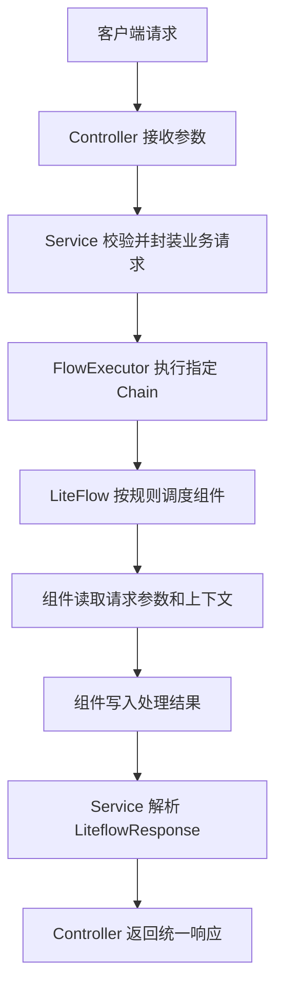

# Spring Boot 集成 LiteFlow 开发

本文档用于说明在 Spring Boot 3 项目中集成 LiteFlow 的基础开发方式，重点覆盖技术选型、适用场景、整体处理流程、基础依赖配置和推荐项目结构。示例以 Spring Boot 3.5.x、JDK 17+、Maven、LiteFlow Spring Boot Starter 为基础，后续章节可继续扩展组件开发、规则编排、动态规则管理和接口开发。

## 项目概述

本项目通过 Spring Boot 3 提供 Web 接口、参数校验、配置管理和基础运行环境，通过 LiteFlow 负责业务流程编排。业务逻辑不直接写死在 Service 方法中，而是拆分为可复用的 LiteFlow 组件，再通过 XML 规则文件组合成 Chain 流程。

LiteFlow 官方定位为轻量、快速、稳定的可编排组件式规则引擎，核心特点包括组件化、规则编排、上下文隔离、规则热刷新、脚本支持和 Spring Boot 3.x 支持。([liteflow.cc](https://liteflow.cc/?utm_source=chatgpt.com))

### 技术选型

本项目建议采用以下技术栈：

| 技术        | 版本/说明                      | 用途                                |
| ----------- | ------------------------------ | ----------------------------------- |
| JDK         | 17+                            | Spring Boot 3 基础运行环境          |
| Spring Boot | 3.5.x                          | Web 应用、依赖管理、自动配置        |
| LiteFlow    | 2.15.x                         | 组件式流程编排、规则执行            |
| Maven       | 3.6.3+                         | 项目构建与依赖管理                  |
| Lombok      | 项目常用版本                   | 简化 DTO、VO、实体类代码            |
| Hutool      | 项目常用版本                   | 字符串、集合、对象、JSON 等工具处理 |
| Validation  | Spring Boot Starter Validation | 请求参数校验                        |
| JUnit 5     | Spring Boot Test 默认集成      | 单元测试、流程验证                  |

Spring Boot 3.5.14 官方要求至少 Java 17，并明确支持 Maven 3.6.3 或更高版本；当前 Spring Boot 文档仍提供 3.5.14、3.4.13、3.3.13 等稳定 3.x 文档版本。([Home](https://docs.spring.io/spring-boot/3.5/system-requirements.html))

LiteFlow 依赖建议使用 Maven Central 上的 `com.yomahub:liteflow-spring-boot-starter`，当前可用版本示例为 `2.15.3.2`。如果企业内部已有统一版本管理，应优先使用公司 BOM 或父工程锁定的版本。([Maven Central](https://central.sonatype.com/artifact/com.yomahub/liteflow-spring-boot-starter?utm_source=chatgpt.com))

### 应用场景

LiteFlow 适合用于业务流程存在明显步骤拆分、条件分支、组件复用或规则变化较频繁的场景。它的重点不是替代数据库事务、消息队列或工作流审批平台，而是解决“复杂业务逻辑如何低耦合编排”的问题。

典型应用场景包括：

1. 订单处理流程
   例如订单参数校验、库存校验、优惠计算、风控校验、订单落库、消息通知等步骤可以拆分为多个组件，然后通过 Chain 编排执行顺序。
2. 审核与风控流程
   例如实名认证、黑名单校验、额度校验、规则评分、人工审核标记等逻辑，可以根据不同业务线配置不同流程。
3. 营销和计价流程
   例如优惠券、满减、会员折扣、活动价、平台补贴等计算逻辑，可以拆成独立组件，并通过规则控制执行顺序和分支。
4. 数据处理流程
   例如数据清洗、字段转换、规则校验、数据补全、结果入库、异常记录等批处理链路。
5. 多业务线复用流程
   例如 A 业务和 B 业务都需要“参数校验、用户查询、风控判断、通知发送”，但中间步骤不同，可以复用组件并配置不同 Chain。

不建议将 LiteFlow 用于强人工审批流、长事务状态流转、需要流程实例长期挂起的场景。这类场景更适合 BPMN 工作流引擎或状态机。LiteFlow 更适合在一次请求、一次任务或一次业务处理过程中完成快速规则编排。

### 整体处理流程

项目中的整体调用链路建议按“接口层接收请求、服务层组装上下文、LiteFlow 执行 Chain、组件处理业务、统一返回结果”的方式设计。



推荐的执行流程如下：

1. Controller 接收业务请求，完成基础参数校验。
2. Service 将请求参数转换为业务请求对象，例如 `OrderProcessRequest`。
3. Service 调用 LiteFlow 的 `FlowExecutor` 执行指定 Chain。
4. LiteFlow 根据 `flow.xml` 中配置的规则依次、并行或条件执行组件。
5. 每个组件只负责一个相对独立的业务动作，例如校验、查询、计算、保存、通知。
6. 组件之间通过上下文对象传递中间结果，避免组件之间直接互相调用。
7. Service 解析 `LiteflowResponse`，判断流程是否成功、是否存在异常、是否需要返回业务错误。
8. Controller 返回统一响应结构。

在 Spring 体系中，LiteFlow 组件可以交给 Spring 容器管理，业务组件通过注解注册即可被规则链引用。LiteFlow 当前文档也说明，在 Spring 体系下 Node 注册可以自动完成，规则文件主要由 `Chain` 和可选的 `Node` 组成。([liteflow.cc](https://liteflow.cc/pages/51ddd5/))

## 环境准备

环境准备部分用于说明项目运行前需要具备的基础软件、Maven 依赖、LiteFlow 配置和目录结构。完成本节配置后，项目应具备启动 Spring Boot 应用、加载 LiteFlow 规则文件、扫描 LiteFlow 组件的基础能力。

### Spring Boot 3 基础环境

开发环境建议固定以下基础版本：

| 环境  | 建议版本            | 说明                              |
| ----- | ------------------- | --------------------------------- |
| JDK   | 17 或更高           | Spring Boot 3 最低要求 Java 17    |
| Maven | 3.6.3 或更高        | 与 Spring Boot 3.5.x 官方要求一致 |
| IDE   | IntelliJ IDEA 2024+ | 推荐开启 Lombok 插件              |
| 编码  | UTF-8               | 避免 XML、YAML、中文日志乱码      |
| 包名  | `io.github.atengk`  | 示例默认基础包路径                |

在项目根目录执行以下命令检查 Java 和 Maven 环境：

```bash
# 查看 Java 版本，要求 17 或更高
java -version

# 查看 Maven 版本，建议 3.6.3 或更高
mvn -v
```

创建 Spring Boot 启动类，放在基础包路径下，确保后续 `component`、`service`、`controller` 等包能够被默认扫描。

文件位置：`src/main/java/io/github/atengk/liteflow/SpringBootLiteFlowApplication.java`

```java
package io.github.atengk.liteflow;

import org.springframework.boot.SpringApplication;
import org.springframework.boot.autoconfigure.SpringBootApplication;

/**
 * Spring Boot 集成 LiteFlow 启动类。
 *
 * @author Ateng
 * @since 2026-05-08
 */
@SpringBootApplication
public class SpringBootLiteFlowApplication {

    /**
     * 应用启动入口。
     *
     * @param args 启动参数
     */
    public static void main(String[] args) {
        SpringApplication.run(SpringBootLiteFlowApplication.class, args);
    }

}
```

启动类建议放在 `io.github.atengk.liteflow` 根包下。后续组件类如果放在 `io.github.atengk.liteflow.component` 包下，Spring Boot 可以默认完成组件扫描，不需要额外配置 `@ComponentScan`。

### LiteFlow 依赖配置

LiteFlow 在 Spring Boot 项目中通过 Starter 依赖接入。Spring Boot 官方建议项目通常继承 `spring-boot-starter-parent`，并通过 Starter 方式引入 Web、Validation、Test 等模块；LiteFlow 作为第三方 Starter，需要显式指定版本或由企业依赖管理统一控制。([Home](https://docs.spring.io/spring-boot/docs/3.0.x/reference/html/getting-started.html))

文件位置：`pom.xml`

```xml
<?xml version="1.0" encoding="UTF-8"?>
<project xmlns="http://maven.apache.org/POM/4.0.0"
         xmlns:xsi="http://www.w3.org/2001/XMLSchema-instance"
         xsi:schemaLocation="http://maven.apache.org/POM/4.0.0 https://maven.apache.org/xsd/maven-4.0.0.xsd">

    <modelVersion>4.0.0</modelVersion>

    <!-- Spring Boot 3.5.x 稳定版本，企业项目可替换为公司统一版本 -->
    <parent>
        <groupId>org.springframework.boot</groupId>
        <artifactId>spring-boot-starter-parent</artifactId>
        <version>3.5.14</version>
        <relativePath/>
    </parent>

    <groupId>io.github.atengk</groupId>
    <artifactId>springboot3-liteflow-demo</artifactId>
    <version>1.0.0</version>
    <name>springboot3-liteflow-demo</name>
    <description>Spring Boot 3 集成 LiteFlow 示例项目</description>

    <properties>
        <!-- Spring Boot 3 要求 JDK 17+ -->
        <java.version>17</java.version>

        <!-- LiteFlow 版本，企业项目建议放入父工程 dependencyManagement 统一管理 -->
        <liteflow.version>2.15.3.2</liteflow.version>

        <!-- Hutool 工具包版本，按企业项目统一版本调整 -->
        <hutool.version>5.8.38</hutool.version>
    </properties>

    <dependencies>
        <!-- Web 接口开发，包含 Spring MVC、内置容器、JSON 序列化等能力 -->
        <dependency>
            <groupId>org.springframework.boot</groupId>
            <artifactId>spring-boot-starter-web</artifactId>
        </dependency>

        <!-- 参数校验，用于 Controller 入参 DTO 的 @Valid、@NotBlank 等注解 -->
        <dependency>
            <groupId>org.springframework.boot</groupId>
            <artifactId>spring-boot-starter-validation</artifactId>
        </dependency>

        <!-- LiteFlow Spring Boot Starter，用于自动装配 FlowExecutor、加载规则文件、扫描组件 -->
        <dependency>
            <groupId>com.yomahub</groupId>
            <artifactId>liteflow-spring-boot-starter</artifactId>
            <version>${liteflow.version}</version>
        </dependency>

        <!-- Hutool 工具类，后续可用于字符串、集合、JSON、Bean 转换等通用处理 -->
        <dependency>
            <groupId>cn.hutool</groupId>
            <artifactId>hutool-all</artifactId>
            <version>${hutool.version}</version>
        </dependency>

        <!-- Lombok 简化 DTO、VO、日志对象等样板代码 -->
        <dependency>
            <groupId>org.projectlombok</groupId>
            <artifactId>lombok</artifactId>
            <optional>true</optional>
        </dependency>

        <!-- Spring Boot 测试依赖，包含 JUnit 5、MockMvc、AssertJ 等测试工具 -->
        <dependency>
            <groupId>org.springframework.boot</groupId>
            <artifactId>spring-boot-starter-test</artifactId>
            <scope>test</scope>
        </dependency>
    </dependencies>

    <build>
        <plugins>
            <!-- Spring Boot Maven 插件，用于打包可执行 Jar -->
            <plugin>
                <groupId>org.springframework.boot</groupId>
                <artifactId>spring-boot-maven-plugin</artifactId>
            </plugin>
        </plugins>
    </build>
</project>
```

LiteFlow 需要通过 `liteflow.rule-source` 指定规则文件路径。官方当前文档说明，规则文件是驱动和编排流程的关键，`rule-source` 是必须配置项，示例路径为 `config/flow.xml`；也支持 `classpath*:` 与通配符扫描多个规则文件。([liteflow.cc](https://liteflow.cc/pages/51ddd5/))

文件位置：`src/main/resources/application.yml`

```yaml
server:
  # 应用端口，按实际项目调整
  port: 8080

spring:
  application:
    # 应用名称，用于日志、链路追踪和服务识别
    name: springboot3-liteflow-demo

liteflow:
  # LiteFlow 是否启用，默认 true；生产环境建议显式配置
  enable: true

  # 规则文件路径，推荐统一放在 resources/config/liteflow 目录下
  rule-source: config/liteflow/flow.xml

  # 是否打印 LiteFlow Banner，生产环境可关闭
  print-banner: false

  # 是否启动时解析规则；建议开发、测试、生产均开启，尽早发现规则错误
  parse-mode: PARSE_ALL_ON_START

  # 是否打印执行日志；开发环境可开启，生产环境根据日志量决定
  print-execution-log: true

  # 重试次数，默认 0；如果组件内部已经做幂等和重试，可保持 0
  retry-count: 0

logging:
  level:
    # 示例项目基础包日志级别
    io.github.atengk.liteflow: info

    # LiteFlow 日志级别，调试规则时可临时改为 debug
    com.yomahub.liteflow: info
```

创建一个最小规则文件，用于验证 LiteFlow 是否能够正常加载。此处先给出空的基础结构，后续章节再补充具体组件和 Chain。

文件位置：`src/main/resources/config/liteflow/flow.xml`

```xml
<?xml version="1.0" encoding="UTF-8"?>
<flow>
    <!--
        Spring Boot 场景下，普通 Java 组件一般通过 Spring 注解注册。
        当前文件主要维护 chain 流程编排。
    -->

    <chain id="demoChain">
        THEN(a, b, c);
    </chain>
</flow>
```

注意：上面的 `demoChain` 引用了 `a`、`b`、`c` 三个组件，项目启动时需要存在对应的 LiteFlow 组件 Bean，否则规则解析会失败。实际开发时，应先创建组件类，再配置 Chain。

### 项目目录结构

项目目录建议按“接口层、业务层、LiteFlow 组件层、上下文对象、规则文件”进行拆分，避免所有流程逻辑堆在同一个 Service 中。

```text
springboot3-liteflow-demo
├── pom.xml
├── README.md
└── src
    ├── main
    │   ├── java
    │   │   └── io
    │   │       └── github
    │   │           └── atengk
    │   │               └── liteflow
    │   │                   ├── SpringBootLiteFlowApplication.java
    │   │                   ├── common
    │   │                   │   ├── response
    │   │                   │   │   └── Result.java
    │   │                   │   └── exception
    │   │                   │       └── GlobalExceptionHandler.java
    │   │                   ├── controller
    │   │                   │   └── FlowExecuteController.java
    │   │                   ├── service
    │   │                   │   ├── FlowExecuteService.java
    │   │                   │   └── impl
    │   │                   │       └── FlowExecuteServiceImpl.java
    │   │                   ├── component
    │   │                   │   ├── CheckParamComponent.java
    │   │                   │   ├── QueryUserComponent.java
    │   │                   │   └── SaveResultComponent.java
    │   │                   ├── context
    │   │                   │   └── FlowBizContext.java
    │   │                   ├── dto
    │   │                   │   └── FlowExecuteRequest.java
    │   │                   └── vo
    │   │                       └── FlowExecuteResponse.java
    │   └── resources
    │       ├── application.yml
    │       └── config
    │           └── liteflow
    │               └── flow.xml
    └── test
        └── java
            └── io
                └── github
                    └── atengk
                        └── liteflow
                            └── LiteFlowApplicationTests.java
```

核心目录职责如下：

| 路径                        | 说明                                               |
| --------------------------- | -------------------------------------------------- |
| `controller`                | 对外提供流程执行、规则查询、规则更新等接口         |
| `service`                   | 负责组装请求、调用 `FlowExecutor`、解析执行结果    |
| `component`                 | 存放 LiteFlow 业务组件，一个组件只处理一个明确动作 |
| `context`                   | 存放流程上下文对象，用于组件之间传递中间数据       |
| `dto`                       | 请求参数对象                                       |
| `vo`                        | 接口返回对象                                       |
| `common.response`           | 统一响应结构                                       |
| `common.exception`          | 全局异常处理                                       |
| `resources/config/liteflow` | LiteFlow 规则文件目录                              |

这种结构的核心目标是让业务流程清晰分层：Controller 不直接感知规则细节，Service 不堆积大量 if-else，组件不互相强依赖，规则文件负责描述执行顺序。后续新增流程时，优先新增组件和 Chain，而不是修改已有大段业务代码。


## LiteFlow 基础配置

本节用于说明 LiteFlow 在 Spring Boot 3 项目中的基础配置方式，包括 `application.yml` 配置项、规则文件加载方式和规则刷新机制。完成本节后，项目应具备规则加载、流程执行和后续热刷新扩展的基础能力。

### 配置文件说明

LiteFlow 的核心配置集中在 `application.yml` 中，其中最关键的是 `liteflow.rule-source`。LiteFlow 官方文档说明，规则文件是驱动和编排流程的关键，`rule-source` 用于定位规则文件来源，并且属于必须配置项；其他配置项一般都有默认值。([liteflow.cc](https://liteflow.cc/pages/51ddd5/?utm_source=chatgpt.com))

文件位置：`src/main/resources/application.yml`

```yaml
server:
  # Web 服务端口
  port: 8080

spring:
  application:
    # 应用名称，用于日志、链路追踪和服务标识
    name: springboot3-liteflow-demo

liteflow:
  # 是否启用 LiteFlow，默认开启；显式配置便于多环境管理
  enable: true

  # 规则文件路径，推荐放在 resources/config/liteflow 目录下
  rule-source: config/liteflow/flow.xml

  # 是否打印 LiteFlow Banner，生产环境建议关闭
  print-banner: false

  # 启动时解析全部规则，便于在启动阶段提前发现规则错误
  parse-mode: PARSE_ALL_ON_START

  # 是否打印组件执行日志，开发和测试环境建议开启
  print-execution-log: true

  # 全局重试次数，默认 0；如组件内部已经保证幂等，可保持 0
  retry-count: 0

logging:
  level:
    # 当前项目业务包日志级别
    io.github.atengk.liteflow: info

    # LiteFlow 框架日志级别，排查规则加载问题时可临时改为 debug
    com.yomahub.liteflow: info
```

常用配置项说明如下：

| 配置项                         | 说明              | 建议值                        |
| ------------------------------ | ----------------- | ----------------------------- |
| `liteflow.enable`              | 是否启用 LiteFlow | `true`                        |
| `liteflow.rule-source`         | 规则文件来源      | `config/liteflow/flow.xml`    |
| `liteflow.print-banner`        | 是否打印 Banner   | 生产环境建议 `false`          |
| `liteflow.parse-mode`          | 规则解析模式      | `PARSE_ALL_ON_START`          |
| `liteflow.print-execution-log` | 是否打印执行日志  | 开发环境 `true`，生产环境按需 |
| `liteflow.retry-count`         | 组件失败重试次数  | 默认 `0`                      |

项目初期建议使用本地 XML 规则文件，便于开发、调试和版本管理。后续如果规则需要后台管理，可以扩展为数据库、Redis、Nacos、Apollo 等配置源。

### 规则文件加载方式

LiteFlow 支持通过本地文件、多个文件、模糊路径、绝对路径和扩展配置源加载规则。当前新版 LiteFlow 文档说明，本地规则文件主要由 `Node` 和 `Chain` 组成；在 Spring 体系中，普通 Java 组件通常由 Spring 自动注册，`<nodes>` 不是必须的，只有脚本节点或非 Spring 场景才需要显式声明。([liteflow.cc](https://liteflow.cc/pages/51ddd5/?utm_source=chatgpt.com))

项目推荐使用以下规则文件路径：

```text
src/main/resources/config/liteflow/flow.xml
```

文件位置：`src/main/resources/config/liteflow/flow.xml`

```xml
<?xml version="1.0" encoding="UTF-8"?>
<flow>
    <!--
        Spring Boot 项目中，普通 Java 组件通过 @LiteflowComponent 或 Spring Bean 注册。
        当前文件重点维护 Chain 流程编排关系。
    -->

    <chain id="orderProcessChain">
        THEN(checkParam, queryUser, calculateAmount, saveOrder);
    </chain>

    <chain id="userRiskChain">
        THEN(checkParam, queryUser, SWITCH(riskDecision).TO(passRisk, rejectRisk));
    </chain>
</flow>
```

如果规则拆分较多，可以通过逗号或分号指定多个规则文件。LiteFlow 官方文档说明，工程内多个规则文件之间可以使用 `,` 或 `;` 分隔，也可以在 Spring Boot/Spring 体系中使用模糊匹配加载多个配置文件。([liteflow.cc](https://liteflow.cc/pages/51ddd5/?utm_source=chatgpt.com))

文件位置：`src/main/resources/application.yml`

```yaml
liteflow:
  # 方式一：指定多个规则文件
  rule-source: config/liteflow/order-flow.xml,config/liteflow/user-flow.xml

  # 方式二：使用 Spring 体系下的 classpath* 模糊匹配
  # rule-source: classpath*:config/liteflow/**/*.xml
```

如果规则文件需要放在外部目录，例如便于运维替换或配置中心生成，也可以使用绝对路径。新版文档说明，绝对路径也支持多个路径分隔，并在 v2.11.1+ 支持绝对路径模糊匹配。([liteflow.cc](https://liteflow.cc/pages/51ddd5/?utm_source=chatgpt.com))

```yaml
liteflow:
  # 外部绝对路径，适合生产环境通过挂载目录管理规则
  rule-source: /data/app/liteflow/flow.xml

  # v2.11.1+ 可使用绝对路径模糊匹配
  # rule-source: /data/app/liteflow/**/*.xml
```

规则文件命名建议统一放在 `config/liteflow` 目录下，并按照业务域拆分：

```text
src/main/resources/config/liteflow
├── order-flow.xml
├── user-flow.xml
├── risk-flow.xml
└── notify-flow.xml
```

拆分规则时需要注意两点：第一，`chain id` 在整个应用内应保持唯一；第二，组件名称要与 Java 组件注册名称一致。例如规则中引用 `checkParam`，则 Java 组件应注册为 `checkParam`。

### 规则刷新机制

规则刷新用于在不重启应用的情况下更新流程编排。LiteFlow 官方文档说明，其支持平滑热刷新：刷新期间正在执行的流程仍按旧规则执行，刷新完成后，后续请求自动使用新规则。([liteflow.cc](https://liteflow.cc/pages/204d71/?utm_source=chatgpt.com))

常见刷新方式如下：

| 刷新方式         | 适用场景                    | 说明                           |
| ---------------- | --------------------------- | ------------------------------ |
| 重启应用刷新     | 本地开发、低频变更          | 简单可靠，但会中断服务         |
| 本地文件监听刷新 | 本地规则文件、需要自动监听  | 修改规则文件后自动刷新         |
| 配置源自动刷新   | Nacos、Apollo、ZK、Redis 等 | 依赖 LiteFlow 对应插件能力     |
| 主动代码刷新     | 数据库规则、自定义配置源    | 通过代码触发全量或单条规则刷新 |

当前 LiteFlow 文档中，主动全量刷新推荐使用 `LiteflowMetaOperator.reloadAllChain()`；单条 Chain 可使用 `LiteflowMetaOperator.reloadOneChain("chain1", "THEN(a, b, c)")`。如果是多节点部署，因为规则缓存在各 JVM 内存中，需要每个节点都执行刷新，常见做法是通过 MQ 广播刷新事件。([liteflow.cc](https://liteflow.cc/pages/204d71/?utm_source=chatgpt.com))

下面给出一个基础的规则刷新服务，适用于后续接口层调用。

文件位置：`src/main/java/io/github/atengk/liteflow/service/RuleRefreshService.java`

```java
package io.github.atengk.liteflow.service;

/**
 * LiteFlow 规则刷新服务。
 *
 * @author Ateng
 * @since 2026-05-08
 */
public interface RuleRefreshService {

    /**
     * 全量刷新所有规则。
     */
    void reloadAll();

    /**
     * 刷新指定 Chain。
     *
     * @param chainId Chain 编号
     * @param el      EL 表达式
     */
    void reloadOne(String chainId, String el);

}
```

下面的实现类用于封装 LiteFlow 元数据刷新能力，便于 Controller、定时任务或 MQ 消费者统一调用。

文件位置：`src/main/java/io/github/atengk/liteflow/service/impl/RuleRefreshServiceImpl.java`

```java
package io.github.atengk.liteflow.service.impl;

import cn.hutool.core.util.StrUtil;
import com.yomahub.liteflow.builder.LiteflowMetaOperator;
import io.github.atengk.liteflow.service.RuleRefreshService;
import lombok.extern.slf4j.Slf4j;
import org.springframework.stereotype.Service;

/**
 * LiteFlow 规则刷新服务实现。
 *
 * @author Ateng
 * @since 2026-05-08
 */
@Slf4j
@Service
public class RuleRefreshServiceImpl implements RuleRefreshService {

    /**
     * 全量刷新所有规则。
     */
    @Override
    public void reloadAll() {
        LiteflowMetaOperator.reloadAllChain();
        log.info("LiteFlow 规则已全量刷新");
    }

    /**
     * 刷新指定 Chain。
     *
     * @param chainId Chain 编号
     * @param el      EL 表达式
     */
    @Override
    public void reloadOne(String chainId, String el) {
        if (StrUtil.hasBlank(chainId, el)) {
            throw new IllegalArgumentException("Chain 编号和 EL 表达式不能为空");
        }

        LiteflowMetaOperator.reloadOneChain(chainId, el);
        log.info("LiteFlow 指定规则已刷新，chainId={}", chainId);
    }

}
```

使用规则刷新时需要注意：

1. 全量刷新适合规则数量不大、变更频率不高的场景。
2. 单条刷新适合后台规则管理或数据库规则变更场景。
3. 多节点部署时，不能只刷新当前节点，应通过 MQ、配置中心事件或服务治理能力通知所有节点。
4. 刷新前应先校验 EL 表达式合法性，避免错误规则覆盖正在使用的规则。
5. 生产环境建议保留规则版本号、更新时间、操作人和回滚记录。

## 核心概念

本节说明 LiteFlow 开发中最常用的几个核心概念：组件、Chain、上下文和执行器。理解这几个概念后，后续开发普通组件、条件组件、循环组件、并行编排和接口执行入口会更清晰。

### 组件定义

组件是 LiteFlow 中最小的业务执行单元。每个组件应只处理一个明确动作，例如参数校验、用户查询、金额计算、订单保存、消息发送等。LiteFlow 官方示例中，组件需要被 Spring 扫描并注册到上下文，然后在规则文件中通过组件名称引用。([liteflow.cc](https://liteflow.cc/pages/v2.7.X/ecc62a/?utm_source=chatgpt.com))

在 Spring Boot 项目中，推荐使用 `@LiteflowComponent("组件名")` 注册组件，并继承 `NodeComponent` 实现 `process()` 方法。

文件位置：`src/main/java/io/github/atengk/liteflow/component/CheckParamComponent.java`

```java
package io.github.atengk.liteflow.component;

import cn.hutool.core.util.StrUtil;
import com.yomahub.liteflow.annotation.LiteflowComponent;
import com.yomahub.liteflow.core.NodeComponent;
import io.github.atengk.liteflow.context.FlowBizContext;
import lombok.extern.slf4j.Slf4j;

/**
 * 参数校验组件。
 *
 * @author Ateng
 * @since 2026-05-08
 */
@Slf4j
@LiteflowComponent("checkParam")
public class CheckParamComponent extends NodeComponent {

    /**
     * 执行参数校验逻辑。
     */
    @Override
    public void process() {
        FlowBizContext context = this.getContextBean(FlowBizContext.class);

        if (StrUtil.isBlank(context.getBizNo())) {
            throw new IllegalArgumentException("业务编号不能为空");
        }

        log.info("参数校验通过，bizNo={}", context.getBizNo());
    }

}
```

文件位置：`src/main/java/io/github/atengk/liteflow/component/QueryUserComponent.java`

```java
package io.github.atengk.liteflow.component;

import cn.hutool.core.util.StrUtil;
import com.yomahub.liteflow.annotation.LiteflowComponent;
import com.yomahub.liteflow.core.NodeComponent;
import io.github.atengk.liteflow.context.FlowBizContext;
import lombok.extern.slf4j.Slf4j;

/**
 * 用户查询组件。
 *
 * @author Ateng
 * @since 2026-05-08
 */
@Slf4j
@LiteflowComponent("queryUser")
public class QueryUserComponent extends NodeComponent {

    /**
     * 查询用户信息并写入上下文。
     */
    @Override
    public void process() {
        FlowBizContext context = this.getContextBean(FlowBizContext.class);

        if (StrUtil.isBlank(context.getUserId())) {
            throw new IllegalArgumentException("用户ID不能为空");
        }

        // 示例中不连接数据库，实际项目应在此处调用 UserService 或 Mapper 查询用户
        context.setUserName("测试用户-" + context.getUserId());

        log.info("用户信息查询完成，userId={}，userName={}", context.getUserId(), context.getUserName());
    }

}
```

组件开发建议遵循以下规则：

| 建议       | 说明                                                |
| ---------- | --------------------------------------------------- |
| 单一职责   | 一个组件只处理一个明确业务动作                      |
| 不互相调用 | 组件之间通过上下文传值，不直接互相注入调用          |
| 异常明确   | 业务异常直接抛出，执行器统一解析 `LiteflowResponse` |
| 日志简洁   | 关键组件记录入参标识、分支结果和异常原因            |
| 名称稳定   | 组件名称一旦被规则文件引用，不要随意修改            |

### Chain 流程编排

Chain 是 LiteFlow 的流程定义，用于描述组件之间的执行关系。LiteFlow 规则文件主要由 `Node` 和 `Chain` 组成，在 Spring Boot 项目中，普通 Java 组件通常已经由 Spring 注册，规则文件主要维护 Chain 编排。([liteflow.cc](https://liteflow.cc/pages/51ddd5/?utm_source=chatgpt.com))

最基础的顺序编排如下：

文件位置：`src/main/resources/config/liteflow/flow.xml`

```xml
<?xml version="1.0" encoding="UTF-8"?>
<flow>
    <!-- 顺序执行：参数校验 -> 查询用户 -> 计算金额 -> 保存订单 -->
    <chain id="orderProcessChain">
        THEN(checkParam, queryUser, calculateAmount, saveOrder);
    </chain>
</flow>
```

常见编排方式包括：

| 编排方式 | 示例                     | 说明                     |
| -------- | ------------------------ | ------------------------ |
| 顺序编排 | `THEN(a, b, c)`          | 按顺序执行组件           |
| 条件分支 | `SWITCH(x).TO(a, b)`     | 根据条件组件选择执行分支 |
| 并行编排 | `WHEN(a, b, c)`          | 多个组件并行执行         |
| 循环编排 | `FOR(...).DO(...)`       | 按规则循环执行           |
| 组合编排 | `THEN(a, WHEN(b, c), d)` | 多种表达式嵌套组合       |

下面给出一个更接近业务场景的规则文件示例：

文件位置：`src/main/resources/config/liteflow/order-flow.xml`

```xml
<?xml version="1.0" encoding="UTF-8"?>
<flow>
    <!-- 订单主流程：校验参数、查询用户、并行处理金额和风控、最后保存订单 -->
    <chain id="orderProcessChain">
        THEN(
            checkParam,
            queryUser,
            WHEN(calculateAmount, riskCheck),
            saveOrder
        );
    </chain>

    <!-- 用户风控流程：根据风控决策进入通过或拒绝分支 -->
    <chain id="userRiskChain">
        THEN(
            checkParam,
            queryUser,
            SWITCH(riskDecision).TO(passRisk, rejectRisk)
        );
    </chain>
</flow>
```

Chain 编排建议：

1. `chain id` 使用清晰的业务命名，例如 `orderProcessChain`、`userRiskChain`。
2. 通用组件可以复用，例如 `checkParam`、`queryUser`。
3. 规则表达式不要写得过长，复杂流程建议拆分多个 Chain。
4. 关键流程变更应走代码评审或规则审核，避免线上流程被误改。
5. 规则文件建议纳入 Git 版本管理，即使后续迁移到数据库，也应保留规则版本和发布记录。

### Slot 上下文

LiteFlow 早期文档和内部执行模型中经常提到 Slot，实际开发时可以把它理解为一次流程执行过程中的数据槽位，用于承载请求数据、上下文对象、执行步骤、异常等信息。新版业务开发更推荐使用“上下文 Bean”的方式传递业务数据，在组件中通过 `this.getContextBean(YourContext.class)` 获取。LiteFlow 官方问答明确说明，执行器的第二个参数是流程入参 `requestData`，第三个参数才是上下文，两者不是同一个概念。([liteflow.cc](https://liteflow.cc/pages/845dff/?utm_source=chatgpt.com))

项目中建议定义强类型上下文对象，而不是在组件中使用弱类型 Map。

文件位置：`src/main/java/io/github/atengk/liteflow/context/FlowBizContext.java`

```java
package io.github.atengk.liteflow.context;

import lombok.Data;

import java.math.BigDecimal;

/**
 * LiteFlow 业务上下文。
 *
 * @author Ateng
 * @since 2026-05-08
 */
@Data
public class FlowBizContext {

    /**
     * 业务编号。
     */
    private String bizNo;

    /**
     * 用户ID。
     */
    private String userId;

    /**
     * 用户名称。
     */
    private String userName;

    /**
     * 订单金额。
     */
    private BigDecimal orderAmount;

    /**
     * 风控是否通过。
     */
    private Boolean riskPassed;

    /**
     * 处理结果。
     */
    private String resultMessage;

}
```

上下文推荐承载以下几类数据：

| 数据类型 | 示例                      | 说明                             |
| -------- | ------------------------- | -------------------------------- |
| 请求标识 | `bizNo`、`userId`         | 用于日志追踪和业务定位           |
| 中间结果 | `userName`、`orderAmount` | 由前置组件写入，后续组件读取     |
| 分支结果 | `riskPassed`              | 条件组件或分支组件使用           |
| 最终结果 | `resultMessage`           | 流程执行完成后返回给接口层       |
| 扩展字段 | `extraData`               | 复杂场景可使用 Map，但不建议滥用 |

如果需要从请求 DTO 转换为上下文对象，可以使用 Hutool 简化处理。

文件位置：`src/main/java/io/github/atengk/liteflow/dto/FlowExecuteRequest.java`

```java
package io.github.atengk.liteflow.dto;

import jakarta.validation.constraints.NotBlank;
import lombok.Data;

import java.math.BigDecimal;

/**
 * 流程执行请求参数。
 *
 * @author Ateng
 * @since 2026-05-08
 */
@Data
public class FlowExecuteRequest {

    /**
     * 业务编号。
     */
    @NotBlank(message = "业务编号不能为空")
    private String bizNo;

    /**
     * 用户ID。
     */
    @NotBlank(message = "用户ID不能为空")
    private String userId;

    /**
     * 订单金额。
     */
    private BigDecimal orderAmount;

}
```

文件位置：`src/main/java/io/github/atengk/liteflow/converter/FlowBizContextConverter.java`

```java
package io.github.atengk.liteflow.converter;

import cn.hutool.core.bean.BeanUtil;
import io.github.atengk.liteflow.context.FlowBizContext;
import io.github.atengk.liteflow.dto.FlowExecuteRequest;

/**
 * LiteFlow 上下文转换器。
 *
 * @author Ateng
 * @since 2026-05-08
 */
public class FlowBizContextConverter {

    /**
     * 私有构造方法，避免工具类被实例化。
     */
    private FlowBizContextConverter() {
    }

    /**
     * 请求参数转换为业务上下文。
     *
     * @param request 请求参数
     * @return 业务上下文
     */
    public static FlowBizContext toContext(FlowExecuteRequest request) {
        return BeanUtil.copyProperties(request, FlowBizContext.class);
    }

}
```

使用上下文时要特别注意：不要把已经初始化好的业务上下文错误地只作为 `requestData` 传入。如果希望组件通过 `getContextBean(FlowBizContext.class)` 获取数据，应把上下文作为执行器的上下文参数传入，例如 `execute2Resp(chainId, null, context)`。LiteFlow 官方问答也强调，`requestData` 需要通过 `getRequestData()` 获取，而上下文 Bean 需要通过 `getContextBean()` 获取。([liteflow.cc](https://liteflow.cc/pages/845dff/?utm_source=chatgpt.com))

### 执行器使用

`FlowExecutor` 是 LiteFlow 执行流程的入口。官方文档说明，最常用的是 `execute2Resp`，返回 `LiteflowResponse`；该方式不会直接抛出流程异常，可以通过 `response.isSuccess()` 判断是否成功，并通过 `response.getCause()` 获取异常原因。文档同时说明，`execute2Future` 可用于非阻塞执行，返回 `Future<LiteflowResponse>`。([liteflow.cc](https://liteflow.cc/pages/82cb24/?utm_source=chatgpt.com))

项目中建议在 Service 层统一封装 `FlowExecutor`，不要在 Controller 或组件中直接散落调用。

文件位置：`src/main/java/io/github/atengk/liteflow/service/FlowExecuteService.java`

```java
package io.github.atengk.liteflow.service;

import io.github.atengk.liteflow.context.FlowBizContext;
import io.github.atengk.liteflow.dto.FlowExecuteRequest;

/**
 * LiteFlow 流程执行服务。
 *
 * @author Ateng
 * @since 2026-05-08
 */
public interface FlowExecuteService {

    /**
     * 执行业务流程。
     *
     * @param chainId Chain 编号
     * @param request 请求参数
     * @return 业务上下文
     */
    FlowBizContext execute(String chainId, FlowExecuteRequest request);

}
```

下面的实现类演示了同步执行流程、判断执行结果、读取异常和返回上下文的完整写法。

文件位置：`src/main/java/io/github/atengk/liteflow/service/impl/FlowExecuteServiceImpl.java`

```java
package io.github.atengk.liteflow.service.impl;

import cn.hutool.core.util.StrUtil;
import com.yomahub.liteflow.core.FlowExecutor;
import com.yomahub.liteflow.flow.LiteflowResponse;
import io.github.atengk.liteflow.context.FlowBizContext;
import io.github.atengk.liteflow.converter.FlowBizContextConverter;
import io.github.atengk.liteflow.dto.FlowExecuteRequest;
import io.github.atengk.liteflow.service.FlowExecuteService;
import lombok.RequiredArgsConstructor;
import lombok.extern.slf4j.Slf4j;
import org.springframework.stereotype.Service;

/**
 * LiteFlow 流程执行服务实现。
 *
 * @author Ateng
 * @since 2026-05-08
 */
@Slf4j
@Service
@RequiredArgsConstructor
public class FlowExecuteServiceImpl implements FlowExecuteService {

    private final FlowExecutor flowExecutor;

    /**
     * 执行业务流程。
     *
     * @param chainId Chain 编号
     * @param request 请求参数
     * @return 业务上下文
     */
    @Override
    public FlowBizContext execute(String chainId, FlowExecuteRequest request) {
        if (StrUtil.isBlank(chainId)) {
            throw new IllegalArgumentException("Chain 编号不能为空");
        }

        FlowBizContext context = FlowBizContextConverter.toContext(request);

        log.info("开始执行 LiteFlow 流程，chainId={}，bizNo={}", chainId, context.getBizNo());

        LiteflowResponse response = flowExecutor.execute2Resp(chainId, null, context);

        if (!response.isSuccess()) {
            Throwable cause = response.getCause();
            String message = cause == null ? "未知异常" : cause.getMessage();
            log.error("LiteFlow 流程执行失败，chainId={}，bizNo={}，reason={}", chainId, context.getBizNo(), message, cause);
            throw new IllegalStateException("流程执行失败：" + message, cause);
        }

        FlowBizContext resultContext = response.getFirstContextBean();
        log.info("LiteFlow 流程执行成功，chainId={}，bizNo={}", chainId, resultContext.getBizNo());

        return resultContext;
    }

}
```

如果业务需要异步执行，可以使用 `execute2Future`。这种方式适合主线程不希望阻塞等待流程完成的场景，但最终仍需要通过 `future.get()` 获取执行结果。官方文档说明，`execute2Future` 返回 `Future<LiteflowResponse>`，属于执行器层面的异步能力。([liteflow.cc](https://liteflow.cc/pages/82cb24/?utm_source=chatgpt.com))

异步执行示例可以放在同一个 Service 中作为扩展方法：

```java
/**
 * 异步执行业务流程。
 *
 * @param chainId Chain 编号
 * @param request 请求参数
 * @return Future 执行结果
 */
public Future<LiteflowResponse> executeAsync(String chainId, FlowExecuteRequest request) {
    if (StrUtil.isBlank(chainId)) {
        throw new IllegalArgumentException("Chain 编号不能为空");
    }

    FlowBizContext context = FlowBizContextConverter.toContext(request);
    log.info("开始异步执行 LiteFlow 流程，chainId={}，bizNo={}", chainId, context.getBizNo());

    return flowExecutor.execute2Future(chainId, null, context);
}
```

执行器使用建议如下：

| 建议                 | 说明                                              |
| -------------------- | ------------------------------------------------- |
| Service 层统一调用   | 避免 Controller 直接依赖 LiteFlow API             |
| 优先使用强类型上下文 | 避免 Map 或弱类型上下文导致字段不可控             |
| 统一处理失败响应     | 通过 `isSuccess()` 和 `getCause()` 转换为业务异常 |
| 日志记录业务标识     | 至少记录 `chainId`、`bizNo`、关键分支结果         |
| 异步执行谨慎使用     | 异步适合耗时流程，但要处理线程池、超时和异常      |


## 组件开发

组件开发用于把业务流程拆分为可复用的执行单元。结合前文目录，本节主要说明普通组件、条件组件、循环组件和异步组件的开发方式，后续规则文件通过组件 ID 进行编排。

LiteFlow 普通组件需要继承 `NodeComponent` 并实现 `process()` 方法，`@LiteflowComponent("组件ID")` 的参数就是 EL 规则中引用的组件 ID；在 Spring 体系中，`@LiteflowComponent` 本身继承自 Spring 的 `@Component`，因此组件内部可以正常注入 Spring Bean。([LiteFlow](https://liteflow.cc/pages/v2.9.X/8486fb/?utm_source=chatgpt.com))

为支持下面的组件示例，建议先扩展前文的业务上下文对象。

文件位置：`src/main/java/io/github/atengk/liteflow/context/FlowBizContext.java`

```java
package io.github.atengk.liteflow.context;

import lombok.Data;

import java.math.BigDecimal;
import java.util.ArrayList;
import java.util.List;

/**
 * LiteFlow 业务上下文。
 *
 * @author Ateng
 * @since 2026-05-08
 */
@Data
public class FlowBizContext {

    /**
     * 业务编号。
     */
    private String bizNo;

    /**
     * 用户ID。
     */
    private String userId;

    /**
     * 用户名称。
     */
    private String userName;

    /**
     * 订单金额。
     */
    private BigDecimal orderAmount;

    /**
     * 优惠金额。
     */
    private BigDecimal couponAmount;

    /**
     * 是否会员用户。
     */
    private Boolean vipUser;

    /**
     * 风控等级。
     */
    private String riskLevel;

    /**
     * 风控是否通过。
     */
    private Boolean riskPassed;

    /**
     * 最大重试次数。
     */
    private Integer maxRetryTimes;

    /**
     * 当前通知重试次数。
     */
    private Integer notifyRetryCount = 0;

    /**
     * 短信是否发送成功。
     */
    private Boolean smsSent = false;

    /**
     * 邮件是否发送成功。
     */
    private Boolean emailSent = false;

    /**
     * 通知记录。
     */
    private List<String> notifyMessages = new ArrayList<>();

    /**
     * 处理结果。
     */
    private String resultMessage;

}
```

### 普通组件

普通组件用于处理无分支、无循环语义的业务动作，例如参数校验、用户查询、金额计算、订单保存、通知发送等。普通组件通常出现在 `THEN` 顺序编排或 `WHEN` 并行编排中。LiteFlow 普通组件除 `process()` 外，还可以按需覆盖 `isAccess()`、`isContinueOnError()`、`isEnd()`、`beforeProcess()` 和 `afterProcess()` 等方法，用于控制节点是否进入、异常后是否继续、是否主动结束流程等行为。([LiteFlow](https://liteflow.cc/pages/v2.9.X/8486fb/?utm_source=chatgpt.com))

下面示例实现订单金额计算组件。如果当前用户是会员，则计算 5% 优惠金额；否则优惠金额为 0。

文件位置：`src/main/java/io/github/atengk/liteflow/component/CalculateAmountComponent.java`

```java
package io.github.atengk.liteflow.component;

import cn.hutool.core.util.BooleanUtil;
import cn.hutool.core.util.NumberUtil;
import cn.hutool.core.util.ObjectUtil;
import com.yomahub.liteflow.annotation.LiteflowComponent;
import com.yomahub.liteflow.core.NodeComponent;
import io.github.atengk.liteflow.context.FlowBizContext;
import lombok.extern.slf4j.Slf4j;

import java.math.BigDecimal;

/**
 * 订单金额计算组件。
 *
 * @author Ateng
 * @since 2026-05-08
 */
@Slf4j
@LiteflowComponent("calculateAmount")
public class CalculateAmountComponent extends NodeComponent {

    /**
     * 计算订单优惠金额。
     */
    @Override
    public void process() {
        FlowBizContext context = this.getContextBean(FlowBizContext.class);

        BigDecimal orderAmount = ObjectUtil.defaultIfNull(context.getOrderAmount(), BigDecimal.ZERO);
        BigDecimal couponAmount = BigDecimal.ZERO;

        if (BooleanUtil.isTrue(context.getVipUser())) {
            couponAmount = NumberUtil.mul(orderAmount, new BigDecimal("0.05"));
        }

        context.setCouponAmount(couponAmount);
        log.info("订单金额计算完成，bizNo={}，orderAmount={}，couponAmount={}",
                context.getBizNo(), orderAmount, couponAmount);
    }

}
```

下面示例实现订单保存组件。实际项目中可在此处调用 `OrderService`、`Mapper` 或远程服务完成业务落库。

文件位置：`src/main/java/io/github/atengk/liteflow/component/SaveOrderComponent.java`

```java
package io.github.atengk.liteflow.component;

import cn.hutool.core.util.StrUtil;
import com.yomahub.liteflow.annotation.LiteflowComponent;
import com.yomahub.liteflow.core.NodeComponent;
import io.github.atengk.liteflow.context.FlowBizContext;
import lombok.extern.slf4j.Slf4j;

/**
 * 订单保存组件。
 *
 * @author Ateng
 * @since 2026-05-08
 */
@Slf4j
@LiteflowComponent("saveOrder")
public class SaveOrderComponent extends NodeComponent {

    /**
     * 保存订单处理结果。
     */
    @Override
    public void process() {
        FlowBizContext context = this.getContextBean(FlowBizContext.class);

        if (StrUtil.isBlank(context.getBizNo())) {
            throw new IllegalArgumentException("业务编号不能为空，无法保存订单");
        }

        // 示例中不连接数据库，实际项目应在此处调用 OrderService 保存订单数据
        context.setResultMessage("订单处理成功");

        log.info("订单保存完成，bizNo={}，userId={}", context.getBizNo(), context.getUserId());
    }

}
```

普通组件开发建议保持“一个组件只做一件事”。例如不要把参数校验、用户查询、金额计算、订单保存全部写到一个组件中，否则规则编排的价值会下降，后续复用和调整流程也会变困难。

### 条件组件

条件组件用于在流程中返回判断结果。LiteFlow 中常见的条件类组件有两类：`NodeIfComponent` 用于 `IF...ELIF...ELSE` 这种 true/false 条件编排；`NodeSwitchComponent` 用于 `SWITCH` 选择编排，并通过返回目标节点 ID、表达式 ID 或 tag 决定后续执行分支。([LiteFlow](https://liteflow.cc/pages/v2.8.X/cb0b59/?utm_source=chatgpt.com))

下面示例实现会员判断组件，可用于 `IF(isVipUser, vipDiscount, normalDiscount)` 这种规则。

文件位置：`src/main/java/io/github/atengk/liteflow/component/IsVipUserComponent.java`

```java
package io.github.atengk.liteflow.component;

import cn.hutool.core.util.BooleanUtil;
import com.yomahub.liteflow.annotation.LiteflowComponent;
import com.yomahub.liteflow.core.NodeIfComponent;
import io.github.atengk.liteflow.context.FlowBizContext;
import lombok.extern.slf4j.Slf4j;

/**
 * 会员用户判断组件。
 *
 * @author Ateng
 * @since 2026-05-08
 */
@Slf4j
@LiteflowComponent("isVipUser")
public class IsVipUserComponent extends NodeIfComponent {

    /**
     * 判断当前用户是否为会员。
     *
     * @return true 表示会员用户，false 表示普通用户
     */
    @Override
    public boolean processIf() {
        FlowBizContext context = this.getContextBean(FlowBizContext.class);
        boolean vipUser = BooleanUtil.isTrue(context.getVipUser());

        log.info("会员用户判断完成，bizNo={}，vipUser={}", context.getBizNo(), vipUser);
        return vipUser;
    }

}
```

下面示例实现风控分支选择组件。`processSwitch()` 返回 `passRisk` 时执行通过分支，返回 `rejectRisk` 时执行拒绝分支。

文件位置：`src/main/java/io/github/atengk/liteflow/component/RiskDecisionComponent.java`

```java
package io.github.atengk.liteflow.component;

import cn.hutool.core.util.BooleanUtil;
import cn.hutool.core.util.StrUtil;
import com.yomahub.liteflow.annotation.LiteflowComponent;
import com.yomahub.liteflow.core.NodeSwitchComponent;
import io.github.atengk.liteflow.context.FlowBizContext;
import lombok.extern.slf4j.Slf4j;

/**
 * 风控决策组件。
 *
 * @author Ateng
 * @since 2026-05-08
 */
@Slf4j
@LiteflowComponent("riskDecision")
public class RiskDecisionComponent extends NodeSwitchComponent {

    /**
     * 根据风控结果选择后续分支。
     *
     * @return 后续执行的组件 ID
     */
    @Override
    public String processSwitch() {
        FlowBizContext context = this.getContextBean(FlowBizContext.class);

        boolean reject = BooleanUtil.isFalse(context.getRiskPassed())
                || StrUtil.equalsIgnoreCase("HIGH", context.getRiskLevel());

        String targetNode = reject ? "rejectRisk" : "passRisk";

        log.info("风控决策完成，bizNo={}，riskLevel={}，targetNode={}",
                context.getBizNo(), context.getRiskLevel(), targetNode);

        return targetNode;
    }

}
```

下面是风控通过和风控拒绝两个普通组件，供 `SWITCH(riskDecision).to(passRisk, rejectRisk)` 使用。

文件位置：`src/main/java/io/github/atengk/liteflow/component/PassRiskComponent.java`

```java
package io.github.atengk.liteflow.component;

import com.yomahub.liteflow.annotation.LiteflowComponent;
import com.yomahub.liteflow.core.NodeComponent;
import io.github.atengk.liteflow.context.FlowBizContext;
import lombok.extern.slf4j.Slf4j;

/**
 * 风控通过组件。
 *
 * @author Ateng
 * @since 2026-05-08
 */
@Slf4j
@LiteflowComponent("passRisk")
public class PassRiskComponent extends NodeComponent {

    /**
     * 处理风控通过逻辑。
     */
    @Override
    public void process() {
        FlowBizContext context = this.getContextBean(FlowBizContext.class);
        context.setResultMessage("风控通过");
        log.info("风控通过，bizNo={}", context.getBizNo());
    }

}
```

文件位置：`src/main/java/io/github/atengk/liteflow/component/RejectRiskComponent.java`

```java
package io.github.atengk.liteflow.component;

import com.yomahub.liteflow.annotation.LiteflowComponent;
import com.yomahub.liteflow.core.NodeComponent;
import io.github.atengk.liteflow.context.FlowBizContext;
import lombok.extern.slf4j.Slf4j;

/**
 * 风控拒绝组件。
 *
 * @author Ateng
 * @since 2026-05-08
 */
@Slf4j
@LiteflowComponent("rejectRisk")
public class RejectRiskComponent extends NodeComponent {

    /**
     * 处理风控拒绝逻辑。
     */
    @Override
    public void process() {
        FlowBizContext context = this.getContextBean(FlowBizContext.class);
        context.setResultMessage("风控拒绝");
        this.setIsEnd(true);
        log.info("风控拒绝，流程提前结束，bizNo={}", context.getBizNo());
    }

}
```

条件组件开发时应避免直接修改大量业务数据。条件组件的主要职责是“判断”和“选择”，真正的业务处理应放在后续普通组件中。

### 循环组件

循环组件用于控制流程重复执行。LiteFlow 从 v2.9.0 开始支持循环编排表达式，常见形式包括 `FOR...DO...`、`WHILE...DO...`、`ITERATOR...DO...` 和 `BREAK`。其中 `FOR` 可以使用固定数字，也可以使用继承 `NodeForComponent` 的组件动态返回循环次数；`WHILE` 需要使用继承 `NodeWhileComponent` 的组件返回是否继续循环。([LiteFlow](https://liteflow.cc/pages/v2.11.X/fbf715/?utm_source=chatgpt.com))

下面示例实现动态重试次数组件，用于 `FOR(retryTimes).DO(retryNotify)`。

文件位置：`src/main/java/io/github/atengk/liteflow/component/RetryTimesComponent.java`

```java
package io.github.atengk.liteflow.component;

import cn.hutool.core.util.ObjectUtil;
import com.yomahub.liteflow.annotation.LiteflowComponent;
import com.yomahub.liteflow.core.NodeForComponent;
import io.github.atengk.liteflow.context.FlowBizContext;
import lombok.extern.slf4j.Slf4j;

/**
 * 通知重试次数组件。
 *
 * @author Ateng
 * @since 2026-05-08
 */
@Slf4j
@LiteflowComponent("retryTimes")
public class RetryTimesComponent extends NodeForComponent {

    /**
     * 返回通知最大重试次数。
     *
     * @return 循环次数
     */
    @Override
    public int processFor() {
        FlowBizContext context = this.getContextBean(FlowBizContext.class);
        Integer maxRetryTimes = ObjectUtil.defaultIfNull(context.getMaxRetryTimes(), 1);

        int retryTimes = Math.max(1, Math.min(maxRetryTimes, 5));
        log.info("通知重试次数计算完成，bizNo={}，retryTimes={}", context.getBizNo(), retryTimes);

        return retryTimes;
    }

}
```

下面示例实现通知重试组件。在 `FOR...DO...` 或 `WHILE...DO...` 的 `DO` 内部，普通 Java 组件可以通过 `this.getLoopIndex()` 获取当前循环下标。([LiteFlow](https://liteflow.cc/pages/5f971f/?utm_source=chatgpt.com))

文件位置：`src/main/java/io/github/atengk/liteflow/component/RetryNotifyComponent.java`

```java
package io.github.atengk.liteflow.component;

import cn.hutool.core.collection.CollUtil;
import com.yomahub.liteflow.annotation.LiteflowComponent;
import com.yomahub.liteflow.core.NodeComponent;
import io.github.atengk.liteflow.context.FlowBizContext;
import lombok.extern.slf4j.Slf4j;

/**
 * 通知重试执行组件。
 *
 * @author Ateng
 * @since 2026-05-08
 */
@Slf4j
@LiteflowComponent("retryNotify")
public class RetryNotifyComponent extends NodeComponent {

    /**
     * 执行通知重试逻辑。
     */
    @Override
    public void process() {
        FlowBizContext context = this.getContextBean(FlowBizContext.class);

        int loopIndex = this.getLoopIndex();
        int retryCount = loopIndex + 1;

        context.setNotifyRetryCount(retryCount);
        CollUtil.addAll(context.getNotifyMessages(), "第 " + retryCount + " 次通知");

        // 示例：第二次通知认为成功。实际项目应根据短信、邮件、MQ 等调用结果判断。
        if (retryCount >= 2) {
            context.setSmsSent(true);
        }

        log.info("通知重试执行完成，bizNo={}，retryCount={}，smsSent={}",
                context.getBizNo(), retryCount, context.getSmsSent());
    }

}
```

下面示例实现条件循环判断组件，用于 `WHILE(needRetryNotify).DO(retryNotify)`。

文件位置：`src/main/java/io/github/atengk/liteflow/component/NeedRetryNotifyComponent.java`

```java
package io.github.atengk.liteflow.component;

import cn.hutool.core.util.BooleanUtil;
import cn.hutool.core.util.ObjectUtil;
import com.yomahub.liteflow.annotation.LiteflowComponent;
import com.yomahub.liteflow.core.NodeWhileComponent;
import io.github.atengk.liteflow.context.FlowBizContext;
import lombok.extern.slf4j.Slf4j;

/**
 * 是否需要继续通知重试组件。
 *
 * @author Ateng
 * @since 2026-05-08
 */
@Slf4j
@LiteflowComponent("needRetryNotify")
public class NeedRetryNotifyComponent extends NodeWhileComponent {

    /**
     * 判断是否继续执行通知重试。
     *
     * @return true 表示继续循环，false 表示退出循环
     */
    @Override
    public boolean processWhile() {
        FlowBizContext context = this.getContextBean(FlowBizContext.class);

        int maxRetryTimes = ObjectUtil.defaultIfNull(context.getMaxRetryTimes(), 3);
        int currentRetryCount = ObjectUtil.defaultIfNull(context.getNotifyRetryCount(), 0);

        boolean needRetry = BooleanUtil.isFalse(context.getSmsSent()) && currentRetryCount < maxRetryTimes;

        log.info("通知重试判断完成，bizNo={}，currentRetryCount={}，maxRetryTimes={}，needRetry={}",
                context.getBizNo(), currentRetryCount, maxRetryTimes, needRetry);

        return needRetry;
    }

}
```

循环组件开发时要控制最大循环次数，避免因为异常数据导致长时间占用线程。涉及外部接口调用时，应同时考虑接口超时、失败重试、幂等控制和日志追踪。

### 异步组件

LiteFlow 中通常不是通过“异步组件类”来表达异步，而是通过 `WHEN` 并行编排、异步循环、`FlowExecutor.execute2Future()` 等方式让普通组件在异步场景中执行。官方文档说明，异步相关场景主要包括 `WHEN`、异步循环和 `WHEN` 线程池隔离；v2.13.0+ 还提供了组件异步层面的全局、Chain 层面、表达式层面线程池配置能力。([LiteFlow](https://liteflow.cc/pages/02b08a/?utm_source=chatgpt.com))

下面示例中的短信通知和邮件通知本质上仍是普通组件，但在规则文件中通过 `WHEN(sendSms, sendEmail)` 并行执行。

文件位置：`src/main/java/io/github/atengk/liteflow/component/SendSmsComponent.java`

```java
package io.github.atengk.liteflow.component;

import cn.hutool.core.util.StrUtil;
import com.yomahub.liteflow.annotation.LiteflowComponent;
import com.yomahub.liteflow.core.NodeComponent;
import io.github.atengk.liteflow.context.FlowBizContext;
import lombok.extern.slf4j.Slf4j;

/**
 * 短信通知组件。
 *
 * @author Ateng
 * @since 2026-05-08
 */
@Slf4j
@LiteflowComponent("sendSms")
public class SendSmsComponent extends NodeComponent {

    /**
     * 发送短信通知。
     */
    @Override
    public void process() {
        FlowBizContext context = this.getContextBean(FlowBizContext.class);

        if (StrUtil.isBlank(context.getUserId())) {
            throw new IllegalArgumentException("用户ID不能为空，无法发送短信");
        }

        // 示例中不调用真实短信服务，实际项目应在此处调用短信平台 SDK 或内部通知服务
        context.setSmsSent(true);

        log.info("短信通知发送完成，bizNo={}，userId={}", context.getBizNo(), context.getUserId());
    }

}
```

文件位置：`src/main/java/io/github/atengk/liteflow/component/SendEmailComponent.java`

```java
package io.github.atengk.liteflow.component;

import cn.hutool.core.util.StrUtil;
import com.yomahub.liteflow.annotation.LiteflowComponent;
import com.yomahub.liteflow.core.NodeComponent;
import io.github.atengk.liteflow.context.FlowBizContext;
import lombok.extern.slf4j.Slf4j;

/**
 * 邮件通知组件。
 *
 * @author Ateng
 * @since 2026-05-08
 */
@Slf4j
@LiteflowComponent("sendEmail")
public class SendEmailComponent extends NodeComponent {

    /**
     * 发送邮件通知。
     */
    @Override
    public void process() {
        FlowBizContext context = this.getContextBean(FlowBizContext.class);

        if (StrUtil.isBlank(context.getUserId())) {
            throw new IllegalArgumentException("用户ID不能为空，无法发送邮件");
        }

        // 示例中不调用真实邮件服务，实际项目应在此处调用邮件服务或消息队列
        context.setEmailSent(true);

        log.info("邮件通知发送完成，bizNo={}，userId={}", context.getBizNo(), context.getUserId());
    }

}
```

异步组件开发时要特别注意线程安全。LiteFlow 组件由 Spring 管理，组件对象通常是单例，不要在组件成员变量中保存请求级数据；请求级数据应放入上下文对象中。同时，多个并行组件如果同时修改同一个上下文字段，可能出现覆盖问题，建议不同组件写入不同字段，或在后置汇总组件中统一合并结果。

## 规则编排

规则编排用于把组件按照业务顺序组合成可执行流程。LiteFlow EL 常见关键字包括 `THEN`、`IF`、`SWITCH`、`FOR`、`WHILE`、`WHEN` 等，其中 `THEN` 用于顺序执行，`WHEN` 用于并行执行，`IF` 和 `SWITCH` 用于条件或选择分支，`FOR` 和 `WHILE` 用于循环执行。([LiteFlow](https://liteflow.cc/pages/v2.8.X/e76999/?utm_source=chatgpt.com))

### 顺序编排

顺序编排用于处理明确的线性流程，常见于“校验参数 -> 查询用户 -> 计算金额 -> 保存订单”这类业务链路。LiteFlow 普通组件可用于 `THEN` 和 `WHEN` 关键字中，`THEN(a, b, c)` 表示按顺序执行组件。([LiteFlow](https://liteflow.cc/pages/v2.9.X/8486fb/?utm_source=chatgpt.com))

文件位置：`src/main/resources/config/liteflow/order-flow.xml`

```xml
<?xml version="1.0" encoding="UTF-8"?>
<flow>
    <!-- 订单基础处理流程：按顺序执行参数校验、用户查询、金额计算、订单保存 -->
    <chain id="orderProcessChain">
        THEN(
            checkParam,
            queryUser,
            calculateAmount,
            saveOrder
        );
    </chain>
</flow>
```

顺序编排适合依赖关系明确的流程。例如 `calculateAmount` 依赖 `queryUser` 写入的用户信息，`saveOrder` 依赖前面组件写入的金额和优惠结果，此时应使用 `THEN` 保证执行顺序。

### 条件分支编排

条件分支编排用于根据业务判断执行不同分支。LiteFlow 的 `IF` 表达式适合 true/false 判断，第一个参数要求是条件组件；`SWITCH` 表达式适合多个候选分支，选择组件通过返回目标节点 ID、表达式 ID 或 tag 选择后续执行内容。([LiteFlow](https://liteflow.cc/pages/v2.8.X/e76999/?utm_source=chatgpt.com))

`IF` 二元表达式示例：会员用户执行优惠计算，非会员用户跳过优惠计算。

文件位置：`src/main/resources/config/liteflow/discount-flow.xml`

```xml
<?xml version="1.0" encoding="UTF-8"?>
<flow>
    <!-- 会员优惠流程：会员用户执行金额计算，普通用户直接保存订单 -->
    <chain id="vipDiscountChain">
        THEN(
            checkParam,
            queryUser,
            IF(isVipUser, calculateAmount),
            saveOrder
        );
    </chain>
</flow>
```

`IF` 三元表达式示例：会员和非会员分别进入不同组件。

```xml
<?xml version="1.0" encoding="UTF-8"?>
<flow>
    <!-- 会员和普通用户进入不同分支，分支执行后继续保存订单 -->
    <chain id="discountBranchChain">
        THEN(
            checkParam,
            queryUser,
            IF(isVipUser, calculateVipDiscount, calculateNormalDiscount),
            saveOrder
        );
    </chain>
</flow>
```

`SWITCH` 分支示例：根据风控组件返回值进入通过或拒绝分支。

文件位置：`src/main/resources/config/liteflow/risk-flow.xml`

```xml
<?xml version="1.0" encoding="UTF-8"?>
<flow>
    <!-- 风控流程：riskDecision 返回 passRisk 或 rejectRisk -->
    <chain id="riskDecisionChain">
        THEN(
            checkParam,
            queryUser,
            SWITCH(riskDecision).to(passRisk, rejectRisk),
            saveOrder
        );
    </chain>
</flow>
```

如果 `SWITCH` 后面不是单个组件，而是一组表达式，则应为表达式设置 `id`，选择组件返回该 `id` 即可进入对应表达式；LiteFlow 选择编排文档说明，表达式可以通过 `id` 或 `tag` 被选择组件命中。([LiteFlow](https://liteflow.cc/pages/v2.11.X/d90483/?utm_source=chatgpt.com))

```xml
<?xml version="1.0" encoding="UTF-8"?>
<flow>
    <!-- 风控选择表达式：通过时执行后续订单处理，拒绝时只执行拒绝组件 -->
    <chain id="riskExpressionChain">
        THEN(
            checkParam,
            queryUser,
            SWITCH(riskDecision).to(
                THEN(passRisk, calculateAmount, saveOrder).id("passRiskFlow"),
                rejectRisk
            )
        );
    </chain>
</flow>
```

条件分支建议保持清晰，不要把过多业务判断堆在同一个 `SWITCH` 组件中。复杂规则可以拆成多个条件组件和多个 Chain，降低单条规则的理解成本。

### 循环编排

循环编排用于重复执行一组组件。LiteFlow 的 `FOR` 用于固定次数或动态次数循环，`WHILE` 用于条件循环，`BREAK` 用于循环末尾判断是否退出。官方文档说明，`BREAK` 通常跟在 `FOR` 或 `WHILE` 后，并在每次循环末尾判断是否退出。([LiteFlow](https://liteflow.cc/pages/v2.11.X/fbf715/?utm_source=chatgpt.com))

固定次数循环示例：通知组件固定执行 3 次。

文件位置：`src/main/resources/config/liteflow/notify-flow.xml`

```xml
<?xml version="1.0" encoding="UTF-8"?>
<flow>
    <!-- 固定循环 3 次执行通知重试 -->
    <chain id="fixedRetryNotifyChain">
        FOR(3).DO(retryNotify);
    </chain>
</flow>
```

动态次数循环示例：由 `retryTimes` 组件返回循环次数。

```xml
<?xml version="1.0" encoding="UTF-8"?>
<flow>
    <!-- 动态循环次数由 retryTimes 组件返回 -->
    <chain id="dynamicRetryNotifyChain">
        FOR(retryTimes).DO(retryNotify);
    </chain>
</flow>
```

条件循环示例：只要 `needRetryNotify` 返回 true，就继续执行 `retryNotify`。

```xml
<?xml version="1.0" encoding="UTF-8"?>
<flow>
    <!-- 条件循环：通知未成功且未超过最大次数时继续重试 -->
    <chain id="whileRetryNotifyChain">
        WHILE(needRetryNotify).DO(retryNotify);
    </chain>
</flow>
```

循环编排也可以和顺序编排组合使用。例如订单保存成功后执行通知重试：

```xml
<?xml version="1.0" encoding="UTF-8"?>
<flow>
    <!-- 订单处理完成后执行通知重试 -->
    <chain id="orderWithNotifyChain">
        THEN(
            checkParam,
            queryUser,
            calculateAmount,
            saveOrder,
            FOR(retryTimes).DO(retryNotify)
        );
    </chain>
</flow>
```

如果循环内部包含外部接口调用，建议控制最大重试次数，并在组件内部记录每次调用结果。循环规则不应替代业务幂等控制，尤其是订单保存、扣款、发券、消息发送等存在副作用的动作。

### 并行编排

并行编排用于多个互不依赖的组件同时执行。LiteFlow 使用 `WHEN` 表示并行语义，`WHEN(a, b, c)` 表示并行执行三个组件；从 v2.11.4 开始也可以使用 `PAR`，它与 `WHEN` 等价。官方文档还说明，`WHEN` 默认会等待并行分支全部执行完成后再继续执行后续节点。([LiteFlow](https://liteflow.cc/pages/b3446a/?utm_source=chatgpt.com))

基础并行示例：短信和邮件并行发送，全部完成后再保存最终结果。

文件位置：`src/main/resources/config/liteflow/notify-flow.xml`

```xml
<?xml version="1.0" encoding="UTF-8"?>
<flow>
    <!-- 通知流程：短信和邮件并行发送，完成后保存订单结果 -->
    <chain id="parallelNotifyChain">
        THEN(
            checkParam,
            queryUser,
            WHEN(sendSms, sendEmail),
            saveOrder
        );
    </chain>
</flow>
```

顺序和并行嵌套示例：用户查询后，并行执行金额计算、风控判断和通知发送，全部完成后保存订单。

```xml
<?xml version="1.0" encoding="UTF-8"?>
<flow>
    <!-- 订单综合处理流程：查询用户后并行处理多个互不强依赖的步骤 -->
    <chain id="orderParallelProcessChain">
        THEN(
            checkParam,
            queryUser,
            WHEN(
                calculateAmount,
                SWITCH(riskDecision).to(passRisk, rejectRisk),
                THEN(sendSms, sendEmail)
            ),
            saveOrder
        );
    </chain>
</flow>
```

忽略并行分支异常示例：`WHEN` 支持 `ignoreError` 子关键字，开启后并行分支异常不会阻断后续节点，适合非核心通知、埋点、审计日志等弱依赖场景。([LiteFlow](https://liteflow.cc/pages/b3446a/?utm_source=chatgpt.com))

```xml
<?xml version="1.0" encoding="UTF-8"?>
<flow>
    <!-- 非核心通知允许失败，不影响主流程继续保存订单 -->
    <chain id="ignoreNotifyErrorChain">
        THEN(
            checkParam,
            queryUser,
            calculateAmount,
            WHEN(sendSms, sendEmail).ignoreError(true),
            saveOrder
        );
    </chain>
</flow>
```

异步循环示例：LiteFlow v2.11.0+ 支持循环表达式的异步模式，可以通过 `parallel(true)` 让各个循环子项并行执行；该能力适用于次数循环、条件循环和迭代循环。([LiteFlow](https://liteflow.cc/pages/35cc4a/?utm_source=chatgpt.com))

```xml
<?xml version="1.0" encoding="UTF-8"?>
<flow>
    <!-- 异步循环：多个循环子项并行执行 -->
    <chain id="parallelRetryNotifyChain">
        FOR(retryTimes).parallel(true).DO(retryNotify);
    </chain>
</flow>
```

并行编排使用建议如下：

| 场景                   | 是否建议并行 | 说明                                      |
| ---------------------- | ------------ | ----------------------------------------- |
| 短信、邮件、站内信通知 | 建议         | 相互独立，适合并行                        |
| 查询多个外部数据源     | 建议         | 可降低总耗时，但要处理超时                |
| 金额计算依赖用户查询   | 不建议       | 存在前后依赖，应使用 `THEN`               |
| 订单保存和扣款         | 谨慎         | 涉及事务和幂等，应明确一致性方案          |
| 审计日志、埋点         | 可并行       | 可配合 `ignoreError(true)` 降低主流程影响 |

并行组件不要同时修改同一个上下文字段。例如 `sendSms` 和 `sendEmail` 分别写入 `smsSent`、`emailSent` 是可控的；如果两个组件都追加同一个普通 `ArrayList`，则存在并发风险。需要汇总结果时，建议各组件写入独立字段，再由后置组件统一汇总。


## Spring Boot 3 集成实现

Spring Boot 3 集成实现的重点是把 LiteFlow 的执行能力封装到标准 Web 分层中。Controller 只负责接收请求和返回响应，Service 负责转换上下文、调用 `FlowExecutor`、处理 `LiteflowResponse`，组件只负责单个业务动作。

LiteFlow 官方文档说明，`FlowExecutor` 是流程执行入口，常用方法是 `execute2Resp`，返回 `LiteflowResponse`；该方法不会直接抛出流程异常，需要通过 `response.isSuccess()` 判断，并通过 `response.getCause()` 获取异常原因。对于正常业务，官方也推荐使用自定义上下文 Bean，而不是弱类型默认上下文。([LiteFlow](https://liteflow.cc/pages/v2.7.X/375299/?utm_source=chatgpt.com))

### 业务参数封装

业务参数封装用于隔离接口入参和流程上下文。Controller 接收 DTO，Service 将 DTO 转换为 `FlowBizContext`，LiteFlow 组件只从上下文中读取和写入业务数据。

本示例使用如下对象：

| 对象                  | 作用                    |
| --------------------- | ----------------------- |
| `FlowExecuteRequest`  | 流程执行请求参数        |
| `FlowBizContext`      | LiteFlow 组件共享上下文 |
| `FlowExecuteResponse` | 流程执行返回对象        |
| `Result<T>`           | 接口统一响应结构        |

文件位置：`src/main/java/io/github/atengk/liteflow/dto/FlowExecuteRequest.java`

```java
package io.github.atengk.liteflow.dto;

import jakarta.validation.constraints.DecimalMin;
import jakarta.validation.constraints.NotBlank;
import lombok.Data;

import java.math.BigDecimal;

/**
 * 流程执行请求参数。
 *
 * @author Ateng
 * @since 2026-05-08
 */
@Data
public class FlowExecuteRequest {

    /**
     * 业务编号。
     */
    @NotBlank(message = "业务编号不能为空")
    private String bizNo;

    /**
     * 用户ID。
     */
    @NotBlank(message = "用户ID不能为空")
    private String userId;

    /**
     * 订单金额。
     */
    @DecimalMin(value = "0.01", message = "订单金额必须大于0")
    private BigDecimal orderAmount;

    /**
     * 是否会员用户。
     */
    private Boolean vipUser;

    /**
     * 风控等级。
     */
    private String riskLevel;

    /**
     * 最大通知重试次数。
     */
    private Integer maxRetryTimes;

}
```

文件位置：`src/main/java/io/github/atengk/liteflow/vo/FlowExecuteResponse.java`

```java
package io.github.atengk.liteflow.vo;

import lombok.Data;

import java.math.BigDecimal;

/**
 * 流程执行返回结果。
 *
 * @author Ateng
 * @since 2026-05-08
 */
@Data
public class FlowExecuteResponse {

    /**
     * Chain 编号。
     */
    private String chainId;

    /**
     * 业务编号。
     */
    private String bizNo;

    /**
     * 用户ID。
     */
    private String userId;

    /**
     * 用户名称。
     */
    private String userName;

    /**
     * 订单金额。
     */
    private BigDecimal orderAmount;

    /**
     * 优惠金额。
     */
    private BigDecimal couponAmount;

    /**
     * 风控是否通过。
     */
    private Boolean riskPassed;

    /**
     * 短信是否发送成功。
     */
    private Boolean smsSent;

    /**
     * 邮件是否发送成功。
     */
    private Boolean emailSent;

    /**
     * 是否执行成功。
     */
    private Boolean success;

    /**
     * 结果消息。
     */
    private String message;

}
```

文件位置：`src/main/java/io/github/atengk/liteflow/common/response/Result.java`

```java
package io.github.atengk.liteflow.common.response;

import lombok.AllArgsConstructor;
import lombok.Data;
import lombok.NoArgsConstructor;

/**
 * 接口统一响应结果。
 *
 * @author Ateng
 * @since 2026-05-08
 */
@Data
@NoArgsConstructor
@AllArgsConstructor
public class Result<T> {

    /**
     * 响应编码。
     */
    private Integer code;

    /**
     * 响应消息。
     */
    private String message;

    /**
     * 响应数据。
     */
    private T data;

    /**
     * 成功响应。
     *
     * @param data 响应数据
     * @param <T>  数据类型
     * @return 统一响应
     */
    public static <T> Result<T> success(T data) {
        return new Result<>(200, "操作成功", data);
    }

    /**
     * 成功响应。
     *
     * @param message 响应消息
     * @param data    响应数据
     * @param <T>     数据类型
     * @return 统一响应
     */
    public static <T> Result<T> success(String message, T data) {
        return new Result<>(200, message, data);
    }

    /**
     * 失败响应。
     *
     * @param code    响应编码
     * @param message 响应消息
     * @return 统一响应
     */
    public static <T> Result<T> fail(Integer code, String message) {
        return new Result<>(code, message, null);
    }

}
```

业务参数转换建议集中放在转换器中，避免 Controller 或 Service 中出现大量手工赋值。

文件位置：`src/main/java/io/github/atengk/liteflow/converter/FlowBizContextConverter.java`

```java
package io.github.atengk.liteflow.converter;

import cn.hutool.core.bean.BeanUtil;
import io.github.atengk.liteflow.context.FlowBizContext;
import io.github.atengk.liteflow.dto.FlowExecuteRequest;
import io.github.atengk.liteflow.vo.FlowExecuteResponse;

/**
 * LiteFlow 业务对象转换器。
 *
 * @author Ateng
 * @since 2026-05-08
 */
public class FlowBizContextConverter {

    /**
     * 私有构造方法，避免工具类被实例化。
     */
    private FlowBizContextConverter() {
    }

    /**
     * 请求参数转换为业务上下文。
     *
     * @param request 请求参数
     * @return 业务上下文
     */
    public static FlowBizContext toContext(FlowExecuteRequest request) {
        return BeanUtil.copyProperties(request, FlowBizContext.class);
    }

    /**
     * 业务上下文转换为接口返回对象。
     *
     * @param chainId Chain 编号
     * @param context 业务上下文
     * @return 接口返回对象
     */
    public static FlowExecuteResponse toResponse(String chainId, FlowBizContext context) {
        FlowExecuteResponse response = BeanUtil.copyProperties(context, FlowExecuteResponse.class);
        response.setChainId(chainId);
        response.setSuccess(true);
        response.setMessage(context.getResultMessage());
        return response;
    }

}
```

### 执行入口设计

执行入口建议只暴露统一 Service 方法，由 Service 层封装 LiteFlow 调用细节。这样后续如果要切换同步执行、异步执行、决策路由执行、批量执行或增加审计日志，只需要调整 Service，不影响 Controller。

文件位置：`src/main/java/io/github/atengk/liteflow/service/FlowExecuteService.java`

```java
package io.github.atengk.liteflow.service;

import io.github.atengk.liteflow.dto.FlowExecuteRequest;
import io.github.atengk.liteflow.vo.FlowExecuteResponse;

/**
 * LiteFlow 流程执行服务。
 *
 * @author Ateng
 * @since 2026-05-08
 */
public interface FlowExecuteService {

    /**
     * 执行指定 Chain 流程。
     *
     * @param chainId Chain 编号
     * @param request 请求参数
     * @return 流程执行结果
     */
    FlowExecuteResponse execute(String chainId, FlowExecuteRequest request);

}
```

下面实现类负责完成参数转换、执行 LiteFlow、解析响应、转换返回结果。

文件位置：`src/main/java/io/github/atengk/liteflow/service/impl/FlowExecuteServiceImpl.java`

```java
package io.github.atengk.liteflow.service.impl;

import cn.hutool.core.util.StrUtil;
import com.yomahub.liteflow.core.FlowExecutor;
import com.yomahub.liteflow.flow.LiteflowResponse;
import io.github.atengk.liteflow.context.FlowBizContext;
import io.github.atengk.liteflow.converter.FlowBizContextConverter;
import io.github.atengk.liteflow.dto.FlowExecuteRequest;
import io.github.atengk.liteflow.service.FlowExecuteService;
import io.github.atengk.liteflow.vo.FlowExecuteResponse;
import lombok.RequiredArgsConstructor;
import lombok.extern.slf4j.Slf4j;
import org.springframework.stereotype.Service;

/**
 * LiteFlow 流程执行服务实现。
 *
 * @author Ateng
 * @since 2026-05-08
 */
@Slf4j
@Service
@RequiredArgsConstructor
public class FlowExecuteServiceImpl implements FlowExecuteService {

    private final FlowExecutor flowExecutor;

    /**
     * 执行指定 Chain 流程。
     *
     * @param chainId Chain 编号
     * @param request 请求参数
     * @return 流程执行结果
     */
    @Override
    public FlowExecuteResponse execute(String chainId, FlowExecuteRequest request) {
        if (StrUtil.isBlank(chainId)) {
            throw new IllegalArgumentException("Chain 编号不能为空");
        }

        FlowBizContext context = FlowBizContextConverter.toContext(request);

        log.info("开始执行 LiteFlow 流程，chainId={}，bizNo={}，userId={}",
                chainId, context.getBizNo(), context.getUserId());

        LiteflowResponse response = flowExecutor.execute2Resp(chainId, request, context);

        if (!response.isSuccess()) {
            Throwable cause = response.getCause();
            String errorMessage = cause == null ? "未知异常" : cause.getMessage();

            log.error("LiteFlow 流程执行失败，chainId={}，bizNo={}，reason={}",
                    chainId, context.getBizNo(), errorMessage, cause);

            throw new IllegalStateException("流程执行失败：" + errorMessage, cause);
        }

        FlowBizContext resultContext = response.getFirstContextBean();
        FlowExecuteResponse executeResponse = FlowBizContextConverter.toResponse(chainId, resultContext);

        log.info("LiteFlow 流程执行成功，chainId={}，bizNo={}", chainId, resultContext.getBizNo());
        return executeResponse;
    }

}
```

这里将 `request` 作为 `requestData` 传入，将 `context` 作为上下文 Bean 传入。组件内部需要共享业务数据时，优先使用 `this.getContextBean(FlowBizContext.class)` 获取上下文；如果组件确实需要原始请求对象，再通过 `this.getRequestData()` 获取。

### 执行结果返回

执行结果返回应统一转换为接口 VO，避免把 `LiteflowResponse` 直接暴露给前端。`LiteflowResponse` 是框架对象，适合在服务内部判断执行状态、读取异常和上下文，不适合作为开放接口返回结构。

Controller 只负责接收请求、调用 Service、封装统一响应。

文件位置：`src/main/java/io/github/atengk/liteflow/controller/FlowExecuteController.java`

```java
package io.github.atengk.liteflow.controller;

import io.github.atengk.liteflow.common.response.Result;
import io.github.atengk.liteflow.dto.FlowExecuteRequest;
import io.github.atengk.liteflow.service.FlowExecuteService;
import io.github.atengk.liteflow.vo.FlowExecuteResponse;
import jakarta.validation.Valid;
import lombok.RequiredArgsConstructor;
import org.springframework.web.bind.annotation.*;

/**
 * LiteFlow 流程执行接口。
 *
 * @author Ateng
 * @since 2026-05-08
 */
@RestController
@RequiredArgsConstructor
@RequestMapping("/api/liteflow/execute")
public class FlowExecuteController {

    private final FlowExecuteService flowExecuteService;

    /**
     * 执行指定 Chain 流程。
     *
     * @param chainId Chain 编号
     * @param request 请求参数
     * @return 流程执行结果
     */
    @PostMapping("/{chainId}")
    public Result<FlowExecuteResponse> execute(@PathVariable String chainId,
                                               @Valid @RequestBody FlowExecuteRequest request) {
        FlowExecuteResponse response = flowExecuteService.execute(chainId, request);
        return Result.success("流程执行成功", response);
    }

}
```

接口返回示例：

```json
{
  "code": 200,
  "message": "流程执行成功",
  "data": {
    "chainId": "orderProcessChain",
    "bizNo": "BIZ202605080001",
    "userId": "10001",
    "userName": "测试用户-10001",
    "orderAmount": 199.90,
    "couponAmount": 9.995,
    "riskPassed": true,
    "smsSent": true,
    "emailSent": true,
    "success": true,
    "message": "订单处理成功"
  }
}
```

### 异常处理

异常处理建议统一放在 `@RestControllerAdvice` 中，避免每个 Controller 重复 try-catch。LiteFlow 执行失败时，Service 层将 `LiteflowResponse#getCause()` 转换为业务异常，再由全局异常处理器统一返回。

文件位置：`src/main/java/io/github/atengk/liteflow/common/exception/GlobalExceptionHandler.java`

```java
package io.github.atengk.liteflow.common.exception;

import cn.hutool.core.collection.CollUtil;
import cn.hutool.core.util.StrUtil;
import io.github.atengk.liteflow.common.response.Result;
import jakarta.validation.ConstraintViolationException;
import lombok.extern.slf4j.Slf4j;
import org.springframework.context.support.DefaultMessageSourceResolvable;
import org.springframework.validation.BindException;
import org.springframework.web.bind.MethodArgumentNotValidException;
import org.springframework.web.bind.annotation.ExceptionHandler;
import org.springframework.web.bind.annotation.RestControllerAdvice;

/**
 * 全局异常处理器。
 *
 * @author Ateng
 * @since 2026-05-08
 */
@Slf4j
@RestControllerAdvice
public class GlobalExceptionHandler {

    /**
     * 处理请求体参数校验异常。
     *
     * @param exception 参数校验异常
     * @return 统一响应
     */
    @ExceptionHandler(MethodArgumentNotValidException.class)
    public Result<Void> handleMethodArgumentNotValidException(MethodArgumentNotValidException exception) {
        String message = CollUtil.join(
                exception.getBindingResult()
                        .getFieldErrors()
                        .stream()
                        .map(DefaultMessageSourceResolvable::getDefaultMessage)
                        .toList(),
                "；"
        );
        return Result.fail(400, StrUtil.blankToDefault(message, "请求参数不合法"));
    }

    /**
     * 处理表单绑定异常。
     *
     * @param exception 表单绑定异常
     * @return 统一响应
     */
    @ExceptionHandler(BindException.class)
    public Result<Void> handleBindException(BindException exception) {
        String message = CollUtil.join(
                exception.getBindingResult()
                        .getFieldErrors()
                        .stream()
                        .map(DefaultMessageSourceResolvable::getDefaultMessage)
                        .toList(),
                "；"
        );
        return Result.fail(400, StrUtil.blankToDefault(message, "请求参数绑定失败"));
    }

    /**
     * 处理参数约束异常。
     *
     * @param exception 参数约束异常
     * @return 统一响应
     */
    @ExceptionHandler(ConstraintViolationException.class)
    public Result<Void> handleConstraintViolationException(ConstraintViolationException exception) {
        return Result.fail(400, exception.getMessage());
    }

    /**
     * 处理非法参数异常。
     *
     * @param exception 非法参数异常
     * @return 统一响应
     */
    @ExceptionHandler(IllegalArgumentException.class)
    public Result<Void> handleIllegalArgumentException(IllegalArgumentException exception) {
        return Result.fail(400, exception.getMessage());
    }

    /**
     * 处理业务状态异常。
     *
     * @param exception 业务状态异常
     * @return 统一响应
     */
    @ExceptionHandler(IllegalStateException.class)
    public Result<Void> handleIllegalStateException(IllegalStateException exception) {
        log.warn("业务处理失败，reason={}", exception.getMessage());
        return Result.fail(500, exception.getMessage());
    }

    /**
     * 处理未知异常。
     *
     * @param exception 未知异常
     * @return 统一响应
     */
    @ExceptionHandler(Exception.class)
    public Result<Void> handleException(Exception exception) {
        log.error("系统异常", exception);
        return Result.fail(500, "系统异常，请联系管理员");
    }

}
```

## 动态规则管理

动态规则管理用于在运行期查询、更新和刷新 LiteFlow 规则。常见方案有两类：本地规则文件管理和数据库规则管理。本地规则文件适合开发、测试和低频变更场景；数据库规则适合后台管理、线上灰度、规则版本化和多环境规则治理。

LiteFlow 当前官方文档说明，本地规则文件通过 `liteflow.rule-source` 定位；规则文件主要由 `Node` 和 `Chain` 组成，在 Spring 体系中普通 Java 组件可自动注册，`<nodes>` 不是必须的；LiteFlow 支持工程内多个路径、`classpath*:` 模糊路径、绝对路径和绝对路径模糊匹配。([LiteFlow](https://liteflow.cc/pages/51ddd5/?utm_source=chatgpt.com))

### 本地规则文件管理

本地规则文件管理建议区分两种路径：

| 路径类型                             | 是否适合运行期写入 | 说明                                 |
| ------------------------------------ | ------------------ | ------------------------------------ |
| `classpath:config/liteflow/flow.xml` | 不适合             | 打包成 Jar 后通常不能直接写入        |
| `/data/app/liteflow/flow.xml`        | 适合               | 外部挂载文件，可读写、可备份、可回滚 |

生产环境如果需要接口更新本地规则，建议使用外部绝对路径，不建议直接修改 `src/main/resources` 下的文件。

文件位置：`src/main/resources/application.yml`

```yaml
liteflow:
  # 生产环境建议使用外部绝对路径，便于热更新、备份和回滚
  rule-source: /data/app/liteflow/flow.xml

app:
  liteflow:
    # 业务侧规则文件路径，用于接口读取、写入和备份
    local-rule-path: /data/app/liteflow/flow.xml
```

文件位置：`src/main/java/io/github/atengk/liteflow/config/AppLiteFlowProperties.java`

```java
package io.github.atengk.liteflow.config;

import lombok.Data;
import org.springframework.boot.context.properties.ConfigurationProperties;
import org.springframework.stereotype.Component;

/**
 * 应用侧 LiteFlow 配置属性。
 *
 * @author Ateng
 * @since 2026-05-08
 */
@Data
@Component
@ConfigurationProperties(prefix = "app.liteflow")
public class AppLiteFlowProperties {

    /**
     * 本地规则文件路径。
     */
    private String localRulePath;

}
```

本地规则服务用于读取、覆盖写入和备份规则文件。写入规则文件后，可以调用 `LiteflowMetaOperator.reloadAllChain()` 触发全量热刷新。LiteFlow 官方说明，平滑热刷新不会中断正在执行的流程；刷新时正在执行的请求仍使用旧流程，刷新完成后的后续请求自动切换到新流程。([LiteFlow](https://liteflow.cc/pages/204d71/?utm_source=chatgpt.com))

文件位置：`src/main/java/io/github/atengk/liteflow/service/LocalRuleService.java`

```java
package io.github.atengk.liteflow.service;

/**
 * 本地 LiteFlow 规则文件服务。
 *
 * @author Ateng
 * @since 2026-05-08
 */
public interface LocalRuleService {

    /**
     * 读取本地规则文件内容。
     *
     * @return 规则文件内容
     */
    String readRule();

    /**
     * 更新本地规则文件并刷新规则。
     *
     * @param content 规则文件内容
     */
    void updateRule(String content);

}
```

下面实现类使用 Hutool 完成本地文件读写和备份。

文件位置：`src/main/java/io/github/atengk/liteflow/service/impl/LocalRuleServiceImpl.java`

```java
package io.github.atengk.liteflow.service.impl;

import cn.hutool.core.date.DateUtil;
import cn.hutool.core.io.FileUtil;
import cn.hutool.core.util.StrUtil;
import com.yomahub.liteflow.builder.LiteflowMetaOperator;
import io.github.atengk.liteflow.config.AppLiteFlowProperties;
import io.github.atengk.liteflow.service.LocalRuleService;
import lombok.RequiredArgsConstructor;
import lombok.extern.slf4j.Slf4j;
import org.springframework.stereotype.Service;

import java.io.File;
import java.nio.charset.StandardCharsets;

/**
 * 本地 LiteFlow 规则文件服务实现。
 *
 * @author Ateng
 * @since 2026-05-08
 */
@Slf4j
@Service
@RequiredArgsConstructor
public class LocalRuleServiceImpl implements LocalRuleService {

    private final AppLiteFlowProperties properties;

    /**
     * 读取本地规则文件内容。
     *
     * @return 规则文件内容
     */
    @Override
    public String readRule() {
        File ruleFile = getRuleFile();
        if (!FileUtil.exist(ruleFile)) {
            throw new IllegalStateException("规则文件不存在：" + ruleFile.getAbsolutePath());
        }
        return FileUtil.readString(ruleFile, StandardCharsets.UTF_8);
    }

    /**
     * 更新本地规则文件并刷新规则。
     *
     * @param content 规则文件内容
     */
    @Override
    public void updateRule(String content) {
        if (StrUtil.isBlank(content)) {
            throw new IllegalArgumentException("规则内容不能为空");
        }

        File ruleFile = getRuleFile();
        backupRuleFile(ruleFile);

        FileUtil.writeString(content, ruleFile, StandardCharsets.UTF_8);
        LiteflowMetaOperator.reloadAllChain();

        log.info("本地 LiteFlow 规则文件已更新并刷新，path={}", ruleFile.getAbsolutePath());
    }

    /**
     * 获取规则文件。
     *
     * @return 规则文件
     */
    private File getRuleFile() {
        if (StrUtil.isBlank(properties.getLocalRulePath())) {
            throw new IllegalStateException("app.liteflow.local-rule-path 未配置");
        }
        return FileUtil.file(properties.getLocalRulePath());
    }

    /**
     * 备份规则文件。
     *
     * @param ruleFile 规则文件
     */
    private void backupRuleFile(File ruleFile) {
        if (!FileUtil.exist(ruleFile)) {
            return;
        }

        String backupPath = ruleFile.getAbsolutePath() + "." + DateUtil.format(DateUtil.date(), "yyyyMMddHHmmss") + ".bak";
        FileUtil.copy(ruleFile, FileUtil.file(backupPath), true);

        log.info("本地 LiteFlow 规则文件已备份，backupPath={}", backupPath);
    }

}
```

本地规则文件管理适合低频变更。如果线上规则更新频繁，应使用数据库、配置中心或 Redis 等配置源，并建立规则审核、版本记录和回滚机制。

### 数据库规则管理

数据库规则管理适合把 Chain EL 表达式持久化到表中。LiteFlow 官方 SQL 配置源从 v2.9.0+ 开始支持标准关系型数据库；使用 SQL 插件后，不需要再配置 `liteflow.rule-source`，只需要配置 `liteflow.rule-source-ext-data-map`。官方也说明数据库规则至少需要一张规则表；如果使用脚本，还需要脚本表。SQL 插件支持轮询自动刷新，但数据库本身不会主动通知 LiteFlow，未开启轮询时需要手动调用刷新 API。([LiteFlow](https://liteflow.cc/pages/236b4f/?utm_source=chatgpt.com))

补充 Maven 依赖。`liteflow-rule-sql` 在 Maven Central 中可用，示例版本可与前文 LiteFlow 版本保持一致；MyBatis-Plus 的 Spring Boot 3 Starter 当前可用版本包含 `3.5.16`，实际项目建议由父工程统一管理版本。([Maven Repository](https://mvnrepository.com/artifact/com.yomahub/liteflow-rule-sql?utm_source=chatgpt.com))

文件位置：`pom.xml`

```xml
<dependencies>
    <!-- LiteFlow SQL 规则配置源插件，用于从数据库读取 Chain 和脚本规则 -->
    <dependency>
        <groupId>com.yomahub</groupId>
        <artifactId>liteflow-rule-sql</artifactId>
        <version>${liteflow.version}</version>
    </dependency>

    <!-- MyBatis-Plus Spring Boot 3 Starter，用于规则表 CRUD 管理 -->
    <dependency>
        <groupId>com.baomidou</groupId>
        <artifactId>mybatis-plus-spring-boot3-starter</artifactId>
        <version>3.5.16</version>
    </dependency>

    <!-- MySQL JDBC 驱动，Spring Boot 父工程通常会管理版本 -->
    <dependency>
        <groupId>com.mysql</groupId>
        <artifactId>mysql-connector-j</artifactId>
        <scope>runtime</scope>
    </dependency>
</dependencies>
```

数据库规则加载配置如下。这里示例使用应用已有数据源，同时配置 LiteFlow SQL 插件需要的规则表映射字段。

文件位置：`src/main/resources/application.yml`

```yaml
spring:
  datasource:
    # 数据库连接地址，按实际环境调整
    url: jdbc:mysql://127.0.0.1:3306/liteflow_demo?useUnicode=true&characterEncoding=utf8&serverTimezone=Asia/Shanghai
    # MySQL JDBC 驱动
    driver-class-name: com.mysql.cj.jdbc.Driver
    # 数据库用户名
    username: root
    # 数据库密码
    password: 123456

liteflow:
  # 使用 SQL 插件时，不再配置 rule-source
  rule-source-ext-data-map:
    # 应用名称，用于区分同一规则表中的不同应用规则
    applicationName: springboot3-liteflow-demo

    # 是否打印 SQL 日志，开发环境可开启，生产环境按需关闭
    sqlLogEnabled: true

    # 是否开启数据库轮询自动刷新
    pollingEnabled: true

    # 轮询间隔秒数，规则变更后最多存在该时间窗口的延迟
    pollingIntervalSeconds: 60

    # 首次轮询延迟秒数
    pollingStartSeconds: 60

    # Chain 规则表配置
    chainTableName: liteflow_chain
    chainApplicationNameField: application_name
    chainNameField: chain_name
    elDataField: el_data
    chainEnableField: enable

mybatis-plus:
  configuration:
    # 开发环境可开启 SQL 日志，生产环境建议关闭或切换为标准日志方案
    log-impl: org.apache.ibatis.logging.stdout.StdOutImpl
  global-config:
    db-config:
      # 主键类型，示例使用数据库自增
      id-type: auto
```

规则表 DDL 示例：

```sql
CREATE TABLE liteflow_chain (
    id BIGINT PRIMARY KEY AUTO_INCREMENT COMMENT '主键ID',
    application_name VARCHAR(128) NOT NULL COMMENT '应用名称',
    chain_name VARCHAR(128) NOT NULL COMMENT 'Chain 编号',
    chain_desc VARCHAR(255) NULL COMMENT 'Chain 描述',
    el_data TEXT NOT NULL COMMENT 'EL 表达式',
    route TEXT NULL COMMENT '决策路由表达式',
    namespace VARCHAR(128) NULL COMMENT '命名空间',
    enable TINYINT(1) NOT NULL DEFAULT 1 COMMENT '是否启用：1启用，0禁用',
    create_time DATETIME NOT NULL DEFAULT CURRENT_TIMESTAMP COMMENT '创建时间',
    update_time DATETIME NOT NULL DEFAULT CURRENT_TIMESTAMP ON UPDATE CURRENT_TIMESTAMP COMMENT '更新时间',
    UNIQUE KEY uk_app_chain (application_name, chain_name)
) COMMENT='LiteFlow Chain 规则表';
```

初始化一条规则：

```sql
INSERT INTO liteflow_chain (
    application_name,
    chain_name,
    chain_desc,
    el_data,
    enable
) VALUES (
    'springboot3-liteflow-demo',
    'orderProcessChain',
    '订单处理流程',
    'THEN(checkParam, queryUser, calculateAmount, saveOrder);',
    1
);
```

文件位置：`src/main/java/io/github/atengk/liteflow/entity/LiteflowChainEntity.java`

```java
package io.github.atengk.liteflow.entity;

import com.baomidou.mybatisplus.annotation.IdType;
import com.baomidou.mybatisplus.annotation.TableId;
import com.baomidou.mybatisplus.annotation.TableName;
import lombok.Data;

import java.time.LocalDateTime;

/**
 * LiteFlow Chain 规则实体。
 *
 * @author Ateng
 * @since 2026-05-08
 */
@Data
@TableName("liteflow_chain")
public class LiteflowChainEntity {

    /**
     * 主键ID。
     */
    @TableId(type = IdType.AUTO)
    private Long id;

    /**
     * 应用名称。
     */
    private String applicationName;

    /**
     * Chain 编号。
     */
    private String chainName;

    /**
     * Chain 描述。
     */
    private String chainDesc;

    /**
     * EL 表达式。
     */
    private String elData;

    /**
     * 决策路由表达式。
     */
    private String route;

    /**
     * 命名空间。
     */
    private String namespace;

    /**
     * 是否启用。
     */
    private Boolean enable;

    /**
     * 创建时间。
     */
    private LocalDateTime createTime;

    /**
     * 更新时间。
     */
    private LocalDateTime updateTime;

}
```

文件位置：`src/main/java/io/github/atengk/liteflow/mapper/LiteflowChainMapper.java`

```java
package io.github.atengk.liteflow.mapper;

import com.baomidou.mybatisplus.core.mapper.BaseMapper;
import io.github.atengk.liteflow.entity.LiteflowChainEntity;
import org.apache.ibatis.annotations.Mapper;

/**
 * LiteFlow Chain 规则 Mapper。
 *
 * @author Ateng
 * @since 2026-05-08
 */
@Mapper
public interface LiteflowChainMapper extends BaseMapper<LiteflowChainEntity> {
}
```

### 规则更新与热加载

规则更新后需要让 LiteFlow 运行时感知新规则。当前 LiteFlow 官方推荐通过 `LiteflowMetaOperator` 管理规则元数据，常用方法包括 `reloadAllChain()`、`reloadOneChain(String chainId, String el)`、`removeChain(String chainId)`、`getNodes(String chainId)` 等；`reloadOneChain` 可刷新指定规则，`reloadAllChain` 可全量刷新所有规则。([LiteFlow](https://liteflow.cc/pages/7cb165/?utm_source=chatgpt.com))

规则管理 Service 统一封装查询、更新、刷新能力。

文件位置：`src/main/java/io/github/atengk/liteflow/dto/RuleUpdateRequest.java`

```java
package io.github.atengk.liteflow.dto;

import jakarta.validation.constraints.NotBlank;
import lombok.Data;

/**
 * LiteFlow 规则更新请求。
 *
 * @author Ateng
 * @since 2026-05-08
 */
@Data
public class RuleUpdateRequest {

    /**
     * Chain 编号。
     */
    @NotBlank(message = "Chain 编号不能为空")
    private String chainName;

    /**
     * Chain 描述。
     */
    private String chainDesc;

    /**
     * EL 表达式。
     */
    @NotBlank(message = "EL 表达式不能为空")
    private String elData;

    /**
     * 是否启用。
     */
    private Boolean enable;

}
```

文件位置：`src/main/java/io/github/atengk/liteflow/vo/RuleQueryResponse.java`

```java
package io.github.atengk.liteflow.vo;

import lombok.Data;

import java.time.LocalDateTime;

/**
 * LiteFlow 规则查询结果。
 *
 * @author Ateng
 * @since 2026-05-08
 */
@Data
public class RuleQueryResponse {

    /**
     * 主键ID。
     */
    private Long id;

    /**
     * 应用名称。
     */
    private String applicationName;

    /**
     * Chain 编号。
     */
    private String chainName;

    /**
     * Chain 描述。
     */
    private String chainDesc;

    /**
     * EL 表达式。
     */
    private String elData;

    /**
     * 是否启用。
     */
    private Boolean enable;

    /**
     * 更新时间。
     */
    private LocalDateTime updateTime;

}
```

文件位置：`src/main/java/io/github/atengk/liteflow/service/RuleManageService.java`

```java
package io.github.atengk.liteflow.service;

import io.github.atengk.liteflow.dto.RuleUpdateRequest;
import io.github.atengk.liteflow.vo.RuleQueryResponse;

import java.util.List;

/**
 * LiteFlow 规则管理服务。
 *
 * @author Ateng
 * @since 2026-05-08
 */
public interface RuleManageService {

    /**
     * 查询规则列表。
     *
     * @return 规则列表
     */
    List<RuleQueryResponse> listRules();

    /**
     * 查询指定规则。
     *
     * @param chainName Chain 编号
     * @return 规则详情
     */
    RuleQueryResponse getRule(String chainName);

    /**
     * 更新数据库规则并刷新指定 Chain。
     *
     * @param request 更新请求
     */
    void updateRule(RuleUpdateRequest request);

    /**
     * 全量刷新规则。
     */
    void reloadAll();

    /**
     * 刷新指定 Chain。
     *
     * @param chainName Chain 编号
     */
    void reloadOne(String chainName);

}
```

下面实现类使用 MyBatis-Plus 查询和更新规则，并使用 LiteFlow 元数据操作器完成热加载。

文件位置：`src/main/java/io/github/atengk/liteflow/service/impl/RuleManageServiceImpl.java`

```java
package io.github.atengk.liteflow.service.impl;

import cn.hutool.core.bean.BeanUtil;
import cn.hutool.core.util.BooleanUtil;
import cn.hutool.core.util.StrUtil;
import com.baomidou.mybatisplus.core.conditions.query.LambdaQueryWrapper;
import com.yomahub.liteflow.builder.LiteflowMetaOperator;
import io.github.atengk.liteflow.dto.RuleUpdateRequest;
import io.github.atengk.liteflow.entity.LiteflowChainEntity;
import io.github.atengk.liteflow.mapper.LiteflowChainMapper;
import io.github.atengk.liteflow.service.RuleManageService;
import io.github.atengk.liteflow.vo.RuleQueryResponse;
import lombok.RequiredArgsConstructor;
import lombok.extern.slf4j.Slf4j;
import org.springframework.beans.factory.annotation.Value;
import org.springframework.stereotype.Service;
import org.springframework.transaction.annotation.Transactional;

import java.util.List;

/**
 * LiteFlow 规则管理服务实现。
 *
 * @author Ateng
 * @since 2026-05-08
 */
@Slf4j
@Service
@RequiredArgsConstructor
public class RuleManageServiceImpl implements RuleManageService {

    private final LiteflowChainMapper liteflowChainMapper;

    @Value("${spring.application.name}")
    private String applicationName;

    /**
     * 查询规则列表。
     *
     * @return 规则列表
     */
    @Override
    public List<RuleQueryResponse> listRules() {
        List<LiteflowChainEntity> rules = liteflowChainMapper.selectList(
                new LambdaQueryWrapper<LiteflowChainEntity>()
                        .eq(LiteflowChainEntity::getApplicationName, applicationName)
                        .orderByDesc(LiteflowChainEntity::getUpdateTime)
        );
        return BeanUtil.copyToList(rules, RuleQueryResponse.class);
    }

    /**
     * 查询指定规则。
     *
     * @param chainName Chain 编号
     * @return 规则详情
     */
    @Override
    public RuleQueryResponse getRule(String chainName) {
        LiteflowChainEntity entity = getRuleEntity(chainName);
        return BeanUtil.copyProperties(entity, RuleQueryResponse.class);
    }

    /**
     * 更新数据库规则并刷新指定 Chain。
     *
     * @param request 更新请求
     */
    @Override
    @Transactional(rollbackFor = Exception.class)
    public void updateRule(RuleUpdateRequest request) {
        if (StrUtil.isBlank(request.getChainName())) {
            throw new IllegalArgumentException("Chain 编号不能为空");
        }
        if (StrUtil.isBlank(request.getElData())) {
            throw new IllegalArgumentException("EL 表达式不能为空");
        }

        LiteflowChainEntity entity = getRuleEntity(request.getChainName());
        entity.setChainDesc(request.getChainDesc());
        entity.setElData(request.getElData());
        entity.setEnable(BooleanUtil.isTrue(request.getEnable()));

        liteflowChainMapper.updateById(entity);

        if (BooleanUtil.isTrue(entity.getEnable())) {
            LiteflowMetaOperator.reloadOneChain(entity.getChainName(), entity.getElData());
            log.info("数据库规则已更新并刷新，chainName={}", entity.getChainName());
        } else {
            LiteflowMetaOperator.removeChain(entity.getChainName());
            log.info("数据库规则已禁用并从运行时卸载，chainName={}", entity.getChainName());
        }
    }

    /**
     * 全量刷新规则。
     */
    @Override
    public void reloadAll() {
        LiteflowMetaOperator.reloadAllChain();
        log.info("LiteFlow 规则已全量刷新");
    }

    /**
     * 刷新指定 Chain。
     *
     * @param chainName Chain 编号
     */
    @Override
    public void reloadOne(String chainName) {
        LiteflowChainEntity entity = getRuleEntity(chainName);

        if (BooleanUtil.isFalse(entity.getEnable())) {
            throw new IllegalStateException("规则已禁用，无法刷新：" + chainName);
        }

        LiteflowMetaOperator.reloadOneChain(entity.getChainName(), entity.getElData());
        log.info("LiteFlow 指定规则已刷新，chainName={}", chainName);
    }

    /**
     * 查询规则实体。
     *
     * @param chainName Chain 编号
     * @return 规则实体
     */
    private LiteflowChainEntity getRuleEntity(String chainName) {
        if (StrUtil.isBlank(chainName)) {
            throw new IllegalArgumentException("Chain 编号不能为空");
        }

        LiteflowChainEntity entity = liteflowChainMapper.selectOne(
                new LambdaQueryWrapper<LiteflowChainEntity>()
                        .eq(LiteflowChainEntity::getApplicationName, applicationName)
                        .eq(LiteflowChainEntity::getChainName, chainName)
                        .last("LIMIT 1")
        );

        if (entity == null) {
            throw new IllegalArgumentException("规则不存在：" + chainName);
        }

        return entity;
    }

}
```

规则热加载注意事项：

1. 单机部署时，接口调用 `reloadOneChain` 或 `reloadAllChain` 即可刷新当前 JVM 规则。
2. 多节点部署时，每个节点都有自己的规则缓存，必须通过 MQ、配置中心事件、任务广播或运维平台通知所有节点刷新。
3. 数据库 SQL 插件开启 `pollingEnabled` 后可自动轮询刷新，但存在轮询间隔延迟；接口主动刷新适合需要立即生效的场景。
4. 更新规则前建议增加 EL 校验、规则版本、操作人、审批状态和回滚记录。
5. 生产环境不建议允许普通用户直接提交任意 EL 表达式。

## 接口开发

接口开发用于把流程执行、规则查询和规则更新暴露给前端或其他服务。建议接口统一放在 `/api/liteflow` 前缀下，并通过统一响应结构返回结果。

### 流程执行接口

流程执行接口用于执行指定 Chain。请求路径中传入 `chainId`，请求体传入业务参数。

接口定义：

| 项目     | 说明                              |
| -------- | --------------------------------- |
| 请求方式 | `POST`                            |
| 请求路径 | `/api/liteflow/execute/{chainId}` |
| 请求体   | `FlowExecuteRequest`              |
| 返回体   | `Result<FlowExecuteResponse>`     |

请求示例：

```bash
curl -X POST 'http://127.0.0.1:8080/api/liteflow/execute/orderProcessChain' \
  -H 'Content-Type: application/json' \
  -d '{
    "bizNo": "BIZ202605080001",
    "userId": "10001",
    "orderAmount": 199.90,
    "vipUser": true,
    "riskLevel": "LOW",
    "maxRetryTimes": 3
  }'
```

该接口复用前文的 `FlowExecuteController`，执行成功后返回业务结果；执行失败时，由全局异常处理器返回统一错误响应。

### 规则查询接口

规则查询接口用于查看当前数据库中的 Chain 规则。注意：如果项目使用本地 XML 文件作为规则源，则规则查询应读取本地文件；如果项目使用 SQL 插件作为规则源，则规则查询应读取 `liteflow_chain` 表。

文件位置：`src/main/java/io/github/atengk/liteflow/controller/RuleManageController.java`

```java
package io.github.atengk.liteflow.controller;

import io.github.atengk.liteflow.common.response.Result;
import io.github.atengk.liteflow.dto.RuleUpdateRequest;
import io.github.atengk.liteflow.service.LocalRuleService;
import io.github.atengk.liteflow.service.RuleManageService;
import io.github.atengk.liteflow.vo.RuleQueryResponse;
import jakarta.validation.Valid;
import lombok.RequiredArgsConstructor;
import org.springframework.web.bind.annotation.*;

import java.util.List;

/**
 * LiteFlow 规则管理接口。
 *
 * @author Ateng
 * @since 2026-05-08
 */
@RestController
@RequiredArgsConstructor
@RequestMapping("/api/liteflow/rules")
public class RuleManageController {

    private final RuleManageService ruleManageService;
    private final LocalRuleService localRuleService;

    /**
     * 查询数据库规则列表。
     *
     * @return 规则列表
     */
    @GetMapping
    public Result<List<RuleQueryResponse>> listRules() {
        return Result.success(ruleManageService.listRules());
    }

    /**
     * 查询指定数据库规则。
     *
     * @param chainName Chain 编号
     * @return 规则详情
     */
    @GetMapping("/{chainName}")
    public Result<RuleQueryResponse> getRule(@PathVariable String chainName) {
        return Result.success(ruleManageService.getRule(chainName));
    }

    /**
     * 查询本地规则文件内容。
     *
     * @return 本地规则文件内容
     */
    @GetMapping("/local")
    public Result<String> getLocalRule() {
        return Result.success(localRuleService.readRule());
    }

    /**
     * 更新数据库规则并刷新指定 Chain。
     *
     * @param request 更新请求
     * @return 操作结果
     */
    @PutMapping
    public Result<Void> updateRule(@Valid @RequestBody RuleUpdateRequest request) {
        ruleManageService.updateRule(request);
        return Result.success("规则更新成功", null);
    }

    /**
     * 更新本地规则文件并全量刷新。
     *
     * @param content 规则文件内容
     * @return 操作结果
     */
    @PutMapping("/local")
    public Result<Void> updateLocalRule(@RequestBody String content) {
        localRuleService.updateRule(content);
        return Result.success("本地规则文件更新成功", null);
    }

    /**
     * 全量刷新规则。
     *
     * @return 操作结果
     */
    @PostMapping("/reload")
    public Result<Void> reloadAll() {
        ruleManageService.reloadAll();
        return Result.success("规则全量刷新成功", null);
    }

    /**
     * 刷新指定 Chain。
     *
     * @param chainName Chain 编号
     * @return 操作结果
     */
    @PostMapping("/{chainName}/reload")
    public Result<Void> reloadOne(@PathVariable String chainName) {
        ruleManageService.reloadOne(chainName);
        return Result.success("规则刷新成功", null);
    }

}
```

查询规则列表：

```bash
curl -X GET 'http://127.0.0.1:8080/api/liteflow/rules'
```

查询指定规则：

```bash
curl -X GET 'http://127.0.0.1:8080/api/liteflow/rules/orderProcessChain'
```

查询本地规则文件：

```bash
curl -X GET 'http://127.0.0.1:8080/api/liteflow/rules/local'
```

### 规则更新接口

规则更新接口用于修改数据库规则或本地规则文件，并触发 LiteFlow 热刷新。LiteFlow 官方热刷新文档说明，`reloadOneChain("chain1", "THEN(a, b, c)")` 可以刷新指定 Chain，`reloadAllChain()` 可以全量刷新；多节点部署时必须让所有节点都刷新，因为规则缓存在各 JVM 内存中。([LiteFlow](https://liteflow.cc/pages/204d71/?utm_source=chatgpt.com))

更新数据库规则：

```bash
curl -X PUT 'http://127.0.0.1:8080/api/liteflow/rules' \
  -H 'Content-Type: application/json' \
  -d '{
    "chainName": "orderProcessChain",
    "chainDesc": "订单处理流程",
    "elData": "THEN(checkParam, queryUser, WHEN(calculateAmount, riskDecision), saveOrder);",
    "enable": true
  }'
```

刷新指定规则：

```bash
curl -X POST 'http://127.0.0.1:8080/api/liteflow/rules/orderProcessChain/reload'
```

全量刷新规则：

```bash
curl -X POST 'http://127.0.0.1:8080/api/liteflow/rules/reload'
```

更新本地规则文件：

```bash
curl -X PUT 'http://127.0.0.1:8080/api/liteflow/rules/local' \
  -H 'Content-Type: application/xml' \
  --data-binary @flow.xml
```

接口开发完成后，可以按以下顺序验证：

```bash
# 1. 启动应用
mvn spring-boot:run

# 2. 查询规则是否存在
curl -X GET 'http://127.0.0.1:8080/api/liteflow/rules/orderProcessChain'

# 3. 执行流程
curl -X POST 'http://127.0.0.1:8080/api/liteflow/execute/orderProcessChain' \
  -H 'Content-Type: application/json' \
  -d '{
    "bizNo": "BIZ202605080001",
    "userId": "10001",
    "orderAmount": 199.90,
    "vipUser": true,
    "riskLevel": "LOW",
    "maxRetryTimes": 3
  }'

# 4. 修改规则并刷新
curl -X POST 'http://127.0.0.1:8080/api/liteflow/rules/orderProcessChain/reload'
```

这些命令分别验证应用启动、规则查询、流程执行和热刷新能力。生产环境建议在规则更新接口前增加鉴权、审计、规则校验、版本记录和回滚接口，避免错误规则直接影响线上业务流程。

## 日志与调试

日志与调试用于定位 LiteFlow 规则加载、组件执行、流程分支、异常中断和耗时异常等问题。LiteFlow 自身会打印流程执行信息和执行步骤信息，其中执行日志中的请求 ID 可以用于串联一次流程调用，执行步骤字符串通常表现为 `组件ID[组件别名]<耗时毫秒>`。LiteFlow 的 `LiteflowResponse` 也可以获取流程是否成功、异常原因、步骤信息和上下文对象。([LiteFlow](https://liteflow.cc/pages/v2.8.X/4d614c/?utm_source=chatgpt.com))

### 组件执行日志

组件执行日志建议围绕“业务标识、组件 ID、关键入参、分支结果、耗时、异常原因”记录。不要在组件中打印完整请求体、敏感字段或大对象，避免日志量过大和敏感信息泄露。

文件位置：`src/main/resources/application.yml`

```yaml
liteflow:
  # 开启 LiteFlow 组件执行日志，开发和测试环境建议开启
  print-execution-log: true

  # 启动时解析全部规则，启动阶段即可发现规则错误
  parse-mode: PARSE_ALL_ON_START

logging:
  level:
    # 项目业务日志
    io.github.atengk.liteflow: info

    # LiteFlow 框架日志，排查规则问题时可临时改为 debug
    com.yomahub.liteflow: info

  pattern:
    # 控制台日志中增加 traceId，便于串联一次接口请求
    console: "%d{yyyy-MM-dd HH:mm:ss.SSS} %-5level [%thread] [%X{traceId}] %logger{36} - %msg%n"
```

如果希望接口日志和组件日志共享同一个链路标识，可以增加一个请求过滤器，把 `traceId` 写入 MDC。LiteFlow 自身执行日志有请求 ID，业务侧 MDC 的 `traceId` 则更适合串联 HTTP 请求、Controller、Service 和组件日志。

文件位置：`src/main/java/io/github/atengk/liteflow/common/filter/TraceIdFilter.java`

```java
package io.github.atengk.liteflow.common.filter;

import cn.hutool.core.util.IdUtil;
import cn.hutool.core.util.StrUtil;
import jakarta.servlet.FilterChain;
import jakarta.servlet.ServletException;
import jakarta.servlet.http.HttpServletRequest;
import jakarta.servlet.http.HttpServletResponse;
import org.slf4j.MDC;
import org.springframework.stereotype.Component;
import org.springframework.web.filter.OncePerRequestFilter;

import java.io.IOException;

/**
 * 请求链路追踪过滤器。
 *
 * @author Ateng
 * @since 2026-05-08
 */
@Component
public class TraceIdFilter extends OncePerRequestFilter {

    private static final String TRACE_ID = "traceId";
    private static final String TRACE_HEADER = "X-Trace-Id";

    /**
     * 写入请求链路标识。
     *
     * @param request     请求对象
     * @param response    响应对象
     * @param filterChain 过滤器链
     * @throws ServletException Servlet 异常
     * @throws IOException      IO 异常
     */
    @Override
    protected void doFilterInternal(HttpServletRequest request,
                                    HttpServletResponse response,
                                    FilterChain filterChain) throws ServletException, IOException {
        String traceId = StrUtil.blankToDefault(request.getHeader(TRACE_HEADER), IdUtil.fastSimpleUUID());

        try {
            MDC.put(TRACE_ID, traceId);
            response.setHeader(TRACE_HEADER, traceId);
            filterChain.doFilter(request, response);
        } finally {
            MDC.remove(TRACE_ID);
        }
    }

}
```

组件日志示例可以按以下方式编写。组件开始和结束日志不要过多，关键组件记录即可；如果组件逻辑非常简单，只保留完成日志即可。

文件位置：`src/main/java/io/github/atengk/liteflow/component/SaveOrderComponent.java`

```java
package io.github.atengk.liteflow.component;

import cn.hutool.core.util.StrUtil;
import com.yomahub.liteflow.annotation.LiteflowComponent;
import com.yomahub.liteflow.core.NodeComponent;
import io.github.atengk.liteflow.context.FlowBizContext;
import lombok.extern.slf4j.Slf4j;

/**
 * 订单保存组件。
 *
 * @author Ateng
 * @since 2026-05-08
 */
@Slf4j
@LiteflowComponent("saveOrder")
public class SaveOrderComponent extends NodeComponent {

    /**
     * 保存订单处理结果。
     */
    @Override
    public void process() {
        FlowBizContext context = this.getContextBean(FlowBizContext.class);

        if (StrUtil.isBlank(context.getBizNo())) {
            log.warn("订单保存失败，业务编号为空，userId={}", context.getUserId());
            throw new IllegalArgumentException("业务编号不能为空，无法保存订单");
        }

        // 示例中不连接数据库，实际项目应在此处调用 OrderService 或 Mapper 保存订单
        context.setResultMessage("订单处理成功");

        log.info("订单保存完成，bizNo={}，userId={}，orderAmount={}，couponAmount={}",
                context.getBizNo(), context.getUserId(), context.getOrderAmount(), context.getCouponAmount());
    }

}
```

组件日志建议保持如下规范：

| 场景                   | 日志级别 | 说明                              |
| ---------------------- | -------- | --------------------------------- |
| 流程开始、流程成功     | `info`   | 记录 `chainId`、`bizNo`、`userId` |
| 关键分支判断           | `info`   | 记录判断结果，不打印大对象        |
| 参数缺失、业务拒绝     | `warn`   | 可预期的业务问题                  |
| 组件异常、外部调用失败 | `error`  | 记录异常堆栈和关键业务标识        |
| 调试规则和上下文       | `debug`  | 仅开发环境临时开启                |

### 流程执行追踪

流程执行追踪建议在 Service 层统一处理。Service 层能够拿到 `chainId`、请求参数、`LiteflowResponse`、上下文对象和执行步骤字符串，因此适合作为流程追踪的集中入口。

LiteFlow 的 `LiteflowResponse` 支持判断执行是否成功、获取异常原因、获取执行步骤信息和获取上下文 Bean；如果流程失败，通常可以通过 `getCause()` 获取导致失败的异常。([LiteFlow](https://liteflow.cc/pages/v2.7.X/db0fab/?utm_source=chatgpt.com))

文件位置：`src/main/java/io/github/atengk/liteflow/service/impl/FlowExecuteServiceImpl.java`

```java
package io.github.atengk.liteflow.service.impl;

import cn.hutool.core.util.StrUtil;
import com.yomahub.liteflow.core.FlowExecutor;
import com.yomahub.liteflow.flow.LiteflowResponse;
import io.github.atengk.liteflow.context.FlowBizContext;
import io.github.atengk.liteflow.converter.FlowBizContextConverter;
import io.github.atengk.liteflow.dto.FlowExecuteRequest;
import io.github.atengk.liteflow.service.FlowExecuteService;
import io.github.atengk.liteflow.vo.FlowExecuteResponse;
import lombok.RequiredArgsConstructor;
import lombok.extern.slf4j.Slf4j;
import org.springframework.stereotype.Service;

/**
 * LiteFlow 流程执行服务实现。
 *
 * @author Ateng
 * @since 2026-05-08
 */
@Slf4j
@Service
@RequiredArgsConstructor
public class FlowExecuteServiceImpl implements FlowExecuteService {

    private final FlowExecutor flowExecutor;

    /**
     * 执行指定 Chain 流程。
     *
     * @param chainId Chain 编号
     * @param request 请求参数
     * @return 流程执行结果
     */
    @Override
    public FlowExecuteResponse execute(String chainId, FlowExecuteRequest request) {
        if (StrUtil.isBlank(chainId)) {
            throw new IllegalArgumentException("Chain 编号不能为空");
        }

        FlowBizContext context = FlowBizContextConverter.toContext(request);

        long startTime = System.currentTimeMillis();
        log.info("开始执行 LiteFlow 流程，chainId={}，bizNo={}，userId={}",
                chainId, context.getBizNo(), context.getUserId());

        LiteflowResponse response = flowExecutor.execute2Resp(chainId, request, context);
        long costTime = System.currentTimeMillis() - startTime;

        if (!response.isSuccess()) {
            Throwable cause = response.getCause();
            String errorMessage = cause == null ? "未知异常" : cause.getMessage();

            log.error("LiteFlow 流程执行失败，chainId={}，bizNo={}，costTime={}ms，steps={}，reason={}",
                    chainId, context.getBizNo(), costTime, response.getExecuteStepStr(), errorMessage, cause);

            throw new IllegalStateException("流程执行失败：" + errorMessage, cause);
        }

        FlowBizContext resultContext = response.getFirstContextBean();
        log.info("LiteFlow 流程执行成功，chainId={}，bizNo={}，costTime={}ms，steps={}",
                chainId, resultContext.getBizNo(), costTime, response.getExecuteStepStr());

        return FlowBizContextConverter.toResponse(chainId, resultContext);
    }

}
```

如果需要把流程执行记录持久化，可以设计一张执行日志表。该表不建议保存完整上下文对象，只保存链路标识、业务编号、Chain、执行结果、耗时、步骤字符串和异常摘要。

```sql
CREATE TABLE liteflow_execute_log (
    id BIGINT PRIMARY KEY AUTO_INCREMENT COMMENT '主键ID',
    trace_id VARCHAR(64) NULL COMMENT '请求链路ID',
    chain_id VARCHAR(128) NOT NULL COMMENT 'Chain 编号',
    biz_no VARCHAR(128) NULL COMMENT '业务编号',
    success TINYINT(1) NOT NULL COMMENT '是否成功：1成功，0失败',
    cost_time BIGINT NOT NULL COMMENT '耗时，单位毫秒',
    execute_steps TEXT NULL COMMENT '执行步骤字符串',
    error_message TEXT NULL COMMENT '异常摘要',
    create_time DATETIME NOT NULL DEFAULT CURRENT_TIMESTAMP COMMENT '创建时间',
    KEY idx_chain_id (chain_id),
    KEY idx_biz_no (biz_no),
    KEY idx_create_time (create_time)
) COMMENT='LiteFlow 流程执行日志表';
```

流程追踪建议保留以下字段：

| 字段           | 说明                    |
| -------------- | ----------------------- |
| `traceId`      | HTTP 请求链路标识       |
| `chainId`      | LiteFlow 流程编号       |
| `bizNo`        | 业务编号                |
| `userId`       | 用户或操作对象          |
| `success`      | 流程是否成功            |
| `costTime`     | 流程总耗时              |
| `executeSteps` | LiteFlow 执行步骤字符串 |
| `errorMessage` | 异常摘要                |

### 常见问题定位

常见问题定位应优先从“规则文件是否加载、组件是否注册、组件 ID 是否一致、上下文是否正确传入、异常是否被隐藏、并行组件是否线程安全”几个方向排查。

| 问题现象                 | 常见原因                                              | 定位方式                         | 处理方式                                       |
| ------------------------ | ----------------------------------------------------- | -------------------------------- | ---------------------------------------------- |
| 应用启动失败             | `flow.xml` 格式错误或 Chain 引用了不存在的组件        | 查看启动日志中 LiteFlow 解析异常 | 修复 XML、EL 表达式或组件 ID                   |
| 执行时提示组件不存在     | 规则中的组件 ID 与 `@LiteflowComponent` 不一致        | 搜索组件注解和规则文件           | 保持组件 ID 完全一致                           |
| `getContextBean` 为空    | 执行器没有传入上下文 Bean                             | 检查 `execute2Resp` 参数         | 使用 `execute2Resp(chainId, request, context)` |
| 流程失败但接口无明确错误 | 未解析 `LiteflowResponse#getCause()`                  | 查看 Service 日志                | 统一处理 `isSuccess()` 和 `getCause()`         |
| 分支未按预期执行         | `NodeIfComponent` 或 `NodeSwitchComponent` 返回值错误 | 打印条件组件返回结果             | 修正判断逻辑或返回目标节点                     |
| 并行结果不稳定           | 多个并行组件修改同一字段                              | 查看 `WHEN` 内组件写入字段       | 并行组件写独立字段，后置组件汇总               |
| 热刷新不生效             | 只刷新了当前节点或未触发刷新 API                      | 查看节点数量和刷新日志           | 多节点通过 MQ 或配置中心广播刷新               |
| 启动慢                   | 规则多、脚本多或外部配置源慢                          | 查看启动耗时和规则加载日志       | 拆分规则、优化配置源、减少启动期外部依赖       |

排查规则加载问题时，可以临时提高 LiteFlow 日志级别：

```yaml
logging:
  level:
    # 临时开启 debug，用于定位规则加载、组件注册、EL 解析问题
    com.yomahub.liteflow: debug
```

排查流程执行问题时，优先查看以下日志：

```text
1. Controller 请求日志：确认请求是否到达、请求参数是否正确
2. Service 执行日志：确认 chainId、bizNo、执行耗时和执行步骤
3. LiteFlow 框架日志：确认组件执行顺序、组件是否跳过
4. 组件业务日志：确认分支判断、上下文写入和外部调用结果
5. 全局异常日志：确认最终异常类型和异常堆栈
```

## 测试验证

测试验证用于保证规则文件、组件逻辑、接口调用和热刷新能力符合预期。LiteFlow 项目至少应覆盖三类测试：组件级单元测试、接口级集成测试、规则级流程验证。

Spring Boot 的测试模块通常使用 `spring-boot-starter-test`，其中包含 JUnit Jupiter、Spring Test、MockMvc 等常用测试能力；LiteFlow 流程执行测试可以直接注入 `FlowExecutor` 执行指定 Chain，并断言 `LiteflowResponse` 是否成功。Spring Boot 文档也说明，`@SpringBootTest` 可用于加载完整应用上下文进行集成测试。([Home](https://docs.spring.io/spring-boot/3.5/reference/actuator/endpoints.html?utm_source=chatgpt.com))

### 单元测试

单元测试适合验证单个组件或少量组件的行为。由于 LiteFlow 组件依赖运行时上下文，组件测试可以通过完整 Spring 容器执行 Chain，也可以把复杂业务逻辑下沉到独立 Service 后对 Service 做纯单元测试。

下面示例直接通过 `FlowExecutor` 执行 `orderProcessChain`，验证流程是否成功、上下文是否被正确写入。

文件位置：`src/test/java/io/github/atengk/liteflow/LiteFlowChainTests.java`

```java
package io.github.atengk.liteflow;

import com.yomahub.liteflow.core.FlowExecutor;
import com.yomahub.liteflow.flow.LiteflowResponse;
import io.github.atengk.liteflow.context.FlowBizContext;
import io.github.atengk.liteflow.dto.FlowExecuteRequest;
import org.junit.jupiter.api.Assertions;
import org.junit.jupiter.api.Test;
import org.springframework.beans.factory.annotation.Autowired;
import org.springframework.boot.test.context.SpringBootTest;

import java.math.BigDecimal;

/**
 * LiteFlow 流程单元测试。
 *
 * @author Ateng
 * @since 2026-05-08
 */
@SpringBootTest
class LiteFlowChainTests {

    @Autowired
    private FlowExecutor flowExecutor;

    /**
     * 验证订单处理流程执行成功。
     */
    @Test
    void testOrderProcessChainSuccess() {
        FlowExecuteRequest request = new FlowExecuteRequest();
        request.setBizNo("TEST202605080001");
        request.setUserId("10001");
        request.setOrderAmount(new BigDecimal("199.90"));
        request.setVipUser(true);
        request.setRiskLevel("LOW");
        request.setMaxRetryTimes(3);

        FlowBizContext context = new FlowBizContext();
        context.setBizNo(request.getBizNo());
        context.setUserId(request.getUserId());
        context.setOrderAmount(request.getOrderAmount());
        context.setVipUser(request.getVipUser());
        context.setRiskLevel(request.getRiskLevel());
        context.setMaxRetryTimes(request.getMaxRetryTimes());

        LiteflowResponse response = flowExecutor.execute2Resp("orderProcessChain", request, context);

        Assertions.assertTrue(response.isSuccess(), "流程应执行成功");
        Assertions.assertNotNull(response.getExecuteStepStr(), "执行步骤不能为空");

        FlowBizContext resultContext = response.getFirstContextBean();
        Assertions.assertEquals("TEST202605080001", resultContext.getBizNo());
        Assertions.assertNotNull(resultContext.getCouponAmount(), "优惠金额不能为空");
        Assertions.assertEquals("订单处理成功", resultContext.getResultMessage());
    }

    /**
     * 验证参数缺失时流程执行失败。
     */
    @Test
    void testOrderProcessChainFailWhenBizNoBlank() {
        FlowExecuteRequest request = new FlowExecuteRequest();
        request.setUserId("10001");
        request.setOrderAmount(new BigDecimal("199.90"));

        FlowBizContext context = new FlowBizContext();
        context.setUserId(request.getUserId());
        context.setOrderAmount(request.getOrderAmount());

        LiteflowResponse response = flowExecutor.execute2Resp("orderProcessChain", request, context);

        Assertions.assertFalse(response.isSuccess(), "流程应执行失败");
        Assertions.assertNotNull(response.getCause(), "异常原因不能为空");
    }

}
```

如果组件中包含数据库、Redis、远程接口等外部依赖，建议将外部调用封装到 Service 中，再使用 Mock 或测试容器做隔离测试。组件本身只验证“读取上下文、调用 Service、写回上下文”的编排逻辑。

### 接口测试

接口测试用于验证 Controller、参数校验、全局异常处理、Service 调用和 JSON 返回结构。推荐使用 MockMvc 完成接口层测试，避免手工 curl 才能发现参数校验或返回结构问题。

文件位置：`src/test/java/io/github/atengk/liteflow/FlowExecuteControllerTests.java`

```java
package io.github.atengk.liteflow;

import cn.hutool.json.JSONUtil;
import io.github.atengk.liteflow.dto.FlowExecuteRequest;
import org.junit.jupiter.api.Test;
import org.springframework.beans.factory.annotation.Autowired;
import org.springframework.boot.test.autoconfigure.web.servlet.AutoConfigureMockMvc;
import org.springframework.boot.test.context.SpringBootTest;
import org.springframework.http.MediaType;
import org.springframework.test.web.servlet.MockMvc;

import java.math.BigDecimal;

import static org.hamcrest.Matchers.equalTo;
import static org.hamcrest.Matchers.notNullValue;
import static org.springframework.test.web.servlet.request.MockMvcRequestBuilders.post;
import static org.springframework.test.web.servlet.result.MockMvcResultMatchers.jsonPath;
import static org.springframework.test.web.servlet.result.MockMvcResultMatchers.status;

/**
 * LiteFlow 流程执行接口测试。
 *
 * @author Ateng
 * @since 2026-05-08
 */
@SpringBootTest
@AutoConfigureMockMvc
class FlowExecuteControllerTests {

    @Autowired
    private MockMvc mockMvc;

    /**
     * 验证流程执行接口成功返回。
     *
     * @throws Exception 测试异常
     */
    @Test
    void testExecuteApiSuccess() throws Exception {
        FlowExecuteRequest request = new FlowExecuteRequest();
        request.setBizNo("TEST202605080002");
        request.setUserId("10001");
        request.setOrderAmount(new BigDecimal("199.90"));
        request.setVipUser(true);
        request.setRiskLevel("LOW");
        request.setMaxRetryTimes(3);

        mockMvc.perform(post("/api/liteflow/execute/orderProcessChain")
                        .contentType(MediaType.APPLICATION_JSON)
                        .content(JSONUtil.toJsonStr(request)))
                .andExpect(status().isOk())
                .andExpect(jsonPath("$.code", equalTo(200)))
                .andExpect(jsonPath("$.data.chainId", equalTo("orderProcessChain")))
                .andExpect(jsonPath("$.data.bizNo", equalTo("TEST202605080002")))
                .andExpect(jsonPath("$.data.success", equalTo(true)))
                .andExpect(jsonPath("$.data.message", notNullValue()));
    }

    /**
     * 验证流程执行接口参数校验失败。
     *
     * @throws Exception 测试异常
     */
    @Test
    void testExecuteApiFailWhenParamInvalid() throws Exception {
        FlowExecuteRequest request = new FlowExecuteRequest();
        request.setOrderAmount(new BigDecimal("199.90"));

        mockMvc.perform(post("/api/liteflow/execute/orderProcessChain")
                        .contentType(MediaType.APPLICATION_JSON)
                        .content(JSONUtil.toJsonStr(request)))
                .andExpect(status().isOk())
                .andExpect(jsonPath("$.code", equalTo(400)))
                .andExpect(jsonPath("$.message", notNullValue()));
    }

}
```

接口测试建议覆盖以下场景：

| 场景               | 预期                      |
| ------------------ | ------------------------- |
| 合法请求           | 返回 `code=200`，流程成功 |
| 缺少必填字段       | 返回 `code=400`           |
| 不存在的 `chainId` | 返回业务失败响应          |
| 组件抛出异常       | 返回统一错误结构          |
| 规则热刷新后再执行 | 新规则生效                |

### 流程规则验证

流程规则验证用于在提交规则前检查 XML 格式、Chain 是否可执行、核心路径是否符合预期。规则验证不应只检查 XML 是否格式正确，还应通过实际执行覆盖关键流程分支。

对于本地 XML 规则，可以先做 XML 格式校验，避免低级格式错误进入运行时。

文件位置：`src/test/java/io/github/atengk/liteflow/LiteFlowRuleFileTests.java`

```java
package io.github.atengk.liteflow;

import cn.hutool.core.io.resource.ResourceUtil;
import cn.hutool.core.util.XmlUtil;
import org.junit.jupiter.api.Assertions;
import org.junit.jupiter.api.Test;
import org.w3c.dom.Document;

/**
 * LiteFlow 规则文件测试。
 *
 * @author Ateng
 * @since 2026-05-08
 */
class LiteFlowRuleFileTests {

    /**
     * 验证规则 XML 文件格式正确。
     */
    @Test
    void testFlowXmlFormatValid() {
        String xml = ResourceUtil.readUtf8Str("config/liteflow/flow.xml");
        Document document = XmlUtil.readXML(xml);

        Assertions.assertNotNull(document, "规则 XML 不能为空");
        Assertions.assertEquals("flow", document.getDocumentElement().getNodeName(), "根节点必须为 flow");
    }

}
```

对于核心业务规则，建议使用实际 Chain 执行验证，而不是只做字符串检查。

文件位置：`src/test/java/io/github/atengk/liteflow/LiteFlowRuleBranchTests.java`

```java
package io.github.atengk.liteflow;

import com.yomahub.liteflow.core.FlowExecutor;
import com.yomahub.liteflow.flow.LiteflowResponse;
import io.github.atengk.liteflow.context.FlowBizContext;
import io.github.atengk.liteflow.dto.FlowExecuteRequest;
import org.junit.jupiter.api.Assertions;
import org.junit.jupiter.api.Test;
import org.springframework.beans.factory.annotation.Autowired;
import org.springframework.boot.test.context.SpringBootTest;

import java.math.BigDecimal;

/**
 * LiteFlow 规则分支测试。
 *
 * @author Ateng
 * @since 2026-05-08
 */
@SpringBootTest
class LiteFlowRuleBranchTests {

    @Autowired
    private FlowExecutor flowExecutor;

    /**
     * 验证风控通过分支。
     */
    @Test
    void testRiskPassBranch() {
        FlowExecuteRequest request = buildRequest("TEST-RISK-PASS", "LOW");
        FlowBizContext context = buildContext(request);
        context.setRiskPassed(true);

        LiteflowResponse response = flowExecutor.execute2Resp("riskDecisionChain", request, context);

        Assertions.assertTrue(response.isSuccess(), "风控通过分支应执行成功");
        Assertions.assertTrue(response.getExecuteStepStr().contains("passRisk"), "执行步骤应包含 passRisk");
    }

    /**
     * 验证风控拒绝分支。
     */
    @Test
    void testRiskRejectBranch() {
        FlowExecuteRequest request = buildRequest("TEST-RISK-REJECT", "HIGH");
        FlowBizContext context = buildContext(request);
        context.setRiskPassed(false);

        LiteflowResponse response = flowExecutor.execute2Resp("riskDecisionChain", request, context);

        Assertions.assertTrue(response.isSuccess(), "风控拒绝属于业务正常结束");
        Assertions.assertTrue(response.getExecuteStepStr().contains("rejectRisk"), "执行步骤应包含 rejectRisk");
    }

    /**
     * 构建测试请求。
     *
     * @param bizNo     业务编号
     * @param riskLevel 风控等级
     * @return 请求参数
     */
    private FlowExecuteRequest buildRequest(String bizNo, String riskLevel) {
        FlowExecuteRequest request = new FlowExecuteRequest();
        request.setBizNo(bizNo);
        request.setUserId("10001");
        request.setOrderAmount(new BigDecimal("199.90"));
        request.setVipUser(true);
        request.setRiskLevel(riskLevel);
        request.setMaxRetryTimes(3);
        return request;
    }

    /**
     * 构建测试上下文。
     *
     * @param request 请求参数
     * @return 业务上下文
     */
    private FlowBizContext buildContext(FlowExecuteRequest request) {
        FlowBizContext context = new FlowBizContext();
        context.setBizNo(request.getBizNo());
        context.setUserId(request.getUserId());
        context.setOrderAmount(request.getOrderAmount());
        context.setVipUser(request.getVipUser());
        context.setRiskLevel(request.getRiskLevel());
        context.setMaxRetryTimes(request.getMaxRetryTimes());
        return context;
    }

}
```

流程规则验证建议在 CI 中执行：

```bash
# 执行全部测试
mvn test

# 只执行 LiteFlow 相关测试
mvn -Dtest='LiteFlow*Tests,FlowExecuteControllerTests' test

# 打包前跳过测试，不建议在正式流水线中使用
mvn clean package -DskipTests
```

上面的命令分别用于完整测试、指定测试类执行和跳过测试打包。正式环境发布前不建议跳过测试，尤其是规则文件、核心 Chain 和接口测试。

## 部署与运行

部署与运行用于说明应用打包、配置检查、启动验证和生产运行注意事项。LiteFlow 应用本质上仍是 Spring Boot 应用，部署重点包括 JDK 版本、配置文件、规则文件、数据库连接、日志目录、健康检查和热刷新策略。

Spring Boot Actuator 提供 `/actuator/health` 等端点用于应用健康检查；在 Kubernetes 环境中，Spring Boot 可以暴露 liveness 和 readiness 探针，例如 `/actuator/health/liveness` 和 `/actuator/health/readiness`。([Home](https://docs.spring.io/spring-boot/3.5/reference/actuator/endpoints.html?utm_source=chatgpt.com))

### 配置检查

部署前应先检查依赖、配置文件、规则文件和外部资源。尤其是生产环境使用数据库规则或外部规则文件时，需要确认路径、权限、数据库表结构和规则内容。

建议补充 Actuator 依赖，用于健康检查和运行状态查看。

文件位置：`pom.xml`

```xml
<dependencies>
    <!-- Spring Boot Actuator，用于健康检查、运行状态和基础监控端点 -->
    <dependency>
        <groupId>org.springframework.boot</groupId>
        <artifactId>spring-boot-starter-actuator</artifactId>
    </dependency>
</dependencies>
```

生产环境配置示例：

文件位置：`src/main/resources/application-prod.yml`

```yaml
server:
  # 生产服务端口
  port: 8080

spring:
  application:
    # 应用名称，需要与规则表 application_name 保持一致
    name: springboot3-liteflow-demo

  datasource:
    # 生产数据库连接地址
    url: jdbc:mysql://mysql:3306/liteflow_demo?useUnicode=true&characterEncoding=utf8&serverTimezone=Asia/Shanghai
    driver-class-name: com.mysql.cj.jdbc.Driver
    username: ${MYSQL_USERNAME}
    password: ${MYSQL_PASSWORD}

liteflow:
  # 使用本地规则文件时配置该项；使用 SQL 插件时不要配置 rule-source
  rule-source: /data/app/liteflow/flow.xml

  # 生产环境关闭 Banner
  print-banner: false

  # 启动时解析全部规则，提前发现规则错误
  parse-mode: PARSE_ALL_ON_START

  # 生产环境按需开启，若日志量过大可关闭
  print-execution-log: true

  # 全局重试次数，涉及幂等问题时不要随意增加
  retry-count: 0

management:
  endpoints:
    web:
      exposure:
        # 生产环境只暴露必要端点，避免暴露敏感信息
        include: health,info

  endpoint:
    health:
      # 是否展示健康详情，生产环境建议 never 或 when-authorized
      show-details: never

      probes:
        # 非 Kubernetes 环境如需验证 liveness/readiness，可显式开启
        enabled: true

logging:
  file:
    # 日志文件路径，容器环境建议挂载到外部目录或由日志采集器采集 stdout
    name: /data/logs/springboot3-liteflow-demo/app.log

  level:
    io.github.atengk.liteflow: info
    com.yomahub.liteflow: info
```

部署前检查清单：

| 检查项     | 说明                             |
| ---------- | -------------------------------- |
| JDK 版本   | Spring Boot 3 要求 JDK 17+       |
| Maven 打包 | `mvn clean package` 成功         |
| 规则文件   | `flow.xml` 存在且 XML 格式正确   |
| 组件 ID    | 规则中的组件 ID 与代码注解一致   |
| 数据库表   | `liteflow_chain` 等表已创建      |
| 环境变量   | 数据库账号、密码等变量已注入     |
| 日志目录   | `/data/logs/...` 目录存在且可写  |
| 健康检查   | `/actuator/health` 可访问        |
| 多节点刷新 | MQ、配置中心或运维广播策略已确认 |

### 启动验证

启动验证用于确认应用、规则、组件和接口是否正常。建议先在测试环境用生产配置启动，再执行健康检查、规则查询和流程执行接口。

打包命令：

```bash
# 清理并打包
mvn clean package -DskipTests=false

# 查看生成的 Jar 文件
ls -lh target/*.jar
```

命令说明：`mvn clean package` 会执行清理、编译、测试和打包；`-DskipTests=false` 明确要求执行测试；`ls -lh target/*.jar` 用于确认 Jar 文件是否生成。

本地启动命令：

```bash
# 使用 prod 配置启动应用
java -jar target/springboot3-liteflow-demo-1.0.0.jar \
  --spring.profiles.active=prod
```

外部配置文件启动命令：

```bash
# 使用外部配置文件启动，适合生产环境
java -jar target/springboot3-liteflow-demo-1.0.0.jar \
  --spring.config.additional-location=file:/data/app/config/application-prod.yml \
  --spring.profiles.active=prod
```

启动后执行健康检查：

```bash
# 应用健康检查
curl -X GET 'http://127.0.0.1:8080/actuator/health'

# Liveness 探针检查
curl -X GET 'http://127.0.0.1:8080/actuator/health/liveness'

# Readiness 探针检查
curl -X GET 'http://127.0.0.1:8080/actuator/health/readiness'
```

执行流程验证：

```bash
curl -X POST 'http://127.0.0.1:8080/api/liteflow/execute/orderProcessChain' \
  -H 'Content-Type: application/json' \
  -H 'X-Trace-Id: DEPLOY-TEST-202605080001' \
  -d '{
    "bizNo": "DEPLOY202605080001",
    "userId": "10001",
    "orderAmount": 199.90,
    "vipUser": true,
    "riskLevel": "LOW",
    "maxRetryTimes": 3
  }'
```

查看日志：

```bash
# 查看最近 200 行日志
tail -n 200 /data/logs/springboot3-liteflow-demo/app.log

# 按业务编号搜索流程日志
grep 'DEPLOY202605080001' /data/logs/springboot3-liteflow-demo/app.log

# 按 traceId 搜索接口链路日志
grep 'DEPLOY-TEST-202605080001' /data/logs/springboot3-liteflow-demo/app.log
```

Dockerfile 示例：

文件位置：`Dockerfile`

```dockerfile
# 使用 JDK 17 运行 Spring Boot 3 应用
FROM eclipse-temurin:17-jre

# 设置工作目录
WORKDIR /app

# 复制应用 Jar
COPY target/springboot3-liteflow-demo-1.0.0.jar /app/app.jar

# 创建日志和规则目录
RUN mkdir -p /data/logs/springboot3-liteflow-demo /data/app/liteflow

# 暴露应用端口
EXPOSE 8080

# 启动应用
ENTRYPOINT ["java", "-jar", "/app/app.jar"]
```

构建和运行容器：

```bash
# 构建镜像
docker build -t springboot3-liteflow-demo:1.0.0 .

# 运行容器，并挂载规则文件和日志目录
docker run -d \
  --name springboot3-liteflow-demo \
  -p 8080:8080 \
  -e SPRING_PROFILES_ACTIVE=prod \
  -e MYSQL_USERNAME=root \
  -e MYSQL_PASSWORD=123456 \
  -v /data/app/liteflow:/data/app/liteflow \
  -v /data/logs/springboot3-liteflow-demo:/data/logs/springboot3-liteflow-demo \
  springboot3-liteflow-demo:1.0.0
```

上述命令中，`-v /data/app/liteflow:/data/app/liteflow` 用于挂载外部规则文件目录，`-v /data/logs/...` 用于持久化日志，`SPRING_PROFILES_ACTIVE=prod` 用于启用生产配置。

### 运行注意事项

运行阶段重点关注规则变更、组件幂等、并行线程安全、日志量、健康检查和多节点一致性。LiteFlow 支持平滑热刷新，但多节点部署时每个 JVM 都有自己的规则缓存，因此需要确保所有节点都收到刷新事件。LiteFlow 官方热刷新文档也明确说明，多实例部署时需要每个节点分别刷新。([LiteFlow](https://liteflow.cc/?utm_source=chatgpt.com))

运行注意事项如下：

| 类型     | 注意事项                                                     |
| -------- | ------------------------------------------------------------ |
| 规则管理 | 生产环境规则更新必须有审核、版本、操作人和回滚记录           |
| 热刷新   | 多节点部署需要广播刷新，不要只刷新单个节点                   |
| 组件幂等 | 保存订单、扣款、发券、消息发送等组件必须考虑幂等             |
| 并行编排 | `WHEN` 中的组件不要同时写同一个上下文字段                    |
| 重试配置 | 全局重试、EL 重试、组件内部重试不要重复叠加                  |
| 日志控制 | 生产环境避免打印完整上下文和敏感信息                         |
| 规则来源 | 本地文件和数据库规则源不要混用，避免排查困难                 |
| 启动检查 | `PARSE_ALL_ON_START` 建议开启，启动阶段提前发现规则错误      |
| 健康检查 | Liveness 不应依赖数据库等外部系统，避免外部故障导致容器反复重启 |
| 权限控制 | 规则查询、规则更新、热刷新接口必须加鉴权和审计               |

生产环境建议禁用或保护规则更新接口。如果必须开放给管理后台，应至少满足以下要求：

```text
1. 只允许管理员或运维角色访问
2. 更新前校验 Chain 是否存在
3. 更新前校验 EL 表达式格式和组件 ID
4. 更新前生成规则版本快照
5. 更新后立即执行核心 Chain 验证
6. 多节点广播刷新
7. 刷新失败时支持快速回滚
8. 记录操作人、操作时间、变更前内容、变更后内容
```

最终建议将 LiteFlow 项目纳入标准发布流程：代码和规则统一评审，测试环境先执行规则验证，生产发布后执行健康检查和核心流程冒烟测试，运行期间通过日志、执行记录和监控指标持续观察规则执行情况。