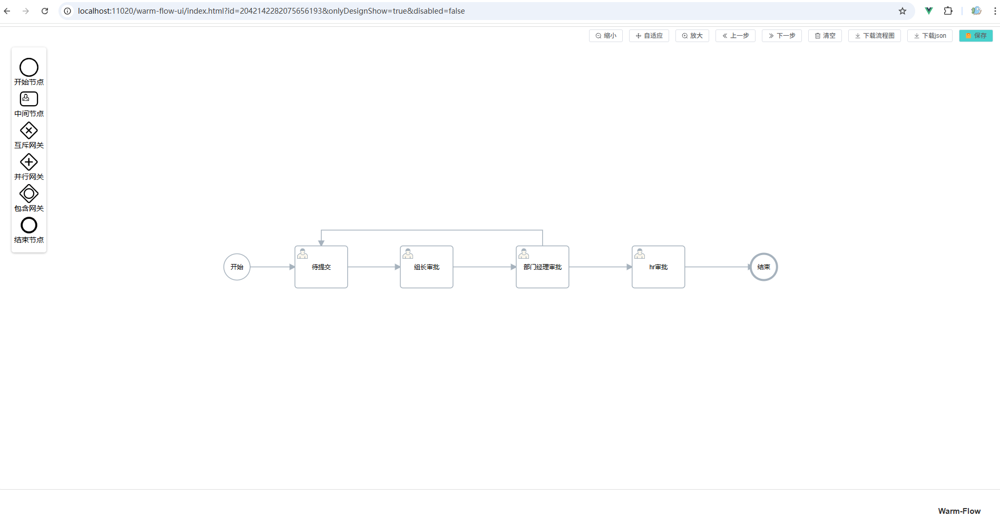

# Warm Flow 工作流

Dromara Warm-Flow，国产的工作流引擎，以其简洁轻量、五脏俱全、灵活扩展性强的特点，成为了众多开发者的首选。它不仅可以通过jar包快速集成设计器，同时原生支持经典和仿钉钉双模式

- [官网链接](https://www.warm-flow.com/)


## 基础配置

### 添加依赖

```xml
<!-- 项目属性 -->
<properties>
    <mybatis-plus.version>3.5.10</mybatis-plus.version>
    <warm-flow.version>1.8.5</warm-flow.version>
</properties>
<!-- 项目依赖 -->
<dependencies>
    
    <!-- MySQL数据库驱动 -->
    <dependency>
        <groupId>com.mysql</groupId>
        <artifactId>mysql-connector-j</artifactId>
    </dependency>
    
    <!-- Mybatis Plus 数据库框架 -->
    <dependency>
        <groupId>com.baomidou</groupId>
        <artifactId>mybatis-plus-spring-boot3-starter</artifactId>
    </dependency>
    
    <!-- Dromara Warm-Flow，国产的工作流引擎 -->
    <dependency>
        <groupId>org.dromara.warm</groupId>
        <artifactId>warm-flow-mybatis-plus-sb3-starter</artifactId>
        <version>${warm-flow.version}</version>
    </dependency>
    
</dependencies>
<!-- Spring Boot 依赖管理 -->
<dependencyManagement>
    <dependencies>
        <dependency>
            <groupId>org.springframework.boot</groupId>
            <artifactId>spring-boot-dependencies</artifactId>
            <version>${spring-boot.version}</version>
            <type>pom</type>
            <scope>import</scope>
        </dependency>
        <!-- MyBatis Plus 依赖管理 -->
        <dependency>
            <groupId>com.baomidou</groupId>
            <artifactId>mybatis-plus-bom</artifactId>
            <version>${mybatis-plus.version}</version>
            <type>pom</type>
            <scope>import</scope>
        </dependency>
    </dependencies>
</dependencyManagement>
```

### 添加配置

`application.yml`

```yaml
---
# 数据库的相关配置
spring:
  datasource:
    url: jdbc:mysql://192.168.1.12:40001/warmflow_1.8.5  # MySQL数据库连接URL
    username: root  # 数据库用户名
    password: Admin@123  # 数据库密码
    # driver-class-name: com.mysql.cj.jdbc.Driver  # 数据库驱动类，框架会自动适配
    type: com.zaxxer.hikari.HikariDataSource  # 使用 HikariCP 数据源
    hikari:
      maximum-pool-size: 1000  # 最大连接池大小
      minimum-idle: 10  # 最小空闲连接数
      idle-timeout: 30000  # 空闲连接超时时间，单位毫秒
      connection-timeout: 30000  # 获取连接的最大等待时间，单位毫秒
# Mybatis Plus的配置 https://baomidou.com/reference
mybatis-plus:
  global-config:
    banner: false
  configuration:
    log-impl: org.apache.ibatis.logging.nologging.NoLoggingImpl
---
# WarmFlow 配置
warm-flow:
  enabled: true
  banner: true
  ui: true
  key_type: SnowId19
  logic_delete: true
  data_source_type: mysql
```

### 创建 MyBatisPlusConfiguration

```java
package io.github.atengk.flow.config;

import com.baomidou.mybatisplus.annotation.DbType;
import com.baomidou.mybatisplus.extension.plugins.MybatisPlusInterceptor;
import com.baomidou.mybatisplus.extension.plugins.inner.PaginationInnerInterceptor;
import org.mybatis.spring.annotation.MapperScan;
import org.springframework.context.annotation.Bean;
import org.springframework.context.annotation.Configuration;

@Configuration
@MapperScan("io.github.atengk.flow.**.mapper")
public class MyBatisPlusConfiguration {

    /**
     * 添加分页插件
     * https://baomidou.com/plugins/pagination/
     */
    @Bean
    public MybatisPlusInterceptor mybatisPlusInterceptor() {
        MybatisPlusInterceptor interceptor = new MybatisPlusInterceptor();
        interceptor.addInnerInterceptor(new PaginationInnerInterceptor(DbType.MYSQL)); // 如果配置多个插件, 切记分页最后添加
        // 如果有多数据源可以不配具体类型, 否则都建议配上具体的 DbType
        return interceptor;
    }
}
```

### 创建表

```mysql
CREATE TABLE `flow_definition`
(
    `id`              bigint          NOT NULL COMMENT '主键id',
    `flow_code`       varchar(40)     NOT NULL COMMENT '流程编码',
    `flow_name`       varchar(100)    NOT NULL COMMENT '流程名称',
    `model_value`            varchar(40)     NOT NULL DEFAULT 'CLASSICS' COMMENT '设计器模型（CLASSICS经典模型 MIMIC仿钉钉模型）',
    `category`        varchar(100)             DEFAULT NULL COMMENT '流程类别',
    `version`         varchar(20)     NOT NULL COMMENT '流程版本',
    `is_publish`      tinyint(1)      NOT NULL DEFAULT '0' COMMENT '是否发布（0未发布 1已发布 9失效）',
    `form_custom`     char(1)                  DEFAULT 'N' COMMENT '审批表单是否自定义（Y是 N否）',
    `form_path`       varchar(100)             DEFAULT NULL COMMENT '审批表单路径',
    `activity_status` tinyint(1)      NOT NULL DEFAULT '1' COMMENT '流程激活状态（0挂起 1激活）',
    `listener_type`   varchar(100)             DEFAULT NULL COMMENT '监听器类型',
    `listener_path`   varchar(400)             DEFAULT NULL COMMENT '监听器路径',
    `ext`             varchar(500)             DEFAULT NULL COMMENT '业务详情 存业务表对象json字符串',
    `create_time`     datetime                 DEFAULT NULL COMMENT '创建时间',
    `create_by`       varchar(64)          DEFAULT '' COMMENT '创建人',
    `update_time`     datetime                 DEFAULT NULL COMMENT '更新时间',
    `update_by`       varchar(64)          DEFAULT '' COMMENT '更新人',
    `del_flag`        char(1)                  DEFAULT '0' COMMENT '删除标志',
    `tenant_id`       varchar(40)              DEFAULT NULL COMMENT '租户id',
    PRIMARY KEY (`id`) USING BTREE
) ENGINE = InnoDB COMMENT ='流程定义表';

CREATE TABLE `flow_node`
(
    `id`              bigint        NOT NULL COMMENT '主键id',
    `node_type`       tinyint(1)      NOT NULL COMMENT '节点类型（0开始节点 1中间节点 2结束节点 3互斥网关 4并行网关）',
    `definition_id`   bigint          NOT NULL COMMENT '流程定义id',
    `node_code`       varchar(100)    NOT NULL COMMENT '流程节点编码',
    `node_name`       varchar(100)  DEFAULT NULL COMMENT '流程节点名称',
    `permission_flag` varchar(200)  DEFAULT NULL COMMENT '权限标识（权限类型:权限标识，可以多个，用@@隔开)',
    `node_ratio`      varchar(200) DEFAULT NULL COMMENT '流程签署比例值',
    `coordinate`      varchar(100)  DEFAULT NULL COMMENT '坐标',
    `any_node_skip`   varchar(100)  DEFAULT NULL COMMENT '任意结点跳转',
    `listener_type`   varchar(100)  DEFAULT NULL COMMENT '监听器类型',
    `listener_path`   varchar(400)  DEFAULT NULL COMMENT '监听器路径',
    `form_custom`     char(1)       DEFAULT 'N' COMMENT '审批表单是否自定义（Y是 N否）',
    `form_path`       varchar(100)  DEFAULT NULL COMMENT '审批表单路径',
    `version`         varchar(20)     NOT NULL COMMENT '版本',
    `create_time`     datetime      DEFAULT NULL COMMENT '创建时间',
    `create_by`       varchar(64)          DEFAULT '' COMMENT '创建人',
    `update_time`     datetime      DEFAULT NULL COMMENT '更新时间',
    `update_by`       varchar(64)          DEFAULT '' COMMENT '更新人',
    `ext`             text          COMMENT '节点扩展属性',
    `del_flag`        char(1)       DEFAULT '0' COMMENT '删除标志',
    `tenant_id`       varchar(40)   DEFAULT NULL COMMENT '租户id',
    PRIMARY KEY (`id`) USING BTREE
) ENGINE = InnoDB COMMENT ='流程节点表';

CREATE TABLE `flow_skip`
(
    `id`             bigint       NOT NULL COMMENT '主键id',
    `definition_id`  bigint          NOT NULL COMMENT '流程定义id',
    `now_node_code`  varchar(100)    NOT NULL COMMENT '当前流程节点的编码',
    `now_node_type`  tinyint(1)   DEFAULT NULL COMMENT '当前节点类型（0开始节点 1中间节点 2结束节点 3互斥网关 4并行网关）',
    `next_node_code` varchar(100)    NOT NULL COMMENT '下一个流程节点的编码',
    `next_node_type` tinyint(1)   DEFAULT NULL COMMENT '下一个节点类型（0开始节点 1中间节点 2结束节点 3互斥网关 4并行网关）',
    `skip_name`      varchar(100) DEFAULT NULL COMMENT '跳转名称',
    `skip_type`      varchar(40)  DEFAULT NULL COMMENT '跳转类型（PASS审批通过 REJECT退回）',
    `skip_condition` varchar(200) DEFAULT NULL COMMENT '跳转条件',
    `coordinate`     varchar(100) DEFAULT NULL COMMENT '坐标',
    `create_time`    datetime     DEFAULT NULL COMMENT '创建时间',
    `create_by`       varchar(64)          DEFAULT '' COMMENT '创建人',
    `update_time`    datetime     DEFAULT NULL COMMENT '更新时间',
    `update_by`       varchar(64)          DEFAULT '' COMMENT '更新人',
    `del_flag`       char(1)      DEFAULT '0' COMMENT '删除标志',
    `tenant_id`      varchar(40)  DEFAULT NULL COMMENT '租户id',
    PRIMARY KEY (`id`) USING BTREE
) ENGINE = InnoDB COMMENT ='节点跳转关联表';

CREATE TABLE `flow_instance`
(
    `id`              bigint      NOT NULL COMMENT '主键id',
    `definition_id`   bigint      NOT NULL COMMENT '对应flow_definition表的id',
    `business_id`     varchar(40) NOT NULL COMMENT '业务id',
    `node_type`       tinyint(1)  NOT NULL COMMENT '节点类型（0开始节点 1中间节点 2结束节点 3互斥网关 4并行网关）',
    `node_code`       varchar(40) NOT NULL COMMENT '流程节点编码',
    `node_name`       varchar(100)         DEFAULT NULL COMMENT '流程节点名称',
    `variable`        text COMMENT '任务变量',
    `flow_status`     varchar(20) NOT NULL COMMENT '流程状态（0待提交 1审批中 2审批通过 4终止 5作废 6撤销 8已完成 9已退回 10失效 11拿回）',
    `activity_status` tinyint(1)  NOT NULL DEFAULT '1' COMMENT '流程激活状态（0挂起 1激活）',
    `def_json`        text COMMENT '流程定义json',
    `create_time`     datetime             DEFAULT NULL COMMENT '创建时间',
    `create_by`       varchar(64)          DEFAULT '' COMMENT '创建人',
    `update_time`     datetime             DEFAULT NULL COMMENT '更新时间',
    `update_by`       varchar(64)          DEFAULT '' COMMENT '更新人',
    `ext`             varchar(500)         DEFAULT NULL COMMENT '扩展字段，预留给业务系统使用',
    `del_flag`        char(1)              DEFAULT '0' COMMENT '删除标志',
    `tenant_id`       varchar(40)          DEFAULT NULL COMMENT '租户id',
    PRIMARY KEY (`id`) USING BTREE
) ENGINE = InnoDB COMMENT ='流程实例表';

CREATE TABLE `flow_task`
(
    `id`            bigint       NOT NULL COMMENT '主键id',
    `definition_id` bigint       NOT NULL COMMENT '对应flow_definition表的id',
    `instance_id`   bigint       NOT NULL COMMENT '对应flow_instance表的id',
    `node_code`     varchar(100) NOT NULL COMMENT '节点编码',
    `node_name`     varchar(100) DEFAULT NULL COMMENT '节点名称',
    `node_type`     tinyint(1)   NOT NULL COMMENT '节点类型（0开始节点 1中间节点 2结束节点 3互斥网关 4并行网关）',
    `flow_status`     varchar(20) NOT NULL COMMENT '流程状态（0待提交 1审批中 2审批通过 4终止 5作废 6撤销 8已完成 9已退回 10失效 11拿回）',
    `form_custom`   char(1)      DEFAULT 'N' COMMENT '审批表单是否自定义（Y是 N否）',
    `form_path`     varchar(100) DEFAULT NULL COMMENT '审批表单路径',
    `create_time`   datetime     DEFAULT NULL COMMENT '创建时间',
    `create_by`       varchar(64)          DEFAULT '' COMMENT '创建人',
    `update_time`   datetime     DEFAULT NULL COMMENT '更新时间',
    `update_by`       varchar(64)          DEFAULT '' COMMENT '更新人',
    `del_flag`      char(1)      DEFAULT '0' COMMENT '删除标志',
    `tenant_id`     varchar(40)  DEFAULT NULL COMMENT '租户id',
    PRIMARY KEY (`id`) USING BTREE
) ENGINE = InnoDB COMMENT ='待办任务表';

CREATE TABLE `flow_his_task`
(
    `id`               bigint(20)                   NOT NULL COMMENT '主键id',
    `definition_id`    bigint(20)                   NOT NULL COMMENT '对应flow_definition表的id',
    `instance_id`      bigint(20)                   NOT NULL COMMENT '对应flow_instance表的id',
    `task_id`          bigint(20)                   NOT NULL COMMENT '对应flow_task表的id',
    `node_code`        varchar(100)                 DEFAULT NULL COMMENT '开始节点编码',
    `node_name`        varchar(100)                 DEFAULT NULL COMMENT '开始节点名称',
    `node_type`        tinyint(1)                   DEFAULT NULL COMMENT '开始节点类型（0开始节点 1中间节点 2结束节点 3互斥网关 4并行网关）',
    `target_node_code` varchar(200)                 DEFAULT NULL COMMENT '目标节点编码',
    `target_node_name` varchar(200)                 DEFAULT NULL COMMENT '结束节点名称',
    `approver`         varchar(40)                  DEFAULT NULL COMMENT '审批人',
    `cooperate_type`   tinyint(1)                   NOT NULL DEFAULT '0' COMMENT '协作方式(1审批 2转办 3委派 4会签 5票签 6加签 7减签)',
    `collaborator`     varchar(500)                  DEFAULT NULL COMMENT '协作人',
    `skip_type`        varchar(10)                  NOT NULL COMMENT '流转类型（PASS通过 REJECT退回 NONE无动作）',
    `flow_status`      varchar(20)                  NOT NULL COMMENT '流程状态（0待提交 1审批中 2审批通过 4终止 5作废 6撤销 8已完成 9已退回 10失效 11拿回）',
    `form_custom`      char(1)                      DEFAULT 'N' COMMENT '审批表单是否自定义（Y是 N否）',
    `form_path`        varchar(100)                 DEFAULT NULL COMMENT '审批表单路径',
    `message`          varchar(500)                 DEFAULT NULL COMMENT '审批意见',
    `variable`         TEXT                         DEFAULT NULL COMMENT '任务变量',
    `ext`              TEXT                         DEFAULT NULL COMMENT '业务详情 存业务表对象json字符串',
    `create_time`      datetime                     DEFAULT NULL COMMENT '任务开始时间',
    `update_time`      datetime                     DEFAULT NULL COMMENT '审批完成时间',
    `del_flag`         char(1)                      DEFAULT '0' COMMENT '删除标志',
    `tenant_id`        varchar(40)                  DEFAULT NULL COMMENT '租户id',
    PRIMARY KEY (`id`) USING BTREE
) ENGINE = InnoDB COMMENT ='历史任务记录表';


CREATE TABLE `flow_user`
(
    `id`           bigint      NOT NULL COMMENT '主键id',
    `type`         char(1)         NOT NULL COMMENT '人员类型（1待办任务的审批人权限 2待办任务的转办人权限 3待办任务的委托人权限）',
    `processed_by` varchar(80) DEFAULT NULL COMMENT '权限人',
    `associated`   bigint          NOT NULL COMMENT '任务表id',
    `create_time`  datetime    DEFAULT NULL COMMENT '创建时间',
    `create_by`    varchar(80) DEFAULT NULL COMMENT '创建人',
    `update_time`  datetime    DEFAULT NULL COMMENT '更新时间',
    `update_by`       varchar(64)          DEFAULT '' COMMENT '创建人',
    `del_flag`     char(1)     DEFAULT '0' COMMENT '删除标志',
    `tenant_id`    varchar(40) DEFAULT NULL COMMENT '租户id',
    PRIMARY KEY (`id`) USING BTREE,
    KEY `user_processed_type` (`processed_by`, `type`),
    KEY `user_associated` (`associated`) USING BTREE
) ENGINE = InnoDB COMMENT ='流程用户表';
```


## 快速开始

### 流程定义

`resources/flow/demo-flow.json`

```json
{
  "flowCode": "leaveFlow-serial1",
  "flowName": "串行-简单",
  "formCustom": "N",
  "formPath": "system/leave/approve",
  "version": "1",
  "nodeList": [
    {
      "coordinate": "120,280|120,280",
      "nodeCode": "1",
      "nodeName": "开始",
      "nodeRatio": 0.000,
      "nodeType": 0,
      "skipList": [
        {
          "coordinate": "140,280;230,280",
          "nextNodeCode": "2",
          "nowNodeCode": "1",
          "skipType": "PASS"
        }
      ]
    },
    {
      "coordinate": "280,280|280,280",
      "nodeCode": "2",
      "nodeName": "待提交",
      "nodeRatio": 0.000,
      "nodeType": 1,
      "permissionFlag": "role:1@@role:2",
      "skipList": [
        {
          "coordinate": "330,280;430,280",
          "nextNodeCode": "3",
          "nowNodeCode": "2",
          "skipType": "PASS"
        }
      ]
    },
    {
      "coordinate": "480,280|480,280",
      "nodeCode": "3",
      "nodeName": "组长审批",
      "nodeRatio": 0.000,
      "nodeType": 1,
      "permissionFlag": "role:1@@role:2",
      "skipList": [
        {
          "coordinate": "530,280;650,280",
          "nextNodeCode": "4",
          "nowNodeCode": "3",
          "skipType": "PASS"
        }
      ]
    },
    {
      "coordinate": "700,280|700,280",
      "nodeCode": "4",
      "nodeName": "部门经理审批",
      "nodeRatio": 0.000,
      "nodeType": 1,
      "permissionFlag": "role:1@@role:2",
      "skipList": [
        {
          "coordinate": "750,280;870,280",
          "nextNodeCode": "5",
          "nowNodeCode": "4",
          "skipType": "PASS"
        },
        {
          "coordinate": "700,240;700,210;280,210;280,240",
          "nextNodeCode": "2",
          "nowNodeCode": "4",
          "skipType": "REJECT"
        }
      ]
    },
    {
      "coordinate": "920,280|920,280",
      "nodeCode": "5",
      "nodeName": "hr审批",
      "nodeRatio": 0.000,
      "nodeType": 1,
      "permissionFlag": "role:1@@role:2",
      "skipList": [
        {
          "coordinate": "970,280;1100,280",
          "nextNodeCode": "6",
          "nowNodeCode": "5",
          "skipType": "PASS"
        }
      ]
    },
    {
      "coordinate": "1120,280|1120,280",
      "nodeCode": "6",
      "nodeName": "结束",
      "nodeRatio": 0.000,
      "nodeType": 2,
      "skipList": [
      ]
    }
  ]
}

```

### 流程服务

```java
package io.github.atengk.flow.service;

import cn.hutool.core.io.resource.ResourceUtil;
import lombok.RequiredArgsConstructor;
import org.dromara.warm.flow.core.FlowEngine;
import org.dromara.warm.flow.core.dto.FlowParams;
import org.dromara.warm.flow.core.entity.Definition;
import org.dromara.warm.flow.core.entity.Instance;
import org.dromara.warm.flow.core.enums.SkipType;
import org.dromara.warm.flow.core.service.DefService;
import org.dromara.warm.flow.core.service.InsService;
import org.dromara.warm.flow.core.service.TaskService;
import org.springframework.stereotype.Service;

import java.io.InputStream;
import java.util.Arrays;
import java.util.Collections;
import java.util.List;

/**
 * WarmFlow 流程服务
 *
 * @author Ateng
 * @since 2026-04-09
 */
@Service
@RequiredArgsConstructor
public class WarmFlowService {

    private final DefService defService;
    private final InsService insService;
    private final TaskService taskService;

    /**
     * 部署流程（导入 JSON）
     */
    public Long deploy(String path) {
        InputStream is = ResourceUtil.getStream(path);
        Definition definition = defService.importIs(is);
        return definition.getId();
    }

    /**
     * 根据 flowCode 获取定义ID
     */
    public Long getDefId(String flowCode) {
        return defService.queryByCodeList(Collections.singletonList(flowCode))
                .stream()
                .findFirst()
                .map(Definition::getId)
                .orElseThrow(() -> new RuntimeException("流程不存在"));
    }

    /**
     * 发布流程
     */
    public void publish(String flowCode) {
        defService.publish(getDefId(flowCode));
    }

    /**
     * 启动流程实例
     */
    public Long start(String flowCode, String businessId, String userId) {
        FlowParams params = buildBaseParams(flowCode, userId);

        Instance instance = insService.start(businessId, params);
        return instance.getId();
    }

    /**
     * 审批通过（基于实例ID）
     */
    public void approve(Long insId, String flowCode, String userId) {
        FlowParams params = buildBaseParams(flowCode, userId)
                .skipType(SkipType.PASS.getKey());

        taskService.skipByInsId(insId, params);
    }

    /**
     * 审批拒绝
     */
    public void reject(Long insId, String flowCode, String userId) {
        FlowParams params = buildBaseParams(flowCode, userId)
                .skipType(SkipType.REJECT.getKey());

        taskService.skipByInsId(insId, params);
    }

    /**
     * 查询当前任务
     */
    public List<Long> getCurrentTaskIds(Long insId) {
        return taskService.list(
                        FlowEngine.newTask().setInstanceId(insId)
                ).stream()
                .map(task -> task.getId())
                .toList();
    }

    /**
     * 构建基础 FlowParams（核心）
     */
    private FlowParams buildBaseParams(String flowCode, String userId) {
        return FlowParams.build()
                .flowCode(flowCode)
                .handler(userId)
                .permissionFlag(Arrays.asList(
                        "role:admin",
                        "user:" + userId
                ));
    }

}
```

### 流程接口

```java
package io.github.atengk.flow.controller;

import io.github.atengk.flow.service.WarmFlowService;
import lombok.RequiredArgsConstructor;
import org.springframework.web.bind.annotation.PostMapping;
import org.springframework.web.bind.annotation.RequestMapping;
import org.springframework.web.bind.annotation.RequestParam;
import org.springframework.web.bind.annotation.RestController;

/**
 * 流程接口
 *
 * @author Ateng
 * @since 2026-04-09
 */
@RestController
@RequestMapping("/flow")
@RequiredArgsConstructor
public class FlowController {

    private final WarmFlowService flowService;

    /**
     * 部署流程
     */
    @PostMapping("/deploy")
    public Long deploy() {
        return flowService.deploy("flow/demo-flow.json");
    }

    /**
     * 发布流程
     */
    @PostMapping("/publish")
    public String publish(@RequestParam String flowCode) {
        flowService.publish(flowCode);
        return "OK";
    }

    /**
     * 启动流程
     */
    @PostMapping("/start")
    public Long start(@RequestParam String flowCode,
                      @RequestParam String businessId,
                      @RequestParam String userId) {
        return flowService.start(flowCode, businessId, userId);
    }

    /**
     * 审批通过
     */
    @PostMapping("/approve")
    public String approve(@RequestParam Long insId,
                          @RequestParam String flowCode,
                          @RequestParam String userId) {
        flowService.approve(insId, flowCode, userId);
        return "OK";
    }

}
```

### 开始流程

流程执行时序图

```text
用户发起
   ↓
start()
   ↓
生成 Instance
   ↓
生成 Task
   ↓
approve()
   ↓
skipByInsId()
   ↓
流转到下一个节点
   ↓
（直到 end）
```

#### ① 部署流程

```http
POST /flow/deploy
```

返回：

```json
2042142282075656193
```

👉 这是 `defId`

------

#### ② 发布流程

```http
POST /flow/publish?flowCode=leaveFlow-serial1
```

------

#### ③ 启动流程

```http
POST /flow/start?flowCode=leaveFlow-serial1&businessId=1001&userId=1
```

返回：

```json
2042144045637902338
```

👉 这是 `insId`（流程实例ID）

------

#### ④ 查询当前任务

```http
GET /flow/tasks?insId=123456789
```

返回：

```json
[88888888]
```

👉 当前待办任务ID（调试用）

------

#### ⑤ 审批通过

```http
POST /flow/approve?insId=2042144045637902338&flowCode=leaveFlow-serial1&userId=1
```

------

#### ⑥ 再查任务（确认是否结束）

```http
GET /flow/tasks?insId=123456789
```

情况1：流程结束

```json
[]
```

👉 ✔ 已结束

------

情况2：还有节点

```json
[99999999]
```

👉 再调用 `/approve`

------


## 集成设计器

**添加依赖**

```xml
<!-- Dromara Warm-Flow，国产的工作流引擎设计器 -->
<dependency>
    <groupId>org.dromara.warm</groupId>
    <artifactId>warm-flow-plugin-ui-sb-web</artifactId>
    <version>${warm-flow.version}</version>
</dependency>
```

**访问设计器**

**设计器页面入口是访问后端地址(前后端不分离)：`ip:port/warm-flow-ui/index.html?id=${definitionId}&onlyDesignShow=${onlyDesignShow}&Authorization=${token}`**

- definitionId：流程定义id，如果没传，则认定是新增流程，会初始化流程节点，否则则是编辑或者查看
- onlyDesignShow：是否独显流程设计，传true单独访问流程设计器，不显示流程基础信息
- disabled：是否可编辑 , true:不可标记 false:可标记 (本身warm-flow工作流内部会通过发布状态自行判断是否可以编辑，但是如果是需要查看的场景可以单独可控制)
- token：用户token，[共享后端权限(如token)](https://www.warm-flow.com/master/primary/designerIntroduced.html#_4-共享后端权限-如token)


